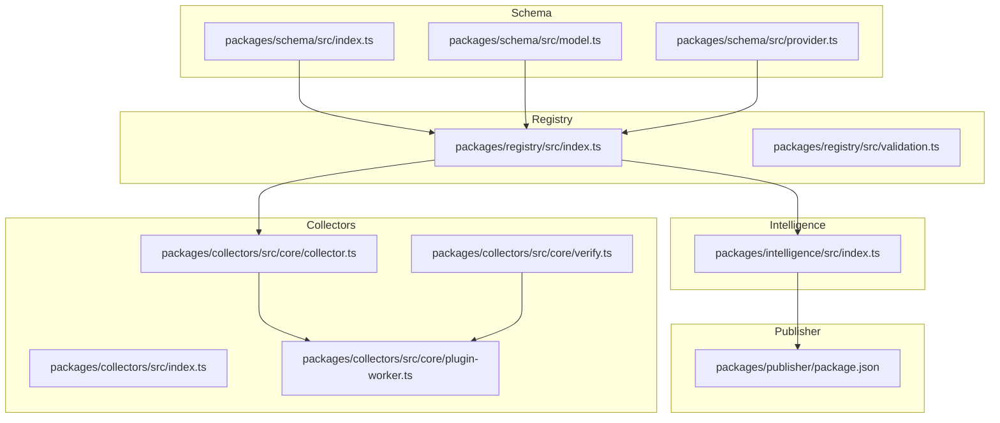
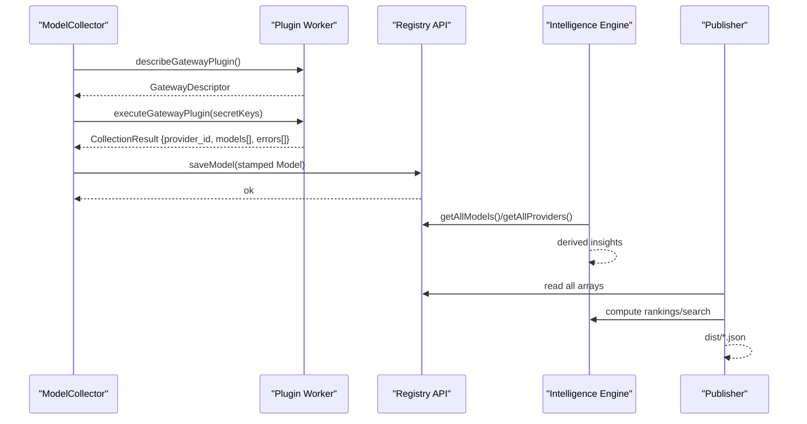
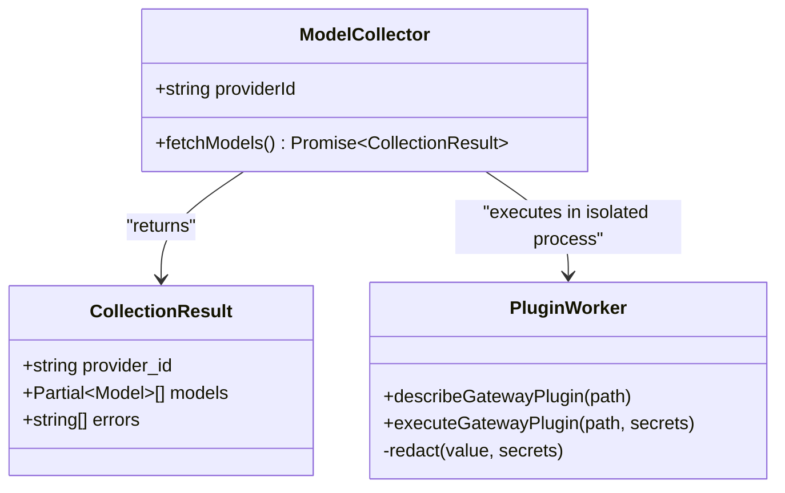
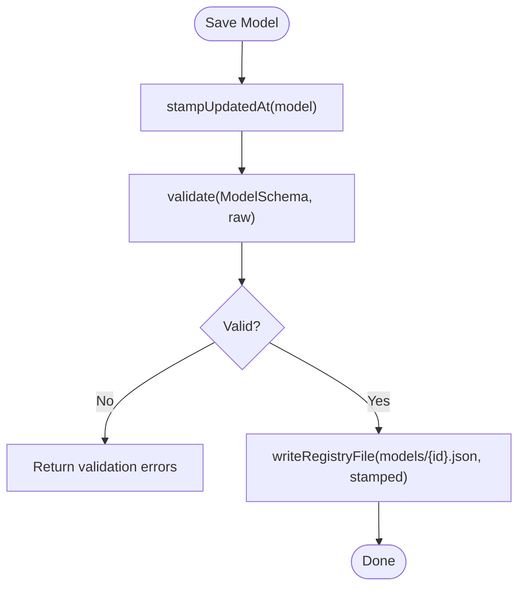
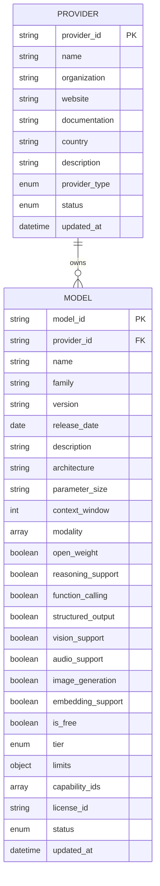
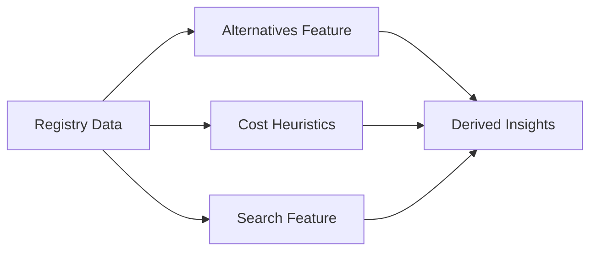
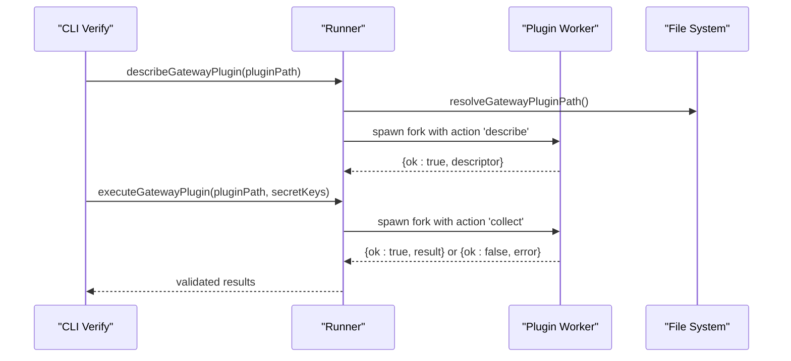
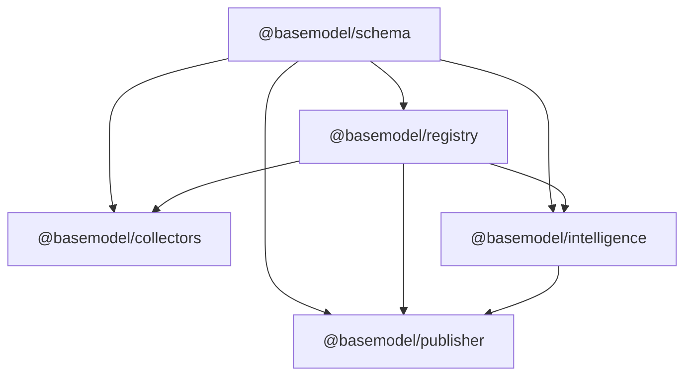

# Integration Patterns & Extension Points

<cite>
**Referenced Files in This Document**
- [README.md](file://README.md)
- [package.json](file://package.json)
- [packages/schema/src/index.ts](file://packages/schema/src/index.ts)
- [packages/schema/src/model.ts](file://packages/schema/src/model.ts)
- [packages/schema/src/provider.ts](file://packages/schema/src/provider.ts)
- [packages/registry/src/index.ts](file://packages/registry/src/index.ts)
- [packages/registry/src/validation.ts](file://packages/registry/src/validation.ts)
- [packages/collectors/src/core/collector.ts](file://packages/collectors/src/core/collector.ts)
- [packages/collectors/src/core/plugin-worker.ts](file://packages/collectors/src/core/plugin-worker.ts)
- [packages/collectors/src/core/verify.ts](file://packages/collectors/src/core/verify.ts)
- [packages/collectors/package.json](file://packages/collectors/package.json)
- [packages/intelligence/src/index.ts](file://packages/intelligence/src/index.ts)
- [packages/publisher/package.json](file://packages/publisher/package.json)
- [CONTRIBUTING.md](file://CONTRIBUTING.md)
</cite>

## Table of Contents
1. [Introduction](#introduction)
2. [Project Structure](#project-structure)
3. [Core Components](#core-components)
4. [Architecture Overview](#architecture-overview)
5. [Detailed Component Analysis](#detailed-component-analysis)
6. [Dependency Analysis](#dependency-analysis)
7. [Performance Considerations](#performance-considerations)
8. [Troubleshooting Guide](#troubleshooting-guide)
9. [Conclusion](#conclusion)
10. [Appendices](#appendices)

## Introduction
This document explains how to extend the BaseModel platform through its integration patterns and extension points. It focuses on:
- Custom collectors for providers and gateways
- Schema extensions and validation contracts
- Intelligence algorithms and derived insights
- Plugin architecture, interface contracts, and security boundaries
- Practical integration scenarios, testing strategies, and debugging techniques

BaseModel is a data layer that discovers, validates, normalizes, stores, analyzes, and publishes structured knowledge about AI models. It is not an inference runtime or end-user application.

**Section sources**
- [README.md:1-61](file://README.md#L1-L61)

## Project Structure
The repository is organized into focused packages:
- schema: Canonical Zod schemas and TypeScript types (source of truth for data contracts)
- registry: Storage, validation, normalization, and merge utilities
- collectors: Provider and gateway collectors with plugin isolation
- intelligence: Derived rankings, search, recommendations, and cost heuristics
- publisher: Dataset generation for distribution
- cli: Command-line interface for querying intelligence

**Diagram sources**
- [packages/schema/src/index.ts:1-27](file://packages/schema/src/index.ts#L1-L27)
- [packages/schema/src/model.ts:1-65](file://packages/schema/src/model.ts#L1-L65)
- [packages/schema/src/provider.ts:1-29](file://packages/schema/src/provider.ts#L1-L29)
- [packages/registry/src/index.ts:1-169](file://packages/registry/src/index.ts#L1-L169)
- [packages/registry/src/validation.ts:1-42](file://packages/registry/src/validation.ts#L1-L42)
- [packages/collectors/src/index.ts:1-2](file://packages/collectors/src/index.ts#L1-L2)
- [packages/collectors/src/core/collector.ts:1-23](file://packages/collectors/src/core/collector.ts#L1-L23)
- [packages/collectors/src/core/plugin-worker.ts:1-30](file://packages/collectors/src/core/plugin-worker.ts#L1-L30)
- [packages/collectors/src/core/verify.ts:1-25](file://packages/collectors/src/core/verify.ts#L1-L25)
- [packages/intelligence/src/index.ts:1-15](file://packages/intelligence/src/index.ts#L1-L15)
- [packages/publisher/package.json:1-37](file://packages/publisher/package.json#L1-L37)

**Section sources**
- [README.md:10-30](file://README.md#L10-L30)
- [package.json:17-25](file://package.json#L17-L25)

## Core Components
- Schema package defines canonical entities such as Model and Provider using Zod schemas and exports corresponding TypeScript types.
- Registry package provides read/write helpers, validation wrappers, and persistence utilities over JSON files under data/registry/.
- Collectors package exposes the ModelCollector interface and enforces safety limits for plugins. Plugins are executed in isolated workers.
- Intelligence package exposes derived features like alternatives, cost heuristics, and search over registry data.
- Publisher package orchestrates dataset generation from registry and intelligence outputs.

Key extension surfaces:
- Implement ModelCollector for custom provider/gateway collectors
- Extend or validate new fields via schema definitions
- Add intelligence features by composing registry queries
- Use registry APIs to persist normalized records

**Section sources**
- [packages/schema/src/index.ts:1-27](file://packages/schema/src/index.ts#L1-L27)
- [packages/schema/src/model.ts:1-65](file://packages/schema/src/model.ts#L1-L65)
- [packages/schema/src/provider.ts:1-29](file://packages/schema/src/provider.ts#L1-L29)
- [packages/registry/src/index.ts:1-169](file://packages/registry/src/index.ts#L1-L169)
- [packages/registry/src/validation.ts:1-42](file://packages/registry/src/validation.ts#L1-L42)
- [packages/collectors/src/core/collector.ts:1-23](file://packages/collectors/src/core/collector.ts#L1-L23)
- [packages/intelligence/src/index.ts:1-15](file://packages/intelligence/src/index.ts#L1-L15)
- [packages/publisher/package.json:1-37](file://packages/publisher/package.json#L1-L37)

## Architecture Overview
The system follows a clear pipeline:
- Collectors fetch raw data from providers/gateways and normalize it into Partial<Model> records
- Registry validates and persists canonical records
- Intelligence derives rankings, alternatives, and search indices
- Publisher generates final datasets

**Diagram sources**
- [packages/collectors/src/core/collector.ts:1-23](file://packages/collectors/src/core/collector.ts#L1-L23)
- [packages/collectors/src/core/plugin-worker.ts:1-30](file://packages/collectors/src/core/plugin-worker.ts#L1-L30)
- [packages/registry/src/index.ts:1-169](file://packages/registry/src/index.ts#L1-L169)
- [packages/intelligence/src/index.ts:1-15](file://packages/intelligence/src/index.ts#L1-L15)
- [packages/publisher/package.json:1-37](file://packages/publisher/package.json#L1-L37)

## Detailed Component Analysis

### Collector Interface and Plugin Isolation
- ModelCollector defines providerId and fetchModels(), returning CollectionResult with partial model records and errors.
- Safety constraints enforce MAX_PLUGIN_MODELS and MAX_PLUGIN_RESPONSE_BYTES to prevent abuse.
- Plugins run inside isolated child processes via a worker protocol with redacted secrets.

**Diagram sources**
- [packages/collectors/src/core/collector.ts:1-23](file://packages/collectors/src/core/collector.ts#L1-L23)
- [packages/collectors/src/core/plugin-worker.ts:1-30](file://packages/collectors/src/core/plugin-worker.ts#L1-L30)

**Section sources**
- [packages/collectors/src/core/collector.ts:1-23](file://packages/collectors/src/core/collector.ts#L1-L23)
- [packages/collectors/src/core/plugin-worker.ts:1-30](file://packages/collectors/src/core/plugin-worker.ts#L1-L30)

### Registry Validation and Persistence
- Registry functions wrap Zod schemas to validate and stamp updated_at timestamps.
- All reads parse through schemas; writes stamp freshness metadata.
- Batch operations support rollups for benchmarks and pricing arrays.

**Diagram sources**
- [packages/registry/src/index.ts:39-83](file://packages/registry/src/index.ts#L39-L83)
- [packages/registry/src/validation.ts:11-20](file://packages/registry/src/validation.ts#L11-L20)

**Section sources**
- [packages/registry/src/index.ts:1-169](file://packages/registry/src/index.ts#L1-L169)
- [packages/registry/src/validation.ts:1-42](file://packages/registry/src/validation.ts#L1-L42)

### Schema Contracts and Extension Points
- Model and Provider schemas define strict field formats, enums, and relationships.
- Extending schemas requires updating the canonical definitions and ensuring collectors produce conformant records.
- The schema package re-exports all entity types and schemas for consumers.

**Diagram sources**
- [packages/schema/src/provider.ts:1-29](file://packages/schema/src/provider.ts#L1-L29)
- [packages/schema/src/model.ts:1-65](file://packages/schema/src/model.ts#L1-L65)

**Section sources**
- [packages/schema/src/index.ts:1-27](file://packages/schema/src/index.ts#L1-L27)
- [packages/schema/src/model.ts:1-65](file://packages/schema/src/model.ts#L1-L65)
- [packages/schema/src/provider.ts:1-29](file://packages/schema/src/provider.ts#L1-L29)

### Intelligence Algorithms and Features
- Intelligence package exposes features for alternatives, cost heuristics, and search over registry data.
- Consumers can query models/providers and derive rankings or recommendations based on capabilities, pricing, and benchmarks.

**Diagram sources**
- [packages/intelligence/src/index.ts:1-15](file://packages/intelligence/src/index.ts#L1-L15)

**Section sources**
- [packages/intelligence/src/index.ts:1-15](file://packages/intelligence/src/index.ts#L1-L15)

### Plugin Architecture and Security Boundaries
- Plugins are loaded and executed in isolated child processes.
- Secret keys are redacted before any logging or output.
- Path resolution restricts plugins to the gateways directory and enforces allowed extensions.
- Verification runs through the same isolated boundary as production execution.

**Diagram sources**
- [packages/collectors/src/core/verify.ts:1-25](file://packages/collectors/src/core/verify.ts#L1-L25)
- [packages/collectors/src/core/plugin-worker.ts:1-30](file://packages/collectors/src/core/plugin-worker.ts#L1-L30)

**Section sources**
- [packages/collectors/src/core/verify.ts:1-25](file://packages/collectors/src/core/verify.ts#L1-L25)
- [packages/collectors/src/core/plugin-worker.ts:1-30](file://packages/collectors/src/core/plugin-worker.ts#L1-L30)

### Practical Integration Scenarios

- Adding a New Provider Collector
  - Implement ModelCollector with providerId and fetchModels().
  - Normalize responses into Partial<Model> records.
  - Ensure records pass registry validation and include required identifiers.
  - Test happy path and failure modes; use verify command for gateways.

- Extending Schema Fields
  - Update schema definitions in the schema package.
  - Adjust collectors to populate new fields.
  - Ensure registry validation passes and downstream consumers handle changes.

- Building Intelligence Algorithms
  - Compose registry queries to build rankings, alternatives, or search indexes.
  - Leverage existing features in the intelligence package as building blocks.

- Publishing Datasets
  - Use publisher to generate dist artifacts from registry and intelligence outputs.
  - Maintain consistency between schema, registry, and published datasets.

**Section sources**
- [packages/collectors/src/core/collector.ts:1-23](file://packages/collectors/src/core/collector.ts#L1-L23)
- [packages/registry/src/index.ts:1-169](file://packages/registry/src/index.ts#L1-L169)
- [packages/intelligence/src/index.ts:1-15](file://packages/intelligence/src/index.ts#L1-L15)
- [packages/publisher/package.json:1-37](file://packages/publisher/package.json#L1-L37)
- [CONTRIBUTING.md:43-52](file://CONTRIBUTING.md#L43-L52)

## Dependency Analysis
The workspace uses pnpm workspaces and explicit package dependencies:
- collectors depends on @basemodel/registry and @basemodel/schema
- intelligence depends on @basemodel/schema and @basemodel/registry
- publisher depends on @basemodel/schema, @basemodel/registry, and @basemodel/intelligence

**Diagram sources**
- [packages/collectors/package.json:26-29](file://packages/collectors/package.json#L26-L29)
- [packages/intelligence/package.json:38-41](file://packages/intelligence/package.json#L38-L41)
- [packages/publisher/package.json:23-27](file://packages/publisher/package.json#L23-L27)
- [packages/registry/package.json:22-25](file://packages/registry/package.json#L22-L25)

**Section sources**
- [packages/collectors/package.json:1-40](file://packages/collectors/package.json#L1-L40)
- [packages/intelligence/package.json:1-49](file://packages/intelligence/package.json#L1-L49)
- [packages/publisher/package.json:1-37](file://packages/publisher/package.json#L1-L37)
- [packages/registry/package.json:1-34](file://packages/registry/package.json#L1-L34)

## Performance Considerations
- Enforce MAX_PLUGIN_MODELS and MAX_PLUGIN_RESPONSE_BYTES to limit resource usage in plugins.
- Prefer batch operations in registry where available (e.g., replaceAllBenchmarks).
- Avoid unnecessary HTTP calls in collectors; cache when appropriate and respect rate limits.
- Use typed schemas to reduce parsing overhead and catch errors early.

[No sources needed since this section provides general guidance]

## Troubleshooting Guide
- Verifying Gateways
  - Use the verify command to load and describe plugins safely.
  - Check logs for redacted secrets and ensure paths are within the gateways directory.

- Validation Errors
  - Inspect ValidationResult for detailed field-level messages.
  - Confirm model_id format and required fields match schema expectations.

- Missing Directories or Files
  - Ensure gateways directory exists; the runner handles missing directories gracefully.
  - Confirm file extensions (.ts or .js) for plugins.

- Testing Strategies
  - Mock filesystem and registry functions in tests to avoid real I/O.
  - Stub global fetch to simulate provider responses.
  - Run e2e tests to validate pipeline behavior under controlled conditions.

**Section sources**
- [packages/collectors/src/core/verify.ts:1-25](file://packages/collectors/src/core/verify.ts#L1-L25)
- [packages/registry/src/validation.ts:11-20](file://packages/registry/src/validation.ts#L11-L20)
- [packages/collectors/src/__tests__/plugin-path.test.ts:1-31](file://packages/collectors/src/__tests__/plugin-path.test.ts#L1-L31)
- [packages/collectors/src/__tests__/e2e.test.ts:1-48](file://packages/collectors/src/__tests__/e2e.test.ts#L1-L48)

## Conclusion
BaseModel’s extension model centers on well-defined interfaces and strong validation contracts:
- Implement ModelCollector for new providers/gateways
- Extend schemas carefully and propagate changes across collectors and publishers
- Build intelligence features atop registry data
- Rely on isolated plugin execution and strict path/secrets handling for security

Adhering to these patterns ensures compatibility, reliability, and maintainability across the platform.

[No sources needed since this section summarizes without analyzing specific files]

## Appendices

### Best Practices for Extensions
- Keep collectors idempotent and resilient to partial failures.
- Always stamp updated_at on persisted records.
- Validate inputs early and return meaningful errors.
- Limit plugin memory and response sizes to protect core processes.
- Write comprehensive tests covering success and failure paths.

[No sources needed since this section provides general guidance]