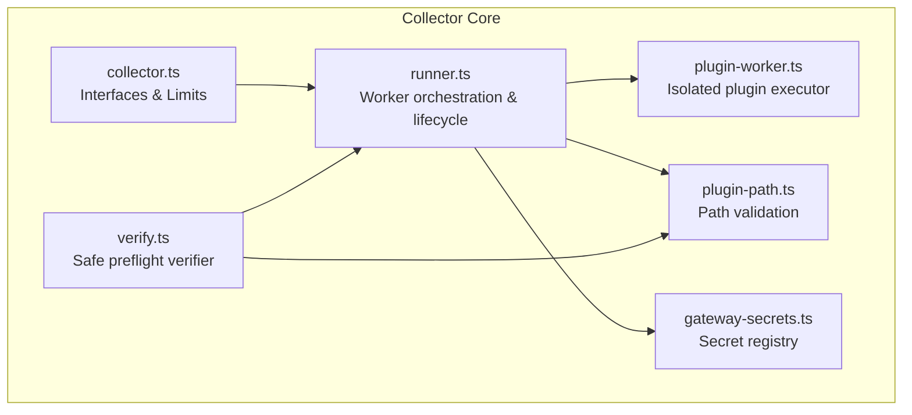
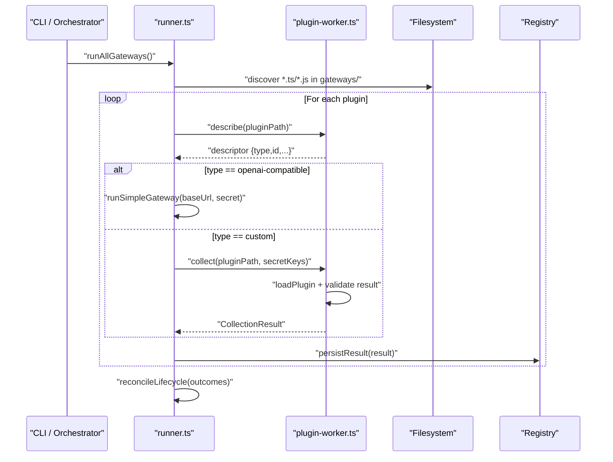
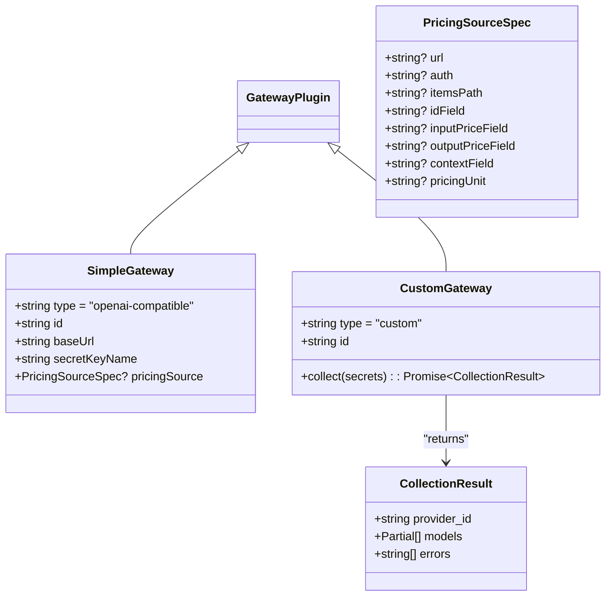
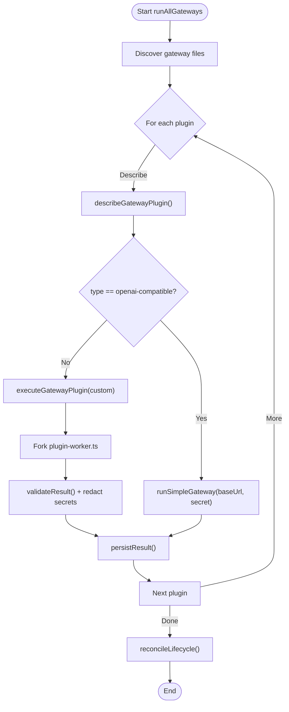
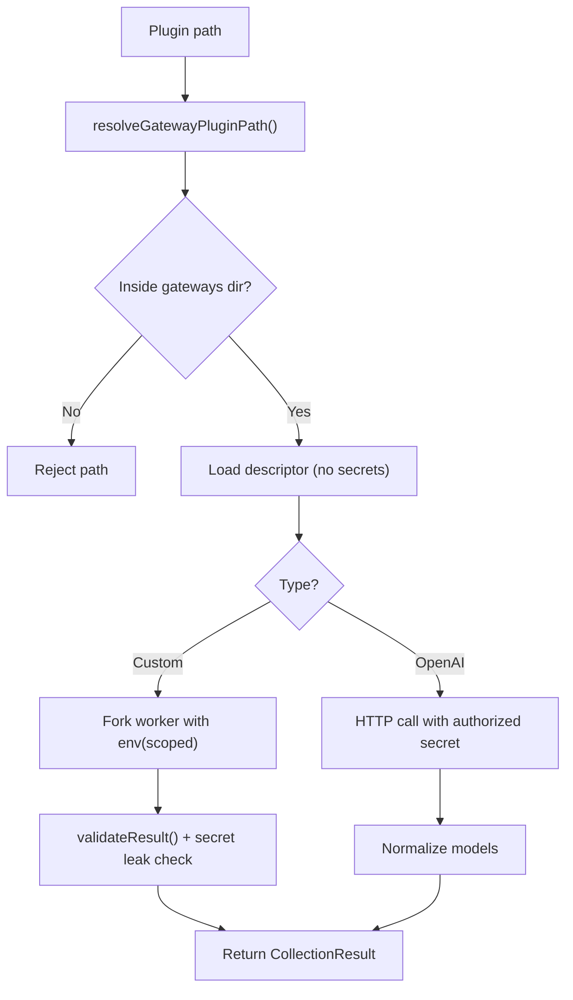
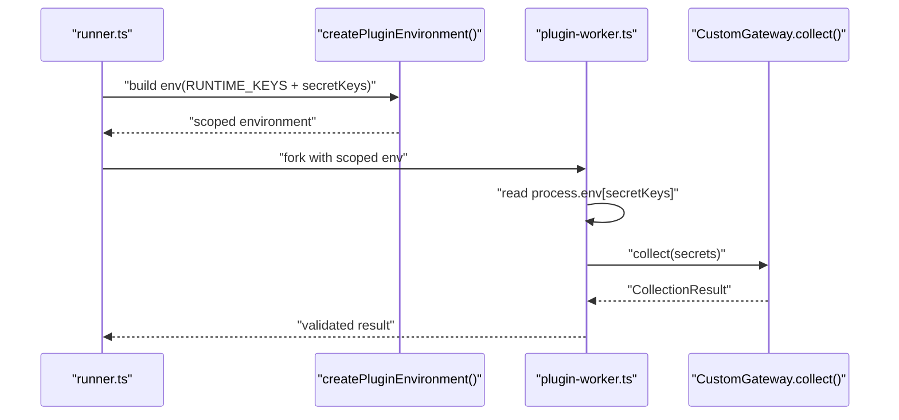
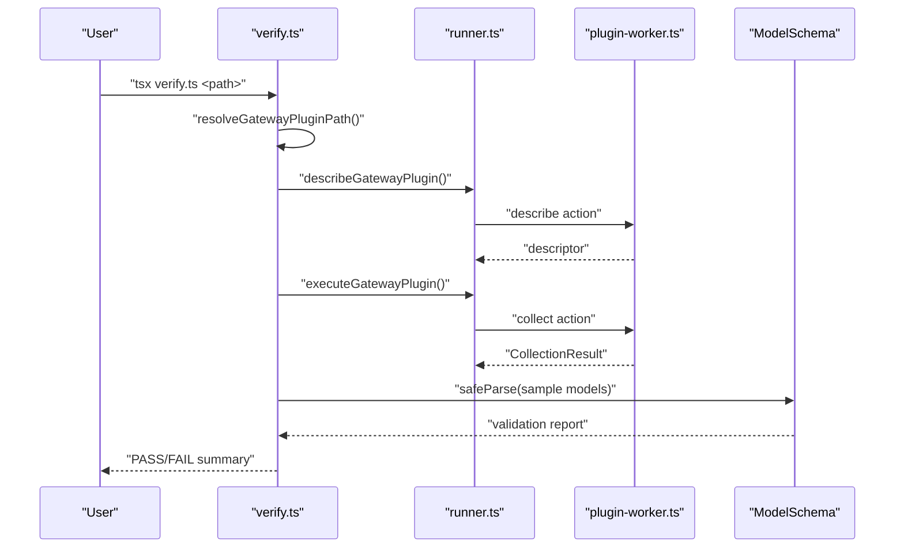
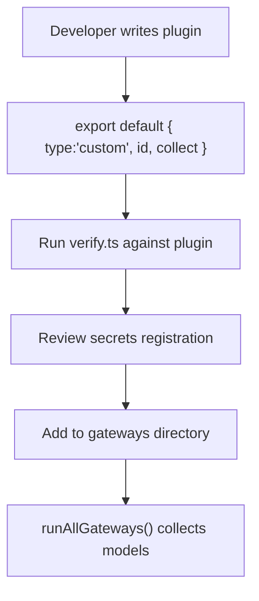
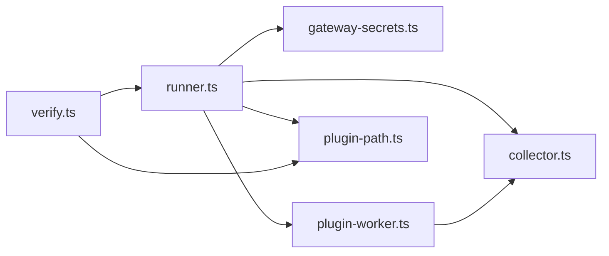

# Plugin Architecture & Interface Contracts

<cite>
**Referenced Files in This Document**
- [README.md](file://README.md)
- [07_Developer_Access.md](file://docs/07_Developer_Access.md)
- [08_Gateway_Plugin_Security.md](file://docs/08_Gateway_Plugin_Security.md)
- [collector.ts](file://packages/collectors/src/core/collector.ts)
- [runner.ts](file://packages/collectors/src/core/runner.ts)
- [plugin-worker.ts](file://packages/collectors/src/core/plugin-worker.ts)
- [plugin-path.ts](file://packages/collectors/src/core/plugin-path.ts)
- [verify.ts](file://packages/collectors/src/core/verify.ts)
- [gateway-secrets.ts](file://packages/collectors/src/core/gateway-secrets.ts)
- [secret-leak-gateway.ts](file://packages/collectors/src/__tests__/fixtures/secret-leak-gateway.ts)
</cite>

## Table of Contents
1. [Introduction](#introduction)
2. [Project Structure](#project-structure)
3. [Core Components](#core-components)
4. [Architecture Overview](#architecture-overview)
5. [Detailed Component Analysis](#detailed-component-analysis)
6. [Dependency Analysis](#dependency-analysis)
7. [Performance Considerations](#performance-considerations)
8. [Troubleshooting Guide](#troubleshooting-guide)
9. [Conclusion](#conclusion)
10. [Appendices](#appendices)

## Introduction
This document explains the plugin architecture and interface contracts used by BaseModel’s collectors to discover, validate, normalize, and publish model intelligence. It covers:
- The plugin lifecycle from discovery to execution
- Dependency injection patterns for secrets and configuration
- Security boundaries, sandboxing via process isolation, and access control
- Examples of creating secure plugins, implementing hooks (via collect), and managing dependencies
- Versioning and compatibility considerations, plus deployment strategies

BaseModel is a data layer that discovers and publishes structured knowledge about AI models; it is not an inference runtime or end-user application.

**Section sources**
- [README.md:1-61](file://README.md#L1-L61)

## Project Structure
The plugin system lives primarily under packages/collectors/src/core with supporting documentation and tests. Key areas:
- Core interfaces and limits define the plugin contract and safety bounds
- Runner orchestrates isolated workers and enforces environment scoping
- Plugin worker executes custom plugins safely
- Path validation ensures plugins are confined to the gateways directory
- Verifier provides a safe preflight check using the same isolation boundary
- Secrets registry centralizes which environment variables each gateway may receive

**Diagram sources**
- [collector.ts:1-89](file://packages/collectors/src/core/collector.ts#L1-L89)
- [runner.ts:1-475](file://packages/collectors/src/core/runner.ts#L1-L475)
- [plugin-worker.ts:1-113](file://packages/collectors/src/core/plugin-worker.ts#L1-L113)
- [plugin-path.ts:1-28](file://packages/collectors/src/core/plugin-path.ts#L1-L28)
- [verify.ts:1-69](file://packages/collectors/src/core/verify.ts#L1-L69)
- [gateway-secrets.ts:1-27](file://packages/collectors/src/core/gateway-secrets.ts#L1-L27)

**Section sources**
- [README.md:11-30](file://README.md#L11-L30)
- [07_Developer_Access.md:105-113](file://docs/07_Developer_Access.md#L105-L113)

## Core Components
- GatewayPlugin types: SimpleGateway (OpenAI-compatible) and CustomGateway (custom collect())
- CollectionResult: standardized output shape for models and errors
- GatewayDescriptor: serializable metadata returned from the isolated worker
- Limits: MAX_PLUGIN_MODELS and MAX_PLUGIN_RESPONSE_BYTES enforce size constraints
- Secret registry: GATEWAY_SECRET_KEYS maps gateway IDs to allowed environment keys

These components define the contract between the collector runtime and plugins, ensuring consistent behavior and safety.

**Section sources**
- [collector.ts:1-89](file://packages/collectors/src/core/collector.ts#L1-L89)
- [gateway-secrets.ts:1-27](file://packages/collectors/src/core/gateway-secrets.ts#L1-L27)

## Architecture Overview
The plugin architecture uses process isolation to execute untrusted code safely:
- Describe phase: load plugin metadata without secrets
- Collect phase: run custom plugins in a child process with only approved secrets
- OpenAI-compatible gateways are handled directly by the runner without a worker
- Results are validated against schema and size limits before persistence

**Diagram sources**
- [runner.ts:428-475](file://packages/collectors/src/core/runner.ts#L428-L475)
- [plugin-worker.ts:87-112](file://packages/collectors/src/core/plugin-worker.ts#L87-L112)
- [collector.ts:1-89](file://packages/collectors/src/core/collector.ts#L1-L89)

## Detailed Component Analysis

### Plugin Contract and Types
- SimpleGateway: declarative OpenAI-compatible endpoint with baseUrl, secretKeyName, optional pricingSource
- CustomGateway: imperative collect(secrets) returning CollectionResult
- GatewayDescriptor: minimal serialized metadata exchanged across process boundaries
- CollectionResult: provider_id, models[], errors[]

**Diagram sources**
- [collector.ts:33-89](file://packages/collectors/src/core/collector.ts#L33-L89)

**Section sources**
- [collector.ts:1-89](file://packages/collectors/src/core/collector.ts#L1-L89)

### Isolation and Execution Lifecycle
- describeGatewayPlugin: loads plugin metadata in a worker with no secrets
- executeGatewayPlugin:
  - For openai-compatible: validates secret key name against registry and calls HTTP endpoint
  - For custom: forks a worker with only approved secrets, runs collect(), validates response
- runAllGateways: discovers plugins, runs them concurrently, persists results, reconciles discontinued models

**Diagram sources**
- [runner.ts:156-238](file://packages/collectors/src/core/runner.ts#L156-L238)
- [runner.ts:428-475](file://packages/collectors/src/core/runner.ts#L428-L475)
- [plugin-worker.ts:32-46](file://packages/collectors/src/core/plugin-worker.ts#L32-L46)

**Section sources**
- [runner.ts:156-238](file://packages/collectors/src/core/runner.ts#L156-L238)
- [runner.ts:428-475](file://packages/collectors/src/core/runner.ts#L428-L475)

### Security Model and Sandboxing
- Process isolation: plugins run in child processes via fork
- Environment scoping: only whitelisted runtime keys and registered secrets are passed
- Path confinement: resolveGatewayPluginPath prevents traversal outside gateways directory
- Response validation: size limits, structure checks, and secret leakage detection
- Centralized secrets: getGatewaySecretKeys enforces explicit allowlist per gateway

**Diagram sources**
- [plugin-path.ts:1-28](file://packages/collectors/src/core/plugin-path.ts#L1-L28)
- [runner.ts:96-111](file://packages/collectors/src/core/runner.ts#L96-L111)
- [plugin-worker.ts:32-46](file://packages/collectors/src/core/plugin-worker.ts#L32-L46)
- [gateway-secrets.ts:1-27](file://packages/collectors/src/core/gateway-secrets.ts#L1-L27)

**Section sources**
- [08_Gateway_Plugin_Security.md:1-36](file://docs/08_Gateway_Plugin_Security.md#L1-L36)
- [plugin-path.ts:1-28](file://packages/collectors/src/core/plugin-path.ts#L1-L28)
- [runner.ts:96-111](file://packages/collectors/src/core/runner.ts#L96-L111)
- [plugin-worker.ts:32-46](file://packages/collectors/src/core/plugin-worker.ts#L32-L46)
- [gateway-secrets.ts:1-27](file://packages/collectors/src/core/gateway-secrets.ts#L1-L27)

### Configuration Management and Dependency Injection
- Secrets are injected via environment variables scoped to the worker process
- Only keys listed in GATEWAY_SECRET_KEYS for a given gateway ID are available
- OpenAI-compatible gateways use a single secret key name declared in the plugin descriptor
- Custom gateways receive a secrets object containing all approved keys for their gateway

**Diagram sources**
- [runner.ts:96-111](file://packages/collectors/src/core/runner.ts#L96-L111)
- [plugin-worker.ts:99-105](file://packages/collectors/src/core/plugin-worker.ts#L99-L105)
- [gateway-secrets.ts:24-27](file://packages/collectors/src/core/gateway-secrets.ts#L24-L27)

**Section sources**
- [runner.ts:96-111](file://packages/collectors/src/core/runner.ts#L96-L111)
- [plugin-worker.ts:99-105](file://packages/collectors/src/core/plugin-worker.ts#L99-L105)
- [gateway-secrets.ts:1-27](file://packages/collectors/src/core/gateway-secrets.ts#L1-L27)

### Verification Workflow
- verify.ts resolves and validates plugin paths
- Describes plugin metadata in an isolated worker
- Executes collection and samples models for schema validation
- Reports pass/fail and warns on zero-model outcomes

**Diagram sources**
- [verify.ts:13-58](file://packages/collectors/src/core/verify.ts#L13-L58)
- [runner.ts:156-165](file://packages/collectors/src/core/runner.ts#L156-L165)
- [plugin-worker.ts:87-95](file://packages/collectors/src/core/plugin-worker.ts#L87-L95)

**Section sources**
- [verify.ts:1-69](file://packages/collectors/src/core/verify.ts#L1-L69)

### Example: Creating a Secure Custom Plugin
- Implement a module exporting default CustomGateway with type and id
- Implement collect(secrets) to fetch and normalize models into Partial<Model>
- Avoid including secrets in errors or logs; rely on built-in redaction
- Register required secrets in gateway-secrets.ts for the gateway ID

**Diagram sources**
- [secret-leak-gateway.ts:1-13](file://packages/collectors/src/__tests__/fixtures/secret-leak-gateway.ts#L1-L13)
- [verify.ts:13-58](file://packages/collectors/src/core/verify.ts#L13-L58)
- [gateway-secrets.ts:1-27](file://packages/collectors/src/core/gateway-secrets.ts#L1-L27)

**Section sources**
- [secret-leak-gateway.ts:1-13](file://packages/collectors/src/__tests__/fixtures/secret-leak-gateway.ts#L1-L13)
- [verify.ts:13-58](file://packages/collectors/src/core/verify.ts#L13-L58)
- [07_Developer_Access.md:105-113](file://docs/07_Developer_Access.md#L105-L113)

## Dependency Analysis
- runner.ts depends on:
  - collector.ts for types and limits
  - gateway-secrets.ts for secret mapping
  - plugin-worker.ts for isolated execution
  - plugin-path.ts for path validation
  - registry utilities for persistence and reconciliation
- plugin-worker.ts depends on:
  - collector.ts for types and limits
  - Node child_process IPC for messaging
- verify.ts depends on:
  - plugin-path.ts and runner.ts for safe verification
  - schema for sample validation

**Diagram sources**
- [runner.ts:1-475](file://packages/collectors/src/core/runner.ts#L1-L475)
- [plugin-worker.ts:1-113](file://packages/collectors/src/core/plugin-worker.ts#L1-L113)
- [verify.ts:1-69](file://packages/collectors/src/core/verify.ts#L1-L69)
- [collector.ts:1-89](file://packages/collectors/src/core/collector.ts#L1-L89)
- [gateway-secrets.ts:1-27](file://packages/collectors/src/core/gateway-secrets.ts#L1-L27)
- [plugin-path.ts:1-28](file://packages/collectors/src/core/plugin-path.ts#L1-L28)

**Section sources**
- [runner.ts:1-475](file://packages/collectors/src/core/runner.ts#L1-L475)
- [plugin-worker.ts:1-113](file://packages/collectors/src/core/plugin-worker.ts#L1-L113)
- [verify.ts:1-69](file://packages/collectors/src/core/verify.ts#L1-L69)

## Performance Considerations
- Concurrency: runAllGateways uses Promise.allSettled to run plugins concurrently
- Timeouts: PLUGIN_TIMEOUT_MS protects against hung workers
- Size limits: MAX_PLUGIN_MODELS and MAX_PLUGIN_RESPONSE_BYTES prevent memory pressure
- Minimal serialization: descriptors avoid passing large objects across process boundaries
- Efficient normalization: simple gateways parse responses once and classify models inline

[No sources needed since this section provides general guidance]

## Troubleshooting Guide
Common issues and resolutions:
- Unauthorized or forbidden HTTP errors when calling OpenAI-compatible endpoints: verify API key validity and permissions
- Rate limiting: retries are applied; persistent failures indicate upstream throttling
- Zero models returned: if no errors, check secret registration and plugin source
- Schema validation failures: inspect sampled models and fix field mappings
- Secret leakage in outputs: ensure errors/logs do not include raw secrets; rely on built-in redaction

Operational tips:
- Use verify.ts to preflight plugins locally
- Confirm secrets are registered in gateway-secrets.ts
- Ensure plugin files reside within the gateways directory and have .ts/.js extensions

**Section sources**
- [runner.ts:42-48](file://packages/collectors/src/core/runner.ts#L42-L48)
- [verify.ts:32-57](file://packages/collectors/src/core/verify.ts#L32-L57)
- [plugin-worker.ts:32-46](file://packages/collectors/src/core/plugin-worker.ts#L32-L46)
- [08_Gateway_Plugin_Security.md:19-27](file://docs/08_Gateway_Plugin_Security.md#L19-L27)

## Conclusion
BaseModel’s plugin architecture balances extensibility with strong security through:
- Clear interface contracts for both declarative and imperative plugins
- Process isolation and strict environment scoping
- Centralized secret management and response validation
- Robust verification and lifecycle reconciliation

Adhering to these contracts and security practices enables safe, scalable integration of new providers and gateways.

[No sources needed since this section summarizes without analyzing specific files]

## Appendices

### Plugin Lifecycle Summary
- Discovery: scan gateways directory for .ts/.js files
- Describe: load metadata in an isolated worker without secrets
- Execute:
  - OpenAI-compatible: direct HTTP call with authorized secret
  - Custom: run collect() in a worker with scoped secrets
- Persist: merge into registry and reconcile discontinued models

**Section sources**
- [runner.ts:428-475](file://packages/collectors/src/core/runner.ts#L428-L475)

### Security Best Practices
- Keep plugins inside the gateways directory
- Register all required secrets centrally
- Avoid logging or returning secrets in errors
- Treat plugins as untrusted until reviewed

**Section sources**
- [08_Gateway_Plugin_Security.md:1-36](file://docs/08_Gateway_Plugin_Security.md#L1-L36)

### Deployment Strategies
- Local development: use verify.ts to test plugins before committing
- CI pipeline: run verify.ts and lint/typecheck steps
- Production: run runAllGateways periodically to refresh registry data

**Section sources**
- [README.md:42-51](file://README.md#L42-L51)
- [07_Developer_Access.md:105-113](file://docs/07_Developer_Access.md#L105-L113)