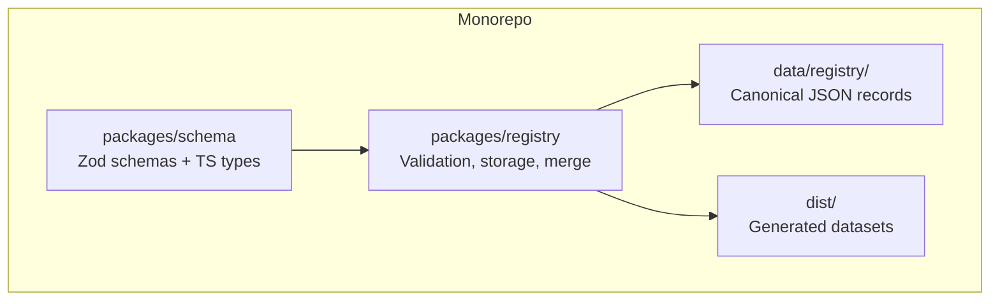
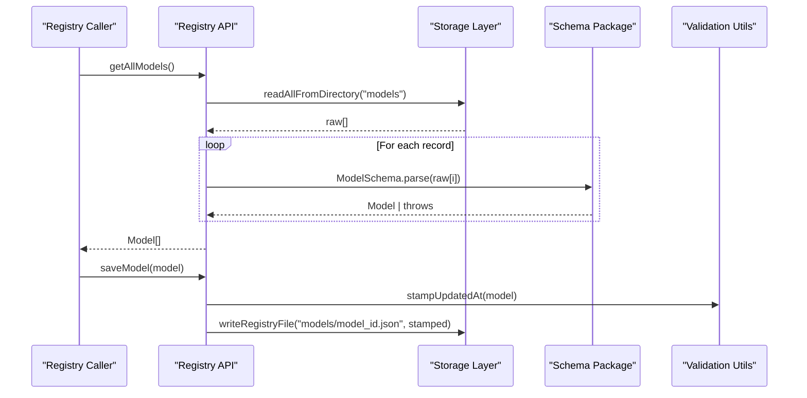
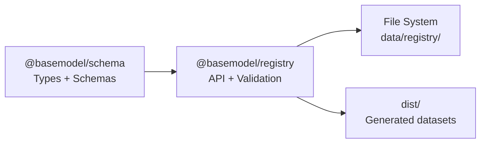

# Custom Data Types

<cite>
**Referenced Files in This Document**
- [README.md](file://README.md)
- [package.json](file://packages/registry/package.json)
- [index.ts](file://packages/registry/src/index.ts)
- [validation.ts](file://packages/registry/src/validation.ts)
- [merge.ts](file://packages/registry/src/merge.ts)
- [schema.test.ts](file://packages/schema/src/__tests__/schema.test.ts)
</cite>

## Table of Contents
1. [Introduction](#introduction)
2. [Project Structure](#project-structure)
3. [Core Components](#core-components)
4. [Architecture Overview](#architecture-overview)
5. [Detailed Component Analysis](#detailed-component-analysis)
6. [Dependency Analysis](#dependency-analysis)
7. [Performance Considerations](#performance-considerations)
8. [Troubleshooting Guide](#troubleshooting-guide)
9. [Conclusion](#conclusion)
10. [Appendices](#appendices)

## Introduction
This document explains how to implement custom data types within the BaseModel schema system. It focuses on defining new Zod schemas, extending existing type definitions, and maintaining type safety across the monorepo. You will learn the pattern for creating reusable custom types, validation rules, and serialization logic, with practical examples for adding new model attributes, capability types, and provider-specific fields. The guidance covers TypeScript integration, compile-time validation via shared types, and runtime type checking using Zod.

## Project Structure
BaseModel is a monorepo where the canonical Zod schemas and TypeScript types live in the schema package, while the registry layer consumes them for validation, normalization, and storage. The README outlines the layout and key packages:
- packages/schema: Canonical Zod schemas and TypeScript types
- packages/registry: Registry storage, validation, and merge utilities

[No sources needed since this diagram shows conceptual workflow, not actual code structure]

**Section sources**
- [README.md:11-30](file://README.md#L11-L30)

## Core Components
The core components for custom data types are:
- Zod Schemas and TypeScript Types: Define the shape and constraints of entities (e.g., Provider, Model, Capability, Benchmark, Pricing, Api, License). These are exported from the schema package and consumed by the registry.
- Validation Utilities: Provide safe parsing and error collection without throwing, enabling robust runtime checks.
- Registry API: Reads/writes canonical JSON files and applies schemas during load/save operations.
- Merge Utilities: Normalize and merge incoming collector data with curated values, ensuring consistency and correctness.

Key responsibilities:
- Schema package: Defines strict contracts and re-usable validators.
- Registry package: Enforces contracts at runtime and persists validated data.
- Tests: Validate behavior of schemas and ensure stability over time.

**Section sources**
- [index.ts:1-18](file://packages/registry/src/index.ts#L1-L18)
- [validation.ts:1-42](file://packages/registry/src/validation.ts#L1-L42)
- [merge.ts:47-68](file://packages/registry/src/merge.ts#L47-L68)
- [schema.test.ts:1-41](file://packages/schema/src/__tests__/schema.test.ts#L1-L41)

## Architecture Overview
The schema-first architecture ensures that all data entering or leaving the registry conforms to well-defined contracts. Consumers import both types and schemas from the schema package; the registry uses these to validate and persist records.

**Diagram sources**
- [index.ts:63-83](file://packages/registry/src/index.ts#L63-L83)
- [validation.ts:11-20](file://packages/registry/src/validation.ts#L11-L20)

**Section sources**
- [index.ts:1-18](file://packages/registry/src/index.ts#L1-L18)
- [index.ts:63-83](file://packages/registry/src/index.ts#L63-L83)

## Detailed Component Analysis

### Defining New Zod Schemas and TypeScript Types
To add a new entity or extend an existing one:
- Create a Zod schema that defines required fields, allowed enums, and constraints.
- Derive TypeScript types from the schema to ensure compile-time safety.
- Export the schema and types from the schema package index so consumers can use them consistently.
- Add tests to assert valid and invalid inputs, including edge cases like URLs, IDs, and optional timestamps.

Practical patterns:
- Use discriminated unions for polymorphic fields (e.g., modality arrays).
- Apply URL validation for web endpoints to prevent unsafe schemes.
- Include optional metadata fields such as updated_at for provenance and freshness tracking.

Examples to consider:
- Adding a new model attribute (e.g., reasoning_support) with boolean validation and defaulting.
- Extending capability types with a new enum value and updating dependent schemas.
- Introducing provider-specific fields behind an optional extension object.

**Section sources**
- [schema.test.ts:43-110](file://packages/schema/src/__tests__/schema.test.ts#L43-L110)
- [schema.test.ts:112-157](file://packages/schema/src/__tests__/schema.test.ts#L112-L157)
- [schema.test.ts:159-182](file://packages/schema/src/__tests__/schema.test.ts#L159-L182)

### Extending Existing Type Definitions
When extending existing types:
- Keep backward compatibility by making new fields optional where appropriate.
- Ensure downstream consumers handle optional fields gracefully.
- Update merge logic to prioritize curated values over incoming collector data for sensitive fields.

Example considerations:
- Adding capability_ids to models should preserve existing curated lists when merging.
- Ensuring license_id merges correctly without overwriting curated references.

**Section sources**
- [merge.ts:47-68](file://packages/registry/src/merge.ts#L47-L68)

### Maintaining Type Safety Across the Monorepo
- Centralize schemas and types in the schema package to avoid duplication.
- Import both types and schemas from the same source in collectors, registry, and intelligence layers.
- Use workspace dependencies to keep versions aligned across packages.

**Section sources**
- [package.json:22-25](file://packages/registry/package.json#L22-L25)

### Creating Reusable Custom Types and Validation Rules
Reusable patterns:
- Build small, composable validators (e.g., HttpUrlSchema) and reuse them across multiple schemas.
- Encapsulate common field validations (IDs, statuses, timestamps) into helper validators.
- Use safeParse for non-throwing validation paths and parse for strict enforcement.

Serialization logic:
- Stamp updated_at timestamps before writing to ensure freshness tracking.
- Persist arrays per-provider for pricing and benchmarks to support partial-failure resilience.

**Section sources**
- [index.ts:39-41](file://packages/registry/src/index.ts#L39-L41)
- [index.ts:124-147](file://packages/registry/src/index.ts#L124-L147)

### Practical Examples

#### Adding a New Model Attribute
Steps:
- Extend the model schema with the new field and constraints.
- Update tests to cover valid and invalid scenarios.
- Ensure registry functions accept and persist the new field.

Considerations:
- Defaults and optionality for backward compatibility.
- Impact on merge logic if the field is curated.

**Section sources**
- [schema.test.ts:112-157](file://packages/schema/src/__tests__/schema.test.ts#L112-L157)
- [merge.ts:47-68](file://packages/registry/src/merge.ts#L47-L68)

#### Extending Capability Types
Steps:
- Add a new enum value to the capability schema.
- Update any union types or mappings that depend on capabilities.
- Add tests validating the new capability usage.

**Section sources**
- [schema.test.ts:22-28](file://packages/schema/src/__tests__/schema.test.ts#L22-L28)

#### Adding Provider-Specific Fields
Steps:
- Introduce an optional extension object in the provider schema.
- Validate provider-specific fields only when present.
- Ensure registry reads/writes do not break when extensions are missing.

**Section sources**
- [schema.test.ts:43-110](file://packages/schema/src/__tests__/schema.test.ts#L43-L110)

### TypeScript Integration and Compile-Time Validation
- Export types derived from schemas to enable static analysis.
- Use these types throughout the monorepo to catch mismatches at compile time.
- Combine with Zod’s runtime validation for end-to-end safety.

**Section sources**
- [index.ts:1-18](file://packages/registry/src/index.ts#L1-L18)

### Runtime Type Checking
- Use validate helpers for safe parsing and error aggregation.
- Prefer safeParse in contexts where failures must be handled gracefully.
- Collect errors with path information for clear diagnostics.

**Section sources**
- [validation.ts:11-20](file://packages/registry/src/validation.ts#L11-L20)
- [validation.ts:25-42](file://packages/registry/src/validation.ts#L25-L42)

## Dependency Analysis
The registry depends on the schema package for both types and schemas. This dependency ensures consistent contracts across the system.

**Diagram sources**
- [package.json:22-25](file://packages/registry/package.json#L22-L25)
- [index.ts:1-18](file://packages/registry/src/index.ts#L1-L18)

**Section sources**
- [package.json:22-25](file://packages/registry/package.json#L22-L25)
- [index.ts:1-18](file://packages/registry/src/index.ts#L1-L18)

## Performance Considerations
- Batch validation: Use validateMany to process large arrays efficiently and collect errors per row.
- Avoid unnecessary parsing: Only parse when reading from disk or receiving external input.
- Minimize schema complexity: Keep validators focused and composable to reduce overhead.
- Partial-failure resilience: Store per-source rollups for benchmarks and pricing to limit impact of failures.

[No sources needed since this section provides general guidance]

## Troubleshooting Guide
Common issues and resolutions:
- Invalid URL schemes: Ensure website fields use http or https only.
- Missing required fields: Check schema definitions and test coverage for required attributes.
- Stale records: Verify updated_at stamps are applied during save operations.
- Merge conflicts: Curated fields take precedence; confirm merge logic aligns with business rules.

Diagnostic tips:
- Use safeParse to capture detailed error messages with paths.
- Inspect registry outputs to verify persisted structures match expected schemas.
- Run tests to validate schema changes and edge cases.

**Section sources**
- [schema.test.ts:91-110](file://packages/schema/src/__tests__/schema.test.ts#L91-L110)
- [validation.ts:11-20](file://packages/registry/src/validation.ts#L11-L20)
- [index.ts:39-41](file://packages/registry/src/index.ts#L39-L41)

## Conclusion
By centralizing Zod schemas and TypeScript types in the schema package and enforcing them through the registry’s validation and storage layers, BaseModel achieves strong compile-time and runtime type safety. Following the patterns outlined here—defining composable validators, stamping metadata, merging curated values, and testing thoroughly—ensures that custom data types remain consistent, maintainable, and scalable across the monorepo.

[No sources needed since this section summarizes without analyzing specific files]

## Appendices

### Best Practices Checklist
- Define schemas first, then derive types.
- Export both schemas and types from a single source.
- Write comprehensive tests for valid and invalid inputs.
- Use safeParse for graceful error handling.
- Stamp updated_at on persisted records.
- Prioritize curated fields during merges.
- Keep providers neutral and avoid special-casing.

[No sources needed since this section provides general guidance]