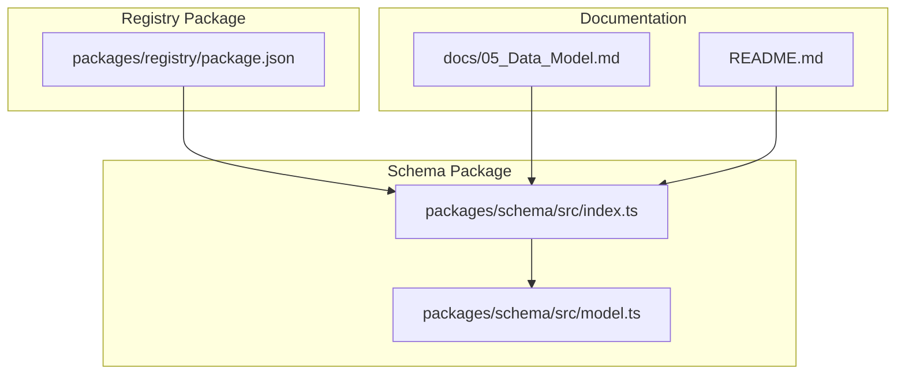
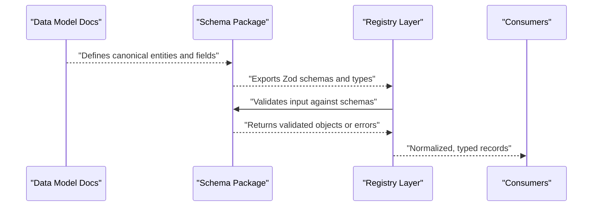
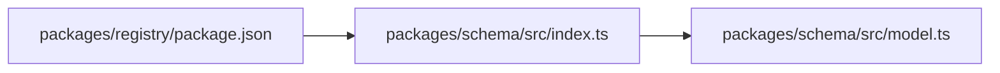

# Schema Extensions & Custom Types

<cite>
**Referenced Files in This Document**
- [README.md](file://README.md)
- [05_Data_Model.md](file://docs/05_Data_Model.md)
- [index.ts](file://packages/schema/src/index.ts)
- [model.ts](file://packages/schema/src/model.ts)
- [package.json](file://packages/registry/package.json)
</cite>

## Table of Contents
1. [Introduction](#introduction)
2. [Project Structure](#project-structure)
3. [Core Components](#core-components)
4. [Architecture Overview](#architecture-overview)
5. [Detailed Component Analysis](#detailed-component-analysis)
6. [Dependency Analysis](#dependency-analysis)
7. [Performance Considerations](#performance-considerations)
8. [Troubleshooting Guide](#troubleshooting-guide)
9. [Conclusion](#conclusion)
10. [Appendices](#appendices)

## Introduction
This document explains how to extend BaseModel’s schema system with custom data types, new model attributes, and provider-specific fields using Zod. It covers schema extension patterns, type safety considerations, migration strategies, versioning, backward compatibility, and testing practices for custom schema extensions. The guidance is grounded in the canonical schema package and the documented data model.

## Project Structure
BaseModel organizes its canonical schemas and TypeScript types in a dedicated schema package. The registry layer depends on this package for validation and normalization. Data model definitions are documented centrally and inform the schema implementations.

**Diagram sources**
- [index.ts:1-27](file://packages/schema/src/index.ts#L1-L27)
- [model.ts:1-65](file://packages/schema/src/model.ts#L1-L65)
- [package.json:1-35](file://packages/registry/package.json#L1-L35)
- [05_Data_Model.md:1-169](file://docs/05_Data_Model.md#L1-L169)
- [README.md:1-61](file://README.md#L1-L61)

**Section sources**
- [README.md:11-30](file://README.md#L11-L30)
- [05_Data_Model.md:1-169](file://docs/05_Data_Model.md#L1-L169)
- [index.ts:1-27](file://packages/schema/src/index.ts#L1-L27)
- [model.ts:1-65](file://packages/schema/src/model.ts#L1-L65)
- [package.json:1-35](file://packages/registry/package.json#L1-L35)

## Core Components
- Canonical schema package exports Zod schemas and TypeScript types for all core entities (Provider, Model, Capability, Benchmark, Pricing, License, API, Limits).
- The Model schema defines identifiers, core attributes, technical characteristics, capability flags, economics/limits, relationships, status, and freshness metadata.
- Registry package consumes the schema package for validation and normalization.

Key responsibilities:
- Provide a single source of truth for shared data contracts.
- Enforce strict validation rules via Zod.
- Maintain type safety across the codebase through exported TypeScript types.

**Section sources**
- [index.ts:1-27](file://packages/schema/src/index.ts#L1-L27)
- [model.ts:1-65](file://packages/schema/src/model.ts#L1-L65)
- [package.json:22-25](file://packages/registry/package.json#L22-L25)

## Architecture Overview
The schema system follows a layered architecture:
- Documentation defines the canonical domain model.
- Schema package implements Zod-based validation and TypeScript types.
- Registry package uses schemas to validate and normalize incoming data.

**Diagram sources**
- [05_Data_Model.md:1-169](file://docs/05_Data_Model.md#L1-L169)
- [index.ts:1-27](file://packages/schema/src/index.ts#L1-L27)
- [package.json:22-25](file://packages/registry/package.json#L22-L25)

## Detailed Component Analysis

### Extending the Model Schema
To add new capabilities or provider-specific fields to the Model entity:
- Extend the existing schema by composing it with additional fields using Zod’s object merging patterns.
- Preserve backward compatibility by making new fields optional and providing sensible defaults where appropriate.
- Export updated types so consumers benefit from full type inference.

Recommended pattern:
- Create a base schema that represents the stable core.
- Build derived schemas for specific use cases by extending the base with additional fields.
- Keep validation messages clear and consistent.

Type safety considerations:
- Use z.infer to derive TypeScript types from schemas.
- Avoid mutating core schemas; prefer composition to maintain stability.
- Ensure new fields do not break existing consumers by keeping them optional and well-documented.

Migration strategy:
- Introduce new fields as optional with defaults.
- Add validation rules gradually.
- Update documentation and tests before enforcing stricter constraints.

Backward compatibility:
- Consumers reading older records should still function when encountering missing optional fields.
- Writers should always emit required fields and set updated_at timestamps consistently.

Testing custom schema extensions:
- Write unit tests covering valid payloads, invalid payloads, edge cases, and default behavior.
- Include negative tests for malformed IDs, dates, enums, and arrays.
- Validate that derived types match expected shapes.

Practical examples:
- Adding a provider-specific field: define an optional string or enum field with a descriptive message.
- Adding a new capability flag: introduce a boolean flag with a clear name and default value.
- Adding nested limits: compose with an existing limits schema to keep structure consistent.

**Section sources**
- [model.ts:1-65](file://packages/schema/src/model.ts#L1-L65)
- [05_Data_Model.md:41-69](file://docs/05_Data_Model.md#L41-L69)

### Adding Custom Data Types with Zod
To introduce custom data types:
- Define reusable Zod schemas for complex structures (e.g., nested objects, enums, arrays).
- Compose these schemas into entity schemas to avoid duplication.
- Export both schemas and inferred types for broad consumption.

Guidelines:
- Keep custom types small and focused.
- Use descriptive names and clear validation messages.
- Prefer enums over free-form strings where possible.

Example approach:
- Create a schema for a structured attribute (e.g., pricing details).
- Attach it to relevant entities via optional fields.
- Test thoroughly with boundary values.

**Section sources**
- [index.ts:1-27](file://packages/schema/src/index.ts#L1-L27)
- [model.ts:1-65](file://packages/schema/src/model.ts#L1-L65)

### Implementing Validation Rules Using Zod
Validation rules should be explicit and fail fast:
- Use regex for identifiers and date formats.
- Enumerations for constrained sets of values.
- Array validations for lists like modality and capability_ids.
- Optional chaining for non-critical fields.

Best practices:
- Centralize common validators in utility schemas.
- Provide helpful error messages to guide data authors.
- Keep validation logic close to schema definitions for clarity.

**Section sources**
- [model.ts:11-62](file://packages/schema/src/model.ts#L11-L62)

### Schema Versioning and Backward Compatibility
Versioning ensures safe evolution:
- Track schema_version in dataset metadata.
- Maintain multiple schema versions during transitions.
- Apply migrations to convert older records to newer formats.

Compatibility strategies:
- Add new fields as optional with defaults.
- Deprecate fields gradually with warnings before removal.
- Validate both old and new formats during transition periods.

**Section sources**
- [05_Data_Model.md:143-152](file://docs/05_Data_Model.md#L143-L152)

### Provider-Specific Fields and Custom Model Attributes
For provider-specific extensions:
- Use optional fields to avoid breaking core schema stability.
- Group related provider fields under a nested object if needed.
- Document provider-specific semantics clearly.

Examples:
- Add a provider-specific tier mapping field.
- Include vendor-specific feature flags.
- Capture extra metadata without altering core attributes.

**Section sources**
- [model.ts:18-56](file://packages/schema/src/model.ts#L18-L56)

### Testing Custom Schema Extensions
Comprehensive testing ensures reliability:
- Positive tests: valid payloads conform to schema.
- Negative tests: invalid payloads produce meaningful errors.
- Edge cases: empty arrays, minimal strings, boundary numbers.
- Type tests: ensure inferred types match expectations.

Suggested test structure:
- Unit tests per schema extension.
- Integration tests validating end-to-end validation flows.
- Regression tests to prevent accidental breaks.

**Section sources**
- [model.ts:1-65](file://packages/schema/src/model.ts#L1-L65)

## Dependency Analysis
The registry layer depends on the schema package for validation and normalization. This creates a clear dependency chain that enforces data contracts across the system.

**Diagram sources**
- [package.json:22-25](file://packages/registry/package.json#L22-L25)
- [index.ts:1-27](file://packages/schema/src/index.ts#L1-L27)
- [model.ts:1-65](file://packages/schema/src/model.ts#L1-L65)

**Section sources**
- [package.json:22-25](file://packages/registry/package.json#L22-L25)
- [index.ts:1-27](file://packages/schema/src/index.ts#L1-L27)

## Performance Considerations
- Keep schemas lean and avoid heavy computation in validation.
- Use optional fields strategically to reduce validation overhead.
- Cache frequently used schema instances if necessary.
- Profile validation paths for high-throughput scenarios.

[No sources needed since this section provides general guidance]

## Troubleshooting Guide
Common issues and resolutions:
- Invalid model_id format: ensure kebab-case provider_id and proper slug structure.
- Date parsing errors: verify ISO 8601 date strings.
- Missing required fields: check core attributes and capability flags.
- Unexpected nulls: confirm optional fields are handled correctly.

Debugging tips:
- Log validation failures with detailed messages.
- Use schema.safeParse to inspect errors without throwing.
- Validate sample payloads early in development.

**Section sources**
- [model.ts:11-62](file://packages/schema/src/model.ts#L11-L62)

## Conclusion
Extending BaseModel’s schema system involves careful planning around Zod-based validation, type safety, and backward compatibility. By following established patterns for schema composition, versioning, and testing, you can safely add custom data types, new model attributes, and provider-specific fields while maintaining system integrity and consumer compatibility.

[No sources needed since this section summarizes without analyzing specific files]

## Appendices

### Practical Extension Checklist
- Define new fields as optional initially.
- Add clear validation messages.
- Update TypeScript types via z.infer.
- Write comprehensive unit tests.
- Document changes in data model docs.
- Plan migration strategy for enforcement.

[No sources needed since this section provides general guidance]