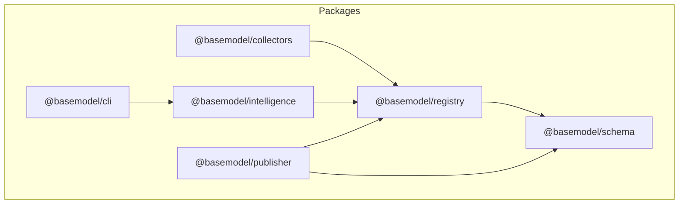
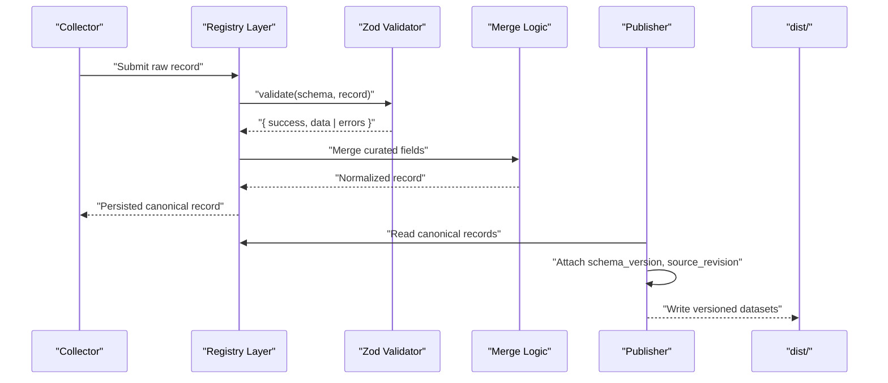
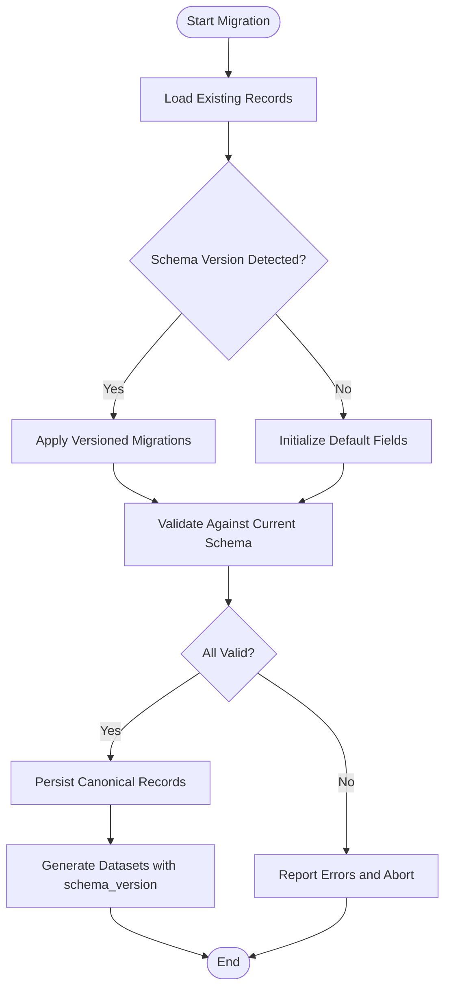
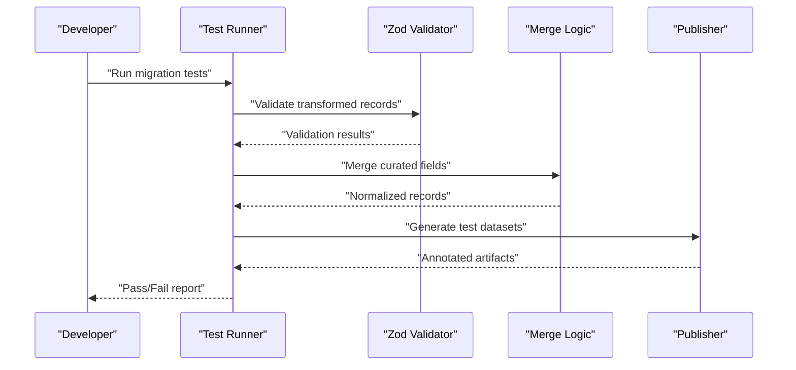
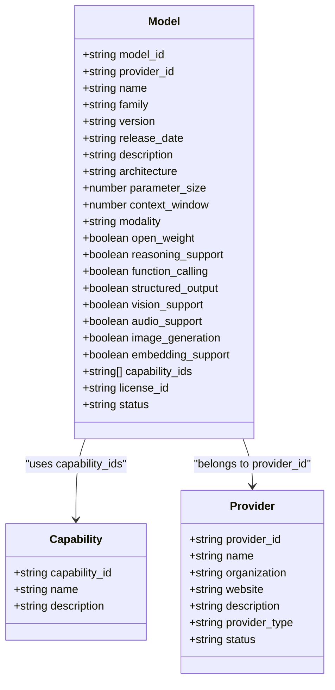
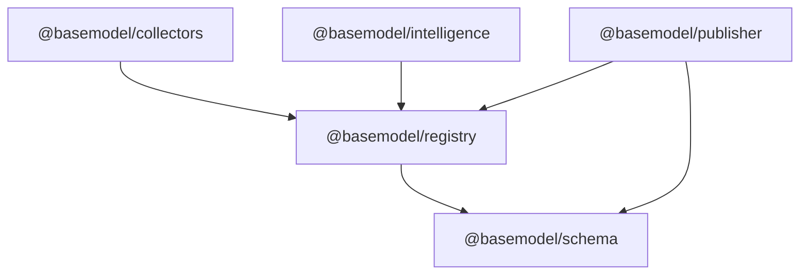

# Schema Migration Strategies

<cite>
**Referenced Files in This Document**
- [README.md](file://README.md)
- [03_Architecture.md](file://docs/03_Architecture.md)
- [05_Data_Model.md](file://docs/05_Data_Model.md)
- [package.json](file://packages/registry/package.json)
- [validation.ts](file://packages/registry/src/validation.ts)
- [merge.ts](file://packages/registry/src/merge.ts)
- [generate.ts](file://packages/publisher/src/generate.ts)
</cite>

## Table of Contents
1. [Introduction](#introduction)
2. [Project Structure](#project-structure)
3. [Core Components](#core-components)
4. [Architecture Overview](#architecture-overview)
5. [Detailed Component Analysis](#detailed-component-analysis)
6. [Dependency Analysis](#dependency-analysis)
7. [Performance Considerations](#performance-considerations)
8. [Troubleshooting Guide](#troubleshooting-guide)
9. [Conclusion](#conclusion)
10. [Appendices](#appendices)

## Introduction
This document provides a comprehensive guide to managing schema migrations for BaseModel’s canonical data model and registry layer. It explains versioning strategies, backward compatibility patterns, and migration scripts for evolving providers, capabilities, and model definitions. It also covers handling breaking changes, deprecation timelines, automated migration processes, rollback strategies, testing migrations, and maintaining data integrity during updates.

BaseModel is a data platform that discovers, validates, normalizes, stores, analyzes, and publishes structured knowledge about AI models. The canonical schemas and types are defined in the schema package, while the registry layer performs validation, normalization, and storage. Generated datasets include metadata such as schema_version and source_revision to ensure traceability and reproducibility.

**Section sources**
- [README.md:11-30](file://README.md#L11-L30)
- [03_Architecture.md:15-44](file://docs/03_Architecture.md#L15-L44)
- [05_Data_Model.md:145-151](file://docs/05_Data_Model.md#L145-L151)

## Project Structure
BaseModel organizes its code into focused packages:
- @basemodel/schema: Canonical Zod schemas and TypeScript types.
- @basemodel/registry: Registry storage, validation, and merge utilities.
- @basemodel/collectors: Provider and gateway collectors.
- @basemodel/intelligence: Derived rankings, search, and recommendations.
- @basemodel/publisher: Dataset generation for dist/.
- @basemodel/cli: Command-line interface for querying intelligence.

The registry package depends on the schema package and uses Zod for runtime validation. The publisher reads schema version information from the schema package to annotate generated datasets with schema_version and source_revision.

**Diagram sources**
- [03_Architecture.md:37-44](file://docs/03_Architecture.md#L37-L44)
- [package.json:22-24](file://packages/registry/package.json#L22-L24)

**Section sources**
- [README.md:11-30](file://README.md#L11-L30)
- [03_Architecture.md:37-44](file://docs/03_Architecture.md#L37-L44)
- [package.json:22-24](file://packages/registry/package.json#L22-L24)

## Core Components
- Schema Package: Defines canonical entities (Provider, Model, Capability, Benchmark, Pricing, API, License) and their identifiers.
- Registry Layer: Validates incoming records using Zod, merges curated fields, and persists canonical records.
- Publisher: Generates static datasets annotated with schema_version and source_revision.

Key responsibilities:
- Validation: Enforce schema contracts at ingestion time.
- Normalization: Normalize provider-specific data into canonical forms.
- Merge Strategy: Preserve curated fields and stable identifiers across updates.
- Versioning: Annotate outputs with schema_version and source_revision for traceability.

**Section sources**
- [05_Data_Model.md:25-136](file://docs/05_Data_Model.md#L25-L136)
- [validation.ts:11-20](file://packages/registry/src/validation.ts#L11-L20)
- [merge.ts:47-68](file://packages/registry/src/merge.ts#L47-L68)
- [generate.ts:48-71](file://packages/publisher/src/generate.ts#L48-L71)

## Architecture Overview
The pipeline stages map to architecture layers: discovery, collection, validation, normalization, registry, intelligence, generation, publication. Migrations primarily affect validation, normalization, and registry operations, with publishing ensuring consumers receive versioned artifacts.

**Diagram sources**
- [03_Architecture.md:59-76](file://docs/03_Architecture.md#L59-L76)
- [validation.ts:11-20](file://packages/registry/src/validation.ts#L11-L20)
- [merge.ts:47-68](file://packages/registry/src/merge.ts#L47-L68)
- [generate.ts:48-71](file://packages/publisher/src/generate.ts#L48-L71)

## Detailed Component Analysis

### Schema Versioning and Backward Compatibility
- Use semantic versioning for schema evolution. Increment major versions for breaking changes; minor for additive features; patch for non-breaking fixes.
- Maintain backward compatibility by:
  - Adding optional fields rather than removing required ones.
  - Introducing new capability_ids or provider fields without invalidating existing records.
  - Keeping stable identifiers (provider_id, model_id) immutable.
- Annotate published datasets with schema_version and source_revision to ensure consumers can validate compatibility.

Practical steps:
- Update Zod schemas incrementally with safe defaults.
- Add migration scripts to transform legacy records to new schema versions.
- Validate all incoming records against the current schema before persisting.

**Section sources**
- [05_Data_Model.md:145-151](file://docs/05_Data_Model.md#L145-L151)
- [generate.ts:62-71](file://packages/publisher/src/generate.ts#L62-L71)

### Migration Scripts and Automated Processes
- Implement migration functions per schema version change:
  - Field renames: Map old field names to new ones.
  - Type changes: Coerce values safely or mark missing data.
  - New enums: Expand allowed values and normalize legacy values.
- Automate migrations via CI/CD:
  - Run validation and migration tests on pull requests.
  - Generate datasets with updated schema_version and source_revision.
  - Publish artifacts only if all validations pass.

Automation flow:

**Diagram sources**
- [validation.ts:25-42](file://packages/registry/src/validation.ts#L25-L42)
- [generate.ts:48-71](file://packages/publisher/src/generate.ts#L48-L71)

### Handling Breaking Changes and Deprecation Timelines
- Breaking changes:
  - Remove deprecated fields after a grace period.
  - Replace incompatible enums with normalized sets.
  - Introduce new mandatory fields with default values where possible.
- Deprecation timeline:
  - Announce deprecations in changelogs and schema comments.
  - Provide migration scripts for at least two major versions.
  - Monitor usage metrics to plan removals.

Best practices:
- Keep stable identifiers unchanged.
- Prefer additive changes over destructive ones.
- Use capability_ids to decouple model capabilities from specific provider implementations.

**Section sources**
- [05_Data_Model.md:137-142](file://docs/05_Data_Model.md#L137-L142)
- [05_Data_Model.md:70-79](file://docs/05_Data_Model.md#L70-L79)

### Rollback Strategies
- Maintain previous dataset versions in dist/ for quick rollbacks.
- Use Git tags to pin schema versions and correlate with dataset artifacts.
- In case of failed migrations:
  - Re-run the last known good migration script.
  - Restore datasets from tagged releases.
  - Validate restored datasets against the target schema.

Operational checklist:
- Tag releases with schema_version.
- Store migration scripts alongside schema definitions.
- Automate rollback triggers in CI/CD pipelines.

**Section sources**
- [generate.ts:48-71](file://packages/publisher/src/generate.ts#L48-L71)

### Testing Migrations
- Unit tests:
  - Validate transformation logic for each migration step.
  - Assert expected fields and types post-migration.
- Integration tests:
  - Run full pipeline with sample datasets.
  - Verify schema_version and source_revision annotations.
- Regression tests:
  - Ensure backward compatibility with older records.
  - Check curated field preservation during merges.

Testing workflow:

**Diagram sources**
- [validation.ts:11-20](file://packages/registry/src/validation.ts#L11-L20)
- [merge.ts:47-68](file://packages/registry/src/merge.ts#L47-L68)
- [generate.ts:48-71](file://packages/publisher/src/generate.ts#L48-L71)

### Maintaining Data Integrity During Updates
- Idempotency:
  - Ensure migration scripts can be re-run without side effects.
- Consistency:
  - Validate all records before persisting.
  - Preserve stable identifiers across updates.
- Provenance:
  - Track source_revision and schema_version in outputs.
  - Maintain audit trails for migrations.

Integrity checks:
- Validate foreign key relationships (e.g., capability_ids reference valid capabilities).
- Normalize enum values to canonical sets.
- Reject malformed records early in the pipeline.

**Section sources**
- [05_Data_Model.md:145-151](file://docs/05_Data_Model.md#L145-L151)
- [validation.ts:25-42](file://packages/registry/src/validation.ts#L25-L42)

### Examples of Schema Evolution
- Providers:
  - Add new provider_type values gradually.
  - Normalize organization names and websites.
- Capabilities:
  - Introduce new capability_ids without breaking existing models.
  - Map legacy capability names to canonical IDs.
- Model Definitions:
  - Add optional fields like context_window or parameter_size.
  - Normalize modality and support flags (vision_support, audio_support).

Evolution pattern:

**Diagram sources**
- [05_Data_Model.md:25-79](file://docs/05_Data_Model.md#L25-L79)

**Section sources**
- [05_Data_Model.md:25-79](file://docs/05_Data_Model.md#L25-L79)

## Dependency Analysis
The registry layer depends on the schema package for Zod schemas and validation. The publisher depends on both registry and schema to generate versioned datasets. Collectors feed data into the registry, which then flows through intelligence and publishing layers.

**Diagram sources**
- [03_Architecture.md:37-44](file://docs/03_Architecture.md#L37-L44)
- [package.json:22-24](file://packages/registry/package.json#L22-L24)

**Section sources**
- [03_Architecture.md:37-44](file://docs/03_Architecture.md#L37-L44)
- [package.json:22-24](file://packages/registry/package.json#L22-L24)

## Performance Considerations
- Batch validation:
  - Use validateMany to process large datasets efficiently.
- Lazy loading:
  - Load only necessary schema versions during migrations.
- Caching:
  - Cache normalized records to avoid recomputation.
- Parallel processing:
  - Run migrations and validations in parallel where safe.

Optimization tips:
- Minimize schema parsing overhead by reusing Zod schemas.
- Avoid deep object cloning during merges.
- Profile migration scripts for bottlenecks.

[No sources needed since this section provides general guidance]

## Troubleshooting Guide
Common issues and resolutions:
- Validation failures:
  - Inspect error messages from validate() to identify problematic fields.
  - Use validateMany() to isolate invalid records in batches.
- Merge conflicts:
  - Ensure curated fields take precedence over incoming data.
  - Log merged fields for auditability.
- Schema version mismatches:
  - Verify schema_version in generated datasets matches expectations.
  - Re-run migrations with correct version targets.

Debugging steps:
- Enable verbose logging in validation and merge functions.
- Compare pre- and post-migration records to detect unexpected changes.
- Use Git blame to trace schema changes and migration scripts.

**Section sources**
- [validation.ts:11-20](file://packages/registry/src/validation.ts#L11-L20)
- [validation.ts:25-42](file://packages/registry/src/validation.ts#L25-L42)
- [merge.ts:47-68](file://packages/registry/src/merge.ts#L47-L68)

## Conclusion
Effective schema migration in BaseModel requires careful versioning, robust validation, and automated processes. By following backward compatibility patterns, implementing migration scripts, and maintaining data integrity, teams can evolve the schema safely and predictably. The registry and publisher layers provide the foundation for consistent, versioned datasets that consumers can rely on.

[No sources needed since this section summarizes without analyzing specific files]

## Appendices
- Best Practices Checklist:
  - Always add optional fields first.
  - Provide migration scripts for every breaking change.
  - Annotate datasets with schema_version and source_revision.
  - Test migrations thoroughly with realistic data.
  - Maintain rollback plans and tagged releases.

[No sources needed since this section provides general guidance]