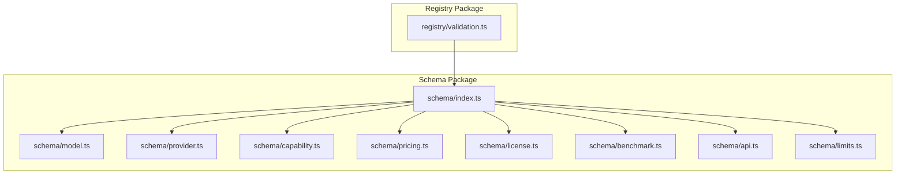
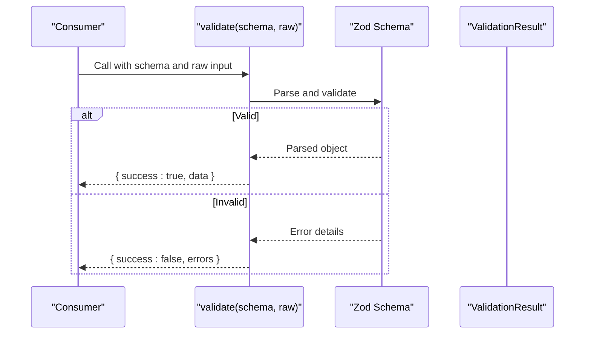
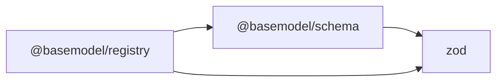

# Schema Validation Rules

<cite>
**Referenced Files in This Document**
- [README.md](file://README.md)
- [index.ts](file://packages/schema/src/index.ts)
- [package.json](file://packages/schema/package.json)
- [validation.ts](file://packages/registry/src/validation.ts)
- [api.ts](file://packages/schema/src/api.ts)
- [benchmark.ts](file://packages/schema/src/benchmark.ts)
- [capability.ts](file://packages/schema/src/capability.ts)
- [license.ts](file://packages/schema/src/license.ts)
- [limits.ts](file://packages/schema/src/limits.ts)
- [model.ts](file://packages/schema/src/model.ts)
- [pricing.ts](file://packages/schema/src/pricing.ts)
- [provider.ts](file://packages/schema/src/provider.ts)
</cite>

## Table of Contents
1. [Introduction](#introduction)
2. [Project Structure](#project-structure)
3. [Core Components](#core-components)
4. [Architecture Overview](#architecture-overview)
5. [Detailed Component Analysis](#detailed-component-analysis)
6. [Dependency Analysis](#dependency-analysis)
7. [Performance Considerations](#performance-considerations)
8. [Troubleshooting Guide](#troubleshooting-guide)
9. [Conclusion](#conclusion)
10. [Appendices](#appendices)

## Introduction
This document explains how to implement custom validation rules within BaseModel’s schema system. It focuses on creating Zod validators, embedding business logic constraints, and handling complex data conditions across model records, provider configurations, and capability definitions. You will learn patterns for conditional and cross-field validation, error handling strategies, validation chaining, performance considerations, and testing approaches for custom validators.

BaseModel uses a canonical schema package that defines shared Zod schemas and TypeScript types consumed by the registry layer for validation and normalization. The registry provides utilities to validate raw inputs against these schemas without throwing, enabling robust error handling and reporting.

**Section sources**
- [README.md:11-17](file://README.md#L11-L17)

## Project Structure
The schema system is centralized in the @basemodel/schema package, which exports canonical Zod schemas and types for entities such as Model, Provider, Capability, Pricing, License, Benchmark, API, and per-model limits. The registry package consumes these schemas and exposes validation helpers used throughout the pipeline.

**Diagram sources**
- [index.ts:1-27](file://packages/schema/src/index.ts#L1-L27)
- [validation.ts:1-40](file://packages/registry/src/validation.ts#L1-L40)

**Section sources**
- [README.md:11-17](file://README.md#L11-L17)
- [index.ts:1-27](file://packages/schema/src/index.ts#L1-L27)
- [package.json:1-48](file://packages/schema/package.json#L1-L48)

## Core Components
- Canonical schemas: Each entity file defines a Zod schema (e.g., ModelSchema, ProviderSchema, CapabilitySchema). These are exported from the schema index for consistent consumption.
- Registry validation helper: A non-throwing validator wraps Zod schemas to return structured results, enabling safe validation flows and detailed error reporting.

Key responsibilities:
- Define field-level constraints using Zod primitives and refinements.
- Implement cross-field and conditional validations via Zod’s refine and superRefine.
- Provide reusable validators for common business rules (e.g., pricing consistency, capability flags).
- Ensure all inputs are validated before storage or publishing.

**Section sources**
- [index.ts:10-26](file://packages/schema/src/index.ts#L10-L26)
- [validation.ts:9-20](file://packages/registry/src/validation.ts#L9-L20)

## Architecture Overview
The validation architecture follows a clear separation between schema definition and validation execution:

- Schema definitions live in @basemodel/schema and export Zod schemas.
- Consumers (collectors, registry, publisher) import schemas and use the registry’s validation helper to safely validate raw payloads.
- Errors are captured and returned as structured results rather than thrown exceptions, allowing graceful handling at higher layers.

**Diagram sources**
- [validation.ts:9-20](file://packages/registry/src/validation.ts#L9-L20)
- [index.ts:10-26](file://packages/schema/src/index.ts#L10-L26)

## Detailed Component Analysis

### Creating Custom Validators with Zod
To add custom validation rules:
- Use Zod’s refine for single-field validations that depend on the field value.
- Use superRefine for multi-field or cross-field validations.
- Compose existing schemas with .extend() or .merge() to build specialized validators.
- Return descriptive error messages to aid debugging and user feedback.

Patterns:
- Conditional validation: Apply different constraints based on another field’s presence or value.
- Cross-field validation: Validate relationships between fields (e.g., start date <= end date).
- Domain-specific checks: Enforce business rules like allowed values, ranges, or format constraints.

Example usage patterns (conceptual):
- Add a refinement to ensure a numeric field falls within an acceptable range.
- Combine multiple refinements to enforce complex business logic.
- Chain validators to transform and validate data in stages.

[No sources needed since this section provides general guidance]

### Implementing Business Logic Validation
Business logic validation should be encapsulated in reusable validators:
- Centralize domain rules in dedicated files or modules.
- Export named validators for clarity and reuse.
- Keep validators pure and deterministic for testability.

Guidelines:
- Prefer explicit error paths to pinpoint failing fields.
- Avoid side effects in validators.
- Document assumptions and edge cases.

[No sources needed since this section provides general guidance]

### Handling Complex Data Constraints
Complex constraints often require:
- Nested object validation using Zod’s object schemas.
- Array validations with element-level constraints.
- Union schemas for mutually exclusive options.
- Optional fields with default values and fallbacks.

Best practices:
- Use discriminated unions when variants share structure but differ in key fields.
- Leverage .optional() and .default() to handle missing data gracefully.
- Validate derived fields after transformations.

[No sources needed since this section provides general guidance]

### Validation Patterns for Model Records, Provider Configurations, and Capability Definitions
- Model records: Validate identifiers, metadata, capabilities flags, pricing structures, and limits.
- Provider configurations: Validate endpoints, authentication fields, rate limits, and supported features.
- Capability definitions: Validate capability keys, parameters, and compatibility matrices.

Recommendations:
- Define base schemas for common fields and extend them per entity.
- Use enums or literal unions for fixed sets of values.
- Maintain backward compatibility by marking deprecated fields as optional.

[No sources needed since this section provides general guidance]

### Conditional Validation and Cross-Field Validation
Conditional validation:
- Use .refine() with a predicate function to apply rules conditionally.
- Employ .superRefine() to access the entire object for cross-field checks.

Cross-field validation examples:
- Ensure required fields are present only when certain flags are set.
- Validate that dependent fields satisfy relational constraints.

Error handling:
- Attach meaningful error messages to specific paths.
- Aggregate multiple errors for comprehensive feedback.

[No sources needed since this section provides general guidance]

### Error Handling Strategies
Use the registry’s validation helper to avoid throwing exceptions:
- Capture parse errors and return structured results.
- Distinguish between validation failures and unexpected runtime errors.
- Log detailed context for debugging while sanitizing sensitive information.

Flow:
- Attempt to parse and validate.
- On success, return parsed data.
- On failure, return error details including path and message.

**Section sources**
- [validation.ts:9-20](file://packages/registry/src/validation.ts#L9-L20)

### Validation Chaining
Chain validators to build modular pipelines:
- Start with base schema parsing.
- Apply refinements for additional constraints.
- Transform data where necessary before final validation.

Benefits:
- Reusability across entities.
- Clear separation of concerns.
- Easier testing and maintenance.

[No sources needed since this section provides general guidance]

### Testing Custom Validators
Testing strategies:
- Write unit tests for each validator covering valid and invalid inputs.
- Include edge cases like null, undefined, empty strings, and boundary values.
- Assert both successful parses and expected error messages.
- Use fixtures to represent realistic payloads.

Tips:
- Mock external dependencies if any.
- Keep tests fast and isolated.
- Cover regression scenarios.

[No sources needed since this section provides general guidance]

## Dependency Analysis
The schema package depends on Zod for runtime type checking and validation. The registry package depends on the schema package to consume canonical schemas and provide validation utilities.

**Diagram sources**
- [package.json:38-40](file://packages/schema/package.json#L38-L40)
- [package.json:22-25](file://packages/registry/package.json#L22-L25)

**Section sources**
- [package.json:38-40](file://packages/schema/package.json#L38-L40)
- [package.json:22-25](file://packages/registry/package.json#L22-L25)

## Performance Considerations
- Prefer schema composition over deep nesting to reduce parse overhead.
- Avoid expensive computations inside validators; precompute where possible.
- Cache compiled schemas if reused frequently.
- Use selective validation for large payloads to minimize processing.
- Profile validators under load to identify bottlenecks.

[No sources needed since this section provides general guidance]

## Troubleshooting Guide
Common issues and resolutions:
- Unexpected parse errors: Verify field types and formats match schema expectations.
- Missing required fields: Check upstream data sources and defaults.
- Cross-field validation failures: Review dependency logic and error paths.
- Performance regressions: Simplify validators and remove unnecessary checks.

Debugging tips:
- Inspect error objects for path and message details.
- Log raw inputs alongside validation results.
- Use incremental validation to isolate failing steps.

**Section sources**
- [validation.ts:9-20](file://packages/registry/src/validation.ts#L9-L20)

## Conclusion
BaseModel’s schema system provides a robust foundation for implementing custom validation rules through Zod. By centralizing schemas in @basemodel/schema and leveraging the registry’s validation utilities, you can create reliable, maintainable, and performant validators for model records, provider configurations, and capability definitions. Adopting patterns for conditional and cross-field validation, along with thorough testing and error handling, ensures data integrity and developer productivity.

[No sources needed since this section summarizes without analyzing specific files]

## Appendices

### Entity Schema Index
The schema package exports canonical schemas for core entities:

- Model: Central entity representing AI models with metadata, capabilities, and limits.
- Provider: Configuration for AI providers including endpoints and authentication.
- Capability: Definitions of supported model capabilities and parameters.
- Pricing: Cost structures and billing information.
- License: Licensing terms and restrictions.
- Benchmark: Evaluation metrics and performance data.
- API: API specifications and endpoints.
- Limits: Per-model operational constraints.

These schemas form the basis for validation and normalization across the platform.

**Section sources**
- [index.ts:10-26](file://packages/schema/src/index.ts#L10-L26)
- [model.ts:1-20](file://packages/schema/src/model.ts#L1-L20)
- [provider.ts:1-20](file://packages/schema/src/provider.ts#L1-L20)
- [capability.ts:1-20](file://packages/schema/src/capability.ts#L1-L20)
- [pricing.ts:1-20](file://packages/schema/src/pricing.ts#L1-L20)
- [license.ts:1-20](file://packages/schema/src/license.ts#L1-L20)
- [benchmark.ts:1-20](file://packages/schema/src/benchmark.ts#L1-L20)
- [api.ts:1-20](file://packages/schema/src/api.ts#L1-L20)
- [limits.ts:1-20](file://packages/schema/src/limits.ts#L1-L20)