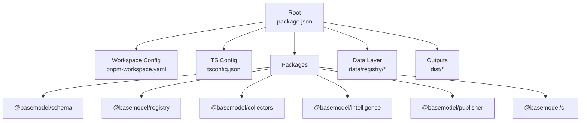
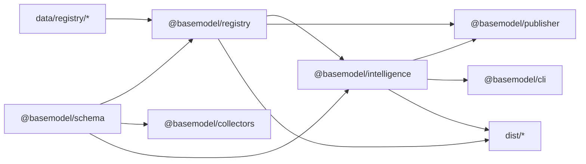
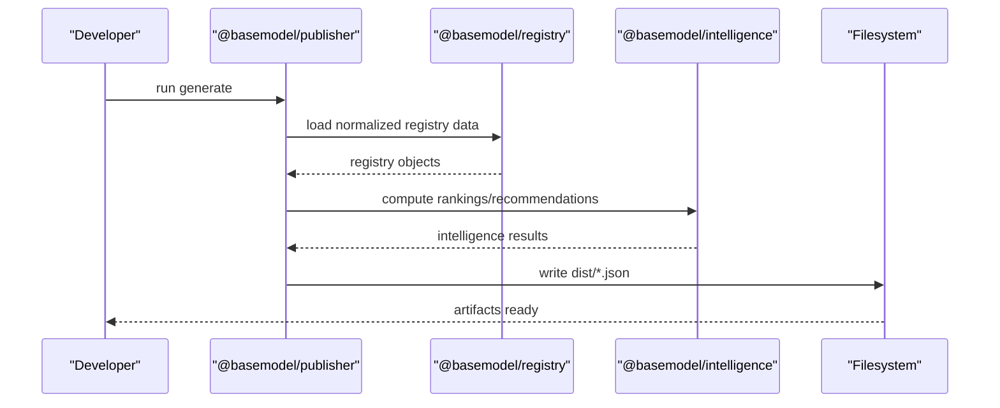
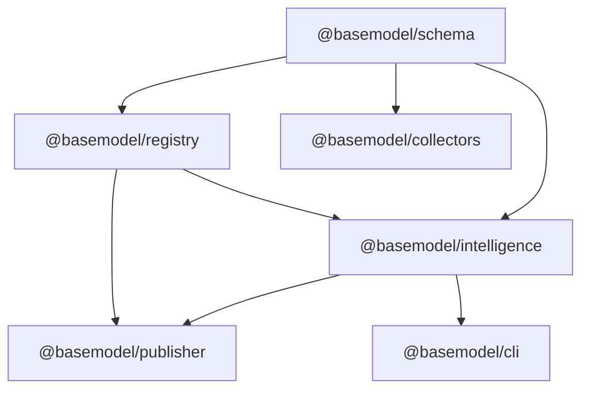

# Monorepo Package Structure

<cite>
**Referenced Files in This Document**
- [package.json](file://package.json)
- [pnpm-workspace.yaml](file://pnpm-workspace.yaml)
- [tsconfig.json](file://tsconfig.json)
- [README.md](file://README.md)
- [packages/schema/package.json](file://packages/schema/package.json)
- [packages/registry/package.json](file://packages/registry/package.json)
- [packages/collectors/package.json](file://packages/collectors/package.json)
- [packages/intelligence/package.json](file://packages/intelligence/package.json)
- [packages/publisher/package.json](file://packages/publisher/package.json)
- [packages/cli/package.json](file://packages/cli/package.json)
</cite>

## Table of Contents
1. [Introduction](#introduction)
2. [Project Structure](#project-structure)
3. [Core Components](#core-components)
4. [Architecture Overview](#architecture-overview)
5. [Detailed Component Analysis](#detailed-component-analysis)
6. [Dependency Analysis](#dependency-analysis)
7. [Performance Considerations](#performance-considerations)
8. [Troubleshooting Guide](#troubleshooting-guide)
9. [Conclusion](#conclusion)
10. [Appendices](#appendices)

## Introduction
This document explains the BaseModel monorepo architecture and package organization. It details how the packages (schema, registry, collectors, intelligence, publisher, cli) interact, shared configuration and build processes, deployment strategy, and guidance for adding new packages, managing dependencies, and maintaining version compatibility across the workspace. It also covers code sharing patterns, type definitions, and testing strategies used throughout the project.

## Project Structure
The repository is a pnpm monorepo with six packages under packages/. The root defines workspace scripts and tooling, while each package declares its own build, test, and typecheck commands. Canonical data lives under data/registry/, and generated datasets are written to dist/.

**Diagram sources**
- [package.json:17-25](file://package.json#L17-L25)
- [pnpm-workspace.yaml:1-3](file://pnpm-workspace.yaml#L1-L3)
- [tsconfig.json:1-27](file://tsconfig.json#L1-L27)

**Section sources**
- [package.json:1-31](file://package.json#L1-L31)
- [pnpm-workspace.yaml:1-3](file://pnpm-workspace.yaml#L1-L3)
- [tsconfig.json:1-27](file://tsconfig.json#L1-L27)
- [README.md:10-30](file://README.md#L10-L30)

## Core Components
- @basemodel/schema: Canonical Zod schemas and TypeScript types consumed by all other packages.
- @basemodel/registry: Validation, normalization, and storage utilities over canonical model data; depends on schema.
- @basemodel/collectors: Provider/gateway discovery and enrichment; depends on schema and registry.
- @basemodel/intelligence: Rankings, search, recommendations derived from registry data; depends on schema and registry.
- @basemodel/publisher: Dataset generation pipeline producing dist artifacts; depends on schema, registry, and intelligence.
- @basemodel/cli: Command-line interface to query intelligence; depends on intelligence.

Key responsibilities and interactions:
- schema is the single source of truth for types and validation rules.
- registry builds on schema to normalize and persist canonical records.
- collectors feed normalized data into registry.
- intelligence computes derived insights from registry outputs.
- publisher orchestrates generation of final datasets using registry and intelligence.
- cli exposes queries against intelligence results.

**Section sources**
- [packages/schema/package.json:1-48](file://packages/schema/package.json#L1-L48)
- [packages/registry/package.json:1-35](file://packages/registry/package.json#L1-L35)
- [packages/collectors/package.json:1-41](file://packages/collectors/package.json#L1-L41)
- [packages/intelligence/package.json:1-50](file://packages/intelligence/package.json#L1-L50)
- [packages/publisher/package.json:1-38](file://packages/publisher/package.json#L1-L38)
- [packages/cli/package.json:1-45](file://packages/cli/package.json#L1-L45)
- [README.md:10-17](file://README.md#L10-L17)

## Architecture Overview
The monorepo follows a layered architecture where lower layers provide foundational contracts and data, and upper layers compute or expose functionality.

**Diagram sources**
- [packages/schema/package.json:22-40](file://packages/schema/package.json#L22-L40)
- [packages/registry/package.json:22-32](file://packages/registry/package.json#L22-L32)
- [packages/collectors/package.json:26-38](file://packages/collectors/package.json#L26-L38)
- [packages/intelligence/package.json:38-47](file://packages/intelligence/package.json#L38-L47)
- [packages/publisher/package.json:23-35](file://packages/publisher/package.json#L23-L35)
- [packages/cli/package.json:33-43](file://packages/cli/package.json#L33-L43)
- [README.md:18-30](file://README.md#L18-L30)

## Detailed Component Analysis

### Schema Package (@basemodel/schema)
- Purpose: Centralized Zod schemas and TypeScript types for all entities.
- Build: tsup ESM build with declarations; clean script removes dist.
- Testing: vitest-based tests per package.
- Exports: Single entry point with import and types fields.

Best practices:
- Keep schemas strict and minimal; prefer composition.
- Export both runtime validators and TS types from the same module.

**Section sources**
- [packages/schema/package.json:1-48](file://packages/schema/package.json#L1-L48)

### Registry Package (@basemodel/registry)
- Purpose: Validation, normalization, merge, and storage of canonical AI model data.
- Dependencies: Uses @basemodel/schema and zod.
- Build/Test: tsup ESM build, vitest tests, tsc typecheck.

Operational notes:
- Enforce schema at ingestion boundaries.
- Provide deterministic normalization functions to ensure stable outputs.

**Section sources**
- [packages/registry/package.json:1-35](file://packages/registry/package.json#L1-L35)

### Collectors Package (@basemodel/collectors)
- Purpose: Discovery layer that collects provider and gateway metadata.
- Dependencies: Uses @basemodel/registry and @basemodel/schema.
- Scripts: collect, enrich, verify, benchmark collection, plus build/test/typecheck.

Operational notes:
- Validate collected data against schema before writing to registry.
- Use verify script to assert correctness of specific providers.

**Section sources**
- [packages/collectors/package.json:1-41](file://packages/collectors/package.json#L1-L41)

### Intelligence Package (@basemodel/intelligence)
- Purpose: Rankings, search, recommendations, and derived insights from registry data.
- Dependencies: Uses @basemodel/schema and @basemodel/registry.
- Build/Test: tsup ESM build, vitest tests, tsc typecheck.

Operational notes:
- Treat registry as read-only input; avoid mutating state.
- Cache expensive computations if needed within the process.

**Section sources**
- [packages/intelligence/package.json:1-50](file://packages/intelligence/package.json#L1-L50)

### Publisher Package (@basemodel/publisher)
- Purpose: Generates datasets written to dist/ (providers.json, models.json, capabilities.json, licenses.json, apis.json, benchmarks.json, pricing.json, intelligence.json).
- Dependencies: Uses @basemodel/schema, @basemodel/registry, and @basemodel/intelligence.
- Scripts: generate via tsx, plus build/test/typecheck.

Operational notes:
- Orchestrate end-to-end generation by reading normalized registry and computed intelligence.
- Ensure idempotent generation for CI reproducibility.

**Section sources**
- [packages/publisher/package.json:1-38](file://packages/publisher/package.json#L1-L38)
- [README.md:18-30](file://README.md#L18-L30)

### CLI Package (@basemodel/cli)
- Purpose: Command-line interface to query intelligence.
- Dependencies: Uses @basemodel/intelligence.
- Scripts: dev via tsx, build ESM binary, test/typecheck.

Operational notes:
- Keep CLI thin; delegate logic to intelligence package.
- Provide helpful error messages and usage hints.

**Section sources**
- [packages/cli/package.json:1-45](file://packages/cli/package.json#L1-L45)

### End-to-End Generation Flow (Publisher)

**Diagram sources**
- [packages/publisher/package.json:16-22](file://packages/publisher/package.json#L16-L22)
- [packages/intelligence/package.json:38-47](file://packages/intelligence/package.json#L38-L47)
- [packages/registry/package.json:22-32](file://packages/registry/package.json#L22-L32)
- [README.md:18-30](file://README.md#L18-L30)

## Dependency Analysis
The dependency graph is intentionally layered to minimize coupling and maximize reuse. Lower-level packages have no internal monorepo dependencies beyond schema; higher-level packages compose them.

**Diagram sources**
- [packages/schema/package.json:38-40](file://packages/schema/package.json#L38-L40)
- [packages/registry/package.json:22-25](file://packages/registry/package.json#L22-L25)
- [packages/collectors/package.json:26-29](file://packages/collectors/package.json#L26-L29)
- [packages/intelligence/package.json:38-41](file://packages/intelligence/package.json#L38-L41)
- [packages/publisher/package.json:23-27](file://packages/publisher/package.json#L23-L27)
- [packages/cli/package.json:33-35](file://packages/cli/package.json#L33-L35)

**Section sources**
- [packages/schema/package.json:1-48](file://packages/schema/package.json#L1-L48)
- [packages/registry/package.json:1-35](file://packages/registry/package.json#L1-L35)
- [packages/collectors/package.json:1-41](file://packages/collectors/package.json#L1-L41)
- [packages/intelligence/package.json:1-50](file://packages/intelligence/package.json#L1-L50)
- [packages/publisher/package.json:1-38](file://packages/publisher/package.json#L1-L38)
- [packages/cli/package.json:1-45](file://packages/cli/package.json#L1-L45)

## Performance Considerations
- Build performance: Each package uses tsup for fast ESM builds with declaration maps; keep entry points small and avoid heavy runtime imports in top-level modules.
- Type checking: Use tsc --noEmit for fast feedback; leverage isolatedModules and strict settings to catch issues early.
- Data processing: Prefer streaming or chunked writes when generating large dist files; cache intermediate results in memory during a single run.
- Collector efficiency: Batch API calls and deduplicate inputs; validate early to fail fast.

[No sources needed since this section provides general guidance]

## Troubleshooting Guide
Common issues and resolutions:
- Workspace resolution errors: Ensure pnpm version matches engines requirement and use pnpm install at the repo root.
- Build failures: Confirm each package’s src/index.ts exists and exports correctly; check tsconfig settings for target/moduleResolution.
- Type errors: Run pnpm -r run typecheck to isolate failing packages; fix strict mode violations.
- Test failures: Use pnpm --filter <pkg> run test to narrow scope; inspect vitest config per package.
- Generation problems: Re-run collector verification and enrichment steps before publishing; validate registry inputs.

**Section sources**
- [package.json:12-16](file://package.json#L12-L16)
- [package.json:17-25](file://package.json#L17-L25)
- [tsconfig.json:1-27](file://tsconfig.json#L1-L27)
- [packages/collectors/package.json:16-24](file://packages/collectors/package.json#L16-L24)

## Conclusion
BaseModel’s monorepo is organized around a clear, layered architecture: schema defines contracts, registry normalizes and persists canonical data, collectors ingest external information, intelligence derives insights, publisher generates distribution artifacts, and cli exposes queries. Consistent tooling (pnpm, tsup, vitest, tsc) and workspace scripts streamline development, testing, and deployment. Following the guidelines below ensures smooth evolution and collaboration across packages.

[No sources needed since this section summarizes without analyzing specific files]

## Appendices

### Shared Configuration and Build Process
- Workspace: pnpm-workspace.yaml includes packages/* so all sub-packages are part of the workspace.
- Root scripts: build, test, lint, format, typecheck, generate, clean operate across the workspace.
- TypeScript: Global tsconfig sets ES2022 target, ESM modules, bundler resolution, strict checks, and output to dist.

**Section sources**
- [pnpm-workspace.yaml:1-3](file://pnpm-workspace.yaml#L1-L3)
- [package.json:17-25](file://package.json#L17-L25)
- [tsconfig.json:1-27](file://tsconfig.json#L1-L27)

### Adding a New Package
Steps:
1. Create packages/<name>/ with a package.json including name, version, description, type, main, types, exports, files, scripts (build, typecheck, test, clean), and dependencies.
2. Add src/index.ts as the entrypoint and any supporting modules.
3. Reference internal packages via workspace:* for zero-install linking.
4. Add tests under the package and ensure vitest runs locally.
5. Wire into workspace scripts if needed (e.g., add a custom command to root package.json).

Guidelines:
- Keep dependencies minimal; prefer importing from schema and registry for shared contracts.
- Publish only what is necessary via the files field.
- Follow naming conventions and export a single index entry.

**Section sources**
- [packages/schema/package.json:1-48](file://packages/schema/package.json#L1-L48)
- [packages/registry/package.json:1-35](file://packages/registry/package.json#L1-L35)
- [packages/collectors/package.json:1-41](file://packages/collectors/package.json#L1-L41)
- [packages/intelligence/package.json:1-50](file://packages/intelligence/package.json#L1-L50)
- [packages/publisher/package.json:1-38](file://packages/publisher/package.json#L1-L38)
- [packages/cli/package.json:1-45](file://packages/cli/package.json#L1-L45)

### Managing Dependencies and Version Compatibility
- Internal dependencies: Use workspace:* to link packages within the monorepo, ensuring consistent versions across the workspace.
- External dependencies: Pin major versions and align across packages where possible (e.g., zod, tsup, vitest).
- Semver: Bump versions per package independently; coordinate breaking changes through PRs and CI checks.
- Lockfiles: Commit pnpm-lock.yaml to ensure reproducible installs.

**Section sources**
- [packages/registry/package.json:22-25](file://packages/registry/package.json#L22-L25)
- [packages/collectors/package.json:26-29](file://packages/collectors/package.json#L26-L29)
- [packages/intelligence/package.json:38-41](file://packages/intelligence/package.json#L38-L41)
- [packages/publisher/package.json:23-27](file://packages/publisher/package.json#L23-L27)
- [packages/cli/package.json:33-35](file://packages/cli/package.json#L33-L35)

### Code Sharing Patterns and Type Definitions
- Centralize types and Zod schemas in @basemodel/schema.
- Import types and validators from schema in all other packages.
- Avoid duplicating types; prefer re-exporting from schema when needed.
- Use explicit exports and typed entrypoints to maintain clarity.

**Section sources**
- [packages/schema/package.json:1-48](file://packages/schema/package.json#L1-L48)
- [packages/registry/package.json:22-25](file://packages/registry/package.json#L22-L25)
- [packages/intelligence/package.json:38-41](file://packages/intelligence/package.json#L38-L41)

### Testing Strategies
- Per-package tests with vitest; run pnpm -r run test to execute across the workspace.
- Use unit tests for pure functions and integration tests for registry operations.
- For collectors, include verification scripts to assert correctness of provider data.
- Snapshot or fixture-based tests for generated outputs can be added in publisher.

**Section sources**
- [package.json:17-25](file://package.json#L17-L25)
- [packages/schema/package.json:31-36](file://packages/schema/package.json#L31-L36)
- [packages/registry/package.json:15-21](file://packages/registry/package.json#L15-L21)
- [packages/collectors/package.json:16-24](file://packages/collectors/package.json#L16-L24)
- [packages/intelligence/package.json:31-36](file://packages/intelligence/package.json#L31-L36)
- [packages/publisher/package.json:16-22](file://packages/publisher/package.json#L16-L22)
- [packages/cli/package.json:25-31](file://packages/cli/package.json#L25-L31)

### Deployment Strategy
- Artifacts: Generated datasets are written to dist/ (providers.json, models.json, capabilities.json, licenses.json, apis.json, benchmarks.json, pricing.json, intelligence.json).
- Pipeline: Run collectors to populate registry, then publisher to generate dist artifacts.
- Distribution: Commit dist outputs or publish via CI/CD; ensure deterministic generation for reproducibility.

**Section sources**
- [README.md:18-30](file://README.md#L18-L30)
- [packages/publisher/package.json:16-22](file://packages/publisher/package.json#L16-L22)