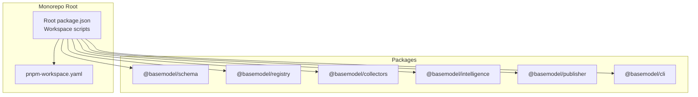
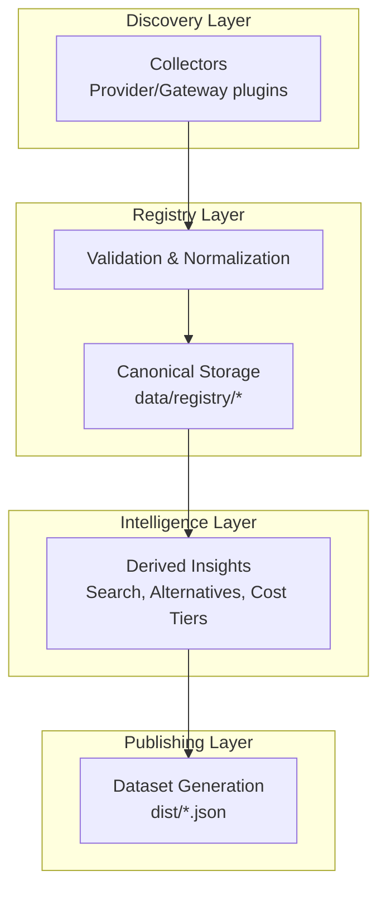
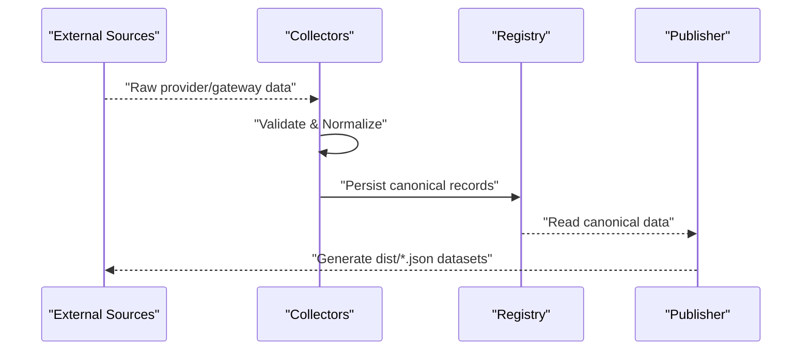
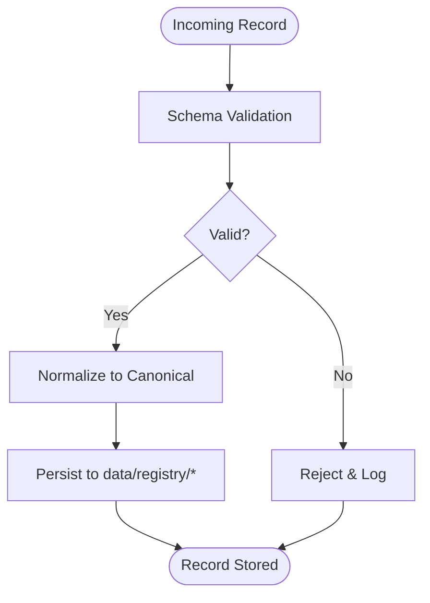
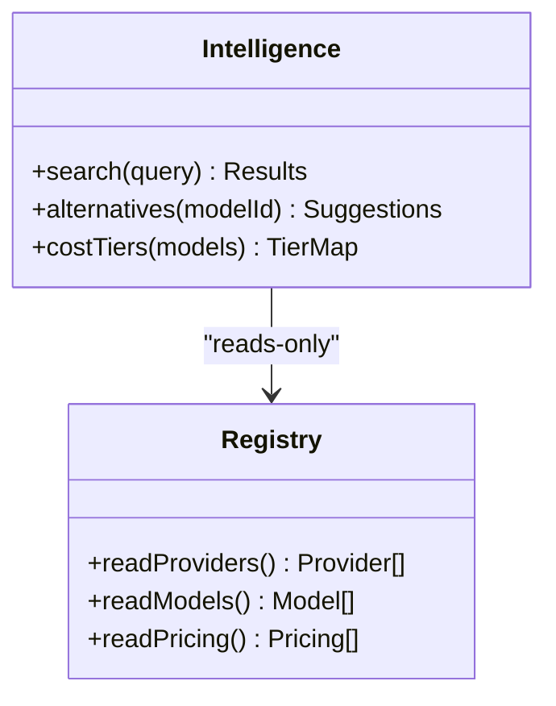
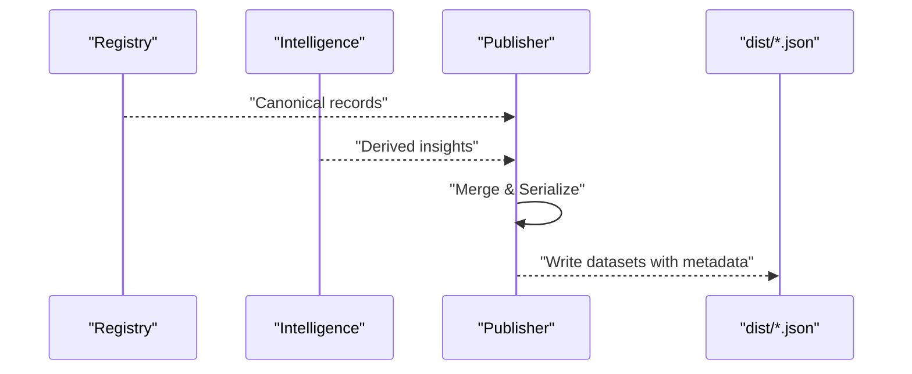
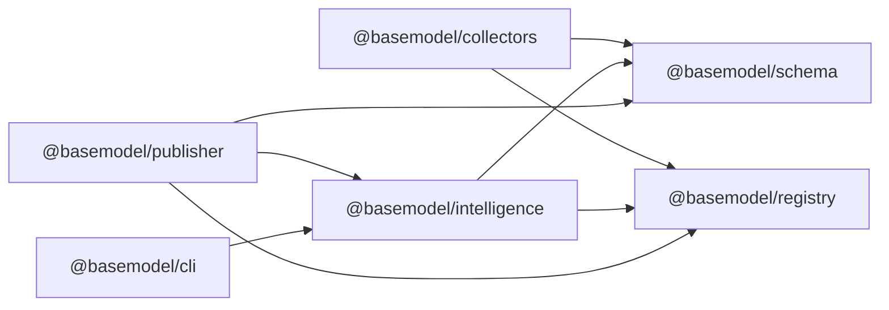

# System Architecture Overview

<cite>
**Referenced Files in This Document**
- [README.md](file://README.md)
- [package.json](file://package.json)
- [pnpm-workspace.yaml](file://pnpm-workspace.yaml)
- [03_Architecture.md](file://docs/03_Architecture.md)
- [04_Pipeline.md](file://docs/04_Pipeline.md)
- [05_Data_Model.md](file://docs/05_Data_Model.md)
- [packages/registry/package.json](file://packages/registry/package.json)
- [packages/collectors/package.json](file://packages/collectors/package.json)
- [packages/intelligence/package.json](file://packages/intelligence/package.json)
- [packages/publisher/package.json](file://packages/publisher/package.json)
- [packages/cli/package.json](file://packages/cli/package.json)
</cite>

## Table of Contents
1. [Introduction](#introduction)
2. [Project Structure](#project-structure)
3. [Core Components](#core-components)
4. [Architecture Overview](#architecture-overview)
5. [Detailed Component Analysis](#detailed-component-analysis)
6. [Dependency Analysis](#dependency-analysis)
7. [Performance Considerations](#performance-considerations)
8. [Troubleshooting Guide](#troubleshooting-guide)
9. [Conclusion](#conclusion)

## Introduction
BaseModel is an open-source AI model intelligence platform that discovers, validates, normalizes, stores, analyzes, and publishes structured knowledge about AI models. It intentionally does not provide inference runtimes or end-user applications; instead, it serves as the data layer consumed by other systems. The system is organized as a monorepo with clear separation between discovery, registry, intelligence, and publishing layers, enabling modularity and stable evolution across multi-provider AI model ecosystems.

**Section sources**
- [README.md:1-61](file://README.md#L1-L61)

## Project Structure
The repository uses a pnpm workspace to manage multiple packages under packages/. Each package encapsulates a distinct architectural layer or tooling concern:
- schema: canonical Zod schemas and TypeScript types
- registry: validation, normalization, and storage of canonical records
- collectors: provider and gateway collectors for discovery and collection
- intelligence: derived rankings, search, and recommendations
- publisher: dataset generation for dist/
- cli: command-line interface for querying intelligence

Workspace configuration and root scripts orchestrate build, test, lint, typecheck, and generation tasks across all packages.

**Diagram sources**
- [package.json:17-25](file://package.json#L17-L25)
- [pnpm-workspace.yaml:1-3](file://pnpm-workspace.yaml#L1-L3)

**Section sources**
- [README.md:10-30](file://README.md#L10-L30)
- [package.json:17-25](file://package.json#L17-L25)
- [pnpm-workspace.yaml:1-3](file://pnpm-workspace.yaml#L1-L3)

## Core Components
BaseModel’s architecture is divided into four primary layers plus supporting tooling:
- Discovery Layer (Collectors): Finds and collects data from providers and gateways.
- Registry Layer (Registry): Validates, normalizes, and persists canonical records.
- Intelligence Layer (Intelligence): Derives search, alternatives, and cost insights without modifying canonical data.
- Publishing Layer (Publisher): Generates public datasets under dist/.
- CLI: Exposes intelligence queries via a terminal interface.

Each layer has a dedicated package with explicit dependencies on @basemodel/schema and, where applicable, adjacent layers.

**Section sources**
- [03_Architecture.md:5-44](file://docs/03_Architecture.md#L5-L44)
- [packages/collectors/package.json:1-41](file://packages/collectors/package.json#L1-L41)
- [packages/registry/package.json:1-35](file://packages/registry/package.json#L1-L35)
- [packages/intelligence/package.json:1-50](file://packages/intelligence/package.json#L1-L50)
- [packages/publisher/package.json:1-38](file://packages/publisher/package.json#L1-L38)
- [packages/cli/package.json:1-45](file://packages/cli/package.json#L1-L45)

## Architecture Overview
The layered architecture enforces strict boundaries and responsibilities:
- Discovery: Identifies sources (provider sites, catalogs, docs, benchmarks).
- Collection: Retrieves structured data via collectors (OpenAI-compatible and custom gateways).
- Validation & Normalization: Enforce schema compliance and convert to canonical forms.
- Registry: Persists canonical entities (providers, models, capabilities, pricing, APIs, benchmarks, licenses).
- Intelligence: Computes derived insights (search, alternatives, cost tiers) without altering registry data.
- Publishing: Writes static JSON datasets to dist/ with metadata.

**Diagram sources**
- [03_Architecture.md:5-77](file://docs/03_Architecture.md#L5-L77)
- [04_Pipeline.md:1-85](file://docs/04_Pipeline.md#L1-L85)

**Section sources**
- [03_Architecture.md:5-77](file://docs/03_Architecture.md#L5-L77)
- [04_Pipeline.md:1-85](file://docs/04_Pipeline.md#L1-L85)

## Detailed Component Analysis

### Discovery and Collection (Collectors)
- Purpose: Discover sources and collect structured data from providers and gateways.
- Plugin-like architecture: Supports OpenAI-compatible gateway plugins and custom gateway plugins.
- Data flow: Collectors fetch raw data, validate against schemas, normalize to canonical forms, and pass to registry.
- Benchmarks: Integrates with LMArena, Open LLM Leaderboard, and Mirror snapshots with fallback behavior when external services are rate-limited.

**Diagram sources**
- [04_Pipeline.md:1-85](file://docs/04_Pipeline.md#L1-L85)
- [packages/collectors/package.json:15-25](file://packages/collectors/package.json#L15-L25)

**Section sources**
- [04_Pipeline.md:1-107](file://docs/04_Pipeline.md#L1-L107)
- [packages/collectors/package.json:1-41](file://packages/collectors/package.json#L1-L41)

### Registry Layer (Validation, Normalization, Storage)
- Purpose: Store canonical records after validation and normalization.
- Entities: Providers, Models, Capabilities, Pricing, APIs, Benchmarks, Licenses.
- Stability: Canonical identifiers and normalized fields ensure consistency across providers.
- Governance: Records carry updated_at timestamps; lifecycle reconciliation marks discontinued models when absent from successful collections.

**Diagram sources**
- [04_Pipeline.md:28-53](file://docs/04_Pipeline.md#L28-L53)
- [05_Data_Model.md:23-169](file://docs/05_Data_Model.md#L23-L169)

**Section sources**
- [04_Pipeline.md:28-53](file://docs/04_Pipeline.md#L28-L53)
- [05_Data_Model.md:23-169](file://docs/05_Data_Model.md#L23-L169)
- [packages/registry/package.json:1-35](file://packages/registry/package.json#L1-L35)

### Intelligence Layer (Derived Insights)
- Purpose: Compute search results, alternative suggestions, and cost efficiency tiers from registry data.
- Constraints: Does not modify canonical records; reads-only from registry.
- Outputs: Used by CLI and publisher to enrich datasets with derived intelligence.

**Diagram sources**
- [03_Architecture.md:23-30](file://docs/03_Architecture.md#L23-L30)
- [packages/intelligence/package.json:1-50](file://packages/intelligence/package.json#L1-L50)

**Section sources**
- [03_Architecture.md:23-30](file://docs/03_Architecture.md#L23-L30)
- [packages/intelligence/package.json:1-50](file://packages/intelligence/package.json#L1-L50)

### Publishing Layer (Dataset Generation)
- Purpose: Convert registry and intelligence data into public datasets under dist/.
- Outputs: providers.json, models.json, capabilities.json, licenses.json, apis.json, benchmarks.json, pricing.json, intelligence.json, metadata.json.
- Metadata: Each dataset includes schema_version, source_revision, generated_at, and count.

**Diagram sources**
- [04_Pipeline.md:64-85](file://docs/04_Pipeline.md#L64-L85)
- [packages/publisher/package.json:1-38](file://packages/publisher/package.json#L1-L38)

**Section sources**
- [04_Pipeline.md:64-85](file://docs/04_Pipeline.md#L64-L85)
- [packages/publisher/package.json:1-38](file://packages/publisher/package.json#L1-L38)

### CLI (Command-Line Interface)
- Purpose: Expose intelligence layer queries from the terminal.
- Dependencies: Depends on @basemodel/intelligence for search and recommendations.

**Section sources**
- [packages/cli/package.json:1-45](file://packages/cli/package.json#L1-L45)

## Dependency Analysis
Package dependencies reflect the layered architecture:
- Collectors depend on @basemodel/registry and @basemodel/schema.
- Intelligence depends on @basemodel/schema and @basemodel/registry.
- Publisher depends on @basemodel/schema, @basemodel/registry, and @basemodel/intelligence.
- CLI depends on @basemodel/intelligence.

**Diagram sources**
- [packages/collectors/package.json:26-30](file://packages/collectors/package.json#L26-L30)
- [packages/registry/package.json:22-25](file://packages/registry/package.json#L22-L25)
- [packages/intelligence/package.json:38-41](file://packages/intelligence/package.json#L38-L41)
- [packages/publisher/package.json:23-27](file://packages/publisher/package.json#L23-L27)
- [packages/cli/package.json:33-35](file://packages/cli/package.json#L33-L35)

**Section sources**
- [packages/collectors/package.json:26-30](file://packages/collectors/package.json#L26-L30)
- [packages/registry/package.json:22-25](file://packages/registry/package.json#L22-L25)
- [packages/intelligence/package.json:38-41](file://packages/intelligence/package.json#L38-L41)
- [packages/publisher/package.json:23-27](file://packages/publisher/package.json#L23-L27)
- [packages/cli/package.json:33-35](file://packages/cli/package.json#L33-L35)

## Performance Considerations
- External service resilience: Benchmark collection falls back to Mirror snapshots when LMArena or Open LLM Leaderboard are rate-limited or unreachable.
- Pricing enrichment: Multi-source aggregation (provider catalogs, OpenRouter, Hugging Face) ensures robustness; failures do not abort early unless all primary sources fail.
- Registry stability: Canonical schemas and normalized fields reduce downstream processing overhead and improve query performance.
- Dataset generation: Static JSON outputs enable fast consumption by consumers without runtime computation.

[No sources needed since this section provides general guidance]

## Troubleshooting Guide
- Invalid records: Rejected during validation; logs indicate errors; registry remains consistent.
- Failed enrichment: If all primary pricing sources fail, runs are marked fatal and CI exits non-zero to prevent stale data commits.
- Freshness checks: Consumers can use updated_at timestamps on records and generated_at on datasets to detect staleness.
- Lifecycle reconciliation: Models absent from successful collections are marked discontinued; failed collections do not deprecate entire provider sets.

**Section sources**
- [04_Pipeline.md:86-113](file://docs/04_Pipeline.md#L86-L113)
- [04_Pipeline.md:163-217](file://docs/04_Pipeline.md#L163-L217)

## Conclusion
BaseModel’s layered architecture cleanly separates discovery, registry, intelligence, and publishing concerns, enabling modular development and stable evolution across multi-provider AI ecosystems. The plugin-like collector system and schema-first approach ensure extensibility and reliability, while robust failure handling and governance practices maintain data quality and freshness. This design supports scalable intelligence gathering and publication for diverse AI model landscapes.

[No sources needed since this section summarizes without analyzing specific files]