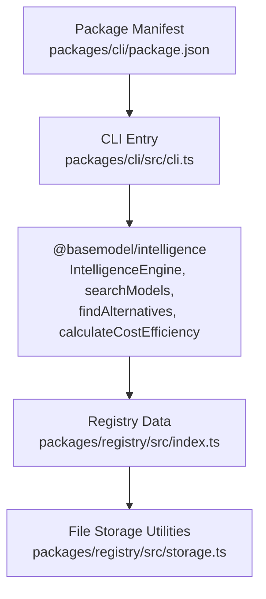
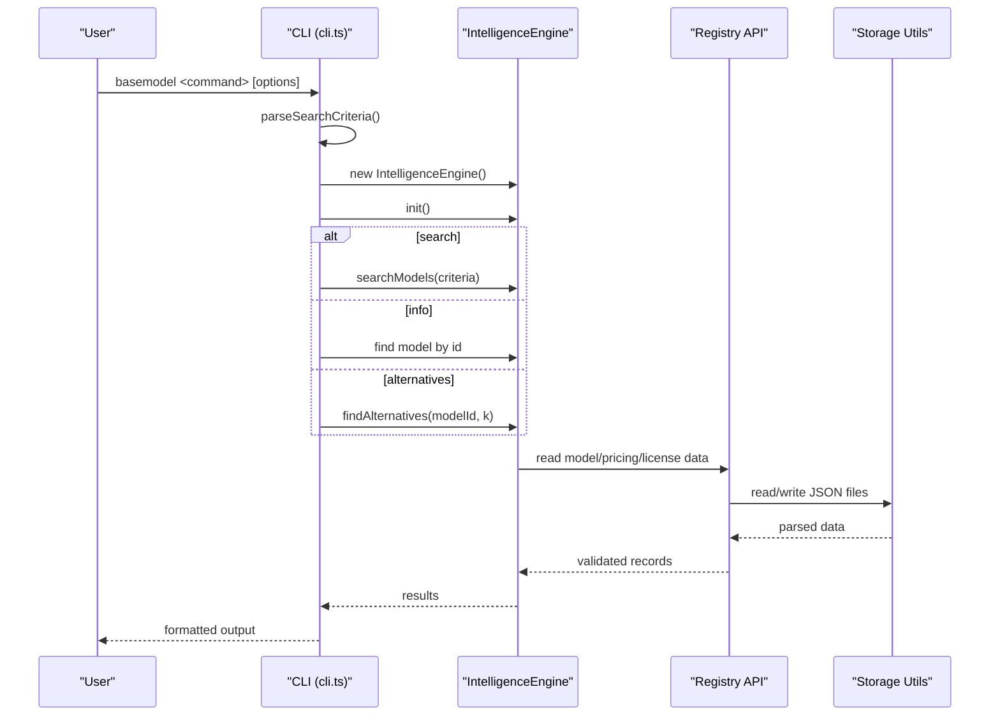
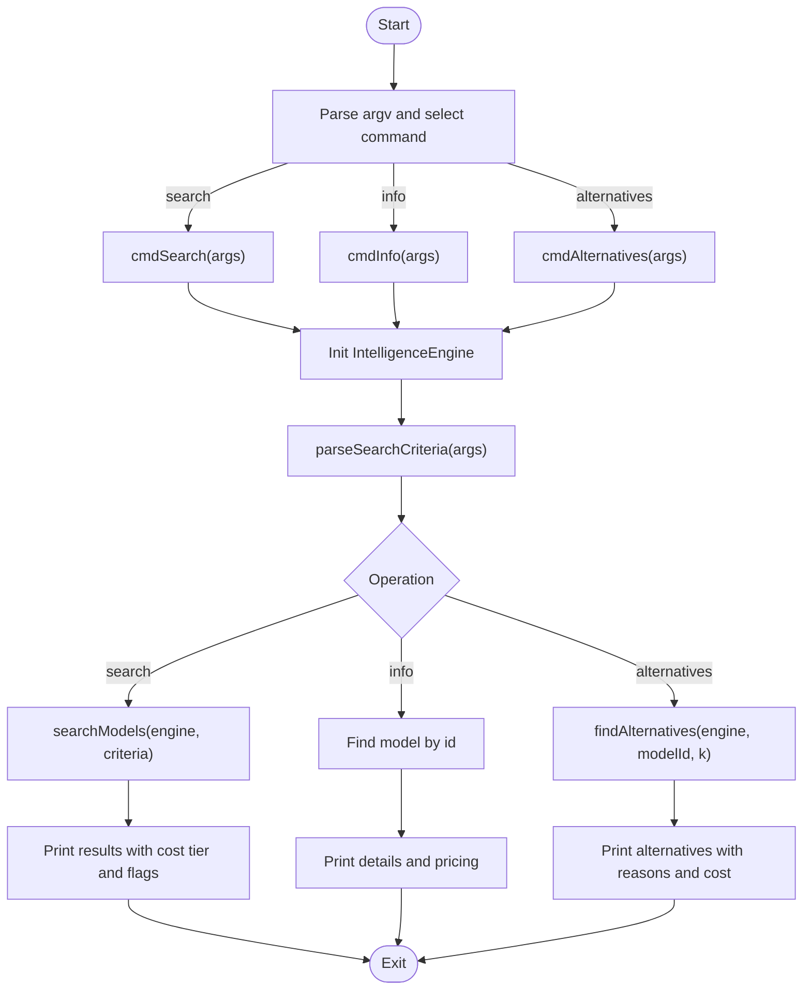
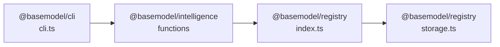

# CLI Package

<cite>
**Referenced Files in This Document**
- [cli.ts](file://packages/cli/src/cli.ts)
- [package.json](file://packages/cli/package.json)
- [cli.test.ts](file://packages/cli/src/__tests__/cli.test.ts)
- [index.ts](file://packages/registry/src/index.ts)
- [storage.ts](file://packages/registry/src/storage.ts)
</cite>

## Table of Contents
1. [Introduction](#introduction)
2. [Project Structure](#project-structure)
3. [Core Components](#core-components)
4. [Architecture Overview](#architecture-overview)
5. [Detailed Component Analysis](#detailed-component-analysis)
6. [Dependency Analysis](#dependency-analysis)
7. [Performance Considerations](#performance-considerations)
8. [Troubleshooting Guide](#troubleshooting-guide)
9. [Conclusion](#conclusion)
10. [Appendices](#appendices)

## Introduction
This document provides comprehensive documentation for the CLI package that offers a command-line interface to interact with BaseModel’s intelligence and registry features. It explains available commands, parameters, configuration options, output formats, authentication setup, environment variables, scripting automation, integration patterns, error handling, logging, and debugging capabilities.

The CLI currently exposes three primary commands: search, info, and alternatives. These commands leverage the @basemodel/intelligence package to query model metadata, compute cost efficiency, and discover alternative models based on criteria such as provider, modality, flags, and context window size.

## Project Structure
The CLI is implemented as a Node.js executable built from TypeScript. The entry point is a script that parses command-line arguments, initializes the IntelligenceEngine, and dispatches to command handlers. The package defines its binary name and build scripts in its package manifest.

**Diagram sources**
- [cli.ts](file://packages/cli/src/cli.ts)
- [package.json](file://packages/cli/package.json)
- [index.ts](file://packages/registry/src/index.ts)
- [storage.ts](file://packages/registry/src/storage.ts)

**Section sources**
- [cli.ts](file://packages/cli/src/cli.ts)
- [package.json](file://packages/cli/package.json)

## Core Components
- Command dispatcher: Parses subcommands (search, info, alternatives) and routes to handlers.
- Search parser: Converts CLI flags into structured search criteria used by the intelligence engine.
- Output formatting: Prints results with colorized tiers and capability flags.
- Error handling: Exits with non-zero status on invalid usage or missing models.

Key responsibilities:
- Argument parsing for search filters (provider, modality, flag, min-context).
- Model lookup and detail printing.
- Alternative discovery and presentation.
- Cost efficiency computation and tier coloring.

**Section sources**
- [cli.ts](file://packages/cli/src/cli.ts)

## Architecture Overview
The CLI follows a simple flow: parse arguments, initialize the intelligence engine, perform queries against the registry-backed data, and print formatted results.

**Diagram sources**
- [cli.ts](file://packages/cli/src/cli.ts)
- [index.ts](file://packages/registry/src/index.ts)
- [storage.ts](file://packages/registry/src/storage.ts)

## Detailed Component Analysis

### CLI Entry Point and Commands
The CLI entry point reads process.argv, selects the command, and invokes the corresponding handler. Each handler initializes the IntelligenceEngine and performs operations using the intelligence functions.

- search: Builds criteria from flags and prints matching models with cost tiers and capability flags.
- info: Looks up a specific model by ID and prints detailed attributes and pricing.
- alternatives: Finds alternative models for a given model ID and prints reasons and costs.

**Diagram sources**
- [cli.ts](file://packages/cli/src/cli.ts)

**Section sources**
- [cli.ts](file://packages/cli/src/cli.ts)

### Search Criteria Parser
The parser converts CLI flags into a structured object consumed by searchModels. Supported flags include:
- --provider: Comma-separated list of provider IDs.
- --modality: Comma-separated list of modalities.
- --flag: Comma-separated list of capability flags.
- --min-context: Numeric minimum context window.

Behavior:
- Ignores unknown flags.
- Ignores flags without values.
- Supports multiple flags in any order.

Tests validate these behaviors comprehensively.

**Section sources**
- [cli.ts](file://packages/cli/src/cli.ts)
- [cli.test.ts](file://packages/cli/src/__tests__/cli.test.ts)

### Output Formatting and Cost Tiers
- Tier colors: Free/Budget-Friendly are green; Balanced is cyan; Premium is yellow; others are dimmed.
- Capability flags: open-weight, reasoning, function-calling, vision are printed when present.
- Pricing: Input/output/blended costs per million tokens are shown when available.

**Section sources**
- [cli.ts](file://packages/cli/src/cli.ts)

### Registry Integration
The CLI relies on the intelligence package, which in turn uses the registry APIs to read model, pricing, license, and API metadata from JSON files under the registry directory. Storage utilities provide atomic writes and safe file listing.

- Read all arrays from directories (e.g., pricing).
- Read single files and validate schemas.
- Atomic write via temp file + rename.

**Section sources**
- [index.ts](file://packages/registry/src/index.ts)
- [storage.ts](file://packages/registry/src/storage.ts)

## Dependency Analysis
The CLI depends on the intelligence package for core functionality. The intelligence package depends on registry APIs and storage utilities.

**Diagram sources**
- [cli.ts](file://packages/cli/src/cli.ts)
- [index.ts](file://packages/registry/src/index.ts)
- [storage.ts](file://packages/registry/src/storage.ts)

**Section sources**
- [package.json](file://packages/cli/package.json)
- [cli.ts](file://packages/cli/src/cli.ts)

## Performance Considerations
- Initialization overhead: IntelligenceEngine initialization occurs per command invocation. For frequent invocations, consider batching or keeping the process alive if extended.
- File I/O: Registry reads are synchronous-like async operations over JSON files. Large registries may incur latency; caching at the application layer can help.
- Output rendering: Colorized console output is lightweight but should be avoided in non-TTY environments for performance and compatibility.

[No sources needed since this section provides general guidance]

## Troubleshooting Guide
Common issues and resolutions:
- Missing model ID: info and alternatives require a valid model ID. Ensure correct format (provider/model).
- No results for search: Verify flags and providers; check registry data availability.
- Exit codes: Non-zero exit indicates errors like missing arguments or not found models.
- Logging and debugging:
  - Use verbose environment variables if supported by dependencies (e.g., DEBUG=*).
  - Redirect stderr to capture error messages.
  - Inspect registry files directly to validate data integrity.

Error handling patterns:
- Usage errors print usage hints and exit with code 1.
- Not found scenarios print descriptive messages and exit with code 1.
- Unhandled exceptions are caught and printed before exiting.

**Section sources**
- [cli.ts](file://packages/cli/src/cli.ts)

## Conclusion
The CLI provides a focused interface to explore AI models, their capabilities, and pricing through the intelligence and registry layers. It supports filtering by provider, modality, flags, and context window, and offers quick lookups and alternative suggestions. With clear error handling and straightforward output, it is suitable for interactive use and automation in development pipelines.

[No sources needed since this section summarizes without analyzing specific files]

## Appendices

### Available Commands and Parameters
- search
  - Flags:
    - --provider: Comma-separated provider IDs.
    - --modality: Comma-separated modalities.
    - --flag: Comma-separated capability flags.
    - --min-context: Minimum context window (number).
  - Output: List of models with name, status, cost tier, and flags.
- info
  - Arguments: model-id (required).
  - Output: Provider, status, modalities, context window, release date, capabilities, and pricing details.
- alternatives
  - Arguments: model-id (required).
  - Output: Alternative models with reasons and cost tier.

**Section sources**
- [cli.ts](file://packages/cli/src/cli.ts)

### Configuration and Environment Variables
- Binary name: basemodel (defined in package manifest).
- Build and run:
  - Build: tsup src/cli.ts --format esm --clean
  - Dev: tsx src/cli.ts
- Environment variables:
  - If the intelligence or registry packages support configuration via environment variables (e.g., registry path), set them accordingly. Check dependency documentation for specifics.

**Section sources**
- [package.json](file://packages/cli/package.json)

### Authentication Setup
- The current CLI does not perform network authentication; it reads local registry data.
- If integrating with remote providers via the intelligence layer, ensure credentials are configured in the environment or configuration files expected by those dependencies.

[No sources needed since this section provides general guidance]

### Scripting Automation and Pipeline Integration
- Example workflows:
  - Query models by modality and provider: basemodel search --modality text,image --provider openai,anthropic
  - Get model details: basemodel info openai/gpt-4o
  - Find alternatives: basemodel alternatives openai/gpt-4o
- CI/CD integration:
  - Capture stdout for parsing results.
  - Capture stderr for error logs.
  - Set exit codes to indicate success/failure.

**Section sources**
- [cli.ts](file://packages/cli/src/cli.ts)

### Output Formats
- Console output is human-readable with colorized tiers and capability flags.
- For machine consumption, redirect output to files and parse structured fields (model_id, name, status, cost tier, capabilities).

**Section sources**
- [cli.ts](file://packages/cli/src/cli.ts)

### Error Handling and Debugging
- Errors:
  - Usage errors print usage hints and exit with code 1.
  - Not found errors print descriptive messages and exit with code 1.
  - Unhandled exceptions are caught and printed before exiting.
- Debugging:
  - Enable debug logs via environment variables if supported by dependencies.
  - Inspect registry JSON files for data validation issues.

**Section sources**
- [cli.ts](file://packages/cli/src/cli.ts)