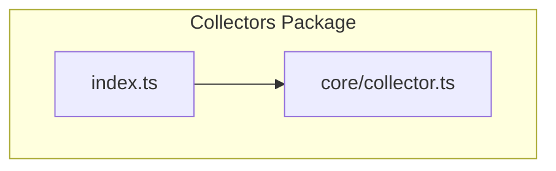
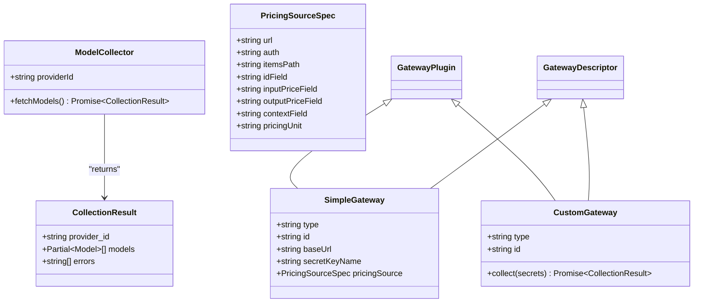
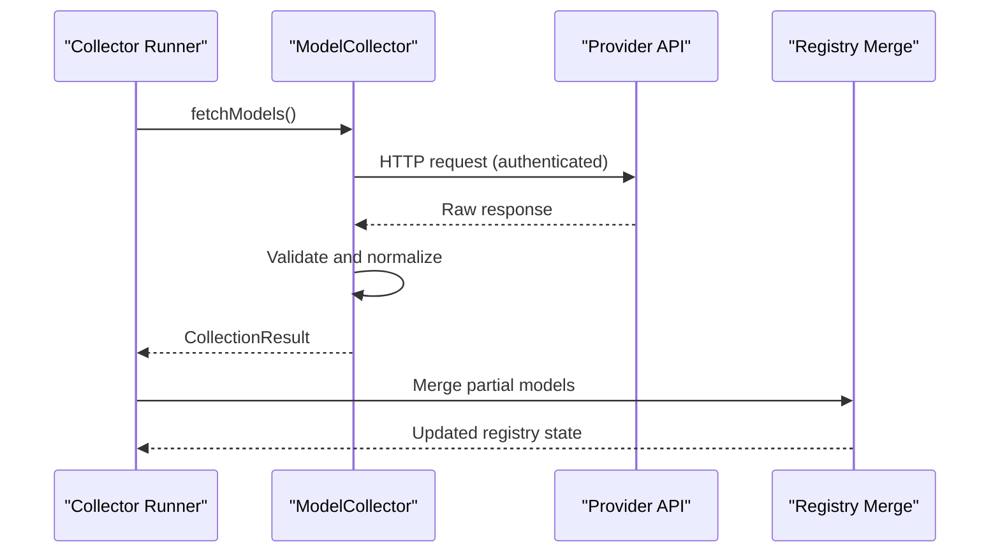
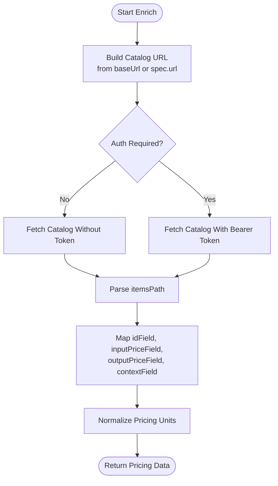
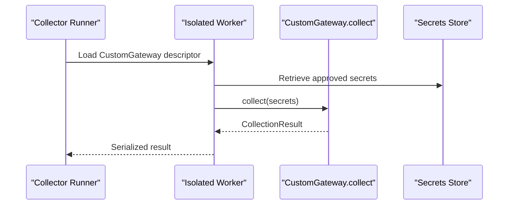
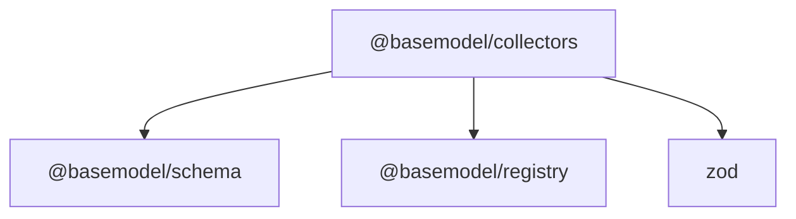
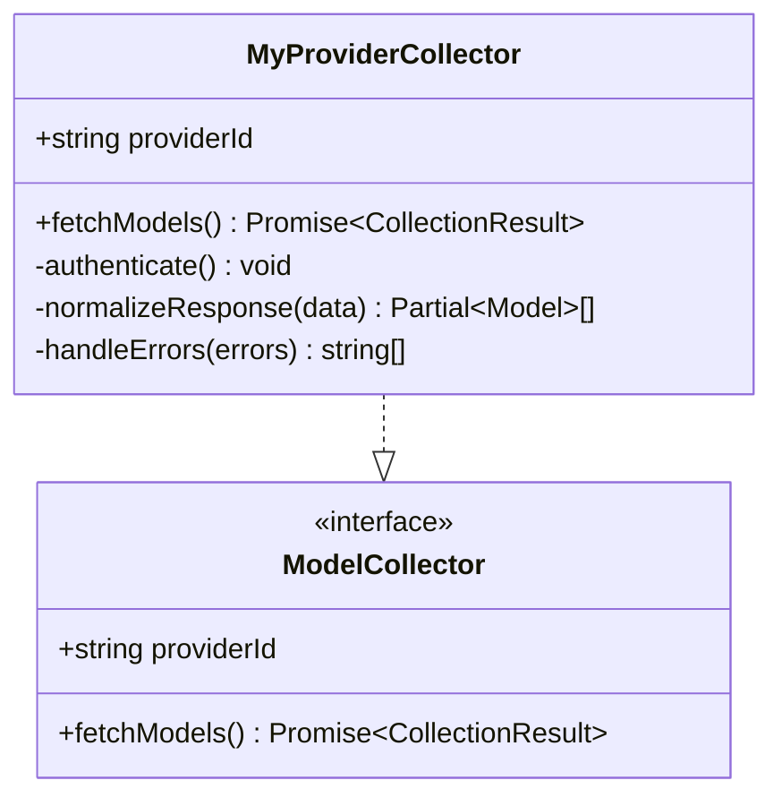
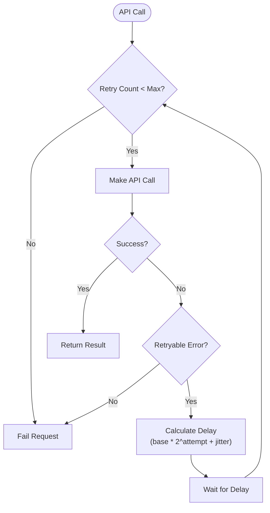

# Collector Architecture & Base Classes

<cite>
**Referenced Files in This Document**
- [collector.ts](file://packages/collectors/src/core/collector.ts)
- [index.ts](file://packages/collectors/src/index.ts)
- [package.json](file://packages/collectors/package.json)
- [README.md](file://README.md)
</cite>

## Table of Contents
1. [Introduction](#introduction)
2. [Project Structure](#project-structure)
3. [Core Components](#core-components)
4. [Architecture Overview](#architecture-overview)
5. [Detailed Component Analysis](#detailed-component-analysis)
6. [Dependency Analysis](#dependency-analysis)
7. [Performance Considerations](#performance-considerations)
8. [Troubleshooting Guide](#troubleshooting-guide)
9. [Conclusion](#conclusion)
10. [Appendices](#appendices)

## Introduction
This document explains the collector architecture and base abstractions that underpin the data collection system for discovering, validating, normalizing, and publishing AI model intelligence. It focuses on the core interfaces and patterns used to implement provider-specific collectors, how configuration is expressed, and how extension points are designed to support both OpenAI-compatible gateways and custom collectors. It also provides guidance on error handling strategies, logging mechanisms, authentication management, and practical examples for extending the base collector with retry logic and response normalization.

## Project Structure
The collectors package exposes a minimal public API surface and centralizes core types and contracts in a single module. The package defines:
- A result shape for collection runs
- A collector interface for provider implementations
- Gateway plugin metadata for OpenAI-compatible providers and custom collectors
- Constants that bound resource usage during collection

**Diagram sources**
- [index.ts:1-2](file://packages/collectors/src/index.ts#L1-L2)
- [collector.ts:1-89](file://packages/collectors/src/core/collector.ts#L1-L89)

**Section sources**
- [README.md:11-17](file://README.md#L11-L17)
- [package.json:1-40](file://packages/collectors/package.json#L1-L40)
- [index.ts:1-2](file://packages/collectors/src/index.ts#L1-L2)

## Core Components
At the heart of the collectors package are:
- CollectionResult: the normalized output of a collection run, including partial models and errors
- ModelCollector: the primary interface that provider collectors implement to fetch and normalize data
- PricingSourceSpec: declarative configuration for fetching pricing catalogs from OpenAI-compatible endpoints
- SimpleGateway and CustomGateway: two supported gateway plugin types
- GatewayPlugin: union type over supported plugins
- GatewayDescriptor: serializable metadata returned from isolated worker processes
- Resource limits: constants controlling maximum models and response size

These components define the contract between the collector runtime and provider-specific implementations, enabling consistent behavior across diverse data sources.

**Section sources**
- [collector.ts:3-10](file://packages/collectors/src/core/collector.ts#L3-L10)
- [collector.ts:12-23](file://packages/collectors/src/core/collector.ts#L12-L23)
- [collector.ts:25-50](file://packages/collectors/src/core/collector.ts#L25-L50)
- [collector.ts:52-80](file://packages/collectors/src/core/collector.ts#L52-L80)
- [collector.ts:82-89](file://packages/collectors/src/core/collector.ts#L82-L89)

## Architecture Overview
The collector architecture separates concerns into clear layers:
- Provider Implementations: implement ModelCollector or provide a CustomGateway collect function
- Plugin Metadata: describe how to reach an OpenAI-compatible endpoint or how to invoke a custom collector
- Runtime Orchestration: executes collectors, enforces limits, manages secrets, and merges results into the registry

**Diagram sources**
- [collector.ts:3-10](file://packages/collectors/src/core/collector.ts#L3-L10)
- [collector.ts:12-23](file://packages/collectors/src/core/collector.ts#L12-L23)
- [collector.ts:25-50](file://packages/collectors/src/core/collector.ts#L25-L50)
- [collector.ts:52-80](file://packages/collectors/src/core/collector.ts#L52-L80)
- [collector.ts:82-89](file://packages/collectors/src/core/collector.ts#L82-L89)

## Detailed Component Analysis

### ModelCollector Interface
The ModelCollector interface defines the contract for provider-specific collectors:
- providerId: unique identifier for the provider
- fetchModels(): asynchronous method returning a CollectionResult

Implementations should:
- Authenticate using approved secrets provided by the runtime
- Fetch raw data from the provider’s API or endpoint
- Validate and normalize responses into Partial<Model> records
- Aggregate any errors encountered during processing

**Diagram sources**
- [collector.ts:12-23](file://packages/collectors/src/core/collector.ts#L12-L23)
- [collector.ts:3-10](file://packages/collectors/src/core/collector.ts#L3-L10)

**Section sources**
- [collector.ts:12-23](file://packages/collectors/src/core/collector.ts#L12-L23)

### PricingSourceSpec and OpenAI-Compatible Gateways
PricingSourceSpec allows declarative configuration for fetching pricing catalogs from OpenAI-compatible endpoints. Key fields include:
- url: catalog URL (defaults to `${baseUrl}/models`)
- auth: whether to send a Bearer token using the gateway secret
- itemsPath: dot-path to the catalog array (default: data)
- idField: field holding the model id (default: id)
- inputPriceField/outputPriceField: dot-paths to price fields (default: input_price/output_price)
- contextField: field holding context window (default: context_window)
- pricingUnit: unit of price fields (default: per-token)

SimpleGateway encapsulates this configuration along with the gateway’s identity and secret key name.

**Diagram sources**
- [collector.ts:25-50](file://packages/collectors/src/core/collector.ts#L25-L50)

**Section sources**
- [collector.ts:25-50](file://packages/collectors/src/core/collector.ts#L25-L50)

### CustomGateway and Isolated Execution
CustomGateway supports arbitrary collection logic executed in an isolated worker process. The collect method receives only approved secrets and returns a CollectionResult. This design ensures:
- Security isolation for proprietary collection code
- Controlled access to secrets
- Consistent result shapes across all collectors

**Diagram sources**
- [collector.ts:67-77](file://packages/collectors/src/core/collector.ts#L67-L77)
- [collector.ts:82-89](file://packages/collectors/src/core/collector.ts#L82-L89)

**Section sources**
- [collector.ts:67-77](file://packages/collectors/src/core/collector.ts#L67-L77)
- [collector.ts:82-89](file://packages/collectors/src/core/collector.ts#L82-L89)

### Resource Limits and Safety Bounds
Two constants enforce safety bounds during collection:
- MAX_PLUGIN_MODELS: maximum number of models a plugin can return
- MAX_PLUGIN_RESPONSE_BYTES: maximum allowed response size in bytes

These limits protect against excessive memory usage and ensure predictable performance characteristics.

**Section sources**
- [collector.ts:9-10](file://packages/collectors/src/core/collector.ts#L9-L10)

## Dependency Analysis
The collectors package depends on:
- @basemodel/schema: for shared types like Model
- @basemodel/registry: for merging and storing collected data
- zod: for validation utilities

The package exports only the core collector types through its index file, maintaining a clean public API.

**Diagram sources**
- [package.json:26-30](file://packages/collectors/package.json#L26-L30)
- [index.ts:1-2](file://packages/collectors/src/index.ts#L1-L2)

**Section sources**
- [package.json:1-40](file://packages/collectors/package.json#L1-L40)
- [index.ts:1-2](file://packages/collectors/src/index.ts#L1-L2)

## Performance Considerations
- Response Size Limits: MAX_PLUGIN_RESPONSE_BYTES prevents memory exhaustion from large API responses
- Model Count Limits: MAX_PLUGIN_MODELS caps the number of models processed per collector
- Normalization Efficiency: Use Partial<Model> to minimize unnecessary field transformations
- Batch Processing: Consider batching API requests where possible to reduce network overhead
- Caching: Implement client-side caching for repeated requests to rate-limited endpoints

[No sources needed since this section provides general guidance]

## Troubleshooting Guide
Common issues and their resolutions:
- Authentication Failures: Verify secret key names match those configured in the runtime
- Rate Limiting: Implement exponential backoff with jitter in custom collectors
- Invalid Responses: Use zod schemas to validate and transform API responses before normalization
- Memory Issues: Monitor response sizes and implement streaming for large datasets
- Timeout Errors: Configure appropriate timeouts based on provider SLAs

Error handling best practices:
- Collect all errors in the errors array of CollectionResult
- Log detailed context without exposing sensitive information
- Provide meaningful error messages for debugging
- Implement retry logic with configurable parameters

**Section sources**
- [collector.ts:3-10](file://packages/collectors/src/core/collector.ts#L3-L10)

## Conclusion
The collector architecture provides a robust foundation for building provider-specific data collectors. Through well-defined interfaces, security-conscious design patterns, and comprehensive configuration options, it enables scalable and maintainable data collection from diverse AI model providers. The separation between simple OpenAI-compatible gateways and custom collectors offers flexibility while maintaining consistency in result formats and execution environments.

[No sources needed since this section summarizes without analyzing specific files]

## Appendices

### Extending the Base Collector
To implement a custom collector:
1. Create a class implementing ModelCollector
2. Define the providerId property
3. Implement fetchModels() to handle authentication, API calls, and data normalization
4. Return CollectionResult with partial models and any errors encountered

Example implementation pattern:

**Diagram sources**
- [collector.ts:12-23](file://packages/collectors/src/core/collector.ts#L12-L23)

### Handling Different API Response Formats
For varying API response structures:
- Use zod schemas to validate and transform different response formats
- Implement field mapping functions to normalize data into Partial<Model>
- Handle optional fields gracefully with default values
- Log transformation failures for debugging

### Implementing Retry Logic with Exponential Backoff
Recommended approach:
- Implement exponential backoff with jitter for transient errors
- Configure maximum retry attempts and timeout values
- Distinguish between retryable and non-retryable errors
- Log retry attempts with relevant context

**Diagram sources**
- [collector.ts:3-10](file://packages/collectors/src/core/collector.ts#L3-L10)

### Configuration Options Reference
Key configuration options for collectors:
- providerId: Unique identifier for the provider
- baseUrl: Base URL for OpenAI-compatible endpoints
- secretKeyName: Name of the secret key for authentication
- pricingSource: Optional pricing catalog configuration
- auth: Authentication method for pricing endpoints

**Section sources**
- [collector.ts:17-23](file://packages/collectors/src/core/collector.ts#L17-L23)
- [collector.ts:55-65](file://packages/collectors/src/core/collector.ts#L55-L65)
- [collector.ts:33-50](file://packages/collectors/src/core/collector.ts#L33-L50)