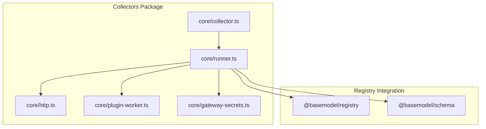
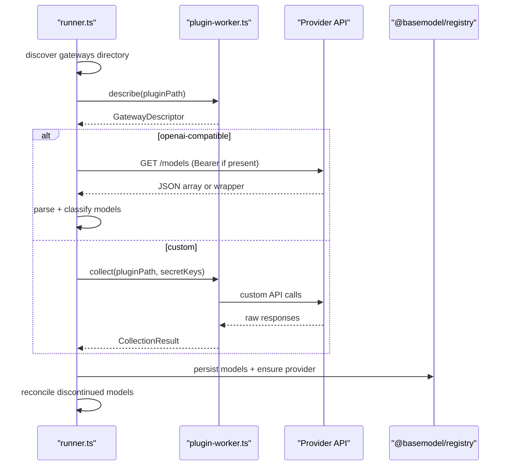
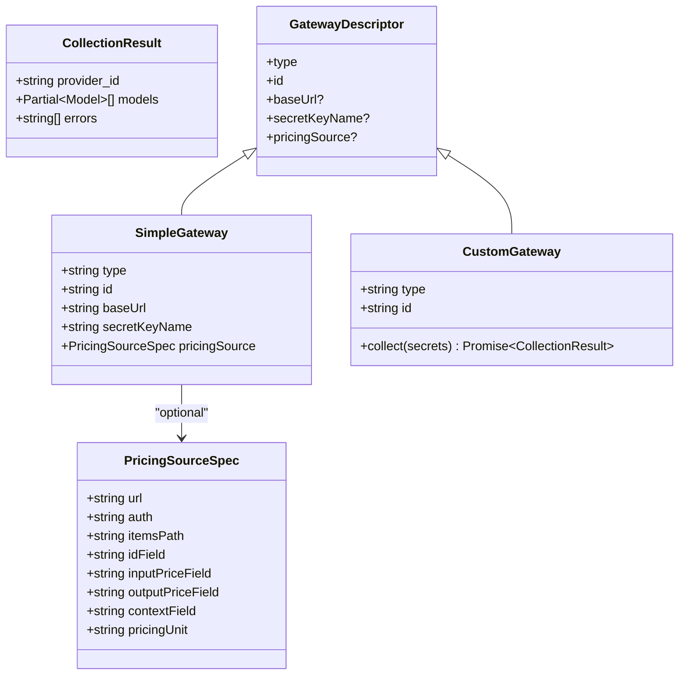
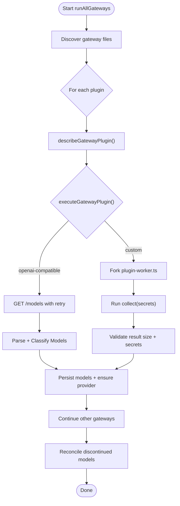
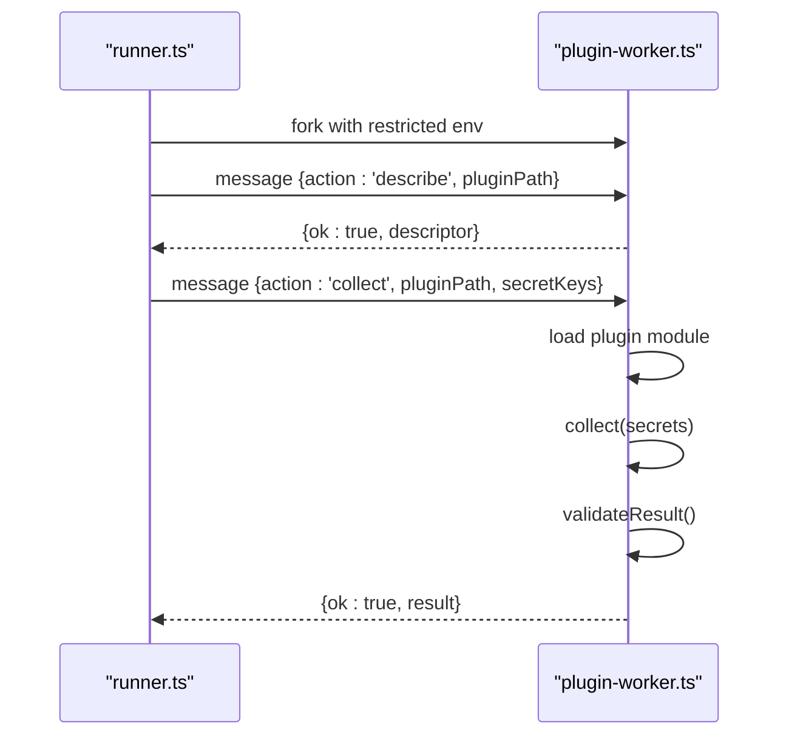
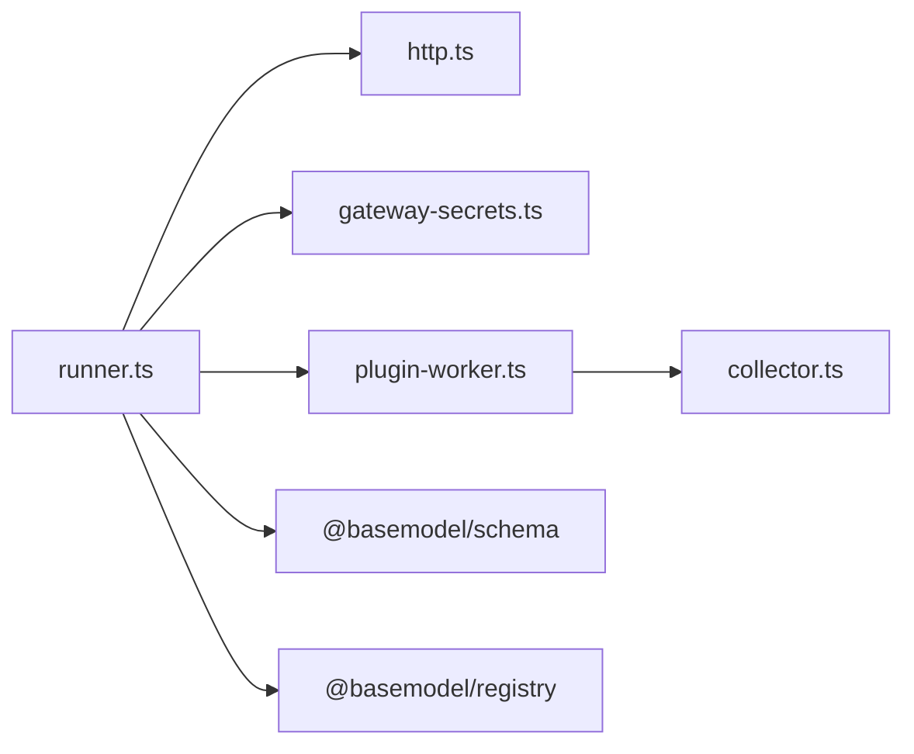
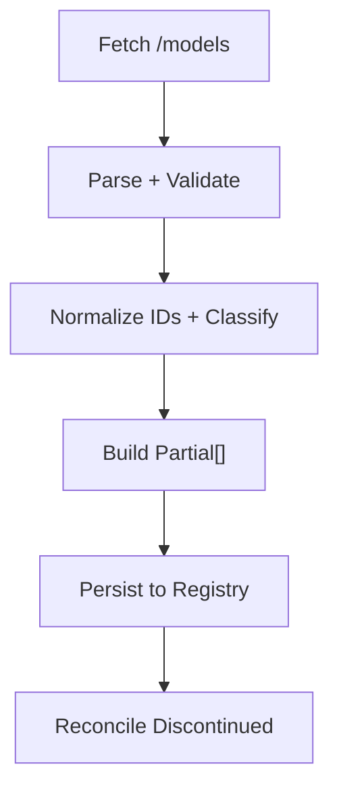

# Collectors Package

<cite>
**Referenced Files in This Document**
- [package.json](file://packages/collectors/package.json)
- [collector.ts](file://packages/collectors/src/core/collector.ts)
- [gateway-secrets.ts](file://packages/collectors/src/core/gateway-secrets.ts)
- [runner.ts](file://packages/collectors/src/core/runner.ts)
- [http.ts](file://packages/collectors/src/core/http.ts)
- [plugin-worker.ts](file://packages/collectors/src/core/plugin-worker.ts)
</cite>

## Table of Contents
1. [Introduction](#introduction)
2. [Project Structure](#project-structure)
3. [Core Components](#core-components)
4. [Architecture Overview](#architecture-overview)
5. [Detailed Component Analysis](#detailed-component-analysis)
6. [Dependency Analysis](#dependency-analysis)
7. [Performance Considerations](#performance-considerations)
8. [Troubleshooting Guide](#troubleshooting-guide)
9. [Conclusion](#conclusion)
10. [Appendices](#appendices)

## Introduction
The Collectors package provides a discovery layer for provider-specific data collection across AI model providers. It implements a gateway pattern that supports two execution modes:
- OpenAI-compatible gateways: declarative configuration to fetch the /models catalog and normalize results into registry records.
- Custom gateways: isolated worker execution with strict security boundaries, allowing bespoke collection logic while limiting exposure to secrets.

The system enforces safe secret handling, rate-limit resilience, response validation, and lifecycle reconciliation to keep the registry consistent with upstream catalogs.

## Project Structure
At a high level, the package exposes:
- Core interfaces and types for collectors and gateways
- A runner that discovers and executes gateway plugins
- HTTP utilities with retry/backoff
- An isolated plugin worker for custom collectors
- Secret allowlisting per gateway

**Diagram sources**
- [collector.ts](file://packages/collectors/src/core/collector.ts)
- [runner.ts](file://packages/collectors/src/core/runner.ts)
- [http.ts](file://packages/collectors/src/core/http.ts)
- [plugin-worker.ts](file://packages/collectors/src/core/plugin-worker.ts)
- [gateway-secrets.ts](file://packages/collectors/src/core/gateway-secrets.ts)

**Section sources**
- [package.json](file://packages/collectors/package.json)

## Core Components
- ModelCollector interface and CollectionResult define the contract for provider collectors and their outputs.
- GatewayPlugin union supports:
  - SimpleGateway (OpenAI-compatible): declares baseUrl, secret key name, and optional pricing source.
  - CustomGateway: defines collect(secrets) executed in an isolated worker.
- PricingSourceSpec enables best-effort enrichment from a catalog endpoint.
- GatewayDescriptor is a serializable subset used by the runner and worker.
- Secrets are centrally whitelisted per gateway via GATEWAY_SECRET_KEYS.

Key responsibilities:
- runner.ts orchestrates discovery, execution, persistence, and reconciliation.
- http.ts centralizes retry/backoff behavior for transient failures.
- plugin-worker.ts isolates custom collectors, validates responses, and redacts secrets.

**Section sources**
- [collector.ts](file://packages/collectors/src/core/collector.ts)
- [gateway-secrets.ts](file://packages/collectors/src/core/gateway-secrets.ts)
- [runner.ts](file://packages/collectors/src/core/runner.ts)
- [http.ts](file://packages/collectors/src/core/http.ts)
- [plugin-worker.ts](file://packages/collectors/src/core/plugin-worker.ts)

## Architecture Overview
The collector architecture follows a gateway pattern:
- Declarative or custom gateways describe how to reach upstream APIs.
- The runner loads descriptors, executes gateways safely, persists normalized models, and reconciles lifecycle states.
- HTTP calls use centralized retry/backoff to handle transient errors.
- Custom collectors run in child processes with minimal environment and validated payloads.

**Diagram sources**
- [runner.ts](file://packages/collectors/src/core/runner.ts)
- [plugin-worker.ts](file://packages/collectors/src/core/plugin-worker.ts)
- [http.ts](file://packages/collectors/src/core/http.ts)

## Detailed Component Analysis

### Collector Interfaces and Types
- CollectionResult carries provider_id, partial Model entries, and error messages.
- MAX_PLUGIN_MODELS and MAX_PLUGIN_RESPONSE_BYTES enforce safety limits on plugin output.
- PricingSourceSpec configures best-effort pricing ingestion from compatible endpoints.
- SimpleGateway and CustomGateway define supported plugin shapes; GatewayDescriptor is the serialized form.

**Diagram sources**
- [collector.ts](file://packages/collectors/src/core/collector.ts)

**Section sources**
- [collector.ts](file://packages/collectors/src/core/collector.ts)

### Secrets Management
- GATEWAY_SECRET_KEYS enumerates allowed environment keys per gateway ID.
- getGatewaySecretKeys returns the approved list for a given gateway.
- createPluginEnvironment builds a restricted env for workers containing only runtime essentials and approved secrets.

Security guarantees:
- Plugins cannot request arbitrary secrets; only those explicitly registered can be passed.
- Errors and logs are sanitized to avoid leaking secrets.

**Section sources**
- [gateway-secrets.ts](file://packages/collectors/src/core/gateway-secrets.ts)
- [runner.ts](file://packages/collectors/src/core/runner.ts)

### Runner Orchestration
Responsibilities:
- Discover gateway plugins under a gateways directory.
- Describe each plugin to obtain a GatewayDescriptor without exposing credentials.
- Execute either:
  - OpenAI-compatible flow: fetch /models, parse both wrapper and bare-array formats, classify models, and build normalized records.
  - Custom flow: spawn a worker process with limited env and execute collect().
- Persist results through registry helpers, ensuring provider metadata exists.
- Reconcile lifecycle by marking models as discontinued when no longer listed by a successful catalog fetch.

Error handling:
- HTTP status hints guide troubleshooting for common failures.
- Plugin timeouts and unexpected exits are handled with clear messages.
- Response parsing errors are captured without failing the entire run.

**Diagram sources**
- [runner.ts](file://packages/collectors/src/core/runner.ts)
- [plugin-worker.ts](file://packages/collectors/src/core/plugin-worker.ts)

**Section sources**
- [runner.ts](file://packages/collectors/src/core/runner.ts)

### HTTP Utilities and Retry Strategy
- RETRYABLE_STATUSES defines which statuses trigger retries (e.g., 429, 5xx).
- fetchWithRetry applies exponential-ish backoff and per-attempt timeouts using AbortSignal.
- Centralizing retries ensures transient failures do not silently break nightly runs.

Best practices:
- Always route external requests through fetchWithRetry.
- Combine with sensible timeouts to prevent hangs.

**Section sources**
- [http.ts](file://packages/collectors/src/core/http.ts)

### Plugin Worker Isolation
- Workers are spawned via child_process.fork with a restricted environment.
- Only approved secret keys are injected; all others are excluded.
- validateResult enforces shape, size limits, and absence of secrets in serialized output.
- Errors are redacted before being sent back to the parent process.

Execution modes:
- describe: returns a minimal descriptor without executing any network calls.
- collect: executes plugin.collect(secrets) and returns a validated CollectionResult.

**Diagram sources**
- [plugin-worker.ts](file://packages/collectors/src/core/plugin-worker.ts)
- [runner.ts](file://packages/collectors/src/core/runner.ts)

**Section sources**
- [plugin-worker.ts](file://packages/collectors/src/core/plugin-worker.ts)

### OpenAI-Compatible Catalog Normalization
- Accepts both OpenAI-style wrapper and bare arrays.
- Infers modality and flags from model IDs to avoid misclassification.
- Builds normalized Partial<Model> entries with provider-scoped model_id slugs.

Normalization pipeline:
- Fetch /models with retry and headers.
- Parse and validate against schema.
- Map ids to slugs and classify capabilities.
- Merge into registry with conflict warnings for collisions.

**Section sources**
- [runner.ts](file://packages/collectors/src/core/runner.ts)

### Lifecycle Reconciliation
- After a successful collection (no errors), models missing from the latest catalog are marked discontinued.
- Failed collections never deprecate models to avoid cascading outages.

**Section sources**
- [runner.ts](file://packages/collectors/src/core/runner.ts)

## Dependency Analysis
Internal dependencies:
- runner.ts depends on core modules for HTTP, classification, slug normalization, and secrets.
- plugin-worker.ts depends on collector types and constants for validation.
- All components rely on @basemodel/registry and @basemodel/schema for persistence and validation.

External integration points:
- Provider APIs via HTTP (retries/backoff).
- Registry storage for models and providers.

**Diagram sources**
- [runner.ts](file://packages/collectors/src/core/runner.ts)
- [http.ts](file://packages/collectors/src/core/http.ts)
- [gateway-secrets.ts](file://packages/collectors/src/core/gateway-secrets.ts)
- [plugin-worker.ts](file://packages/collectors/src/core/plugin-worker.ts)
- [collector.ts](file://packages/collectors/src/core/collector.ts)

**Section sources**
- [runner.ts](file://packages/collectors/src/core/runner.ts)
- [plugin-worker.ts](file://packages/collectors/src/core/plugin-worker.ts)
- [collector.ts](file://packages/collectors/src/core/collector.ts)

## Performance Considerations
- Use fetchWithRetry to avoid repeated transient failures and reduce noise.
- Keep plugin responses small; enforced limits prevent memory pressure.
- Parallelize gateway execution where possible; the runner already uses Promise.allSettled for independent gateways.
- Avoid heavy computation inside collect(); prefer streaming or pagination strategies when needed.

[No sources needed since this section provides general guidance]

## Troubleshooting Guide
Common issues and resolutions:
- Unauthorized (401): Verify API key validity and rotation.
- Forbidden (403): Ensure the key has permission to list models.
- Not found (404): Check base URL and path correctness.
- Precondition failed (412): Billing setup or account suspension may be required.
- Rate limited (429): Retries are applied; persistent limits require throttling or quota increases.

Diagnostics:
- Error body hints are included without leaking secrets.
- Plugin worker errors are redacted and include exit codes when applicable.
- Collisions between different raw model ids normalizing to the same model_id are warned.

**Section sources**
- [runner.ts](file://packages/collectors/src/core/runner.ts)
- [plugin-worker.ts](file://packages/collectors/src/core/plugin-worker.ts)

## Conclusion
The Collectors package provides a robust, secure, and extensible framework for discovering and normalizing AI model catalogs across diverse providers. By combining declarative OpenAI-compatible gateways with isolated custom collectors, it balances simplicity and flexibility. Centralized retry/backoff, strict secret management, and lifecycle reconciliation ensure reliable operation at scale.

[No sources needed since this section summarizes without analyzing specific files]

## Appendices

### How to Implement a Custom Collector
Steps:
1. Create a new gateway file exporting a default object implementing CustomGateway:
   - Define type: 'custom' and a unique id.
   - Implement collect(secrets) returning CollectionResult with provider_id, models[], and errors[].
2. Ensure your code uses only the secrets provided in the secrets map.
3. Keep responses within MAX_PLUGIN_MODELS and MAX_PLUGIN_RESPONSE_BYTES.
4. Serialize only safe data; secrets must not appear in the result.
5. Place the file in the gateways directory so the runner discovers it.

Execution flow:
- Runner describes the plugin to obtain a descriptor.
- Runner spawns a worker with a restricted environment and approved secrets.
- Worker executes collect(), validates output, and returns results.

**Section sources**
- [collector.ts](file://packages/collectors/src/core/collector.ts)
- [plugin-worker.ts](file://packages/collectors/src/core/plugin-worker.ts)
- [runner.ts](file://packages/collectors/src/core/runner.ts)

### How to Add an OpenAI-Compatible Gateway
Steps:
1. Export a default SimpleGateway with:
   - type: 'openai-compatible'
   - id: unique provider/gateway identifier
   - baseUrl: endpoint base URL
   - secretKeyName: one of the approved keys for this gateway
   - Optional pricingSource for enrichment
2. Ensure the gateway’s secret key is registered in GATEWAY_SECRET_KEYS.
3. Place the gateway file in the gateways directory.

Behavior:
- Runner fetches /models with retry/backoff and parses both wrapper and bare-array responses.
- Models are classified and normalized into Partial<Model> records.
- Results are persisted and lifecycle reconciled.

**Section sources**
- [collector.ts](file://packages/collectors/src/core/collector.ts)
- [gateway-secrets.ts](file://packages/collectors/src/core/gateway-secrets.ts)
- [runner.ts](file://packages/collectors/src/core/runner.ts)

### Handling API Rate Limiting
- Use fetchWithRetry for all outbound requests to automatically handle transient 429/5xx errors with backoff.
- Tune attempts and backoffMs parameters as needed for provider constraints.
- Monitor error logs for persistent rate limits and adjust usage patterns accordingly.

**Section sources**
- [http.ts](file://packages/collectors/src/core/http.ts)

### Managing Authentication Tokens
- For OpenAI-compatible gateways, pass Authorization: Bearer token derived from the configured secret key.
- For custom gateways, inject tokens via the secrets map provided to collect().
- Never hardcode secrets; rely on environment variables and the allowlist mechanism.

**Section sources**
- [runner.ts](file://packages/collectors/src/core/runner.ts)
- [gateway-secrets.ts](file://packages/collectors/src/core/gateway-secrets.ts)

### Processing Different Response Formats
- OpenAI-compatible mode accepts both { data: [...] } and bare arrays.
- Custom collectors should normalize upstream responses into Partial<Model> entries before returning CollectionResult.
- Use classification helpers to infer capabilities from model identifiers.

**Section sources**
- [runner.ts](file://packages/collectors/src/core/runner.ts)

### Data Transformation Pipeline
Pipeline stages:
- Fetch upstream catalog (retry/backoff).
- Parse and validate against schemas.
- Normalize model ids to slugs and classify capabilities.
- Merge into registry with conflict detection and warnings.
- Reconcile lifecycle to mark discontinued models.

**Diagram sources**
- [runner.ts](file://packages/collectors/src/core/runner.ts)