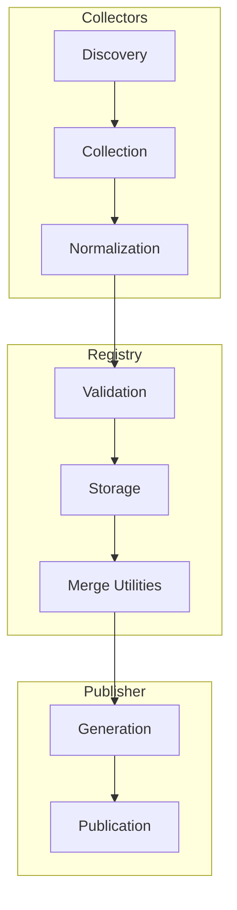
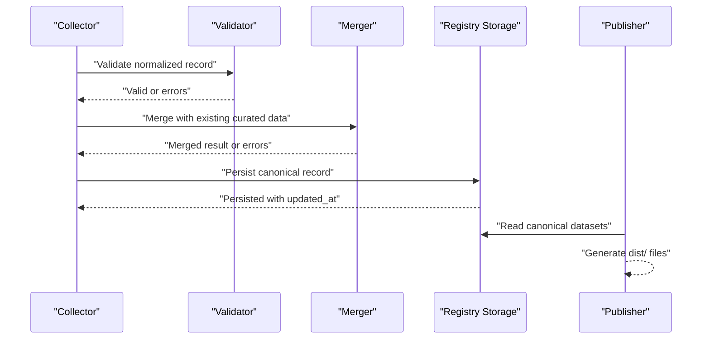
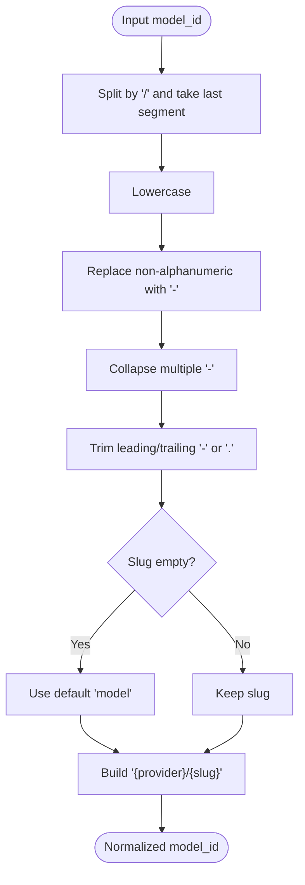
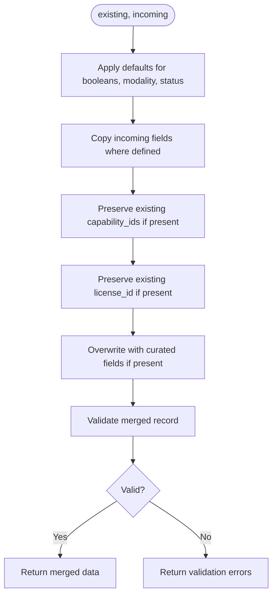
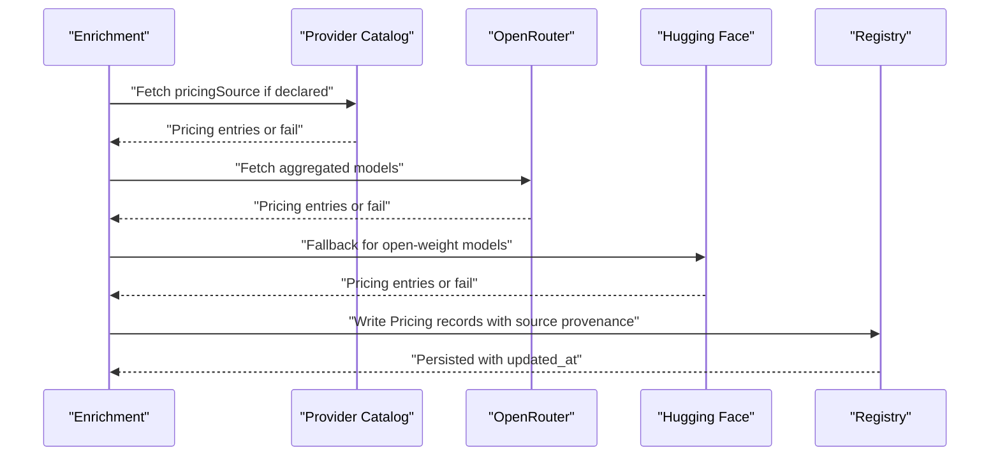
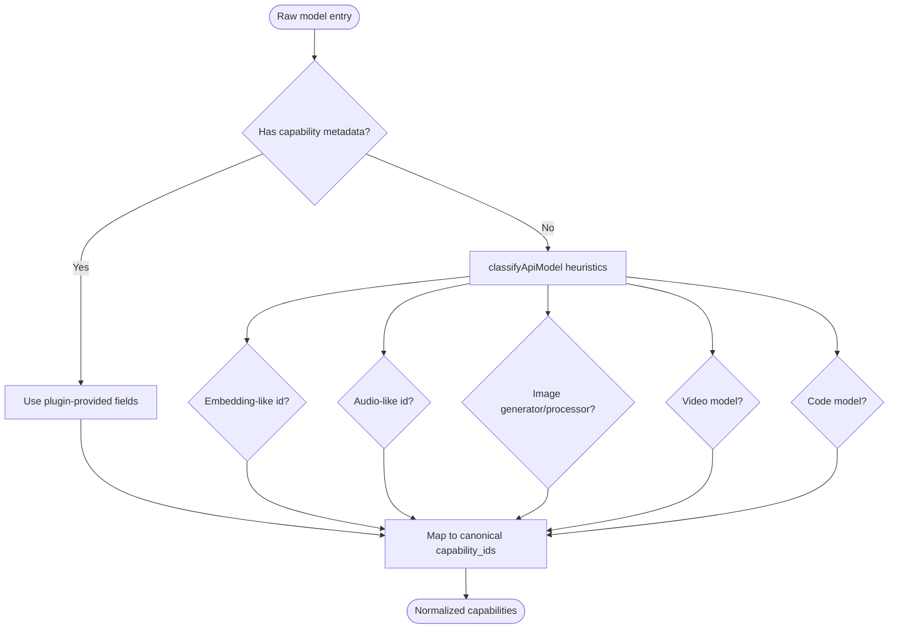
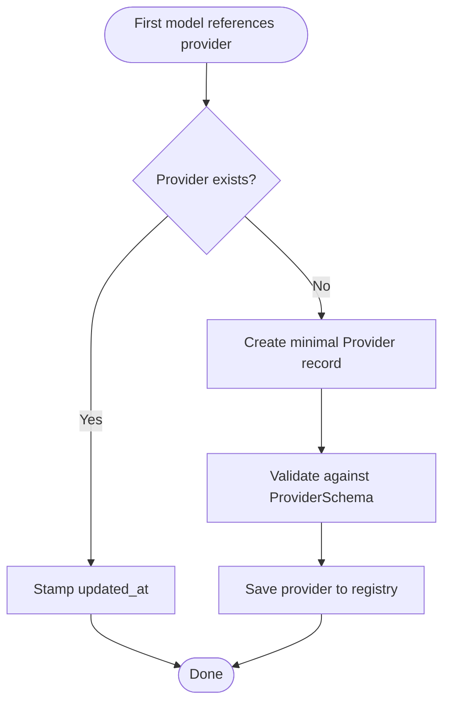
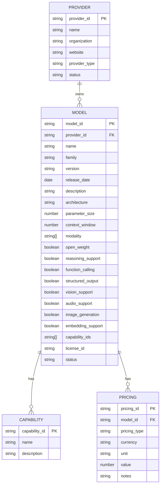
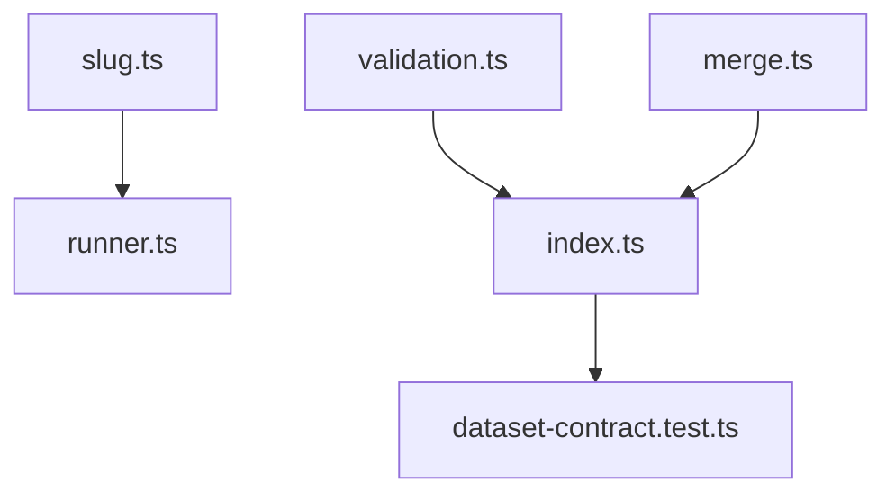

# Data Transformation & Normalization

<cite>
**Referenced Files in This Document**
- [README.md](file://README.md)
- [04_Pipeline.md](file://docs/04_Pipeline.md)
- [05_Data_Model.md](file://docs/05_Data_Model.md)
- [validation.ts](file://packages/registry/src/validation.ts)
- [merge.ts](file://packages/registry/src/merge.ts)
- [index.ts](file://packages/registry/src/index.ts)
- [runner.ts](file://packages/collectors/src/core/runner.ts)
- [slug.ts](file://packages/collectors/src/core/slug.ts)
- [dataset-contract.test.ts](file://packages/publisher/src/__tests__/dataset-contract.test.ts)
</cite>

## Table of Contents
1. [Introduction](#introduction)
2. [Project Structure](#project-structure)
3. [Core Components](#core-components)
4. [Architecture Overview](#architecture-overview)
5. [Detailed Component Analysis](#detailed-component-analysis)
6. [Dependency Analysis](#dependency-analysis)
7. [Performance Considerations](#performance-considerations)
8. [Troubleshooting Guide](#troubleshooting-guide)
9. [Conclusion](#conclusion)
10. [Appendices](#appendices)

## Introduction
This document explains the data transformation and normalization pipeline that converts raw provider responses into standardized canonical formats. It covers the transformer architecture, field mapping strategies, validation rules, and data cleaning processes used to handle missing fields, normalize pricing information, standardize capability descriptions, and maintain consistency across different provider formats. It also includes guidance for creating custom transformers and debugging transformation issues.

## Project Structure
BaseModel is a multi-package repository with clear separation of concerns:
- Schema package defines canonical types and Zod schemas.
- Registry package provides storage, validation, and merge utilities.
- Collectors package implements discovery, collection, and normalization logic.
- Publisher package generates public datasets from the registry.

The canonical records live under data/registry/, and generated datasets are written to dist/. The pipeline stages include discovery, collection, validation, normalization, registry storage, intelligence derivation, generation, and publication.



[No sources needed since this diagram shows conceptual workflow, not actual code structure]

**Section sources**
- [README.md:11-30](file://README.md#L11-L30)
- [04_Pipeline.md:1-15](file://docs/04_Pipeline.md#L1-L15)

## Core Components
- Validation layer enforces schema compliance and rejects malformed or incomplete records before they reach the registry.
- Merge utilities preserve curated human edits while refreshing machine-observable facts.
- Slug normalization ensures consistent model identifiers across providers.
- Provider registration ensures minimal metadata without fabricating optional fields like website URLs.
- Registry APIs provide typed access to all entities (providers, models, capabilities, pricing, APIs, benchmarks, licenses).

Key responsibilities:
- Normalize identifiers and fields to canonical forms.
- Validate inputs against strict schemas.
- Preserve curated data integrity during merges.
- Maintain consistent entity relationships and provenance.

**Section sources**
- [validation.ts:1-42](file://packages/registry/src/validation.ts#L1-L42)
- [merge.ts:1-68](file://packages/registry/src/merge.ts#L1-L68)
- [slug.ts:1-35](file://packages/collectors/src/core/slug.ts#L1-L35)
- [runner.ts:333-363](file://packages/collectors/src/core/runner.ts#L333-L363)
- [index.ts:1-168](file://packages/registry/src/index.ts#L1-L168)

## Architecture Overview
The transformation pipeline follows a staged flow:
- Discovery identifies sources.
- Collection retrieves structured data from providers and gateways.
- Validation checks required fields, identifier formats, schema compliance, URL validity, and timestamps.
- Normalization converts provider-specific representations into BaseModel’s canonical schema.
- Registry stores canonical records with updated timestamps.
- Intelligence derives search, alternatives, and cost tiers without modifying registry data.
- Generation writes public JSON datasets to dist/ with schema versioning and counts.
- Publication distributes datasets via GitHub Pages or other mirrors.



**Diagram sources**
- [04_Pipeline.md:1-15](file://docs/04_Pipeline.md#L1-L15)
- [index.ts:124-147](file://packages/registry/src/index.ts#L124-L147)

**Section sources**
- [04_Pipeline.md:16-98](file://docs/04_Pipeline.md#L16-L98)

## Detailed Component Analysis

### Identifier Normalization and Cleaning
- Model IDs may contain org prefixes, route suffixes, or community markers; these are reduced to schema-safe slugs.
- The slug normalizer extracts the last path segment, lowercases it, replaces disallowed characters, collapses multiple dashes, and trims leading/trailing separators.
- The model ID normalizer guarantees a {provider}/{slug} format by re-keying against the reporting provider, ensuring idempotency for already-valid ids.



**Diagram sources**
- [slug.ts:16-34](file://packages/collectors/src/core/slug.ts#L16-L34)

**Section sources**
- [slug.ts:1-35](file://packages/collectors/src/core/slug.ts#L1-L35)

### Validation Rules and Error Handling
- Validation uses Zod schemas to enforce required fields, identifier formats, URL validity, and timestamp formats.
- The validate function returns a structured result with either parsed data or an array of error messages describing each failing path.
- Batch validation supports collecting row-level errors for lists of records.

```mermaid
classDiagram
class ValidationResult~T~ {
+success : boolean
+data? : T
+errors? : string[]
}
class Validator {
+validate(schema, raw) : ValidationResult
+validateMany(schema, records) : { valid[], invalid[] }
}
Validator --> ValidationResult : "returns"
```

**Diagram sources**
- [validation.ts:11-42](file://packages/registry/src/validation.ts#L11-L42)

**Section sources**
- [validation.ts:1-42](file://packages/registry/src/validation.ts#L1-L42)

### Merge Strategy and Curated Field Ownership
- Merging preserves curated human edits (description, family, release_date, architecture, parameter_size) while refreshing machine-observable facts (context_window, status, name).
- Capability_ids and license_id are preserved if present in existing records.
- Defaults are applied for boolean flags and modality arrays when merging new records.
- Final merged result is validated against the ModelSchema to ensure integrity.



**Diagram sources**
- [merge.ts:22-68](file://packages/registry/src/merge.ts#L22-L68)

**Section sources**
- [merge.ts:1-68](file://packages/registry/src/merge.ts#L1-L68)

### Pricing Normalization and Tier Propagation
- Pricing enrichment draws from three sources: provider-declared catalogs, OpenRouter aggregate, and Hugging Face inference providers.
- Field paths default to OpenAI-compatible /models shape (data, id, input_price, output_price, context_window), with prices in USD per token.
- Tier propagation applies coarse cost tier and free flag to router resellers based on upstream physical models, preferring first-party sources.
- Tier definitions use a blended per-1M-token cost formula and are published in metadata.



**Diagram sources**
- [04_Pipeline.md:141-221](file://docs/04_Pipeline.md#L141-L221)

**Section sources**
- [04_Pipeline.md:141-221](file://docs/04_Pipeline.md#L141-L221)

### Capability Standardization and Heuristics
- When API endpoints do not expose capability metadata, heuristics classify models into embedding, TTS/ASR, image generators, image-processing tools, video models, and code models.
- Custom gateway plugins can emit their own fields which take precedence over generic classification.
- Capability names are normalized to canonical identifiers shared across many models.



**Diagram sources**
- [04_Pipeline.md:34-47](file://docs/04_Pipeline.md#L34-L47)

**Section sources**
- [04_Pipeline.md:34-47](file://docs/04_Pipeline.md#L34-L47)

### Provider Registration and Metadata Governance
- Providers are registered minimally the first time models reference them.
- Website is optional and never fabricated; unknown providers get derived name/type only.
- Successful collection stamps freshness on provider records so consumers can detect staleness.



**Diagram sources**
- [runner.ts:338-363](file://packages/collectors/src/core/runner.ts#L338-L363)

**Section sources**
- [runner.ts:333-363](file://packages/collectors/src/core/runner.ts#L333-L363)

### Data Model and Canonical Entities
- Canonical entities include Provider, Model, Capability, Benchmark, Pricing, API, License.
- Identifiers follow stable conventions: provider_id kebab-case, model_id {provider_id}/{model-slug}.
- Dataset metadata includes schema_version, source_revision, count, and generated_at where applicable.



**Diagram sources**
- [05_Data_Model.md:25-169](file://docs/05_Data_Model.md#L25-L169)

**Section sources**
- [05_Data_Model.md:1-169](file://docs/05_Data_Model.md#L1-L169)

## Dependency Analysis
- Collectors depend on slug normalization and validation utilities to produce canonical records.
- Registry depends on Zod schemas for validation and storage utilities for persistence.
- Publisher depends on registry APIs to read canonical datasets and generate dist/ outputs.
- Contract tests ensure relational integrity between models, providers, and capabilities.



**Diagram sources**
- [slug.ts:1-35](file://packages/collectors/src/core/slug.ts#L1-L35)
- [validation.ts:1-42](file://packages/registry/src/validation.ts#L1-L42)
- [merge.ts:1-68](file://packages/registry/src/merge.ts#L1-L68)
- [index.ts:1-168](file://packages/registry/src/index.ts#L1-L168)
- [dataset-contract.test.ts:108-136](file://packages/publisher/src/__tests__/dataset-contract.test.ts#L108-L136)

**Section sources**
- [dataset-contract.test.ts:108-136](file://packages/publisher/src/__tests__/dataset-contract.test.ts#L108-L136)

## Performance Considerations
- Validation is performed early to reject malformed records quickly, reducing downstream processing overhead.
- Merging avoids unnecessary rewrites of curated fields, preserving editorial work and minimizing churn.
- Pricing enrichment uses best-effort fetching with fallbacks to avoid blocking the pipeline on single-source failures.
- Slug normalization is deterministic and idempotent, preventing redundant transformations.

[No sources needed since this section provides general guidance]

## Troubleshooting Guide
Common issues and resolutions:
- Invalid identifiers: Ensure model_id conforms to {provider}/{slug} after normalization; check slug rules and provider assignment.
- Missing required fields: Review validation error messages to identify failing paths and supply required values.
- Stale provider records: Verify updated_at stamps; ensure successful collection rounds refresh provider metadata.
- Pricing discrepancies: Confirm source provenance and prefer first-party catalogs; check tier propagation for reseller aliases.
- Broken relationships: Run contract tests to verify models reference known providers and capabilities.

Debugging steps:
- Inspect validation errors returned by validate and validateMany.
- Log merge outcomes and curated field preservation.
- Check registry meta files for enrichment status and per-source errors.
- Use dataset contract tests to assert relational integrity.

**Section sources**
- [validation.ts:11-42](file://packages/registry/src/validation.ts#L11-L42)
- [merge.ts:22-68](file://packages/registry/src/merge.ts#L22-L68)
- [04_Pipeline.md:232-248](file://docs/04_Pipeline.md#L232-L248)
- [dataset-contract.test.ts:108-136](file://packages/publisher/src/__tests__/dataset-contract.test.ts#L108-L136)

## Conclusion
The transformation and normalization pipeline ensures robust conversion of diverse provider responses into consistent canonical formats. Through strict validation, careful merging, and deterministic normalization, the system maintains data integrity, preserves curated edits, and supports extensibility for custom transformers. Pricing enrichment and capability standardization further enhance reliability and usability across heterogeneous provider ecosystems.

[No sources needed since this section summarizes without analyzing specific files]

## Appendices

### Creating Custom Transformers
- Implement normalization functions for provider-specific fields using slug and validation utilities.
- Map provider capability names to canonical capability_ids following established heuristics.
- Ensure idempotency and determinism in transformations to prevent inconsistent state.
- Validate outputs against canonical schemas before persisting to the registry.

### Debugging Transformation Issues
- Capture and inspect validation error arrays to pinpoint failing fields.
- Log intermediate normalized records to trace transformation steps.
- Use registry meta files to diagnose enrichment failures and source availability.
- Run dataset contract tests to validate cross-entity relationships post-transformation.

[No sources needed since this section provides general guidance]