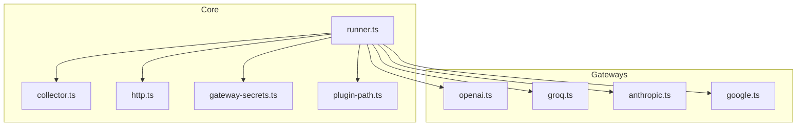
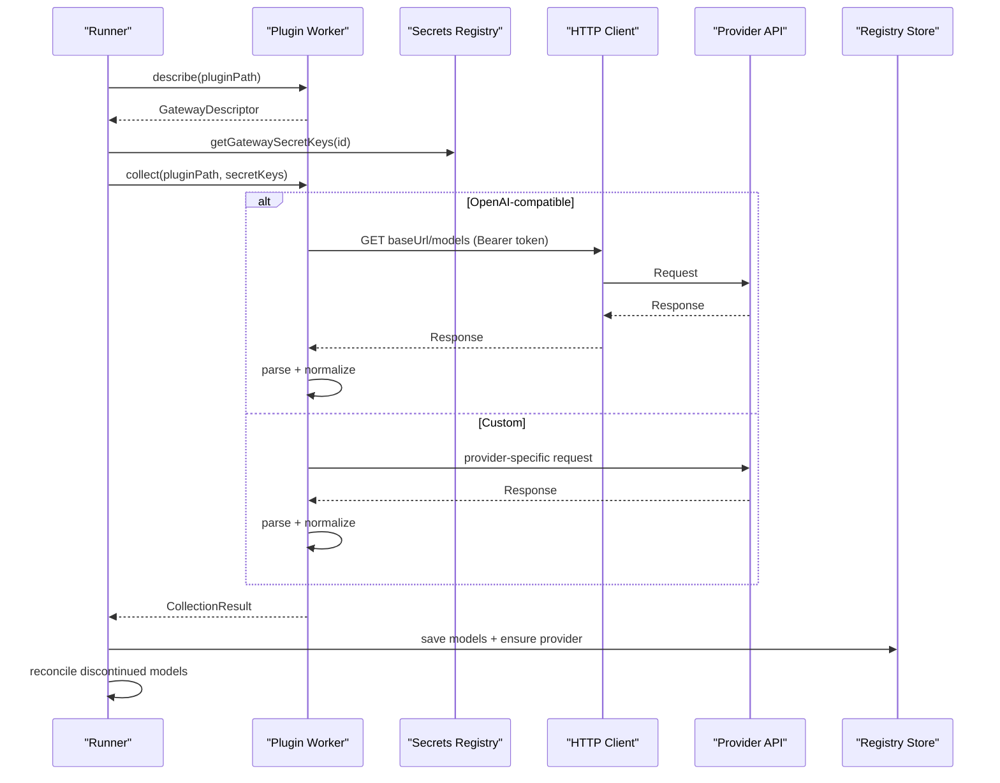
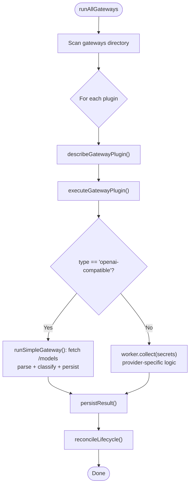
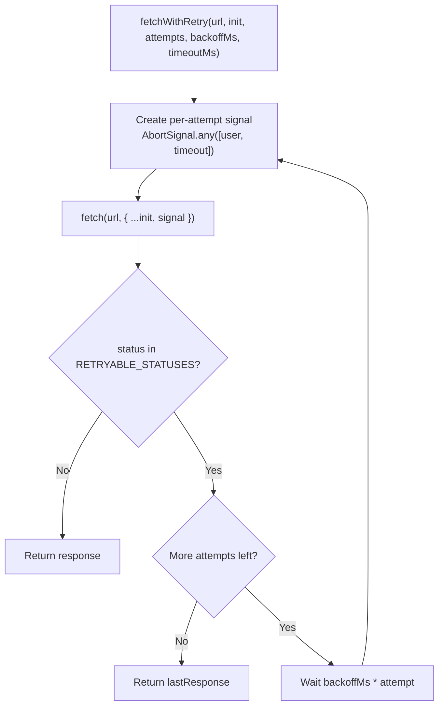
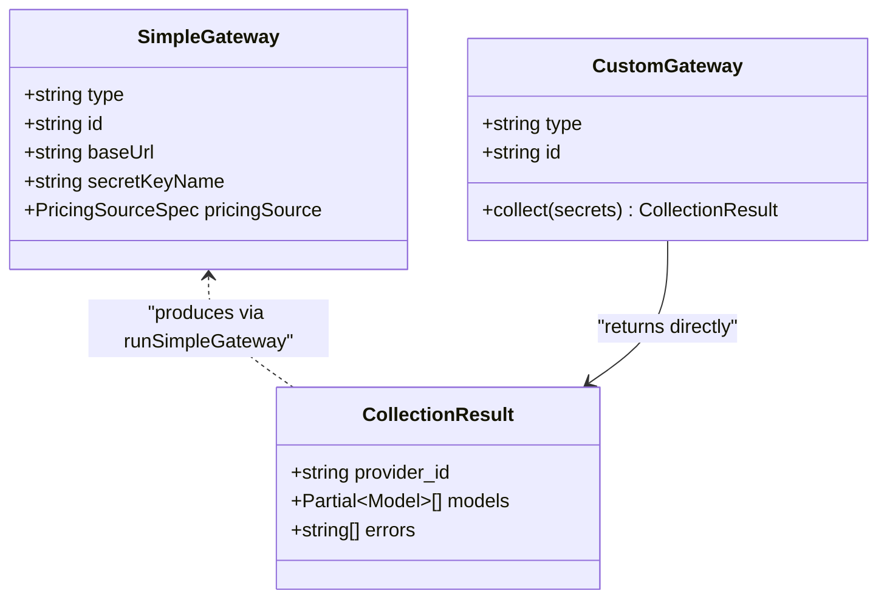
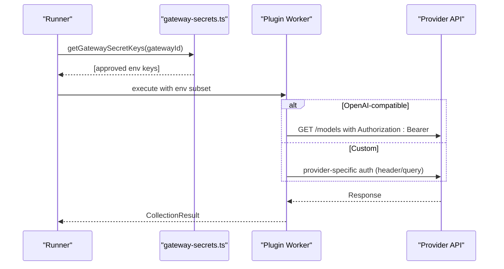
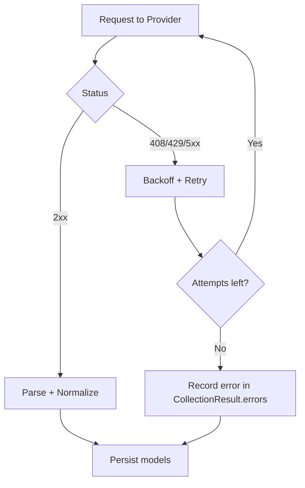
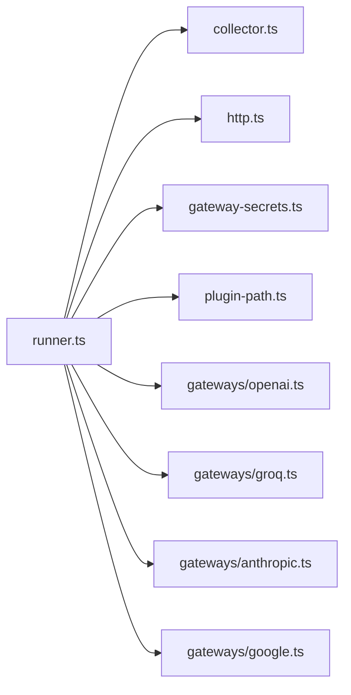

# Gateway Pattern & API Integrations

<cite>
**Referenced Files in This Document**
- [collector.ts](file://packages/collectors/src/core/collector.ts)
- [runner.ts](file://packages/collectors/src/core/runner.ts)
- [http.ts](file://packages/collectors/src/core/http.ts)
- [gateway-secrets.ts](file://packages/collectors/src/core/gateway-secrets.ts)
- [plugin-path.ts](file://packages/collectors/src/core/plugin-path.ts)
- [openai.ts](file://packages/collectors/src/gateways/openai.ts)
- [groq.ts](file://packages/collectors/src/gateways/groq.ts)
- [anthropic.ts](file://packages/collectors/src/gateways/anthropic.ts)
- [google.ts](file://packages/collectors/src/gateways/google.ts)
</cite>

## Table of Contents
1. Introduction
2. Project Structure
3. Core Components
4. Architecture Overview
5. Detailed Component Analysis
6. Dependency Analysis
7. Performance Considerations
8. Troubleshooting Guide
9. Conclusion

## Introduction
This document explains the gateway pattern used to integrate with multiple AI providers. It focuses on how the system discovers, authenticates, and executes provider-specific collectors; how HTTP requests are made resiliently; how responses are normalized into a common model schema; and how errors, rate limits, timeouts, and lifecycle reconciliation are handled. It also provides guidance for implementing custom gateways, supporting different API versions, and managing API key rotation.

## Project Structure
The gateway implementation lives under the collectors package:
- Core runtime and orchestration live in core/ (runner, http client, secrets registry, plugin path validation).
- Provider plugins live in gateways/ (declarative OpenAI-compatible or custom collectors).
- Tests validate behavior such as retries, timeouts, and plugin path security.

**Diagram sources**
- [collector.ts](file://packages/collectors/src/core/collector.ts)
- [runner.ts](file://packages/collectors/src/core/runner.ts)
- [http.ts](file://packages/collectors/src/core/http.ts)
- [gateway-secrets.ts](file://packages/collectors/src/core/gateway-secrets.ts)
- [plugin-path.ts](file://packages/collectors/src/core/plugin-path.ts)
- [openai.ts](file://packages/collectors/src/gateways/openai.ts)
- [groq.ts](file://packages/collectors/src/gateways/groq.ts)
- [anthropic.ts](file://packages/collectors/src/gateways/anthropic.ts)
- [google.ts](file://packages/collectors/src/gateways/google.ts)

**Section sources**
- [collector.ts](file://packages/collectors/src/core/collector.ts)
- [runner.ts](file://packages/collectors/src/core/runner.ts)
- [http.ts](file://packages/collectors/src/core/http.ts)
- [gateway-secrets.ts](file://packages/collectors/src/core/gateway-secrets.ts)
- [plugin-path.ts](file://packages/collectors/src/core/plugin-path.ts)
- [openai.ts](file://packages/collectors/src/gateways/openai.ts)
- [groq.ts](file://packages/collectors/src/gateways/groq.ts)
- [anthropic.ts](file://packages/collectors/src/gateways/anthropic.ts)
- [google.ts](file://packages/collectors/src/gateways/google.ts)

## Core Components
- Gateway descriptors define two patterns:
  - SimpleGateway: declarative configuration for OpenAI-compatible endpoints.
  - CustomGateway: full control via a collect() function executed in an isolated worker.
- CollectionResult is the normalized output shape that feeds the registry.
- Runner orchestrates discovery, isolation, execution, persistence, and reconciliation.
- HTTP client centralizes retry/backoff and timeout handling.
- Secrets registry whitelists which environment variables each gateway may access.
- Plugin path validator prevents traversal and enforces allowed extensions.

Key responsibilities:
- runner.ts: orchestrates plugin loading, worker isolation, result persistence, and lifecycle reconciliation.
- collector.ts: defines interfaces and shared constants for gateways and results.
- http.ts: implements fetchWithRetry with exponential backoff and per-attempt timeouts.
- gateway-secrets.ts: declares approved secret keys per gateway.
- plugin-path.ts: validates plugin paths for safety.

**Section sources**
- [collector.ts](file://packages/collectors/src/core/collector.ts)
- [runner.ts](file://packages/collectors/src/core/runner.ts)
- [http.ts](file://packages/collectors/src/core/http.ts)
- [gateway-secrets.ts](file://packages/collectors/src/core/gateway-secrets.ts)
- [plugin-path.ts](file://packages/collectors/src/core/plugin-path.ts)

## Architecture Overview
The runtime discovers gateway plugins, loads metadata in an isolated worker, executes collection with only approved secrets, normalizes responses, persists models, and reconciles discontinued models when catalogs change.

**Diagram sources**
- [runner.ts](file://packages/collectors/src/core/runner.ts)
- [http.ts](file://packages/collectors/src/core/http.ts)
- [collector.ts](file://packages/collectors/src/core/collector.ts)
- [gateway-secrets.ts](file://packages/collectors/src/core/gateway-secrets.ts)

## Detailed Component Analysis

### BaseGateway Concept and Orchestration
There is no explicit BaseGateway class; instead, the runner implements the base behavior for all gateways:
- Discovery and safe loading of plugins from the gateways directory.
- Isolation via child_process workers to prevent credential leakage.
- Two execution paths:
  - Simple openai-compatible flow using a shared HTTP client and response normalization.
  - Custom flow where the plugin’s collect() runs in the worker with only approved secrets.
- Persistence and reconciliation of model lifecycle states.

**Diagram sources**
- [runner.ts](file://packages/collectors/src/core/runner.ts)

**Section sources**
- [runner.ts](file://packages/collectors/src/core/runner.ts)

### HTTP Client Abstraction and Resilience
- fetchWithRetry centralizes transient error handling:
  - Retries on 408, 429, 5xx statuses with exponential backoff.
  - Per-attempt AbortSignal.timeout ensures time-bound requests.
  - Fresh signals per attempt avoid abort poisoning across retries.
- The simple gateway uses this client for OpenAI-compatible endpoints.

**Diagram sources**
- [http.ts](file://packages/collectors/src/core/http.ts)

**Section sources**
- [http.ts](file://packages/collectors/src/core/http.ts)
- [runner.ts](file://packages/collectors/src/core/runner.ts)

### Request/Response Transformation
- OpenAI-compatible normalization:
  - Accepts both wrapper { data: [...] } and bare arrays.
  - Infers capabilities from model id (modality, reasoning, vision, audio, etc.).
  - Normalizes model ids and slugs consistently.
- Custom gateways implement their own parsing and mapping to Partial<Model>.

**Diagram sources**
- [collector.ts](file://packages/collectors/src/core/collector.ts)
- [runner.ts](file://packages/collectors/src/core/runner.ts)

**Section sources**
- [collector.ts](file://packages/collectors/src/core/collector.ts)
- [runner.ts](file://packages/collectors/src/core/runner.ts)

### Provider-Specific Authentication Methods
- Secrets are whitelisted per gateway in gateway-secrets.ts.
- Simple gateways receive only the approved secret name’s value from process.env.
- Custom gateways receive a restricted secrets object containing only approved keys.
- Examples:
  - OpenAI and Groq use Authorization: Bearer tokens.
  - Anthropic uses x-api-key header and versioning.
  - Google passes key as query parameter and sets a client header.

**Diagram sources**
- [gateway-secrets.ts](file://packages/collectors/src/core/gateway-secrets.ts)
- [runner.ts](file://packages/collectors/src/core/runner.ts)
- [openai.ts](file://packages/collectors/src/gateways/openai.ts)
- [groq.ts](file://packages/collectors/src/gateways/groq.ts)
- [anthropic.ts](file://packages/collectors/src/gateways/anthropic.ts)
- [google.ts](file://packages/collectors/src/gateways/google.ts)

**Section sources**
- [gateway-secrets.ts](file://packages/collectors/src/core/gateway-secrets.ts)
- [openai.ts](file://packages/collectors/src/gateways/openai.ts)
- [groq.ts](file://packages/collectors/src/gateways/groq.ts)
- [anthropic.ts](file://packages/collectors/src/gateways/anthropic.ts)
- [google.ts](file://packages/collectors/src/gateways/google.ts)

### Rate Limiting, Connection Pooling, Timeouts, and Error Categorization
- Rate limiting:
  - Transient 429 is retried with exponential backoff via fetchWithRetry.
  - If limits persist after retries, the error is recorded in CollectionResult.errors.
- Connection pooling:
  - Uses Node.js default fetch behavior; pooling is managed by the runtime.
- Timeouts:
  - Per-request AbortSignal.timeout ensures bounded latency.
  - Plugin worker has a global timeout to kill long-running collectors.
- Error categorization:
  - HTTP status hints guide troubleshooting (e.g., 401, 403, 404, 412, 429).
  - Non-retryable errors are surfaced immediately; retryable ones are retried then categorized.

**Diagram sources**
- [http.ts](file://packages/collectors/src/core/http.ts)
- [runner.ts](file://packages/collectors/src/core/runner.ts)

**Section sources**
- [http.ts](file://packages/collectors/src/core/http.ts)
- [runner.ts](file://packages/collectors/src/core/runner.ts)

### Implementing Custom Gateways
Two patterns are supported:

- SimpleGateway (OpenAI-compatible):
  - Provide id, baseUrl, and secretKeyName.
  - The runner handles authentication, fetching, parsing, and normalization.
  - Example files: openai.ts, groq.ts.

- CustomGateway:
  - Implement collect(secrets) to call the provider API, parse responses, and return CollectionResult.
  - Use zod schemas to validate provider responses.
  - Example files: anthropic.ts, google.ts.

Guidelines:
- Only use secrets explicitly whitelisted in gateway-secrets.ts.
- Keep responses small; enforce MAX_PLUGIN_RESPONSE_BYTES and MAX_PLUGIN_MODELS.
- Map provider fields to Partial<Model>, including modality and capability flags.
- Handle errors gracefully by pushing messages into errors array.

**Section sources**
- [collector.ts](file://packages/collectors/src/core/collector.ts)
- [runner.ts](file://packages/collectors/src/core/runner.ts)
- [openai.ts](file://packages/collectors/src/gateways/openai.ts)
- [groq.ts](file://packages/collectors/src/gateways/groq.ts)
- [anthropic.ts](file://packages/collectors/src/gateways/anthropic.ts)
- [google.ts](file://packages/collectors/src/gateways/google.ts)

### Handling Different API Versions
- Custom gateways can pin headers or query parameters to specific versions:
  - Example: anthropic.ts sets a version header.
  - Example: google.ts targets a specific API path and client header.
- For OpenAI-compatible gateways, baseUrl points to the desired versioned endpoint.

Best practices:
- Pin versions in code to avoid breaking changes.
- Add deprecation notes and migration steps when updating versions.

**Section sources**
- [anthropic.ts](file://packages/collectors/src/gateways/anthropic.ts)
- [google.ts](file://packages/collectors/src/gateways/google.ts)

### Managing API Key Rotation
- Secrets are read from environment variables at runtime.
- To rotate keys:
  - Update the environment variable value in your deployment platform.
  - Ensure the key name matches the one declared in gateway-secrets.ts.
- The runner never exposes unapproved keys to plugin code.

Operational tips:
- Use short-lived credentials where possible.
- Monitor errors for 401/403 to detect expired or rotated keys quickly.

**Section sources**
- [gateway-secrets.ts](file://packages/collectors/src/core/gateway-secrets.ts)
- [runner.ts](file://packages/collectors/src/core/runner.ts)

## Dependency Analysis
The runner depends on:
- collector.ts for interface definitions and constants.
- http.ts for resilient networking.
- gateway-secrets.ts for approved secret names.
- plugin-path.ts for secure plugin resolution.
- Provider plugins in gateways/ for actual API calls.

**Diagram sources**
- [runner.ts](file://packages/collectors/src/core/runner.ts)
- [collector.ts](file://packages/collectors/src/core/collector.ts)
- [http.ts](file://packages/collectors/src/core/http.ts)
- [gateway-secrets.ts](file://packages/collectors/src/core/gateway-secrets.ts)
- [plugin-path.ts](file://packages/collectors/src/core/plugin-path.ts)
- [openai.ts](file://packages/collectors/src/gateways/openai.ts)
- [groq.ts](file://packages/collectors/src/gateways/groq.ts)
- [anthropic.ts](file://packages/collectors/src/gateways/anthropic.ts)
- [google.ts](file://packages/collectors/src/gateways/google.ts)

**Section sources**
- [runner.ts](file://packages/collectors/src/core/runner.ts)
- [collector.ts](file://packages/collectors/src/core/collector.ts)
- [http.ts](file://packages/collectors/src/core/http.ts)
- [gateway-secrets.ts](file://packages/collectors/src/core/gateway-secrets.ts)
- [plugin-path.ts](file://packages/collectors/src/core/plugin-path.ts)
- [openai.ts](file://packages/collectors/src/gateways/openai.ts)
- [groq.ts](file://packages/collectors/src/gateways/groq.ts)
- [anthropic.ts](file://packages/collectors/src/gateways/anthropic.ts)
- [google.ts](file://packages/collectors/src/gateways/google.ts)

## Performance Considerations
- Network resilience:
  - Exponential backoff reduces load during transient failures.
  - Per-attempt timeouts prevent hanging requests.
- Concurrency:
  - Gateways run concurrently; ensure upstream APIs can handle concurrent requests.
- Memory and payload limits:
  - Enforce MAX_PLUGIN_RESPONSE_BYTES and MAX_PLUGIN_MODELS to avoid memory pressure.
- I/O efficiency:
  - Batch model merges and updates where possible.
  - Avoid unnecessary logging in hot paths.

[No sources needed since this section provides general guidance]

## Troubleshooting Guide
Common issues and resolutions:
- Missing API key:
  - Ensure the required secret is present in the environment and whitelisted in gateway-secrets.ts.
- Unauthorized/Forbidden:
  - Check key validity, permissions, and billing setup.
- Rate limited:
  - Backoff is automatic; if persistent, reduce concurrency or contact provider.
- Not found:
  - Verify baseUrl and endpoint path for OpenAI-compatible gateways.
- Parse errors:
  - Validate provider response schema; adjust mappings in custom gateways.
- Timeout:
  - Increase timeoutMs in fetchWithRetry or investigate slow upstream responses.
- Plugin path errors:
  - Ensure plugins are .ts/.js and located inside the gateways directory.

Diagnostic helpers:
- HTTP_ERROR_HINTS map provides actionable messages for common statuses.
- errorBodyHint returns a truncated JSON snippet without leaking secrets.

**Section sources**
- [runner.ts](file://packages/collectors/src/core/runner.ts)
- [http.ts](file://packages/collectors/src/core/http.ts)
- [plugin-path.ts](file://packages/collectors/src/core/plugin-path.ts)

## Conclusion
The gateway pattern abstracts diverse provider APIs behind a consistent runtime:
- Declarative OpenAI-compatible gateways minimize boilerplate.
- Custom gateways provide flexibility for unique protocols and versions.
- Centralized HTTP resilience, secrets management, and normalization ensure reliability and maintainability.
- Lifecycle reconciliation keeps the registry accurate over time.

Adopt these patterns to add new providers safely, manage credentials securely, and keep integrations robust under varying network conditions.