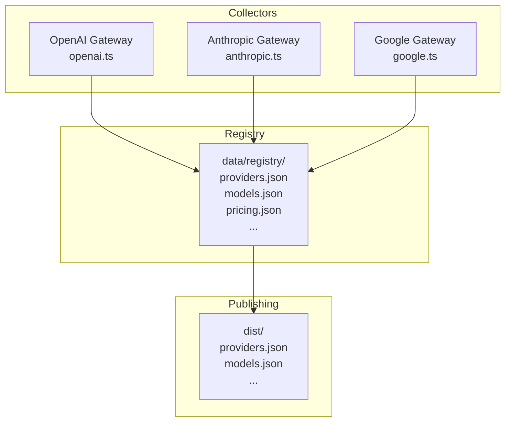
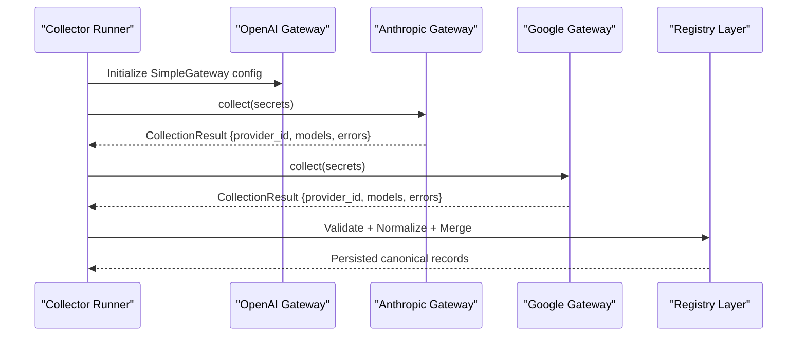
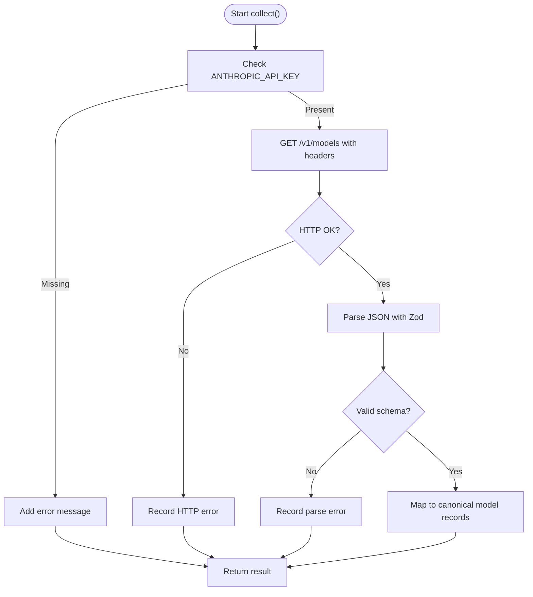
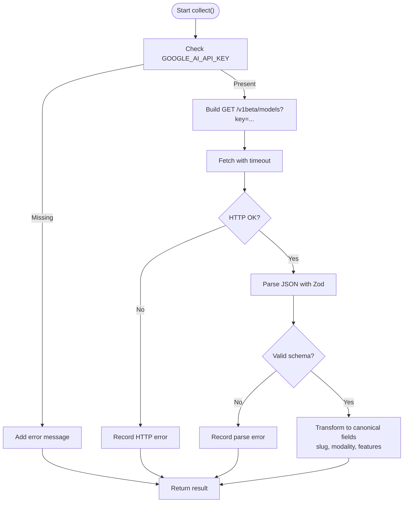
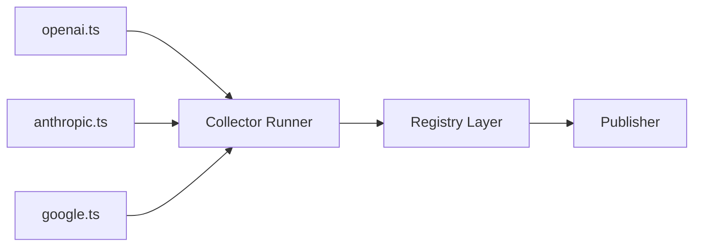

# Provider-Specific Implementations

<cite>
**Referenced Files in This Document**
- [README.md](file://README.md)
- [03_Architecture.md](file://docs/03_Architecture.md)
- [04_Pipeline.md](file://docs/04_Pipeline.md)
- [openai.ts](file://packages/collectors/src/gateways/openai.ts)
- [anthropic.ts](file://packages/collectors/src/gateways/anthropic.ts)
- [google.ts](file://packages/collectors/src/gateways/google.ts)
</cite>

## Table of Contents
1. Introduction
2. Project Structure
3. Core Components
4. Architecture Overview
5. Detailed Component Analysis
6. Dependency Analysis
7. Performance Considerations
8. Troubleshooting Guide
9. Conclusion
10. Appendices

## Introduction
This document explains provider-specific collector implementations for major AI model providers (OpenAI, Anthropic, Google). It covers authentication methods, API endpoints, rate limiting and quota handling, data transformation requirements, configuration, error handling, health checks, and step-by-step instructions for adding new providers. The goal is to help developers understand how collectors discover, normalize, and persist provider model metadata into the BaseModel registry.

BaseModel is a data layer that discovers, validates, normalizes, stores, analyzes, and publishes structured knowledge about AI models. Collectors are part of the Discovery Layer and feed the Registry Layer with canonical records.

**Section sources**
- [README.md:1-61](file://README.md#L1-L61)
- [03_Architecture.md:1-77](file://docs/03_Architecture.md#L1-L77)

## Project Structure
The project organizes functionality by packages: schema, registry, collectors, intelligence, publisher, and cli. Collector implementations live under packages/collectors/src/gateways. Each provider has a dedicated gateway file that defines how to authenticate, fetch, parse, and transform provider model listings into BaseModel’s canonical schema.

**Diagram sources**
- [openai.ts:1-13](file://packages/collectors/src/gateways/openai.ts#L1-L13)
- [anthropic.ts:1-72](file://packages/collectors/src/gateways/anthropic.ts#L1-L72)
- [google.ts:1-100](file://packages/collectors/src/gateways/google.ts#L1-L100)

**Section sources**
- [README.md:11-30](file://README.md#L11-L30)
- [03_Architecture.md:37-44](file://docs/03_Architecture.md#L37-L44)

## Core Components
- SimpleGateway: A declarative configuration for OpenAI-compatible gateways. It specifies type, id, baseUrl, and secret key name. Used by OpenAI.
- CustomGateway: A full implementation for non-OpenAI-compatible providers. It includes a collect method that authenticates, requests, parses, transforms, and returns normalized model records. Used by Anthropic and Google.

Key responsibilities:
- Authentication via secrets (API keys or tokens).
- HTTP request to provider endpoints.
- Response validation using Zod schemas.
- Transformation to canonical BaseModel fields.
- Error collection without failing the entire pipeline.

**Section sources**
- [openai.ts:1-13](file://packages/collectors/src/gateways/openai.ts#L1-L13)
- [anthropic.ts:1-72](file://packages/collectors/src/gateways/anthropic.ts#L1-L72)
- [google.ts:1-100](file://packages/collectors/src/gateways/google.ts#L1-L100)

## Architecture Overview
The collector architecture separates simple OpenAI-compatible configurations from custom implementations. Collectors emit CollectionResult objects containing provider_id, models array, and errors array. These results flow into the registry where they are validated, normalized, merged, and persisted.

**Diagram sources**
- [openai.ts:1-13](file://packages/collectors/src/gateways/openai.ts#L1-L13)
- [anthropic.ts:19-70](file://packages/collectors/src/gateways/anthropic.ts#L19-L70)
- [google.ts:33-98](file://packages/collectors/src/gateways/google.ts#L33-L98)

## Detailed Component Analysis

### OpenAI Gateway
- Type: openai-compatible
- Purpose: Declarative configuration for an OpenAI-compatible endpoint.
- Authentication: Uses OPENAI_API_KEY secret key name.
- Endpoint: Base URL https://api.openai.com/v1.
- Behavior: The runner uses this configuration to call standard OpenAI-compatible /models endpoints and normalize responses according to BaseModel heuristics.

Configuration highlights:
- type: 'openai-compatible'
- id: 'openai'
- baseUrl: 'https://api.openai.com/v1'
- secretKeyName: 'OPENAI_API_KEY'

Data transformation:
- Relies on generic normalization and classification heuristics for capabilities when capability metadata is missing.

Error handling:
- Errors propagate through the runner; individual failures do not abort the entire run.

Health check guidance:
- Verify connectivity to baseUrl and validate response shape from /models.

**Section sources**
- [openai.ts:1-13](file://packages/collectors/src/gateways/openai.ts#L1-L13)
- [04_Pipeline.md:34-46](file://docs/04_Pipeline.md#L34-L46)

### Anthropic Gateway
- Type: custom
- Purpose: Full custom implementation for Anthropic’s model listing.
- Authentication: x-api-key header with ANTHROPIC_API_KEY secret.
- Endpoint: https://api.anthropic.com/v1/models.
- Response parsing: Zod schema expects data array with id, display_name, created_at.
- Data transformation: Maps to canonical fields including model_id prefixed with provider, modality defaults to text-only, and feature flags set conservatively.

Rate limiting and quotas:
- If the provider returns HTTP errors, the collector records them in errors and continues.

Error handling:
- Missing API key produces a clear error message.
- Network or parse errors are captured and returned in errors.

Health check guidance:
- Call /models with minimal payload and verify status 200 and expected schema.

**Diagram sources**
- [anthropic.ts:19-70](file://packages/collectors/src/gateways/anthropic.ts#L19-L70)

**Section sources**
- [anthropic.ts:1-72](file://packages/collectors/src/gateways/anthropic.ts#L1-L72)

### Google Gateway
- Type: custom
- Purpose: Full custom implementation for Google Gemini Developer API model listing.
- Authentication: Query parameter key=GOOGLE_AI_API_KEY.
- Endpoint: https://generativelanguage.googleapis.com/v1beta/models?key=...
- Response parsing: Zod schema expects models array with name, displayName, description, inputTokenLimit, outputTokenLimit, supportedGenerationMethods, version.
- Data transformation: Derives slug from name, infers modality and features based on model name and methods (Gemini vs Imagen vs Embedding), sets context_window from inputTokenLimit, and marks reasoning_support for “thinking” variants.

Rate limiting and quotas:
- Includes an AbortSignal timeout to avoid hanging requests.
- Non-OK responses are recorded as errors.

Error handling:
- Missing API key produces a clear error message.
- Network or parse errors are captured and returned in errors.

Health check guidance:
- Call /v1beta/models with key and verify status 200 and presence of models array.

**Diagram sources**
- [google.ts:33-98](file://packages/collectors/src/gateways/google.ts#L33-L98)

**Section sources**
- [google.ts:1-100](file://packages/collectors/src/gateways/google.ts#L1-L100)

## Dependency Analysis
Collectors depend on:
- Secrets management for API keys.
- Zod for response validation.
- Standard fetch for HTTP requests.
- Canonical schema definitions enforced by the registry.

Provider relationships:
- OpenAI uses a simple configuration consumed by the runner.
- Anthropic and Google implement custom logic due to differing auth patterns and response shapes.

**Diagram sources**
- [openai.ts:1-13](file://packages/collectors/src/gateways/openai.ts#L1-L13)
- [anthropic.ts:1-72](file://packages/collectors/src/gateways/anthropic.ts#L1-L72)
- [google.ts:1-100](file://packages/collectors/src/gateways/google.ts#L1-L100)

**Section sources**
- [03_Architecture.md:37-44](file://docs/03_Architecture.md#L37-L44)

## Performance Considerations
- Use timeouts for external calls to prevent hangs (as implemented in Google).
- Prefer batch endpoints if available to reduce round trips.
- Cache stable provider catalogs locally during development to minimize network calls.
- Avoid heavy transformations in hot paths; keep parsing strict but efficient.
- Log errors per provider to isolate failures and maintain throughput.

[No sources needed since this section provides general guidance]

## Troubleshooting Guide
Common issues and resolutions:
- Missing API key: Ensure the required secret is present (OPENAI_API_KEY, ANTHROPIC_API_KEY, GOOGLE_AI_API_KEY).
- HTTP errors: Check provider status pages and retry with backoff; record errors in the result.
- Schema mismatches: Update Zod schemas to match current provider responses.
- Rate limits: Implement exponential backoff and respect Retry-After headers when provided.
- Health checks: Add lightweight probes to each provider endpoint to detect outages early.

Provider-specific tips:
- OpenAI: Confirm baseUrl and key format; ensure /models endpoint responds with expected structure.
- Anthropic: Verify x-api-key header and anthropic-version header; confirm response contains data array.
- Google: Ensure key query parameter is appended; handle v1beta changes gracefully.

**Section sources**
- [anthropic.ts:21-26](file://packages/collectors/src/gateways/anthropic.ts#L21-L26)
- [google.ts:35-40](file://packages/collectors/src/gateways/google.ts#L35-L40)

## Conclusion
Provider collectors in BaseModel follow a consistent pattern: authenticate, fetch, validate, transform, and persist. OpenAI uses a simple configuration while Anthropic and Google require custom implementations due to differences in authentication and response formats. By adhering to these patterns, you can add new providers reliably and maintain high-quality canonical data in the registry.

[No sources needed since this section summarizes without analyzing specific files]

## Appendices

### Step-by-Step: Adding a New Provider
1. Create a new file under packages/collectors/src/gateways/.
2. Decide between SimpleGateway (if OpenAI-compatible) or CustomGateway (otherwise).
3. Implement authentication using secrets.
4. Define Zod schemas for the provider’s response.
5. Map provider fields to BaseModel canonical fields.
6. Handle errors and return a CollectionResult.
7. Test locally with sample secrets and mock responses.
8. Add CI verification steps to catch regressions.

[No sources needed since this section provides general guidance]

### Configuration Reference
- OpenAI:
  - type: 'openai-compatible'
  - id: 'openai'
  - baseUrl: 'https://api.openai.com/v1'
  - secretKeyName: 'OPENAI_API_KEY'
- Anthropic:
  - type: 'custom'
  - id: 'anthropic'
  - Authentication: x-api-key header with ANTHROPIC_API_KEY
  - Endpoint: /v1/models
- Google:
  - type: 'custom'
  - id: 'google'
  - Authentication: key query parameter with GOOGLE_AI_API_KEY
  - Endpoint: /v1beta/models

**Section sources**
- [openai.ts:7-12](file://packages/collectors/src/gateways/openai.ts#L7-L12)
- [anthropic.ts:29-35](file://packages/collectors/src/gateways/anthropic.ts#L29-L35)
- [google.ts:43-49](file://packages/collectors/src/gateways/google.ts#L43-L49)

### Data Model Mapping Notes
- Canonical identifiers use provider prefixes (e.g., anthropic/, google/).
- Modality and feature flags are inferred from model names and supported methods when not explicitly provided.
- Context windows may be derived from token limits when available.

**Section sources**
- [anthropic.ts:47-64](file://packages/collectors/src/gateways/anthropic.ts#L47-L64)
- [google.ts:59-92](file://packages/collectors/src/gateways/google.ts#L59-L92)