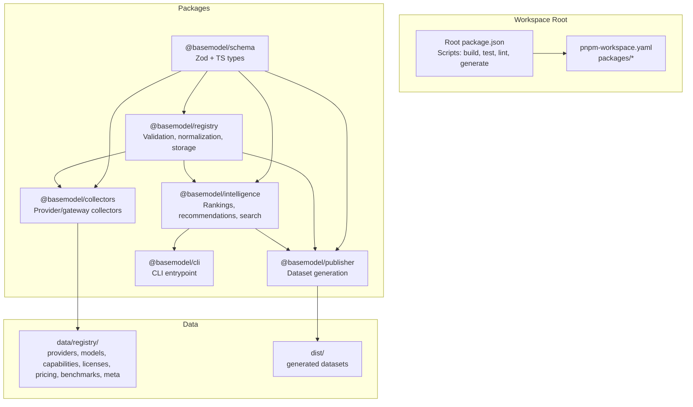
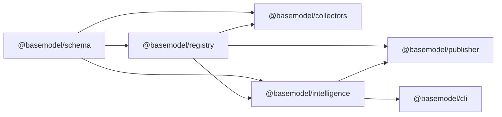
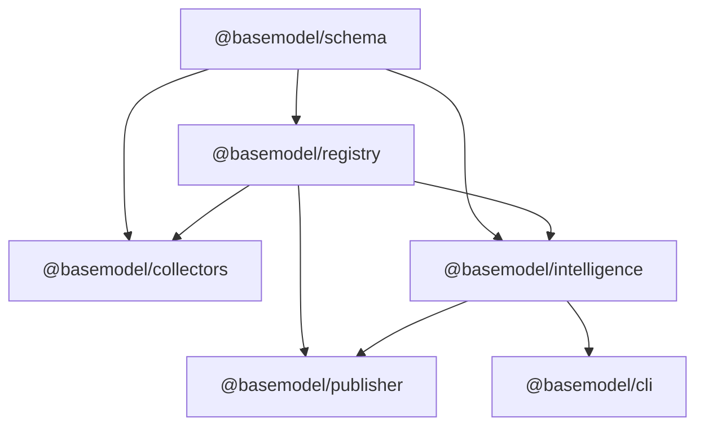

# Core Packages

<cite>
**Referenced Files in This Document**
- [package.json](file://package.json)
- [pnpm-workspace.yaml](file://pnpm-workspace.yaml)
- [README.md](file://README.md)
- [packages/schema/package.json](file://packages/schema/package.json)
- [packages/registry/package.json](file://packages/registry/package.json)
- [packages/collectors/package.json](file://packages/collectors/package.json)
- [packages/intelligence/package.json](file://packages/intelligence/package.json)
- [packages/publisher/package.json](file://packages/publisher/package.json)
- [packages/cli/package.json](file://packages/cli/package.json)
</cite>

## Table of Contents
1. [Introduction](#introduction)
2. [Project Structure](#project-structure)
3. [Core Components](#core-components)
4. [Architecture Overview](#architecture-overview)
5. [Detailed Component Analysis](#detailed-component-analysis)
6. [Dependency Analysis](#dependency-analysis)
7. [Performance Considerations](#performance-considerations)
8. [Troubleshooting Guide](#troubleshooting-guide)
9. [Conclusion](#conclusion)
10. [Appendices](#appendices)

## Introduction
BaseModel is an open-source AI model intelligence platform that discovers, validates, normalizes, stores, analyzes, and publishes structured knowledge about AI models. It is not an inference runtime or end-user application; it is the data layer consumed by other systems. The monorepo organizes functionality into focused packages: schema (canonical types and Zod schemas), registry (storage, validation, normalization), collectors (provider integrations), intelligence (derived insights, rankings, search), publisher (dataset generation), and cli (user interactions).

This document explains how each package contributes to the system, their dependency relationships, APIs and extension points inferred from configuration, and guidance on when to use each package.

**Section sources**
- [README.md:1-61](file://README.md#L1-L61)

## Project Structure
The repository is a pnpm workspace with six packages under packages/. Each package defines its own build, typecheck, test, and clean scripts. The root orchestrates common commands across all packages. Canonical records live under data/registry/, and generated datasets are written to dist/.

**Diagram sources**
- [package.json:17-25](file://package.json#L17-L25)
- [pnpm-workspace.yaml:1-3](file://pnpm-workspace.yaml#L1-L3)
- [README.md:11-30](file://README.md#L11-L30)

**Section sources**
- [package.json:17-25](file://package.json#L17-L25)
- [pnpm-workspace.yaml:1-3](file://pnpm-workspace.yaml#L1-L3)
- [README.md:11-30](file://README.md#L11-L30)

## Core Components
- @basemodel/schema: Canonical TypeScript types and Zod schemas used throughout the codebase for consistent data contracts.
- @basemodel/registry: Registry layer providing validation, normalization, and storage of canonical AI model data.
- @basemodel/collectors: Discovery layer implementing provider-specific data collectors for the AI ecosystem.
- @basemodel/intelligence: Intelligence layer producing derived rankings, search, and recommendations from registry data.
- @basemodel/publisher: Publishing layer generating datasets consumed by consumers and published to dist/.
- @basemodel/cli: Command-line interface enabling users to query intelligence and interact with the platform.

These components form a layered pipeline: schema defines contracts, collectors gather raw data, registry validates and persists normalized records, intelligence computes derived insights, publisher emits datasets, and cli exposes interactive access.

**Section sources**
- [README.md:11-17](file://README.md#L11-L17)

## Architecture Overview
The architecture follows a clear dependency chain:
- schema is foundational and has no internal dependencies.
- registry depends on schema for validation and typing.
- collectors depend on both schema and registry to validate and store collected data.
- intelligence depends on schema and registry to compute derived insights.
- publisher depends on schema, registry, and intelligence to generate final datasets.
- cli depends on intelligence to provide user-facing queries.

**Diagram sources**
- [packages/schema/package.json:22-40](file://packages/schema/package.json#L22-L40)
- [packages/registry/package.json:22-32](file://packages/registry/package.json#L22-L32)
- [packages/collectors/package.json:26-38](file://packages/collectors/package.json#L26-L38)
- [packages/intelligence/package.json:38-47](file://packages/intelligence/package.json#L38-L47)
- [packages/publisher/package.json:23-35](file://packages/publisher/package.json#L23-L35)
- [packages/cli/package.json:33-43](file://packages/cli/package.json#L33-L43)

## Detailed Component Analysis

### @basemodel/schema
Purpose:
- Provides canonical TypeScript types and Zod schemas for all BaseModel entities.
- Ensures consistency across collectors, registry, intelligence, publisher, and cli.

Key characteristics:
- ESM module with explicit exports and types.
- Uses zod as the validation library.
- Build targets ESM output with declaration files.

When to use:
- Any package needing shared data contracts or runtime validation.
- As the single source of truth for model, provider, capability, license, and pricing structures.

Extension points:
- Extend or add new Zod schemas and corresponding TypeScript types to support new entity kinds.

**Section sources**
- [packages/schema/package.json:1-48](file://packages/schema/package.json#L1-L48)

### @basemodel/registry
Purpose:
- Implements validation, normalization, and storage of canonical AI model data.
- Enforces schema contracts and maintains canonical records.

Key characteristics:
- Depends on @basemodel/schema for validation and typing.
- Exposes ESM entry with types.

When to use:
- To persist validated and normalized records.
- For merging and reconciling data from multiple collectors.

Extension points:
- Add new normalization rules or storage backends while preserving schema contracts.

**Section sources**
- [packages/registry/package.json:1-35](file://packages/registry/package.json#L1-L35)

### @basemodel/collectors
Purpose:
- Discovers and ingests provider and gateway data into the registry.
- Supports collection, enrichment, benchmarking, and verification workflows.

Key characteristics:
- Depends on @basemodel/schema and @basemodel/registry.
- Provides scripts for collect, enrich, collect-benchmarks, verify, build, typecheck, test, clean.

When to use:
- To integrate new providers or gateways.
- To run periodic collection and enrichment pipelines.

Extension points:
- Implement new collector modules adhering to schema contracts.
- Add verification routines to ensure data quality.

**Section sources**
- [packages/collectors/package.json:1-41](file://packages/collectors/package.json#L1-L41)

### @basemodel/intelligence
Purpose:
- Computes derived insights such as rankings, recommendations, and search indexes from registry data.

Key characteristics:
- Depends on @basemodel/schema and @basemodel/registry.
- Exposes ESM entry with types.

When to use:
- To query ranked lists, recommendations, or search results based on normalized registry data.

Extension points:
- Introduce new ranking algorithms or recommendation strategies over registry records.

**Section sources**
- [packages/intelligence/package.json:1-50](file://packages/intelligence/package.json#L1-L50)

### @basemodel/publisher
Purpose:
- Generates datasets for distribution, writing outputs to dist/.

Key characteristics:
- Depends on @basemodel/schema, @basemodel/registry, and @basemodel/intelligence.
- Provides a generate script to produce datasets.

When to use:
- To emit final datasets like providers.json, models.json, capabilities.json, licenses.json, apis.json, benchmarks.json, pricing.json, intelligence.json.

Extension points:
- Add new dataset formats or transformation steps using registry and intelligence outputs.

**Section sources**
- [packages/publisher/package.json:1-38](file://packages/publisher/package.json#L1-L38)

### @basemodel/cli
Purpose:
- Provides a command-line interface for querying intelligence.

Key characteristics:
- Depends on @basemodel/intelligence.
- Declares a bin entry for the basemodel command.

When to use:
- For interactive exploration of rankings, recommendations, and search results.

Extension points:
- Add new commands or flags to expose additional intelligence queries.

**Section sources**
- [packages/cli/package.json:1-45](file://packages/cli/package.json#L1-L45)

## Dependency Analysis
The dependency graph reflects a strict layering:
- schema is foundational.
- registry builds on schema.
- collectors and intelligence build on schema and registry.
- publisher builds on schema, registry, and intelligence.
- cli builds on intelligence.

**Diagram sources**
- [packages/schema/package.json:22-40](file://packages/schema/package.json#L22-L40)
- [packages/registry/package.json:22-32](file://packages/registry/package.json#L22-L32)
- [packages/collectors/package.json:26-38](file://packages/collectors/package.json#L26-L38)
- [packages/intelligence/package.json:38-47](file://packages/intelligence/package.json#L38-L47)
- [packages/publisher/package.json:23-35](file://packages/publisher/package.json#L23-L35)
- [packages/cli/package.json:33-43](file://packages/cli/package.json#L33-L43)

**Section sources**
- [packages/schema/package.json:22-40](file://packages/schema/package.json#L22-L40)
- [packages/registry/package.json:22-32](file://packages/registry/package.json#L22-L32)
- [packages/collectors/package.json:26-38](file://packages/collectors/package.json#L26-L38)
- [packages/intelligence/package.json:38-47](file://packages/intelligence/package.json#L38-L47)
- [packages/publisher/package.json:23-35](file://packages/publisher/package.json#L23-L35)
- [packages/cli/package.json:33-43](file://packages/cli/package.json#L33-L43)

## Performance Considerations
- Validation overhead: Zod-based validation ensures correctness but can add runtime cost; batch validations where possible.
- I/O patterns: Collectors and publisher perform significant file reads/writes; consider caching and incremental updates.
- Workspace builds: Use pnpm workspaces to avoid redundant builds; leverage per-package scripts for targeted operations.
- Data size: Large registries may impact intelligence computations; index only necessary fields for search and ranking.

[No sources needed since this section provides general guidance]

## Troubleshooting Guide
Common issues and resolutions:
- Build failures: Ensure Node.js and pnpm versions meet engine requirements defined at the root.
- Type errors: Run per-package typecheck to isolate issues; confirm schema changes propagate correctly.
- Collection errors: Use collectors verify and enrich scripts to validate and repair data before publishing.
- Missing datasets: Re-run publisher generate after ensuring registry and intelligence outputs are up-to-date.

Operational tips:
- Use root-level scripts for consistent workflows across packages.
- Keep data/registry canonical records in sync with schema definitions.
- Validate new collectors against existing schemas before integration.

**Section sources**
- [package.json:12-16](file://package.json#L12-L16)
- [README.md:42-51](file://README.md#L42-L51)

## Conclusion
BaseModel’s core packages form a cohesive, layered system: schema defines contracts, registry enforces them and persists normalized data, collectors ingest provider information, intelligence derives actionable insights, publisher emits consumable datasets, and cli provides user interaction. By following the dependency order and leveraging each package’s scripts and extension points, teams can reliably extend and operate the platform.

[No sources needed since this section summarizes without analyzing specific files]

## Appendices

### Package Usage Guidance
- Use @basemodel/schema whenever you need shared types or validation.
- Use @basemodel/registry to store and normalize validated records.
- Use @basemodel/collectors to integrate new providers or run collection/enrichment jobs.
- Use @basemodel/intelligence to query rankings, recommendations, and search results.
- Use @basemodel/publisher to generate datasets for distribution.
- Use @basemodel/cli to interactively explore intelligence outputs.

**Section sources**
- [README.md:11-17](file://README.md#L11-L17)