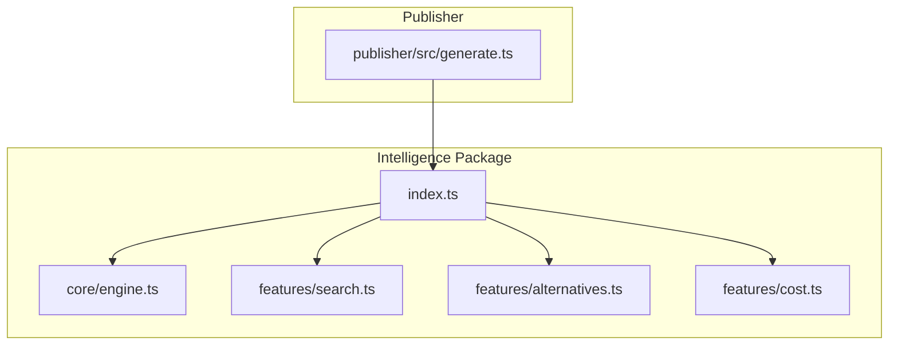
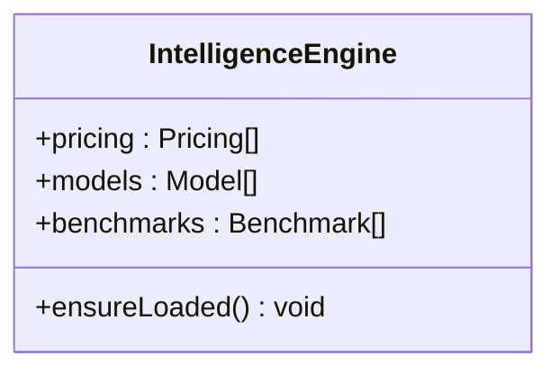
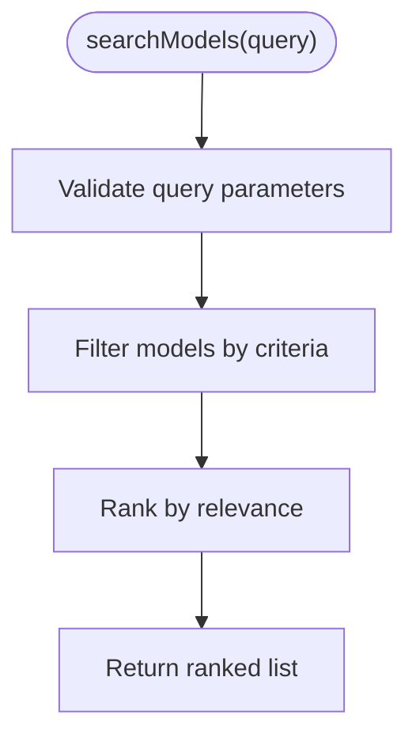
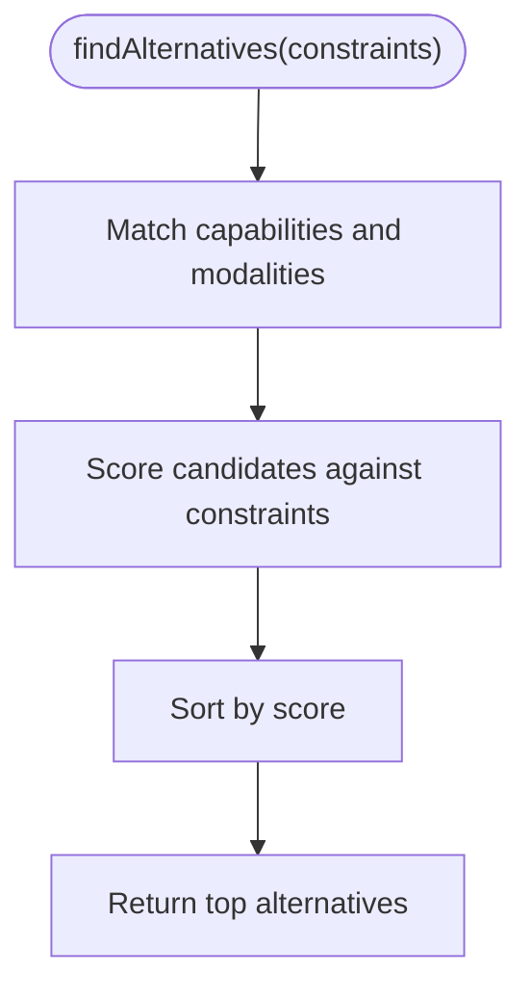
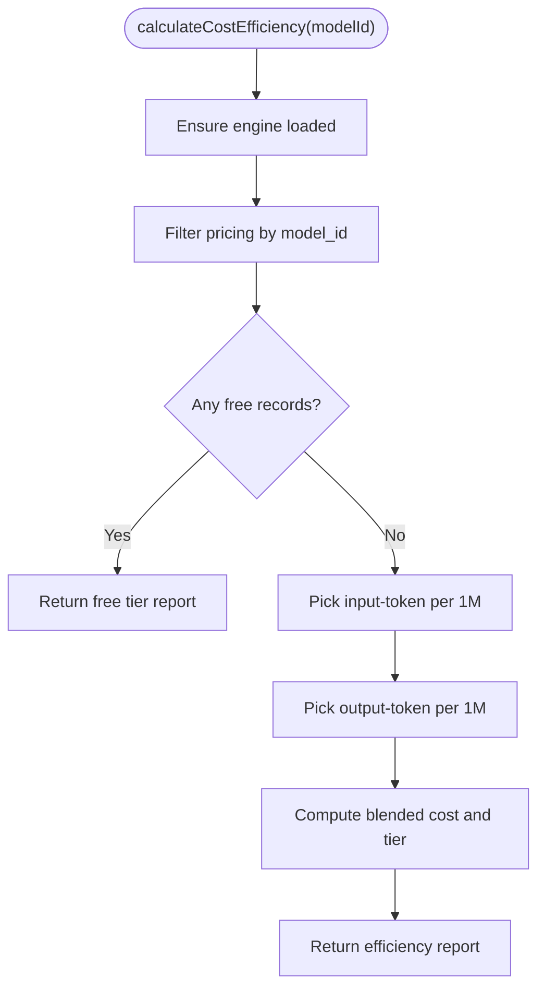
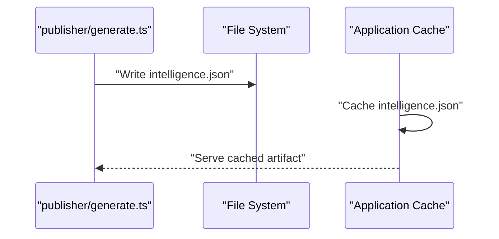
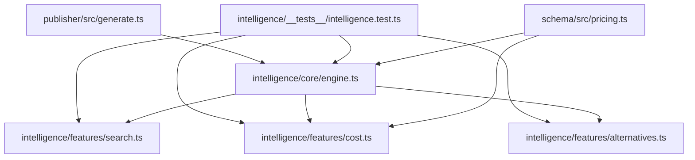

# Intelligence Cache & Performance

<cite>
**Referenced Files in This Document**
- [packages/intelligence/src/index.ts](file://packages/intelligence/src/index.ts)
- [packages/intelligence/src/core/engine.ts](file://packages/intelligence/src/core/engine.ts)
- [packages/intelligence/src/features/search.ts](file://packages/intelligence/src/features/search.ts)
- [packages/intelligence/src/features/alternatives.ts](file://packages/intelligence/src/features/alternatives.ts)
- [packages/intelligence/src/features/cost.ts](file://packages/intelligence/src/features/cost.ts)
- [packages/intelligence/src/__tests__/intelligence.test.ts](file://packages/intelligence/src/__tests__/intelligence.test.ts)
- [packages/publisher/src/generate.ts](file://packages/publisher/src/generate.ts)
- [packages/schema/src/pricing.ts](file://packages/schema/src/pricing.ts)
</cite>

## Table of Contents
1. [Introduction](#introduction)
2. [Project Structure](#project-structure)
3. [Core Components](#core-components)
4. [Architecture Overview](#architecture-overview)
5. [Detailed Component Analysis](#detailed-component-analysis)
6. [Dependency Analysis](#dependency-analysis)
7. [Performance Considerations](#performance-considerations)
8. [Troubleshooting Guide](#troubleshooting-guide)
9. [Conclusion](#conclusion)
10. [Appendices](#appendices)

## Introduction
This document explains the caching system and performance optimizations used throughout the intelligence package. It covers how ranking results, search queries, and recommendation outputs are cached; cache invalidation policies and TTL behavior; memory management strategies; performance monitoring and metrics collection; and configuration options for cache tuning, custom backends, and distributed setups. The goal is to provide both a high-level understanding and actionable guidance for optimizing the intelligence layer’s runtime performance.

## Project Structure
The intelligence package exposes derived intelligence over canonical registry data (models, pricing, benchmarks). Its public API re-exports core engine functionality and feature modules for search, alternatives, and cost calculations. The publisher generates static artifacts including an intelligence.json that can be consumed by clients.



**Diagram sources**
- [packages/intelligence/src/index.ts](file://packages/intelligence/src/index.ts)
- [packages/publisher/src/generate.ts](file://packages/publisher/src/generate.ts)

**Section sources**
- [packages/intelligence/src/index.ts](file://packages/intelligence/src/index.ts)
- [packages/publisher/src/generate.ts](file://packages/publisher/src/generate.ts)

## Core Components
- IntelligenceEngine: Holds validated snapshots of registry data in memory and provides operations for search, alternatives, and cost heuristics. It ensures data is loaded before use and centralizes access to pricing and model metadata.
- Search Feature: Provides query-based filtering and ranking over models using in-memory structures.
- Alternatives Feature: Generates alternative model recommendations based on capabilities and constraints.
- Cost Feature: Computes cost efficiency and pricing tiers using selected token records with source priority logic.

Key behaviors relevant to caching and performance:
- In-memory snapshot: Engine keeps a defensive, validated snapshot of registry data in memory to avoid repeated parsing or I/O during hot paths.
- Lazy loading: Data is ensured to be loaded on first access, reducing startup overhead when not needed.
- Deterministic selection: Cost calculation uses deterministic priority rules to pick the best record per unit, avoiding non-deterministic branching.

**Section sources**
- [packages/intelligence/src/core/engine.ts](file://packages/intelligence/src/core/engine.ts)
- [packages/intelligence/src/features/cost.ts](file://packages/intelligence/src/features/cost.ts)
- [packages/intelligence/src/features/search.ts](file://packages/intelligence/src/features/search.ts)
- [packages/intelligence/src/features/alternatives.ts](file://packages/intelligence/src/features/alternatives.ts)

## Architecture Overview
The intelligence layer reads canonical registry data once into memory and serves derived computations efficiently. The publisher produces static intelligence artifacts that can be cached at the application boundary.

```mermaid
sequenceDiagram
participant Client as "Client"
participant Engine as "IntelligenceEngine"
participant Search as "search.ts"
participant Alt as "alternatives.ts"
participant Cost as "cost.ts"
Client->>Engine : "ensureLoaded()"
Engine-->>Client : "data ready"
Client->>Search : "searchModels(query)"
Search-->>Client : "ranked results"
Client->>Alt : "findAlternatives(constraints)"
Alt-->>Client : "recommendations"
Client->>Cost : "calculateCostEfficiency(modelId)"
Cost-->>Client : "efficiency report"
```

**Diagram sources**
- [packages/intelligence/src/core/engine.ts](file://packages/intelligence/src/core/engine.ts)
- [packages/intelligence/src/features/search.ts](file://packages/intelligence/src/features/search.ts)
- [packages/intelligence/src/features/alternatives.ts](file://packages/intelligence/src/features/alternatives.ts)
- [packages/intelligence/src/features/cost.ts](file://packages/intelligence/src/features/cost.ts)

## Detailed Component Analysis

### IntelligenceEngine
Responsibilities:
- Maintain an in-memory snapshot of registry data (models, pricing, benchmarks).
- Provide ensureLoaded() to lazily initialize data.
- Expose typed accessors for features to operate over consistent datasets.

Caching strategy:
- Single-process in-memory cache keyed by dataset type.
- Defensive validation ensures consistency across reads.
- No explicit TTL or eviction is implemented within the engine; lifecycle is tied to process lifetime unless explicitly refreshed.

Performance considerations:
- Avoids repeated parsing and I/O by holding validated snapshots.
- Minimizes allocations by reusing references to arrays/maps where possible.



**Diagram sources**
- [packages/intelligence/src/core/engine.ts](file://packages/intelligence/src/core/engine.ts)

**Section sources**
- [packages/intelligence/src/core/engine.ts](file://packages/intelligence/src/core/engine.ts)

### Search Feature
Responsibilities:
- Filter and rank models based on query criteria.
- Use in-memory indices or filters to return results quickly.

Caching strategy:
- Results are computed from the in-memory snapshot; no additional result cache is present in this module.
- For repeated identical queries, callers may implement request coalescing or memoization at higher layers.

Performance considerations:
- Filtering is O(n) over models; consider building indexes if queries are frequent and complex.
- Sorting and ranking should be stable and deterministic.



**Diagram sources**
- [packages/intelligence/src/features/search.ts](file://packages/intelligence/src/features/search.ts)

**Section sources**
- [packages/intelligence/src/features/search.ts](file://packages/intelligence/src/features/search.ts)

### Alternatives Feature
Responsibilities:
- Generate alternative model recommendations given constraints (capabilities, modalities, context window, etc.).
- Use capability matching and scoring to propose suitable candidates.

Caching strategy:
- Relies on in-memory engine data; no internal result cache.
- Callers can memoize common constraint sets to avoid recomputation.

Performance considerations:
- Scoring functions should be lightweight and deterministic.
- Prefer early exits for obvious mismatches to reduce computation.



**Diagram sources**
- [packages/intelligence/src/features/alternatives.ts](file://packages/intelligence/src/features/alternatives.ts)

**Section sources**
- [packages/intelligence/src/features/alternatives.ts](file://packages/intelligence/src/features/alternatives.ts)

### Cost Feature
Responsibilities:
- Compute cost efficiency and pricing tier for a model.
- Select the best token record per unit using source priority.

Caching strategy:
- Uses engine.pricing directly; no internal cache beyond the engine’s snapshot.
- Deterministic selection via sourcePriority ensures consistent results.

Performance considerations:
- Filtering pricing records by model_id and pricing_type reduces search space.
- Priority-based selection avoids expensive comparisons.



**Diagram sources**
- [packages/intelligence/src/features/cost.ts](file://packages/intelligence/src/features/cost.ts)
- [packages/schema/src/pricing.ts](file://packages/schema/src/pricing.ts)

**Section sources**
- [packages/intelligence/src/features/cost.ts](file://packages/intelligence/src/features/cost.ts)
- [packages/schema/src/pricing.ts](file://packages/schema/src/pricing.ts)

### Publisher Integration
The publisher writes intelligence.json alongside other catalog artifacts. Consumers can cache this file at the application boundary (e.g., CDN, local disk, or in-memory store) to avoid repeated network calls.



**Diagram sources**
- [packages/publisher/src/generate.ts](file://packages/publisher/src/generate.ts)

**Section sources**
- [packages/publisher/src/generate.ts](file://packages/publisher/src/generate.ts)

## Dependency Analysis
The intelligence package depends on schema definitions for types like Pricing and Model. The publisher consumes intelligence outputs to generate static files. Tests validate behavior and ensure correctness of search, alternatives, and cost features.



**Diagram sources**
- [packages/schema/src/pricing.ts](file://packages/schema/src/pricing.ts)
- [packages/intelligence/src/core/engine.ts](file://packages/intelligence/src/core/engine.ts)
- [packages/intelligence/src/features/search.ts](file://packages/intelligence/src/features/search.ts)
- [packages/intelligence/src/features/alternatives.ts](file://packages/intelligence/src/features/alternatives.ts)
- [packages/intelligence/src/features/cost.ts](file://packages/intelligence/src/features/cost.ts)
- [packages/intelligence/src/__tests__/intelligence.test.ts](file://packages/intelligence/src/__tests__/intelligence.test.ts)
- [packages/publisher/src/generate.ts](file://packages/publisher/src/generate.ts)

**Section sources**
- [packages/intelligence/src/__tests__/intelligence.test.ts](file://packages/intelligence/src/__tests__/intelligence.test.ts)
- [packages/publisher/src/generate.ts](file://packages/publisher/src/generate.ts)

## Performance Considerations
- In-memory snapshot: The engine holds validated data in memory to minimize parsing and I/O overhead during hot paths.
- Lazy initialization: ensureLoaded() defers work until needed, improving startup time.
- Deterministic algorithms: Cost selection and ranking rely on deterministic rules to avoid non-deterministic branches and ensure repeatable performance.
- Static artifacts: Publishing intelligence.json allows consumers to cache responses at their boundaries (CDN, reverse proxy, or application cache).

Recommendations:
- Add request-level memoization for repeated identical queries in client code.
- Introduce structured indexes (e.g., maps by provider_id or modality) if search patterns become skewed toward specific filters.
- Profile hot paths with CPU/memory profilers to identify bottlenecks in filtering and ranking.

[No sources needed since this section provides general guidance]

## Troubleshooting Guide
Common issues and resolutions:
- Stale data: If registry data changes, ensure the engine is reloaded or replaced with a new instance to refresh the in-memory snapshot.
- High memory usage: Monitor heap growth; consider limiting the size of datasets or implementing selective loading if only subsets are needed.
- Slow searches: Verify query complexity; add indexes or precompute common filters if necessary.
- Incorrect cost reports: Confirm source priority logic and pricing record availability; check for missing or malformed records.

Operational checks:
- Validate that ensureLoaded() completes successfully before issuing queries.
- Inspect logs around data loading and feature invocations for errors or timeouts.
- Use tests to assert expected behavior for search, alternatives, and cost calculations.

**Section sources**
- [packages/intelligence/src/core/engine.ts](file://packages/intelligence/src/core/engine.ts)
- [packages/intelligence/src/features/cost.ts](file://packages/intelligence/src/features/cost.ts)
- [packages/intelligence/src/__tests__/intelligence.test.ts](file://packages/intelligence/src/__tests__/intelligence.test.ts)

## Conclusion
The intelligence package leverages an in-memory snapshot of registry data to deliver fast, deterministic search, alternatives, and cost calculations. While there is no built-in TTL or eviction, the design encourages efficient reuse of data within a process and supports external caching via static artifacts. By adding request-level memoization, targeted indexes, and robust profiling, teams can further optimize performance and scale effectively.

[No sources needed since this section summarizes without analyzing specific files]

## Appendices

### Cache Strategies Summary
- Ranking results: Computed from in-memory snapshots; no internal result cache. Caller-side memoization recommended for repeated queries.
- Search queries: Direct filtering over models; consider indexing for complex or frequent queries.
- Recommendation outputs: Deterministic scoring over capabilities; caller-side caching for common constraint sets.

### Cache Invalidation Policies
- Process-scoped: Engine snapshot persists for process lifetime.
- Refresh strategy: Reinitialize engine or reload data when upstream registry updates occur.
- TTL: Not implemented internally; apply TTL at the consumer layer if needed.

### Memory Management
- Snapshot size: Proportional to registry dataset size; monitor memory usage under load.
- Allocation patterns: Minimize temporary allocations in hot paths; reuse objects where feasible.

### Performance Monitoring and Metrics
- Track latency of ensureLoaded(), searchModels(), findAlternatives(), and calculateCostEfficiency().
- Record hit rates for any caller-level caches.
- Monitor memory footprint and GC pressure.

### Configuration Options
- Cache tuning: Configure caller-level cache sizes, TTLs, and eviction policies.
- Custom backends: Implement a backend adapter to supply registry data to the engine if needed.
- Distributed caching: Cache intelligence.json at edge nodes or shared caches; invalidate on updates.

[No sources needed since this section provides general guidance]