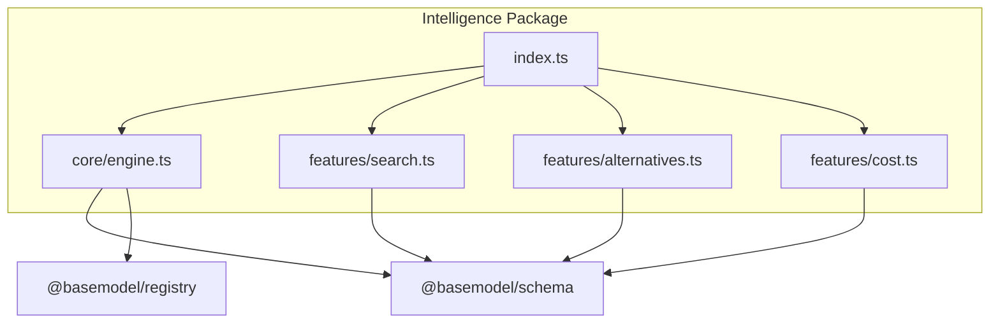
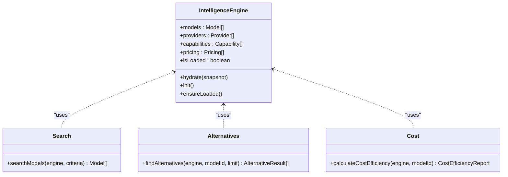
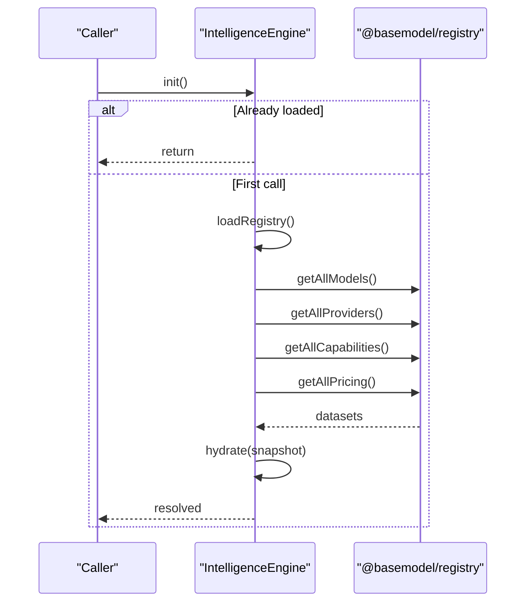
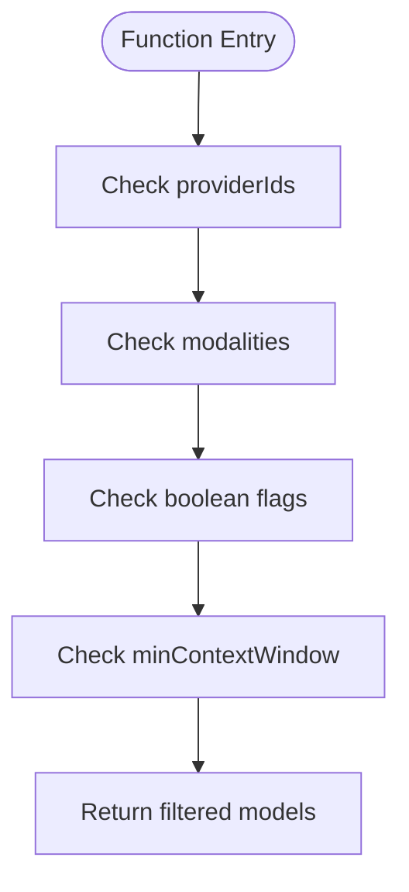
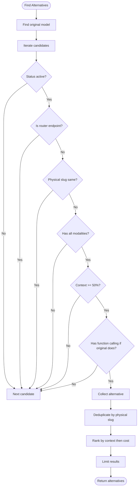
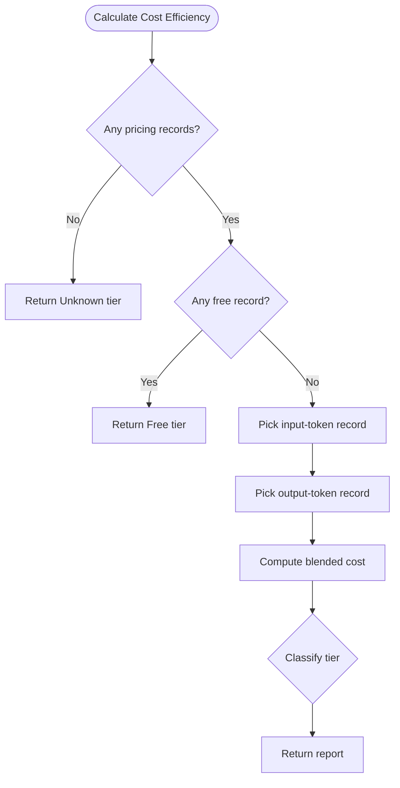
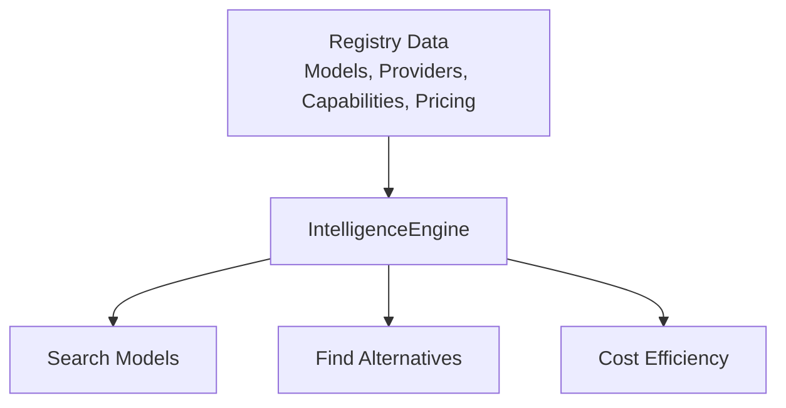
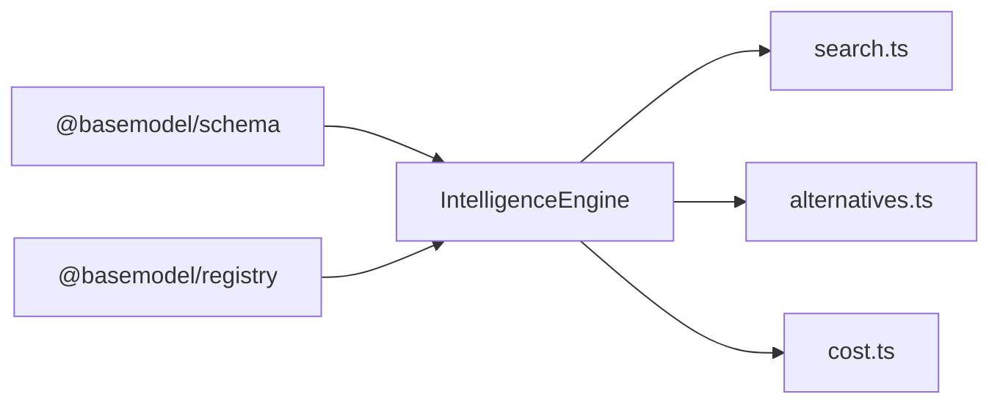

# Intelligence Package

<cite>
**Referenced Files in This Document**
- [README.md](file://README.md)
- [package.json](file://packages/intelligence/package.json)
- [index.ts](file://packages/intelligence/src/index.ts)
- [engine.ts](file://packages/intelligence/src/core/engine.ts)
- [search.ts](file://packages/intelligence/src/features/search.ts)
- [alternatives.ts](file://packages/intelligence/src/features/alternatives.ts)
- [cost.ts](file://packages/intelligence/src/features/cost.ts)
- [intelligence.test.ts](file://packages/intelligence/src/__tests__/intelligence.test.ts)
</cite>

## Table of Contents
1. [Introduction](#introduction)
2. [Project Structure](#project-structure)
3. [Core Components](#core-components)
4. [Architecture Overview](#architecture-overview)
5. [Detailed Component Analysis](#detailed-component-analysis)
6. [Dependency Analysis](#dependency-analysis)
7. [Performance Considerations](#performance-considerations)
8. [Troubleshooting Guide](#troubleshooting-guide)
9. [Conclusion](#conclusion)
10. [Appendices](#appendices)

## Introduction
The Intelligence package provides derived insights over canonical registry data, including search, recommendations (alternatives), and cost heuristics. It is designed to be used by other systems that consume structured knowledge about AI models. The package exposes a core engine that holds validated snapshots of registry data and features for querying and ranking models based on capabilities, attributes, and pricing.

Key responsibilities:
- Maintain an in-memory snapshot of models, providers, capabilities, and pricing with validation.
- Provide search functionality to filter models by provider, modalities, flags, and context window.
- Recommend alternative models based on capability parity, context window thresholds, and cost efficiency.
- Compute cost efficiency and classify models into pricing tiers using deterministic source priority.

**Section sources**
- [README.md:11-17](file://README.md#L11-L17)
- [package.json:1-49](file://packages/intelligence/package.json#L1-L49)

## Project Structure
The Intelligence package is organized around a core engine and feature modules:
- Core engine manages lifecycle, hydration, and validation of registry data.
- Feature modules implement search, alternatives, and cost calculations.
- Public API is exposed via the index file.

**Diagram sources**
- [index.ts:11-14](file://packages/intelligence/src/index.ts#L11-L14)
- [engine.ts:1-92](file://packages/intelligence/src/core/engine.ts#L1-L92)
- [search.ts:1-52](file://packages/intelligence/src/features/search.ts#L1-L52)
- [alternatives.ts:1-138](file://packages/intelligence/src/features/alternatives.ts#L1-L138)
- [cost.ts:1-115](file://packages/intelligence/src/features/cost.ts#L1-L115)

**Section sources**
- [README.md:11-17](file://README.md#L11-L17)
- [package.json:1-49](file://packages/intelligence/package.json#L1-L49)

## Core Components
- IntelligenceEngine: Holds validated snapshots of models, providers, capabilities, and pricing; supports initialization or manual hydration; enforces loaded state before operations.
- Search: Filters models by provider IDs, required modalities, boolean flags, and minimum context window.
- Alternatives: Finds comparable model alternatives with capability parity, context window constraints, router endpoint filtering, deduplication, and cost-aware ranking.
- Cost: Computes per-1M input/output costs, blended cost, and pricing tier classification with deterministic source priority.

**Section sources**
- [engine.ts:1-92](file://packages/intelligence/src/core/engine.ts#L1-L92)
- [search.ts:1-52](file://packages/intelligence/src/features/search.ts#L1-L52)
- [alternatives.ts:1-138](file://packages/intelligence/src/features/alternatives.ts#L1-L138)
- [cost.ts:1-115](file://packages/intelligence/src/features/cost.ts#L1-L115)

## Architecture Overview
The Intelligence Engine acts as the central component, loading or hydrating registry data and exposing features that operate on this validated snapshot. Features are decoupled and rely on schema types from @basemodel/schema and optional registry access during initialization.

**Diagram sources**
- [engine.ts:1-92](file://packages/intelligence/src/core/engine.ts#L1-L92)
- [search.ts:1-52](file://packages/intelligence/src/features/search.ts#L1-L52)
- [alternatives.ts:1-138](file://packages/intelligence/src/features/alternatives.ts#L1-L138)
- [cost.ts:1-115](file://packages/intelligence/src/features/cost.ts#L1-L115)

## Detailed Component Analysis

### IntelligenceEngine
Responsibilities:
- Validate and store snapshots of registry data using Zod schemas.
- Support Node.js initialization via dynamic import of @basemodel/registry or browser-safe manual hydration.
- Ensure operations only proceed after data is loaded.

Initialization flow:
- init() performs one-time loadRegistry(), reusing a shared promise for concurrent callers.
- loadRegistry() throws in browser environments and uses registry methods to fetch models, providers, capabilities, and pricing.
- hydrate() accepts a validated snapshot and sets isLoaded flag.

Error handling:
- parseSnapshot() aggregates validation errors and throws if any schema fails.
- ensureLoaded() prevents operations on uninitialized engines.

**Diagram sources**
- [engine.ts:58-82](file://packages/intelligence/src/core/engine.ts#L58-L82)

**Section sources**
- [engine.ts:1-92](file://packages/intelligence/src/core/engine.ts#L1-L92)

### Search Implementation
SearchCriteria supports:
- providerIds: restrict results to specific providers.
- modalities: require all specified modalities.
- flags: require boolean fields to be true.
- minContextWindow: enforce minimum context window size.

Processing logic:
- Ensures engine is loaded.
- Filters models against each criterion sequentially.
- Returns matching models.

**Diagram sources**
- [search.ts:18-52](file://packages/intelligence/src/features/search.ts#L18-L52)

**Section sources**
- [search.ts:1-52](file://packages/intelligence/src/features/search.ts#L1-L52)

### Recommendation Engine (Alternatives)
Goal: Suggest comparable alternatives for a given model.

Criteria:
- Must support all modalities of the original model.
- Context window must be at least 50% of the original.
- If original has function calling, candidate must also have it.
- Exclude OpenRouter router endpoints.
- Collapse duplicates by physical model slug; prefer first-party providers.

Ranking:
- Primary sort by context window descending.
- Secondary sort by blended cost ascending when available.
- Tertiary tie-breaker by model_id lexicographic order.

**Diagram sources**
- [alternatives.ts:59-137](file://packages/intelligence/src/features/alternatives.ts#L59-L137)

**Section sources**
- [alternatives.ts:1-138](file://packages/intelligence/src/features/alternatives.ts#L1-L138)

### Cost Efficiency Calculation
Purpose: Determine per-1M input/output costs, blended cost, and pricing tier.

Source priority:
- Prefer records from the model’s own provider catalog.
- Then OpenRouter aggregate.
- Then other gateway catalogs.
- Then Hugging Face.
- Records without provenance rank last.

Tier classification:
- Free if explicitly marked free or both input/output priced at zero.
- Budget-Friendly if blended cost < 0.5.
- Balanced if blended cost <= 5.
- Premium otherwise.

**Diagram sources**
- [cost.ts:53-114](file://packages/intelligence/src/features/cost.ts#L53-L114)

**Section sources**
- [cost.ts:1-115](file://packages/intelligence/src/features/cost.ts#L1-L115)

### Conceptual Overview
The Intelligence package transforms raw registry data into actionable insights:
- Search enables precise queries across provider, modality, flags, and context window.
- Alternatives provide economically sensible suggestions grounded in capability parity and cost.
- Cost analysis offers deterministic tiering and blended cost computation.

[No sources needed since this diagram shows conceptual workflow, not actual code structure]

## Dependency Analysis
The Intelligence package depends on:
- @basemodel/schema for type definitions and validation helpers.
- @basemodel/registry for loading canonical datasets during initialization.

**Diagram sources**
- [engine.ts:1-92](file://packages/intelligence/src/core/engine.ts#L1-L92)
- [package.json:38-41](file://packages/intelligence/package.json#L38-L41)

**Section sources**
- [package.json:38-41](file://packages/intelligence/package.json#L38-L41)

## Performance Considerations
- Snapshot caching: IntelligenceEngine stores validated arrays in memory, avoiding repeated parsing and I/O.
- Lazy initialization: init() ensures a single load operation even under concurrent calls.
- Deterministic selection: Source priority in cost calculation avoids nondeterminism from iteration order.
- Filtering complexity: Search filters are linear scans over models; consider pre-indexing for large datasets.
- Ranking stability: Alternatives use stable sorting keys to ensure consistent results.

[No sources needed since this section provides general guidance]

## Troubleshooting Guide
Common issues:
- Uninitialized engine: ensureLoaded() throws if init() or hydrate() was not called.
- Browser environment: init() cannot use Node.js fs; use hydrate() with a dataset snapshot.
- Invalid snapshot: parseSnapshot() aggregates Zod errors and throws if schemas fail.
- Missing pricing records: calculateCostEfficiency returns Unknown tier when no records exist.

Recommendations:
- Always call init() in Node.js or hydrate() in browsers before using features.
- Validate snapshots locally using schema parsers to catch errors early.
- Inspect pricing provenance to understand tier classification behavior.

**Section sources**
- [engine.ts:69-90](file://packages/intelligence/src/core/engine.ts#L69-L90)
- [cost.ts:59-70](file://packages/intelligence/src/features/cost.ts#L59-L70)

## Conclusion
The Intelligence package delivers robust, deterministic insights over registry data through a validated engine and focused feature modules. It supports efficient search, meaningful recommendations, and reliable cost analysis. By adhering to schema validation and source priority rules, it ensures consistency and performance suitable for integration into larger systems.

[No sources needed since this section summarizes without analyzing specific files]

## Appendices

### Usage Examples
- Initialize engine and run search:
  - Create an IntelligenceEngine instance.
  - Call init() in Node.js or hydrate() with a snapshot in browsers.
  - Use searchModels with criteria such as providerIds, modalities, flags, and minContextWindow.
- Find alternatives:
  - Call findAlternatives with a modelId and optional limit.
  - Review reason strings for why each alternative was suggested.
- Compute cost efficiency:
  - Call calculateCostEfficiency with a modelId.
  - Use tier and blendedCost for budgeting decisions.

**Section sources**
- [intelligence.test.ts:1-49](file://packages/intelligence/src/__tests__/intelligence.test.ts#L1-49)