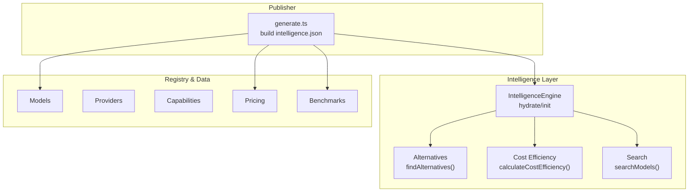
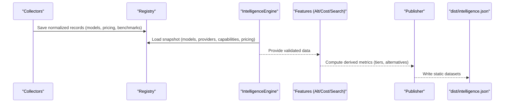
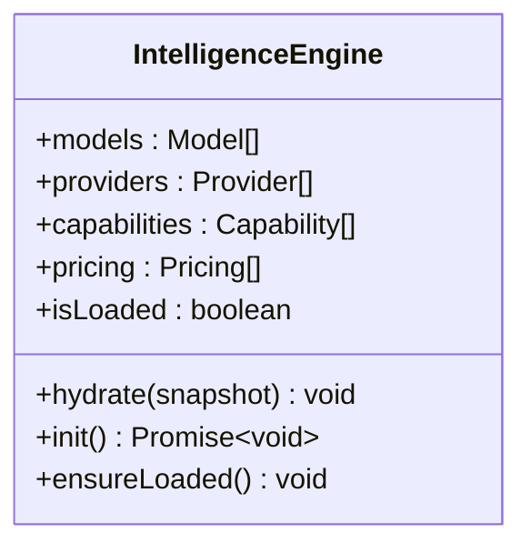
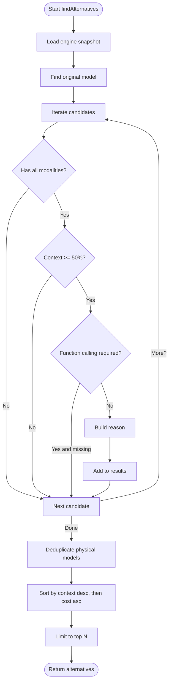
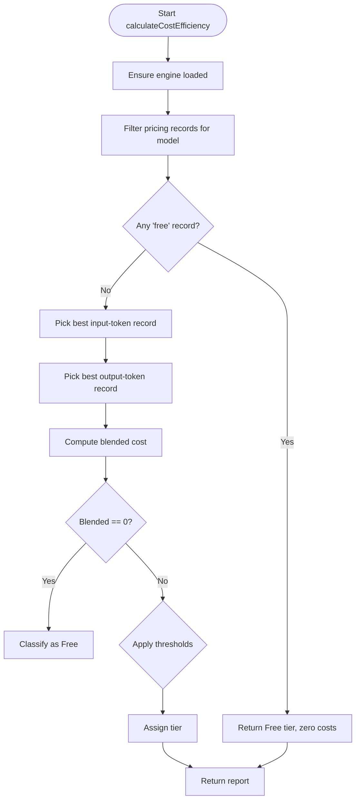
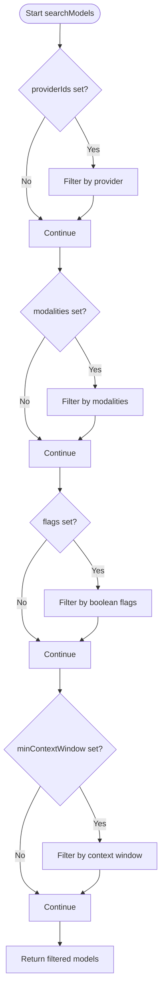
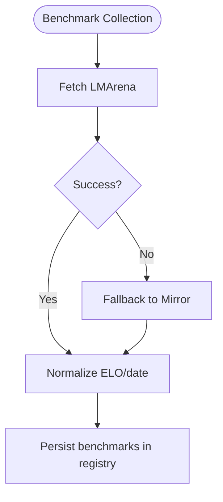
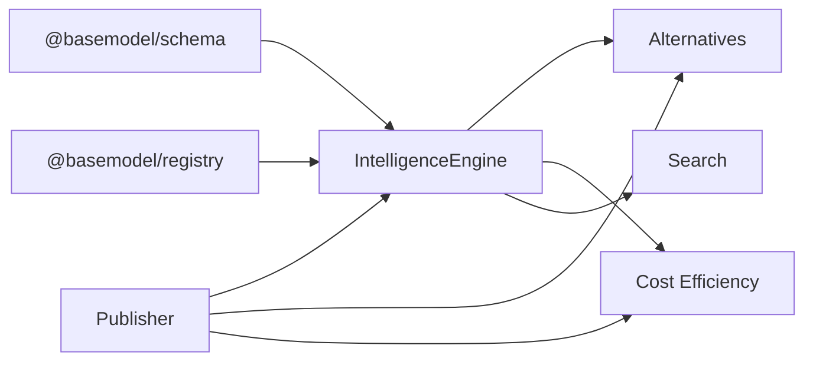

# Ranking Algorithms

<cite>
**Referenced Files in This Document**
- [README.md](file://README.md)
- [01_Vision.md](file://docs/01_Vision.md)
- [02_Philosophy.md](file://docs/02_Philosophy.md)
- [03_Architecture.md](file://docs/03_Architecture.md)
- [04_Pipeline.md](file://docs/04_Pipeline.md)
- [05_Data_Model.md](file://docs/05_Data_Model.md)
- [engine.ts](file://packages/intelligence/src/core/engine.ts)
- [alternatives.ts](file://packages/intelligence/src/features/alternatives.ts)
- [cost.ts](file://packages/intelligence/src/features/cost.ts)
- [search.ts](file://packages/intelligence/src/features/search.ts)
- [generate.ts](file://packages/publisher/src/generate.ts)
- [benchmark-sources.test.ts](file://packages/collectors/src/__tests__/benchmark-sources.test.ts)
</cite>

## Table of Contents
1. [Introduction](#introduction)
2. [Project Structure](#project-structure)
3. [Core Components](#core-components)
4. [Architecture Overview](#architecture-overview)
5. [Detailed Component Analysis](#detailed-component-analysis)
6. [Dependency Analysis](#dependency-analysis)
7. [Performance Considerations](#performance-considerations)
8. [Troubleshooting Guide](#troubleshooting-guide)
9. [Conclusion](#conclusion)
10. [Appendices](#appendices)

## Introduction
This document explains the ranking and scoring system used to evaluate AI models across multiple criteria: capabilities, pricing efficiency, benchmark performance, provider reliability, and community adoption. It covers how weights are assigned, how scores are normalized, and how rankings are updated incrementally through the pipeline. It also documents configuration options for customizing ranking weights, filtering criteria, and thresholds, and provides examples for integrating external evaluation data.

BaseModel’s role is to provide a trusted, normalized intelligence layer over model data without running inference or hosting models. The ranking algorithms derive from canonical registry data and published datasets.

**Section sources**
- [README.md](file://README.md)
- [01_Vision.md](file://docs/01_Vision.md)

## Project Structure
The repository organizes ranking-related logic primarily under the Intelligence Layer and Publisher, with supporting documentation describing the overall architecture and pipeline. Key areas:
- Intelligence Engine: loads and validates registry snapshots (models, providers, capabilities, pricing).
- Features: alternatives recommendation, cost efficiency calculation, and search filtering.
- Publisher: generates public datasets that include derived intelligence fields such as cost tiers and alternative suggestions.
- Pipeline and Data Model: define how benchmark and pricing data flow into the registry and how entities are structured.



**Diagram sources**
- [engine.ts](file://packages/intelligence/src/core/engine.ts)
- [alternatives.ts](file://packages/intelligence/src/features/alternatives.ts)
- [cost.ts](file://packages/intelligence/src/features/cost.ts)
- [search.ts](file://packages/intelligence/src/features/search.ts)
- [generate.ts](file://packages/publisher/src/generate.ts)

**Section sources**
- [03_Architecture.md](file://docs/03_Architecture.md)
- [04_Pipeline.md](file://docs/04_Pipeline.md)

## Core Components
- IntelligenceEngine: Holds a validated snapshot of registry data and ensures it is loaded before any feature runs.
- Alternatives: Recommends comparable models based on modalities, context window, function calling support, and cost.
- Cost Efficiency: Computes blended per-1M token cost and assigns a tier using deterministic provenance rules.
- Search: Filters models by provider, modalities, flags, and minimum context window.
- Publisher: Generates the final intelligence dataset including cost tiers and alternatives for each model.

These components implement the ranking and scoring foundations for capabilities, pricing efficiency, and selection heuristics. Benchmark performance and provider reliability are integrated via the pipeline and registry data.

**Section sources**
- [engine.ts](file://packages/intelligence/src/core/engine.ts)
- [alternatives.ts](file://packages/intelligence/src/features/alternatives.ts)
- [cost.ts](file://packages/intelligence/src/features/cost.ts)
- [search.ts](file://packages/intelligence/src/features/search.ts)
- [generate.ts](file://packages/publisher/src/generate.ts)

## Architecture Overview
Ranking flows from discovery and collection through validation, normalization, and registry storage, then into the Intelligence Layer for derived metrics, and finally into the Publisher for static datasets.



**Diagram sources**
- [04_Pipeline.md](file://docs/04_Pipeline.md)
- [engine.ts](file://packages/intelligence/src/core/engine.ts)
- [generate.ts](file://packages/publisher/src/generate.ts)

**Section sources**
- [04_Pipeline.md](file://docs/04_Pipeline.md)
- [03_Architecture.md](file://docs/03_Architecture.md)

## Detailed Component Analysis

### IntelligenceEngine
- Purpose: Central in-memory store of validated registry data; ensures initialization before use.
- Behavior: Hydrates from a snapshot or initializes by loading registry modules; throws if used uninitialized.



**Diagram sources**
- [engine.ts](file://packages/intelligence/src/core/engine.ts)

**Section sources**
- [engine.ts](file://packages/intelligence/src/core/engine.ts)

### Alternatives Recommendation
- Criteria:
  - Must support all modalities of the original model.
  - Context window must be at least 50% of the original.
  - If the original supports function calling, the candidate must too.
  - Router endpoints are excluded from recommendations.
  - Duplicate physical models are collapsed; first-party providers preferred.
- Ranking:
  - Primary sort by larger context window.
  - Tie-break by lower blended cost when available.
  - Final tie-break by model id lexicographic order.



**Diagram sources**
- [alternatives.ts](file://packages/intelligence/src/features/alternatives.ts)

**Section sources**
- [alternatives.ts](file://packages/intelligence/src/features/alternatives.ts)

### Cost Efficiency and Tiering
- Inputs: Per-model input/output token prices (per 1M tokens), free flag, and source provenance.
- Provenance priority:
  - First, the model’s own provider catalog.
  - Then OpenRouter aggregate.
  - Then other gateway catalogs.
  - Finally Hugging Face.
- Blended cost formula: Weighted blend of input and output costs.
- Tier classification:
  - Free: Both input and output zero or explicitly marked free.
  - Budget-Friendly: Blended < $0.50.
  - Balanced: Blended between $0.50 and $5.00.
  - Premium: Blended > $5.00.
  - Unknown: No pricing data.



**Diagram sources**
- [cost.ts](file://packages/intelligence/src/features/cost.ts)

**Section sources**
- [cost.ts](file://packages/intelligence/src/features/cost.ts)

### Search Filtering
- Filters:
  - Provider IDs (must match one of provided).
  - Modalities (must include all requested).
  - Boolean flags (all must be true).
  - Minimum context window.
- Output: Array of matching models.



**Diagram sources**
- [search.ts](file://packages/intelligence/src/features/search.ts)

**Section sources**
- [search.ts](file://packages/intelligence/src/features/search.ts)

### Publisher Integration
- Builds intelligence records per model:
  - Cost tier and blended cost per 1M tokens.
  - Top alternatives with reasons.
- Filters benchmarks to those relevant to catalog models for lean outputs.

```mermaid
sequenceDiagram
participant Gen as "generate.ts"
participant Engine as "IntelligenceEngine"
participant Cost as "calculateCostEfficiency"
participant Alt as "findAlternatives"
participant Out as "intelligence.json"
Gen->>Engine : hydrate/init
loop For each model
Gen->>Cost : compute cost tier and blended cost
Gen->>Alt : find alternatives (limit=3)
Gen->>Out : write model_id, cost_tier, blended_cost_per_1m, alternatives
end
```

**Diagram sources**
- [generate.ts](file://packages/publisher/src/generate.ts)
- [cost.ts](file://packages/intelligence/src/features/cost.ts)
- [alternatives.ts](file://packages/intelligence/src/features/alternatives.ts)

**Section sources**
- [generate.ts](file://packages/publisher/src/generate.ts)

### Benchmark Sources and Normalization
- Sources:
  - LMArena Elo rankings (text/webdev/vision).
  - Open LLM Leaderboard scores (MMLU-PRO, GPQA, etc.).
  - Mirror daily text/code leaderboard snapshot.
- Fallback behavior:
  - If LMArena is unreachable or rate-limited, Mirror snapshot is used.
- Normalization utilities:
  - ELO normalization to 0–100 scale.
  - Date parsing helpers.



**Diagram sources**
- [04_Pipeline.md](file://docs/04_Pipeline.md)
- [benchmark-sources.test.ts](file://packages/collectors/src/__tests__/benchmark-sources.test.ts)

**Section sources**
- [04_Pipeline.md](file://docs/04_Pipeline.md)
- [benchmark-sources.test.ts](file://packages/collectors/src/__tests__/benchmark-sources.test.ts)

## Dependency Analysis
- IntelligenceEngine depends on schema types and registry module to load data.
- Alternatives and Cost features depend on IntelligenceEngine and schema utilities (e.g., blended cost).
- Publisher depends on IntelligenceEngine and features to generate intelligence.json.
- Pipeline orchestrates collectors, registry, intelligence, and publisher stages.



**Diagram sources**
- [engine.ts](file://packages/intelligence/src/core/engine.ts)
- [alternatives.ts](file://packages/intelligence/src/features/alternatives.ts)
- [cost.ts](file://packages/intelligence/src/features/cost.ts)
- [generate.ts](file://packages/publisher/src/generate.ts)

**Section sources**
- [03_Architecture.md](file://docs/03_Architecture.md)
- [04_Pipeline.md](file://docs/04_Pipeline.md)

## Performance Considerations
- Deterministic provenance selection avoids last-write-winds nondeterminism in pricing.
- Early exits in search and alternatives reduce unnecessary computations.
- Snapshot-based engine prevents repeated I/O during feature calls.
- Benchmark fallback ensures continuous operation under rate limits.

[No sources needed since this section provides general guidance]

## Troubleshooting Guide
- Initialization errors: Ensure IntelligenceEngine is initialized via init() or hydrate() before use.
- Missing pricing data: Results in Unknown tier; verify registry pricing records and provenance priorities.
- Benchmark availability: If LMArena fails, confirm Mirror fallback and optional HF token configuration.
- Invalid snapshots: Engine throws on invalid schema; validate registry data against schemas.

**Section sources**
- [engine.ts](file://packages/intelligence/src/core/engine.ts)
- [cost.ts](file://packages/intelligence/src/features/cost.ts)
- [04_Pipeline.md](file://docs/04_Pipeline.md)

## Conclusion
The ranking and scoring system combines capability alignment, pricing efficiency, benchmark performance, and provider reliability into actionable insights. Deterministic provenance, robust fallbacks, and clear tier definitions ensure transparency and reproducibility. Consumers can rely on the generated intelligence datasets for consistent comparisons and decisions.

[No sources needed since this section summarizes without analyzing specific files]

## Appendices

### Configuration Options for Customizing Ranking Weights and Thresholds
- Cost tier thresholds:
  - Budget-Friendly: Blended < $0.50
  - Balanced: Blended between $0.50 and $5.00
  - Premium: Blended > $5.00
  - Free: Zero blended cost or explicit free flag
- Alternative ranking weights:
  - Context window preference (primary)
  - Blended cost (secondary tie-break)
  - Lexicographic model id (final tie-break)
- Search filters:
  - providerIds, modalities, flags, minContextWindow

**Section sources**
- [cost.ts](file://packages/intelligence/src/features/cost.ts)
- [alternatives.ts](file://packages/intelligence/src/features/alternatives.ts)
- [search.ts](file://packages/intelligence/src/features/search.ts)

### Examples of Custom Ranking Implementations
- To customize alternative ranking:
  - Adjust sorting criteria in alternatives feature to prioritize different factors (e.g., favor lower latency or higher capability coverage).
- To integrate external evaluation data:
  - Extend benchmark normalization utilities to ingest new sources and map them to canonical fields.
  - Update provenance priority to include new sources deterministically.

[No sources needed since this section provides general guidance]

### Data Model Reference
- Entities: Provider, Model, Capability, Benchmark, Pricing, API, License.
- Identifiers: provider_id (kebab-case), model_id ({provider_id}/{model-slug}).
- Dataset metadata includes schema_version, source_revision, count.

**Section sources**
- [05_Data_Model.md](file://docs/05_Data_Model.md)