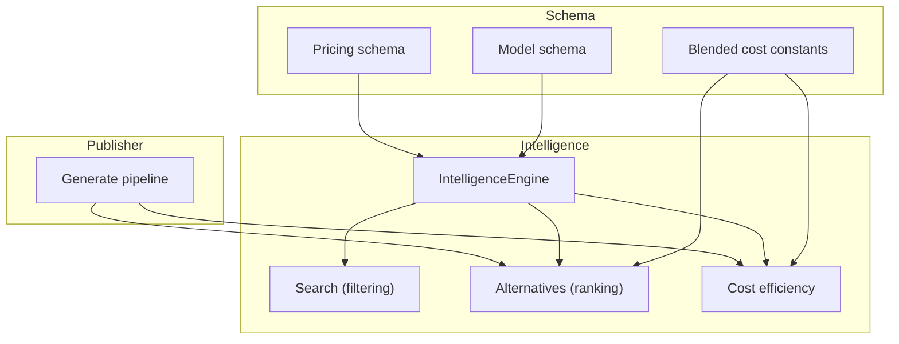
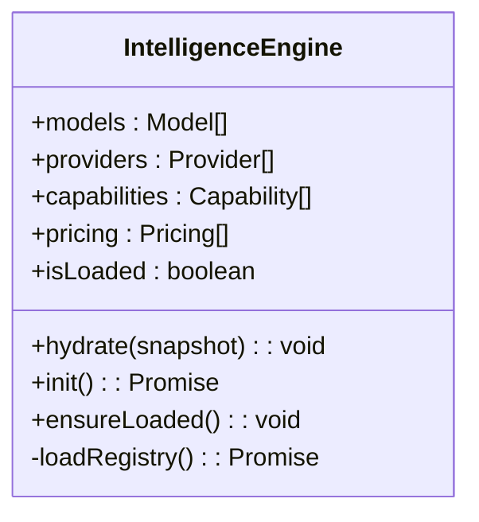
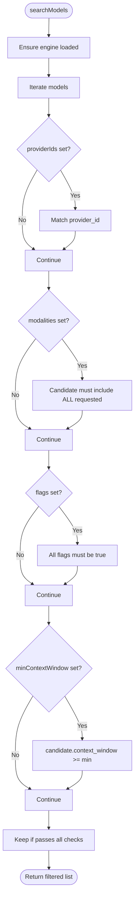
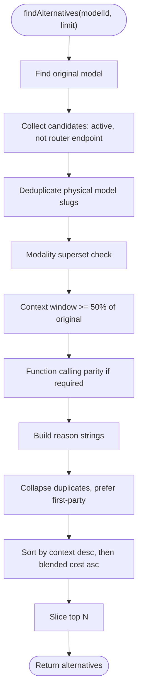
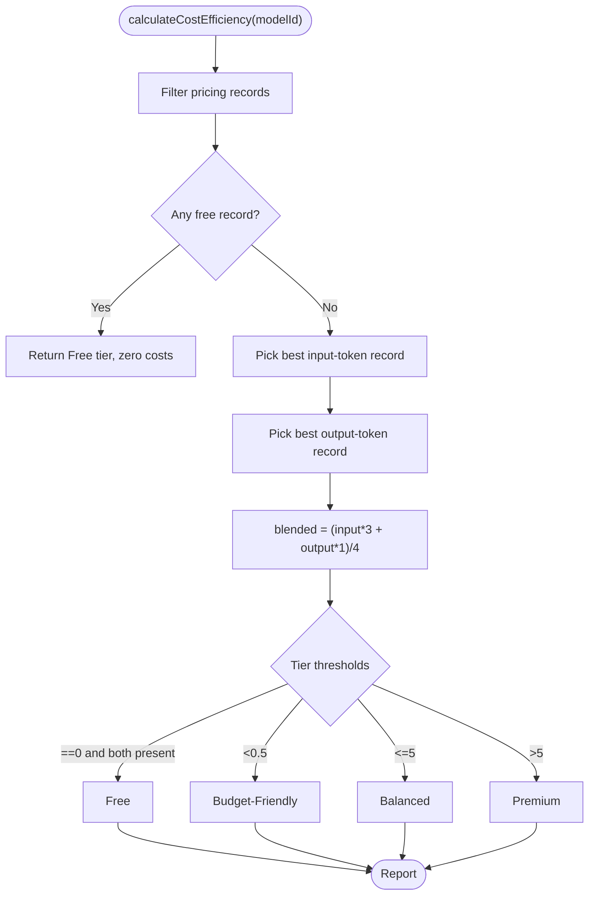
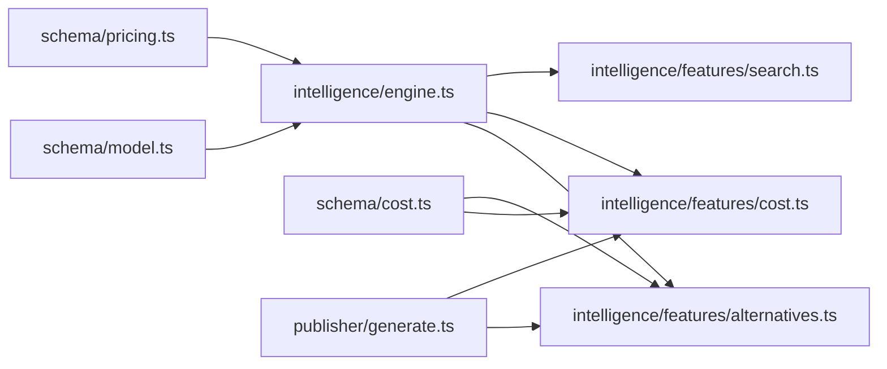

# Recommendation Engine

<cite>
**Referenced Files in This Document**
- [engine.ts](file://packages/intelligence/src/core/engine.ts)
- [alternatives.ts](file://packages/intelligence/src/features/alternatives.ts)
- [cost.ts](file://packages/intelligence/src/features/cost.ts)
- [search.ts](file://packages/intelligence/src/features/search.ts)
- [index.ts](file://packages/intelligence/src/index.ts)
- [model.ts](file://packages/schema/src/model.ts)
- [pricing.ts](file://packages/schema/src/pricing.ts)
- [cost.ts](file://packages/schema/src/cost.ts)
- [generate.ts](file://packages/publisher/src/generate.ts)
- [meta.json](file://data/registry/meta.json)
</cite>

## Table of Contents
1. [Introduction](#introduction)
2. [Project Structure](#project-structure)
3. [Core Components](#core-components)
4. [Architecture Overview](#architecture-overview)
5. [Detailed Component Analysis](#detailed-component-analysis)
6. [Dependency Analysis](#dependency-analysis)
7. [Performance Considerations](#performance-considerations)
8. [Troubleshooting Guide](#troubleshooting-guide)
9. [Conclusion](#conclusion)
10. [Appendices](#appendices)

## Introduction
This document explains the recommendation engine that suggests alternative models based on user requirements and model characteristics. It covers:
- Similarity-based recommendations via capability and modality matching
- Cost-performance trade-offs using blended cost heuristics and tiering
- Capability matching across modalities, function calling, and context window constraints
- How recommendations are generated from registry data, filtered by constraints, and ranked by relevance
- Configuration options for algorithms, weighting factors, and output formatting
- Examples of recommendation queries and guidance for customizing logic

## Project Structure
The recommendation engine is implemented in the intelligence package and consumes canonical schemas and registry data. The publisher uses these features to generate enriched datasets with alternatives and cost tiers.



**Diagram sources**
- [engine.ts:1-92](file://packages/intelligence/src/core/engine.ts#L1-L92)
- [alternatives.ts:1-138](file://packages/intelligence/src/features/alternatives.ts#L1-L138)
- [cost.ts:1-115](file://packages/intelligence/src/features/cost.ts#L1-L115)
- [search.ts:1-52](file://packages/intelligence/src/features/search.ts#L1-L52)
- [model.ts:1-65](file://packages/schema/src/model.ts#L1-L65)
- [pricing.ts:1-35](file://packages/schema/src/pricing.ts#L1-L35)
- [cost.ts:1-12](file://packages/schema/src/cost.ts#L1-L12)
- [generate.ts:147-177](file://packages/publisher/src/generate.ts#L147-L177)

**Section sources**
- [engine.ts:1-92](file://packages/intelligence/src/core/engine.ts#L1-L92)
- [index.ts:1-14](file://packages/intelligence/src/index.ts#L1-L14)

## Core Components
- IntelligenceEngine: Holds a validated snapshot of models, providers, capabilities, and pricing; ensures initialization before use.
- Search: Filters models by provider, modalities, boolean flags, and minimum context window.
- Alternatives: Finds comparable alternatives with similarity rules, deduplication, and ranking by context window and blended cost.
- Cost Efficiency: Computes per-model blended cost and tier classification using deterministic source priority.

Key responsibilities:
- Data validation and safe access to registry data
- Deterministic cost selection and blending
- Stable ranking and deduplication for alternatives
- Simple, composable filtering for search

**Section sources**
- [engine.ts:1-92](file://packages/intelligence/src/core/engine.ts#L1-L92)
- [search.ts:1-52](file://packages/intelligence/src/features/search.ts#L1-L52)
- [alternatives.ts:1-138](file://packages/intelligence/src/features/alternatives.ts#L1-L138)
- [cost.ts:1-115](file://packages/intelligence/src/features/cost.ts#L1-L115)

## Architecture Overview
The engine loads or hydrates registry data, then exposes functions to filter and rank models. The publisher consumes these functions to produce enriched outputs including alternatives and cost tiers.

```mermaid
sequenceDiagram
participant Caller as "Caller"
participant Engine as "IntelligenceEngine"
participant Registry as "Registry Reader"
participant Alt as "findAlternatives"
participant Cost as "calculateCostEfficiency"
Caller->>Engine : init() or hydrate(snapshot)
Engine->>Registry : load models/providers/capabilities/pricing
Registry-->>Engine : validated snapshot
Caller->>Alt : findAlternatives(engine, modelId, limit)
Alt->>Engine : ensureLoaded()
Alt-->>Caller : ranked alternatives
Caller->>Cost : calculateCostEfficiency(engine, modelId)
Cost-->>Caller : cost report and tier
```

**Diagram sources**
- [engine.ts:58-92](file://packages/intelligence/src/core/engine.ts#L58-L92)
- [alternatives.ts:59-137](file://packages/intelligence/src/features/alternatives.ts#L59-L137)
- [cost.ts:53-114](file://packages/intelligence/src/features/cost.ts#L53-L114)

## Detailed Component Analysis

### IntelligenceEngine
- Purpose: Central state holder for models, providers, capabilities, and pricing with safe initialization.
- Key behaviors:
  - Hydrate from a validated snapshot
  - Lazy init with shared promise and retry on failure
  - Ensure loaded before any feature call



**Diagram sources**
- [engine.ts:36-92](file://packages/intelligence/src/core/engine.ts#L36-L92)

**Section sources**
- [engine.ts:1-92](file://packages/intelligence/src/core/engine.ts#L1-L92)

### Search (Filtering)
- Purpose: Filter models by hard constraints such as provider, modalities, flags, and context window.
- Input: SearchCriteria with optional fields
- Output: Array of models satisfying all constraints



**Diagram sources**
- [search.ts:18-52](file://packages/intelligence/src/features/search.ts#L18-L52)

**Section sources**
- [search.ts:1-52](file://packages/intelligence/src/features/search.ts#L1-L52)

### Alternatives (Similarity-Based Recommendations)
- Purpose: Recommend comparable alternatives to a given model based on capability overlap, context window tolerance, and functional parity.
- Rules:
  - Candidate must support all modalities of the original
  - Context window must be at least 50% of the original’s
  - If original supports function calling, candidate must also
  - Exclude router endpoints and collapse duplicates by physical slug
  - Prefer first-party providers over aggregators when deduplicating
- Ranking:
  - Primary: larger context window
  - Secondary: lower blended cost per 1M tokens
  - Tertiary: stable lexicographic tie-breaker



**Diagram sources**
- [alternatives.ts:59-137](file://packages/intelligence/src/features/alternatives.ts#L59-L137)

**Section sources**
- [alternatives.ts:1-138](file://packages/intelligence/src/features/alternatives.ts#L1-L138)

### Cost Efficiency (Cost-Performance Trade-offs)
- Purpose: Compute blended cost per 1M tokens and assign a tier.
- Inputs: Engine pricing records for the model
- Logic:
  - Determine input/output token costs using deterministic source priority
  - Blend using fixed weights and divisor
  - Classify into Free/Budget-Friendly/Balanced/Premium/Unknown
- Source priority:
  - Own provider catalog > OpenRouter > other gateways > Hugging Face > unknown



**Diagram sources**
- [cost.ts:53-114](file://packages/intelligence/src/features/cost.ts#L53-L114)
- [cost.ts:1-12](file://packages/schema/src/cost.ts#L1-L12)

**Section sources**
- [cost.ts:1-115](file://packages/intelligence/src/features/cost.ts#L1-L115)
- [cost.ts:1-12](file://packages/schema/src/cost.ts#L1-L12)

### Publisher Integration (Output Formatting)
- Purpose: Generate enriched datasets including cost tiers and alternatives per model.
- Behavior:
  - For each model, compute cost efficiency and top alternatives
  - Write intelligence.json with model_id, cost_tier, blended_cost_per_1m, and alternatives
  - Include metadata with tier definitions and blend formula

```mermaid
sequenceDiagram
participant Gen as "generate()"
participant Eng as "IntelligenceEngine"
participant Reg as "Registry"
participant Alt as "findAlternatives"
participant Cost as "calculateCostEfficiency"
Gen->>Reg : getAllModels(), getAllPricing()
Gen->>Eng : hydrate(...)
loop per model
Gen->>Cost : calculateCostEfficiency(Eng, model_id)
Gen->>Alt : findAlternatives(Eng, model_id, 3)
Gen->>Gen : build intelligence record
end
Gen->>Gen : write intelligence.json + metadata.json
```

**Diagram sources**
- [generate.ts:147-177](file://packages/publisher/src/generate.ts#L147-L177)
- [generate.ts:235-272](file://packages/publisher/src/generate.ts#L235-L272)

**Section sources**
- [generate.ts:147-177](file://packages/publisher/src/generate.ts#L147-L177)
- [generate.ts:235-272](file://packages/publisher/src/generate.ts#L235-L272)

## Dependency Analysis
- Schema dependencies:
  - Model and Pricing schemas define the data contracts used by the engine and features
  - Blended cost constants are shared between cost calculation and publisher metadata
- Engine dependencies:
  - Loads registry data via dynamic import in Node environments
  - Validates snapshots using Zod schemas
- Feature dependencies:
  - Alternatives depend on schema blendedCost and engine pricing
  - Cost depends on schema blendedCost and deterministic source priority
- Publisher dependencies:
  - Uses IntelligenceEngine and features to enrich outputs



**Diagram sources**
- [model.ts:1-65](file://packages/schema/src/model.ts#L1-L65)
- [pricing.ts:1-35](file://packages/schema/src/pricing.ts#L1-L35)
- [cost.ts:1-12](file://packages/schema/src/cost.ts#L1-L12)
- [engine.ts:1-92](file://packages/intelligence/src/core/engine.ts#L1-L92)
- [alternatives.ts:1-138](file://packages/intelligence/src/features/alternatives.ts#L1-L138)
- [cost.ts:1-115](file://packages/intelligence/src/features/cost.ts#L1-L115)
- [search.ts:1-52](file://packages/intelligence/src/features/search.ts#L1-L52)
- [generate.ts:147-177](file://packages/publisher/src/generate.ts#L147-L177)

**Section sources**
- [model.ts:1-65](file://packages/schema/src/model.ts#L1-L65)
- [pricing.ts:1-35](file://packages/schema/src/pricing.ts#L1-L35)
- [cost.ts:1-12](file://packages/schema/src/cost.ts#L1-L12)
- [engine.ts:1-92](file://packages/intelligence/src/core/engine.ts#L1-L92)
- [alternatives.ts:1-138](file://packages/intelligence/src/features/alternatives.ts#L1-L138)
- [cost.ts:1-115](file://packages/intelligence/src/features/cost.ts#L1-L115)
- [search.ts:1-52](file://packages/intelligence/src/features/search.ts#L1-L52)
- [generate.ts:147-177](file://packages/publisher/src/generate.ts#L147-L177)

## Performance Considerations
- Filtering complexity: O(N) per search where N is number of models; simple checks keep it fast.
- Alternatives ranking: O(N log N) due to sorting after linear scan and deduplication.
- Cost computation: O(P) per model where P is number of pricing records; deterministic selection avoids repeated scans.
- Memory: Engine holds validated arrays; avoid frequent re-hydration by reusing the same instance.
- Deduplication: Physical slug normalization reduces redundant comparisons and improves ranking stability.

[No sources needed since this section provides general guidance]

## Troubleshooting Guide
Common issues and resolutions:
- Engine not initialized:
  - Symptom: Error indicating engine is not initialized
  - Resolution: Call await init() in Node or hydrate(snapshot) before using features
- Model not found:
  - Symptom: Error thrown when modelId does not exist
  - Resolution: Verify model_id exists in registry and engine snapshot
- No alternatives returned:
  - Causes: Too strict constraints, router-only matches, insufficient candidates meeting modality/context/function_calling rules
  - Resolution: Relax constraints or broaden provider scope
- Unexpected cost tier:
  - Cause: Missing or conflicting pricing records, non-standard units
  - Resolution: Ensure unit includes “1M” and correct pricing_type; verify source priority expectations

**Section sources**
- [engine.ts:84-92](file://packages/intelligence/src/core/engine.ts#L84-L92)
- [alternatives.ts:66-69](file://packages/intelligence/src/features/alternatives.ts#L66-L69)
- [cost.ts:59-70](file://packages/intelligence/src/features/cost.ts#L59-L70)

## Conclusion
The recommendation engine provides robust, deterministic model suggestions grounded in registry data. It combines capability-based similarity, pragmatic constraints, and economic considerations to deliver relevant alternatives. The publisher integrates these features to produce enriched datasets suitable for UIs and analytics.

[No sources needed since this section summarizes without analyzing specific files]

## Appendices

### Configuration Options and Weights
- Blended cost formula:
  - INPUT_WEIGHT = 3
  - OUTPUT_WEIGHT = 1
  - BLENDED_DIVISOR = 4
  - blended = (input * 3 + output * 1) / 4 per 1M tokens
- Tier thresholds:
  - Free: Both input and output cost $0 per 1M tokens
  - Budget-Friendly: Blended cost < $0.50 per 1M tokens
  - Balanced: Blended cost >= $0.50 and <= $5 per 1M tokens
  - Premium: Blended cost > $5 per 1M tokens
- Metadata includes tier definitions and blend parameters for transparency

**Section sources**
- [cost.ts:1-12](file://packages/schema/src/cost.ts#L1-L12)
- [generate.ts:257-272](file://packages/publisher/src/generate.ts#L257-L272)

### Example Queries and Customization Guidance
- Search examples:
  - Find models supporting text and image modalities from specific providers with open-weight flag and minimum context window
  - Use SearchCriteria fields: providerIds, modalities, flags, minContextWindow
- Alternatives example:
  - Request top 3 alternatives for a given model_id; results include model details and reason strings
- Custom logic:
  - Extend search criteria by adding new filters in the search module
  - Adjust alternative ranking by modifying sort keys or adding additional scoring dimensions
  - Customize cost blending by updating weights/divisor in schema cost utilities

**Section sources**
- [search.ts:4-52](file://packages/intelligence/src/features/search.ts#L4-L52)
- [alternatives.ts:59-137](file://packages/intelligence/src/features/alternatives.ts#L59-L137)
- [cost.ts:1-12](file://packages/schema/src/cost.ts#L1-L12)

### Data Models Reference
- Model entity fields include identifiers, core attributes, technical characteristics, capability flags, economics, relationships, status, and freshness timestamp
- Pricing entity fields include pricing type, currency, unit, value, notes, provenance source, and freshness timestamp

**Section sources**
- [model.ts:11-65](file://packages/schema/src/model.ts#L11-L65)
- [pricing.ts:10-35](file://packages/schema/src/pricing.ts#L10-L35)

### Registry Metadata Snapshot
- Coverage and generation metadata provide insight into dataset scale and known errors during collection

**Section sources**
- [meta.json:1-18](file://data/registry/meta.json#L1-L18)