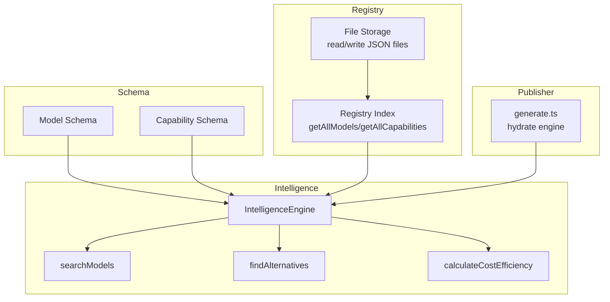
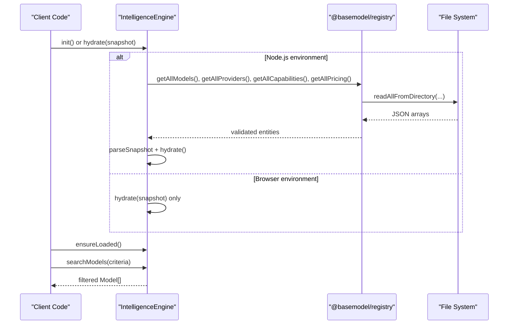
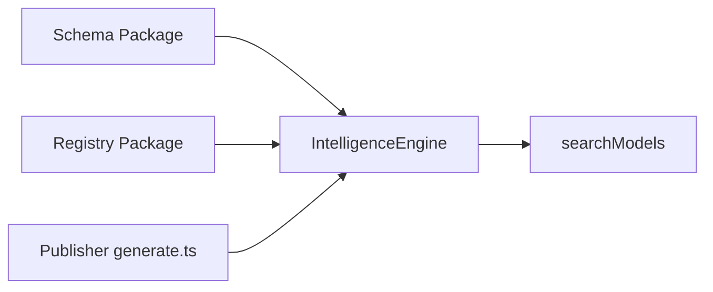

# Search Engine

<cite>
**Referenced Files in This Document**
- [packages/intelligence/src/features/search.ts](file://packages/intelligence/src/features/search.ts)
- [packages/intelligence/src/core/engine.ts](file://packages/intelligence/src/core/engine.ts)
- [packages/intelligence/src/index.ts](file://packages/intelligence/src/index.ts)
- [packages/schema/src/model.ts](file://packages/schema/src/model.ts)
- [packages/schema/src/capability.ts](file://packages/schema/src/capability.ts)
- [packages/registry/src/index.ts](file://packages/registry/src/index.ts)
- [packages/registry/src/storage.ts](file://packages/registry/src/storage.ts)
- [packages/publisher/src/generate.ts](file://packages/publisher/src/generate.ts)
- [packages/intelligence/src/__tests__/intelligence.test.ts](file://packages/intelligence/src/__tests__/intelligence.test.ts)
- [docs/05_Data_Model.md](file://docs/05_Data_Model.md)
</cite>

## Table of Contents
1. Introduction
2. Project Structure
3. Core Components
4. Architecture Overview
5. Detailed Component Analysis
6. Dependency Analysis
7. Performance Considerations
8. Troubleshooting Guide
9. Conclusion

## Introduction
This document explains the search engine that enables querying models by capabilities, attributes, and metadata. It covers supported search operators, filter combinations, query syntax, indexing strategies, performance optimization, caching mechanisms, and advanced features such as fuzzy matching, capability-based filtering, and multi-criteria queries. It also provides examples of common search patterns, custom filters, and integration points with external search interfaces.

## Project Structure
The search engine is implemented within the intelligence package and consumes canonical data from the schema and registry packages. The publisher orchestrates dataset generation and hydrates the intelligence engine with validated snapshots.

**Diagram sources**
- [packages/intelligence/src/core/engine.ts:1-92](file://packages/intelligence/src/core/engine.ts#L1-L92)
- [packages/intelligence/src/features/search.ts:1-52](file://packages/intelligence/src/features/search.ts#L1-L52)
- [packages/registry/src/index.ts:1-124](file://packages/registry/src/index.ts#L1-L124)
- [packages/registry/src/storage.ts:1-164](file://packages/registry/src/storage.ts#L1-L164)
- [packages/publisher/src/generate.ts:112-145](file://packages/publisher/src/generate.ts#L112-L145)
- [packages/schema/src/model.ts:1-65](file://packages/schema/src/model.ts#L1-L65)
- [packages/schema/src/capability.ts:1-19](file://packages/schema/src/capability.ts#L1-L19)

**Section sources**
- [packages/intelligence/src/index.ts:1-14](file://packages/intelligence/src/index.ts#L1-L14)
- [packages/intelligence/src/core/engine.ts:1-92](file://packages/intelligence/src/core/engine.ts#L1-L92)
- [packages/registry/src/index.ts:1-124](file://packages/registry/src/index.ts#L1-L124)
- [packages/registry/src/storage.ts:1-164](file://packages/registry/src/storage.ts#L1-L164)
- [packages/publisher/src/generate.ts:112-145](file://packages/publisher/src/generate.ts#L112-L145)

## Core Components
- IntelligenceEngine: Holds a validated snapshot of models, providers, capabilities, and pricing in memory. Provides initialization and hydration APIs.
- searchModels: Filters models based on provider IDs, modalities, boolean flags, and minimum context window.
- Data schemas: Model and Capability schemas define the canonical fields used for filtering and validation.
- Registry: Reads and writes canonical JSON datasets; used to populate the engine.

Key responsibilities:
- Validation and normalization of incoming data via Zod schemas.
- In-memory snapshot storage for fast filtering.
- Deterministic initialization and safe concurrent loading.

**Section sources**
- [packages/intelligence/src/core/engine.ts:1-92](file://packages/intelligence/src/core/engine.ts#L1-L92)
- [packages/intelligence/src/features/search.ts:1-52](file://packages/intelligence/src/features/search.ts#L1-L52)
- [packages/schema/src/model.ts:1-65](file://packages/schema/src/model.ts#L1-L65)
- [packages/schema/src/capability.ts:1-19](file://packages/schema/src/capability.ts#L1-L19)
- [packages/registry/src/index.ts:1-124](file://packages/registry/src/index.ts#L1-L124)

## Architecture Overview
The search engine operates over an in-memory snapshot of registry data. Consumers call searchModels with structured criteria. The engine ensures it is initialized before filtering.

**Diagram sources**
- [packages/intelligence/src/core/engine.ts:58-92](file://packages/intelligence/src/core/engine.ts#L58-L92)
- [packages/registry/src/index.ts:45-124](file://packages/registry/src/index.ts#L45-L124)
- [packages/registry/src/storage.ts:93-111](file://packages/registry/src/storage.ts#L93-L111)

## Detailed Component Analysis

### Search API and Query Syntax
- Input: SearchCriteria object with optional fields:
  - providerIds: array of provider identifiers (OR semantics across the array).
  - modalities: array of modality strings; must match ALL requested modalities (AND semantics).
  - flags: array of boolean field names on Model; all must be true (AND semantics).
  - minContextWindow: numeric threshold; model.context_window must be present and greater than or equal to this value.
- Output: Array of Model objects satisfying all provided constraints.

Supported operators and semantics:
- Equality and inclusion: providerIds uses set membership.
- Set containment: modalities requires every requested modality to be present in model.modality.
- Boolean presence: flags require each specified boolean field to be true.
- Numeric comparison: minContextWindow enforces a lower bound.

Example usage patterns:
- Filter by provider and open-weight:
  - { providerIds: ["meta"], flags: ["open_weight"] }
- Filter by multimodal support and large context:
  - { modalities: ["text", "image"], minContextWindow: 150000 }
- Combine multiple flags:
  - { flags: ["function_calling", "structured_output"] }

Notes:
- No text search or fuzzy matching is implemented in searchModels.
- Capability-based filtering can be achieved by combining flags and/or extending criteria to include capability_ids if needed.

**Section sources**
- [packages/intelligence/src/features/search.ts:1-52](file://packages/intelligence/src/features/search.ts#L1-L52)
- [packages/schema/src/model.ts:31-56](file://packages/schema/src/model.ts#L31-L56)

### IntelligenceEngine Lifecycle and Caching
- Hydration: Accepts a validated snapshot and stores copies of arrays in memory.
- Initialization: In Node.js, lazily loads registry data once; concurrent calls share the same load promise.
- Safety: Throws if operations are attempted without initialization.
- Caching: The engine caches the entire snapshot in memory after hydration, enabling O(n) filtering per query.

Performance characteristics:
- Single-pass filtering over engine.models.
- No secondary indexes; complexity proportional to number of models.

**Section sources**
- [packages/intelligence/src/core/engine.ts:11-52](file://packages/intelligence/src/core/engine.ts#L11-L52)
- [packages/intelligence/src/core/engine.ts:58-92](file://packages/intelligence/src/core/engine.ts#L58-L92)

### Data Model and Filtering Fields
- Model entity includes:
  - Identifiers: model_id, provider_id
  - Technical characteristics: modality, context_window
  - Capability flags: open_weight, reasoning_support, function_calling, structured_output, vision_support, audio_support, image_generation, embedding_support
  - Relationships: capability_ids
  - Status and timestamps: status, updated_at

These fields enable precise filtering and are enforced by Zod schemas during hydration.

**Section sources**
- [packages/schema/src/model.ts:11-62](file://packages/schema/src/model.ts#L11-L62)
- [docs/05_Data_Model.md:41-69](file://docs/05_Data_Model.md#L41-L69)

### Capability-Based Filtering
- Capability definitions exist as separate entities with capability_id, name, description.
- Models reference capabilities via capability_ids.
- Current search implementation does not directly filter by capability_ids; however, consumers can:
  - Use flags for built-in boolean capabilities.
  - Extend SearchCriteria to include capabilityIds and implement intersection logic against model.capability_ids.

**Section sources**
- [packages/schema/src/capability.ts:10-16](file://packages/schema/src/capability.ts#L10-L16)
- [packages/schema/src/model.ts:51-53](file://packages/schema/src/model.ts#L51-L53)

### Advanced Features: Fuzzy Matching and Multi-Criteria Queries
- Fuzzy matching: Not implemented in searchModels. To add:
  - Normalize tokens (lowercase, strip punctuation).
  - Implement edit distance or token overlap scoring.
  - Apply thresholds and rank results by similarity score.
- Multi-criteria queries: Already supported via AND composition of modalities, flags, and numeric comparisons, combined with OR across providerIds.

Recommendation:
- Keep exact-match semantics for correctness and performance.
- Add a separate fuzzy search path when needed, returning ranked results rather than strict filters.

[No sources needed since this section proposes extensions beyond current code]

### Integration with External Search Interfaces
- Expose searchModels through a thin adapter layer:
  - REST endpoint accepting JSON query parameters mapped to SearchCriteria.
  - GraphQL resolver mapping query variables to SearchCriteria.
- For high-throughput scenarios:
  - Precompute inverted indexes (provider -> models, modality -> models, flag -> models).
  - Cache frequent queries keyed by normalized criteria.
  - Serve results from cache when available.

[No sources needed since this section describes integration patterns]

## Dependency Analysis
The search feature depends on:
- Schema types and validators for data integrity.
- Registry readers for populating the engine.
- Publisher pipeline to hydrate the engine with validated datasets.

**Diagram sources**
- [packages/intelligence/src/core/engine.ts:1-92](file://packages/intelligence/src/core/engine.ts#L1-L92)
- [packages/registry/src/index.ts:1-124](file://packages/registry/src/index.ts#L1-L124)
- [packages/publisher/src/generate.ts:112-145](file://packages/publisher/src/generate.ts#L112-L145)

**Section sources**
- [packages/intelligence/src/index.ts:1-14](file://packages/intelligence/src/index.ts#L1-L14)
- [packages/intelligence/src/core/engine.ts:1-92](file://packages/intelligence/src/core/engine.ts#L1-L92)
- [packages/registry/src/index.ts:1-124](file://packages/registry/src/index.ts#L1-L124)
- [packages/publisher/src/generate.ts:112-145](file://packages/publisher/src/generate.ts#L112-L145)

## Performance Considerations
- Current approach: O(n) linear scan over engine.models per query.
- Bottlenecks:
  - Large model catalogs increase filter time.
  - Repeated queries with identical criteria benefit from caching.
- Optimizations:
  - Build inverted indexes at hydration time:
    - providerId -> Set<model_id>
    - modality -> Set<model_id>
    - boolean flag -> Set<model_id>
    - context_window buckets for range queries
  - Cache query results keyed by serialized criteria.
  - Lazy evaluation: short-circuit filters early where possible.
  - Batched reads and validations during hydration to reduce overhead.

[No sources needed since this section provides general guidance]

## Troubleshooting Guide
Common issues and resolutions:
- Engine not initialized:
  - Ensure init() is awaited in Node.js or hydrate() is called with a valid snapshot.
  - Check for errors thrown during snapshot parsing.
- Unexpected empty results:
  - Verify providerIds match actual provider_id values.
  - Confirm modalities are present in model.modality arrays.
  - Validate boolean flags are true on target models.
  - Ensure minContextWindow is less than or equal to model.context_window.
- Stale data:
  - Re-run the publisher pipeline to refresh datasets.
  - Compare updated_at timestamps to detect stale entries.

**Section sources**
- [packages/intelligence/src/core/engine.ts:84-92](file://packages/intelligence/src/core/engine.ts#L84-L92)
- [packages/intelligence/src/__tests__/intelligence.test.ts:94-114](file://packages/intelligence/src/__tests__/intelligence.test.ts#L94-L114)

## Conclusion
The search engine provides a robust, schema-driven filtering mechanism over a validated in-memory snapshot of model data. It supports multi-criteria queries with clear semantics for provider inclusion, modality containment, boolean flags, and numeric thresholds. While fuzzy matching is not currently implemented, the architecture allows straightforward extension. Performance can be improved with inverted indexes and caching, especially for high-frequency queries. Integration with external interfaces should map user queries to SearchCriteria and leverage the engine’s deterministic behavior.