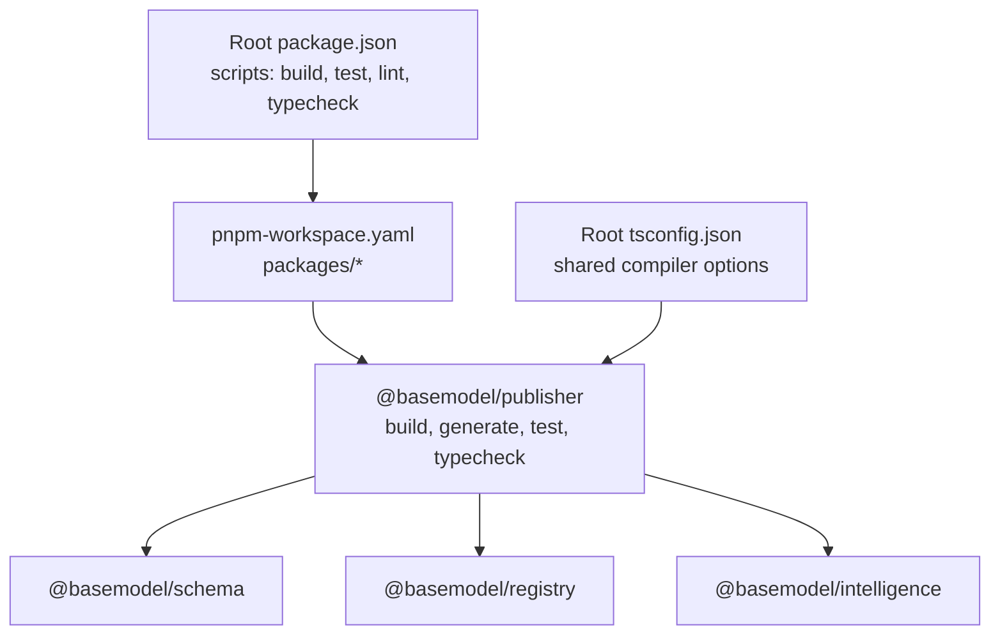
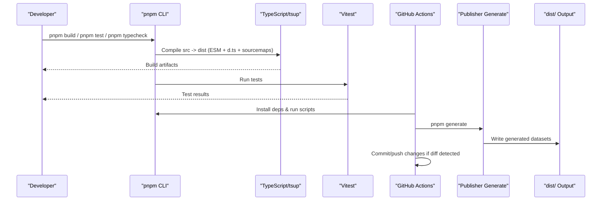
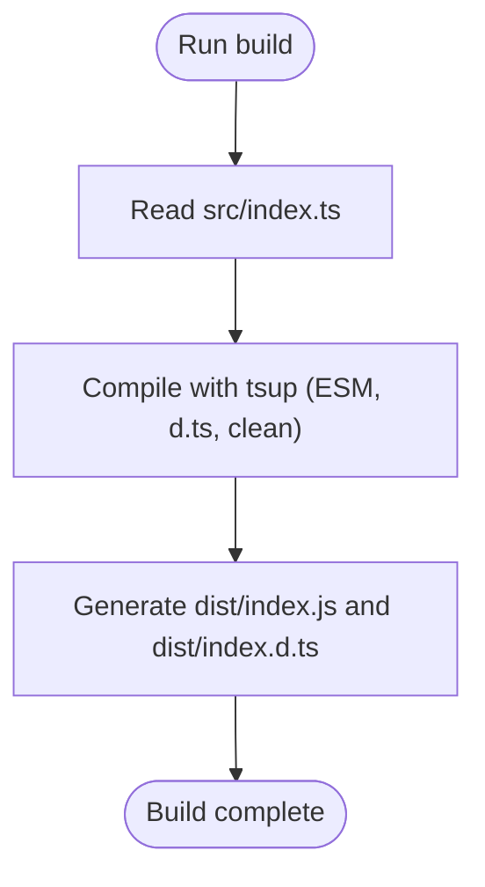
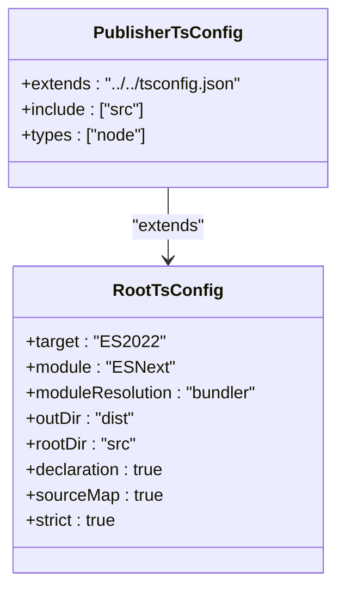
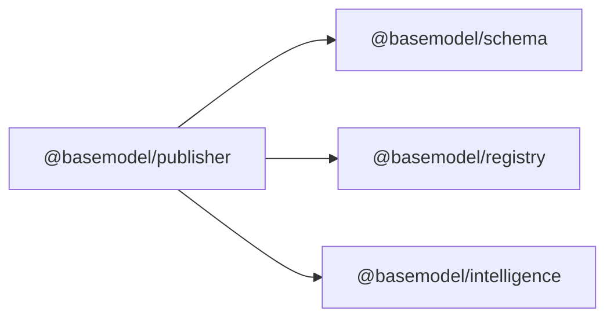
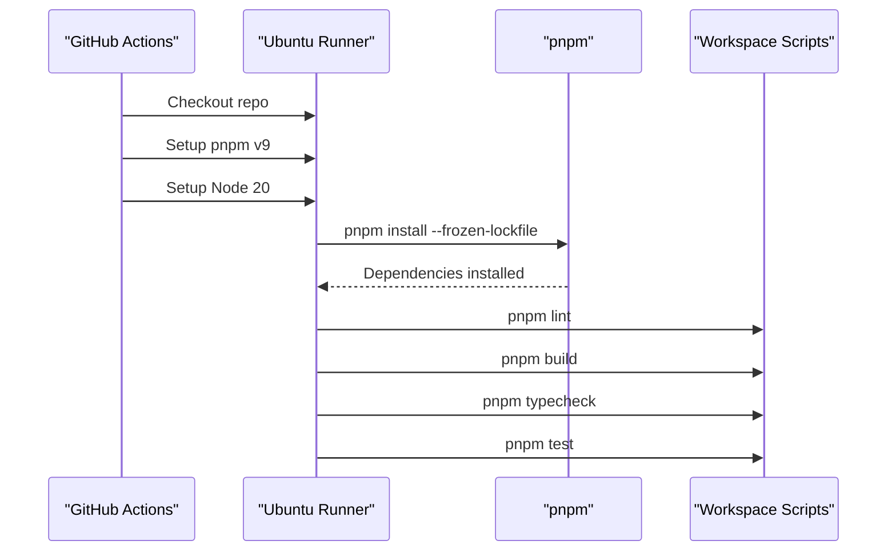
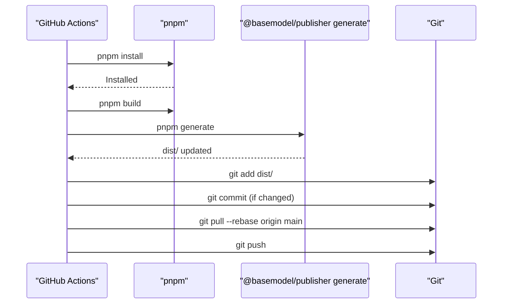
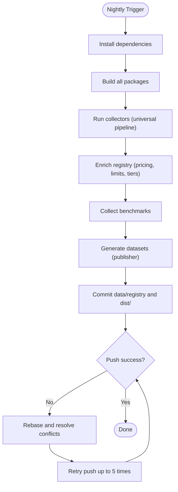
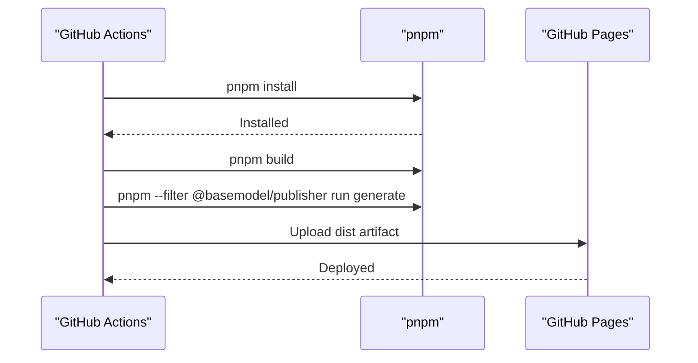
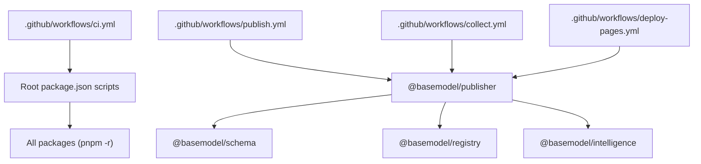

# Build Integration

<cite>
**Referenced Files in This Document**
- [package.json](file://package.json)
- [pnpm-workspace.yaml](file://pnpm-workspace.yaml)
- [tsconfig.json](file://tsconfig.json)
- [packages/publisher/package.json](file://packages/publisher/package.json)
- [packages/publisher/tsconfig.json](file://packages/publisher/tsconfig.json)
- [.github/workflows/ci.yml](file://.github/workflows/ci.yml)
- [.github/workflows/publish.yml](file://.github/workflows/publish.yml)
- [.github/workflows/collect.yml](file://.github/workflows/collect.yml)
- [.github/workflows/deploy-pages.yml](file://.github/workflows/deploy-pages.yml)
</cite>

## Table of Contents
1. Introduction
2. Project Structure
3. Core Components
4. Architecture Overview
5. Detailed Component Analysis
6. Dependency Analysis
7. Performance Considerations
8. Troubleshooting Guide
9. Conclusion

## Introduction
This document explains the build integration and automation workflows for the Publisher package within the monorepo. It covers how the project is configured for TypeScript compilation, dependency management with pnpm workspaces, CI/CD pipelines, automated testing, dataset generation, and deployment triggers. It also provides guidance on custom build scripts, environment configuration, release automation, troubleshooting common issues, performance optimization, and development workflow best practices.

## Project Structure
The repository is a pnpm workspace containing multiple packages. The Publisher package is one of these packages and depends on other internal packages via workspace protocols. The root configuration defines shared TypeScript settings and top-level scripts that orchestrate workspace-wide operations.

**Diagram sources**
- [package.json:17-25](file://package.json#L17-L25)
- [pnpm-workspace.yaml:1-3](file://pnpm-workspace.yaml#L1-L3)
- [packages/publisher/package.json:1-38](file://packages/publisher/package.json#L1-L38)
- [tsconfig.json:1-27](file://tsconfig.json#L1-L27)

**Section sources**
- [package.json:17-25](file://package.json#L17-L25)
- [pnpm-workspace.yaml:1-3](file://pnpm-workspace.yaml#L1-L3)
- [tsconfig.json:1-27](file://tsconfig.json#L1-L27)
- [packages/publisher/package.json:1-38](file://packages/publisher/package.json#L1-L38)

## Core Components
- Root scripts: Provide unified commands across the workspace (build, test, lint, typecheck, generate).
- Workspace definition: Declares all packages under packages/*.
- Publisher package: Defines its own build, generate, test, and typecheck scripts; declares dependencies on internal packages using workspace protocol.
- TypeScript configuration: Root tsconfig sets strict, modern targets, module resolution, and output settings; package-level tsconfig extends root and scopes to src.

Key behaviors:
- pnpm -r run build executes each package’s build script.
- pnpm --filter @basemodel/publisher run generate runs dataset generation for the Publisher package.
- TypeScript compiles from src to dist with declarations and source maps enabled.

**Section sources**
- [package.json:17-25](file://package.json#L17-L25)
- [packages/publisher/package.json:15-22](file://packages/publisher/package.json#L15-L22)
- [packages/publisher/package.json:23-27](file://packages/publisher/package.json#L23-L27)
- [tsconfig.json:1-27](file://tsconfig.json#L1-L27)
- [packages/publisher/tsconfig.json:1-10](file://packages/publisher/tsconfig.json#L1-L10)

## Architecture Overview
The build and automation architecture integrates local development commands with GitHub Actions workflows:

- Local development uses pnpm workspace scripts to build, typecheck, test, and generate datasets.
- CI validates code quality, builds all packages, performs type checks, and runs tests.
- Dataset generation and publishing are automated via dedicated workflows triggered by pushes or manual dispatch.
- Nightly collection gathers external data, enriches registry information, and regenerates published datasets.
- Documentation site deployment is handled by a Pages workflow that builds and publishes static assets.

**Diagram sources**
- [package.json:17-25](file://package.json#L17-L25)
- [packages/publisher/package.json:15-22](file://packages/publisher/package.json#L15-L22)
- [.github/workflows/ci.yml:10-41](file://.github/workflows/ci.yml#L10-L41)
- [.github/workflows/publish.yml:13-63](file://.github/workflows/publish.yml#L13-L63)
- [.github/workflows/collect.yml:13-110](file://.github/workflows/collect.yml#L13-L110)
- [.github/workflows/deploy-pages.yml:19-61](file://.github/workflows/deploy-pages.yml#L19-L61)

## Detailed Component Analysis

### Publisher Package Build Configuration
- Build tooling: Uses tsup to compile the entry file into ESM with declaration files and clean output.
- Generation: A separate script runs a generator to produce dataset outputs.
- Testing: Runs Vitest with a pass-with-no-tests flag to avoid failures when no tests exist.
- Type checking: Uses TypeScript in noEmit mode to validate types without producing output.
- Clean: Removes the dist directory.

**Diagram sources**
- [packages/publisher/package.json:15-22](file://packages/publisher/package.json#L15-L22)

**Section sources**
- [packages/publisher/package.json:15-22](file://packages/publisher/package.json#L15-L22)
- [packages/publisher/tsconfig.json:1-10](file://packages/publisher/tsconfig.json#L1-L10)

### TypeScript Compilation Strategy
- Root tsconfig enforces strictness, ES2022 target, ESNext modules, bundler module resolution, and emits declarations and source maps.
- Package-level tsconfig extends root and restricts include to src, ensuring consistent compilation behavior across the workspace.

**Diagram sources**
- [tsconfig.json:1-27](file://tsconfig.json#L1-L27)
- [packages/publisher/tsconfig.json:1-10](file://packages/publisher/tsconfig.json#L1-L10)

**Section sources**
- [tsconfig.json:1-27](file://tsconfig.json#L1-L27)
- [packages/publisher/tsconfig.json:1-10](file://packages/publisher/tsconfig.json#L1-L10)

### Dependency Management
- Workspace protocol: Internal dependencies use workspace:* to reference sibling packages (@basemodel/schema, @basemodel/registry, @basemodel/intelligence).
- Root engines and packageManager fields enforce Node and pnpm versions.
- pnpm lockfile ensures deterministic installs across environments.

**Diagram sources**
- [packages/publisher/package.json:23-27](file://packages/publisher/package.json#L23-L27)
- [package.json:12-16](file://package.json#L12-L16)

**Section sources**
- [packages/publisher/package.json:23-27](file://packages/publisher/package.json#L23-L27)
- [package.json:12-16](file://package.json#L12-L16)

### CI Pipeline (Build, Lint, Typecheck, Test)
- Triggers on push to main and pull requests targeting main.
- Steps: checkout, install pnpm, setup Node 20, install dependencies, lint, build all packages, typecheck, test.

**Diagram sources**
- [.github/workflows/ci.yml:10-41](file://.github/workflows/ci.yml#L10-L41)

**Section sources**
- [.github/workflows/ci.yml:10-41](file://.github/workflows/ci.yml#L10-L41)

### Dataset Generation and Publishing Workflow
- Triggered on push to main or manually via workflow_dispatch.
- Builds all packages, then runs the Publisher generate script to produce dist/ content.
- Detects changes in dist/, commits and pushes them back to main with a skip ci marker to avoid loops.

**Diagram sources**
- [.github/workflows/publish.yml:13-63](file://.github/workflows/publish.yml#L13-L63)

**Section sources**
- [.github/workflows/publish.yml:13-63](file://.github/workflows/publish.yml#L13-L63)

### Nightly Data Collection and Enrichment
- Scheduled daily at midnight UTC; can be triggered manually.
- Installs dependencies, builds packages, runs collectors to gather data, enriches registry metadata, collects benchmarks, and generates published datasets.
- Commits collected data and dist/ with retry logic to handle concurrent pushes and rebase conflicts.

**Diagram sources**
- [.github/workflows/collect.yml:13-110](file://.github/workflows/collect.yml#L13-L110)

**Section sources**
- [.github/workflows/collect.yml:13-110](file://.github/workflows/collect.yml#L13-L110)

### Documentation Site Deployment (GitHub Pages)
- Triggered on push to main or manually.
- Builds all packages, generates static APIs via publisher, configures Pages, uploads dist artifact, and deploys.

**Diagram sources**
- [.github/workflows/deploy-pages.yml:19-61](file://.github/workflows/deploy-pages.yml#L19-L61)

**Section sources**
- [.github/workflows/deploy-pages.yml:19-61](file://.github/workflows/deploy-pages.yml#L19-L61)

## Dependency Analysis
- Publisher depends on schema, registry, and intelligence packages through workspace protocol, ensuring consistent versioning and local development.
- Root scripts orchestrate workspace-wide tasks, while package-specific scripts tailor behavior per package.
- Workflows depend on Node 20 and pnpm v9, with caching enabled for faster installs.

**Diagram sources**
- [package.json:17-25](file://package.json#L17-L25)
- [packages/publisher/package.json:23-27](file://packages/publisher/package.json#L23-L27)
- [.github/workflows/ci.yml:10-41](file://.github/workflows/ci.yml#L10-L41)
- [.github/workflows/publish.yml:13-63](file://.github/workflows/publish.yml#L13-L63)
- [.github/workflows/collect.yml:13-110](file://.github/workflows/collect.yml#L13-L110)
- [.github/workflows/deploy-pages.yml:19-61](file://.github/workflows/deploy-pages.yml#L19-L61)

**Section sources**
- [package.json:17-25](file://package.json#L17-L25)
- [packages/publisher/package.json:23-27](file://packages/publisher/package.json#L23-L27)

## Performance Considerations
- Use pnpm cache in CI to speed up dependency installation.
- Keep TypeScript strict but enable isolatedModules and skipLibCheck to reduce compilation overhead.
- Ensure tsup cleans dist before building to avoid stale artifacts.
- Limit unnecessary logging in CI steps to reduce job runtime.
- For large dataset generation, consider parallelizing independent tasks where feasible.

[No sources needed since this section provides general guidance]

## Troubleshooting Guide
Common issues and resolutions:
- Node/pnpm version mismatch: Ensure Node 20 and pnpm v9 are used locally and in CI.
- Lockfile errors: Run pnpm install --frozen-lockfile to match CI behavior; update lockfile only when necessary.
- TypeScript errors: Run pnpm typecheck to catch issues early; verify tsconfig includes/excludes.
- Build failures: Confirm src exists and entry points are correct; check tsup flags and clean behavior.
- Dataset generation failures: Validate required environment variables and API keys; ensure network access in CI.
- Push races in nightly jobs: The collect workflow includes retry and rebase logic; if conflicts persist, regenerate dist after resolving.

**Section sources**
- [package.json:12-16](file://package.json#L12-L16)
- [.github/workflows/ci.yml:10-41](file://.github/workflows/ci.yml#L10-L41)
- [.github/workflows/collect.yml:74-110](file://.github/workflows/collect.yml#L74-L110)

## Conclusion
The Publisher package integrates seamlessly into the monorepo’s build system and CI/CD pipelines. With pnpm workspaces, TypeScript configuration, and GitHub Actions workflows, the project supports robust local development, automated validation, dataset generation, and deployment. Following the recommended practices and troubleshooting steps will help maintain a fast, reliable build process and smooth releases.