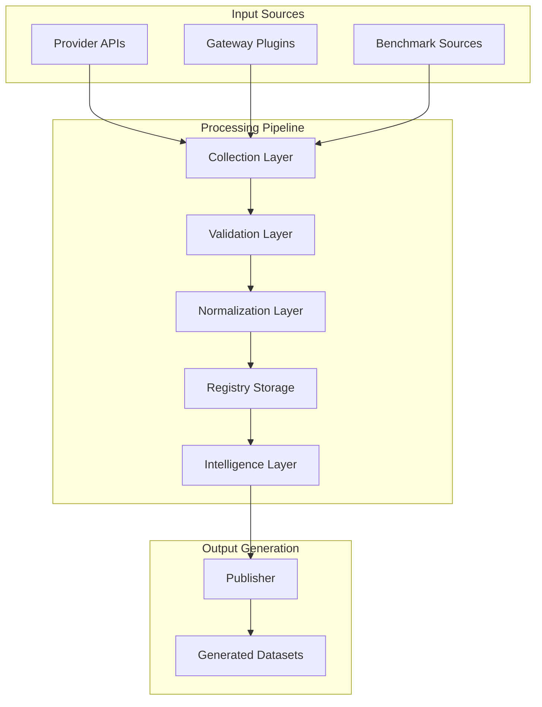
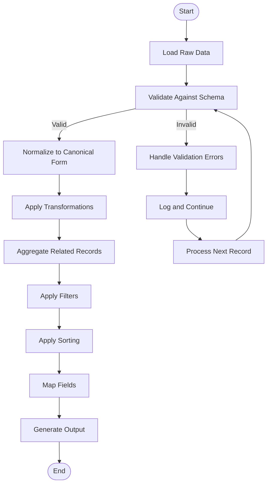
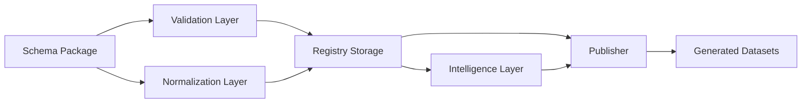

# Data Formatters

<cite>
**Referenced Files in This Document**
- [README.md](file://README.md)
- [04_Pipeline.md](file://docs/04_Pipeline.md)
- [05_Data_Model.md](file://docs/05_Data_Model.md)
- [validation.ts](file://packages/registry/src/validation.ts)
- [generate.ts](file://packages/publisher/src/generate.ts)
</cite>

## Table of Contents
1. [Introduction](#introduction)
2. [Project Structure](#project-structure)
3. [Core Components](#core-components)
4. [Architecture Overview](#architecture-overview)
5. [Detailed Component Analysis](#detailed-component-analysis)
6. [Dependency Analysis](#dependency-analysis)
7. [Performance Considerations](#performance-considerations)
8. [Troubleshooting Guide](#troubleshooting-guide)
9. [Conclusion](#conclusion)
10. [Appendices](#appendices)

## Introduction
This document explains the data formatting pipeline that transforms registry data into various output datasets. It covers schema validation rules, transformation functions, aggregation strategies, filtering and sorting options, field mapping capabilities, custom formatter patterns, performance tuning, error handling, data integrity checks, and debugging tools. The goal is to make the formatter architecture clear for both technical and non-technical readers.

## Project Structure
The repository organizes functionality into packages:
- Schema package defines canonical types and Zod schemas used across the system.
- Registry package stores canonical records and provides validation utilities.
- Publisher package generates public JSON datasets from the registry.
- Collectors package gathers provider and gateway data and normalizes it into canonical forms.
- Intelligence package derives rankings, search, and recommendations from the registry.
- CLI package provides command-line access to query intelligence.

Generated datasets are written to dist/ and include providers.json, models.json, capabilities.json, licenses.json, apis.json, benchmarks.json, pricing.json, intelligence.json, and metadata.json. Each dataset includes schema_version, source_revision, generated_at, and count metadata.

**Section sources**
- [README.md:11-30](file://README.md#L11-L30)
- [04_Pipeline.md:78-98](file://docs/04_Pipeline.md#L78-L98)

## Core Components
The data formatting pipeline consists of several core components:
- Schema validation using Zod-based validators with safe parsing and batch validation helpers.
- Normalization layer converting provider-specific representations into canonical BaseModel entities.
- Registry storage maintaining canonical records with merge semantics and lifecycle management.
- Intelligence layer deriving search results, alternatives, and cost tiers without modifying registry data.
- Publisher generating public datasets with cross-entity relation validation before writing any file.

Key responsibilities:
- Validation ensures required fields, identifier formats, schema compliance, URL validity, and timestamp formats.
- Normalization standardizes identifiers, capability names, pricing units, and API compatibility data.
- Aggregation combines multiple pricing sources deterministically by provenance.
- Generation writes datasets with consistent metadata and relational integrity guarantees.

**Section sources**
- [04_Pipeline.md:28-46](file://docs/04_Pipeline.md#L28-L46)
- [04_Pipeline.md:68-98](file://docs/04_Pipeline.md#L68-L98)

## Architecture Overview
The formatter architecture follows a pipeline pattern where data flows through discovery, collection, validation, normalization, registry storage, intelligence derivation, generation, and publication stages.



**Diagram sources**
- [04_Pipeline.md:5-14](file://docs/04_Pipeline.md#L5-L14)
- [04_Pipeline.md:78-98](file://docs/04_Pipeline.md#L78-L98)

## Detailed Component Analysis

### Schema Validation System
The validation system uses Zod schemas for type safety and runtime validation. It provides both single-record and batch validation capabilities with comprehensive error reporting.

```mermaid
classDiagram
class ValidationResult {
+boolean success
+T data
+string[] errors
}
class Validator {
+validate(schema, raw) ValidationResult
+validateMany(schema, records) ValidatedRecords
}
class ValidatedRecords {
+T[] valid
+{index : number; errors : string[]}[] invalid
}
ValidationResult <|-- ValidatedRecords : "used by"
Validator --> ValidationResult : "returns"
Validator --> ValidatedRecords : "returns"
```

**Diagram sources**
- [validation.ts:1-42](file://packages/registry/src/validation.ts#L1-L42)

The validation system supports:
- Safe parsing without throwing exceptions
- Batch processing with row-level error tracking
- Comprehensive error messages with path information
- Type-safe result structures

**Section sources**
- [validation.ts:11-20](file://packages/registry/src/validation.ts#L11-L20)
- [validation.ts:25-42](file://packages/registry/src/validation.ts#L25-L42)

### Data Transformation Functions
Transformation functions convert provider-specific data into canonical BaseModel schemas. Key transformations include:

- Identifier normalization: Converting various ID formats to canonical kebab-case provider IDs and model-slug combinations
- Capability classification: Using heuristics to determine model capabilities when explicit metadata is unavailable
- Pricing unit standardization: Converting different currency and unit formats to standardized values
- API compatibility mapping: Translating provider-specific API endpoints to canonical protocol definitions

The transformation pipeline handles edge cases such as missing capability metadata by applying conservative heuristics based on model naming patterns and known characteristics.

**Section sources**
- [04_Pipeline.md:34-46](file://docs/04_Pipeline.md#L34-L46)
- [05_Data_Model.md:137-141](file://docs/05_Data_Model.md#L137-L141)

### Aggregation Strategies
Aggregation combines data from multiple sources with deterministic priority rules:

- Pricing aggregation: Provider catalogs take precedence over OpenRouter, which takes precedence over Hugging Face fallbacks
- Benchmark aggregation: Multiple benchmark sources are combined with quality scoring and deduplication
- Capability aggregation: Union of capabilities from all sources with conflict resolution based on specificity

The aggregation system maintains provenance tracking to ensure transparency about data sources and allows consumers to understand the reliability of aggregated values.

**Section sources**
- [04_Pipeline.md:141-175](file://docs/04_Pipeline.md#L141-L175)

### Filtering Mechanisms
Filtering mechanisms allow selective processing of registry data:

- Provider-based filtering: Process only specific providers or exclude blacklisted ones
- Model status filtering: Include only active models or include deprecated ones for historical analysis
- Capability-based filtering: Filter models by specific capabilities or modality types
- Date range filtering: Process models within specific time periods for temporal analysis

Filters can be composed and applied at different stages of the pipeline for maximum flexibility.

### Sorting Options
Sorting capabilities support various ordering strategies:

- Alphabetical sorting: By provider name, model name, or capability name
- Temporal sorting: By release date, update timestamp, or evaluation date
- Performance sorting: By benchmark scores or cost efficiency metrics
- Custom sorting: User-defined sort functions for specialized use cases

Sorting can be applied during aggregation or as a post-processing step for optimized output.

### Field Mapping Capabilities
Field mapping enables flexible transformation between different data representations:

- Source-to-canon mapping: Map provider-specific fields to canonical BaseModel fields
- Conditional mapping: Apply different mappings based on data content or context
- Computed fields: Generate derived fields from existing data (e.g., cost calculations)
- Validation mapping: Ensure mapped data conforms to target schema requirements

Field mappings are defined declaratively and can be validated against target schemas.

**Section sources**
- [05_Data_Model.md:23-136](file://docs/05_Data_Model.md#L23-L136)

### Custom Formatters
Custom formatters extend the base formatting pipeline with specialized logic:

- Provider-specific formatters: Handle unique data structures from specific providers
- Output format adapters: Convert canonical data to different output formats (JSON, CSV, XML)
- Business rule formatters: Apply domain-specific business logic during transformation
- Debug formatters: Generate detailed logs and intermediate states for troubleshooting

Custom formatters integrate seamlessly with the base pipeline through well-defined interfaces.

### Transformation Pipelines
Transformation pipelines chain multiple formatting operations:



**Diagram sources**
- [04_Pipeline.md:5-14](file://docs/04_Pipeline.md#L5-L14)

**Section sources**
- [04_Pipeline.md:28-46](file://docs/04_Pipeline.md#L28-L46)

## Dependency Analysis
The formatter architecture has clear dependency relationships between components:



Key dependencies:
- Schema package provides foundational types and validation rules
- Validation layer depends on schema definitions for runtime checking
- Normalization layer transforms data according to schema contracts
- Registry stores validated and normalized data
- Intelligence layer reads from registry for derived computations
- Publisher depends on registry and intelligence for dataset generation

**Diagram sources**
- [04_Pipeline.md:5-14](file://docs/04_Pipeline.md#L5-L14)

**Section sources**
- [04_Pipeline.md:48-77](file://docs/04_Pipeline.md#L48-L77)

## Performance Considerations
Performance optimization strategies for the data formatting pipeline:

- Batch processing: Process multiple records together to reduce overhead
- Lazy loading: Load only necessary data for each transformation step
- Caching: Cache expensive computations and frequently accessed data
- Parallel processing: Process independent records concurrently where possible
- Memory management: Stream large datasets instead of loading entirely into memory
- Index optimization: Use appropriate indexes for filtering and sorting operations

The publisher validates cross-entity relations before writing any files to prevent partial writes and ensure data consistency.

**Section sources**
- [generate.ts:73-106](file://packages/publisher/src/generate.ts#L73-L106)

## Troubleshooting Guide
Common issues and debugging approaches for the data formatting pipeline:

### Validation Errors
- Check schema definitions for required fields and constraints
- Review error messages for specific field paths and validation failures
- Use batch validation to identify problematic records efficiently

### Data Integrity Issues
- Verify cross-entity relations before generation
- Check provenance tracking for data source attribution
- Monitor lifecycle status changes during reconciliation

### Performance Problems
- Profile transformation functions for bottlenecks
- Review batch sizes and parallelization settings
- Analyze memory usage patterns for large datasets

### Debugging Tools
- Enable detailed logging for transformation steps
- Generate intermediate state snapshots for complex pipelines
- Use schema validation to catch issues early in development

**Section sources**
- [04_Pipeline.md:100-105](file://docs/04_Pipeline.md#L100-L105)
- [04_Pipeline.md:222-243](file://docs/04_Pipeline.md#L222-L243)

## Conclusion
The data formatting pipeline provides a robust, extensible architecture for transforming registry data into various output formats. The system emphasizes data integrity through comprehensive validation, maintains flexibility through customizable transformation pipelines, and ensures performance through optimized processing strategies. The modular design allows for easy extension with custom formatters while maintaining consistency across the entire data flow.

## Appendices

### Dataset Metadata Structure
Each generated dataset includes consistent metadata:
- schema_version: Version of the schema package used for generation
- source_revision: Git revision of the source data
- generated_at: ISO 8601 timestamp of generation
- count: Number of records in the dataset

### Tier Definitions
Cost tier classifications are based on blended per-1M-token costs:
- free: Both input and output cost $0
- budget: Blended cost less than $0.50
- balanced: Blended cost between $0.50 and $5
- premium: Blended cost greater than $5

**Section sources**
- [05_Data_Model.md:143-151](file://docs/05_Data_Model.md#L143-L151)
- [04_Pipeline.md:207-220](file://docs/04_Pipeline.md#L207-L220)