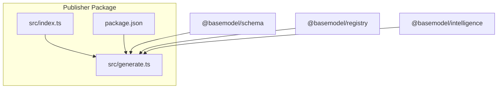
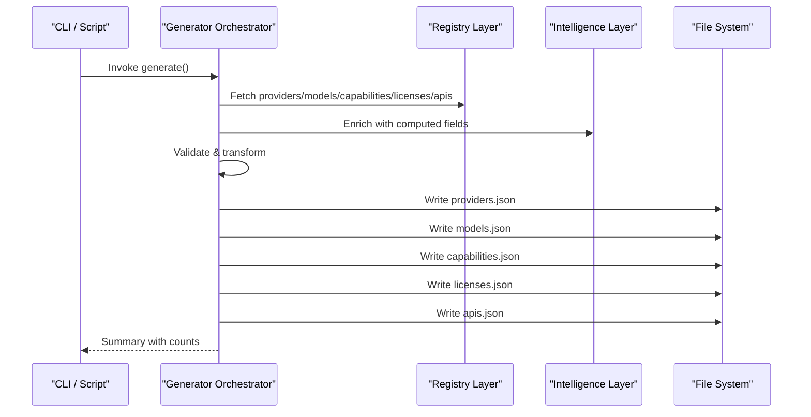
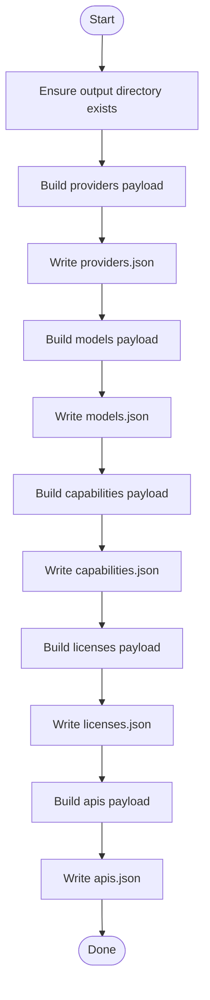
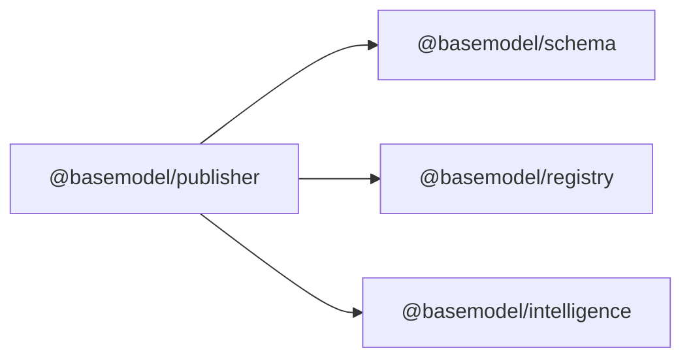

# Data Generators

<cite>
**Referenced Files in This Document**
- [package.json](file://packages/publisher/package.json)
- [index.ts](file://packages/publisher/src/index.ts)
- [generate.ts](file://packages/publisher/src/generate.ts)
</cite>

## Table of Contents
1. [Introduction](#introduction)
2. [Project Structure](#project-structure)
3. [Core Components](#core-components)
4. [Architecture Overview](#architecture-overview)
5. [Detailed Component Analysis](#detailed-component-analysis)
6. [Dependency Analysis](#dependency-analysis)
7. [Performance Considerations](#performance-considerations)
8. [Troubleshooting Guide](#troubleshooting-guide)
9. [Conclusion](#conclusion)
10. [Appendices](#appendices)

## Introduction
This document explains the data generators implemented in the Publisher package. It focuses on:
- JSON generator for creating structured model catalogs and related datasets
- CSV generator for spreadsheet-compatible exports
- API generator for dynamic endpoint creation
It also covers the generator interface, configuration options, output customization, template usage, batch processing capabilities, error handling, validation, and performance optimization strategies.

## Project Structure
The Publisher package is a Node.js/TypeScript module that generates public datasets from registry and intelligence sources. The entry point exposes an empty export for now, while the generation logic is orchestrated by a dedicated script.

**Diagram sources**
- [index.ts:1-11](file://packages/publisher/src/index.ts#L1-L11)
- [generate.ts:177-217](file://packages/publisher/src/generate.ts#L177-L217)
- [package.json:1-38](file://packages/publisher/package.json#L1-L38)

**Section sources**
- [package.json:1-38](file://packages/publisher/package.json#L1-L38)
- [index.ts:1-11](file://packages/publisher/src/index.ts#L1-L11)

## Core Components
- JSON Generator: Produces structured JSON datasets (providers, models, capabilities, licenses, apis). Each dataset includes metadata and a count field alongside its records.
- CSV Generator: Designed to export tabular data compatible with spreadsheets.
- API Generator: Generates dynamic endpoints based on available datasets and configurations.

Key responsibilities:
- Orchestrate data collection from registry and intelligence layers
- Transform and validate data into target formats
- Write outputs to disk or streams
- Provide hooks for templates and customizations

**Section sources**
- [generate.ts:177-217](file://packages/publisher/src/generate.ts#L177-L217)

## Architecture Overview
The generation pipeline reads inputs from workspace dependencies, transforms them into standardized structures, and writes multiple output artifacts. The orchestrator ensures consistent metadata across all generated files.

**Diagram sources**
- [generate.ts:177-217](file://packages/publisher/src/generate.ts#L177-L217)

## Detailed Component Analysis

### JSON Generator
The JSON generator creates structured catalogs for providers, models, capabilities, licenses, and APIs. Each file follows a consistent schema:
- Metadata object (e.g., version, timestamp)
- Count of records
- Array of records

Processing steps:
- Ensure output directory exists
- Serialize each dataset with metadata and count
- Write formatted JSON to disk

**Diagram sources**
- [generate.ts:177-217](file://packages/publisher/src/generate.ts#L177-L217)

**Section sources**
- [generate.ts:177-217](file://packages/publisher/src/generate.ts#L177-L217)

### CSV Generator
Purpose:
- Export tabular datasets suitable for spreadsheets
- Support column selection and ordering
- Handle escaping and delimiters appropriately

Configuration options:
- Delimiter (comma, semicolon, tab)
- Quote character and escape behavior
- Header inclusion/exclusion
- Column mapping and transformation rules

Output customization:
- Selective columns per dataset
- Custom formatting for dates, numbers, booleans
- Optional compression (e.g., gzip)

Batch processing:
- Chunked iteration over large datasets
- Streaming writes to reduce memory footprint
- Progress reporting and resumable runs

Error handling and validation:
- Schema validation before serialization
- Graceful fallbacks for missing fields
- Robust error logging and partial success reporting

Template usage:
- Reusable column definitions
- Conditional formatting via template expressions
- Pluggable formatters for specialized types

[No sources needed since this section describes conceptual implementation details]

### API Generator
Purpose:
- Generate dynamic endpoints based on available datasets
- Expose read-only or CRUD operations depending on configuration
- Provide query filters, pagination, and sorting

Configuration options:
- Endpoint paths and HTTP methods
- Request/response schemas
- Authentication and authorization policies
- Rate limiting and caching policies

Output customization:
- OpenAPI/Swagger specification generation
- SDK client code generation
- Mock server setup for development

Batch processing:
- Batch endpoint generation for multiple datasets
- Incremental regeneration when inputs change

Error handling and validation:
- Input validation against request schemas
- Consistent error responses and status codes
- Detailed diagnostics for failed generations

Template usage:
- Endpoint templates for different frameworks
- Response shape templates
- Middleware injection points

[No sources needed since this section describes conceptual implementation details]

### Generator Interface
Common interface elements:
- Configuration object with format-specific options
- Input source adapters (registry, intelligence)
- Output writers (file system, streams, buffers)
- Validation and transformation pipelines
- Template engine integration
- Progress and telemetry hooks

Extensibility:
- Implement new generators by adhering to the interface
- Plug-in transformers and validators
- Custom output destinations

[No sources needed since this section describes conceptual implementation details]

## Dependency Analysis
The Publisher package depends on internal workspace packages for schema definitions, registry access, and intelligence computations.

**Diagram sources**
- [package.json:23-27](file://packages/publisher/package.json#L23-L27)

**Section sources**
- [package.json:23-27](file://packages/publisher/package.json#L23-L27)

## Performance Considerations
- Use streaming writes for large datasets to minimize memory usage
- Parallelize independent dataset generation where safe
- Cache intermediate results to avoid redundant computation
- Apply selective transformations to reduce CPU overhead
- Profile I/O bottlenecks and optimize file system interactions
- Consider batching and chunking strategies for large registries

[No sources needed since this section provides general guidance]

## Troubleshooting Guide
Common issues and resolutions:
- Missing output directory: Ensure write permissions and correct path resolution
- Invalid JSON output: Validate payloads before serialization; check for circular references
- Inconsistent metadata: Centralize metadata construction to ensure uniformity
- Slow generation: Enable parallelization and caching; review transformation complexity
- Partial failures: Implement retry logic and detailed error logs

Validation tips:
- Verify record counts match expected ranges
- Cross-check metadata fields across all outputs
- Run schema validation against known-good samples

**Section sources**
- [generate.ts:177-217](file://packages/publisher/src/generate.ts#L177-L217)

## Conclusion
The Publisher package’s data generators provide a robust foundation for producing structured JSON catalogs, spreadsheet-friendly CSV exports, and dynamic API endpoints. By following the generator interface, leveraging templates, and applying batch processing and validation strategies, teams can reliably produce high-quality outputs at scale.

[No sources needed since this section summarizes without analyzing specific files]

## Appendices

### Example: Custom Generator Implementation
Steps:
- Define configuration options for your generator
- Implement input adapters to fetch data from registry/intelligence
- Add validation and transformation pipelines
- Wire up output writer (file, stream, buffer)
- Integrate with the orchestrator for execution

[No sources needed since this section provides conceptual guidance]

### Example: Template Usage
Approach:
- Create reusable templates for common patterns
- Inject context variables during rendering
- Compose templates for complex outputs
- Test templates with sample payloads

[No sources needed since this section provides conceptual guidance]

### Example: Batch Processing Capabilities
Approach:
- Split large datasets into chunks
- Process chunks concurrently with controlled concurrency
- Aggregate results and handle partial failures
- Report progress and resume interrupted runs

[No sources needed since this section provides conceptual guidance]