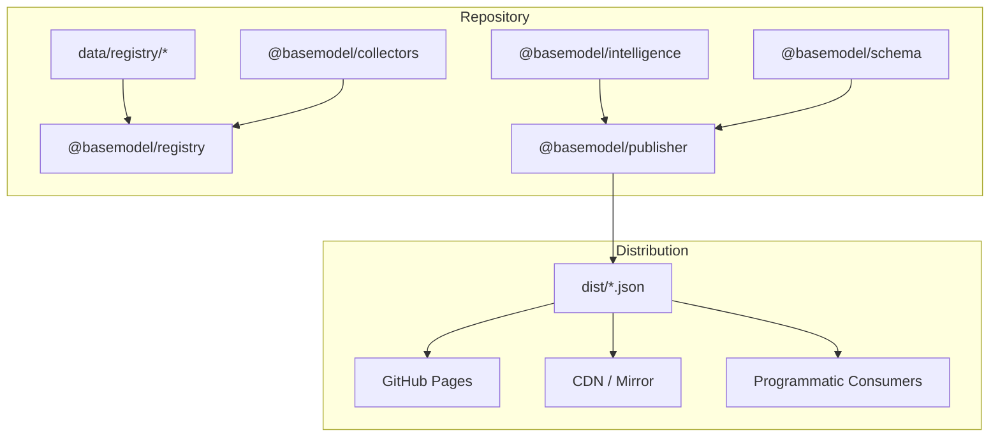
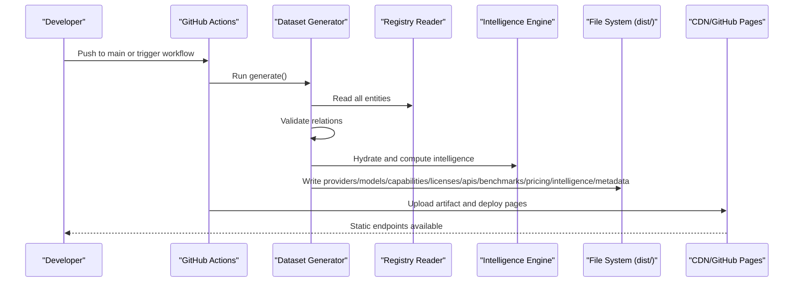
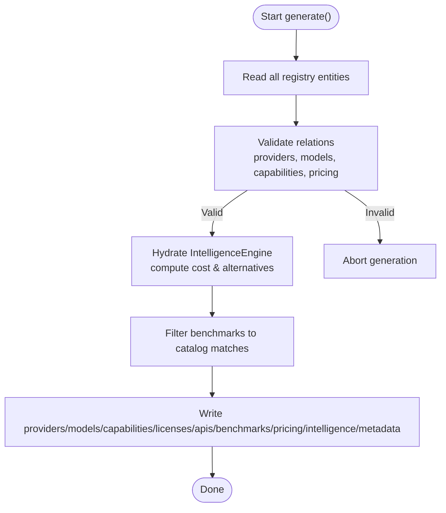
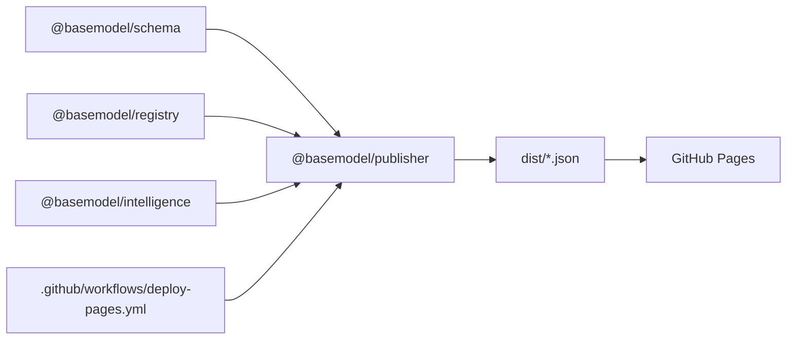

# Distribution System

<cite>
**Referenced Files in This Document**
- [README.md](file://README.md)
- [03_Architecture.md](file://docs/03_Architecture.md)
- [04_Pipeline.md](file://docs/04_Pipeline.md)
- [07_Developer_Access.md](file://docs/07_Developer_Access.md)
- [generate.ts](file://packages/publisher/src/generate.ts)
- [dataset-contract.test.ts](file://packages/publisher/src/__tests__/dataset-contract.test.ts)
- [deploy-pages.yml](file://.github/workflows/deploy-pages.yml)
</cite>

## Table of Contents
1. [Introduction](#introduction)
2. [Project Structure](#project-structure)
3. [Core Components](#core-components)
4. [Architecture Overview](#architecture-overview)
5. [Detailed Component Analysis](#detailed-component-analysis)
6. [Dependency Analysis](#dependency-analysis)
7. [Performance Considerations](#performance-considerations)
8. [Troubleshooting Guide](#troubleshooting-guide)
9. [Conclusion](#conclusion)
10. [Appendices](#appendices)

## Introduction
This document explains the distribution system that publishes generated datasets through multiple channels: local file system storage, CDN integration for web deployment, and programmatic access via static JSON endpoints. It covers distribution configurations, caching strategies, version management, examples of custom distributors, deployment workflows, monitoring capabilities, security considerations, access control, and performance optimization. The system is part of a data layer platform that discovers, validates, normalizes, stores, analyzes, and publishes structured knowledge about AI models.

## Project Structure
The repository organizes functionality into packages and documentation:
- Schema package defines canonical types and schemas.
- Registry package reads/writes canonical records.
- Collectors discover and collect provider data.
- Intelligence derives search, alternatives, and cost information.
- Publisher generates public datasets to dist/.
- CLI exposes intelligence from the terminal.

Generated datasets are written to dist/ and include providers.json, models.json, capabilities.json, licenses.json, apis.json, benchmarks.json, pricing.json, intelligence.json, and metadata.json.

**Diagram sources**
- [03_Architecture.md:31-44](file://docs/03_Architecture.md#L31-L44)
- [04_Pipeline.md:78-98](file://docs/04_Pipeline.md#L78-L98)
- [README.md:10-30](file://README.md#L10-L30)

**Section sources**
- [README.md:10-30](file://README.md#L10-L30)
- [03_Architecture.md:31-44](file://docs/03_Architecture.md#L31-L44)
- [04_Pipeline.md:78-98](file://docs/04_Pipeline.md#L78-L98)

## Core Components
- Dataset Generator (Publisher): Reads registry data, validates relations, computes intelligence, and writes static JSON files to dist/.
- Registry Reader: Provides functions to read all entities (providers, models, capabilities, licenses, apis, benchmarks, pricing).
- Intelligence Engine: Computes cost efficiency and alternative suggestions used by the publisher.
- Deployment Workflow: GitHub Actions job builds, generates datasets, and deploys to GitHub Pages.

Key responsibilities:
- Versioning: Each dataset includes schema_version, source_revision, generated_at, and count.
- Validation: Cross-entity relations validated before any write to prevent partial outputs.
- Enrichment Metadata: Tier definitions and blend formula published in metadata.json.

**Section sources**
- [generate.ts:108-176](file://packages/publisher/src/generate.ts#L108-L176)
- [generate.ts:177-276](file://packages/publisher/src/generate.ts#L177-L276)
- [04_Pipeline.md:78-98](file://docs/04_Pipeline.md#L78-L98)

## Architecture Overview
The distribution pipeline integrates discovery, collection, validation, normalization, registry storage, intelligence derivation, generation, and publication.

**Diagram sources**
- [deploy-pages.yml:26-60](file://.github/workflows/deploy-pages.yml#L26-L60)
- [generate.ts:108-276](file://packages/publisher/src/generate.ts#L108-L276)
- [04_Pipeline.md:78-98](file://docs/04_Pipeline.md#L78-L98)

## Detailed Component Analysis

### Dataset Generator (Publisher)
The generator orchestrates reading registry data, validating cross-entity relations, computing intelligence, and writing datasets with consistent metadata.

Key behaviors:
- Workspace root detection and output directory resolution.
- Source revision retrieval via git command.
- Schema version resolution from package manifest.
- Relation validation ensures model references to providers and capabilities exist; warns on orphaned pricing rows.
- Intelligence computation uses engine.hydrate and calculates cost tiers and alternatives per model.
- Benchmarks filtered to catalog-matched entries for lean published output.
- Writes each dataset with meta envelope including schema_version, source_revision, generated_at, and count.
- Publishes metadata.json with tier_definitions and blend formula.

**Diagram sources**
- [generate.ts:108-176](file://packages/publisher/src/generate.ts#L108-L176)
- [generate.ts:177-276](file://packages/publisher/src/generate.ts#L177-L276)

**Section sources**
- [generate.ts:31-71](file://packages/publisher/src/generate.ts#L31-L71)
- [generate.ts:77-106](file://packages/publisher/src/generate.ts#L77-L106)
- [generate.ts:108-176](file://packages/publisher/src/generate.ts#L108-L176)
- [generate.ts:177-276](file://packages/publisher/src/generate.ts#L177-L276)

### File System Distribution (Local Storage)
- Output directory: dist/ at workspace root.
- Files produced: providers.json, models.json, capabilities.json, licenses.json, apis.json, benchmarks.json, pricing.json, intelligence.json, metadata.json.
- Each file includes a meta envelope: schema_version, source_revision, generated_at, count.
- Generation guarantees ensure no partial writes if registry is broken.

Usage patterns:
- Local consumption by scripts or tools reading dist/*.json directly.
- CI artifacts can archive dist/ for downstream jobs.

**Section sources**
- [README.md:19-30](file://README.md#L19-L30)
- [04_Pipeline.md:78-98](file://docs/04_Pipeline.md#L78-L98)
- [generate.ts:177-276](file://packages/publisher/src/generate.ts#L177-L276)

### CDN Integration (Web Deployment)
- GitHub Pages deployment uploads dist/ as an artifact and configures pages deployment.
- Consumers can fetch datasets from GitHub Pages URLs or mirror them to other CDNs.
- Static JSON endpoints enable browser-based consumption without server-side logic.

Deployment steps:
- Install dependencies and build packages.
- Generate static APIs via publisher.
- Configure Pages and upload artifact.
- Deploy to GitHub Pages environment.

**Section sources**
- [deploy-pages.yml:26-60](file://.github/workflows/deploy-pages.yml#L26-L60)
- [07_Developer_Access.md:80-103](file://docs/07_Developer_Access.md#L80-L103)

### API Endpoint Generation (Programmatic Access)
- Programmatic consumers can import @basemodel/publisher to call generate(outputDir) programmatically.
- Direct JSON consumption is supported via HTTP requests to published endpoints.
- Example usage demonstrates fetching intelligence.json and iterating results.

Integration options:
- Node.js SDK usage to hydrate intelligence engine and run queries.
- Browser-like environments can hydrate engine with loaded snapshots.

**Section sources**
- [07_Developer_Access.md:6-61](file://docs/07_Developer_Access.md#L6-L61)
- [07_Developer_Access.md:80-103](file://docs/07_Developer_Access.md#L80-L103)

### Distribution Configurations
- Output directory resolved automatically relative to workspace root.
- Schema version derived from package manifest; fallback provided.
- Git revision captured for provenance.
- Enrichment metadata included in metadata.json for transparency.

Configuration points:
- Custom output directory via generate(outputDir).
- Environment variables not required for generation; secrets only needed for collectors/enrichment upstreams.

**Section sources**
- [generate.ts:31-71](file://packages/publisher/src/generate.ts#L31-L71)
- [generate.ts:108-123](file://packages/publisher/src/generate.ts#L108-L123)
- [generate.ts:246-276](file://packages/publisher/src/generate.ts#L246-L276)

### Caching Strategies
- For CDN distribution, leverage browser and CDN caches via immutable URLs tied to source_revision and generated_at.
- Consumers should cache responses based on content hash or timestamp headers when available.
- In Node.js, hydrating the intelligence engine avoids repeated filesystem reads.

Recommendations:
- Use versioned URLs pointing to specific commits to maximize cache hits.
- Implement conditional requests (ETag/Last-Modified) at the CDN level where possible.

[No sources needed since this section provides general guidance]

### Version Management
- schema_version reflects the schema package version used during generation.
- source_revision ties datasets to a specific git commit.
- generated_at indicates freshness of the snapshot.
- dataset contract tests validate structure and integrity against real registry.

Best practices:
- Always consume datasets with explicit schema_version checks.
- Monitor generated_at to detect stale data.

**Section sources**
- [generate.ts:50-71](file://packages/publisher/src/generate.ts#L50-L71)
- [generate.ts:108-123](file://packages/publisher/src/generate.ts#L108-L123)
- [dataset-contract.test.ts:23-57](file://packages/publisher/src/__tests__/dataset-contract.test.ts#L23-L57)

### Examples of Custom Distributors
- Extend generate(outputDir) to write additional formats (e.g., CSV, Parquet) alongside JSON.
- Implement a distributor interface that consumes dist/*.json and pushes to external systems (S3, Azure Blob, etc.).
- Use the dataset contract test patterns to validate outputs before publishing.

Implementation ideas:
- Wrap generate() with post-processing hooks for format conversion.
- Integrate checksums and manifests for integrity verification.

[No sources needed since this section provides general guidance]

### Deployment Workflows
- GitHub Actions automate building, generating, and deploying datasets.
- Triggers include push to main and manual dispatch.
- Permissions configured for contents read, pages write, and id-token write.

Workflow highlights:
- pnpm install and build steps.
- pnpm generate to produce dist/*.json.
- Upload artifact and deploy to GitHub Pages.

**Section sources**
- [deploy-pages.yml:1-60](file://.github/workflows/deploy-pages.yml#L1-L60)

### Monitoring Capabilities
- Console logs during generation provide progress and counts per dataset.
- metadata.json includes enrichment status and errors for transparency.
- Contract tests ensure schema validity and relational integrity on every CI run.

Operational tips:
- Parse generated_at and schema_version to monitor freshness and compatibility.
- Alert on fatal enrichment failures indicated in metadata.

**Section sources**
- [generate.ts:118-123](file://packages/publisher/src/generate.ts#L118-L123)
- [generate.ts:246-276](file://packages/publisher/src/generate.ts#L246-L276)
- [04_Pipeline.md:222-244](file://docs/04_Pipeline.md#L222-L244)

## Dependency Analysis
The publisher depends on registry and intelligence packages, while deployment relies on GitHub Actions configuration.

**Diagram sources**
- [generate.ts:1-22](file://packages/publisher/src/generate.ts#L1-L22)
- [deploy-pages.yml:26-60](file://.github/workflows/deploy-pages.yml#L26-L60)

**Section sources**
- [generate.ts:1-22](file://packages/publisher/src/generate.ts#L1-L22)
- [deploy-pages.yml:26-60](file://.github/workflows/deploy-pages.yml#L26-L60)

## Performance Considerations
- Batch reads: All registry entities are read upfront to minimize I/O overhead.
- Validation before writes prevents costly retries due to partial outputs.
- Filtering benchmarks reduces published dataset size for faster downloads.
- Using engine.hydrate validates snapshots efficiently without modifying registry data.

Optimization recommendations:
- Cache registry reads in memory for multi-file generation tasks.
- Parallelize downstream processing of dist/*.json if extending the pipeline.
- Leverage CDN caching with immutable URLs for high-throughput consumers.

[No sources needed since this section provides general guidance]

## Troubleshooting Guide
Common issues and resolutions:
- Invalid registry relations: Generation aborts early; check provider_id and capability_ids references.
- Orphaned pricing records: Warnings indicate pricing rows referencing missing models; acceptable for aggregate catalogs.
- Enrichment failures: metadata.json captures per-source status and errors; fatal failures halt the run.
- Rate limits from upstream sources: Pipeline falls back to alternative sources; consider adding tokens for higher limits.

Debugging steps:
- Inspect console logs during generation for progress and error messages.
- Review metadata.json for enrichment details and timestamps.
- Run dataset contract tests locally to validate schema and relations.

**Section sources**
- [generate.ts:77-106](file://packages/publisher/src/generate.ts#L77-L106)
- [generate.ts:246-276](file://packages/publisher/src/generate.ts#L246-L276)
- [04_Pipeline.md:222-244](file://docs/04_Pipeline.md#L222-L244)

## Conclusion
The distribution system provides a robust, versioned, and validated mechanism for publishing AI model intelligence datasets. It supports local file system distribution, CDN integration via GitHub Pages, and programmatic access through static JSON endpoints. With clear versioning, metadata transparency, and automated deployment, it enables reliable consumption across diverse environments. Extensibility allows custom distributors and enhanced caching strategies to meet specific operational needs.

## Appendices

### Security Considerations and Access Control
- Secrets for collectors and enrichment sources are isolated per gateway plugin.
- Public endpoints expose only non-sensitive, curated datasets.
- Consumers should validate schema_version and generated_at to ensure trustworthiness.
- Restrict write permissions in CI to authorized branches and maintainers.

[No sources needed since this section provides general guidance]

### Data Model Summary
- Providers, Models, Capabilities, Licenses, APIs, Benchmarks, Pricing, Intelligence, and Metadata are core entities.
- Each dataset includes a meta envelope with schema_version, source_revision, generated_at, and count.
- Tier definitions and blend formula are documented in metadata.json.

**Section sources**
- [04_Pipeline.md:78-98](file://docs/04_Pipeline.md#L78-L98)
- [generate.ts:246-276](file://packages/publisher/src/generate.ts#L246-L276)