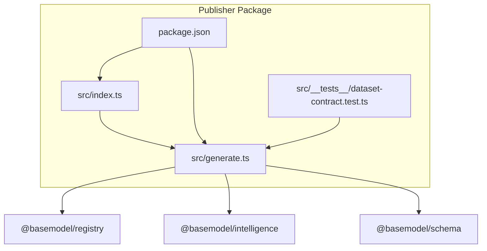
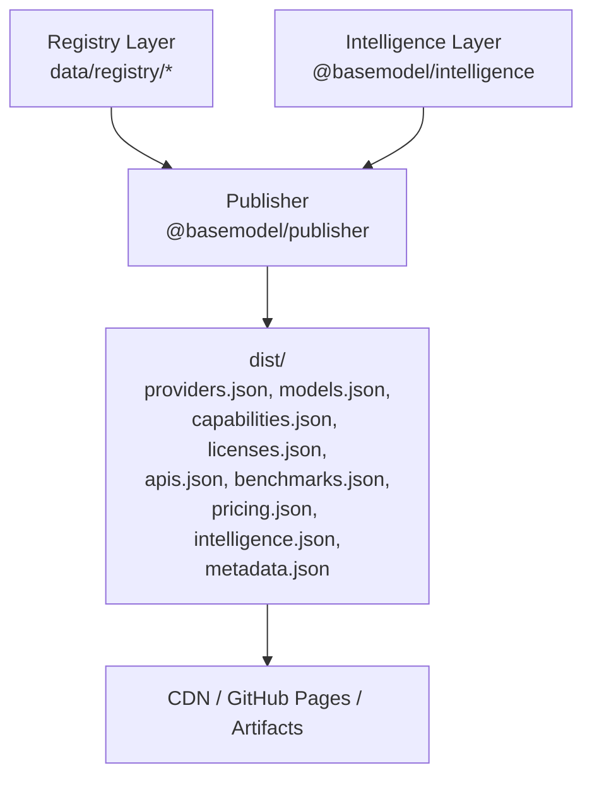
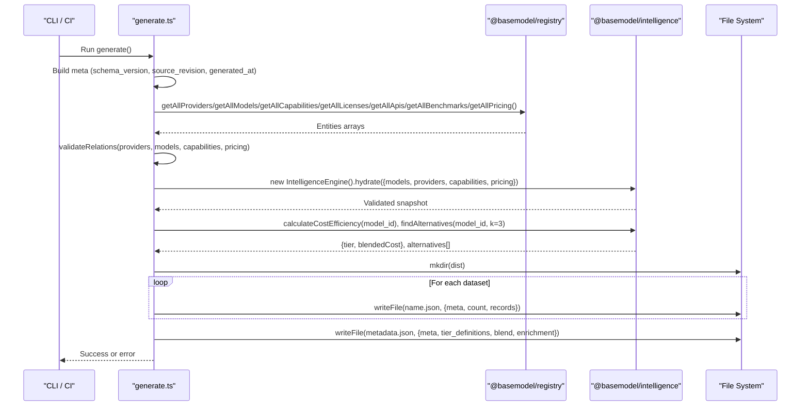
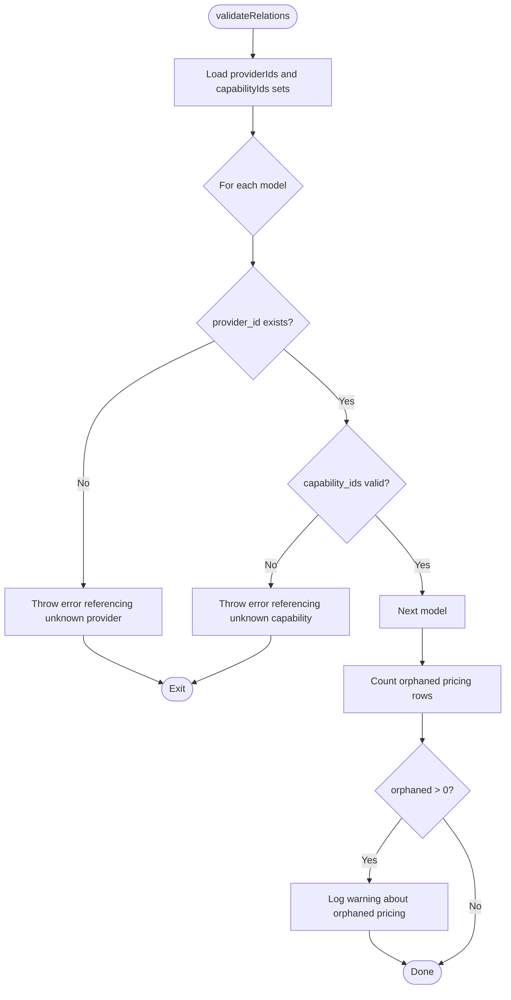
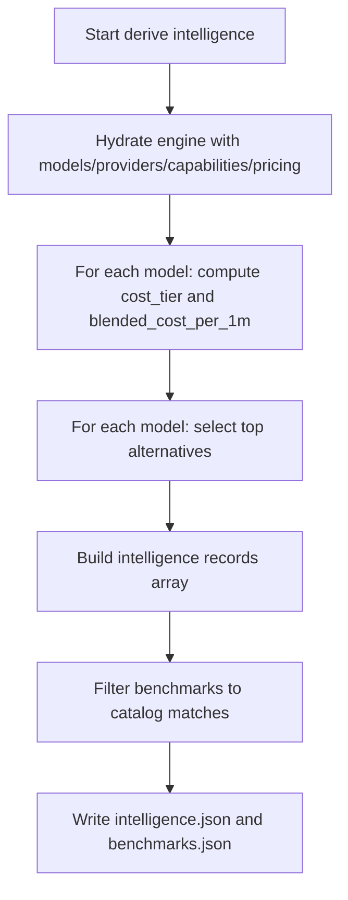
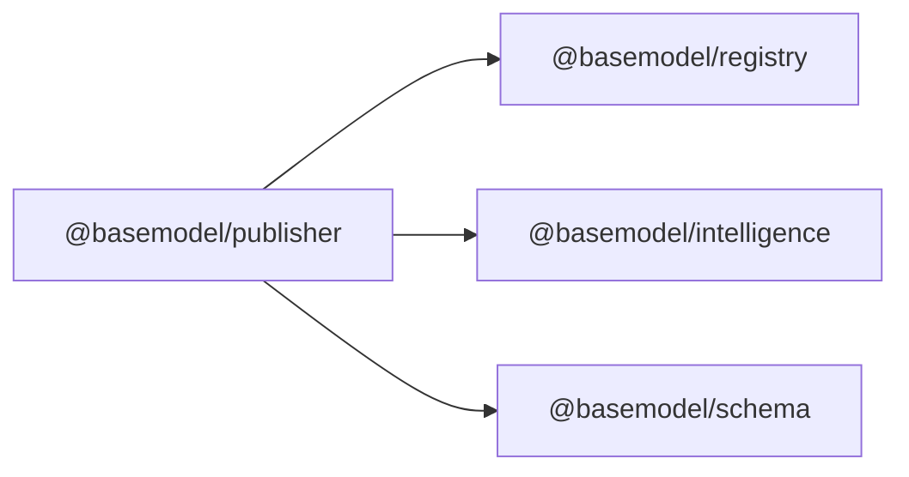

# Publisher Package

<cite>
**Referenced Files in This Document**
- [README.md](file://README.md)
- [03_Architecture.md](file://docs/03_Architecture.md)
- [04_Pipeline.md](file://docs/04_Pipeline.md)
- [package.json](file://packages/publisher/package.json)
- [index.ts](file://packages/publisher/src/index.ts)
- [generate.ts](file://packages/publisher/src/generate.ts)
- [dataset-contract.test.ts](file://packages/publisher/src/__tests__/dataset-contract.test.ts)
</cite>

## Table of Contents
1. Introduction
2. Project Structure
3. Core Components
4. Architecture Overview
5. Detailed Component Analysis
6. Dependency Analysis
7. Performance Considerations
8. Troubleshooting Guide
9. Conclusion
10. Appendices

## Introduction
The Publisher package is the publishing layer that transforms canonical registry data and derived intelligence into public, versioned datasets written to dist/. It reads providers, models, capabilities, licenses, APIs, benchmarks, and pricing from the registry, validates cross-entity relations, derives cost efficiency and alternatives, filters benchmark rows for catalog alignment, and emits stable JSON datasets with consistent run metadata. Publication then distributes these static files through GitHub Pages or other mirrors.

Key responsibilities:
- Generate deterministic, schema-versioned datasets
- Validate relational integrity before writing outputs
- Derive intelligence (cost tiers, blended costs, alternatives)
- Produce a rich metadata file describing generation context and enrichment provenance
- Provide an executable entry point for automated build pipelines

**Section sources**
- [README.md:16-30](file://README.md#L16-L30)
- [03_Architecture.md:31-44](file://docs/03_Architecture.md#L31-L44)
- [04_Pipeline.md:64-84](file://docs/04_Pipeline.md#L64-L84)

## Project Structure
The publisher package is a small, focused module with a single executable generator and a minimal index export. The workspace uses pnpm workspaces; the package depends on schema, registry, and intelligence packages.

**Diagram sources**
- [package.json:1-38](file://packages/publisher/package.json#L1-L38)
- [index.ts:1-11](file://packages/publisher/src/index.ts#L1-L11)
- [generate.ts:1-20](file://packages/publisher/src/generate.ts#L1-L20)

**Section sources**
- [package.json:1-38](file://packages/publisher/package.json#L1-L38)
- [index.ts:1-11](file://packages/publisher/src/index.ts#L1-L11)

## Core Components
- Generator entrypoint: An executable script that orchestrates reading registry data, validating relations, deriving intelligence, filtering benchmarks, and writing datasets to dist/.
- Registry reader: Reads all canonical entities from data/registry/.
- Intelligence engine: Computes cost efficiency, tier classification, and alternative model suggestions.
- Metadata assembler: Collects schema version, source revision, timestamps, tier definitions, blending formula, and enrichment provenance.

Outputs include:
- providers.json, models.json, capabilities.json, licenses.json, apis.json, benchmarks.json, pricing.json, intelligence.json, metadata.json

Each dataset includes schema_version, source_revision, generated_at, and count fields.

**Section sources**
- [generate.ts:108-176](file://packages/publisher/src/generate.ts#L108-L176)
- [generate.ts:177-276](file://packages/publisher/src/generate.ts#L177-L276)
- [04_Pipeline.md:64-84](file://docs/04_Pipeline.md#L64-L84)

## Architecture Overview
The Publisher sits at the Publishing Layer of BaseModel’s architecture. It consumes registry and intelligence outputs and produces static datasets consumed by downstream systems (e.g., websites, CDNs, API endpoints).

**Diagram sources**
- [03_Architecture.md:31-44](file://docs/03_Architecture.md#L31-L44)
- [04_Pipeline.md:64-84](file://docs/04_Pipeline.md#L64-L84)

## Detailed Component Analysis

### Dataset Generation Pipeline
The generator performs a deterministic pipeline:
- Compute run metadata (schema version, source revision, timestamp)
- Read all registry entities
- Validate cross-entity relations (provider and capability references)
- Hydrate and validate snapshots via the intelligence engine
- Derive per-model intelligence (cost tier, blended cost, top alternatives)
- Filter benchmarks to catalog-matched rows
- Write each dataset with consistent metadata and counts
- Assemble metadata.json with enrichment provenance and tier definitions

**Diagram sources**
- [generate.ts:108-176](file://packages/publisher/src/generate.ts#L108-L176)
- [generate.ts:177-276](file://packages/publisher/src/generate.ts#L177-L276)

**Section sources**
- [generate.ts:108-176](file://packages/publisher/src/generate.ts#L108-L176)
- [generate.ts:177-276](file://packages/publisher/src/generate.ts#L177-L276)

### Relation Validation Logic
Before any output is written, the generator ensures referential integrity:
- Every model must reference a known provider_id
- Each model capability_ids must exist in capabilities
- Pricing may reference external models (aggregate catalogs); mismatches are warned but not fatal

**Diagram sources**
- [generate.ts:77-106](file://packages/publisher/src/generate.ts#L77-L106)

**Section sources**
- [generate.ts:77-106](file://packages/publisher/src/generate.ts#L77-L106)

### Intelligence Derivation and Benchmark Filtering
- Cost efficiency and tier classification are computed per model using the intelligence engine and blending constants.
- Alternatives are selected up to a fixed limit.
- Benchmarks are filtered to only those matching catalog model IDs or their last path segment, keeping the published dataset lean while preserving full data in the registry.

**Diagram sources**
- [generate.ts:140-176](file://packages/publisher/src/generate.ts#L140-L176)

**Section sources**
- [generate.ts:140-176](file://packages/publisher/src/generate.ts#L140-L176)

### Output Contract and Tests
Published datasets adhere to a strict contract:
- Consistent run metadata across all files
- Count fields match actual record array lengths
- All models pass the canonical ModelSchema validation

Tests enforce these constraints to prevent drift.

**Section sources**
- [dataset-contract.test.ts:82-106](file://packages/publisher/src/__tests__/dataset-contract.test.ts#L82-L106)

### Entry Point and Executable Behavior
- The package exposes a minimal index export for library usage.
- The generator can be executed directly via tsx, enabling “pnpm generate” to produce datasets without importing code.

**Section sources**
- [index.ts:1-11](file://packages/publisher/src/index.ts#L1-L11)
- [generate.ts:278-284](file://packages/publisher/src/generate.ts#L278-L284)

## Dependency Analysis
The publisher composes three core dependencies:
- @basemodel/registry: read accessors for all canonical entities
- @basemodel/intelligence: cost efficiency, alternatives, and snapshot hydration/validation
- @basemodel/schema: type definitions and blending constants

**Diagram sources**
- [package.json:23-27](file://packages/publisher/package.json#L23-L27)
- [generate.ts:6-22](file://packages/publisher/src/generate.ts#L6-L22)

**Section sources**
- [package.json:23-27](file://packages/publisher/package.json#L23-L27)
- [generate.ts:6-22](file://packages/publisher/src/generate.ts#L6-L22)

## Performance Considerations
- Single-pass reads: All registry entities are loaded once to minimize I/O overhead.
- Early validation: Relations are validated before any writes to avoid partial outputs.
- Lightweight benchmark filtering: Only catalog-matched rows are emitted to reduce payload size.
- Deterministic metadata: Schema version and source revision ensure cache-friendly, reproducible outputs.

[No sources needed since this section provides general guidance]

## Troubleshooting Guide
Common issues and resolutions:
- Unknown provider or capability references: Ensure all model entries reference existing provider_id and capability_ids.
- Orphaned pricing records: These are expected when aggregate catalogs include models outside the catalog; warnings are logged but do not fail the run.
- Missing schema version: The generator attempts to read the schema package version; if unavailable, it falls back to a default value.
- Enrichment failures: If all primary pricing sources fail, the run is marked fatal; check enrichment logs and network access.

Operational tips:
- Use “pnpm generate” to regenerate datasets locally.
- Inspect metadata.json for enrichment status, errors, and provenance.
- Verify dataset contracts via tests to catch inconsistencies early.

**Section sources**
- [generate.ts:77-106](file://packages/publisher/src/generate.ts#L77-L106)
- [generate.ts:62-71](file://packages/publisher/src/generate.ts#L62-L71)
- [04_Pipeline.md:205-216](file://docs/04_Pipeline.md#L205-L216)

## Conclusion
The Publisher package provides a robust, deterministic pipeline for generating public datasets from canonical registry data and derived intelligence. It enforces relational integrity, enriches outputs with cost and alternative insights, and produces stable, versioned artifacts suitable for distribution via CDNs, GitHub Pages, or API endpoints. Its design emphasizes correctness, reproducibility, and simplicity, making it well-suited for automated build and publication workflows.

[No sources needed since this section summarizes without analyzing specific files]

## Appendices

### Build and Automation Integration
- Workspace commands: install, lint, typecheck, test, build, generate
- Package scripts: build (tsup), generate (tsx), test (vitest)
- CI automation: nightly collection/regeneration and publish-on-push flows

**Section sources**
- [README.md:42-56](file://README.md#L42-L56)
- [package.json:15-21](file://packages/publisher/package.json#L15-L21)
- [04_Pipeline.md:225-232](file://docs/04_Pipeline.md#L225-L232)

### Distribution Mechanisms
- Static JSON datasets are written to dist/
- Publication targets include GitHub Pages, repository artifacts, and mirrors consuming generated files

**Section sources**
- [README.md:19-30](file://README.md#L19-L30)
- [04_Pipeline.md:82-84](file://docs/04_Pipeline.md#L82-L84)