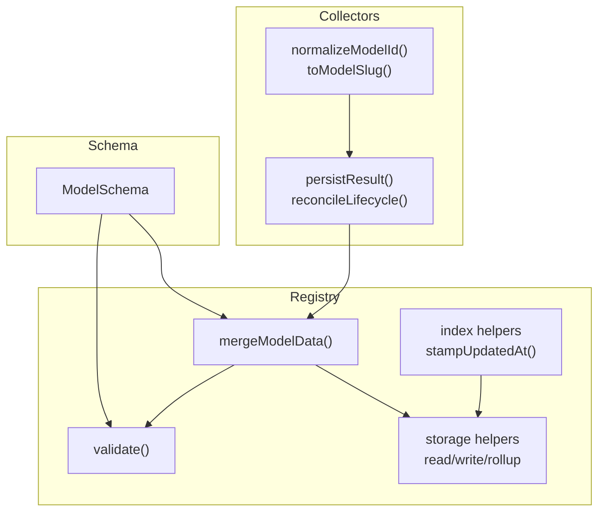
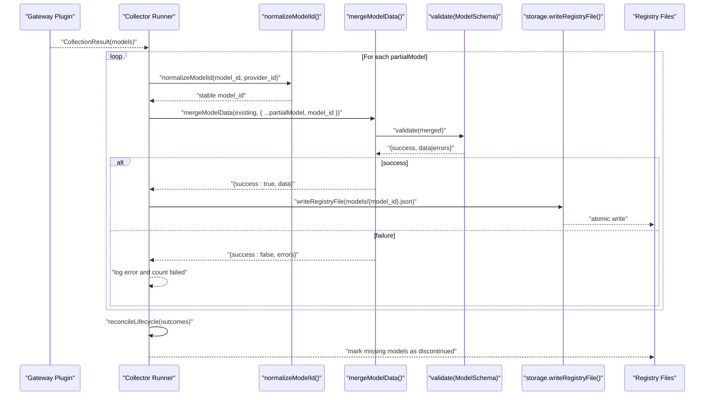
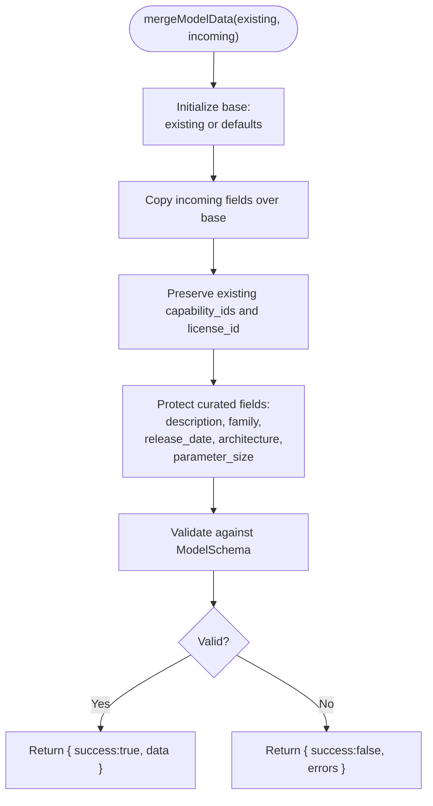
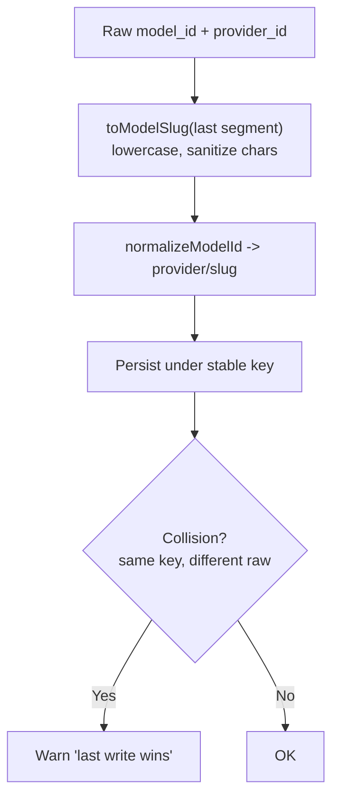
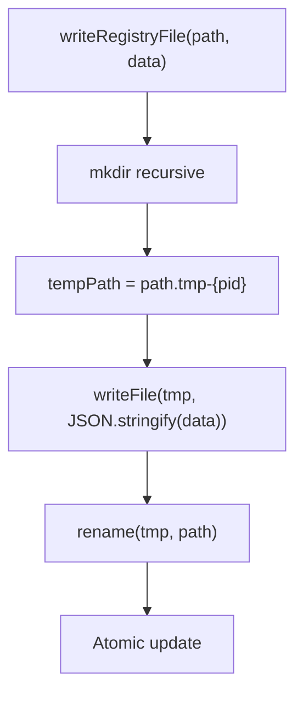
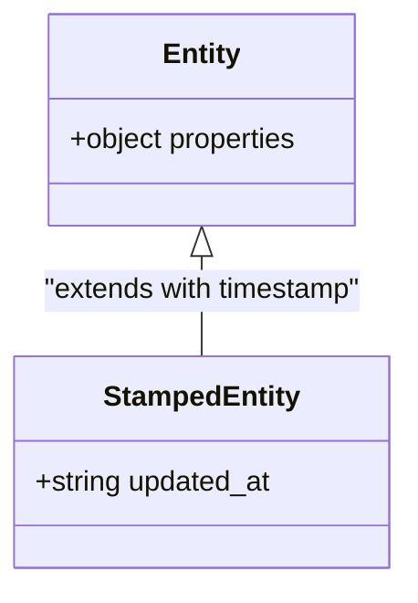
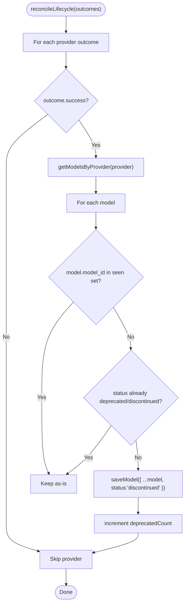
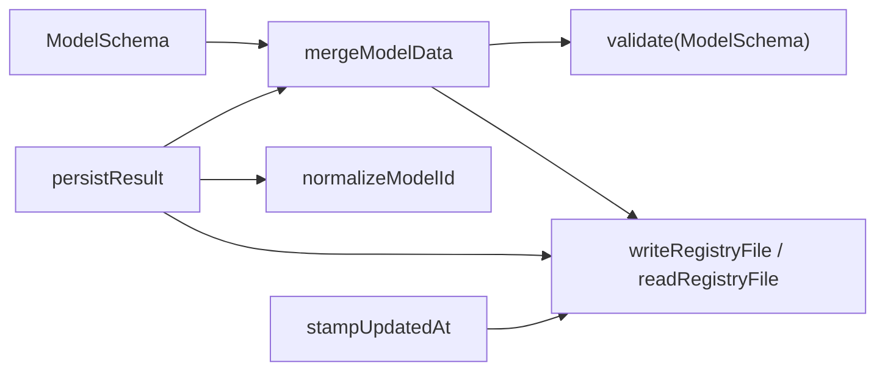

# Data Merger

<cite>
**Referenced Files in This Document**
- [merge.ts](file://packages/registry/src/merge.ts)
- [validation.ts](file://packages/registry/src/validation.ts)
- [storage.ts](file://packages/registry/src/storage.ts)
- [index.ts](file://packages/registry/src/index.ts)
- [runner.ts](file://packages/collectors/src/core/runner.ts)
- [slug.ts](file://packages/collectors/src/core/slug.ts)
- [model.ts](file://packages/schema/src/model.ts)
- [merge.test.ts](file://packages/registry/src/__tests__/merge.test.ts)
</cite>

## Table of Contents
1. Introduction
2. Project Structure
3. Core Components
4. Architecture Overview
5. Detailed Component Analysis
6. Dependency Analysis
7. Performance Considerations
8. Troubleshooting Guide
9. Conclusion

## Introduction
This document explains the data merger system that combines multiple provider data sources into a consistent, curated registry. It covers how incoming collector data is merged with existing records, field-level merge rules, conflict resolution strategies, priority handling, and version management via timestamps. It also provides examples of custom merge strategies, patterns for resolving conflicts, and performance techniques for large datasets.

## Project Structure
The merger spans three packages:
- Schema: defines the canonical Model entity and constraints used by all components.
- Registry: implements merging, validation, storage, and utilities like stamping updated_at.
- Collectors: normalizes upstream model IDs and orchestrates collection, persistence, and lifecycle reconciliation.

**Diagram sources**
- [model.ts:11-62](file://packages/schema/src/model.ts#L11-L62)
- [validation.ts:11-20](file://packages/registry/src/validation.ts#L11-L20)
- [storage.ts:48-65](file://packages/registry/src/storage.ts#L48-L65)
- [index.ts:39-41](file://packages/registry/src/index.ts#L39-L41)
- [merge.ts:22-68](file://packages/registry/src/merge.ts#L22-L68)
- [slug.ts:16-34](file://packages/collectors/src/core/slug.ts#L16-L34)
- [runner.ts:365-397](file://packages/collectors/src/core/runner.ts#L365-L397)

**Section sources**
- [model.ts:11-62](file://packages/schema/src/model.ts#L11-L62)
- [merge.ts:22-68](file://packages/registry/src/merge.ts#L22-L68)
- [validation.ts:11-20](file://packages/registry/src/validation.ts#L11-L20)
- [storage.ts:48-65](file://packages/registry/src/storage.ts#L48-L65)
- [index.ts:39-41](file://packages/registry/src/index.ts#L39-L41)
- [slug.ts:16-34](file://packages/collectors/src/core/slug.ts#L16-L34)
- [runner.ts:365-397](file://packages/collectors/src/core/runner.ts#L365-L397)

## Core Components
- mergeModelData: merges normalized collector data with existing curated records, enforcing curated-field protection and preserving relationships.
- validate: Zod-based validation wrapper returning structured success/errors.
- storage: atomic file writes, directory scanning, rollup writing for benchmarks, and timestamp stamping helper.
- slug normalization: ensures stable, schema-compliant model_id keys across providers.
- runner orchestration: persists results, tracks collisions, reconciles discontinued models, and logs metrics.

Key behaviors:
- Curated fields (description, family, release_date, architecture, parameter_size) are never overwritten by collectors.
- capability_ids and license_id are preserved from existing records.
- Defaults are applied when no existing record exists.
- Validation enforces schema constraints; invalid merges return errors without persisting.

**Section sources**
- [merge.ts:11-17](file://packages/registry/src/merge.ts#L11-L17)
- [merge.ts:22-68](file://packages/registry/src/merge.ts#L22-L68)
- [validation.ts:11-20](file://packages/registry/src/validation.ts#L11-L20)
- [storage.ts:48-65](file://packages/registry/src/storage.ts#L48-L65)
- [index.ts:39-41](file://packages/registry/src/index.ts#L39-L41)
- [slug.ts:16-34](file://packages/collectors/src/core/slug.ts#L16-L34)
- [runner.ts:365-397](file://packages/collectors/src/core/runner.ts#L365-L397)

## Architecture Overview
The data flow starts with collectors normalizing upstream IDs, then merging with existing records, validating, and atomically persisting to the registry. A lifecycle reconciliation step marks models as discontinued when they disappear from a provider’s catalog.

**Diagram sources**
- [runner.ts:365-397](file://packages/collectors/src/core/runner.ts#L365-L397)
- [slug.ts:16-34](file://packages/collectors/src/core/slug.ts#L16-L34)
- [merge.ts:22-68](file://packages/registry/src/merge.ts#L22-L68)
- [validation.ts:11-20](file://packages/registry/src/validation.ts#L11-L20)
- [storage.ts:59-65](file://packages/registry/src/storage.ts#L59-L65)

## Detailed Component Analysis

### Merge Strategy and Field-Level Rules
- Base defaults: When existing is null, defaults are applied for boolean flags, modality array, and status.
- Incoming overwrite: Fields present in incoming override base values unless protected.
- Protected curated fields: description, family, release_date, architecture, parameter_size are never overwritten by incoming data if present in existing.
- Relationship preservation: capability_ids and license_id are preserved from existing even if not present in incoming.
- Validation: final merged object must pass ModelSchema; otherwise, errors are returned.

**Diagram sources**
- [merge.ts:22-68](file://packages/registry/src/merge.ts#L22-L68)
- [model.ts:11-62](file://packages/schema/src/model.ts#L11-L62)

**Section sources**
- [merge.ts:11-17](file://packages/registry/src/merge.ts#L11-L17)
- [merge.ts:22-68](file://packages/registry/src/merge.ts#L22-L68)
- [model.ts:11-62](file://packages/schema/src/model.ts#L11-L62)

### ID Normalization and Collision Handling
- normalizeModelId reduces any upstream id to a stable {provider}/{slug} format using toModelSlug, ensuring schema compliance.
- During persistence, collisions where different raw ids map to the same model_id are detected and warned; last write wins.

**Diagram sources**
- [slug.ts:16-34](file://packages/collectors/src/core/slug.ts#L16-L34)
- [runner.ts:375-384](file://packages/collectors/src/core/runner.ts#L375-L384)

**Section sources**
- [slug.ts:16-34](file://packages/collectors/src/core/slug.ts#L16-L34)
- [runner.ts:375-384](file://packages/collectors/src/core/runner.ts#L375-L384)

### Persistence and Atomic Writes
- writeRegistryFile writes to a temporary file and renames it atomically on the same filesystem.
- Benchmarks use a rollup strategy grouping by source to avoid thousands of tiny files while keeping provenance.

**Diagram sources**
- [storage.ts:59-65](file://packages/registry/src/storage.ts#L59-L65)
- [storage.ts:138-163](file://packages/registry/src/storage.ts#L138-L163)

**Section sources**
- [storage.ts:59-65](file://packages/registry/src/storage.ts#L59-L65)
- [storage.ts:138-163](file://packages/registry/src/storage.ts#L138-L163)

### Version Management and Freshness
- stampUpdatedAt adds an ISO 8601 updated_at timestamp to entities at save time.
- Consumers can detect stale entries by checking presence or value of updated_at.

**Diagram sources**
- [index.ts:39-41](file://packages/registry/src/index.ts#L39-L41)

**Section sources**
- [index.ts:39-41](file://packages/registry/src/index.ts#L39-L41)

### Lifecycle Reconciliation
- After successful collections per provider, models absent from the provider’s current catalog are marked discontinued, preventing accidental deprecation on failures.

**Diagram sources**
- [runner.ts:410-426](file://packages/collectors/src/core/runner.ts#L410-L426)

**Section sources**
- [runner.ts:410-426](file://packages/collectors/src/core/runner.ts#L410-L426)

### Custom Merge Strategies and Conflict Resolution Patterns
- Curated vs machine fields: Use curated field protection to keep human-edited metadata safe from automated refreshes.
- Relationship preservation: Always preserve capability_ids and license_id from existing to avoid losing curated relationships.
- Priority handling: Explicitly define which fields come from collectors versus curators; apply defaults only when no prior record exists.
- Example pattern: If you need to merge arrays (e.g., capability_ids), implement a union strategy that preserves both sets and deduplicates before validation.

[No sources needed since this section provides general guidance]

## Dependency Analysis
The merger depends on schema definitions for validation, storage for persistence, and slug normalization for stable keys. The runner orchestrates these pieces and handles lifecycle concerns.

**Diagram sources**
- [model.ts:11-62](file://packages/schema/src/model.ts#L11-L62)
- [merge.ts:22-68](file://packages/registry/src/merge.ts#L22-L68)
- [validation.ts:11-20](file://packages/registry/src/validation.ts#L11-L20)
- [storage.ts:48-65](file://packages/registry/src/storage.ts#L48-L65)
- [slug.ts:16-34](file://packages/collectors/src/core/slug.ts#L16-L34)
- [runner.ts:365-397](file://packages/collectors/src/core/runner.ts#L365-L397)
- [index.ts:39-41](file://packages/registry/src/index.ts#L39-L41)

**Section sources**
- [model.ts:11-62](file://packages/schema/src/model.ts#L11-L62)
- [merge.ts:22-68](file://packages/registry/src/merge.ts#L22-L68)
- [validation.ts:11-20](file://packages/registry/src/validation.ts#L11-L20)
- [storage.ts:48-65](file://packages/registry/src/storage.ts#L48-L65)
- [slug.ts:16-34](file://packages/collectors/src/core/slug.ts#L16-L34)
- [runner.ts:365-397](file://packages/collectors/src/core/runner.ts#L365-L397)
- [index.ts:39-41](file://packages/registry/src/index.ts#L39-L41)

## Performance Considerations
- Atomic writes: Using temp files and rename avoids partial writes and corruption during high-throughput updates.
- Rollups for large datasets: Grouping benchmarks by source reduces file overhead and improves I/O efficiency.
- Batch operations: Reading directories and processing records in loops minimizes repeated filesystem calls.
- Early exits: Skipping invalid or incomplete records prevents unnecessary work and logging noise.
- Idempotent normalization: Stable model_id keys ensure predictable merges and reduce collision risks.

[No sources needed since this section provides general guidance]

## Troubleshooting Guide
Common issues and resolutions:
- Validation failures: Inspect returned errors from mergeModelData; ensure required fields like model_id are present and conform to schema constraints.
- Curated field overrides: Verify that curated fields are not being unintentionally overwritten; they are protected by design.
- Missing relationships: Ensure capability_ids and license_id are preserved from existing records; do not rely on incoming to supply them.
- Stale data: Check updated_at timestamps to identify records that have not been refreshed recently.
- Collisions: Watch for warnings about different raw ids mapping to the same model_id; confirm expected behavior (“last write wins”).

**Section sources**
- [merge.ts:22-68](file://packages/registry/src/merge.ts#L22-L68)
- [validation.ts:11-20](file://packages/registry/src/validation.ts#L11-L20)
- [runner.ts:375-384](file://packages/collectors/src/core/runner.ts#L375-L384)
- [index.ts:39-41](file://packages/registry/src/index.ts#L39-L41)

## Conclusion
The data merger system provides robust, schema-driven merging with clear priorities between curated and machine-generated fields. It ensures data integrity through validation, atomic persistence, and lifecycle reconciliation. By following the documented merge strategies and leveraging normalization and rollups, teams can maintain high-quality, consistent registry data at scale.