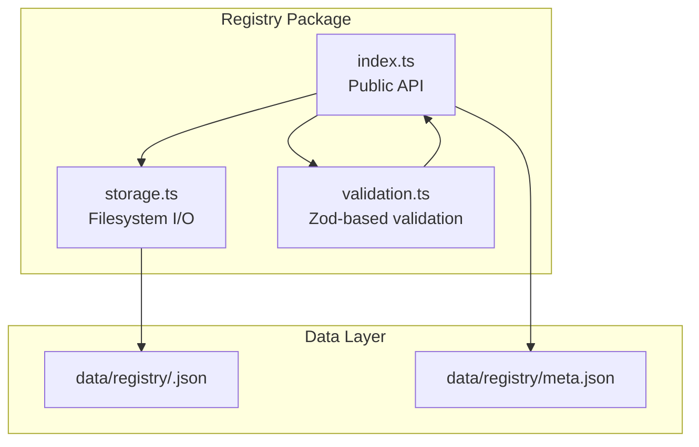
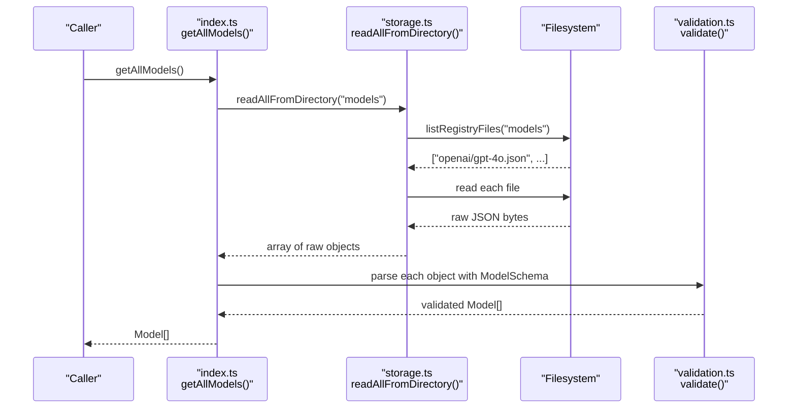
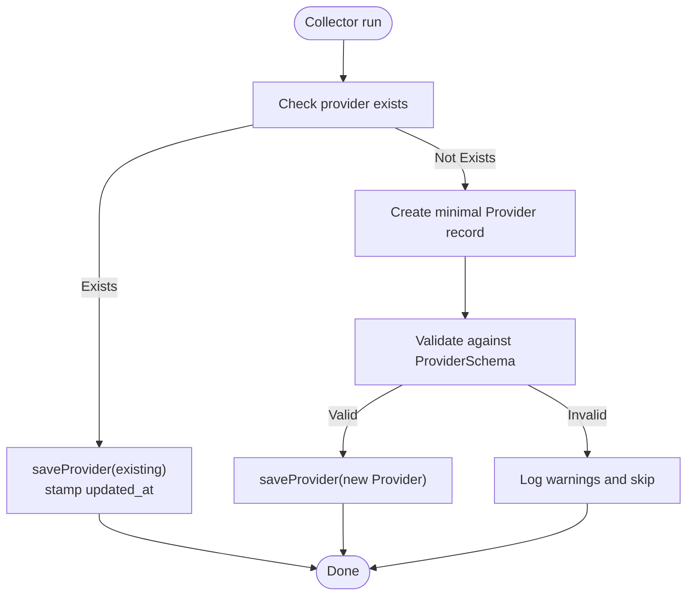
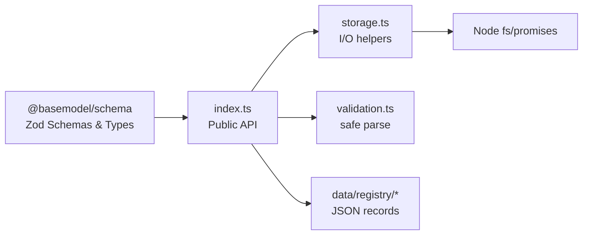

# Registry API

<cite>
**Referenced Files in This Document**
- [README.md](file://README.md)
- [meta.json](file://data/registry/meta.json)
- [index.ts](file://packages/registry/src/index.ts)
- [storage.ts](file://packages/registry/src/storage.ts)
- [validation.ts](file://packages/registry/src/validation.ts)
- [runner.ts](file://packages/collectors/src/core/runner.ts)
</cite>

## Table of Contents
1. [Introduction](#introduction)
2. [Project Structure](#project-structure)
3. [Core Components](#core-components)
4. [Architecture Overview](#architecture-overview)
5. [Detailed Component Analysis](#detailed-component-analysis)
6. [Dependency Analysis](#dependency-analysis)
7. [Performance Considerations](#performance-considerations)
8. [Troubleshooting Guide](#troubleshooting-guide)
9. [Conclusion](#conclusion)
10. [Appendices](#appendices)

## Introduction
This document describes the Registry API exposed by the registry package. It covers how to interact with the registry programmatically, perform CRUD operations on model records and related entities (providers, capabilities, benchmarks, pricing, APIs, licenses), and integrate with other packages such as collectors. It also explains data persistence patterns, error handling, asynchronous operations, versioning considerations, and best practices for consuming the registry.

The registry stores canonical JSON records under data/registry and exposes a stable TypeScript API that validates and persists these records. Consumers can read all records or fetch individual ones by ID, and writers can save or replace sets of records atomically where supported.

**Section sources**
- [README.md:10-30](file://README.md#L10-L30)

## Project Structure
At a high level:
- The registry package provides the public API surface for reading and writing registry records.
- Storage utilities handle file discovery, atomic writes, directory clearing, and rollup writes for large datasets like benchmarks.
- Validation utilities wrap Zod schemas to provide safe parsing without throwing exceptions.
- Data lives under data/registry with subdirectories per entity type (e.g., models, providers, capabilities, pricing, apis, licenses, benchmarks).
- Generated metadata is captured in data/registry/meta.json.

**Diagram sources**
- [index.ts:1-169](file://packages/registry/src/index.ts#L1-L169)
- [storage.ts:1-164](file://packages/registry/src/storage.ts#L1-L164)
- [validation.ts:1-43](file://packages/registry/src/validation.ts#L1-L43)
- [meta.json:1-18](file://data/registry/meta.json#L1-L18)

**Section sources**
- [README.md:10-30](file://README.md#L10-L30)
- [meta.json:1-18](file://data/registry/meta.json#L1-L18)

## Core Components
The registry API is organized around entity types. Each entity supports:
- Read-all operations returning arrays of validated records
- Optional get-by-id operations returning a single record or null
- Save operations that persist a single record with an updated_at stamp
- Bulk or replacement operations for specific entities (e.g., benchmarks, pricing)

Key public functions include:
- Providers: getAllProviders, getProvider, saveProvider
- Models: getAllModels, getModel, getModelsByProvider, saveModel
- Capabilities: getAllCapabilities
- Benchmarks: getAllBenchmarks, getBenchmark, saveBenchmark, clearBenchmarksRegistry, replaceAllBenchmarks
- Pricing: getAllPricing, savePricingRecords, clearPricingRegistry
- APIs: getAllApis
- Licenses: getAllLicenses, getLicense
- Utilities: stampUpdatedAt

All reads validate against Zod schemas from @basemodel/schema before returning data. Writes ensure atomicity via temporary files and rename.

**Section sources**
- [index.ts:43-168](file://packages/registry/src/index.ts#L43-L168)
- [storage.ts:48-163](file://packages/registry/src/storage.ts#L48-L163)
- [validation.ts:11-42](file://packages/registry/src/validation.ts#L11-L42)

## Architecture Overview
The registry API follows a layered design:
- Public API layer (index.ts) orchestrates entity-specific operations, applies validation, and stamps timestamps.
- Storage layer (storage.ts) resolves the registry root path, enumerates JSON files, performs atomic writes, and manages rollups.
- Validation layer (validation.ts) wraps Zod schemas to return structured results without throwing.

**Diagram sources**
- [index.ts:63-66](file://packages/registry/src/index.ts#L63-L66)
- [storage.ts:93-101](file://packages/registry/src/storage.ts#L93-L101)
- [validation.ts:11-20](file://packages/registry/src/validation.ts#L11-L20)

## Detailed Component Analysis

### Provider Operations
- getAllProviders(): Returns all provider records after schema validation.
- getProvider(providerId): Reads a single provider file by id; returns null if missing or invalid.
- saveProvider(provider): Persists a provider record with an updated_at timestamp.

Usage pattern:
- Use getAllProviders when building indexes or dashboards.
- Use getProvider for targeted lookups by provider_id.
- Use saveProvider during collection or updates to refresh provider metadata.

**Section sources**
- [index.ts:45-59](file://packages/registry/src/index.ts#L45-L59)

### Model Operations
- getAllModels(): Returns all model records after schema validation.
- getModel(modelId): Reads a single model file using the model_id path convention (e.g., openai/gpt-4o.json).
- getModelsByProvider(providerId): Filters all models by provider_id.
- saveModel(model): Persists a model record with an updated_at timestamp.

Notes:
- model_id maps directly to a nested file path under models/.
- Filtering by provider is performed in-memory after loading all models.

**Section sources**
- [index.ts:63-83](file://packages/registry/src/index.ts#L63-L83)

### Capability Operations
- getAllCapabilities(): Returns all capability definitions after schema validation.

Use cases:
- Discover available capabilities across the registry.
- Build feature flags or UI toggles based on capability presence.

**Section sources**
- [index.ts:87-90](file://packages/registry/src/index.ts#L87-L90)

### Benchmark Operations
- getAllBenchmarks(): Returns benchmark records aggregated from per-source rollup arrays.
- getBenchmark(benchmarkId): Reads a single benchmark file by id.
- saveBenchmark(benchmark): Persists a single benchmark record.
- clearBenchmarksRegistry(): Clears the benchmarks directory for full rewrite.
- replaceAllBenchmarks(benchmarks): Merges new benchmarks with existing ones by source, preserving untouched sources.

Design notes:
- Benchmarks are stored as per-source arrays to avoid thousands of tiny files.
- replaceAllBenchmarks ensures partial failures do not erase previous data for unaffected sources.

**Section sources**
- [index.ts:94-122](file://packages/registry/src/index.ts#L94-L122)
- [storage.ts:138-163](file://packages/registry/src/storage.ts#L138-L163)

### Pricing Operations
- getAllPricing(): Aggregates pricing arrays from per-provider files.
- savePricingRecords(providerId, records): Persists an array of pricing records for a provider, overwriting existing entries.
- clearPricingRegistry(): Clears all pricing files for atomic rewrites.

Best practice:
- Always pass complete arrays for a provider to avoid partial state.

**Section sources**
- [index.ts:126-147](file://packages/registry/src/index.ts#L126-L147)

### API and License Operations
- getAllApis(): Returns all API definitions after schema validation.
- getAllLicenses(): Returns all license definitions after schema validation.
- getLicense(licenseId): Reads a single license by id; returns null if missing or invalid.

**Section sources**
- [index.ts:151-168](file://packages/registry/src/index.ts#L151-L168)

### Storage and Atomicity
- readRegistryFile(relativePath): Reads a JSON file safely; returns null if absent.
- writeRegistryFile(relativePath, data): Atomically writes JSON via temp file + rename.
- listRegistryFiles(subDir): Recursively lists .json files under a subdirectory.
- readAllFromDirectory(subDir): Loads all single-object JSON files into an array.
- readAllArraysFromDirectory(subDir): Loads all array-type JSON files and flattens them.
- clearRegistryDirectory(subDir): Removes a directory recursively.
- deleteRegistryFile(relativePath): Deletes a single file silently if absent.
- writeBenchmarksRollup(benchmarks, existing): Groups by source, merges with existing, and writes per-source arrays.

Environment behavior:
- Registry root resolution prioritizes BASEMODEL_REGISTRY_PATH env var, then walks up to find data/registry, then falls back to cwd-relative path with a warning.

**Section sources**
- [storage.ts:16-41](file://packages/registry/src/storage.ts#L16-L41)
- [storage.ts:48-124](file://packages/registry/src/storage.ts#L48-L124)
- [storage.ts:138-163](file://packages/registry/src/storage.ts#L138-L163)

### Validation Utilities
- validate(schema, raw): Safe parse returning { success, data } or { success, errors }.
- validateMany(schema, records): Batch validation collecting valid and invalid rows with indices.

These utilities prevent exceptions during parsing and provide structured error details.

**Section sources**
- [validation.ts:11-42](file://packages/registry/src/validation.ts#L11-L42)

### Integration with Collectors
Collectors use the registry API to ensure provider records exist and are stamped with freshness. On first encounter, a minimal provider record is created and saved; on subsequent runs, it is refreshed to mark activity.

**Diagram sources**
- [runner.ts:337-363](file://packages/collectors/src/core/runner.ts#L337-L363)
- [index.ts:57-59](file://packages/registry/src/index.ts#L57-L59)

**Section sources**
- [runner.ts:337-363](file://packages/collectors/src/core/runner.ts#L337-L363)

## Dependency Analysis
The registry package depends on:
- @basemodel/schema for Zod schemas and TypeScript types
- Node.js filesystem APIs for I/O
- Environment variables for configuration

**Diagram sources**
- [index.ts:1-32](file://packages/registry/src/index.ts#L1-L32)
- [storage.ts:1-4](file://packages/registry/src/storage.ts#L1-L4)

**Section sources**
- [index.ts:1-32](file://packages/registry/src/index.ts#L1-L32)
- [storage.ts:1-4](file://packages/registry/src/storage.ts#L1-L4)

## Performance Considerations
- Reading all records: getAll* functions load entire directories into memory. For large datasets (e.g., benchmarks), prefer targeted queries or streaming approaches at the storage layer if needed.
- Benchmarks rollup: Grouping by source reduces file count and improves write performance while preserving unaffected sources.
- Atomic writes: Temporary files plus rename minimize corruption risk but add slight overhead; acceptable for batch jobs.
- Directory traversal: listRegistryFiles recurses through directories; deep hierarchies may increase latency.

[No sources needed since this section provides general guidance]

## Troubleshooting Guide
Common issues and resolutions:
- Missing registry path: If BASEMODEL_REGISTRY_PATH points to a non-existent directory, an error is thrown. Ensure the environment variable points to a valid directory.
- No data/registry found: The code warns and falls back to a cwd-relative path. Verify your working directory or set BASEMODEL_REGISTRY_PATH explicitly.
- Invalid records: Validation returns structured errors. Inspect the errors array to fix schema mismatches.
- Partial benchmark updates: replaceAllBenchmarks preserves untouched sources; if some sources are missing, check upstream collectors for failures.

Operational hints:
- Use clear*Registry functions before bulk replacements to ensure consistent snapshots.
- After saving records, consumers should rely on updated_at fields to detect staleness.

**Section sources**
- [storage.ts:16-41](file://packages/registry/src/storage.ts#L16-L41)
- [validation.ts:11-20](file://packages/registry/src/validation.ts#L11-L20)
- [meta.json:14-16](file://data/registry/meta.json#L14-L16)

## Conclusion
The Registry API offers a clean, validated, and atomic interface for managing AI model intelligence records. It emphasizes safety through schema validation, robustness via atomic writes, and scalability through rollup strategies for large datasets. Consumers should leverage read-all endpoints for indexing, targeted get-by-id calls for lookups, and save/replacement functions for updates, always respecting updated_at semantics and environment configuration.

[No sources needed since this section summarizes without analyzing specific files]

## Appendices

### Practical Usage Patterns
- Read all models and filter by provider:
  - Call getAllModels(), then filter client-side by provider_id.
- Update a provider record:
  - Retrieve with getProvider(providerId), mutate fields, call saveProvider(updated).
- Replace benchmarks safely:
  - Collect new benchmarks, call replaceAllBenchmarks(newBenchmarks) to merge with existing.
- Persist pricing for a provider:
  - Build an array of Pricing records and call savePricingRecords(providerId, records).

[No sources needed since this section provides general guidance]

### Error Handling Best Practices
- Always check ValidationResult.success before accessing data.
- Log and aggregate invalid records with their indices for batch processing.
- Handle null returns from get*ById methods gracefully.

**Section sources**
- [validation.ts:11-42](file://packages/registry/src/validation.ts#L11-L42)

### Versioning Notes
- Records include updated_at timestamps to indicate freshness.
- Consumers can compare timestamps across snapshots to detect stale data.
- There is no explicit API version field in the registry API; stability is maintained through consistent function signatures and schema-driven validation.

**Section sources**
- [index.ts:39-41](file://packages/registry/src/index.ts#L39-L41)