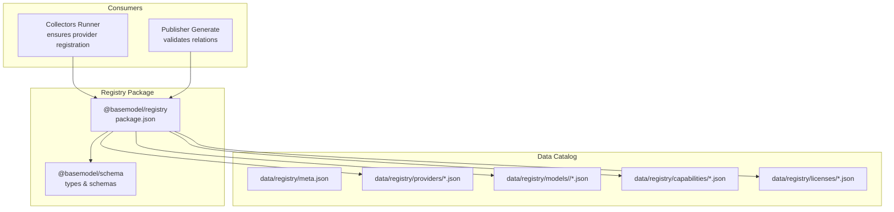
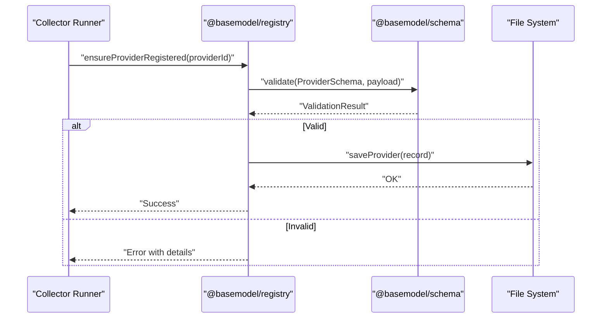
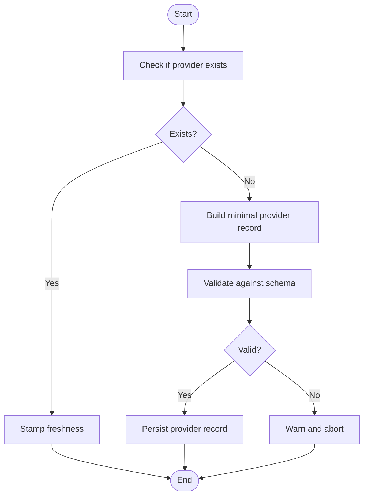
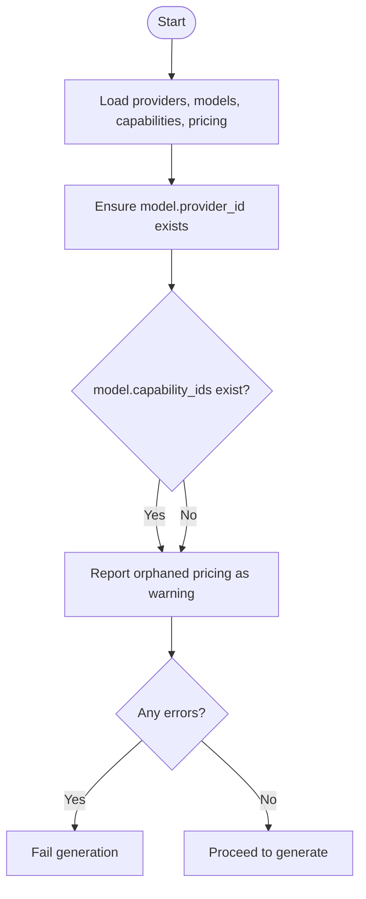
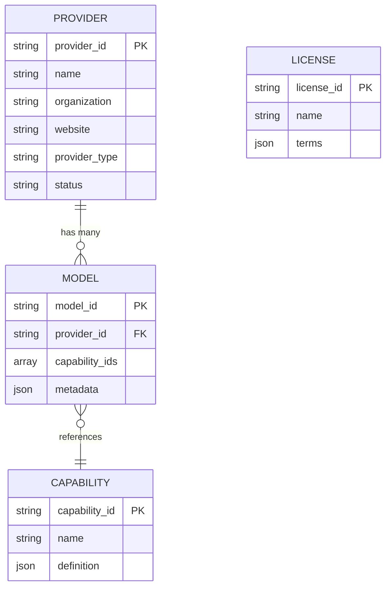
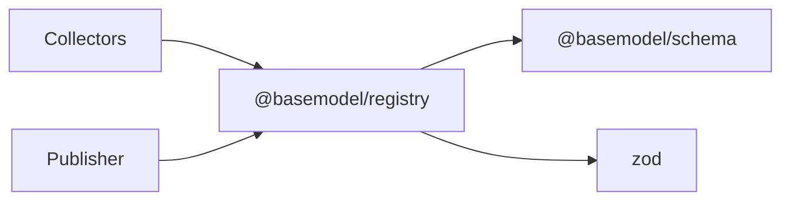

# Registry Package

<cite>
**Referenced Files in This Document**
- [package.json](file://packages/registry/package.json)
- [pnpm-lock.yaml](file://pnpm-lock.yaml)
- [runner.ts](file://packages/collectors/src/core/runner.ts)
- [generate.ts](file://packages/publisher/src/generate.ts)
- [meta.json](file://data/registry/meta.json)
- [anthropic.json](file://data/registry/providers/anthropic.json)
- [claude-3-5-haiku.json](file://data/registry/models/anthropic/claude-3-5-haiku.json)
- [embeddings.json](file://data/registry/capabilities/embeddings.json)
- [apache-2.0.json](file://data/registry/licenses/apache-2.0.json)
</cite>

## Table of Contents
1. [Introduction](#introduction)
2. [Project Structure](#project-structure)
3. [Core Components](#core-components)
4. [Architecture Overview](#architecture-overview)
5. [Detailed Component Analysis](#detailed-component-analysis)
6. [Dependency Analysis](#dependency-analysis)
7. [Performance Considerations](#performance-considerations)
8. [Troubleshooting Guide](#troubleshooting-guide)
9. [Conclusion](#conclusion)
10. [Appendices](#appendices)

## Introduction
The Registry package provides the canonical data layer for AI model records across providers, capabilities, pricing, and licenses. It normalizes provider-supplied information into a consistent schema, validates it against strict rules, and persists it to a file-based storage system. The registry is consumed by collectors (which enrich and register provider/model records) and publishers (which validate cross-entity relations and generate distribution artifacts).

Key responsibilities:
- Normalize heterogeneous provider data into canonical model/provider/capability/license entities
- Validate records against schemas using Zod
- Persist and retrieve records via a file-based storage backend
- Support merging strategies with conflict resolution when reconciling updates
- Provide integration hooks for collectors and intelligence modules

## Project Structure
At a high level, the registry lives under packages/registry and depends on @basemodel/schema for type definitions and validation. The persistent catalog resides under data/registry with organized directories for models, providers, capabilities, and licenses.

**Diagram sources**
- [package.json:1-35](file://packages/registry/package.json#L1-L35)
- [pnpm-lock.yaml:130-137](file://pnpm-lock.yaml#L130-L137)

**Section sources**
- [package.json:1-35](file://packages/registry/package.json#L1-L35)
- [pnpm-lock.yaml:130-137](file://pnpm-lock.yaml#L130-L137)

## Core Components
- Storage Backend: File-based persistence organized by entity type (providers, models, capabilities, licenses). Each record is a JSON file following the canonical schema.
- Validation Pipeline: Uses Zod schemas from @basemodel/schema to ensure correctness before persisting or publishing.
- Normalization Layer: Transforms provider-specific payloads into canonical structures (e.g., provider_id, model_id, capability_ids).
- Merge Strategy: Reconciles incoming records with existing ones, resolving conflicts deterministically (e.g., prefer newer timestamps, merge non-conflicting fields).
- Integration Points:
  - Collectors call registry APIs to ensure providers are registered and to save enriched model records.
  - Publisher validates cross-entity relations prior to generating outputs.

**Section sources**
- [runner.ts:337-363](file://packages/collectors/src/core/runner.ts#L337-L363)
- [generate.ts:77-106](file://packages/publisher/src/generate.ts#L77-L106)

## Architecture Overview
The registry orchestrates a pipeline from ingestion to persistence:

**Diagram sources**
- [runner.ts:337-363](file://packages/collectors/src/core/runner.ts#L337-L363)
- [package.json:22-25](file://packages/registry/package.json#L22-L25)

## Detailed Component Analysis

### Provider Registration Flow
Collectors ensure that every referenced provider exists in the registry. If missing, they create a minimal provider record, validate it, and persist it.

**Diagram sources**
- [runner.ts:337-363](file://packages/collectors/src/core/runner.ts#L337-L363)

**Section sources**
- [runner.ts:337-363](file://packages/collectors/src/core/runner.ts#L337-L363)

### Cross-Entity Relation Validation
Before any dataset files are written, the publisher validates that models reference valid providers and capabilities. Pricing may reference external models but is reported as warnings rather than failures.

**Diagram sources**
- [generate.ts:77-106](file://packages/publisher/src/generate.ts#L77-L106)

**Section sources**
- [generate.ts:77-106](file://packages/publisher/src/generate.ts#L77-L106)

### Data Model and Storage Layout
The registry organizes canonical records as JSON files:
- Providers: data/registry/providers/<provider>.json
- Models: data/registry/models/<provider>/<model>.json
- Capabilities: data/registry/capabilities/<capability>.json
- Licenses: data/registry/licenses/<license>.json
- Metadata: data/registry/meta.json

[No sources needed since this diagram shows conceptual data model]

**Section sources**
- [meta.json](file://data/registry/meta.json)
- [anthropic.json](file://data/registry/providers/anthropic.json)
- [claude-3-5-haiku.json](file://data/registry/models/anthropic/claude-3-5-haiku.json)
- [embeddings.json](file://data/registry/capabilities/embeddings.json)
- [apache-2.0.json](file://data/registry/licenses/apache-2.0.json)

### Merge Strategies and Conflict Resolution
When updating records, the registry should:
- Prefer newer timestamps for conflicting scalar fields
- Merge arrays by unioning IDs while preserving order where possible
- Preserve unknown fields marked as safe to retain
- Log conflicts and provide a diff summary for auditability

This ensures deterministic merges without losing critical context.

[No sources needed since this section provides general guidance]

### Custom Storage Implementations
To implement a custom storage backend:
- Define an interface for read/write operations per entity type
- Implement file I/O or remote storage adapters
- Ensure atomic writes and rollback on failure
- Maintain schema compliance through validation before persisting

Integration points:
- Replace file-based reads/writes with adapter calls
- Keep normalization and validation layers unchanged
- Expose consistent API for consumers (collectors, publisher)

[No sources needed since this section provides general guidance]

## Dependency Analysis
The registry package depends on @basemodel/schema for types and Zod for runtime validation. Consumers include collectors and publisher.

**Diagram sources**
- [package.json:22-25](file://packages/registry/package.json#L22-L25)
- [pnpm-lock.yaml:130-137](file://pnpm-lock.yaml#L130-L137)

**Section sources**
- [package.json:1-35](file://packages/registry/package.json#L1-L35)
- [pnpm-lock.yaml:130-137](file://pnpm-lock.yaml#L130-L137)

## Performance Considerations
- Batch writes: Group multiple record updates to reduce I/O overhead
- Lazy loading: Load only required entities during validation phases
- Indexing: Maintain lightweight indexes (e.g., provider_id to model list) for fast lookups
- Concurrency: Use file locks or transactional writes to prevent corruption
- Caching: Cache validated records in memory for repeated access within a process

[No sources needed since this section provides general guidance]

## Troubleshooting Guide
Common issues and resolutions:
- Validation failures: Ensure payloads conform to schema; check error messages for missing or invalid fields
- Missing provider: Run collector runner to auto-register providers; verify provider_id matches expected slug
- Orphaned pricing: Expect warnings; review pricing references against current model set
- Merge conflicts: Inspect diffs; adjust strategy to prefer newer timestamps or explicit overrides

Operational checks:
- Verify meta.json reflects latest catalog state
- Confirm all referenced provider_id and capability_ids exist
- Re-run relation validation before publishing

**Section sources**
- [runner.ts:337-363](file://packages/collectors/src/core/runner.ts#L337-L363)
- [generate.ts:77-106](file://packages/publisher/src/generate.ts#L77-L106)

## Conclusion
The Registry package centralizes canonical model data management with robust validation, normalization, and file-based persistence. It integrates seamlessly with collectors and publishers to maintain a consistent, auditable catalog. By adhering to the described architecture and practices, teams can extend storage backends, refine merge strategies, and scale the catalog reliably.

[No sources needed since this section summarizes without analyzing specific files]

## Appendices
- Example registry operations:
  - Register a new provider: ensure provider exists, validate, and persist
  - Add a model: normalize payload, validate against schema, store under models/<provider>
  - Update capability: merge capability_ids safely, avoid duplicates
  - Publish catalog: run relation validation, generate distribution artifacts

[No sources needed since this section provides general guidance]