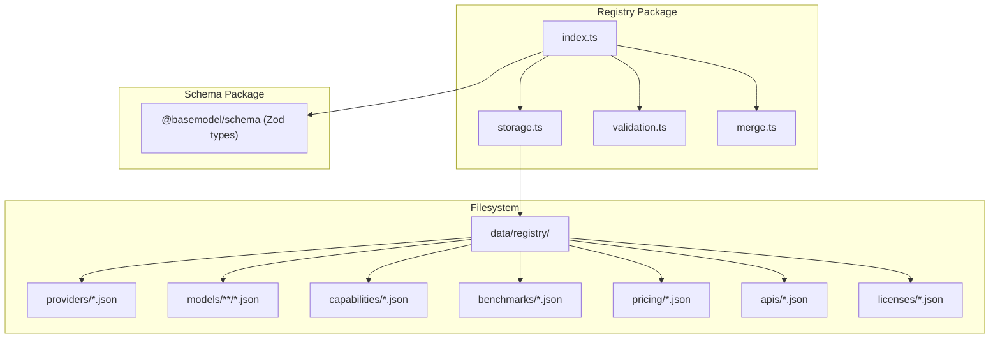
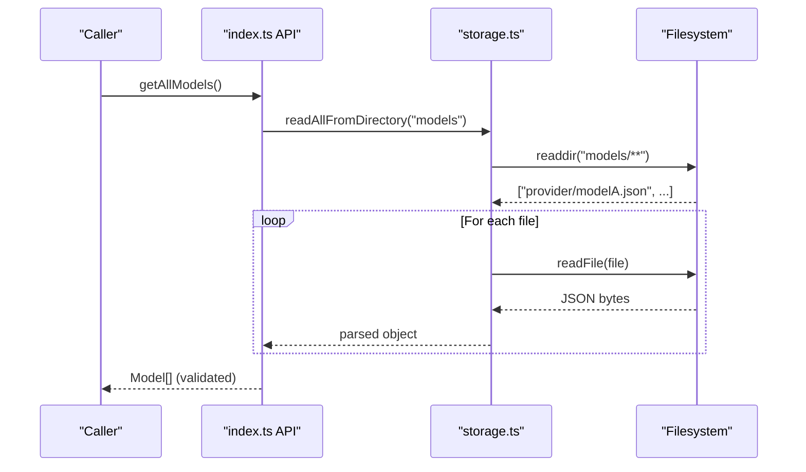
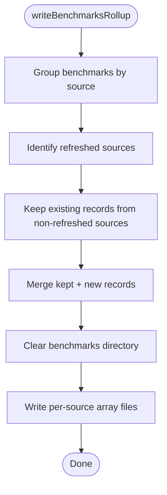
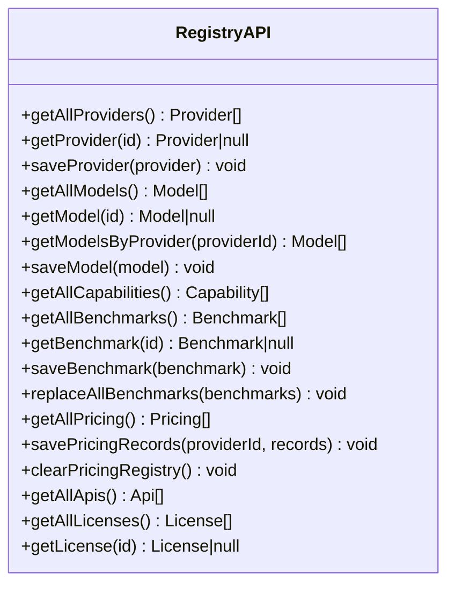
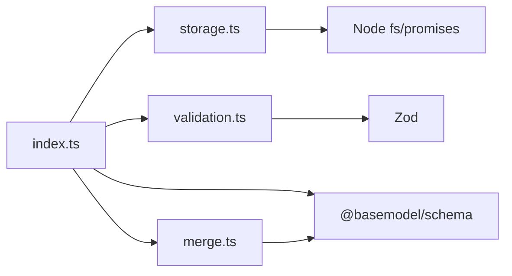

# Storage System

<cite>
**Referenced Files in This Document**
- [README.md](file://README.md)
- [package.json](file://packages/registry/package.json)
- [index.ts](file://packages/registry/src/index.ts)
- [storage.ts](file://packages/registry/src/storage.ts)
- [validation.ts](file://packages/registry/src/validation.ts)
- [merge.ts](file://packages/registry/src/merge.ts)
</cite>

## Table of Contents
1. [Introduction](#introduction)
2. [Project Structure](#project-structure)
3. [Core Components](#core-components)
4. [Architecture Overview](#architecture-overview)
5. [Detailed Component Analysis](#detailed-component-analysis)
6. [Dependency Analysis](#dependency-analysis)
7. [Performance Considerations](#performance-considerations)
8. [Troubleshooting Guide](#troubleshooting-guide)
9. [Conclusion](#conclusion)
10. [Appendices](#appendices)

## Introduction
This document explains the Registry storage system used by the BaseModel project to persist and manage canonical AI model data on the filesystem. It covers the file-based storage architecture, data persistence mechanisms, interface contracts for reading and writing model records, configuration options for locating the registry root directory, directory structure organization, performance characteristics, error handling strategies, and integration patterns with the registry core. The goal is to provide both a conceptual overview and a code-mapped deep dive so that users can understand how records are stored, retrieved, merged, and validated without needing to read every line of source code.

## Project Structure
The Registry package provides:
- A file-based storage layer that reads and writes JSON files under a well-known directory tree.
- A public API surface that exposes typed operations for providers, models, capabilities, benchmarks, pricing, APIs, and licenses.
- Validation utilities backed by Zod schemas from the schema package.
- Merge utilities to safely combine curated human edits with automated collector updates.

**Diagram sources**
- [index.ts:1-169](file://packages/registry/src/index.ts#L1-L169)
- [storage.ts:1-164](file://packages/registry/src/storage.ts#L1-L164)
- [validation.ts:1-43](file://packages/registry/src/validation.ts#L1-L43)
- [merge.ts:1-69](file://packages/registry/src/merge.ts#L1-L69)

**Section sources**
- [README.md:11-30](file://README.md#L11-L30)
- [package.json:1-35](file://packages/registry/package.json#L1-L35)

## Core Components
- Filesystem storage primitives:
  - Read single file, write single file atomically, list files recursively, clear directories, delete files.
  - Benchmark rollup writer that groups records by source and merges partial runs safely.
- Public registry API:
  - CRUD-like functions for providers, models, capabilities, benchmarks, pricing, APIs, and licenses.
  - Timestamping helper to record last update time on persisted entities.
- Validation:
  - Safe parsing against Zod schemas returning structured results.
  - Batch validation utility for lists of records.
- Merge:
  - Curated-field protection when merging collector outputs into existing model records.

Key responsibilities:
- Index module orchestrates I/O via storage helpers and applies schema validation before returning data.
- Storage module encapsulates all filesystem interactions and path resolution logic.
- Validation module centralizes schema checks and error formatting.
- Merge module enforces editorial integrity by protecting curated fields.

**Section sources**
- [index.ts:1-169](file://packages/registry/src/index.ts#L1-L169)
- [storage.ts:1-164](file://packages/registry/src/storage.ts#L1-L164)
- [validation.ts:1-43](file://packages/registry/src/validation.ts#L1-L43)
- [merge.ts:1-69](file://packages/registry/src/merge.ts#L1-L69)

## Architecture Overview
At runtime, the registry resolves a root directory for data persistence and uses it as the base for all relative paths. Each entity type has its own top-level directory under the registry root. Records are stored as JSON files, often one per entity or grouped by source for high-volume datasets like benchmarks.

**Diagram sources**
- [index.ts:63-66](file://packages/registry/src/index.ts#L63-L66)
- [storage.ts:93-101](file://packages/registry/src/storage.ts#L93-L101)

## Detailed Component Analysis

### Storage Layer (storage.ts)
Responsibilities:
- Resolve registry root using environment override, directory walk-up, or fallback with warning.
- Provide atomic writes via temp file + rename.
- Recursively enumerate JSON files and aggregate them into arrays.
- Clear directories and delete individual files.
- Specialized benchmark rollup writer that groups by source and preserves previous data for failed sources.

Key behaviors:
- Path resolution priority:
  1. Environment variable BASEMODEL_REGISTRY_PATH if present and valid.
  2. Walk up from current working directory up to 10 levels looking for data/registry.
  3. Fallback to cwd/data/registry with a console warning.
- Atomicity:
  - Writes use a temporary filename including process ID, then rename to target path.
- Benchmark rollup:
  - Groups incoming benchmarks by source, merges with existing records, clears benchmarks directory, and rewrites per-source array files.

**Diagram sources**
- [storage.ts:138-163](file://packages/registry/src/storage.ts#L138-L163)

**Section sources**
- [storage.ts:16-39](file://packages/registry/src/storage.ts#L16-L39)
- [storage.ts:48-65](file://packages/registry/src/storage.ts#L48-L65)
- [storage.ts:67-91](file://packages/registry/src/storage.ts#L67-L91)
- [storage.ts:93-111](file://packages/registry/src/storage.ts#L93-L111)
- [storage.ts:113-124](file://packages/registry/src/storage.ts#L113-L124)
- [storage.ts:138-163](file://packages/registry/src/storage.ts#L138-L163)

### Registry API Surface (index.ts)
Responsibilities:
- Expose typed functions for each entity type (Provider, Model, Capability, Benchmark, Pricing, API, License).
- Use storage helpers to read/write files and apply schema validation.
- Stamp updated_at timestamps on persisted entities where appropriate.
- Provide specialized operations for benchmarks (per-source rollups) and pricing (per-provider arrays).

Notable patterns:
- Single-entity retrieval returns null when not found, otherwise validates and returns typed data.
- Bulk retrieval aggregates arrays across files and validates each record.
- Save functions stamp timestamps and write atomically.

**Diagram sources**
- [index.ts:45-59](file://packages/registry/src/index.ts#L45-L59)
- [index.ts:63-83](file://packages/registry/src/index.ts#L63-L83)
- [index.ts:87-90](file://packages/registry/src/index.ts#L87-L90)
- [index.ts:94-122](file://packages/registry/src/index.ts#L94-L122)
- [index.ts:126-147](file://packages/registry/src/index.ts#L126-L147)
- [index.ts:151-154](file://packages/registry/src/index.ts#L151-L154)
- [index.ts:158-168](file://packages/registry/src/index.ts#L158-L168)

**Section sources**
- [index.ts:39-41](file://packages/registry/src/index.ts#L39-L41)
- [index.ts:45-59](file://packages/registry/src/index.ts#L45-L59)
- [index.ts:63-83](file://packages/registry/src/index.ts#L63-L83)
- [index.ts:87-90](file://packages/registry/src/index.ts#L87-L90)
- [index.ts:94-122](file://packages/registry/src/index.ts#L94-L122)
- [index.ts:126-147](file://packages/registry/src/index.ts#L126-L147)
- [index.ts:151-154](file://packages/registry/src/index.ts#L151-L154)
- [index.ts:158-168](file://packages/registry/src/index.ts#L158-L168)

### Validation Utilities (validation.ts)
Responsibilities:
- Validate raw values against Zod schemas without throwing, returning structured success/failure results.
- Batch-validate lists of records, collecting row-level errors.

Design notes:
- Errors are normalized into readable strings with dot-separated paths and messages.
- Batch validation separates valid records from invalid ones with indices and errors.

**Section sources**
- [validation.ts:1-43](file://packages/registry/src/validation.ts#L1-L43)

### Merge Utilities (merge.ts)
Responsibilities:
- Safely merge collector-provided data with existing curated model records.
- Protect curated fields from being overwritten by automated updates.

Behavior highlights:
- Defaults are applied for boolean flags and modalities when missing.
- Curated fields (e.g., description, family, release_date, architecture, parameter_size) always win over incoming values.
- Capability IDs and license IDs are preserved from existing records when present.
- Final merged result is validated against the model schema.

**Section sources**
- [merge.ts:11-17](file://packages/registry/src/merge.ts#L11-L17)
- [merge.ts:22-68](file://packages/registry/src/merge.ts#L22-L68)

## Dependency Analysis
The registry package depends on:
- Node.js filesystem APIs for reading/writing JSON files.
- @basemodel/schema for Zod schemas and TypeScript types.
- Internal modules: storage, validation, merge.

**Diagram sources**
- [index.ts:1-32](file://packages/registry/src/index.ts#L1-L32)
- [storage.ts:1-4](file://packages/registry/src/storage.ts#L1-L4)
- [validation.ts:1-2](file://packages/registry/src/validation.ts#L1-L2)
- [merge.ts:1-3](file://packages/registry/src/merge.ts#L1-L3)

**Section sources**
- [package.json:22-25](file://packages/registry/package.json#L22-L25)

## Performance Considerations
- Atomic writes: Using temp files plus rename ensures consistent snapshots and avoids partial writes.
- Directory enumeration: Recursive listing collects all JSON files; consider caching results if scanning large directories frequently.
- Benchmark rollup: Grouping by source reduces git bloat and keeps writes efficient; partial failures preserve prior data.
- Batch reads: Aggregating arrays across files is straightforward but may be I/O bound; batch operations should be used judiciously.
- Timestamps: Stamping updated_at adds minimal overhead and enables consumers to detect staleness.

[No sources needed since this section provides general guidance]

## Troubleshooting Guide
Common issues and resolutions:
- Registry root not found:
  - Ensure BASEMODEL_REGISTRY_PATH points to an existing directory or that data/registry exists within the repository hierarchy.
  - If falling back to cwd/data/registry, check console warnings indicating unexpected write locations.
- Missing files:
  - Single-entity getters return null when files do not exist; verify expected IDs and file naming conventions.
- Validation failures:
  - Use the validation utilities to inspect structured errors; ensure input conforms to schema definitions.
- Benchmark rollup anomalies:
  - Verify that benchmarks include a valid source field; only sources present in the run refresh their files.

**Section sources**
- [storage.ts:16-39](file://packages/registry/src/storage.ts#L16-L39)
- [index.ts:50-55](file://packages/registry/src/index.ts#L50-L55)
- [validation.ts:11-20](file://packages/registry/src/validation.ts#L11-L20)
- [storage.ts:138-163](file://packages/registry/src/storage.ts#L138-L163)

## Conclusion
The Registry storage system provides a robust, file-based persistence layer tailored for managing canonical AI model metadata. It emphasizes safe writes, schema validation, curated data protection, and scalable handling of high-volume datasets through rollups. By separating concerns across storage, validation, and merge utilities, the system remains maintainable and extensible while offering a clean API for consumers.

[No sources needed since this section summarizes without analyzing specific files]

## Appendices

### Data Persistence Mechanisms
- Single-record files: One JSON file per entity under provider-specific directories (e.g., models/openai/gpt-4o.json).
- Array files: Some entity types store arrays in single files (e.g., pricing/provider.json, benchmarks/source.json).
- Atomicity: All writes use temp files and rename to prevent corruption.
- Timestamps: Entities saved via the API receive updated_at stamps for freshness tracking.

**Section sources**
- [index.ts:57-59](file://packages/registry/src/index.ts#L57-L59)
- [index.ts:81-83](file://packages/registry/src/index.ts#L81-L83)
- [index.ts:135-140](file://packages/registry/src/index.ts#L135-L140)
- [storage.ts:59-65](file://packages/registry/src/storage.ts#L59-L65)

### Storage Configuration Options
- BASEMODEL_REGISTRY_PATH: Absolute path to the registry root directory; must exist or startup fails loudly.
- Directory walk-up: If no env override, searches up to 10 parent directories for data/registry.
- Fallback behavior: Uses cwd/data/registry with a visible warning to avoid accidental writes outside the repo.

**Section sources**
- [storage.ts:16-39](file://packages/registry/src/storage.ts#L16-L39)

### Directory Structure Organization
- providers: One JSON file per provider.
- models: Hierarchical folders by provider with one JSON file per model.
- capabilities: One JSON file per capability.
- benchmarks: Per-source array files grouping many benchmark records.
- pricing: Per-provider array files containing multiple pricing entries.
- apis: One JSON file per API.
- licenses: One JSON file per license.

**Section sources**
- [index.ts:45-59](file://packages/registry/src/index.ts#L45-L59)
- [index.ts:63-83](file://packages/registry/src/index.ts#L63-L83)
- [index.ts:87-90](file://packages/registry/src/index.ts#L87-L90)
- [index.ts:94-122](file://packages/registry/src/index.ts#L94-L122)
- [index.ts:126-147](file://packages/registry/src/index.ts#L126-L147)
- [index.ts:151-154](file://packages/registry/src/index.ts#L151-L154)
- [index.ts:158-168](file://packages/registry/src/index.ts#L158-L168)

### Custom Storage Backend Implementation
To implement a custom backend:
- Replace storage primitives with your own implementation that adheres to the same function signatures:
  - readRegistryFile(relativePath): Promise<T | null>
  - writeRegistryFile(relativePath, data): Promise<void>
  - listRegistryFiles(subDir): Promise<string[]>
  - readAllFromDirectory(subDir): Promise<T[]>
  - readAllArraysFromDirectory(subDir): Promise<T[]>
  - clearRegistryDirectory(subDir): Promise<void>
  - deleteRegistryFile(relativePath): Promise<void>
  - writeBenchmarksRollup(benchmarks, existing): Promise<void>
- Ensure path resolution matches expectations or adjust getRegistryRoot accordingly.
- Maintain atomicity guarantees where possible (temp file + rename).
- Preserve benchmark rollup semantics to keep partial-failure safety.

[No sources needed since this section provides general guidance]

### Error Handling Strategies
- Validation:
  - Use validate() for single records and validateMany() for batches to collect structured errors.
- File I/O:
  - Handle missing files gracefully (return null for single-entity getters).
  - Warn on fallback registry root to avoid silent misconfiguration.
- Merge:
  - Validate merged results to catch inconsistencies early.

**Section sources**
- [validation.ts:11-20](file://packages/registry/src/validation.ts#L11-L20)
- [validation.ts:25-42](file://packages/registry/src/validation.ts#L25-L42)
- [index.ts:50-55](file://packages/registry/src/index.ts#L50-L55)
- [storage.ts:16-39](file://packages/registry/src/storage.ts#L16-L39)
- [merge.ts:63-68](file://packages/registry/src/merge.ts#L63-L68)

### Integration Patterns with Registry Core
- Use index.ts API functions for all reads/writes to ensure schema validation and timestamping.
- For bulk operations (benchmarks, pricing), prefer rollup/array writers to reduce filesystem churn.
- When updating models, use mergeModelData to protect curated fields and validate the final result.
- Consumers can rely on updated_at timestamps to detect stale data across snapshots.

**Section sources**
- [index.ts:39-41](file://packages/registry/src/index.ts#L39-L41)
- [index.ts:94-122](file://packages/registry/src/index.ts#L94-L122)
- [index.ts:126-147](file://packages/registry/src/index.ts#L126-L147)
- [merge.ts:22-68](file://packages/registry/src/merge.ts#L22-L68)