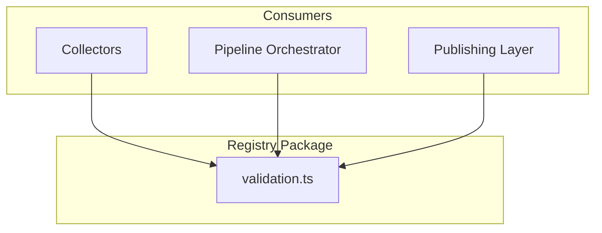
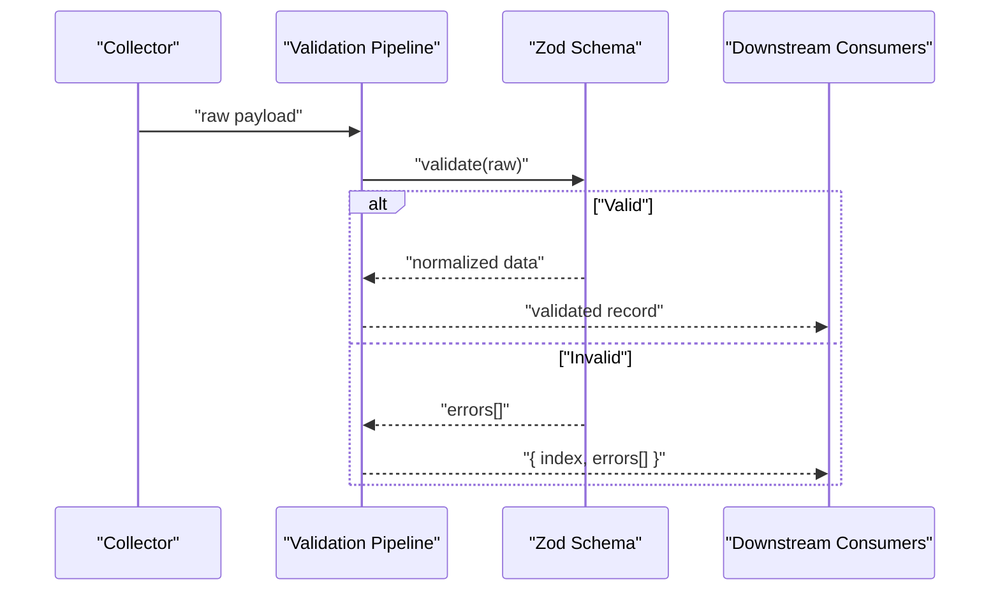
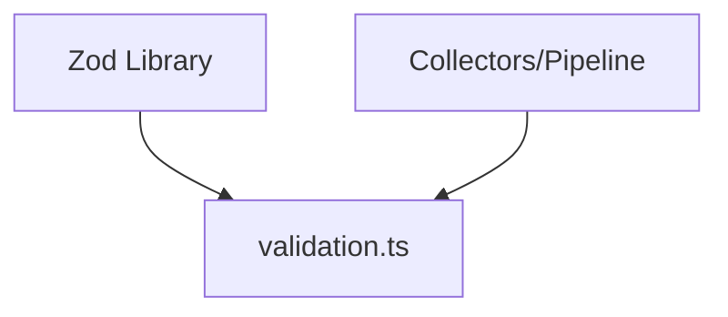

# Validation Pipeline

<cite>
**Referenced Files in This Document**
- [validation.ts](file://packages/registry/src/validation.ts)
</cite>

## Table of Contents
1. [Introduction](#introduction)
2. [Project Structure](#project-structure)
3. [Core Components](#core-components)
4. [Architecture Overview](#architecture-overview)
5. [Detailed Component Analysis](#detailed-component-analysis)
6. [Dependency Analysis](#dependency-analysis)
7. [Performance Considerations](#performance-considerations)
8. [Troubleshooting Guide](#troubleshooting-guide)
9. [Conclusion](#conclusion)

## Introduction
This document explains the registry validation pipeline that processes incoming data from collectors. It covers how raw payloads are validated against canonical schemas, normalized into consistent formats, and processed through validation chains. The focus is on the validator architecture, custom validator creation, error reporting mechanisms, and validation rules. It also includes examples for schema extensions, validation middleware patterns, and troubleshooting common issues.

## Project Structure
The validation pipeline centers around a small, focused module that provides Zod-based validation helpers used across the registry to validate and normalize records. The key file is:
- packages/registry/src/validation.ts

This module exposes:
- A typed result wrapper for validation outcomes
- A single-record validator that returns structured errors
- A batch validator that separates valid and invalid records with per-row error details

[No sources needed since this diagram shows conceptual workflow, not actual code structure]

## Core Components
- ValidationResult<T>: A discriminated union representing either successful validation with typed data or failure with an array of human-readable error strings.
- validate(schema, raw): Validates a single raw value against a Zod schema without throwing. Returns a ValidationResult<T>.
- validateMany(schema, records): Validates an array of records, returning a split of valid items and invalid items with their indices and error arrays.

These components form the foundation of the validation chain, enabling both single-record and batch processing with consistent error reporting.

**Section sources**
- [validation.ts:1-43](file://packages/registry/src/validation.ts#L1-L43)

## Architecture Overview
The validation pipeline follows a clear flow:
- Collectors emit raw payloads (JSON-like structures).
- The pipeline applies canonical schemas using Zod to validate and coerce values.
- Validated records proceed downstream; invalid ones are captured with detailed errors.
- Optional middleware can be composed around validators to add normalization, logging, or policy checks.

[No sources needed since this diagram shows conceptual workflow, not actual code structure]

## Detailed Component Analysis

### ValidationResult<T>
A type-only component that standardizes validation outcomes across the pipeline. It ensures consumers handle success and failure uniformly.

- Success case: carries the validated and normalized data.
- Failure case: carries an array of error strings describing path and message.

Usage pattern:
- Check result.success to branch logic.
- On failure, iterate errors to log or present actionable feedback.

**Section sources**
- [validation.ts:1-20](file://packages/registry/src/validation.ts#L1-L20)

### validate(schema, raw)
Validates a single input against a Zod schema without throwing exceptions. It leverages safe parsing to capture all errors and formats them into readable messages.

Key behaviors:
- Uses safeParse to avoid throwing.
- On success, returns the coerced and validated data.
- On failure, maps ZodError paths and messages into a flat list of strings.

Common usage:
- Wrap each collector record before insertion or transformation.
- Combine with middleware to add pre/post validation steps.

**Section sources**
- [validation.ts:8-20](file://packages/registry/src/validation.ts#L8-L20)

### validateMany(schema, records)
Batch-oriented validator that splits records into valid and invalid sets while preserving original indices for traceability.

Key behaviors:
- Iterates over records sequentially.
- Calls validate for each record.
- Aggregates valid results and invalid entries with index and errors.

Common usage:
- Process large batches from collectors efficiently.
- Report partial failures without aborting entire batches.

**Section sources**
- [validation.ts:22-43](file://packages/registry/src/validation.ts#L22-L43)

### Custom Validators and Middleware Patterns
While the core module provides generic validators, you can build custom validators by composing Zod schemas and wrapping validate/validateMany with middleware functions. Typical patterns include:
- Pre-validation normalization (e.g., trimming strings, coercing types).
- Post-validation enrichment (e.g., adding computed fields).
- Policy checks (e.g., rejecting deprecated fields or enforcing allowed providers).

Example approach:
- Create a schema factory function that returns a ZodSchema<T>.
- Wrap validate with a middleware that logs, transforms, or enforces policies.
- Use validateMany for bulk operations and aggregate metrics.

[No sources needed since this section provides general guidance]

### Error Reporting Mechanisms
Errors are represented as string messages derived from Zod’s error structure. Each error includes:
- Path segments joined with dots to indicate location within the object.
- Human-readable message explaining the violation.

Best practices:
- Log full error arrays for debugging.
- Surface concise messages to users or dashboards.
- Preserve indices when validating multiple records to pinpoint failures.

**Section sources**
- [validation.ts:11-20](file://packages/registry/src/validation.ts#L11-L20)

## Dependency Analysis
The validation module depends on Zod for schema definition and safe parsing. Consumers depend on the module for consistent validation behavior.

**Diagram sources**
- [validation.ts:1-10](file://packages/registry/src/validation.ts#L1-L10)

**Section sources**
- [validation.ts:1-10](file://packages/registry/src/validation.ts#L1-L10)

## Performance Considerations
- Batch validation: Prefer validateMany for large datasets to reduce overhead and simplify error aggregation.
- Schema design: Keep schemas minimal and focused to minimize parsing cost.
- Avoid heavy transformations inside schemas; perform normalization outside validation where possible.
- Cache reusable schemas to prevent repeated construction.

[No sources needed since this section provides general guidance]

## Troubleshooting Guide
Common issues and resolutions:
- Unexpected type coercion: Ensure your Zod schema explicitly defines desired types and transformations.
- Missing fields: Add required constraints in schemas and check error paths to locate missing keys.
- Invalid enum values: Define strict enums and verify inputs against allowed values.
- Nested object errors: Inspect dot-separated paths in error messages to identify exact locations.
- Partial batch failures: Use validateMany to isolate invalid rows and continue processing valid ones.

Diagnostic steps:
- Log the full errors array for each failed record.
- Validate a single record first using validate to isolate issues.
- Gradually expand to validateMany once single-record validation passes.

**Section sources**
- [validation.ts:11-20](file://packages/registry/src/validation.ts#L11-L20)
- [validation.ts:25-43](file://packages/registry/src/validation.ts#L25-L43)

## Conclusion
The registry validation pipeline provides a robust, extensible foundation for validating and normalizing collector data. By leveraging Zod schemas and the provided helpers, teams can implement consistent validation rules, compose middleware, and deliver clear error reports. Adopting batch validation and careful schema design will ensure performance and maintainability as the system scales.

[No sources needed since this section summarizes without analyzing specific files]