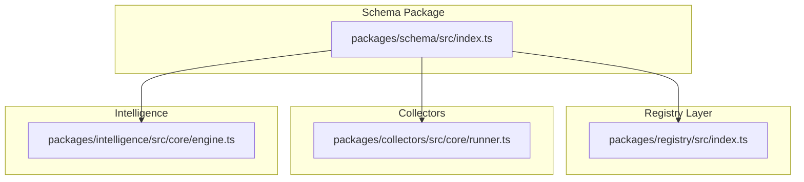
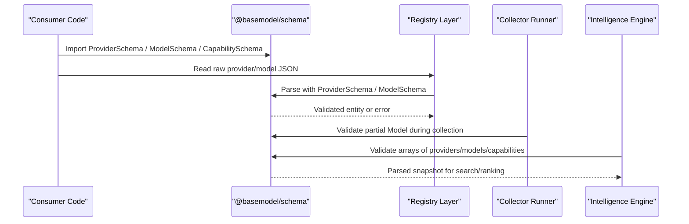
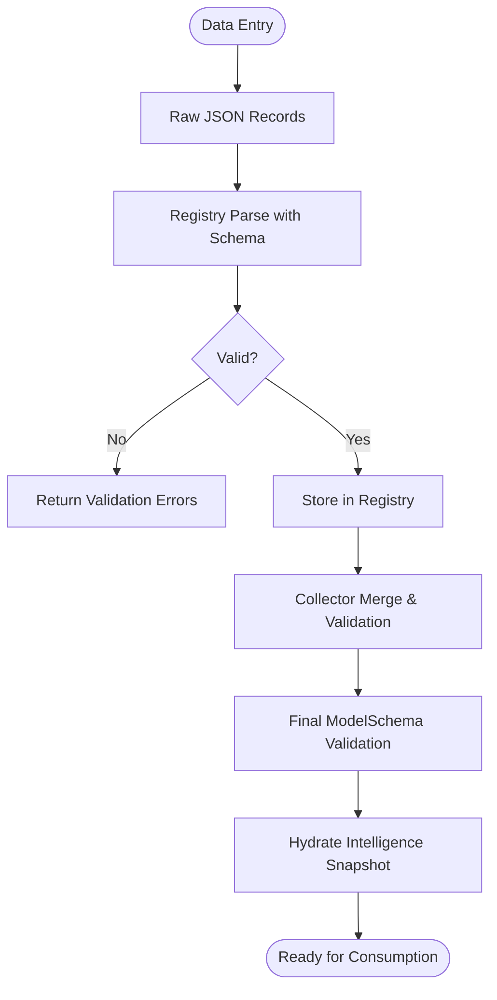
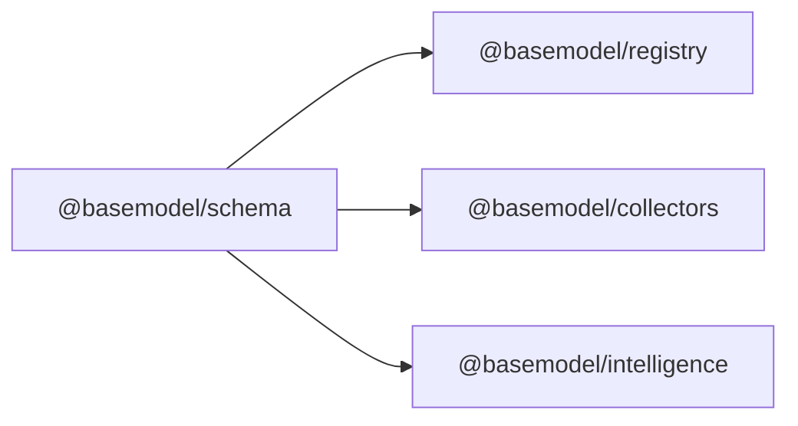

# Core Schemas

<cite>
**Referenced Files in This Document**
- [README.md](file://README.md)
- [05_Data_Model.md](file://docs/05_Data_Model.md)
- [index.ts](file://packages/schema/src/index.ts)
- [provider.test.ts](file://packages/registry/src/__tests__/provider.test.ts)
- [runner.ts](file://packages/collectors/src/core/runner.ts)
- [engine.ts](file://packages/intelligence/src/core/engine.ts)
</cite>

## Table of Contents
1. [Introduction](#introduction)
2. [Project Structure](#project-structure)
3. [Core Components](#core-components)
4. [Architecture Overview](#architecture-overview)
5. [Detailed Component Analysis](#detailed-component-analysis)
6. [Dependency Analysis](#dependency-analysis)
7. [Performance Considerations](#performance-considerations)
8. [Troubleshooting Guide](#troubleshooting-guide)
9. [Conclusion](#conclusion)

## Introduction
This document provides a comprehensive guide to the core schema definitions used across BaseModel, focusing on Provider, Model, and Capability schemas. It explains field definitions, validation rules, data types, relationships, and common usage patterns observed in the codebase. The goal is to make these canonical contracts accessible to both technical and non-technical readers while remaining grounded in the repository’s actual implementation and tests.

BaseModel serves as the data layer for AI model intelligence, publishing normalized datasets that other systems consume. The canonical schemas are defined in the schema package and validated throughout collectors, registry, and intelligence layers.

**Section sources**
- [README.md:10-30](file://README.md#L10-L30)

## Project Structure
The schema package exposes Zod-based schemas and TypeScript types for all core entities. These are consumed by registry operations, collectors, and intelligence engines to ensure consistent validation and type safety across the system.

**Diagram sources**
- [index.ts](file://packages/schema/src/index.ts)
- [engine.ts](file://packages/intelligence/src/core/engine.ts)
- [runner.ts](file://packages/collectors/src/core/runner.ts)

**Section sources**
- [README.md:10-30](file://README.md#L10-L30)
- [index.ts:1-27](file://packages/schema/src/index.ts#L1-L27)

## Core Components
This section outlines the three primary schemas relevant to this document: Provider, Model, and Capability. Each schema defines a set of fields, constraints, and relationships that standardize how providers, models, and capabilities are represented in the registry.

- Provider: Represents an organization or gateway that publishes or hosts models. Includes identifiers, metadata, and status.
- Model: Captures model specifications, capabilities, licensing, and operational flags. Links to a provider and capability set.
- Capability: Normalized capability descriptors shared across many models (e.g., text generation, vision, embeddings).

These schemas are exported from the schema package and validated using Zod parsers across the codebase.

**Section sources**
- [index.ts:10-26](file://packages/schema/src/index.ts#L10-L26)
- [05_Data_Model.md:25-78](file://docs/05_Data_Model.md#L25-L78)

## Architecture Overview
At runtime, consumers import schemas from the schema package and use them to validate incoming data. Registry functions read raw JSON records and parse them with the corresponding schema. Collectors normalize external provider responses into partial model objects, which are later merged and validated against the full Model schema. Intelligence components hydrate snapshots by validating arrays of providers, models, and capabilities.

**Diagram sources**
- [index.ts](file://packages/schema/src/index.ts)
- [engine.ts](file://packages/intelligence/src/core/engine.ts)
- [runner.ts](file://packages/collectors/src/core/runner.ts)

## Detailed Component Analysis

### Provider Schema
The Provider schema defines the canonical representation of a provider. Key aspects include:
- Identifier: provider_id must follow kebab-case conventions.
- Metadata: name, organization, website, documentation, country, description.
- Classification: provider_type indicates whether it is first-party, gateway, etc.
- Status: active or other controlled values.

Validation patterns observed:
- Rejection of invalid provider_id formats (spaces not allowed).
- URL validation for website fields.
- Controlled enum-like validation for status.

Example usage patterns:
- Registry reads provider JSON files and validates via ProviderSchema.parse().
- Collectors auto-register minimal provider records when encountering new provider_ids, then validate and save.

Relationships:
- Models reference provider_id to associate with a provider.

Common validation pitfalls:
- Using spaces or uppercase in provider_id.
- Providing malformed URLs for website.
- Setting unsupported status values.

**Section sources**
- [05_Data_Model.md:25-39](file://docs/05_Data_Model.md#L25-L39)
- [provider.test.ts:17-62](file://packages/registry/src/__tests__/provider.test.ts#L17-L62)
- [runner.ts:337-363](file://packages/collectors/src/core/runner.ts#L337-L363)

### Model Schema
The Model schema captures detailed information about a specific AI model. Core fields include:
- Identification: model_id (format {provider_id}/{model-slug}), provider_id, name, family, version, release_date.
- Technical specs: architecture, parameter_size, context_window, modality (array), open_weight.
- Capabilities and flags: reasoning_support, function_calling, structured_output, vision_support, audio_support, image_generation, embedding_support.
- Relationships: capability_ids (array), license_id (optional).
- Operational: status.

Validation patterns observed:
- Required fields such as model_id, provider_id, name, modality, and status are enforced.
- Missing required fields cause validation failure.
- Curated fields are protected from being overwritten by collector data during merges.

Example usage patterns:
- Registry loads models from data/registry/models and parses each with ModelSchema.parse().
- Collectors produce Partial<Model> records; merge utilities combine curated and collected data before final validation.
- Intelligence engine validates arrays of models when hydrating snapshots.

Relationships:
- Links to Provider via provider_id.
- Links to Capability via capability_ids array.
- Optional link to License via license_id.

Common validation pitfalls:
- Omitting required fields like model_id or modality.
- Incorrectly formatting model_id (must be {provider_id}/{model-slug}).
- Overwriting curated fields unintentionally during merges.

**Section sources**
- [05_Data_Model.md:41-68](file://docs/05_Data_Model.md#L41-L68)
- [engine.ts:12-14](file://packages/intelligence/src/core/engine.ts#L12-L14)
- [merge.test.ts:89-127](file://packages/registry/src/__tests__/merge.test.ts#L89-L127)

### Capability Schema
The Capability schema represents normalized capabilities that can be shared across many models. Fields include:
- capability_id: unique identifier for the capability.
- name: human-readable name.
- description: optional explanation of the capability.

Usage patterns:
- Models reference capabilities through capability_ids arrays.
- Capability definitions live in data/registry/capabilities and are published as part of the dataset.

Relationships:
- Many-to-many relationship between models and capabilities via capability_ids.

Common validation pitfalls:
- Inconsistent capability_id naming across models.
- Missing capability definitions referenced by models.

**Section sources**
- [05_Data_Model.md:70-78](file://docs/05_Data_Model.md#L70-L78)

### Data Flow and Validation Patterns
The codebase consistently uses Zod schemas for validation at multiple stages:
- Registry reads raw JSON and parses with schema.parse() to enforce structure.
- Collectors validate partial model payloads and ensure they conform to ModelSchema before merging.
- Intelligence engine validates entire snapshots (providers, models, capabilities) to prepare for search and ranking.

[No sources needed since this diagram shows conceptual workflow, not actual code structure]

## Dependency Analysis
Schemas are centralized in the schema package and imported by other layers:
- Registry imports ProviderSchema, ModelSchema, CapabilitySchema, and others to parse and store data.
- Collectors import ProviderSchema and ModelSchema to validate inputs and outputs.
- Intelligence imports schemas to validate snapshots for search and recommendations.

**Diagram sources**
- [index.ts](file://packages/schema/src/index.ts)
- [engine.ts](file://packages/intelligence/src/core/engine.ts)
- [runner.ts](file://packages/collectors/src/core/runner.ts)

**Section sources**
- [index.ts:10-26](file://packages/schema/src/index.ts#L10-L26)
- [engine.ts:12-14](file://packages/intelligence/src/core/engine.ts#L12-L14)
- [runner.ts:337-363](file://packages/collectors/src/core/runner.ts#L337-L363)

## Performance Considerations
- Schema parsing is performed per record; batch operations should minimize repeated parsing where possible.
- Validation errors are returned early to avoid unnecessary processing.
- Snapshots in intelligence are validated once during hydration to support efficient querying.

[No sources needed since this section provides general guidance]

## Troubleshooting Guide
Common issues and resolutions:
- Invalid provider_id format: Ensure kebab-case without spaces or uppercase characters.
- Malformed website URL: Provide a valid URL string.
- Unsupported status value: Use only allowed status values (e.g., active).
- Missing required model fields: Ensure model_id, provider_id, name, modality, and status are present.
- Overwritten curated fields: Avoid overwriting curated fields during merges; rely on merge utilities to preserve them.

Diagnostic tips:
- Use safeParse to capture validation errors and log them for debugging.
- Check registry tests for examples of expected valid and invalid inputs.

**Section sources**
- [provider.test.ts:27-62](file://packages/registry/src/__tests__/provider.test.ts#L27-L62)
- [merge.test.ts:94-105](file://packages/registry/src/__tests__/merge.test.ts#L94-L105)

## Conclusion
The Provider, Model, and Capability schemas form the backbone of BaseModel’s data layer, ensuring consistency, validation, and interoperability across collectors, registry, and intelligence components. By adhering to the documented field definitions, validation rules, and relationships, contributors can maintain high-quality, standardized data that powers downstream applications.

[No sources needed since this section summarizes without analyzing specific files]