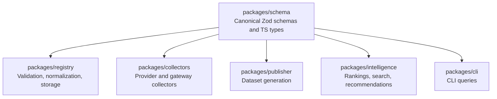
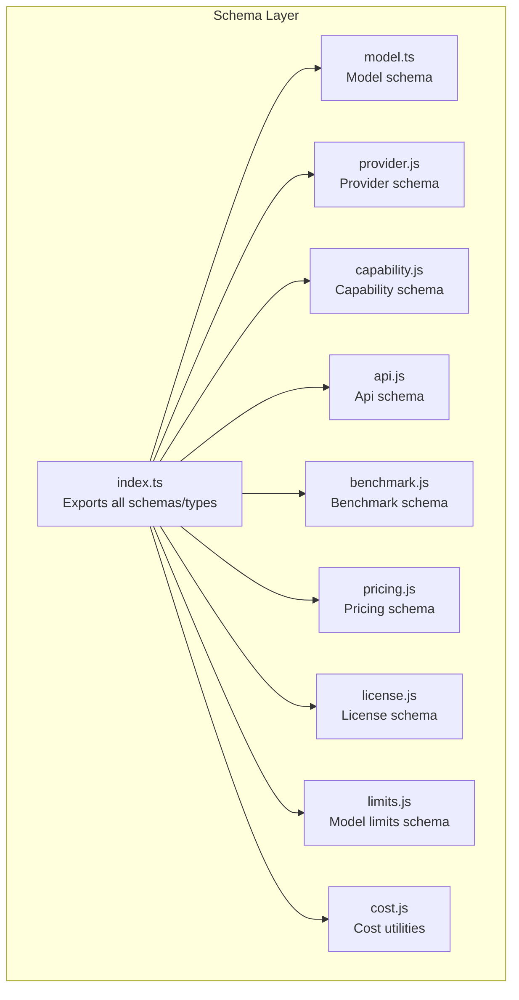
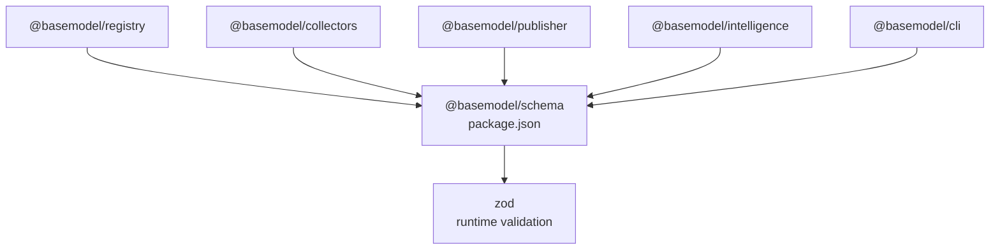

# Schema Extension Guide

<cite>
**Referenced Files in This Document**
- [README.md](file://README.md)
- [index.ts](file://packages/schema/src/index.ts)
- [package.json](file://packages/schema/package.json)
- [model.ts](file://packages/schema/src/model.ts)
- [api.js](file://packages/schema/src/api.js)
- [benchmark.js](file://packages/schema/src/benchmark.js)
- [capability.js](file://packages/schema/src/capability.js)
- [license.js](file://packages/schema/src/license.js)
- [limits.js](file://packages/schema/src/limits.js)
- [pricing.js](file://packages/schema/src/pricing.js)
- [provider.js](file://packages/schema/src/provider.js)
- [cost.js](file://packages/schema/src/cost.js)
</cite>

## Table of Contents
1. [Introduction](#introduction)
2. [Project Structure](#project-structure)
3. [Core Components](#core-components)
4. [Architecture Overview](#architecture-overview)
5. [Detailed Component Analysis](#detailed-component-analysis)
6. [Dependency Analysis](#dependency-analysis)
7. [Performance Considerations](#performance-considerations)
8. [Troubleshooting Guide](#troubleshooting-guide)
9. [Conclusion](#conclusion)
10. [Appendices](#appendices)

## Introduction
This guide explains how to extend and customize schemas in BaseModel’s canonical schema package. It focuses on creating custom schema types, adding validation rules, extending existing schemas while maintaining backward compatibility, and integrating with the broader BaseModel ecosystem (providers, models, capabilities). You will find step-by-step instructions for adding new fields, implementing custom validators, and ensuring compatibility across consumers such as collectors, registry, and publishers.

## Project Structure
BaseModel organizes its canonical data contracts in a dedicated schema package that exports Zod schemas and TypeScript types. Consumers import these schemas to validate and normalize data across the platform. The README outlines the repository layout and confirms that packages/schema is the source of truth for shared data contracts.

**Diagram sources**
- [README.md:10-30](file://README.md#L10-L30)

**Section sources**
- [README.md:10-30](file://README.md#L10-L30)

## Core Components
The schema package exposes core entities via a central index file. Each entity has a corresponding schema and type export. These are used throughout the codebase to ensure consistent data shapes and validation.

Key exported components include:
- Model and ModelSchema
- Provider and ProviderSchema
- Capability and CapabilitySchema
- Api and ApiSchema
- Benchmark and BenchmarkSchema
- Pricing and PricingSchema
- License and LicenseSchema
- ModelLimits and ModelLimitsSchema
- Cost utilities (e.g., blendedCost)

These exports form the extension surface for providers, models, and capabilities.

**Section sources**
- [index.ts:10-27](file://packages/schema/src/index.ts#L10-L27)
- [package.json:1-48](file://packages/schema/package.json#L1-L48)

## Architecture Overview
At a high level, BaseModel’s schema layer defines canonical contracts. Consumers validate incoming data against these schemas, normalize it, and persist or process it further. Extensions should preserve backward compatibility by using additive changes and optional fields where appropriate.

**Diagram sources**
- [index.ts:10-27](file://packages/schema/src/index.ts#L10-L27)

## Detailed Component Analysis

### Extending the Model Schema
The Model is the central entity. To add new fields or validators:
- Add new optional fields to avoid breaking existing consumers.
- Use Zod refinements or custom validators for domain-specific checks.
- Export updated types alongside the schema to keep TypeScript in sync.

Steps:
1. Open the model schema file and identify the base schema definition.
2. Append new optional fields with sensible defaults or constraints.
3. Implement any custom validation logic using Zod features.
4. Re-export updated types from the index if necessary.

Backward compatibility tips:
- Prefer optional fields over required ones.
- Avoid changing existing field names or types.
- Provide migration notes when introducing breaking changes.

**Section sources**
- [model.ts:7-20](file://packages/schema/src/model.ts#L7-L20)
- [index.ts:21-22](file://packages/schema/src/index.ts#L21-L22)

### Extending the Provider Schema
Providers define external AI service integrations. To extend:
- Add provider-specific configuration fields as optional properties.
- Validate provider identifiers and endpoints consistently.
- Ensure capability mappings remain compatible with existing consumers.

Steps:
1. Locate the provider schema file.
2. Add new optional fields for provider-specific metadata.
3. Integrate validation rules for URLs, keys, or region settings.
4. Update exports if you introduce new types.

**Section sources**
- [provider.js:1-40](file://packages/schema/src/provider.js#L1-L40)
- [index.ts:25-26](file://packages/schema/src/index.ts#L25-L26)

### Extending the Capability Schema
Capabilities describe model features like text-generation or vision. To extend:
- Define new capability identifiers and associated parameters.
- Keep capability enums stable; prefer additive entries.
- Validate capability payloads to ensure consistency.

Steps:
1. Open the capability schema file.
2. Add new capability entries and parameter schemas.
3. Enforce validation for allowed values and ranges.
4. Export updated types for consumers.

**Section sources**
- [capability.js:1-40](file://packages/schema/src/capability.js#L1-L40)
- [index.ts:14-15](file://packages/schema/src/index.ts#L14-L15)

### Extending the Api Schema
APIs represent structured endpoints consumed by clients. To extend:
- Add new endpoint definitions or parameters.
- Maintain versioning strategies for API evolution.
- Validate request/response shapes strictly.

Steps:
1. Edit the api schema file to add new endpoints or fields.
2. Apply Zod validations for method, path, headers, and body.
3. Export updated types and document changes.

**Section sources**
- [api.js:1-40](file://packages/schema/src/api.js#L1-L40)
- [index.ts:11-12](file://packages/schema/src/index.ts#L11-L12)

### Extending the Benchmark Schema
Benchmarks capture performance metrics. To extend:
- Add new metric fields or dataset references.
- Normalize units and scales consistently.
- Validate numeric ranges and dataset identifiers.

Steps:
1. Open the benchmark schema file.
2. Append new optional metric fields.
3. Implement range and format validations.
4. Re-export types if needed.

**Section sources**
- [benchmark.js:1-40](file://packages/schema/src/benchmark.js#L1-L40)
- [index.ts:12-13](file://packages/schema/src/index.ts#L12-L13)

### Extending the Pricing Schema
Pricing captures cost structures. To extend:
- Add new pricing tiers or currency support.
- Normalize pricing units and time windows.
- Validate calculations and totals.

Steps:
1. Edit the pricing schema file.
2. Add new fields for tiers, discounts, or currencies.
3. Implement validation for numeric precision and totals.
4. Export updated types.

**Section sources**
- [pricing.js:1-40](file://packages/schema/src/pricing.js#L1-L40)
- [index.ts:23-24](file://packages/schema/src/index.ts#L23-L24)

### Extending the License Schema
Licenses define legal terms. To extend:
- Add new license identifiers or attributes.
- Ensure license codes remain stable and documented.
- Validate license metadata for completeness.

Steps:
1. Open the license schema file.
2. Add new optional attributes (e.g., restrictions, attribution).
3. Validate license identifiers and metadata.
4. Export updated types.

**Section sources**
- [license.js:1-40](file://packages/schema/src/license.js#L1-L40)
- [index.ts:17-18](file://packages/schema/src/index.ts#L17-L18)

### Extending the ModelLimits Schema
ModelLimits constrain usage quotas and thresholds. To extend:
- Add new limit categories (e.g., rate limits, concurrency).
- Validate numeric bounds and units.
- Ensure limits integrate with pricing and capability schemas.

Steps:
1. Edit the limits schema file.
2. Add new optional limit fields.
3. Implement validations for min/max and units.
4. Export updated types.

**Section sources**
- [limits.js:1-40](file://packages/schema/src/limits.js#L1-L40)
- [index.ts:19-20](file://packages/schema/src/index.ts#L19-L20)

### Using Cost Utilities
Cost utilities provide helpers for blending costs across inputs and outputs. When extending pricing or benchmarks:
- Use provided constants and functions to maintain consistency.
- Validate input weights and output weights.
- Ensure blended cost calculations align with business rules.

Steps:
1. Import cost utilities where needed.
2. Apply INPUT_WEIGHT and OUTPUT_WEIGHT constants.
3. Use blendedCost for normalized cost computations.

**Section sources**
- [cost.js:1-40](file://packages/schema/src/cost.js#L1-L40)
- [index.ts:16](file://packages/schema/src/index.ts#L16)

## Dependency Analysis
The schema package depends on Zod for runtime validation and exports types for TypeScript consumers. Other packages depend on @basemodel/schema for canonical contracts.

**Diagram sources**
- [package.json:1-48](file://packages/schema/package.json#L1-L48)
- [README.md:10-30](file://README.md#L10-L30)

**Section sources**
- [package.json:1-48](file://packages/schema/package.json#L1-L48)
- [README.md:10-30](file://README.md#L10-L30)

## Performance Considerations
- Keep schema validations efficient: avoid heavy computations inside validators.
- Prefer optional fields to reduce validation overhead for legacy data.
- Use Zod’s built-in optimizations and avoid unnecessary transformations.
- Cache computed results where possible (e.g., blended cost) to minimize repeated work.

[No sources needed since this section provides general guidance]

## Troubleshooting Guide
Common issues and resolutions:
- Validation failures after schema updates: ensure new fields are optional or provide defaults.
- Type mismatches in consumers: re-export updated types and rebuild dependent packages.
- Inconsistent cost calculations: verify use of cost utilities and correct weight constants.
- Registry merge conflicts: follow additive change patterns and document breaking changes.

**Section sources**
- [index.ts:10-27](file://packages/schema/src/index.ts#L10-L27)
- [cost.js:1-40](file://packages/schema/src/cost.js#L1-L40)

## Conclusion
Extending BaseModel’s schema layer involves adding optional fields, implementing robust validators, and preserving backward compatibility. By following the steps outlined for each component—Model, Provider, Capability, Api, Benchmark, Pricing, License, Limits—and leveraging cost utilities, you can safely evolve the data model while keeping consumers stable. Always document changes and coordinate with downstream packages to ensure smooth integration.

[No sources needed since this section summarizes without analyzing specific files]

## Appendices

### Step-by-Step: Adding a New Schema Field
1. Identify the target schema file (e.g., model.ts, provider.js).
2. Add an optional field with a clear name and type.
3. Attach validation rules (e.g., string formats, numeric ranges).
4. Re-export updated types from index.ts if necessary.
5. Update consumer tests and documentation.

**Section sources**
- [model.ts:7-20](file://packages/schema/src/model.ts#L7-L20)
- [index.ts:10-27](file://packages/schema/src/index.ts#L10-L27)

### Step-by-Step: Implementing a Custom Validator
1. Choose a Zod refinement or custom validator function.
2. Apply the validator to the relevant field(s).
3. Provide meaningful error messages for failed validations.
4. Test edge cases and document behavior.

**Section sources**
- [capability.js:1-40](file://packages/schema/src/capability.js#L1-L40)
- [limits.js:1-40](file://packages/schema/src/limits.js#L1-L40)

### Backward Compatibility Checklist
- Add new fields as optional.
- Avoid renaming or removing existing fields.
- Preserve enum values; add new ones instead.
- Document deprecations and migration paths.
- Coordinate with consumers before publishing breaking changes.

**Section sources**
- [index.ts:10-27](file://packages/schema/src/index.ts#L10-L27)
- [README.md:10-30](file://README.md#L10-L30)