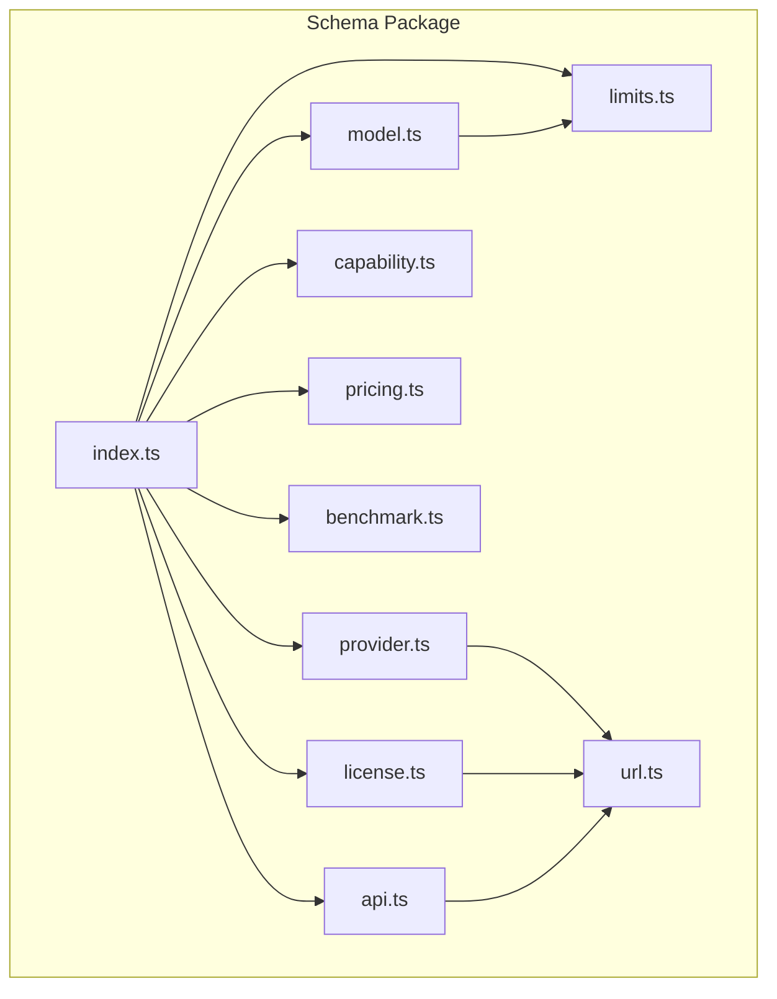
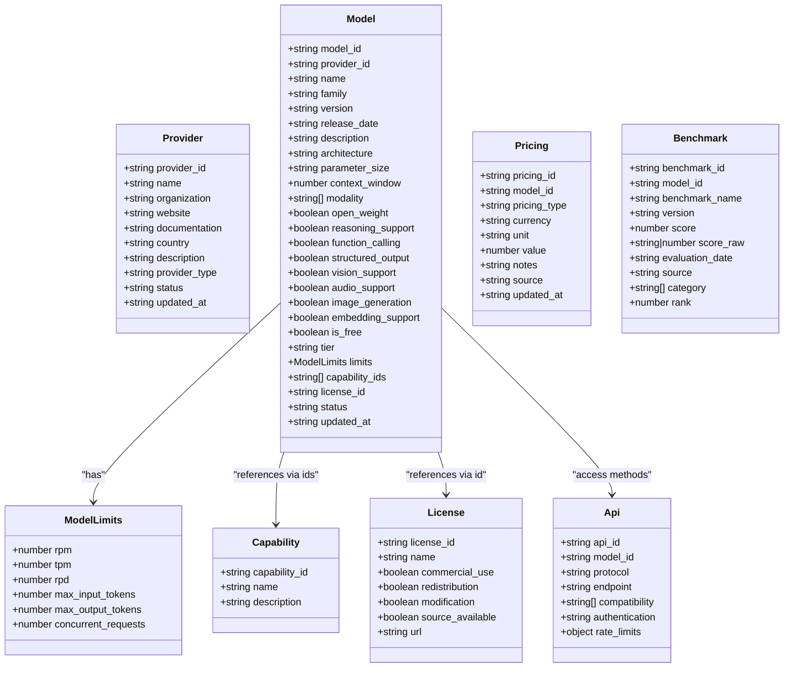
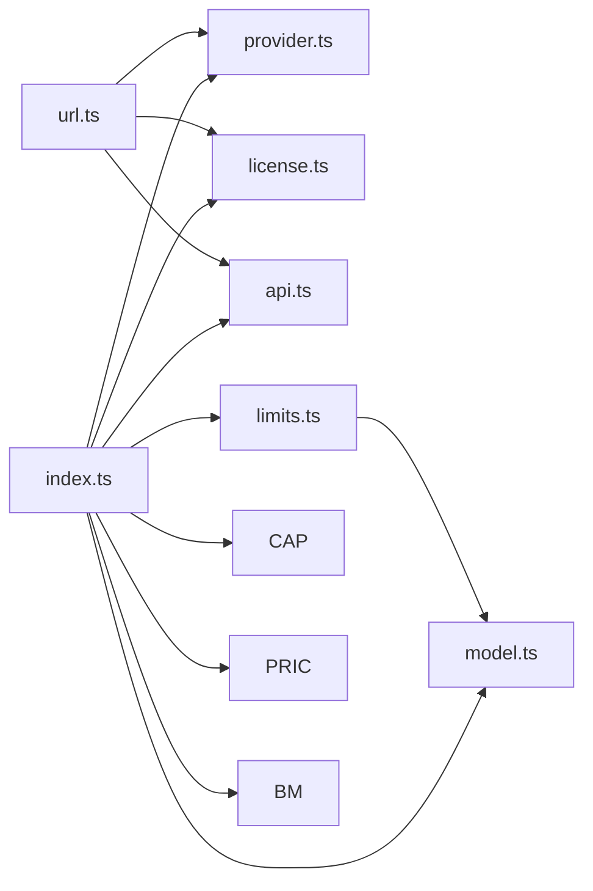

# Schema Package

<cite>
**Referenced Files in This Document**
- [index.ts](file://packages/schema/src/index.ts)
- [provider.ts](file://packages/schema/src/provider.ts)
- [model.ts](file://packages/schema/src/model.ts)
- [capability.ts](file://packages/schema/src/capability.ts)
- [pricing.ts](file://packages/schema/src/pricing.ts)
- [benchmark.ts](file://packages/schema/src/benchmark.ts)
- [license.ts](file://packages/schema/src/license.ts)
- [api.ts](file://packages/schema/src/api.ts)
- [limits.ts](file://packages/schema/src/limits.ts)
- [url.ts](file://packages/schema/src/url.ts)
</cite>

## Table of Contents
1. Introduction
2. Project Structure
3. Core Components
4. Architecture Overview
5. Detailed Component Analysis
6. Dependency Analysis
7. Performance Considerations
8. Troubleshooting Guide
9. Conclusion

## Introduction
The Schema package is the foundational layer that defines canonical TypeScript types and Zod schemas for BaseModel entities. It provides a single source of truth for shared data contracts across the codebase, ensuring type safety at compile time and runtime validation through Zod. The package exports both TypeScript interfaces (via z.infer) and corresponding Zod validators for Provider, Model, Capability, Pricing, Benchmark, License, and API entities, along with supporting utilities like URL validation and model limits.

This documentation explains how Zod is used to enforce schema rules, how TypeScript types are derived from schemas, and how to extend or create new schema types consistently. It also covers usage patterns, error handling strategies, and maintaining consistency across packages that consume these schemas.

## Project Structure
The Schema package organizes each entity into its own module, exporting both the Zod schema and the inferred TypeScript type. A central index re-exports all public symbols for consumers. Supporting modules encapsulate reusable validation logic such as HTTP URL validation and per-model limits.

**Diagram sources**
- [index.ts:10-26](file://packages/schema/src/index.ts#L10-L26)
- [provider.ts:1-29](file://packages/schema/src/provider.ts#L1-L29)
- [model.ts:1-65](file://packages/schema/src/model.ts#L1-L65)
- [capability.ts:1-19](file://packages/schema/src/capability.ts#L1-L19)
- [pricing.ts:1-35](file://packages/schema/src/pricing.ts#L1-L35)
- [benchmark.ts:1-28](file://packages/schema/src/benchmark.ts#L1-L28)
- [license.ts:1-23](file://packages/schema/src/license.ts#L1-L23)
- [api.ts:1-28](file://packages/schema/src/api.ts#L1-L28)
- [limits.ts:1-21](file://packages/schema/src/limits.ts#L1-L21)
- [url.ts:1-15](file://packages/schema/src/url.ts#L1-L15)

**Section sources**
- [index.ts:1-27](file://packages/schema/src/index.ts#L1-L27)

## Core Components
This section summarizes the core entities defined by the Schema package and their responsibilities.

- Provider: Represents an organization that develops, publishes, hosts, or distributes AI models. Includes identifiers, names, optional website/documentation URLs, country, description, provider_type, status, and updated_at timestamp.
- Model: Central entity representing a specific model. Contains identifiers, core attributes, technical characteristics, capability flags, economics and tier, operational limits, relationships via IDs, status, and updated_at timestamp.
- Capability: Canonical vocabulary of named capabilities shared across models.
- Pricing: Describes pricing records for a model, including pricing_type, currency, unit, value, notes, source, and updated_at timestamp.
- Benchmark: Evaluation results for a model on a benchmark, including score constraints, raw score, evaluation date, source, category, and rank.
- License: Legal terms governing a model, including boolean permissions and optional license URL.
- API: Access methods for a model, including protocol, endpoint, compatibility, authentication, and rate limits.
- ModelLimits: Per-model operational limits such as RPM, TPM, RPD, max input/output tokens, and concurrent requests.
- HttpUrlSchema: Reusable validator ensuring URLs use http or https schemes.

These components collectively ensure consistent data modeling and validation across the system.

**Section sources**
- [provider.ts:10-28](file://packages/schema/src/provider.ts#L10-L28)
- [model.ts:11-62](file://packages/schema/src/model.ts#L11-L62)
- [capability.ts:10-16](file://packages/schema/src/capability.ts#L10-L16)
- [pricing.ts:10-32](file://packages/schema/src/pricing.ts#L10-L32)
- [benchmark.ts:9-25](file://packages/schema/src/benchmark.ts#L9-L25)
- [license.ts:10-20](file://packages/schema/src/license.ts#L10-L20)
- [api.ts:11-25](file://packages/schema/src/api.ts#L11-L25)
- [limits.ts:11-18](file://packages/schema/src/limits.ts#L11-L18)
- [url.ts:4-14](file://packages/schema/src/url.ts#L4-L14)

## Architecture Overview
The Schema package uses a layered approach where each entity has a dedicated Zod schema and an inferred TypeScript type. Shared validation logic is extracted into reusable schemas (e.g., HttpUrlSchema). Consumers import the schemas for runtime validation and the types for compile-time safety.

**Diagram sources**
- [provider.ts:10-28](file://packages/schema/src/provider.ts#L10-L28)
- [model.ts:11-62](file://packages/schema/src/model.ts#L11-L28)
- [limits.ts:11-18](file://packages/schema/src/limits.ts#L11-L18)
- [capability.ts:10-16](file://packages/schema/src/capability.ts#L10-L16)
- [pricing.ts:10-32](file://packages/schema/src/pricing.ts#L10-L32)
- [benchmark.ts:9-25](file://packages/schema/src/benchmark.ts#L9-L25)
- [license.ts:10-20](file://packages/schema/src/license.ts#L10-L20)
- [api.ts:11-25](file://packages/schema/src/api.ts#L11-L25)

## Detailed Component Analysis

### Provider Schema
The Provider schema enforces kebab-case identifiers, required name and organization, optional website and documentation URLs validated via HttpUrlSchema, optional country and description, enumerated provider_type and status, and an optional ISO datetime updated_at.

Key behaviors:
- Identifier format enforced via regex.
- Optional fields never fabricated; only set when real data exists.
- Freshness timestamp supports staleness detection.

Usage pattern:
- Validate incoming provider payloads before persisting.
- Infer TypeScript type for compile-time safety.

Error handling:
- Zod throws detailed errors for invalid formats or missing required fields.
- Custom messages guide users to correct formatting.

**Section sources**
- [provider.ts:10-28](file://packages/schema/src/provider.ts#L10-L28)
- [url.ts:4-14](file://packages/schema/src/url.ts#L4-L14)

### Model Schema
The Model schema is the central entity with extensive fields:
- Identifiers: model_id and provider_id with strict formats.
- Core attributes: name, family, version, release_date (ISO date), description.
- Technical characteristics: architecture, parameter_size, context_window, modality array.
- Capability flags: open_weight, reasoning_support, function_calling, structured_output, vision_support, audio_support, image_generation, embedding_support.
- Economics and limits: is_free, tier, limits object.
- Relationships: capability_ids array and license_id string.
- Status and freshness: status enum and updated_at datetime.

Validation highlights:
- model_id must follow "{provider_id}/{model-slug}" format.
- release_date must be ISO 8601 date.
- modality values constrained to a fixed set.
- limits object optional and validated via ModelLimitsSchema.

Usage pattern:
- Validate model definitions during ingestion or enrichment.
- Use inferred type for safe property access throughout pipelines.

Error handling:
- Regex and enum validations provide clear error messages.
- Optional fields allow incremental enrichment without failing validation.

**Section sources**
- [model.ts:11-62](file://packages/schema/src/model.ts#L11-L62)
- [limits.ts:11-18](file://packages/schema/src/limits.ts#L11-L18)

### Capability Schema
The Capability schema defines a canonical vocabulary:
- capability_id enforced as kebab-case.
- name required; description optional.

Usage pattern:
- Maintain a controlled list of capabilities referenced by models.
- Validate capability entries before linking to models.

**Section sources**
- [capability.ts:10-16](file://packages/schema/src/capability.ts#L10-L16)

### Pricing Schema
The Pricing schema captures pricing records:
- pricing_id and model_id required.
- pricing_type constrained to a fixed set (free, input-token, output-token, cached-token, request, subscription).
- currency length 3 (ISO 4217) optional; unit optional; value non-negative optional.
- notes optional; source indicates provenance; updated_at optional.

Usage pattern:
- Store multiple pricing records per model to reflect different cost structures.
- Validate price inputs and track source for auditability.

**Section sources**
- [pricing.ts:10-32](file://packages/schema/src/pricing.ts#L10-L32)

### Benchmark Schema
The Benchmark schema represents evaluation results:
- benchmark_id and model_id required.
- benchmark_name required; version optional.
- score constrained between 0 and 100; score_raw can be string or number.
- evaluation_date optional ISO date; source constrained to a fixed set; category array default empty; rank optional.

Usage pattern:
- Record scores from various sources and categories.
- Validate numeric ranges and optional dates.

**Section sources**
- [benchmark.ts:9-25](file://packages/schema/src/benchmark.ts#L9-L25)

### License Schema
The License schema defines legal terms:
- license_id enforced as kebab-case with allowed segments.
- name required; boolean flags for commercial_use, redistribution, modification, source_available.
- url optional and validated via HttpUrlSchema.

Usage pattern:
- Attach licenses to models to clarify legal usage.
- Ensure URLs are safe and valid.

**Section sources**
- [license.ts:10-20](file://packages/schema/src/license.ts#L10-L20)
- [url.ts:4-14](file://packages/schema/src/url.ts#L4-L14)

### API Schema
The API schema describes access methods:
- api_id and model_id required.
- protocol constrained to a fixed set; endpoint optional and validated via HttpUrlSchema.
- compatibility array optional; authentication constrained to a fixed set.
- rate_limits object optional with positive integer fields.

Usage pattern:
- Document how models are consumed via different protocols.
- Validate endpoints and authentication mechanisms.

**Section sources**
- [api.ts:11-25](file://packages/schema/src/api.ts#L11-L25)
- [url.ts:4-14](file://packages/schema/src/url.ts#L4-L14)

### ModelLimits Schema
The ModelLimits schema captures operational constraints:
- All fields optional positive integers: rpm, tpm, rpd, max_input_tokens, max_output_tokens, concurrent_requests.

Usage pattern:
- Enrich models with provider-reported limits incrementally.
- Validate limit values to ensure positivity and integer types.

**Section sources**
- [limits.ts:11-18](file://packages/schema/src/limits.ts#L11-L18)

### HttpUrlSchema
The HttpUrlSchema ensures URLs are fetchable web URLs using http or https schemes:
- Uses built-in URL validation plus custom refine to restrict scheme.

Usage pattern:
- Reuse across entities requiring safe URLs (Provider, License, API).

**Section sources**
- [url.ts:4-14](file://packages/schema/src/url.ts#L4-L14)

## Dependency Analysis
The Schema package exhibits low coupling with clear separation of concerns:
- Each entity schema is self-contained and exports both schema and inferred type.
- Shared validation logic (HttpUrlSchema) is reused across multiple entities.
- Model depends on ModelLimits for nested validation.
- Index centralizes exports for easy consumption.

**Diagram sources**
- [url.ts:4-14](file://packages/schema/src/url.ts#L4-L14)
- [limits.ts:11-18](file://packages/schema/src/limits.ts#L11-L18)
- [index.ts:10-26](file://packages/schema/src/index.ts#L10-L26)
- [provider.ts:10-28](file://packages/schema/src/provider.ts#L10-L28)
- [model.ts:11-62](file://packages/schema/src/model.ts#L11-L62)
- [capability.ts:10-16](file://packages/schema/src/capability.ts#L10-L16)
- [pricing.ts:10-32](file://packages/schema/src/pricing.ts#L10-L32)
- [benchmark.ts:9-25](file://packages/schema/src/benchmark.ts#L9-L25)
- [license.ts:10-20](file://packages/schema/src/license.ts#L10-L20)
- [api.ts:11-25](file://packages/schema/src/api.ts#L11-L25)

**Section sources**
- [index.ts:10-26](file://packages/schema/src/index.ts#L10-L26)

## Performance Considerations
- Validation overhead: Zod schemas run at runtime; keep schemas minimal and avoid expensive computations inside refinements.
- Reuse shared schemas: HttpUrlSchema reduces duplication and centralizes URL validation logic.
- Optional fields: Allow incremental enrichment without failing validation, reducing re-validation costs.
- Enumerations: Prefer enums over free-form strings to minimize validation complexity and improve performance.

[No sources needed since this section provides general guidance]

## Troubleshooting Guide
Common issues and strategies:
- Invalid identifier formats: Ensure provider_id, model_id, capability_id, and license_id follow kebab-case rules. Check regex messages for guidance.
- Date and datetime fields: Verify release_date and evaluation_date are ISO 8601 dates; updated_at should be ISO 8601 datetime if present.
- URL validation: Confirm endpoint and website/documentation URLs use http or https schemes.
- Enum mismatches: Align values with allowed enums (e.g., provider_type, status, pricing_type, source).
- Missing required fields: Provide mandatory fields like name, provider_id, model_id, etc.

Error handling strategy:
- Catch Zod validation errors and surface user-friendly messages.
- Log validation failures for debugging while preserving privacy.
- Use optional fields to tolerate incomplete data during enrichment.

**Section sources**
- [provider.ts:10-28](file://packages/schema/src/provider.ts#L10-L28)
- [model.ts:11-62](file://packages/schema/src/model.ts#L11-L62)
- [pricing.ts:10-32](file://packages/schema/src/pricing.ts#L10-L32)
- [benchmark.ts:9-25](file://packages/schema/src/benchmark.ts#L9-L25)
- [license.ts:10-20](file://packages/schema/src/license.ts#L10-L20)
- [api.ts:11-25](file://packages/schema/src/api.ts#L11-L25)
- [url.ts:4-14](file://packages/schema/src/url.ts#L4-L14)

## Conclusion
The Schema package establishes a robust foundation for BaseModel by defining canonical TypeScript types and Zod schemas for key entities. It ensures type safety at compile time and runtime validation through carefully crafted schemas. By leveraging shared validation logic, enumerations, and optional fields, the package balances correctness with flexibility. Consumers benefit from consistent data contracts, clear error messages, and maintainable extension points for new schema types.

[No sources needed since this section summarizes without analyzing specific files]