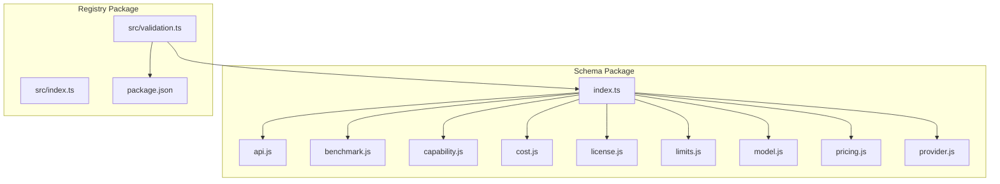
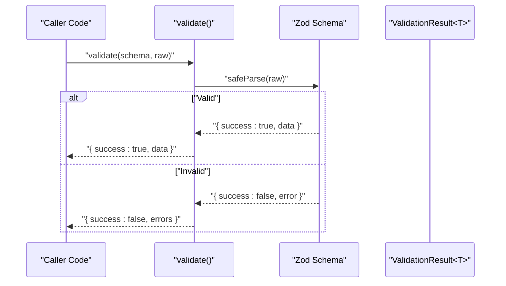
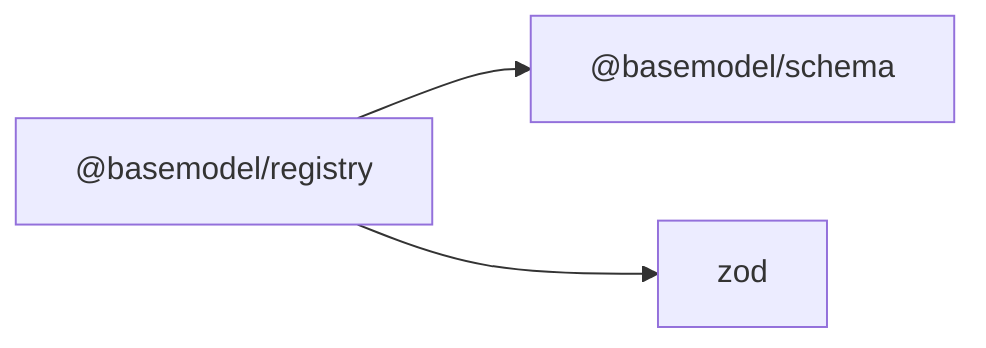

# Type Definitions

<cite>
**Referenced Files in This Document**
- [packages/schema/src/index.ts](file://packages/schema/src/index.ts)
- [packages/registry/src/validation.ts](file://packages/registry/src/validation.ts)
- [packages/registry/package.json](file://packages/registry/package.json)
</cite>

## Table of Contents
1. [Introduction](#introduction)
2. [Project Structure](#project-structure)
3. [Core Components](#core-components)
4. [Architecture Overview](#architecture-overview)
5. [Detailed Component Analysis](#detailed-component-analysis)
6. [Dependency Analysis](#dependency-analysis)
7. [Performance Considerations](#performance-considerations)
8. [Troubleshooting Guide](#troubleshooting-guide)
9. [Conclusion](#conclusion)
10. [Appendices](#appendices)

## Introduction
This document explains the TypeScript type definitions exported by the Schema package and how they relate to Zod schemas. It focuses on:
- The exported interfaces and utility types that complement Zod schemas
- How to derive TypeScript types from schemas using z.infer
- Generic type patterns, conditional types, and advanced TypeScript features used across schema definitions
- Type-safe usage patterns and best practices for maintaining type consistency across packages

The Schema package is the canonical source of truth for shared data contracts and exposes both runtime validation (Zod schemas) and compile-time types. Consumers can use either approach or combine them for robust, end-to-end type safety.

## Project Structure
At a high level, the Schema package re-exports types and schemas for core entities such as Api, Benchmark, Capability, License, ModelLimits, Model, Pricing, and Provider. A registry layer consumes these schemas and provides helper utilities for validation without throwing.

**Diagram sources**
- [packages/schema/src/index.ts:1-27](file://packages/schema/src/index.ts#L1-L27)
- [packages/registry/src/validation.ts:1-42](file://packages/registry/src/validation.ts#L1-L42)
- [packages/registry/package.json:1-34](file://packages/registry/package.json#L1-L34)

**Section sources**
- [packages/schema/src/index.ts:1-27](file://packages/schema/src/index.ts#L1-L27)
- [packages/registry/package.json:1-34](file://packages/registry/package.json#L1-L34)

## Core Components
The Schema package exports:
- Types for domain entities: Api, Benchmark, Capability, License, ModelLimits, Model, Pricing, Provider
- Zod schemas for each entity: ApiSchema, BenchmarkSchema, CapabilitySchema, LicenseSchema, ModelLimitsSchema, ModelSchema, PricingSchema, ProviderSchema
- Cost constants and helpers: BLENDED_DIVISOR, blendedCost, INPUT_WEIGHT, OUTPUT_WEIGHT

These exports enable two complementary workflows:
- Runtime validation via Zod schemas
- Compile-time type inference via z.infer or direct type imports

Key relationships:
- Each entity has a corresponding type and schema pair
- Consumers can import either the type or the schema depending on their needs
- Utility functions in the registry layer wrap Zod’s safe parsing into non-throwing helpers with typed results

**Section sources**
- [packages/schema/src/index.ts:10-26](file://packages/schema/src/index.ts#L10-L26)

## Architecture Overview
The architecture centers around a single source of truth for data contracts. Schemas define runtime behavior; types define compile-time guarantees. The registry layer uses these schemas to validate inputs safely and consistently.

**Diagram sources**
- [packages/registry/src/validation.ts:1-42](file://packages/registry/src/validation.ts#L1-L42)

## Detailed Component Analysis

### Schema Index Exports
The index file re-exports all domain types and schemas, ensuring consumers have a single entry point. It also re-exports cost-related constants and helpers.

What it provides:
- Type-only exports for compile-time safety
- Schema exports for runtime validation
- Constants and helpers for cost calculations

Usage patterns:
- Import the type when you only need static typing
- Import the schema when you need runtime validation
- Use z.infer to derive types directly from schemas if you prefer schema-driven types

**Section sources**
- [packages/schema/src/index.ts:10-26](file://packages/schema/src/index.ts#L10-L26)

### Validation Utilities
The registry layer offers non-throwing validation helpers that integrate seamlessly with Zod schemas.

Highlights:
- ValidationResult<T> discriminated union for success/failure cases
- validate<T>(schema, raw) returns a typed result without throwing
- validateMany<T>(schema, records) batches validation and collects per-row errors

Type safety:
- T is inferred from the provided ZodSchema<T>, ensuring strong typing throughout
- Error messages are normalized into string arrays for consistent handling

Best practices:
- Always pass strongly-typed Zod schemas to maintain type inference
- Prefer validateMany for bulk operations to reduce overhead and simplify error reporting

**Section sources**
- [packages/registry/src/validation.ts:1-42](file://packages/registry/src/validation.ts#L1-L42)

### Dependency Declarations
The registry package declares its dependency on @basemodel/schema and zod, ensuring consistent versions and enabling type resolution.

Key points:
- workspace:* ensures local development uses the current schema package
- zod version pinning ensures compatibility with schema definitions

**Section sources**
- [packages/registry/package.json:1-34](file://packages/registry/package.json#L1-L34)

## Dependency Analysis
The Schema package is consumed by other packages (e.g., registry). The registry depends on both @basemodel/schema and zod. This creates a clear boundary where schemas and types are centralized, and consumers rely on them for validation and typing.

**Diagram sources**
- [packages/registry/package.json:1-34](file://packages/registry/package.json#L1-L34)

**Section sources**
- [packages/registry/package.json:1-34](file://packages/registry/package.json#L1-L34)

## Performance Considerations
- Prefer z.infer over duplicating types to avoid drift and reduce maintenance overhead
- Use validateMany for batch validations to minimize repeated schema parsing overhead
- Keep schemas focused and composable to reduce parse complexity
- Avoid heavy transformations inside schemas; pre-process data when possible

[No sources needed since this section provides general guidance]

## Troubleshooting Guide
Common issues and resolutions:
- Type mismatch between raw input and schema: ensure the input conforms to the expected structure before calling validate
- Unexpected errors in validateMany: inspect the invalid array for per-row error details
- Version conflicts: align zod versions across packages to prevent schema incompatibilities

Where to look:
- ValidationResult<T> shape for understanding success/failure payloads
- Error mapping logic for human-readable paths and messages

**Section sources**
- [packages/registry/src/validation.ts:1-42](file://packages/registry/src/validation.ts#L1-L42)

## Conclusion
The Schema package centralizes data contracts through Zod schemas and TypeScript types. By combining runtime validation with compile-time inference, teams can achieve robust type safety across the codebase. Using z.infer, generic helpers like validate and validateMany, and disciplined export patterns ensures consistency and reduces drift. Adopting the recommended usage patterns will help maintain clarity, correctness, and performance.

[No sources needed since this section summarizes without analyzing specific files]

## Appendices

### Deriving Types from Schemas with z.infer
- Use z.infer<typeof YourSchema> to derive the exact type validated by the schema
- Prefer deriving types from schemas when the schema is the source of truth
- When sharing types across packages, export both the schema and the derived type for flexibility

Example pattern:
- Define schema in Schema package
- Export schema and derive type via z.infer
- Import schema for runtime validation and type for compile-time checks

[No sources needed since this section provides general guidance]

### Best Practices for Type Consistency Across Packages
- Centralize schemas and types in the Schema package
- Re-export only what consumers need to keep the public surface minimal
- Pin zod versions to avoid breaking changes
- Validate early at boundaries (APIs, I/O) using validate or validateMany
- Keep error messages consistent and actionable

[No sources needed since this section provides general guidance]