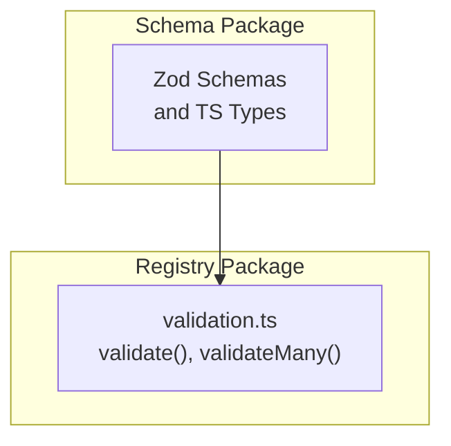
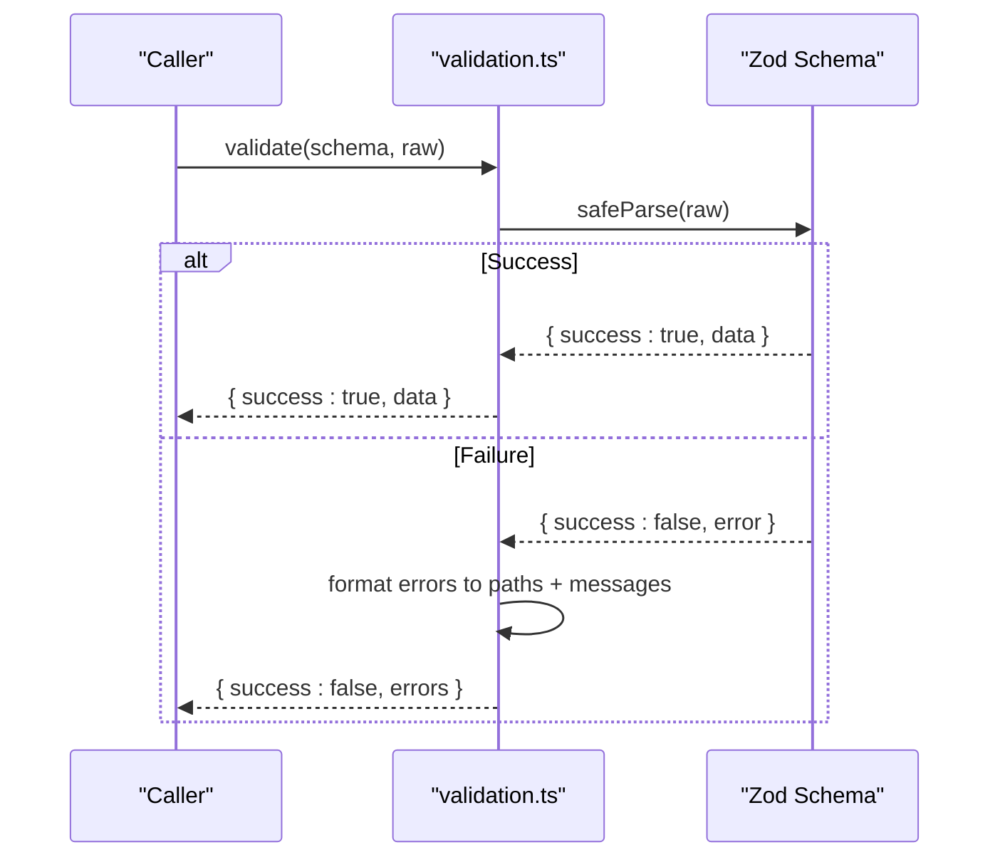
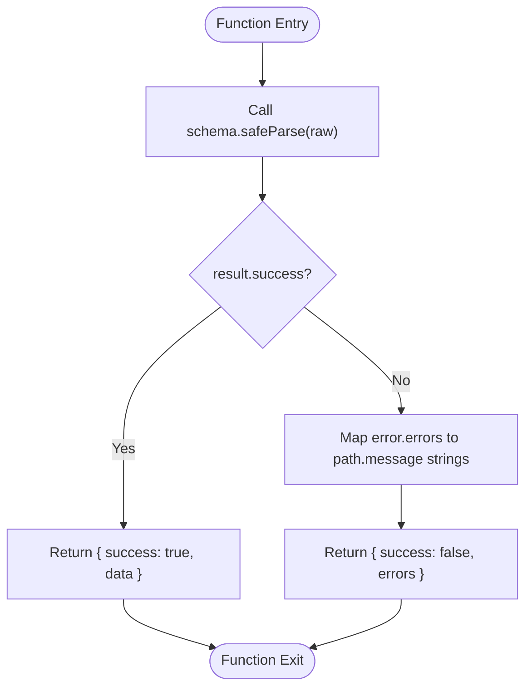
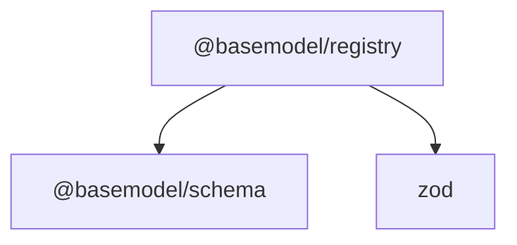

# Validation System

<cite>
**Referenced Files in This Document**
- [README.md](file://README.md)
- [packages/schema/package.json](file://packages/schema/package.json)
- [packages/registry/package.json](file://packages/registry/package.json)
- [packages/registry/src/validation.ts](file://packages/registry/src/validation.ts)
</cite>

## Table of Contents
1. [Introduction](#introduction)
2. [Project Structure](#project-structure)
3. [Core Components](#core-components)
4. [Architecture Overview](#architecture-overview)
5. [Detailed Component Analysis](#detailed-component-analysis)
6. [Dependency Analysis](#dependency-analysis)
7. [Performance Considerations](#performance-considerations)
8. [Troubleshooting Guide](#troubleshooting-guide)
9. [Conclusion](#conclusion)
10. [Appendices](#appendices)

## Introduction
This document explains the Zod-based validation system used throughout BaseModel, focusing on how schemas provide both runtime validation and TypeScript type inference. It covers custom validation rules, conditional validations, error handling strategies, schema composition patterns, reusable validation functions, testing approaches for schema validation, examples of complex validation scenarios, performance considerations, and debugging techniques for validation errors.

BaseModel’s architecture separates canonical schemas (defined in the schema package) from registry utilities that perform validation and normalization. The registry layer uses Zod to validate incoming data against these schemas and returns structured results suitable for downstream processing.

**Section sources**
- [README.md:10-17](file://README.md#L10-L17)

## Project Structure
The repository organizes validation-related code across two primary packages:
- @basemodel/schema: Defines canonical Zod schemas and TypeScript types for all entities.
- @basemodel/registry: Implements validation helpers and utilities that consume schemas and return typed results.

**Diagram sources**
- [packages/schema/package.json:1-48](file://packages/schema/package.json#L1-L48)
- [packages/registry/package.json:1-35](file://packages/registry/package.json#L1-L35)
- [packages/registry/src/validation.ts:1-42](file://packages/registry/src/validation.ts#L1-L42)

**Section sources**
- [README.md:10-17](file://README.md#L10-L17)
- [packages/schema/package.json:1-48](file://packages/schema/package.json#L1-L48)
- [packages/registry/package.json:1-35](file://packages/registry/package.json#L1-L35)

## Core Components
At the heart of the validation system are two helper functions in the registry package:
- validate(schema, raw): Validates a single value against a Zod schema without throwing, returning a discriminated union with either validated data or an array of human-readable error strings.
- validateMany(schema, records): Validates multiple records, collecting valid items and per-row invalid entries with their indices and errors.

These helpers leverage Zod’s safeParse to avoid exceptions and produce consistent, typed outputs. Error messages are flattened into dot-path strings for easy consumption by UIs or logs.

Key behaviors:
- Non-throwing validation via safeParse
- Discriminated union result shape for success/failure
- Path-aware error formatting
- Batch validation with row-level error tracking

**Section sources**
- [packages/registry/src/validation.ts:1-42](file://packages/registry/src/validation.ts#L1-L42)

## Architecture Overview
The validation flow integrates Zod schemas with registry utilities to ensure data integrity at ingestion points.

**Diagram sources**
- [packages/registry/src/validation.ts:11-20](file://packages/registry/src/validation.ts#L11-L20)

## Detailed Component Analysis

### Registry Validation Helpers
The registry exposes two primary functions:
- validate<T>(schema, raw): Returns a ValidationResult<T> discriminated union. On failure, it maps ZodError issues into string messages with dot-separated paths.
- validateMany<T>(schema, records): Iterates over records, calling validate for each, and aggregates valid items and invalid rows with index and errors.

Complexity:
- validate: O(1) per record plus schema parsing cost
- validateMany: O(n) where n is number of records

**Diagram sources**
- [packages/registry/src/validation.ts:11-20](file://packages/registry/src/validation.ts#L11-L20)

**Section sources**
- [packages/registry/src/validation.ts:1-42](file://packages/registry/src/validation.ts#L1-L42)

### Schema Composition Patterns
While the canonical schemas live in the schema package, typical composition patterns include:
- Object schemas with required/optional fields using .required() and .optional()
- Union schemas for polymorphic payloads using .union([...])
- Intersection schemas for combining base and extended shapes using .intersection(...)
- Refinement and transform for custom logic using .refine(...) and .transform(...)
- Conditional schemas using .superRefine(...) or .pipe(...) for cross-field constraints

These patterns enable reusable building blocks that can be composed across entity definitions.

[No sources needed since this section describes general schema composition patterns]

### Custom Validation Rules and Conditional Validations
Custom rules can be implemented via:
- .refine(predicate, message) for simple field-level checks
- .superRefine((data, ctx)) for advanced multi-field validations and contextual error reporting
- .transform(fn) for normalizing values before validation
- .pipe(validators...) for chaining transformations and validations

Conditional validations can depend on other fields or external context, enabling flexible business rules while maintaining strong typing.

[No sources needed since this section describes general validation techniques]

### Error Handling Strategies
The registry’s validate function centralizes error handling:
- Uses safeParse to avoid throwing exceptions
- Converts ZodError issues into user-friendly strings with dot paths
- Provides a consistent ValidationResult<T> shape for consumers

For batch operations, validateMany isolates failures per row, preserving successful records and associating errors with indices.

**Section sources**
- [packages/registry/src/validation.ts:11-20](file://packages/registry/src/validation.ts#L11-L20)
- [packages/registry/src/validation.ts:25-42](file://packages/registry/src/validation.ts#L25-L42)

### Reusable Validation Functions
Common patterns for reusability:
- Define shared primitives (e.g., email, url, id) as reusable schemas
- Create domain-specific validators (e.g., modelMetadata, capabilityFlags)
- Compose higher-order validators that wrap common combinations
- Export factory functions that accept options to customize behavior

These patterns reduce duplication and improve maintainability across the schema package.

[No sources needed since this section describes general reuse patterns]

### Testing Approaches for Schema Validation
Recommended testing practices:
- Use Vitest to assert both valid and invalid inputs
- Test edge cases like null, undefined, empty strings, and boundary values
- Assert error paths and messages for critical fields
- Snapshot test large datasets when appropriate
- Mock external dependencies if validations rely on async or network calls

Example structure:
- Group tests by entity or feature
- Include positive and negative test cases
- Verify type inference remains correct after schema changes

[No sources needed since this section provides general testing guidance]

### Examples of Complex Validation Scenarios
Typical complex scenarios include:
- Cross-field constraints (e.g., start date must be before end date)
- Conditional presence (e.g., field B required if field A equals X)
- Enumerated sets with dynamic membership
- Nested object validation with partial updates
- Array element validation with unique constraints

These can be modeled using refine, superRefine, and union/intersection compositions.

[No sources needed since this section outlines conceptual scenarios]

## Dependency Analysis
The registry package depends on:
- @basemodel/schema for canonical Zod schemas and types
- zod for runtime validation and type inference

**Diagram sources**
- [packages/registry/package.json:22-25](file://packages/registry/package.json#L22-L25)
- [packages/schema/package.json:38-40](file://packages/schema/package.json#L38-L40)

**Section sources**
- [packages/registry/package.json:22-25](file://packages/registry/package.json#L22-L25)
- [packages/schema/package.json:38-40](file://packages/schema/package.json#L38-L40)

## Performance Considerations
- Prefer safeParse over parse to avoid exception overhead in hot paths
- Cache frequently used schemas where possible to reduce construction costs
- Avoid deep nesting and excessive transforms in high-throughput scenarios
- Use lazy evaluation (.lazy()) for recursive structures to prevent stack overflow
- Profile validation bottlenecks with benchmarks and adjust schema complexity accordingly

[No sources needed since this section provides general performance guidance]

## Troubleshooting Guide
Common issues and resolutions:
- Unexpected type coercion: Ensure strict mode and explicit transforms are used
- Missing error details: Inspect ZodError.errors and verify path formatting
- Performance regressions: Simplify schemas or introduce caching
- Type inference mismatches: Confirm schema exports match expected types
- Batch validation confusion: Review validateMany output structure for valid vs invalid arrays

Debugging tips:
- Log intermediate values before validation
- Use console.dir on ZodError for detailed inspection
- Isolate failing records with indices from validateMany
- Add descriptive messages in refine/superRefine for clarity

**Section sources**
- [packages/registry/src/validation.ts:11-20](file://packages/registry/src/validation.ts#L11-L20)
- [packages/registry/src/validation.ts:25-42](file://packages/registry/src/validation.ts#L25-L42)

## Conclusion
The Zod-based validation system in BaseModel provides robust runtime validation and seamless TypeScript type inference through well-defined schemas and centralized registry utilities. By leveraging safeParse, discriminated unions, and structured error formatting, the system ensures reliable data integrity across ingestion points. Compositional patterns, reusable validators, and comprehensive testing strategies further enhance maintainability and scalability.

[No sources needed since this section summarizes without analyzing specific files]

## Appendices

### API Reference: Registry Validation Helpers
- validate<T>(schema, raw): Returns ValidationResult<T>
  - Success case: { success: true; data: T }
  - Failure case: { success: false; errors: string[] }
- validateMany<T>(schema, records): Returns { valid: T[]; invalid: { index: number; errors: string[] }[] }

**Section sources**
- [packages/registry/src/validation.ts:1-42](file://packages/registry/src/validation.ts#L1-L42)