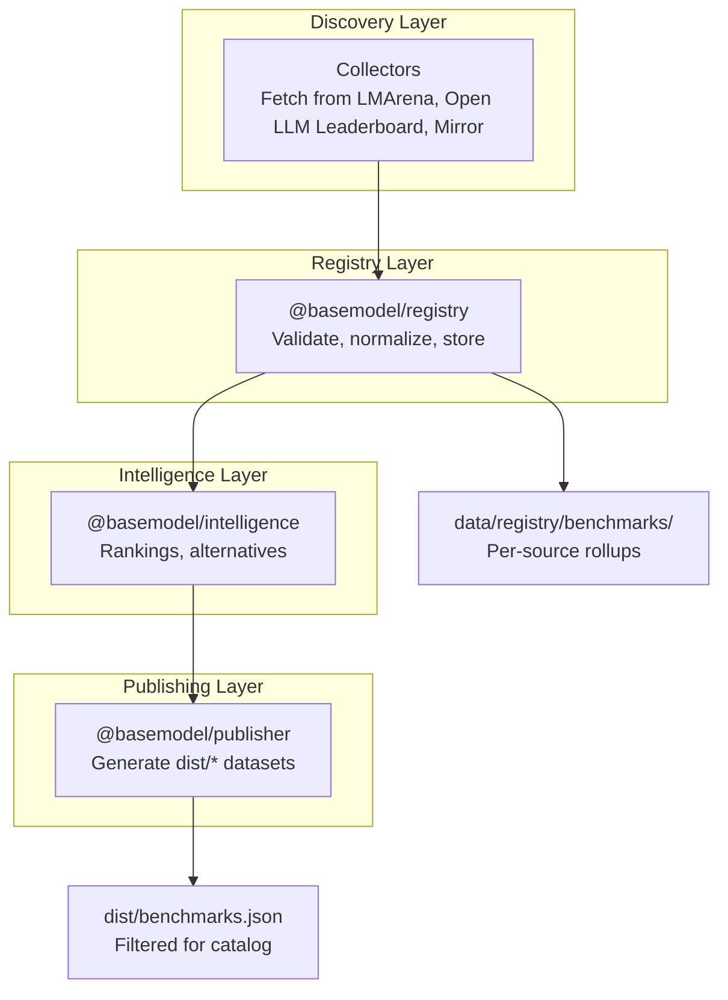
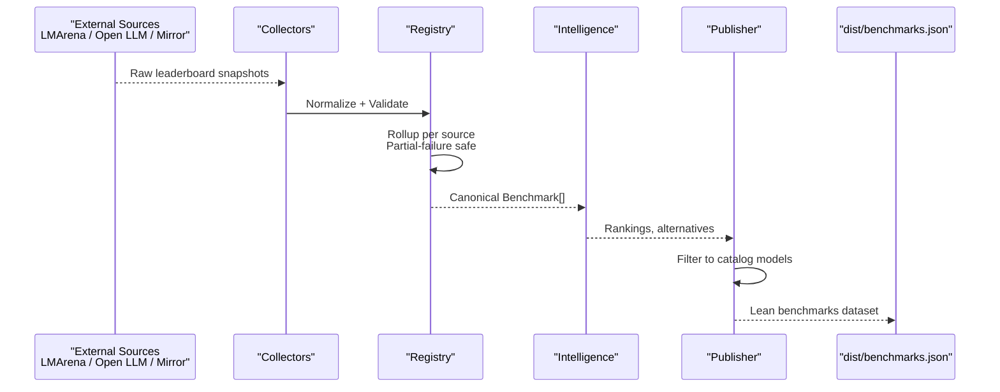
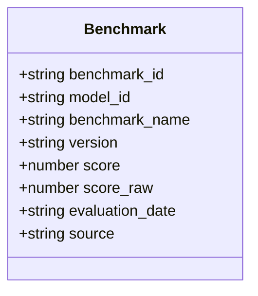
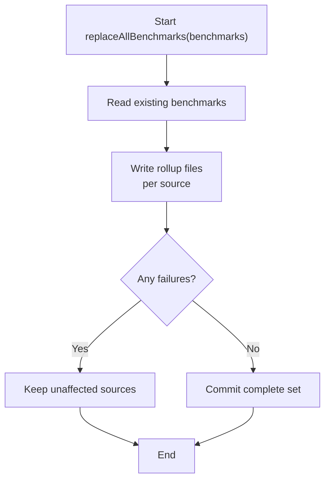
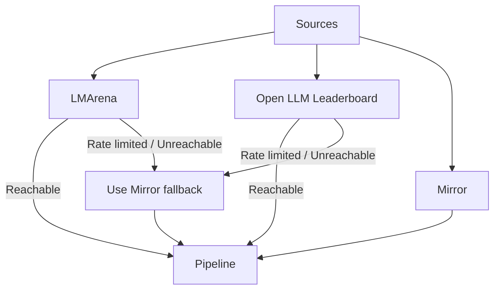
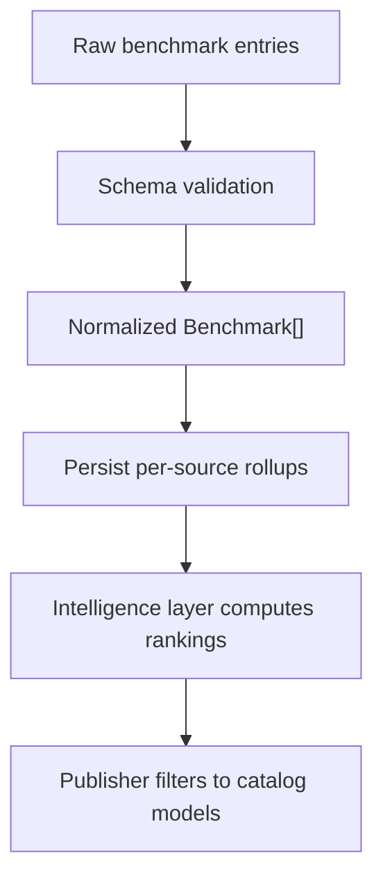
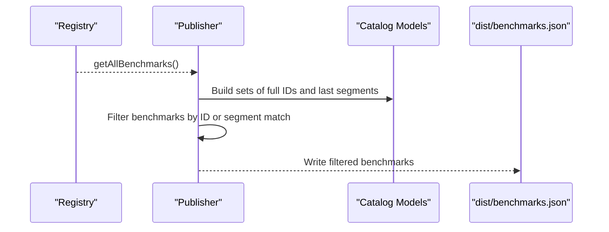
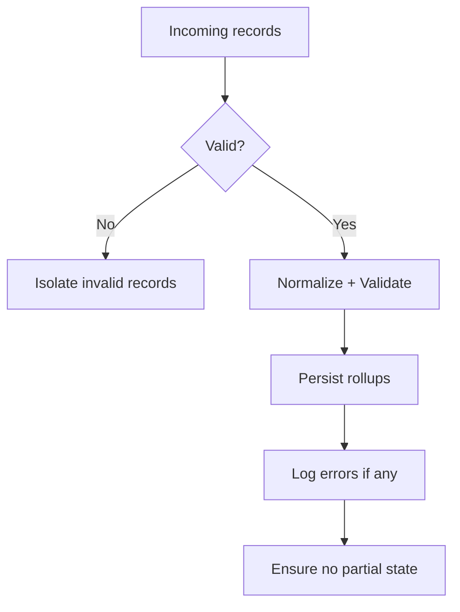
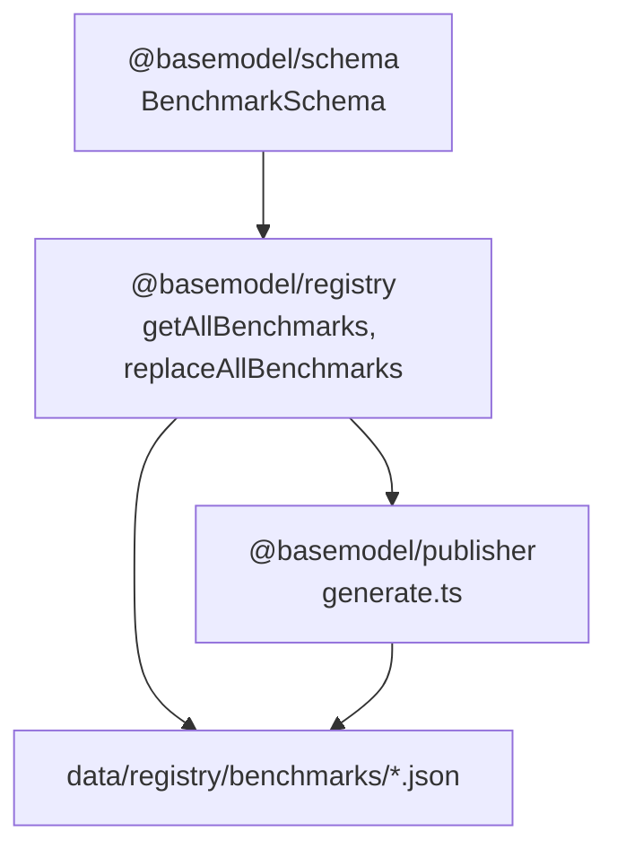

# Benchmark Integration & Performance Metrics

<cite>
**Referenced Files in This Document**
- [README.md](file://README.md)
- [03_Architecture.md](file://docs/03_Architecture.md)
- [04_Pipeline.md](file://docs/04_Pipeline.md)
- [05_Data_Model.md](file://docs/05_Data_Model.md)
- [index.ts](file://packages/registry/src/index.ts)
- [generate.ts](file://packages/publisher/src/generate.ts)
- [mirror.json](file://data/registry/benchmarks/mirror.json)
</cite>

## Table of Contents
1. [Introduction](#introduction)
2. [Project Structure](#project-structure)
3. [Core Components](#core-components)
4. [Architecture Overview](#architecture-overview)
5. [Detailed Component Analysis](#detailed-component-analysis)
6. [Dependency Analysis](#dependency-analysis)
7. [Performance Considerations](#performance-considerations)
8. [Troubleshooting Guide](#troubleshooting-guide)
9. [Conclusion](#conclusion)
10. [Appendices](#appendices)

## Introduction
This document explains how benchmark integration and performance metrics are collected, standardized, stored, and published within the project. It covers benchmark sources, evaluation methodologies, metric standardization, scoring and ranking logic, versioning and update cycles, quality assurance, aggregation strategies, outlier handling, statistical significance considerations, and guidance for integrating new benchmark sources and customizing evaluation criteria.

## Project Structure
The benchmark system spans several layers:
- Discovery and collection: external benchmark sources are ingested by collectors (not included here).
- Registry: canonical storage and validation of benchmark records.
- Intelligence: derived rankings and recommendations (not included here).
- Publishing: generation of static datasets that include benchmarks aligned to catalog models.

**Diagram sources**
- [03_Architecture.md:1-77](file://docs/03_Architecture.md#L1-L77)
- [index.ts:92-122](file://packages/registry/src/index.ts#L92-L122)
- [generate.ts:112-177](file://packages/publisher/src/generate.ts#L112-L177)

**Section sources**
- [README.md:10-30](file://README.md#L10-L30)
- [03_Architecture.md:1-77](file://docs/03_Architecture.md#L1-L77)

## Core Components
- Benchmark data model: Canonical fields define what a benchmark record contains and how it is identified.
- Registry operations: Read/write, validate, and merge benchmark records with partial-failure safety.
- Publisher filtering: Align benchmark rows to catalog models for lean output.

Key responsibilities:
- Standardize heterogeneous benchmark inputs into a uniform schema.
- Persist per-source rollup arrays to support incremental updates and resilience.
- Generate curated datasets for consumption by UIs and downstream tools.

**Section sources**
- [05_Data_Model.md:80-94](file://docs/05_Data_Model.md#L80-L94)
- [index.ts:92-122](file://packages/registry/src/index.ts#L92-L122)
- [generate.ts:162-175](file://packages/publisher/src/generate.ts#L162-L175)

## Architecture Overview
Benchmark data flows through four layers: discovery, registry, intelligence, and publishing. Collectors fetch from public sources; the registry normalizes and persists; intelligence derives rankings; the publisher emits static datasets.

**Diagram sources**
- [04_Pipeline.md:107-139](file://docs/04_Pipeline.md#L107-L139)
- [index.ts:92-122](file://packages/registry/src/index.ts#L92-L122)
- [generate.ts:112-177](file://packages/publisher/src/generate.ts#L112-L177)

## Detailed Component Analysis

### Benchmark Data Model
The Benchmark entity defines the canonical structure for evaluation results. Fields include identifiers, normalized scores, raw scores when available, evaluation date, and provenance source. Optional fields allow versioning and additional context.

**Diagram sources**
- [05_Data_Model.md:80-94](file://docs/05_Data_Model.md#L80-L94)

**Section sources**
- [05_Data_Model.md:80-94](file://docs/05_Data_Model.md#L80-L94)

### Registry Operations for Benchmarks
The registry provides functions to read all benchmark rollups, retrieve individual records, save single records, clear the directory, and replace the entire set while preserving unaffected sources.

**Diagram sources**
- [index.ts:115-122](file://packages/registry/src/index.ts#L115-L122)

**Section sources**
- [index.ts:92-122](file://packages/registry/src/index.ts#L92-L122)

### Benchmark Sources and Evaluation Methodologies
Three primary sources feed the pipeline:
- LMArena: Elo-based rankings across text/webdev/vision via Hugging Face datasets-server.
- Open LLM Leaderboard: Benchmark scores such as MMLU-PRO, GPQA via Hugging Face datasets-server.
- Mirror: Daily snapshot of text/code leaderboards via GitHub raw files.

When primary sources are unreachable or rate-limited, the pipeline falls back to Mirror to ensure ranked data continues to be emitted.

**Diagram sources**
- [04_Pipeline.md:107-139](file://docs/04_Pipeline.md#L107-L139)

**Section sources**
- [04_Pipeline.md:107-139](file://docs/04_Pipeline.md#L107-L139)

### Metric Standardization and Scoring Algorithms
- Normalization: All incoming benchmark records are validated against the canonical schema before storage.
- Scores: The canonical schema includes both normalized `score` and optional `score_raw`, enabling consistent comparisons while retaining original values.
- Ranking: Rankings are computed downstream in the intelligence layer using normalized scores and other signals; the registry preserves source-level rollups for traceability.

**Diagram sources**
- [index.ts:94-98](file://packages/registry/src/index.ts#L94-L98)
- [generate.ts:162-175](file://packages/publisher/src/generate.ts#L162-L175)

**Section sources**
- [index.ts:94-98](file://packages/registry/src/index.ts#L94-L98)
- [generate.ts:162-175](file://packages/publisher/src/generate.ts#L162-L175)

### Comparison Frameworks and Ranking Calculations
- Comparison framework: Canonical model identifiers (`model_id`) enable cross-source comparison. The publisher aligns benchmark rows to catalog models by exact match or last path segment matching to keep outputs lean.
- Ranking calculations: Derived in the intelligence layer based on normalized scores and possibly additional signals; not part of the registry’s responsibility.

**Diagram sources**
- [index.ts:94-98](file://packages/registry/src/index.ts#L94-L98)
- [generate.ts:166-175](file://packages/publisher/src/generate.ts#L166-L175)

**Section sources**
- [generate.ts:166-175](file://packages/publisher/src/generate.ts#L166-L175)

### Benchmark Records Examples
Example benchmark records from the Mirror source demonstrate the canonical fields and categories used for text and code evaluations. Each record includes identifiers, normalized score, raw score, evaluation date, source, category, and rank.

- Example record fields: benchmark_id, model_id, benchmark_name, score, score_raw, evaluation_date, source, category, rank.
- Categories observed: text, code.
- Source: mirror.

These examples illustrate how standardized records appear after normalization and persistence.

**Section sources**
- [mirror.json:1-522](file://data/registry/benchmarks/mirror.json#L1-L522)

### Versioning, Update Cycles, and Quality Assurance
- Versioning: The Benchmark entity supports an optional version field to track changes over time.
- Update cycles: The pipeline runs periodically; registry operations support replacing the entire benchmark set while preserving unaffected sources for partial-failure safety.
- Quality assurance: Invalid records are isolated; valid records continue through the pipeline; errors are logged; the registry avoids partially processed data.

**Diagram sources**
- [04_Pipeline.md:100-105](file://docs/04_Pipeline.md#L100-L105)
- [index.ts:115-122](file://packages/registry/src/index.ts#L115-L122)

**Section sources**
- [04_Pipeline.md:100-105](file://docs/04_Pipeline.md#L100-L105)
- [index.ts:115-122](file://packages/registry/src/index.ts#L115-L122)

### Aggregation Strategies, Outlier Detection, and Statistical Significance
- Aggregation: Per-source rollup arrays preserve source-level granularity; the registry merges new runs with existing ones to maintain unaffected sources.
- Outlier detection: Not implemented in the registry; consumers should apply statistical methods when analyzing aggregated scores.
- Statistical significance: Consumers can compute confidence intervals, effect sizes, and p-values across runs to assess meaningful differences between models.

[No sources needed since this section provides general guidance]

### Integrating New Benchmark Sources and Customizing Evaluation Criteria
To integrate a new benchmark source:
- Add a collector to fetch and normalize data into the canonical Benchmark schema.
- Ensure each record includes required fields: benchmark_id, model_id, benchmark_name, score, source.
- Use optional fields like version and score_raw to capture additional context.
- The registry will validate and persist the new records alongside existing sources.
- The publisher will automatically include new records if they match catalog models.

Customizing evaluation criteria:
- Extend the intelligence layer to incorporate new signals or weighting schemes.
- Maintain canonical schemas for stability; avoid modifying Benchmark fields unless necessary.

[No sources needed since this section provides general guidance]

## Dependency Analysis
The benchmark subsystem depends on:
- Schema definitions for validation and type safety.
- Registry storage utilities for reading/writing and merging rollups.
- Publisher logic for filtering and generating lean datasets.

**Diagram sources**
- [index.ts:1-27](file://packages/registry/src/index.ts#L1-L27)
- [generate.ts:112-177](file://packages/publisher/src/generate.ts#L112-L177)

**Section sources**
- [index.ts:1-27](file://packages/registry/src/index.ts#L1-L27)
- [generate.ts:112-177](file://packages/publisher/src/generate.ts#L112-L177)

## Performance Considerations
- Batch reads and writes: The registry reads all arrays from the benchmarks directory and writes rollups atomically per run to minimize inconsistent states.
- Filtering at publish time: The publisher reduces dataset size by matching only catalog models, improving consumer performance.
- Rate limiting and fallbacks: Optional tokens increase throughput for Hugging Face endpoints; fallback to Mirror ensures continuity under load.

[No sources needed since this section provides general guidance]

## Troubleshooting Guide
Common issues and resolutions:
- Rate limits on Hugging Face endpoints: Configure an access token to increase limits; otherwise, rely on Mirror fallback.
- Partial failures during updates: The registry preserves unaffected sources; re-run the pipeline to refresh failed sources.
- Missing benchmark rows in published dataset: Verify model_id alignment; the publisher matches by full ID or last segment.

**Section sources**
- [04_Pipeline.md:122-139](file://docs/04_Pipeline.md#L122-L139)
- [index.ts:115-122](file://packages/registry/src/index.ts#L115-L122)
- [generate.ts:166-175](file://packages/publisher/src/generate.ts#L166-L175)

## Conclusion
The benchmark integration system standardizes heterogeneous evaluation results into a canonical schema, persists them with resilience, and publishes curated datasets aligned to catalog models. By separating concerns across discovery, registry, intelligence, and publishing layers, the system remains extensible and maintainable. Consumers can extend evaluation criteria and integrate new sources while relying on robust validation, versioning, and update mechanisms.

[No sources needed since this section summarizes without analyzing specific files]

## Appendices
- Benchmark example records: See mirror.json for canonical fields and categories.
- Pipeline documentation: See docs/04_Pipeline.md for sources, failure handling, and token configuration.
- Data model: See docs/05_Data_Model.md for the Benchmark entity definition.

**Section sources**
- [mirror.json:1-522](file://data/registry/benchmarks/mirror.json#L1-L522)
- [04_Pipeline.md:100-139](file://docs/04_Pipeline.md#L100-L139)
- [05_Data_Model.md:80-94](file://docs/05_Data_Model.md#L80-L94)