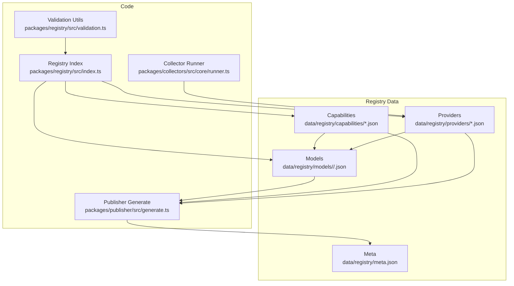
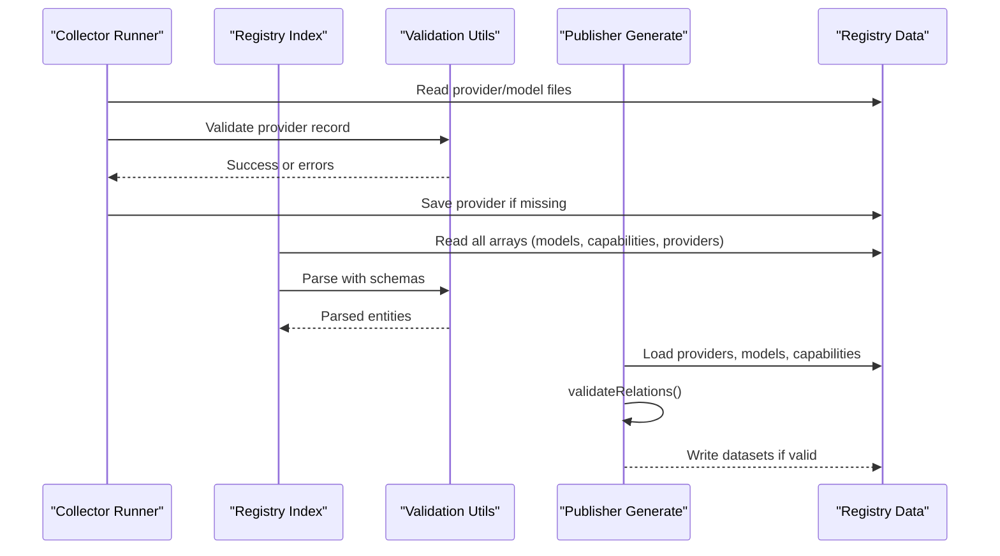
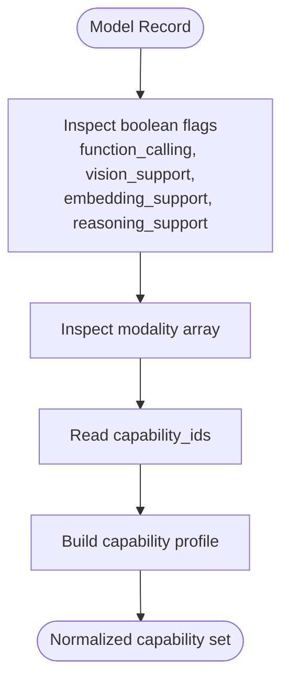
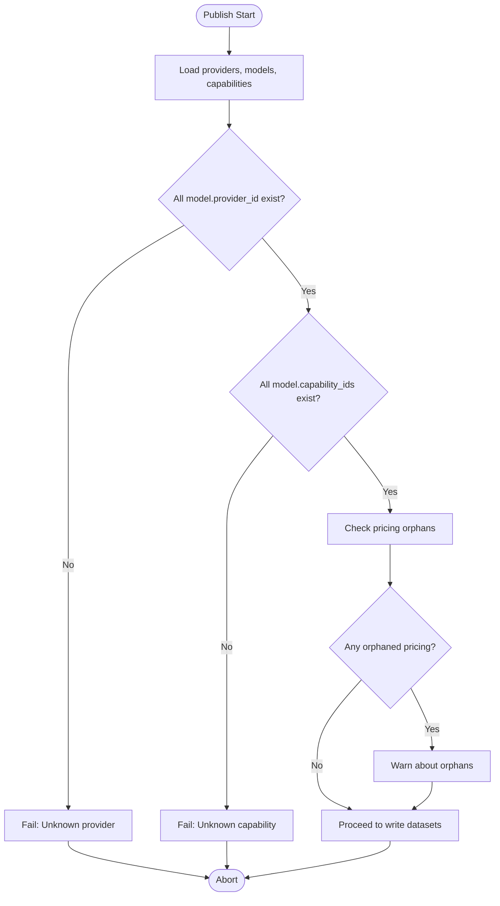
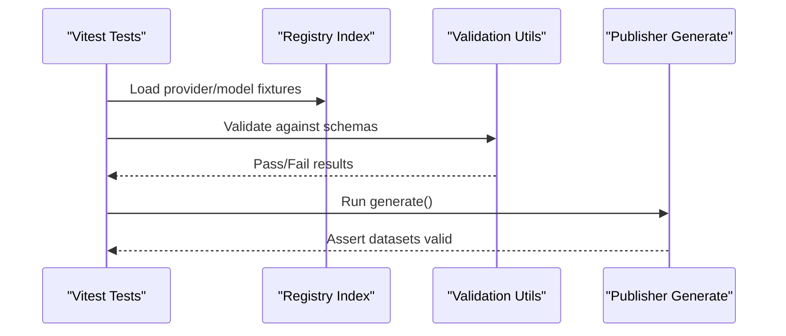
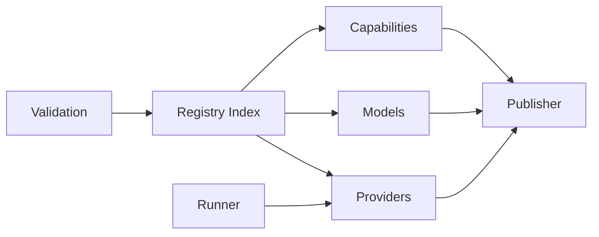

# Capability Definitions & Standardization

<cite>
**Referenced Files in This Document**
- [text-generation.json](file://data/registry/capabilities/text-generation.json)
- [tool-calling.json](file://data/registry/capabilities/tool-calling.json)
- [vision.json](file://data/registry/capabilities/vision.json)
- [embeddings.json](file://data/registry/capabilities/embeddings.json)
- [reasoning.json](file://data/registry/capabilities/reasoning.json)
- [code-generation.json](file://data/registry/capabilities/code-generation.json)
- [gpt-4o.json](file://data/registry/models/openai/gpt-4o.json)
- [claude-3-5-sonnet.json](file://data/registry/models/anthropic/claude-3-5-sonnet.json)
- [gemini-2.5-flash.json](file://data/registry/models/google/gemini-2.5-flash.json)
- [text-embedding-3-small.json](file://data/registry/models/openai/text-embedding-3-small.json)
- [openai.json](file://data/registry/providers/openai.json)
- [meta.json](file://data/registry/meta.json)
- [index.ts](file://packages/registry/src/index.ts)
- [validation.ts](file://packages/registry/src/validation.ts)
- [runner.ts](file://packages/collectors/src/core/runner.ts)
- [generate.ts](file://packages/publisher/src/generate.ts)
- [model.test.ts](file://packages/registry/src/__tests__/model.test.ts)
- [provider.test.ts](file://packages/registry/src/__tests__/provider.test.ts)
- [dataset-contract.test.ts](file://packages/publisher/src/__tests__/dataset-contract.test.ts)
</cite>

## Table of Contents
1. [Introduction](#introduction)
2. [Project Structure](#project-structure)
3. [Core Components](#core-components)
4. [Architecture Overview](#architecture-overview)
5. [Detailed Component Analysis](#detailed-component-analysis)
6. [Dependency Analysis](#dependency-analysis)
7. [Performance Considerations](#performance-considerations)
8. [Troubleshooting Guide](#troubleshooting-guide)
9. [Conclusion](#conclusion)
10. [Appendices](#appendices)

## Introduction
This document explains the capability definitions and standardization system used to describe, detect, validate, and publish model capabilities across providers. It covers the standardized capability taxonomy (text generation, tool calling, vision, embeddings, reasoning, code generation), how capabilities are declared on models, how detection and validation work, and how compatibility is verified during publishing. It also provides guidance for extending the taxonomy and integrating new capabilities into the pipeline.

## Project Structure
The capability system is centered around:
- A registry of capability definitions stored as JSON files under data/registry/capabilities.
- Model records that reference capabilities via a capability_ids array.
- Validation schemas and utilities that enforce structure and relational integrity.
- A publisher that validates cross-entity relations before writing datasets.

**Diagram sources**
- [index.ts:1-48](file://packages/registry/src/index.ts#L1-L48)
- [validation.ts:1-42](file://packages/registry/src/validation.ts#L1-L42)
- [runner.ts:333-363](file://packages/collectors/src/core/runner.ts#L333-L363)
- [generate.ts:73-110](file://packages/publisher/src/generate.ts#L73-L110)
- [meta.json:1-18](file://data/registry/meta.json#L1-L18)

**Section sources**
- [meta.json:1-18](file://data/registry/meta.json#L1-L18)

## Core Components
- Capability definitions: Each capability is defined by a small JSON with a stable capability_id, name, and description. Examples include text-generation, tool-calling, vision, embeddings, reasoning, and code-generation.
- Model capability declarations: Models list supported capabilities using a capability_ids array referencing capability IDs from the registry.
- Provider metadata: Providers are registered and stamped with freshness when models reference them during collection.
- Validation and schema enforcement: All entities are validated against Zod-based schemas; relational integrity is enforced before publishing.
- Publisher contract tests: End-to-end checks ensure published datasets satisfy schema validity, relational integrity, and consistent metadata.

**Section sources**
- [text-generation.json:1-6](file://data/registry/capabilities/text-generation.json#L1-L6)
- [tool-calling.json:1-6](file://data/registry/capabilities/tool-calling.json#L1-L6)
- [vision.json:1-6](file://data/registry/capabilities/vision.json#L1-L6)
- [embeddings.json:1-6](file://data/registry/capabilities/embeddings.json#L1-L6)
- [reasoning.json:1-6](file://data/registry/capabilities/reasoning.json#L1-L6)
- [code-generation.json:1-6](file://data/registry/capabilities/code-generation.json#L1-L6)
- [gpt-4o.json:1-37](file://data/registry/models/openai/gpt-4o.json#L1-L37)
- [claude-3-5-sonnet.json:1-24](file://data/registry/models/anthropic/claude-3-5-sonnet.json#L1-L24)
- [gemini-2.5-flash.json:1-30](file://data/registry/models/google/gemini-2.5-flash.json#L1-L30)
- [text-embedding-3-small.json:1-19](file://data/registry/models/openai/text-embedding-3-small.json#L1-L19)
- [openai.json:1-11](file://data/registry/providers/openai.json#L1-L11)
- [index.ts:1-48](file://packages/registry/src/index.ts#L1-L48)
- [validation.ts:1-42](file://packages/registry/src/validation.ts#L1-L42)
- [runner.ts:333-363](file://packages/collectors/src/core/runner.ts#L333-L363)
- [generate.ts:73-110](file://packages/publisher/src/generate.ts#L73-L110)

## Architecture Overview
The capability system integrates data, validation, and publishing into a cohesive pipeline:
- Capability definitions are canonical references for model features.
- Model records declare capabilities via capability_ids.
- The registry index reads and parses entities using schemas.
- The collector runner ensures provider records exist and stamps freshness.
- The publisher validates cross-entity relations (providers, models, capabilities) before generating datasets.

**Diagram sources**
- [runner.ts:333-363](file://packages/collectors/src/core/runner.ts#L333-L363)
- [index.ts:1-48](file://packages/registry/src/index.ts#L1-L48)
- [validation.ts:1-42](file://packages/registry/src/validation.ts#L1-L42)
- [generate.ts:73-110](file://packages/publisher/src/generate.ts#L73-L110)

## Detailed Component Analysis

### Capability Taxonomy
The standardized capability taxonomy includes:
- text-generation: Coherent text generation from prompts.
- tool-calling: Function/tool invocation within responses.
- vision: Image understanding and analysis.
- embeddings: Vector representation generation for semantic search.
- reasoning: Step-by-step thinking for complex problems.
- code-generation: Writing, completing, explaining, and debugging code.

Each capability is defined by a stable ID, human-readable name, and concise description.

**Section sources**
- [text-generation.json:1-6](file://data/registry/capabilities/text-generation.json#L1-L6)
- [tool-calling.json:1-6](file://data/registry/capabilities/tool-calling.json#L1-L6)
- [vision.json:1-6](file://data/registry/capabilities/vision.json#L1-L6)
- [embeddings.json:1-6](file://data/registry/capabilities/embeddings.json#L1-L6)
- [reasoning.json:1-6](file://data/registry/capabilities/reasoning.json#L1-L6)
- [code-generation.json:1-6](file://data/registry/capabilities/code-generation.json#L1-L6)

### Capability Detection Algorithms
Detection is primarily driven by explicit model fields and capability_ids:
- Boolean flags such as function_calling, vision_support, embedding_support indicate specific abilities.
- capability_ids provide a declarative list of supported capabilities per model.
- Modality arrays (e.g., text, image, audio, video) inform multimodal support.
- Additional fields like reasoning_support and structured_output refine capability semantics.

**Diagram sources**
- [gpt-4o.json:1-37](file://data/registry/models/openai/gpt-4o.json#L1-L37)
- [claude-3-5-sonnet.json:1-24](file://data/registry/models/anthropic/claude-3-5-sonnet.json#L1-L24)
- [gemini-2.5-flash.json:1-30](file://data/registry/models/google/gemini-2.5-flash.json#L1-L30)
- [text-embedding-3-small.json:1-19](file://data/registry/models/openai/text-embedding-3-small.json#L1-L19)

**Section sources**
- [gpt-4o.json:1-37](file://data/registry/models/openai/gpt-4o.json#L1-L37)
- [claude-3-5-sonnet.json:1-24](file://data/registry/models/anthropic/claude-3-5-sonnet.json#L1-L24)
- [gemini-2.5-flash.json:1-30](file://data/registry/models/google/gemini-2.5-flash.json#L1-L30)
- [text-embedding-3-small.json:1-19](file://data/registry/models/openai/text-embedding-3-small.json#L1-L19)

### Feature Flagging Mechanisms
- function_calling: Indicates tool/function calling support.
- vision_support: Indicates image input handling.
- embedding_support: Indicates vector embedding generation.
- reasoning_support: Indicates enhanced reasoning behavior.
- structured_output: Indicates ability to produce structured outputs.
- modality: Enumerates supported input modalities (text, image, audio, video).

These flags complement capability_ids to form a robust capability profile.

**Section sources**
- [gpt-4o.json:1-37](file://data/registry/models/openai/gpt-4o.json#L1-L37)
- [claude-3-5-sonnet.json:1-24](file://data/registry/models/anthropic/claude-3-5-sonnet.json#L1-L24)
- [gemini-2.5-flash.json:1-30](file://data/registry/models/google/gemini-2.5-flash.json#L1-L30)
- [text-embedding-3-small.json:1-19](file://data/registry/models/openai/text-embedding-3-small.json#L1-L19)

### Compatibility Verification Processes
Before publishing, the system enforces relational integrity:
- Every model.provider_id must exist in the providers dataset.
- Every model.capability_ids entry must exist in the capabilities dataset.
- Orphaned pricing records are warned but do not fail publication.

**Diagram sources**
- [generate.ts:73-110](file://packages/publisher/src/generate.ts#L73-L110)

**Section sources**
- [generate.ts:73-110](file://packages/publisher/src/generate.ts#L73-L110)

### Capability Hierarchy and Inheritance Patterns
- Capability IDs are flat identifiers without hierarchical relationships in the current registry.
- Inheritance is modeled through composition: models aggregate multiple capabilities via capability_ids.
- Conflict resolution is implicit: if a model lists conflicting capabilities, it is up to consumers to reconcile based on additional flags (e.g., modality vs. embedding_support).

Guidance:
- Keep capability IDs unique and descriptive.
- Use boolean flags to disambiguate nuanced behaviors.
- Avoid creating hierarchical IDs unless necessary; prefer composition.

[No sources needed since this section provides conceptual guidance]

### Examples Across Model Types and Providers
- OpenAI gpt-4o declares capabilities including text-generation, code-generation, vision, and tool-calling.
- Anthropic claude-3-5-sonnet similarly declares text-generation, code-generation, vision, and tool-calling.
- Google gemini-2.5-flash demonstrates multimodal modality support with an empty capability_ids array, indicating capability declaration may be pending or inferred elsewhere.
- OpenAI text-embedding-3-small shows a minimal model with no capabilities listed, focusing solely on embeddings functionality.

**Section sources**
- [gpt-4o.json:1-37](file://data/registry/models/openai/gpt-4o.json#L1-L37)
- [claude-3-5-sonnet.json:1-24](file://data/registry/models/anthropic/claude-3-5-sonnet.json#L1-L24)
- [gemini-2.5-flash.json:1-30](file://data/registry/models/google/gemini-2.5-flash.json#L1-L30)
- [text-embedding-3-small.json:1-19](file://data/registry/models/openai/text-embedding-3-small.json#L1-L19)

### Capability Testing Frameworks and Validation Procedures
- Unit tests validate provider seed data against ProviderSchema.
- Unit tests validate model seed data against ModelSchema.
- Contract tests run the real generator against the real registry and assert dataset validity, relational integrity, and consistent metadata.

**Diagram sources**
- [provider.test.ts:1-37](file://packages/registry/src/__tests__/provider.test.ts#L1-L37)
- [model.test.ts:1-37](file://packages/registry/src/__tests__/model.test.ts#L1-L37)
- [dataset-contract.test.ts:1-47](file://packages/publisher/src/__tests__/dataset-contract.test.ts#L1-L47)

**Section sources**
- [provider.test.ts:1-37](file://packages/registry/src/__tests__/provider.test.ts#L1-L37)
- [model.test.ts:1-37](file://packages/registry/src/__tests__/model.test.ts#L1-L37)
- [dataset-contract.test.ts:1-47](file://packages/publisher/src/__tests__/dataset-contract.test.ts#L1-L47)

### Quality Assurance Workflows
- Schema validation ensures structural correctness of providers, models, and capabilities.
- Relational integrity checks prevent unknown provider or capability references.
- Stamping updated_at on entities helps consumers detect staleness.
- Coverage metrics in meta.json summarize catalog health.

**Section sources**
- [index.ts:1-48](file://packages/registry/src/index.ts#L1-L48)
- [validation.ts:1-42](file://packages/registry/src/validation.ts#L1-L42)
- [runner.ts:333-363](file://packages/collectors/src/core/runner.ts#L333-L363)
- [meta.json:1-18](file://data/registry/meta.json#L1-L18)

## Dependency Analysis
The capability system depends on:
- Registry index for reading and parsing entities.
- Validation utilities for schema enforcement.
- Collector runner for provider registration and freshness stamping.
- Publisher for relational validation and dataset generation.

**Diagram sources**
- [index.ts:1-48](file://packages/registry/src/index.ts#L1-L48)
- [validation.ts:1-42](file://packages/registry/src/validation.ts#L1-L42)
- [runner.ts:333-363](file://packages/collectors/src/core/runner.ts#L333-L363)
- [generate.ts:73-110](file://packages/publisher/src/generate.ts#L73-L110)

**Section sources**
- [index.ts:1-48](file://packages/registry/src/index.ts#L1-L48)
- [validation.ts:1-42](file://packages/registry/src/validation.ts#L1-L42)
- [runner.ts:333-363](file://packages/collectors/src/core/runner.ts#L333-L363)
- [generate.ts:73-110](file://packages/publisher/src/generate.ts#L73-L110)

## Performance Considerations
- Reading all arrays from directories can be I/O heavy; batch operations should be minimized where possible.
- Validation is performed per entity; consider caching parsed schemas for repeated use.
- Relational checks are linear in the number of models; pre-index provider and capability sets to reduce lookup time.
- Stamping updated_at adds minimal overhead but improves consumer freshness detection.

[No sources needed since this section provides general guidance]

## Troubleshooting Guide
Common issues and resolutions:
- Unknown provider reference: Ensure provider_id exists in providers dataset; the runner will auto-register missing providers if info is available.
- Unknown capability reference: Add the capability definition to the capabilities registry; otherwise, publishing fails.
- Validation failures: Inspect schema errors returned by validation utilities; correct field types and formats accordingly.
- Orphaned pricing records: Review warnings and update pricing entries to reference existing models.

**Section sources**
- [runner.ts:333-363](file://packages/collectors/src/core/runner.ts#L333-L363)
- [generate.ts:73-110](file://packages/publisher/src/generate.ts#L73-L110)
- [validation.ts:1-42](file://packages/registry/src/validation.ts#L1-L42)

## Conclusion
The capability definitions and standardization system provides a clear, validated, and extensible framework for describing model capabilities. By combining canonical capability definitions, explicit model declarations, robust validation, and relational integrity checks, the system ensures reliable capability discovery and safe publishing across diverse providers and model types. Extending the taxonomy involves adding new capability definitions and updating model records accordingly, while maintaining schema compliance and relational consistency.

[No sources needed since this section summarizes without analyzing specific files]

## Appendices

### Guidance for Defining New Capabilities
- Create a new JSON file under data/registry/capabilities with a unique capability_id, name, and description.
- Update model records to include the new capability_id in capability_ids where applicable.
- Ensure schema compliance and pass validation tests.
- Run publisher generate to verify relational integrity and dataset generation.

**Section sources**
- [text-generation.json:1-6](file://data/registry/capabilities/text-generation.json#L1-L6)
- [tool-calling.json:1-6](file://data/registry/capabilities/tool-calling.json#L1-L6)
- [vision.json:1-6](file://data/registry/capabilities/vision.json#L1-L6)
- [embeddings.json:1-6](file://data/registry/capabilities/embeddings.json#L1-L6)
- [reasoning.json:1-6](file://data/registry/capabilities/reasoning.json#L1-L6)
- [code-generation.json:1-6](file://data/registry/capabilities/code-generation.json#L1-L6)
- [generate.ts:73-110](file://packages/publisher/src/generate.ts#L73-L110)