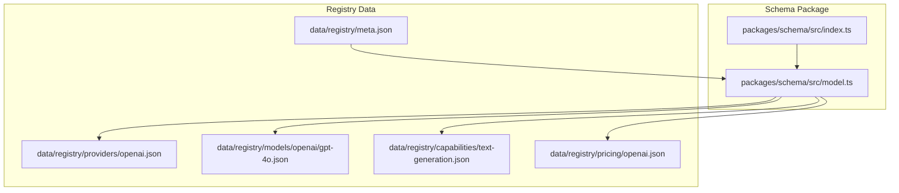
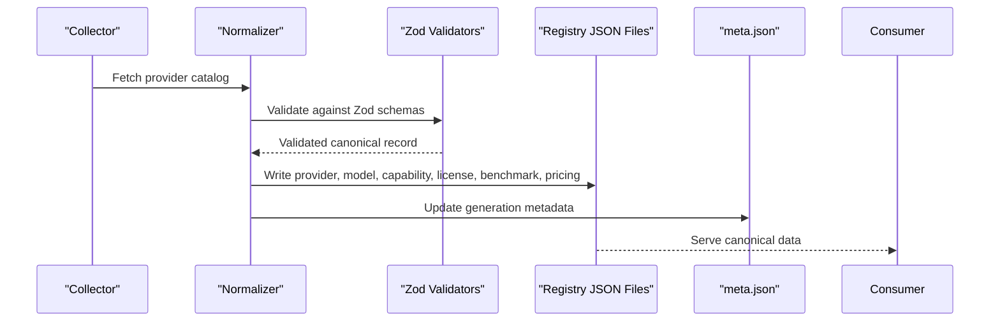
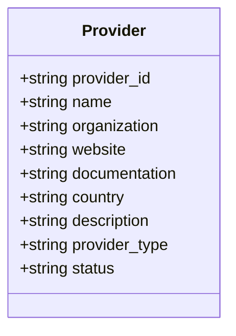
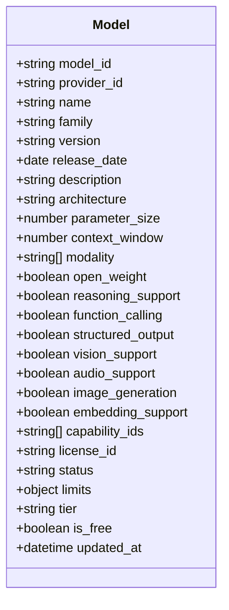
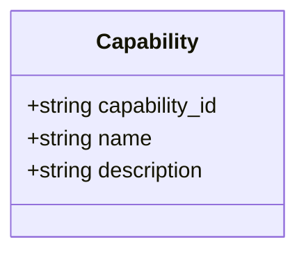
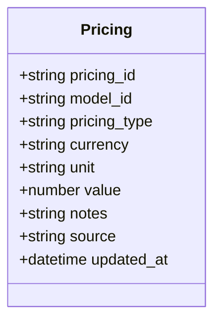
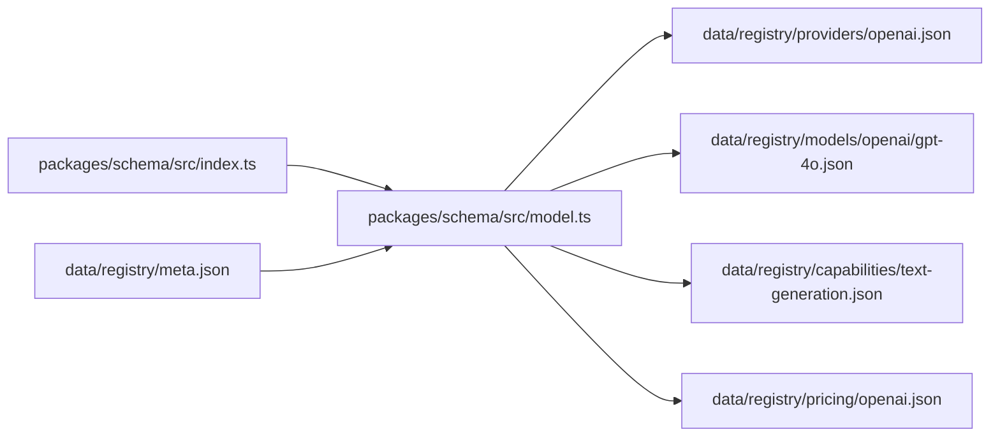

# Data Models & Schema

<cite>
**Referenced Files in This Document**
- [packages/schema/src/index.ts](file://packages/schema/src/index.ts)
- [packages/schema/src/model.ts](file://packages/schema/src/model.ts)
- [data/registry/meta.json](file://data/registry/meta.json)
- [data/registry/providers/openai.json](file://data/registry/providers/openai.json)
- [data/registry/models/openai/gpt-4o.json](file://data/registry/models/openai/gpt-4o.json)
- [data/registry/capabilities/text-generation.json](file://data/registry/capabilities/text-generation.json)
- [data/registry/pricing/openai.json](file://data/registry/pricing/openai.json)
- [docs/05_Data_Model.md](file://docs/05_Data_Model.md)
</cite>

## Table of Contents
1. [Introduction](#introduction)
2. [Project Structure](#project-structure)
3. [Core Components](#core-components)
4. [Architecture Overview](#architecture-overview)
5. [Detailed Component Analysis](#detailed-component-analysis)
6. [Dependency Analysis](#dependency-analysis)
7. [Performance Considerations](#performance-considerations)
8. [Troubleshooting Guide](#troubleshooting-guide)
9. [Conclusion](#conclusion)
10. [Appendices](#appendices)

## Introduction
This document defines the canonical data model for BaseModel’s registry, focusing on the core entities: Provider, Model, Capability, License, Benchmark, Pricing, and API. It explains entity relationships, field definitions, validation rules enforced by Zod schemas, normalization from provider-specific formats to canonical structures, schema evolution and versioning strategy, and data quality and consistency guarantees across the distributed registry.

## Project Structure
The repository organizes canonical schemas in a dedicated package and stores normalized registry artifacts as JSON files under data/registry. The schema package exports types and Zod validators for each entity, while the registry contains concrete records for providers, models, capabilities, licenses, benchmarks, and pricing.

**Diagram sources**
- [packages/schema/src/index.ts:1-27](file://packages/schema/src/index.ts#L1-L27)
- [packages/schema/src/model.ts](file://packages/schema/src/model.ts)
- [data/registry/meta.json:1-18](file://data/registry/meta.json#L1-L18)
- [data/registry/providers/openai.json:1-11](file://data/registry/providers/openai.json#L1-L11)
- [data/registry/models/openai/gpt-4o.json:1-37](file://data/registry/models/openai/gpt-4o.json#L1-L37)
- [data/registry/capabilities/text-generation.json:1-6](file://data/registry/capabilities/text-generation.json#L1-L6)
- [data/registry/pricing/openai.json:1-783](file://data/registry/pricing/openai.json#L1-L783)

**Section sources**
- [packages/schema/src/index.ts:1-27](file://packages/schema/src/index.ts#L1-L27)
- [data/registry/meta.json:1-18](file://data/registry/meta.json#L1-L18)

## Core Components
The canonical domain model includes the following entities with their responsibilities and identifiers:

- Provider: Represents an organization that develops, publishes, hosts, or distributes AI models.
- Model: A uniquely identifiable AI model with technical attributes and capabilities.
- Capability: A normalized capability shared across many models.
- License: Legal terms governing use, redistribution, modification, and source availability.
- Benchmark: An evaluation result tied to a specific model.
- Pricing: Pricing information per model, including currency, unit, and value.
- API: Access methods for a model (protocol, endpoint, authentication, rate limits).

Identifiers:
- provider_id uses kebab-case.
- model_id uses the format {provider_id}/{model-slug}.
- Other identifiers are stable and human-readable.

Dataset metadata includes schema_version, source_revision, and count; generated_at is not emitted by the current generator.

**Section sources**
- [docs/05_Data_Model.md:23-168](file://docs/05_Data_Model.md#L23-L168)

## Architecture Overview
At runtime, provider-specific data is collected and normalized into canonical JSON records validated against Zod schemas. The registry meta file tracks generation status, coverage, and errors. Consumers read canonical records and rely on consistent identifiers and fields.

[No diagram sources needed since this diagram shows conceptual workflow, not actual code structure]

## Detailed Component Analysis

### Provider Entity
- Purpose: Canonical description of a provider organization.
- Key fields: provider_id, name, organization, website, documentation, country, description, provider_type, status.
- Validation: Enforced via ProviderSchema exported from the schema package.
- Example record path: [data/registry/providers/openai.json:1-11](file://data/registry/providers/openai.json#L1-L11)

**Diagram sources**
- [docs/05_Data_Model.md:25-40](file://docs/05_Data_Model.md#L25-L40)
- [data/registry/providers/openai.json:1-11](file://data/registry/providers/openai.json#L1-L11)

**Section sources**
- [docs/05_Data_Model.md:25-40](file://docs/05_Data_Model.md#L25-L40)
- [data/registry/providers/openai.json:1-11](file://data/registry/providers/openai.json#L1-L11)

### Model Entity
- Purpose: Canonical representation of a model with technical attributes and feature flags.
- Key fields: model_id, provider_id, name, family, version, release_date, description, architecture, parameter_size, context_window, modality, open_weight, reasoning_support, function_calling, structured_output, vision_support, audio_support, image_generation, embedding_support, capability_ids, license_id, status, limits, tier, is_free, updated_at.
- Validation: Enforced via ModelSchema exported from the schema package.
- Example record path: [data/registry/models/openai/gpt-4o.json:1-37](file://data/registry/models/openai/gpt-4o.json#L1-L37)

**Diagram sources**
- [docs/05_Data_Model.md:41-69](file://docs/05_Data_Model.md#L41-L69)
- [data/registry/models/openai/gpt-4o.json:1-37](file://data/registry/models/openai/gpt-4o.json#L1-L37)

**Section sources**
- [docs/05_Data_Model.md:41-69](file://docs/05_Data_Model.md#L41-L69)
- [data/registry/models/openai/gpt-4o.json:1-37](file://data/registry/models/openai/gpt-4o.json#L1-L37)

### Capability Entity
- Purpose: Normalized capability definition shared across models.
- Key fields: capability_id, name, description.
- Validation: Enforced via CapabilitySchema exported from the schema package.
- Example record path: [data/registry/capabilities/text-generation.json:1-6](file://data/registry/capabilities/text-generation.json#L1-L6)

**Diagram sources**
- [docs/05_Data_Model.md:70-79](file://docs/05_Data_Model.md#L70-L79)
- [data/registry/capabilities/text-generation.json:1-6](file://data/registry/capabilities/text-generation.json#L1-L6)

**Section sources**
- [docs/05_Data_Model.md:70-79](file://docs/05_Data_Model.md#L70-L79)
- [data/registry/capabilities/text-generation.json:1-6](file://data/registry/capabilities/text-generation.json#L1-L6)

### License Entity
- Purpose: Legal terms governing model usage.
- Key fields: license_id, name, commercial_use, redistribution, modification, source_available, url.
- Validation: Enforced via LicenseSchema exported from the schema package.

**Section sources**
- [docs/05_Data_Model.md:123-136](file://docs/05_Data_Model.md#L123-L136)

### Benchmark Entity
- Purpose: Evaluation results for a model.
- Key fields: benchmark_id, model_id, benchmark_name, version, score, score_raw, evaluation_date, source.
- Validation: Enforced via BenchmarkSchema exported from the schema package.

**Section sources**
- [docs/05_Data_Model.md:80-94](file://docs/05_Data_Model.md#L80-L94)

### Pricing Entity
- Purpose: Pricing entries per model with currency, unit, and value.
- Key fields: pricing_id, model_id, pricing_type, currency, unit, value, notes, source, updated_at.
- Validation: Enforced via PricingSchema exported from the schema package.
- Example record path: [data/registry/pricing/openai.json:1-783](file://data/registry/pricing/openai.json#L1-L783)

**Diagram sources**
- [docs/05_Data_Model.md:95-108](file://docs/05_Data_Model.md#L95-L108)
- [data/registry/pricing/openai.json:1-10](file://data/registry/pricing/openai.json#L1-L10)

**Section sources**
- [docs/05_Data_Model.md:95-108](file://docs/05_Data_Model.md#L95-L108)
- [data/registry/pricing/openai.json:1-10](file://data/registry/pricing/openai.json#L1-L10)

### API Entity
- Purpose: Access method for a model.
- Key fields: api_id, model_id, protocol, endpoint, compatibility, authentication, rate_limits.
- Validation: Enforced via ApiSchema exported from the schema package.

**Section sources**
- [docs/05_Data_Model.md:109-122](file://docs/05_Data_Model.md#L109-L122)

### Identifier Conventions
- provider_id: kebab-case.
- model_id: {provider_id}/{model-slug}.
- Other identifiers: stable, human-readable.

**Section sources**
- [docs/05_Data_Model.md:137-142](file://docs/05_Data_Model.md#L137-L142)

## Dependency Analysis
The schema package centralizes type definitions and Zod validators. Registry JSON files depend on these schemas for validation during ingestion and updates. The meta file aggregates generation statistics and error logs.

**Diagram sources**
- [packages/schema/src/index.ts:1-27](file://packages/schema/src/index.ts#L1-L27)
- [packages/schema/src/model.ts](file://packages/schema/src/model.ts)
- [data/registry/providers/openai.json:1-11](file://data/registry/providers/openai.json#L1-L11)
- [data/registry/models/openai/gpt-4o.json:1-37](file://data/registry/models/openai/gpt-4o.json#L1-L37)
- [data/registry/capabilities/text-generation.json:1-6](file://data/registry/capabilities/text-generation.json#L1-L6)
- [data/registry/pricing/openai.json:1-10](file://data/registry/pricing/openai.json#L1-L10)
- [data/registry/meta.json:1-18](file://data/registry/meta.json#L1-L18)

**Section sources**
- [packages/schema/src/index.ts:1-27](file://packages/schema/src/index.ts#L1-L27)
- [data/registry/meta.json:1-18](file://data/registry/meta.json#L1-L18)

## Performance Considerations
- Validation overhead: Zod schemas provide fast runtime validation; batch validations should be used when ingesting large catalogs.
- File size: Pricing arrays can grow significantly; consider partitioning by provider and compressing outputs for distribution.
- Indexing: Maintain indexes on model_id and pricing.model_id for efficient lookups.
- Caching: Cache validated canonical records at runtime to reduce repeated parsing.

[No sources needed since this section provides general guidance]

## Troubleshooting Guide
Common issues and strategies:
- Ingestion failures: Inspect data/registry/meta.json for errors and source statuses.
- Validation errors: Ensure all required fields conform to Zod schemas; check field types and enums.
- Missing references: Verify capability_ids exist in capabilities; ensure license_id matches a known license.
- Pricing inconsistencies: Confirm currency and unit consistency; validate pricing_type values.

**Section sources**
- [data/registry/meta.json:1-18](file://data/registry/meta.json#L1-L18)

## Conclusion
The BaseModel canonical data model standardizes provider-specific information into consistent, validated entities. Zod schemas enforce strict contracts, while registry JSON files store normalized records. Adhering to identifier conventions and validation rules ensures reliability and interoperability across the distributed registry.

[No sources needed since this section summarizes without analyzing specific files]

## Appendices

### Schema Evolution Strategy and Versioning
- Introduce new fields as optional to maintain backward compatibility.
- Use schema_version in dataset metadata to signal changes.
- Deprecate fields gradually with clear migration notes.
- Maintain source_revision to track provenance of datasets.

**Section sources**
- [docs/05_Data_Model.md:143-152](file://docs/05_Data_Model.md#L143-L152)

### Migration Procedures
- Add new optional fields to schemas and update normalizers.
- Run validation across existing records to detect incompatibilities.
- Backfill missing fields where possible; mark unknowns as null or omit if optional.
- Publish updated datasets with incremented schema_version and source_revision.

[No sources needed since this section provides general guidance]

### Data Quality Requirements and Consistency Guarantees
- All records must pass Zod validation before being committed to the registry.
- Unique constraints: model_id uniqueness; capability_id uniqueness; license_id uniqueness.
- Referential integrity: capability_ids must reference existing capabilities; license_id must reference existing licenses.
- Timestamps: updated_at fields should reflect last modification time.
- Coverage metrics: monitor total_models, tiered_models, and percentage coverage.

**Section sources**
- [data/registry/meta.json:1-18](file://data/registry/meta.json#L1-L18)

### Examples of Well-Formed Records
- Provider example: [data/registry/providers/openai.json:1-11](file://data/registry/providers/openai.json#L1-L11)
- Model example: [data/registry/models/openai/gpt-4o.json:1-37](file://data/registry/models/openai/gpt-4o.json#L1-L37)
- Capability example: [data/registry/capabilities/text-generation.json:1-6](file://data/registry/capabilities/text-generation.json#L1-L6)
- Pricing example: [data/registry/pricing/openai.json:1-10](file://data/registry/pricing/openai.json#L1-L10)

**Section sources**
- [data/registry/providers/openai.json:1-11](file://data/registry/providers/openai.json#L1-L11)
- [data/registry/models/openai/gpt-4o.json:1-37](file://data/registry/models/openai/gpt-4o.json#L1-L37)
- [data/registry/capabilities/text-generation.json:1-6](file://data/registry/capabilities/text-generation.json#L1-L6)
- [data/registry/pricing/openai.json:1-10](file://data/registry/pricing/openai.json#L1-L10)