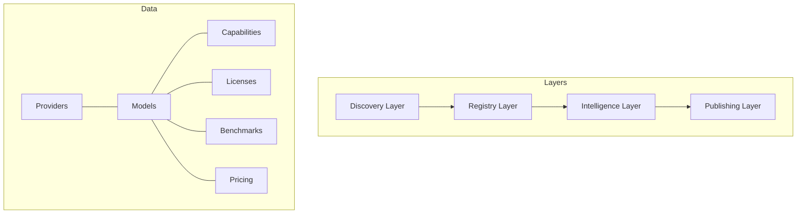
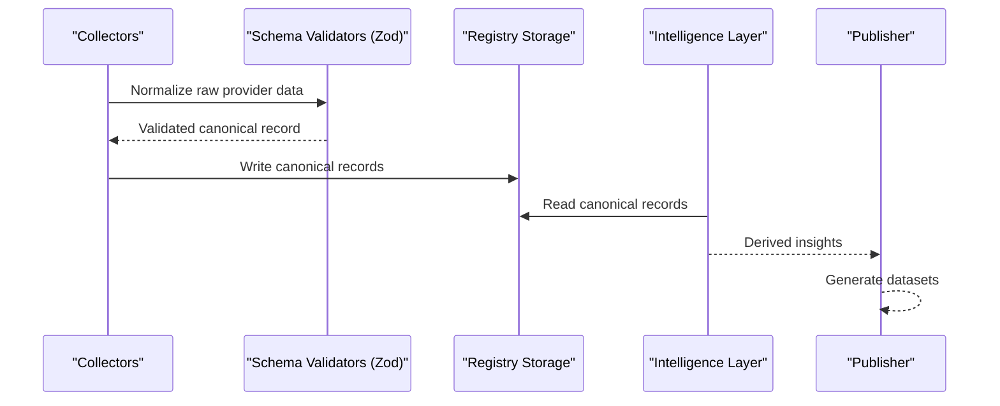
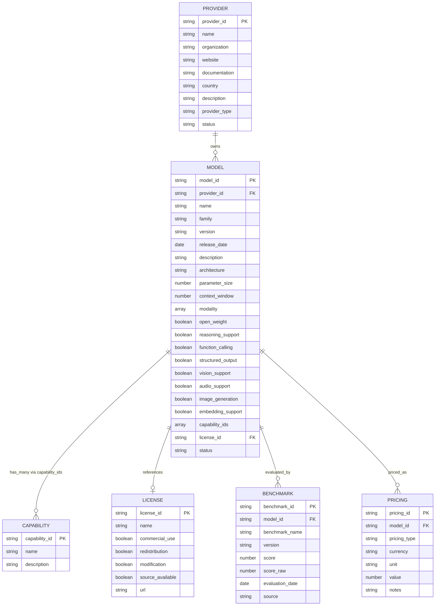
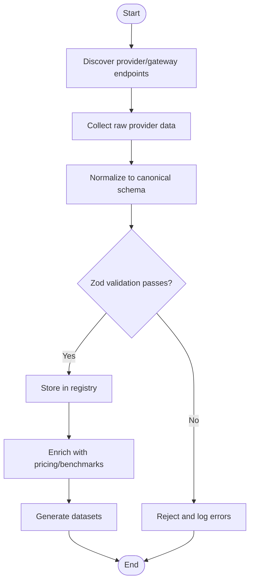
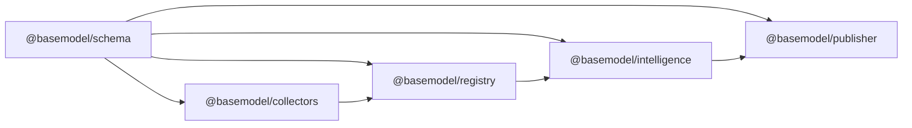

# Entity Relationships & Architecture

<cite>
**Referenced Files in This Document**
- [README.md](file://README.md)
- [03_Architecture.md](file://docs/03_Architecture.md)
- [05_Data_Model.md](file://docs/05_Data_Model.md)
- [meta.json](file://data/registry/meta.json)
- [openai.json](file://data/registry/providers/openai.json)
- [chat-latest.json](file://data/registry/models/openai/chat-latest.json)
- [text-generation.json](file://data/registry/capabilities/text-generation.json)
- [mit.json](file://data/registry/licenses/mit.json)
- [openai.json](file://data/registry/pricing/openai.json)
- [mirror.json](file://data/registry/benchmarks/mirror.json)
</cite>

## Table of Contents
1. [Introduction](#introduction)
2. [Project Structure](#project-structure)
3. [Core Components](#core-components)
4. [Architecture Overview](#architecture-overview)
5. [Detailed Component Analysis](#detailed-component-analysis)
6. [Dependency Analysis](#dependency-analysis)
7. [Performance Considerations](#performance-considerations)
8. [Troubleshooting Guide](#troubleshooting-guide)
9. [Conclusion](#conclusion)

## Introduction
This document explains BaseModel’s canonical entity relationship architecture for providers, models, capabilities, licenses, benchmarks, and pricing. It describes how these entities relate through foreign key references, the normalization strategy that keeps data consistent and extensible, and how provider-specific inputs are transformed into canonical formats while preserving traceability to source systems. It also outlines the schema validation layer using Zod and how it enforces business rules across related entities.

## Project Structure
BaseModel organizes its code and data into clear layers:
- Schema package defines canonical schemas and types (Zod).
- Registry stores validated, normalized canonical records.
- Collectors discover and collect provider/gateway data.
- Intelligence derives rankings, search, and recommendations from registry data.
- Publisher generates public datasets.
- CLI exposes intelligence queries.

Canonical records live under data/registry/, and generated datasets are written to dist/. The README enumerates the published dataset files and the repository layout.

**Section sources**
- [README.md:10-30](file://README.md#L10-L30)
- [03_Architecture.md:5-44](file://docs/03_Architecture.md#L5-L44)

## Core Components
The canonical domain model defines core entities and their responsibilities:
- Provider: organization or distributor of AI models.
- Model: uniquely identifiable AI model with attributes like modality, open weight, and feature flags.
- Capability: normalized capability shared by many models.
- License: legal terms governing a model.
- Benchmark: evaluation result for a model.
- Pricing: pricing information per model.

Identifiers follow stable conventions:
- provider_id uses kebab-case.
- model_id uses {provider_id}/{model-slug}.
- Other identifiers are human-readable and stable.

Dataset metadata includes schema_version, source_revision, and count.

Normalization principles:
- Canonical representation per real-world concept.
- Provider agnostic.
- Stable and extensible design.
- Normalized ownership of fields per entity.

**Section sources**
- [05_Data_Model.md:15-169](file://docs/05_Data_Model.md#L15-L169)

## Architecture Overview
BaseModel’s architecture separates discovery, registry, intelligence, and publishing. The registry is the source of truth for canonical records. The schema package provides Zod-based validation and TypeScript types. The publisher emits static JSON outputs consumed by downstream systems.

**Diagram sources**
- [03_Architecture.md:5-44](file://docs/03_Architecture.md#L5-L44)
- [README.md:10-30](file://README.md#L10-L30)

## Detailed Component Analysis

### Entity Relationship Diagram
The following ER diagram shows cardinality and relationships among canonical entities. Foreign keys are represented as references between entities.

**Diagram sources**
- [05_Data_Model.md:25-136](file://docs/05_Data_Model.md#L25-L136)

### Referential Integrity and Constraints
- Provider to Model: Each model must reference an existing provider_id.
- Model to Capability: Many-to-many via capability_ids; each capability_id should exist in the capabilities set.
- Model to License: Optional one-to-one reference to a license_id.
- Model to Benchmark: One-to-many; each benchmark references a model_id.
- Model to Pricing: One-to-many; each pricing entry references a model_id.

These constraints ensure referential integrity across the canonical dataset. Validation occurs at ingestion time via Zod schemas and at query time via registry utilities.

### Data Flow: Provider-Specific to Canonical
Provider-specific data is collected, normalized, and validated before being stored in the registry. Traceability is maintained through source fields and metadata.

**Diagram sources**
- [03_Architecture.md:5-44](file://docs/03_Architecture.md#L5-L44)
- [README.md:10-30](file://README.md#L10-L30)

### Example Entities and Relationships
- Provider example: OpenAI provider record demonstrates provider fields and status.
- Model example: A model record links to provider_id and lists capability_ids.
- Capability example: A normalized capability definition.
- License example: A license record with usage flags and URL.
- Pricing example: An array of pricing entries referencing model_id and pricing_type.
- Benchmark example: Evaluation results referencing model_id and source.

These examples illustrate how canonical entities are structured and linked.

**Section sources**
- [openai.json:1-11](file://data/registry/providers/openai.json#L1-L11)
- [chat-latest.json:1-19](file://data/registry/models/openai/chat-latest.json#L1-L19)
- [text-generation.json:1-6](file://data/registry/capabilities/text-generation.json#L1-L6)
- [mit.json:1-10](file://data/registry/licenses/mit.json#L1-L10)
- [openai.json:1-783](file://data/registry/pricing/openai.json#L1-L783)
- [mirror.json:1-522](file://data/registry/benchmarks/mirror.json#L1-L522)

### Schema Validation Layer (Zod)
- Zod schemas define the canonical shape for each entity.
- Validation enforces required fields, allowed enums, and cross-entity constraints where applicable.
- Errors are logged and rejected records are excluded from the registry.
- The schema package centralizes type definitions used across collectors, registry, and publisher.

Validation ensures:
- Consistent identifier formats (kebab-case provider_id, model_id pattern).
- Required boolean flags for model features.
- Valid enum values for pricing_type and status.
- Presence of referenced IDs (provider_id, license_id, capability_ids).

Traceability:
- Source fields in pricing and benchmarks indicate origin systems.
- Metadata tracks generation timestamps and error summaries.

**Section sources**
- [05_Data_Model.md:137-169](file://docs/05_Data_Model.md#L137-L169)
- [meta.json:1-18](file://data/registry/meta.json#L1-L18)

## Dependency Analysis
The following dependency graph shows how components depend on each other and on canonical data.

**Diagram sources**
- [03_Architecture.md:37-44](file://docs/03_Architecture.md#L37-L44)

**Section sources**
- [03_Architecture.md:37-44](file://docs/03_Architecture.md#L37-L44)

## Performance Considerations
- Ingestion throughput: Batch normalize and validate records to reduce I/O overhead.
- Indexing: Maintain indexes on frequently queried foreign keys (provider_id, model_id, capability_ids).
- Caching: Cache derived intelligence results to avoid recomputation.
- Validation cost: Keep Zod schemas efficient; avoid expensive cross-entity checks during ingestion.
- Dataset size: Split large arrays (e.g., pricing) into separate files per provider to improve load times.

[No sources needed since this section provides general guidance]

## Troubleshooting Guide
Common issues and resolutions:
- Missing provider_id: Ensure every model references an existing provider.
- Invalid capability_ids: Verify all capability_ids exist in the capabilities set.
- Orphaned pricing/benchmarks: Confirm model_id exists before writing pricing or benchmark entries.
- Validation failures: Inspect Zod error messages; check field types and enum values.
- Source errors: Review metadata errors and retry failed sources.

Operational tips:
- Use registry verification commands to detect inconsistencies.
- Monitor metadata for error counts and coverage metrics.
- Re-run enrichment steps when upstream sources change.

**Section sources**
- [meta.json:1-18](file://data/registry/meta.json#L1-L18)

## Conclusion
BaseModel’s canonical entity relationship architecture normalizes provider-specific data into a stable, extensible model. Foreign key references enforce integrity across providers, models, capabilities, licenses, benchmarks, and pricing. Zod-based validation ensures consistency and business rule enforcement. The layered architecture supports reliable ingestion, analysis, and publication of AI model intelligence.

[No sources needed since this section summarizes without analyzing specific files]