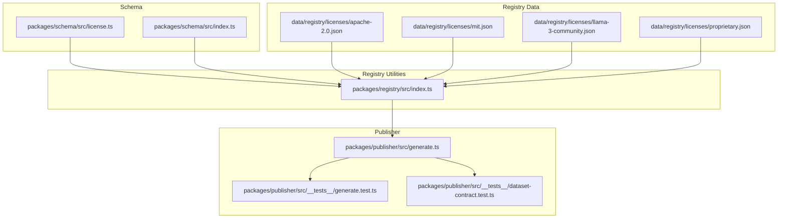
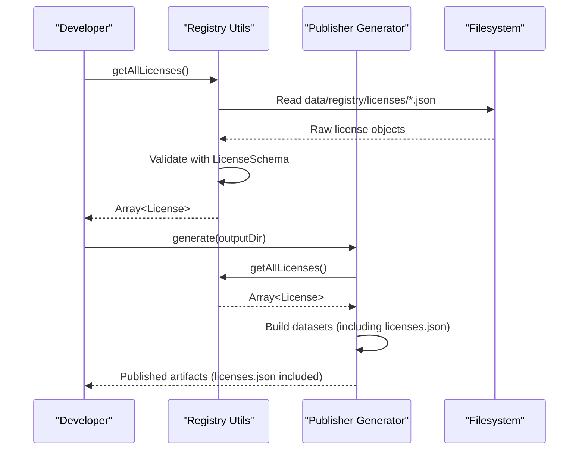
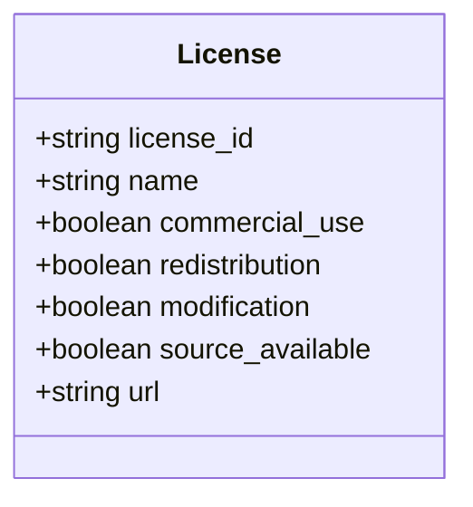
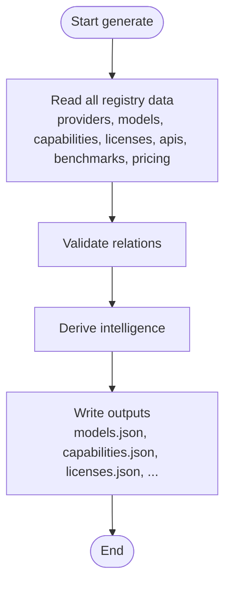
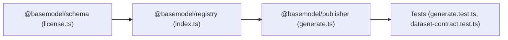

# License Tracking & Compliance

<cite>
**Referenced Files in This Document**
- [apache-2.0.json](file://data/registry/licenses/apache-2.0.json)
- [mit.json](file://data/registry/licenses/mit.json)
- [llama-3-community.json](file://data/registry/licenses/llama-3-community.json)
- [proprietary.json](file://data/registry/licenses/proprietary.json)
- [license.ts](file://packages/schema/src/license.ts)
- [index.ts (schema)](file://packages/schema/src/index.ts)
- [index.ts (registry)](file://packages/registry/src/index.ts)
- [generate.ts](file://packages/publisher/src/generate.ts)
- [generate.test.ts](file://packages/publisher/src/__tests__/generate.test.ts)
- [dataset-contract.test.ts](file://packages/publisher/src/__tests__/dataset-contract.test.ts)
</cite>

## Table of Contents
1. Introduction
2. Project Structure
3. Core Components
4. Architecture Overview
5. Detailed Component Analysis
6. Dependency Analysis
7. Performance Considerations
8. Troubleshooting Guide
9. Conclusion
10. Appendices

## Introduction
This document explains the License tracking and compliance system implemented in the repository. It covers license types, usage restrictions, attribution requirements, and commercial usage policies as represented by the canonical license registry. It also documents how licenses are detected, validated, and integrated into model records; how compliance verification is performed during dataset generation; and how to extend the system with new license types and custom compliance rules. Examples include open-source and proprietary license records and guidance on compatibility matrices, dependency analysis, automated checks, evolution tracking, version management, and migration procedures.

## Project Structure
The license subsystem spans three layers:
- Canonical schema definitions define the shape and constraints of a License entity.
- Registry data files provide concrete license definitions used across models.
- Publisher and registry utilities read, validate, and publish license data alongside other catalog artifacts.

**Diagram sources**
- [license.ts:1-23](file://packages/schema/src/license.ts#L1-L23)
- [index.ts (schema):1-27](file://packages/schema/src/index.ts#L1-L27)
- [index.ts (registry):156-168](file://packages/registry/src/index.ts#L156-L168)
- [generate.ts:125-138](file://packages/publisher/src/generate.ts#L125-L138)
- [generate.test.ts:117-127](file://packages/publisher/src/__tests__/generate.test.ts#L117-L127)
- [dataset-contract.test.ts:23-57](file://packages/publisher/src/__tests__/dataset-contract.test.ts#L23-L57)

**Section sources**
- [license.ts:1-23](file://packages/schema/src/license.ts#L1-L23)
- [index.ts (schema):1-27](file://packages/schema/src/index.ts#L1-L27)
- [index.ts (registry):156-168](file://packages/registry/src/index.ts#L156-L168)
- [generate.ts:125-138](file://packages/publisher/src/generate.ts#L125-L138)
- [generate.test.ts:117-127](file://packages/publisher/src/__tests__/generate.test.ts#L117-L127)
- [dataset-contract.test.ts:23-57](file://packages/publisher/src/__tests__/dataset-contract.test.ts#L23-L57)

## Core Components
- Canonical License Schema: Defines fields for license identification, human-readable name, and policy flags such as commercial_use, redistribution, modification, source_available, plus an optional URL.
- License Registry Files: Concrete JSON entries for known licenses (e.g., MIT, Apache-2.0, Llama 3 Community, Proprietary).
- Registry Accessors: Functions to load all licenses or a specific license by ID, validating against the schema.
- Publisher Integration: The generator reads licenses from the registry and includes them in published datasets, enabling downstream compliance checks.

Key responsibilities:
- Enforce consistent license metadata structure via Zod schemas.
- Provide deterministic access to license definitions for model compliance evaluation.
- Ensure generated outputs include licenses for auditability and tooling integration.

**Section sources**
- [license.ts:1-23](file://packages/schema/src/license.ts#L1-L23)
- [index.ts (registry):156-168](file://packages/registry/src/index.ts#L156-L168)
- [generate.ts:125-138](file://packages/publisher/src/generate.ts#L125-L138)

## Architecture Overview
The license pipeline integrates schema validation, registry I/O, and publisher output generation.

**Diagram sources**
- [index.ts (registry):156-168](file://packages/registry/src/index.ts#L156-L168)
- [generate.ts:125-138](file://packages/publisher/src/generate.ts#L125-L138)

## Detailed Component Analysis

### License Schema and Types
The canonical schema enforces:
- A kebab-case license_id identifier.
- Human-readable name.
- Boolean flags for commercial_use, redistribution, modification, source_available.
- Optional URL pointing to the full license text.

This ensures consistent representation across the registry and downstream consumers.

**Diagram sources**
- [license.ts:10-20](file://packages/schema/src/license.ts#L10-L20)

**Section sources**
- [license.ts:1-23](file://packages/schema/src/license.ts#L1-L23)
- [index.ts (schema):17-18](file://packages/schema/src/index.ts#L17-L18)

### License Registry Files
Concrete license definitions exist as JSON files under data/registry/licenses. Each file represents a distinct license type with standardized fields. Examples include:
- Open-source permissive licenses (MIT, Apache-2.0)
- Community-specific licenses (Llama 3 Community)
- Proprietary terms (Proprietary)

These files are consumed by registry utilities and included in published datasets.

**Section sources**
- [apache-2.0.json:1-10](file://data/registry/licenses/apache-2.0.json#L1-L10)
- [mit.json:1-10](file://data/registry/licenses/mit.json#L1-L10)
- [llama-3-community.json:1-10](file://data/registry/licenses/llama-3-community.json#L1-L10)
- [proprietary.json:1-9](file://data/registry/licenses/proprietary.json#L1-L9)

### Registry Accessors and Validation
Functions to retrieve licenses:
- getAllLicenses(): Reads all license files and validates each against the canonical schema.
- getLicense(licenseId): Loads a single license by ID and validates it.

Validation guarantees that any consumer receives well-formed license objects.

**Section sources**
- [index.ts (registry):156-168](file://packages/registry/src/index.ts#L156-L168)

### Publisher Integration and Output
The publisher generator:
- Reads providers, models, capabilities, licenses, APIs, benchmarks, and pricing.
- Validates relations among entities.
- Derives intelligence and writes multiple output artifacts, including licenses.json.

Tests assert that licenses.json is present in the generated dataset and that contracts hold for other entities.

**Diagram sources**
- [generate.ts:125-138](file://packages/publisher/src/generate.ts#L125-L138)
- [generate.test.ts:117-127](file://packages/publisher/src/__tests__/generate.test.ts#L117-L127)
- [dataset-contract.test.ts:23-57](file://packages/publisher/src/__tests__/dataset-contract.test.ts#L23-L57)

**Section sources**
- [generate.ts:125-138](file://packages/publisher/src/generate.ts#L125-L138)
- [generate.test.ts:117-127](file://packages/publisher/src/__tests__/generate.test.ts#L117-L127)
- [dataset-contract.test.ts:23-57](file://packages/publisher/src/__tests__/dataset-contract.test.ts#L23-L57)

## Dependency Analysis
- Schema package defines the canonical contract for License and exports it for use by registry and publisher.
- Registry package depends on schema to parse and validate license files.
- Publisher depends on registry to obtain licenses and includes them in generated datasets.

**Diagram sources**
- [license.ts:1-23](file://packages/schema/src/license.ts#L1-L23)
- [index.ts (registry):156-168](file://packages/registry/src/index.ts#L156-L168)
- [generate.ts:125-138](file://packages/publisher/src/generate.ts#L125-L138)
- [generate.test.ts:117-127](file://packages/publisher/src/__tests__/generate.test.ts#L117-L127)
- [dataset-contract.test.ts:23-57](file://packages/publisher/src/__tests__/dataset-contract.test.ts#L23-L57)

**Section sources**
- [license.ts:1-23](file://packages/schema/src/license.ts#L1-L23)
- [index.ts (registry):156-168](file://packages/registry/src/index.ts#L156-L168)
- [generate.ts:125-138](file://packages/publisher/src/generate.ts#L125-L138)

## Performance Considerations
- License loading is lightweight: reading small JSON files and validating with Zod.
- Batch reading in the publisher avoids repeated filesystem calls.
- For large registries, consider caching parsed licenses in memory during a single run.

[No sources needed since this section provides general guidance]

## Troubleshooting Guide
Common issues and resolutions:
- Invalid license_id format: Ensure kebab-case identifiers (e.g., "mit", "apache-2.0").
- Missing required fields: Verify presence of license_id, name, and boolean flags.
- Unknown license references: Ensure model records reference a valid license_id present in the registry.
- Publishing failures: Confirm licenses.json is written and tests pass.

Diagnostic steps:
- Use getAllLicenses() to verify registry integrity.
- Run publisher tests to ensure dataset contracts hold.

**Section sources**
- [license.ts:10-20](file://packages/schema/src/license.ts#L10-L20)
- [index.ts (registry):156-168](file://packages/registry/src/index.ts#L156-L168)
- [generate.test.ts:117-127](file://packages/publisher/src/__tests__/generate.test.ts#L117-L127)
- [dataset-contract.test.ts:23-57](file://packages/publisher/src/__tests__/dataset-contract.test.ts#L23-L57)

## Conclusion
The license tracking and compliance system centers on a strict canonical schema, a curated registry of license definitions, and robust integration within the publisher pipeline. This design enables reliable detection, validation, and inclusion of license information in generated datasets, supporting downstream compliance checks and audits. Extensibility is straightforward through adding new license files and leveraging existing registry utilities.

[No sources needed since this section summarizes without analyzing specific files]

## Appendices

### License Types, Restrictions, and Policies
- MIT: Permissive; allows commercial use, redistribution, modification; source available.
- Apache-2.0: Permissive; allows commercial use, redistribution, modification; source available.
- Llama 3 Community: Allows commercial use, redistribution, modification; source available; governed by community license terms.
- Proprietary: Commercial use allowed under provider terms; no redistribution or modification; not source-available.

Use these flags to determine compliance behavior in your application:
- commercial_use: Whether commercial deployment is permitted.
- redistribution: Whether you may redistribute the model or derivatives.
- modification: Whether you may modify the model or its weights.
- source_available: Whether source code or weights are publicly available.

**Section sources**
- [mit.json:1-10](file://data/registry/licenses/mit.json#L1-L10)
- [apache-2.0.json:1-10](file://data/registry/licenses/apache-2.0.json#L1-L10)
- [llama-3-community.json:1-10](file://data/registry/licenses/llama-3-community.json#L1-L10)
- [proprietary.json:1-9](file://data/registry/licenses/proprietary.json#L1-L9)

### License Detection Algorithms
- File-based detection: Each license is defined by a dedicated JSON file under data/registry/licenses.
- Identifier normalization: license_id must match the kebab-case pattern enforced by the schema.
- Resolution: Consumers resolve a model’s license by referencing its license_id and fetching the corresponding record via getLicense().

**Section sources**
- [license.ts:10-20](file://packages/schema/src/license.ts#L10-L20)
- [index.ts (registry):163-168](file://packages/registry/src/index.ts#L163-L168)

### Compliance Verification Processes
- Schema validation: All license records are validated using the canonical schema upon load.
- Relation validation: The publisher validates relationships among entities before writing outputs.
- Dataset contract tests: Ensure licenses.json exists and that related entities adhere to expected contracts.

**Section sources**
- [index.ts (registry):156-168](file://packages/registry/src/index.ts#L156-L168)
- [generate.ts:135-138](file://packages/publisher/src/generate.ts#L135-L138)
- [generate.test.ts:117-127](file://packages/publisher/src/__tests__/generate.test.ts#L117-L127)
- [dataset-contract.test.ts:23-57](file://packages/publisher/src/__tests__/dataset-contract.test.ts#L23-L57)

### Risk Assessment Framework
- High risk: Proprietary licenses with redistribution/modification restrictions.
- Medium risk: Community licenses with specific obligations or attribution requirements.
- Low risk: Permissive licenses (MIT, Apache-2.0) with minimal restrictions.

Assess risk by combining:
- commercial_use flag
- redistribution and modification flags
- source_available status
- Additional obligations inferred from license_url where applicable

[No sources needed since this section provides general guidance]

### License Compatibility Matrices
A practical matrix can be derived from the flags:
- If a downstream product requires redistribution, only licenses with redistribution=true are compatible.
- If modification is required, only licenses with modification=true are compatible.
- If source availability is mandated, only licenses with source_available=true are compatible.

Build a matrix programmatically by iterating over licenses and filtering based on project requirements.

[No sources needed since this section provides general guidance]

### Dependency Analysis and Automated Compliance Checking
- Dependency mapping: Model records should include a license_id field linking to a registry license.
- Automated checks:
  - Validate license_id existence via getLicense().
  - Enforce policy rules (e.g., block redistribution if redistribution=false).
  - Generate compliance reports listing models and their license constraints.

Implementation tips:
- Cache license lookups during batch processing.
- Fail fast on missing or invalid license references.
- Log warnings for edge cases (e.g., unknown license_id).

**Section sources**
- [index.ts (registry):156-168](file://packages/registry/src/index.ts#L156-L168)

### License Evolution Tracking, Version Management, and Migration
- Evolution tracking: Maintain a changelog for license updates and attribute changes.
- Version management: When license terms change, update the corresponding JSON file and increment schema_version in generated metadata.
- Migration procedures:
  - Audit models referencing the updated license.
  - Update model records if license_id changes or fields evolve.
  - Re-run publisher to regenerate datasets with updated licenses.

[No sources needed since this section provides general guidance]

### Adding New License Types and Custom Compliance Rules
Steps to add a new license:
1. Create a new JSON file under data/registry/licenses with a unique license_id and required fields.
2. Ensure license_id follows kebab-case constraints.
3. Optionally add a URL to the full license text.
4. Validate via getAllLicenses() and getLicense().
5. Update any model records to reference the new license_id.
6. Re-run the publisher to include the new license in outputs.

Custom compliance rules:
- Implement policy checks using license flags (commercial_use, redistribution, modification, source_available).
- Integrate checks into CI pipelines to enforce compliance gates.
- Extend the publisher or a separate compliance module to produce audit reports.

**Section sources**
- [license.ts:10-20](file://packages/schema/src/license.ts#L10-L20)
- [index.ts (registry):156-168](file://packages/registry/src/index.ts#L156-L168)
- [generate.ts:125-138](file://packages/publisher/src/generate.ts#L125-L138)