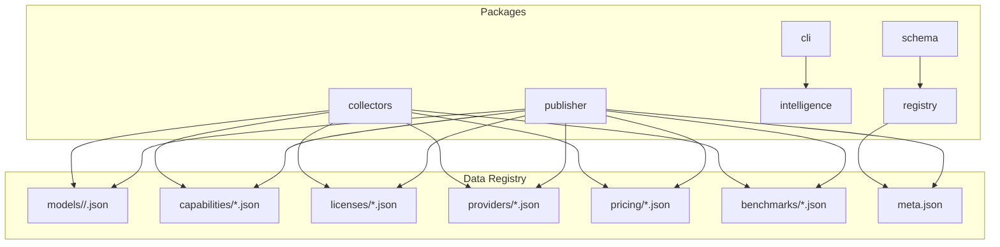
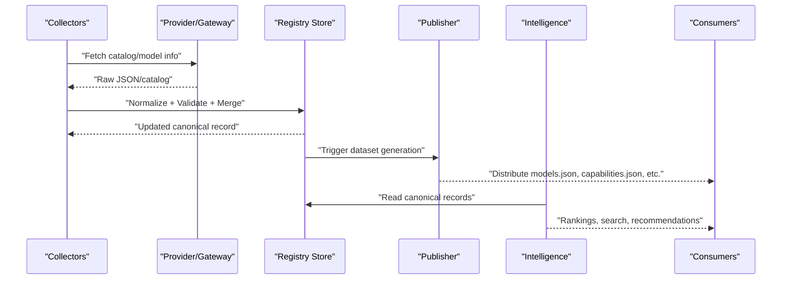
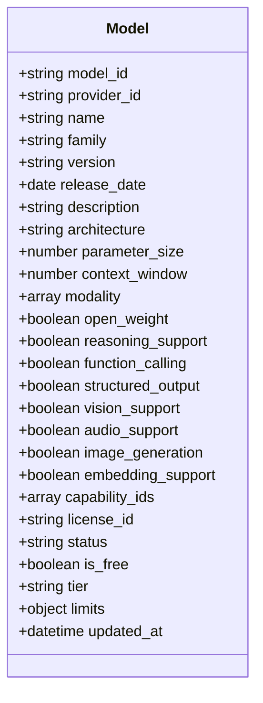
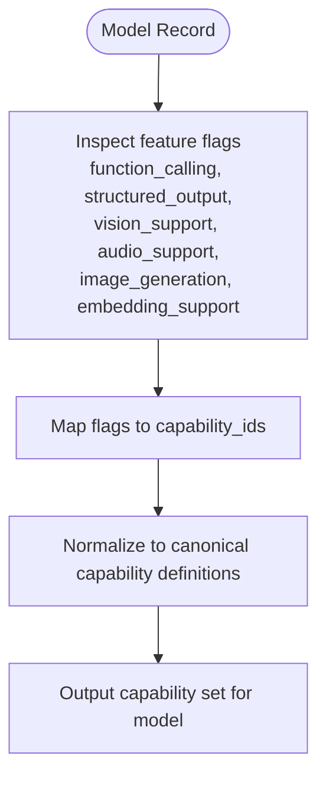
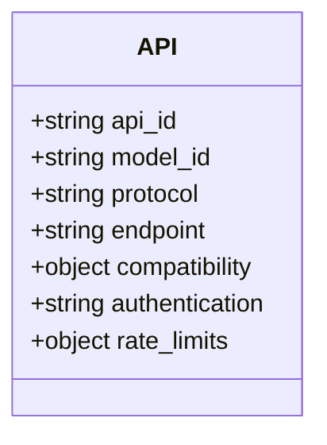
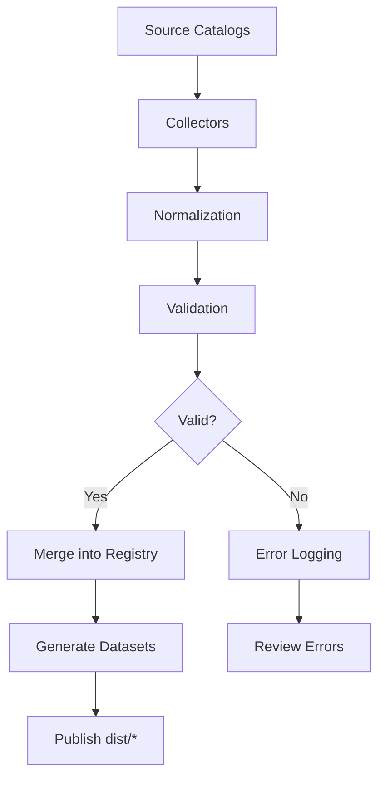
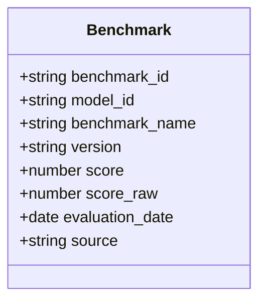
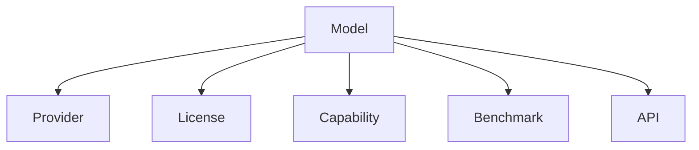

# Model Schema & Specifications

<cite>
**Referenced Files in This Document**
- [README.md](file://README.md)
- [05_Data_Model.md](file://docs/05_Data_Model.md)
- [meta.json](file://data/registry/meta.json)
- [gpt-4o.json](file://data/registry/models/openai/gpt-4o.json)
- [claude-3-5-sonnet.json](file://data/registry/models/anthropic/claude-3-5-sonnet.json)
- [gemini-2.5-pro.json](file://data/registry/models/google/gemini-2.5-pro.json)
- [devstral-latest.json](file://data/registry/models/mistral-ai/devstral-latest.json)
- [flux-1-dev.json](file://data/registry/models/deepinfra/flux-1-dev.json)
- [text-generation.json](file://data/registry/capabilities/text-generation.json)
- [openai.json](file://data/registry/providers/openai.json)
</cite>

## Table of Contents
1. [Introduction](#introduction)
2. [Project Structure](#project-structure)
3. [Core Components](#core-components)
4. [Architecture Overview](#architecture-overview)
5. [Detailed Component Analysis](#detailed-component-analysis)
6. [Dependency Analysis](#dependency-analysis)
7. [Performance Considerations](#performance-considerations)
8. [Troubleshooting Guide](#troubleshooting-guide)
9. [Conclusion](#conclusion)
10. [Appendices](#appendices)

## Introduction
This document defines the canonical Model schema and specifications used across the BaseModel registry. It consolidates model attributes, technical specifications (context windows, token limits), output formats, supported features, categorization, versioning, deprecation policies, capability detection, feature flagging, compatibility matrices, discovery and enrichment processes, quality assurance, performance metrics, benchmark integration, and evaluation criteria. The goal is to provide a single source of truth for consumers and contributors working with model metadata and capabilities.

## Project Structure
BaseModel organizes its data and tooling into packages and a canonical data registry:
- Canonical schemas and types live under packages/schema.
- Registry storage, validation, and merge utilities are under packages/registry.
- Provider and gateway collectors populate and enrich records under packages/collectors.
- Derived intelligence, rankings, search, and recommendations are under packages/intelligence.
- Dataset generation for distribution outputs is under packages/publisher.
- Command-line interface for querying intelligence is under packages/cli.
- Canonical model records reside under data/registry/models by provider.
- Capabilities, licenses, providers, pricing, benchmarks, and dataset metadata are under data/registry.

**Diagram sources**
- [README.md:11-30](file://README.md#L11-L30)
- [meta.json:1-18](file://data/registry/meta.json#L1-L18)

**Section sources**
- [README.md:11-30](file://README.md#L11-L30)

## Core Components
The canonical domain model defines core entities and their responsibilities:
- Provider: organization that develops, publishes, hosts, or distributes AI models.
- Model: uniquely identifiable AI model with technical and capability attributes.
- Capability: normalized capability shared across many models.
- Benchmark: evaluation result for a model.
- Pricing: pricing information for a model.
- API: method of accessing a model.
- License: legal terms governing a model.

Key identifier conventions:
- provider_id uses kebab-case.
- model_id uses {provider_id}/{model-slug}.
- Other identifiers are stable and human-readable where practical.

Dataset metadata includes schema_version, source_revision, and count; generated_at may be present depending on generator behavior.

**Section sources**
- [05_Data_Model.md:23-151](file://docs/05_Data_Model.md#L23-L151)

## Architecture Overview
The system discovers, validates, normalizes, stores, analyzes, and publishes structured knowledge about AI models. Collectors gather raw signals from providers and gateways, normalize them into canonical records, validate against schemas, merge updates, and write to the registry. Publisher generates distribution datasets. Intelligence derives rankings and recommendations. Consumers query via CLI or APIs.

[No sources needed since this diagram shows conceptual workflow, not actual code structure]

## Detailed Component Analysis

### Model Entity and Attributes
The Model entity captures identity, provenance, architecture, modality, capabilities, licensing, status, and operational constraints. Canonical fields include:
- Identity and provenance: model_id, provider_id, name, family, version, release_date, description, architecture, parameter_size.
- Context and tokens: context_window, limits.max_input_tokens.
- Modality and features: modality, open_weight, reasoning_support, function_calling, structured_output, vision_support, audio_support, image_generation, embedding_support.
- Capabilities and licensing: capability_ids, license_id.
- Operational state: status, updated_at.

Additional fields observed in canonical records:
- is_free: boolean indicating free availability.
- tier: categorical tier such as balanced.
- limits: object containing max_input_tokens and potentially other constraints.

Examples across providers demonstrate consistent canonical formatting while allowing optional fields.

**Diagram sources**
- [05_Data_Model.md:41-68](file://docs/05_Data_Model.md#L41-L68)

**Section sources**
- [05_Data_Model.md:41-68](file://docs/05_Data_Model.md#L41-L68)
- [gpt-4o.json:1-37](file://data/registry/models/openai/gpt-4o.json#L1-L37)
- [claude-3-5-sonnet.json:1-24](file://data/registry/models/anthropic/claude-3-5-sonnet.json#L1-L24)
- [gemini-2.5-pro.json:1-30](file://data/registry/models/google/gemini-2.5-pro.json#L1-L30)
- [devstral-latest.json:1-25](file://data/registry/models/mistral-ai/devstral-latest.json#L1-L25)
- [flux-1-dev.json:1-20](file://data/registry/models/deepinfra/flux-1-dev.json#L1-L20)

### Capability Detection and Feature Flagging
Capabilities are normalized and referenced by id arrays within model records. Each capability has a canonical definition including capability_id, name, and optional description. Models declare supported capabilities via capability_ids. Feature flags (e.g., function_calling, structured_output, vision_support, audio_support, image_generation, embedding_support) indicate specific functional support at the model level.

**Diagram sources**
- [text-generation.json:1-6](file://data/registry/capabilities/text-generation.json#L1-L6)
- [gpt-4o.json:27-32](file://data/registry/models/openai/gpt-4o.json#L27-L32)

**Section sources**
- [05_Data_Model.md:70-79](file://docs/05_Data_Model.md#L70-L79)
- [text-generation.json:1-6](file://data/registry/capabilities/text-generation.json#L1-L6)

### Model Categorization and Versioning Strategies
Categorization:
- Tiering: models may be categorized by tier (e.g., balanced).
- Modality: text-only, multimodal (text+image+audio+video).
- Openness: open_weight indicates whether weights are publicly available.
- Status: active indicates current availability.

Versioning:
- version field captures model-specific version strings.
- release_date provides canonical release timing.
- updated_at reflects last normalization/update timestamp.

Deprecation policy:
- status field supports lifecycle states; currently active is observed. Deprecation would likely use alternative statuses (e.g., deprecated, retired) when adopted.

**Section sources**
- [gpt-4o.json:1-37](file://data/registry/models/openai/gpt-4o.json#L1-L37)
- [claude-3-5-sonnet.json:1-24](file://data/registry/models/anthropic/claude-3-5-sonnet.json#L1-L24)
- [gemini-2.5-pro.json:1-30](file://data/registry/models/google/gemini-2.5-pro.json#L1-L30)
- [devstral-latest.json:1-25](file://data/registry/models/mistral-ai/devstral-latest.json#L1-L25)
- [flux-1-dev.json:1-20](file://data/registry/models/deepinfra/flux-1-dev.json#L1-L20)

### Compatibility Matrices and API Access
APIs represent methods of accessing a model, including protocol, endpoint, compatibility, authentication, and rate_limits. While model records focus on capabilities and features, API metadata enables compatibility matrices between models and access methods.

**Diagram sources**
- [05_Data_Model.md:109-122](file://docs/05_Data_Model.md#L109-L122)

**Section sources**
- [05_Data_Model.md:109-122](file://docs/05_Data_Model.md#L109-L122)

### Model Discovery Process, Metadata Enrichment, and Quality Assurance
Discovery:
- Collectors fetch catalogs and model info from providers and gateways.
- Records are normalized into canonical format and validated against schemas.

Enrichment:
- Capability mapping from feature flags to canonical capability_ids.
- Licensing linked via license_id.
- Provider metadata linked via provider_id.

Quality Assurance:
- Validation ensures required fields and correct types.
- Merge logic reconciles updates without losing provenance.
- meta.json tracks coverage, errors, and sources.

**Diagram sources**
- [meta.json:1-18](file://data/registry/meta.json#L1-L18)

**Section sources**
- [README.md:11-30](file://README.md#L11-L30)
- [meta.json:1-18](file://data/registry/meta.json#L1-L18)

### Performance Metrics, Benchmark Integration, and Evaluation Criteria
Benchmarks:
- Benchmark entity includes benchmark_id, model_id, benchmark_name, version, score, score_raw, evaluation_date, source.
- Benchmarks integrate evaluation results into the registry for comparison and ranking.

Evaluation criteria:
- Scores and raw scores enable quantitative comparisons.
- Source attribution ensures traceability.
- Dates allow temporal analysis of performance changes.

**Diagram sources**
- [05_Data_Model.md:80-94](file://docs/05_Data_Model.md#L80-L94)

**Section sources**
- [05_Data_Model.md:80-94](file://docs/05_Data_Model.md#L80-L94)

### Examples of Model Records Across Providers
Canonical examples illustrate consistent formatting:
- OpenAI gpt-4o: includes family, version, release_date, architecture, context_window, modality, feature flags, capability_ids, license_id, status, limits, is_free, tier, updated_at.
- Anthropic claude-3-5-sonnet: similar fields with multimodal modality and rich capability set.
- Google gemini-2.5-pro: large context window, multimodal support, limits, and status.
- Mistral devstral-latest: minimal but complete canonical fields with limits and tier.
- Deepinfra flux-1-dev: basic canonical record demonstrating minimal required fields.

These examples confirm adherence to the canonical schema while allowing optional fields based on provider data availability.

**Section sources**
- [gpt-4o.json:1-37](file://data/registry/models/openai/gpt-4o.json#L1-L37)
- [claude-3-5-sonnet.json:1-24](file://data/registry/models/anthropic/claude-3-5-sonnet.json#L1-L24)
- [gemini-2.5-pro.json:1-30](file://data/registry/models/google/gemini-2.5-pro.json#L1-L30)
- [devstral-latest.json:1-25](file://data/registry/models/mistral-ai/devstral-latest.json#L1-L25)
- [flux-1-dev.json:1-20](file://data/registry/models/deepinfra/flux-1-dev.json#L1-L20)

## Dependency Analysis
Model records depend on:
- Providers: provider_id links to provider metadata.
- Licenses: license_id links to license definitions.
- Capabilities: capability_ids link to normalized capability definitions.
- Benchmarks: benchmark_id references evaluation results.
- APIs: api_id references access methods.

**Diagram sources**
- [05_Data_Model.md:23-151](file://docs/05_Data_Model.md#L23-L151)

**Section sources**
- [05_Data_Model.md:23-151](file://docs/05_Data_Model.md#L23-L151)

## Performance Considerations
- Context window and token limits influence input sizing and throughput.
- Multimodal models may incur higher processing costs and latency.
- Capability sets determine downstream routing and resource allocation.
- Benchmark scores guide selection for performance-sensitive applications.

[No sources needed since this section provides general guidance]

## Troubleshooting Guide
Common issues and resolutions:
- Missing or invalid fields: ensure all required fields conform to canonical schema.
- Inconsistent capability mapping: verify feature flags align with capability_ids.
- Provider connectivity errors: check collector logs and network access.
- Coverage gaps: review meta.json errors and sources to identify missing data.

**Section sources**
- [meta.json:1-18](file://data/registry/meta.json#L1-L18)

## Conclusion
The BaseModel Model schema provides a robust, canonical foundation for representing AI models across providers. It standardizes identity, technical specifications, capabilities, licensing, and operational constraints. Through systematic discovery, normalization, validation, and enrichment, the registry maintains high-quality, comparable model metadata. Consumers can rely on consistent formatting and clear capability detection to build integrations, evaluations, and intelligent routing systems.

[No sources needed since this section summarizes without analyzing specific files]

## Appendices

### Provider Metadata Example
OpenAI provider record demonstrates canonical provider fields.

**Section sources**
- [openai.json:1-11](file://data/registry/providers/openai.json#L1-L11)