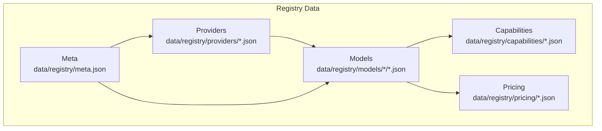
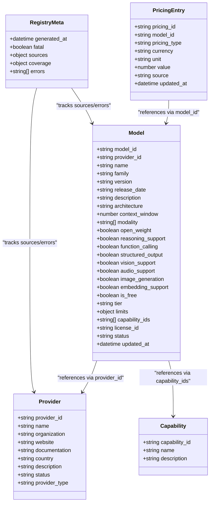
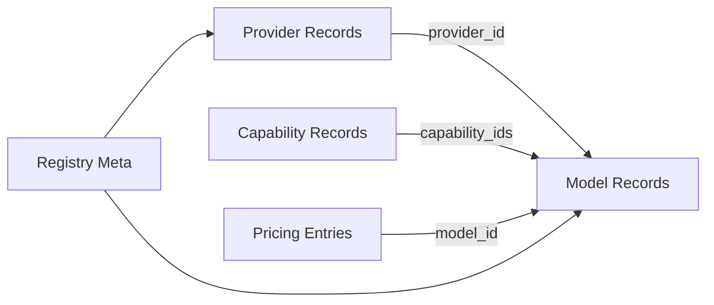

# Provider Model Schema

<cite>
**Referenced Files in This Document**
- [openai.json](file://data/registry/providers/openai.json)
- [anthropic.json](file://data/registry/providers/anthropic.json)
- [google.json](file://data/registry/providers/google.json)
- [meta.json](file://data/registry/meta.json)
- [text-generation.json](file://data/registry/capabilities/text-generation.json)
- [gpt-4o.json](file://data/registry/models/openai/gpt-4o.json)
- [claude-3-5-sonnet.json](file://data/registry/models/anthropic/claude-3-5-sonnet.json)
- [gemini-2.5-pro.json](file://data/registry/models/google/gemini-2.5-pro.json)
- [README.md](file://README.md)
</cite>

## Table of Contents
1. [Introduction](#introduction)
2. [Project Structure](#project-structure)
3. [Core Components](#core-components)
4. [Architecture Overview](#architecture-overview)
5. [Detailed Component Analysis](#detailed-component-analysis)
6. [Dependency Analysis](#dependency-analysis)
7. [Performance Considerations](#performance-considerations)
8. [Troubleshooting Guide](#troubleshooting-guide)
9. [Conclusion](#conclusion)
10. [Appendices](#appendices)

## Introduction
This document defines the Provider model schema used by the registry to describe AI providers and their capabilities. It explains provider metadata, authentication requirements, rate limits, supported regions, capability declarations, registration process, validation rules, configuration options, lifecycle management, status tracking, health checks, API versioning strategies, error handling patterns, and guidance for adding new providers or extending schemas.

The registry stores canonical records under data/registry/ and generates consolidated datasets (including providers.json) into dist/. The Provider schema is a foundational building block that models are linked to via provider_id fields.

## Project Structure
Provider definitions live as JSON files under data/registry/providers/, one per provider. Each file contains minimal metadata required to identify and describe the provider. Models reference providers through provider_id, enabling cross-referencing between provider and model records. Capability definitions are stored separately under data/registry/capabilities/ and referenced by models via capability_ids.

**Diagram sources**
- [openai.json:1-11](file://data/registry/providers/openai.json#L1-L11)
- [anthropic.json:1-11](file://data/registry/providers/anthropic.json#L1-L11)
- [google.json:1-11](file://data/registry/providers/google.json#L1-L11)
- [gpt-4o.json:1-37](file://data/registry/models/openai/gpt-4o.json#L1-L37)
- [claude-3-5-sonnet.json:1-24](file://data/registry/models/anthropic/claude-3-5-sonnet.json#L1-L24)
- [gemini-2.5-pro.json:1-30](file://data/registry/models/google/gemini-2.5-pro.json#L1-L30)
- [text-generation.json:1-6](file://data/registry/capabilities/text-generation.json#L1-L6)
- [meta.json:1-18](file://data/registry/meta.json#L1-L18)

**Section sources**
- [README.md:11-30](file://README.md#L11-L30)

## Core Components
The Provider record includes:
- provider_id: Unique identifier for the provider
- name: Display name
- organization: Legal entity or organization
- website: Official website URL
- documentation: Link to provider documentation
- country: ISO country code
- description: Human-readable description
- status: Lifecycle state (e.g., active)
- provider_type: Classification such as first-party or third-party

These fields provide essential metadata for discovery, display, and governance. Authentication details, rate limits, and region support are not embedded in the provider record itself; they are typically managed at runtime or within model-specific configurations.

Examples of well-formed provider records:
- OpenAI provider record
- Anthropic provider record
- Google provider record

**Section sources**
- [openai.json:1-11](file://data/registry/providers/openai.json#L1-L11)
- [anthropic.json:1-11](file://data/registry/providers/anthropic.json#L1-L11)
- [google.json:1-11](file://data/registry/providers/google.json#L1-L11)

## Architecture Overview
The Provider schema integrates with models and capabilities to form a cohesive registry. Models declare provider_id to link to a provider and capability_ids to reference capability definitions. Pricing entries associate costs with specific model_ids. Meta tracks generation timestamps, coverage, and errors.

**Diagram sources**
- [openai.json:1-11](file://data/registry/providers/openai.json#L1-L11)
- [gpt-4o.json:1-37](file://data/registry/models/openai/gpt-4o.json#L1-L37)
- [text-generation.json:1-6](file://data/registry/capabilities/text-generation.json#L1-L6)
- [pricing_openai.json:1-783](file://data/registry/pricing/openai.json#L1-L783)
- [meta.json:1-18](file://data/registry/meta.json#L1-L18)

## Detailed Component Analysis

### Provider Record Fields
- provider_id: Stable, lowercase identifier used across the registry to link models and other entities.
- name: Human-friendly display name.
- organization: Legal entity responsible for the provider.
- website: Official website for discovery and trust signals.
- documentation: Link to official API docs for integration guidance.
- country: ISO country code indicating provider origin.
- description: Concise summary of the provider’s focus and offerings.
- status: Lifecycle state; common values include active, deprecated, pending.
- provider_type: Categorization such as first-party or third-party.

Validation rules inferred from examples:
- provider_id must be unique and consistent with naming conventions.
- All string fields should be non-empty where applicable.
- status should reflect current operational state.
- provider_type should be one of recognized categories.

Configuration options:
- No authentication or rate limit fields are present in the provider record; these are handled elsewhere (e.g., runtime secrets, gateway configs).

**Section sources**
- [openai.json:1-11](file://data/registry/providers/openai.json#L1-L11)
- [anthropic.json:1-11](file://data/registry/providers/anthropic.json#L1-L11)
- [google.json:1-11](file://data/registry/providers/google.json#L1-L11)

### Capability Declarations
Capabilities are defined as separate records and referenced by models via capability_ids. Example capability:
- text-generation: Ability to generate coherent and contextually relevant text from a prompt.

Models may list multiple capability_ids to indicate supported features.

**Section sources**
- [text-generation.json:1-6](file://data/registry/capabilities/text-generation.json#L1-L6)
- [gpt-4o.json:1-37](file://data/registry/models/openai/gpt-4o.json#L1-L37)
- [claude-3-5-sonnet.json:1-24](file://data/registry/models/anthropic/claude-3-5-sonnet.json#L1-L24)

### Model-to-Provider Linkage
Models reference providers using provider_id. This linkage enables:
- Grouping models by provider
- Applying provider-level policies (e.g., auth, rate limits) at runtime
- Aggregating metrics and pricing per provider

Example model records demonstrate consistent usage of provider_id and capability_ids.

**Section sources**
- [gpt-4o.json:1-37](file://data/registry/models/openai/gpt-4o.json#L1-L37)
- [claude-3-5-sonnet.json:1-24](file://data/registry/models/anthropic/claude-3-5-sonnet.json#L1-L24)
- [gemini-2.5-pro.json:1-30](file://data/registry/models/google/gemini-2.5-pro.json#L1-L30)

### Pricing Integration
Pricing entries associate costs with model_ids and specify pricing_type (input-token, output-token), currency, unit, and value. Source indicates where pricing was obtained.

**Section sources**
- [pricing_openai.json:1-783](file://data/registry/pricing/openai.json#L1-L783)

### Registry Meta and Health Tracking
Registry meta tracks:
- generated_at timestamp
- fatal flag indicating critical issues
- sources with fetch statuses and counts
- coverage statistics (total_models, tiered_models, percentage)
- errors array listing failures during collection

Errors can include HTTP status codes and messages, aiding troubleshooting.

**Section sources**
- [meta.json:1-18](file://data/registry/meta.json#L1-L18)

### Provider Lifecycle Management and Status Tracking
- Status field in provider records reflects lifecycle state (active, deprecated, pending).
- Registry meta errors capture collection failures, which can indirectly affect provider availability.
- Health checks are not embedded in provider records; they are typically implemented by collectors or gateways that monitor provider endpoints and update status accordingly.

**Section sources**
- [openai.json:1-11](file://data/registry/providers/openai.json#L1-L11)
- [meta.json:1-18](file://data/registry/meta.json#L1-L18)

### Authentication Requirements and API Versioning
- Authentication details are not part of the provider record; they are managed at runtime via secrets and gateway configurations.
- API versioning is modeled at the model level via version fields (e.g., model version strings). Provider-level API versions are not explicitly stored in provider records.

**Section sources**
- [gpt-4o.json:1-37](file://data/registry/models/openai/gpt-4o.json#L1-L37)
- [claude-3-5-sonnet.json:1-24](file://data/registry/models/anthropic/claude-3-5-sonnet.json#L1-L24)
- [gemini-2.5-pro.json:1-30](file://data/registry/models/google/gemini-2.5-pro.json#L1-L30)

### Error Handling Patterns
- Registry meta.errors lists collection errors, including HTTP status codes and messages.
- Collectors and gateways should implement robust error handling, retries, and fallbacks when interacting with provider APIs.

**Section sources**
- [meta.json:1-18](file://data/registry/meta.json#L1-L18)

### Adding New Providers and Extending Schemas
Steps to add a new provider:
1. Create a new JSON file under data/registry/providers/ with required fields (provider_id, name, organization, website, documentation, country, description, status, provider_type).
2. Ensure provider_id uniqueness and consistency.
3. Add model records under data/registry/models/<provider_id>/ referencing the provider_id.
4. Optionally define new capabilities under data/registry/capabilities/ and reference them via capability_ids in models.
5. Update pricing entries under data/registry/pricing/ if needed.
6. Validate records using repository tooling (lint, typecheck, test, generate).

Extending existing schemas:
- Introduce new fields cautiously to maintain backward compatibility.
- Use optional fields where appropriate.
- Update validation logic in packages/schema and tests.

**Section sources**
- [README.md:11-30](file://README.md#L11-L30)

## Dependency Analysis
Provider records are referenced by models via provider_id. Capabilities are referenced by models via capability_ids. Pricing entries reference model_ids. Registry meta aggregates information about sources and errors across providers and models.

**Diagram sources**
- [openai.json:1-11](file://data/registry/providers/openai.json#L1-L11)
- [gpt-4o.json:1-37](file://data/registry/models/openai/gpt-4o.json#L1-L37)
- [text-generation.json:1-6](file://data/registry/capabilities/text-generation.json#L1-L6)
- [pricing_openai.json:1-783](file://data/registry/pricing/openai.json#L1-L783)
- [meta.json:1-18](file://data/registry/meta.json#L1-L18)

**Section sources**
- [README.md:11-30](file://README.md#L11-L30)

## Performance Considerations
- Keep provider records minimal to reduce payload sizes.
- Use capability_ids to avoid duplicating feature descriptions across models.
- Cache pricing and capability lookups in consumers to minimize repeated reads.
- Monitor registry meta.errors for performance bottlenecks during collection.

[No sources needed since this section provides general guidance]

## Troubleshooting Guide
Common issues:
- Missing or invalid provider_id in model records: Ensure provider_id matches an existing provider record.
- Invalid capability_ids: Verify capability definitions exist under data/registry/capabilities/.
- Collection errors: Review registry meta.errors for HTTP status codes and messages; check network access and credentials.

Resolution steps:
- Validate provider and model records using lint and typecheck commands.
- Re-run collectors to refresh data and observe updated meta.errors.
- Fix broken links or missing fields in provider/model records.

**Section sources**
- [meta.json:1-18](file://data/registry/meta.json#L1-L18)

## Conclusion
The Provider model schema provides a concise, standardized way to describe AI providers within the registry. By linking models to providers and capabilities, the system supports rich metadata, pricing, and governance. Proper validation, lifecycle management, and error handling ensure reliability and scalability as new providers are added and schemas evolve.

[No sources needed since this section summarizes without analyzing specific files]

## Appendices

### Examples of Well-Formed Provider Records
- OpenAI provider record: Includes provider_id, name, organization, website, documentation, country, description, status, provider_type.
- Anthropic provider record: Same structure with Anthropic-specific details.
- Google provider record: Same structure with Google-specific details.

**Section sources**
- [openai.json:1-11](file://data/registry/providers/openai.json#L1-L11)
- [anthropic.json:1-11](file://data/registry/providers/anthropic.json#L1-L11)
- [google.json:1-11](file://data/registry/providers/google.json#L1-L11)

### Model Examples Referencing Providers
- OpenAI gpt-4o model: References provider_id "openai", lists capability_ids including text-generation, code-generation, vision, tool-calling.
- Anthropic claude-3-5-sonnet model: References provider_id "anthropic", lists capability_ids similarly.
- Google gemini-2.5-pro model: References provider_id "google", includes extensive modality support.

**Section sources**
- [gpt-4o.json:1-37](file://data/registry/models/openai/gpt-4o.json#L1-L37)
- [claude-3-5-sonnet.json:1-24](file://data/registry/models/anthropic/claude-3-5-sonnet.json#L1-L24)
- [gemini-2.5-pro.json:1-30](file://data/registry/models/google/gemini-2.5-pro.json#L1-L30)