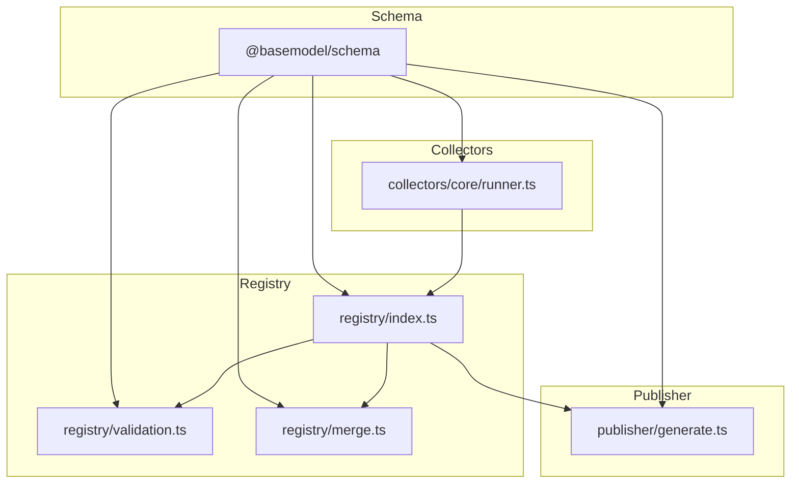
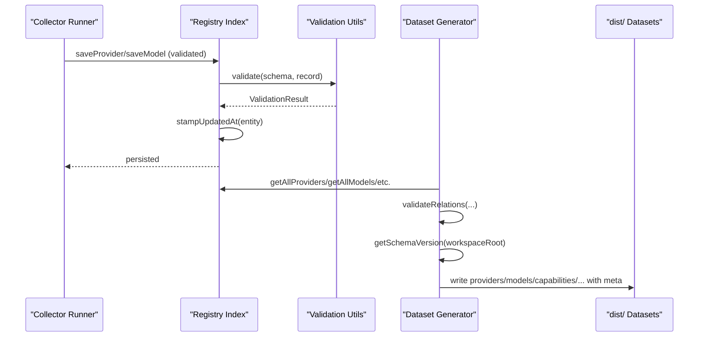
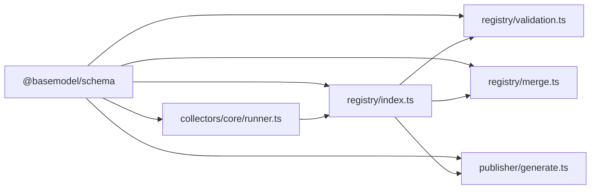

# Schema Evolution & Version Management

<cite>
**Referenced Files in This Document**
- [README.md](file://README.md)
- [package.json](file://package.json)
- [05_Data_Model.md](file://docs/05_Data_Model.md)
- [04_Pipeline.md](file://docs/04_Pipeline.md)
- [validation.ts](file://packages/registry/src/validation.ts)
- [index.ts](file://packages/registry/src/index.ts)
- [merge.ts](file://packages/registry/src/merge.ts)
- [generate.ts](file://packages/publisher/src/generate.ts)
- [runner.ts](file://packages/collectors/src/core/runner.ts)
</cite>

## Table of Contents
1. [Introduction](#introduction)
2. [Project Structure](#project-structure)
3. [Core Components](#core-components)
4. [Architecture Overview](#architecture-overview)
5. [Detailed Component Analysis](#detailed-component-analysis)
6. [Dependency Analysis](#dependency-analysis)
7. [Performance Considerations](#performance-considerations)
8. [Troubleshooting Guide](#troubleshooting-guide)
9. [Conclusion](#conclusion)
10. [Appendices](#appendices)

## Introduction
This document defines the schema evolution and version management strategy for the project. It explains how schemas are defined, validated, merged, published, and consumed across components. It also covers backward compatibility requirements, migration procedures, deprecation policies, version numbering schemes, change impact analysis, rollback strategies, distributed synchronization considerations, conflict resolution, consensus mechanisms, and end-to-end review and deployment procedures.

The system centers on a canonical schema package that is referenced by collectors, registry operations, and dataset generation. Published datasets carry explicit metadata including schema_version and source_revision to ensure traceability and safe consumption.

## Project Structure
At a high level:
- Canonical schemas and types live in the schema package (referenced by other packages).
- The registry layer reads/writes entities with validation and merge utilities.
- The publisher generates datasets with schema_version and source_revision metadata.
- Collectors validate and stamp records before persisting them.

**Diagram sources**
- [index.ts:1-48](file://packages/registry/src/index.ts#L1-L48)
- [validation.ts:1-42](file://packages/registry/src/validation.ts#L1-L42)
- [merge.ts:47-68](file://packages/registry/src/merge.ts#L47-L68)
- [generate.ts:108-146](file://packages/publisher/src/generate.ts#L108-L146)
- [runner.ts:337-363](file://packages/collectors/src/core/runner.ts#L337-L363)

**Section sources**
- [README.md:10-30](file://README.md#L10-L30)
- [05_Data_Model.md:1-22](file://docs/05_Data_Model.md#L1-L22)

## Core Components
- Schema package: Defines canonical Zod schemas and TypeScript types used throughout the system.
- Registry layer: Provides storage, validation, and merge utilities; stamps updated_at timestamps; enforces entity schemas.
- Publisher: Generates datasets with schema_version and source_revision; validates cross-entity relations prior to writing outputs.
- Collectors: Validate and persist provider/model records using canonical schemas; stamp freshness.

Key responsibilities:
- Validation: All inputs are validated against canonical schemas before persistence or publication.
- Versioning: Datasets include schema_version and source_revision for traceability.
- Merge: Curated fields take precedence over collector data; capability_ids and license_id preserved when present.
- Stamping: Entities receive updated_at timestamps to support staleness detection.

**Section sources**
- [validation.ts:1-42](file://packages/registry/src/validation.ts#L1-L42)
- [index.ts:34-48](file://packages/registry/src/index.ts#L34-L48)
- [merge.ts:47-68](file://packages/registry/src/merge.ts#L47-L68)
- [generate.ts:108-146](file://packages/publisher/src/generate.ts#L108-L146)
- [runner.ts:337-363](file://packages/collectors/src/core/runner.ts#L337-L363)

## Architecture Overview
The schema evolution lifecycle spans collection, validation, merging, publishing, and consumption. Each stage enforces schema compliance and tracks provenance.

**Diagram sources**
- [runner.ts:337-363](file://packages/collectors/src/core/runner.ts#L337-L363)
- [index.ts:45-83](file://packages/registry/src/index.ts#L45-L83)
- [validation.ts:11-20](file://packages/registry/src/validation.ts#L11-L20)
- [generate.ts:108-146](file://packages/publisher/src/generate.ts#L108-L146)

## Detailed Component Analysis

### Schema Package and Data Model
- Canonical entities include Provider, Model, Capability, Benchmark, Pricing, API, License.
- Identifiers follow stable conventions (provider_id kebab-case, model_id format {provider_id}/{model-slug}).
- Dataset metadata includes schema_version, source_revision, generated_at, count.

Evolution principles:
- Stable domain model with slow evolution.
- Extensible design via new entities rather than replacing existing ones.
- Normalized ownership per entity.

Backward compatibility guidance:
- Prefer additive changes (new optional fields).
- Avoid renaming/removing required fields without deprecation windows.
- Maintain identifier stability.

Migration guidance:
- Introduce new fields as optional.
- Provide transformation scripts to backfill defaults where needed.
- Update consumers incrementally while maintaining compatibility.

Deprecation policy:
- Mark deprecated fields with documentation and tests.
- Keep deprecated fields supported for at least one major cycle.
- Remove only after consumers have migrated.

**Section sources**
- [05_Data_Model.md:23-151](file://docs/05_Data_Model.md#L23-L151)
- [05_Data_Model.md:143-151](file://docs/05_Data_Model.md#L143-L151)

### Registry Validation and Stamping
- Validation utilities provide non-throwing validation and batch validation.
- Registry functions read/write entities, parse via canonical schemas, and stamp updated_at timestamps.
- Benchmarks and pricing use rollup arrays for partial-failure safety.

Implications for evolution:
- Strict schema enforcement prevents drift between collectors and consumers.
- Timestamps enable staleness checks and incremental refresh strategies.

**Section sources**
- [validation.ts:1-42](file://packages/registry/src/validation.ts#L1-L42)
- [index.ts:45-83](file://packages/registry/src/index.ts#L45-L83)
- [index.ts:111-147](file://packages/registry/src/index.ts#L111-L147)

### Merge Strategy and Curated Fields
- When merging, curated fields always win over incoming collector data.
- capability_ids and license_id are preserved if present in existing records.
- Final merged result is validated against ModelSchema.

Impact on evolution:
- Ensures curated overrides remain authoritative.
- Reduces risk of accidental overwrites during merges.

**Section sources**
- [merge.ts:47-68](file://packages/registry/src/merge.ts#L47-L68)

### Dataset Generation and Version Metadata
- The generator computes schema_version from the schema package manifest and source_revision from git.
- Cross-entity relations are validated before any file is written.
- Intelligence and benchmark filtering produce lean, catalog-matched outputs.
- Each dataset file includes schema_version, source_revision, generated_at, and count.

Versioning scheme:
- schema_version reflects the @basemodel/schema package version.
- source_revision ties datasets to a specific code commit.
- generated_at indicates publish time.

Rollback strategy:
- Re-run generation from a known-good commit to restore previous datasets.
- Consumers can check schema_version to enforce compatibility.

**Section sources**
- [generate.ts:50-71](file://packages/publisher/src/generate.ts#L50-L71)
- [generate.ts:108-146](file://packages/publisher/src/generate.ts#L108-L146)
- [04_Pipeline.md:94-94](file://docs/04_Pipeline.md#L94-L94)
- [04_Pipeline.md:227-227](file://docs/04_Pipeline.md#L227-L227)

### Collector Validation and Provider Registration
- Collectors validate provider records against ProviderSchema before saving.
- Providers are registered lazily when first referenced by models.
- Records are stamped with updated_at to indicate freshness.

Evolution implications:
- New provider fields should be optional initially.
- Backward-compatible updates prevent breaking collectors.

**Section sources**
- [runner.ts:337-363](file://packages/collectors/src/core/runner.ts#L337-L363)

## Dependency Analysis
The following diagram shows how components depend on the canonical schema and each other.

**Diagram sources**
- [index.ts:1-48](file://packages/registry/src/index.ts#L1-L48)
- [validation.ts:1-42](file://packages/registry/src/validation.ts#L1-L42)
- [merge.ts:47-68](file://packages/registry/src/merge.ts#L47-L68)
- [generate.ts:108-146](file://packages/publisher/src/generate.ts#L108-L146)
- [runner.ts:337-363](file://packages/collectors/src/core/runner.ts#L337-L363)

**Section sources**
- [package.json:1-31](file://package.json#L1-L31)

## Performance Considerations
- Batch validation reduces overhead when processing large sets of records.
- Rollup files for benchmarks and pricing minimize I/O and improve resilience.
- Pre-validation of relations avoids costly failures post-write.
- Using updated_at enables efficient staleness checks without full scans.

[No sources needed since this section provides general guidance]

## Troubleshooting Guide
Common issues and resolutions:
- Validation errors: Use the provided validation utilities to capture row-level errors and inspect paths/messages.
- Missing schema_version: Ensure the schema package manifest is accessible during generation; fallback version is used if not found.
- Orphaned pricing records: Warnings are emitted for pricing referencing missing models; verify catalog completeness.
- Stale records: Compare updated_at timestamps to detect entries not refreshed recently.

**Section sources**
- [validation.ts:11-20](file://packages/registry/src/validation.ts#L11-L20)
- [generate.ts:108-146](file://packages/publisher/src/generate.ts#L108-L146)

## Conclusion
The schema evolution strategy emphasizes strict validation, clear versioning, and robust publishing. By anchoring all components to canonical schemas and embedding schema_version and source_revision into datasets, the system ensures traceability, safe upgrades, and reliable consumption. Additive changes, careful deprecations, and thorough testing form the backbone of sustainable evolution.

[No sources needed since this section summarizes without analyzing specific files]

## Appendices

### Version Numbering Scheme
- Use semantic versioning for the schema package to signal compatibility:
  - Major: Breaking changes to schemas or identifiers.
  - Minor: Additive changes (new optional fields, new entities).
  - Patch: Non-breaking fixes and clarifications.
- Datasets must reflect the schema_version they were generated against.

**Section sources**
- [generate.ts:50-71](file://packages/publisher/src/generate.ts#L50-L71)
- [04_Pipeline.md:227-227](file://docs/04_Pipeline.md#L227-L227)

### Change Impact Analysis Checklist
- Identify affected entities and fields.
- Determine backward compatibility implications.
- Assess impact on collectors, registry, publisher, and consumers.
- Plan migration steps and deprecation timeline.
- Update tests and quality gates accordingly.

[No sources needed since this section provides general guidance]

### Migration Procedures
- Introduce new fields as optional.
- Provide transformation scripts to backfill defaults.
- Update collectors and publishers to handle both old and new formats.
- Run validation suites and relation checks before deployment.
- Monitor updated_at timestamps to confirm refresh cycles.

[No sources needed since this section provides general guidance]

### Deprecation Policies
- Document deprecated fields and their replacement.
- Support deprecated fields for at least one major cycle.
- Enforce warnings in validation or logging.
- Remove deprecated fields after migration window.

[No sources needed since this section provides general guidance]

### Distributed Schema Synchronization and Conflict Resolution
- Use rollup files for partial-failure safety when aggregating benchmarks/pricing.
- Stamp updated_at to detect stale entries across nodes.
- Implement idempotent writes keyed by entity IDs to avoid duplicates.
- Apply curated-field precedence rules to resolve conflicts deterministically.

**Section sources**
- [index.ts:111-147](file://packages/registry/src/index.ts#L111-L147)
- [merge.ts:47-68](file://packages/registry/src/merge.ts#L47-L68)

### Consensus Mechanisms
- Treat curated overrides as authoritative to reach deterministic merges.
- Require schema validation success before accepting changes.
- Use schema_version gating to ensure consumers operate on compatible datasets.

**Section sources**
- [merge.ts:47-68](file://packages/registry/src/merge.ts#L47-L68)
- [generate.ts:108-146](file://packages/publisher/src/generate.ts#L108-L146)

### Proposing Schema Changes
- Draft change proposal with rationale and impact analysis.
- Include migration plan and deprecation timeline.
- Update schema definitions and tests.
- Run validation suites and relation checks.
- Publish updated schema_version and regenerate datasets.

[No sources needed since this section provides general guidance]

### Review Processes
- Peer review of schema changes and migration scripts.
- Automated checks: linting, type checking, tests, and dataset generation.
- Verify schema_version consistency across datasets.

**Section sources**
- [package.json:17-25](file://package.json#L17-L25)

### Deployment Procedures
- Build and test all packages.
- Generate datasets and verify schema_version and source_revision.
- Deploy artifacts and update consumers to accept new schema_version.
- Monitor updated_at timestamps and error logs.

**Section sources**
- [generate.ts:108-146](file://packages/publisher/src/generate.ts#L108-L146)
- [package.json:17-25](file://package.json#L17-L25)

### Rollback Strategies
- Re-generate datasets from a known-good commit to restore previous state.
- Consumers should reject datasets with incompatible schema_version.
- Maintain versioned datasets for quick recovery.

**Section sources**
- [generate.ts:50-71](file://packages/publisher/src/generate.ts#L50-L71)