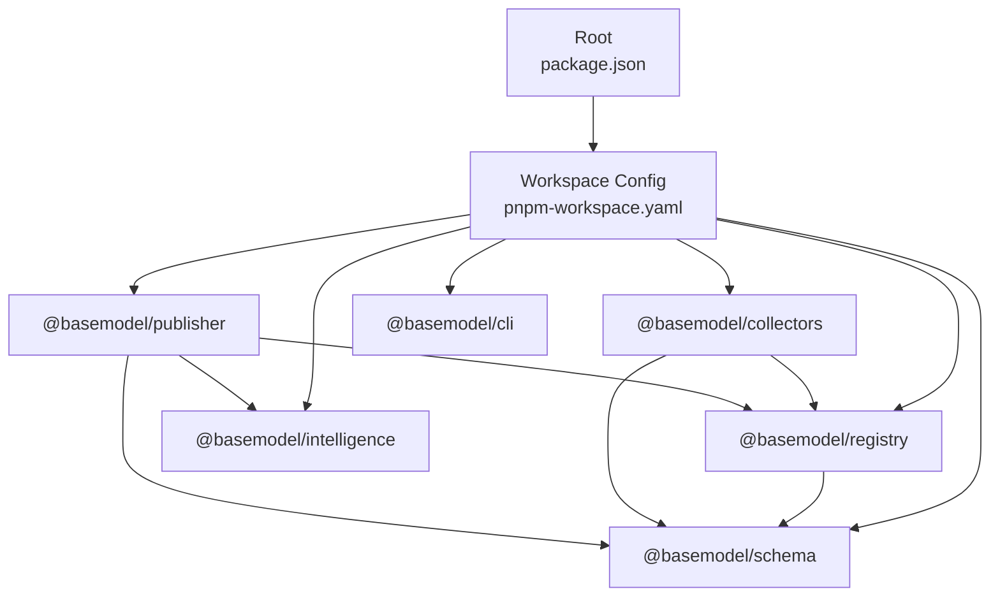
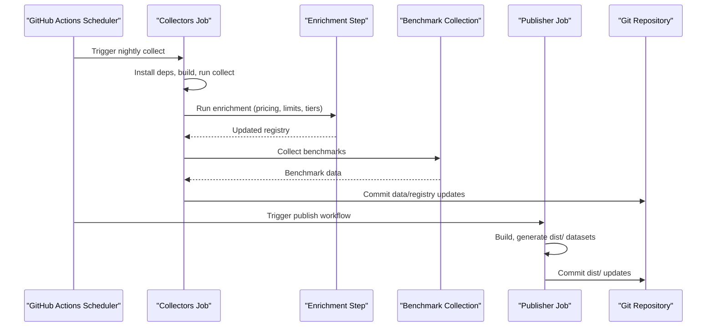
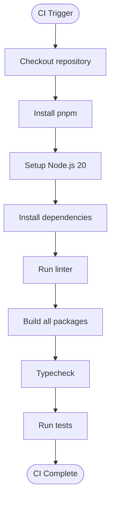
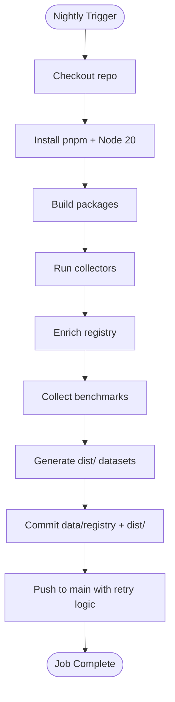
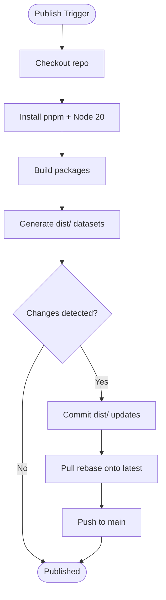
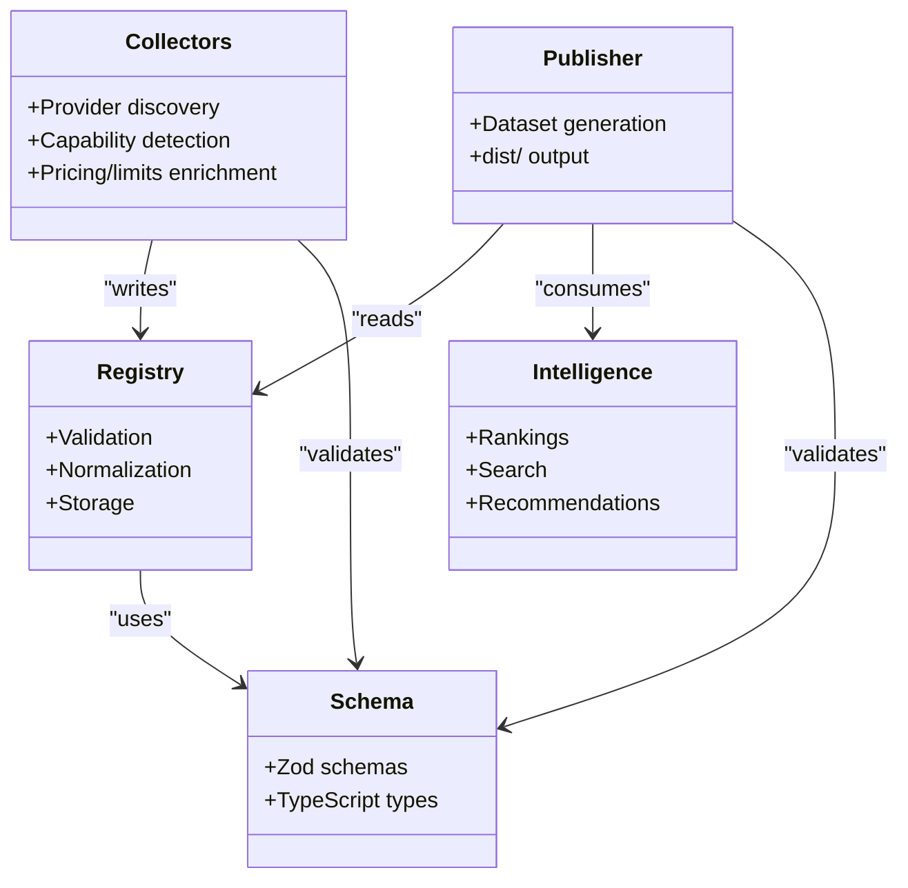
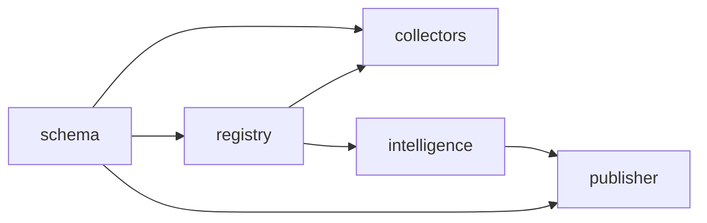

# Deployment & Operations

<cite>
**Referenced Files in This Document**
- [README.md](file://README.md)
- [package.json](file://package.json)
- [pnpm-workspace.yaml](file://pnpm-workspace.yaml)
- [.github/workflows/ci.yml](file://.github/workflows/ci.yml)
- [.github/workflows/collect.yml](file://.github/workflows/collect.yml)
- [.github/workflows/publish.yml](file://.github/workflows/publish.yml)
- [packages/registry/package.json](file://packages/registry/package.json)
- [packages/collectors/package.json](file://packages/collectors/package.json)
- [packages/publisher/package.json](file://packages/publisher/package.json)
</cite>

## Table of Contents
1. [Introduction](#introduction)
2. [Project Structure](#project-structure)
3. [Core Components](#core-components)
4. [Architecture Overview](#architecture-overview)
5. [Detailed Component Analysis](#detailed-component-analysis)
6. [Dependency Analysis](#dependency-analysis)
7. [Performance Considerations](#performance-considerations)
8. [Troubleshooting Guide](#troubleshooting-guide)
9. [Conclusion](#conclusion)
10. [Appendices](#appendices)

## Introduction
This document provides production-grade deployment and operations guidance for BaseModel, an open-source AI model intelligence platform that discovers, validates, normalizes, stores, analyzes, and publishes structured knowledge about AI models. BaseModel is not an inference runtime or chatbot; it is a data layer that other systems consume. The platform produces canonical datasets under dist/ and maintains authoritative registry records under data/registry/.

Key operational characteristics:
- Data pipeline driven by GitHub Actions (nightly collection, enrichment, benchmarking, dataset generation).
- Multi-package monorepo using pnpm workspaces with Node.js 20+ and pnpm 9+.
- Published artifacts are static JSON datasets consumed by downstream consumers.

[No sources needed since this section summarizes without analyzing specific files]

## Project Structure
BaseModel is organized as a pnpm workspace with distinct packages:
- schema: Canonical Zod schemas and TypeScript types.
- registry: Registry storage, validation, and merge utilities.
- collectors: Provider and gateway collectors to discover and enrich model metadata.
- intelligence: Derived rankings, search, and recommendations.
- publisher: Dataset generation for dist/.
- cli: Command-line interface for querying intelligence.

The root package.json defines shared scripts and toolchain requirements. Workspaces are declared in pnpm-workspace.yaml.

**Diagram sources**
- [package.json:17-25](file://package.json#L17-L25)
- [pnpm-workspace.yaml:1-3](file://pnpm-workspace.yaml#L1-L3)

**Section sources**
- [README.md:11-30](file://README.md#L11-L30)
- [package.json:1-31](file://package.json#L1-L31)
- [pnpm-workspace.yaml:1-3](file://pnpm-workspace.yaml#L1-L3)

## Core Components
- Registry: Validates, normalizes, and merges canonical model data. Built on Zod schemas and TypeScript types.
- Collectors: Discover provider capabilities, pricing, limits, and benchmarks; enrich registry entries.
- Publisher: Generates published datasets under dist/ from the registry and intelligence layers.
- CI/CD: GitHub Actions workflows implement build, test, nightly collection, enrichment, benchmarking, and dataset publishing.

Operational implications:
- Nightly jobs require secrets for external providers and services.
- Dataset generation depends on successful collection and enrichment steps.
- All packages use tsup for building ESM outputs and type declarations.

**Section sources**
- [packages/registry/package.json:1-35](file://packages/registry/package.json#L1-L35)
- [packages/collectors/package.json:1-41](file://packages/collectors/package.json#L1-L41)
- [packages/publisher/package.json:1-38](file://packages/publisher/package.json#L1-L38)
- [.github/workflows/collect.yml:1-108](file://.github/workflows/collect.yml#L1-L108)
- [.github/workflows/publish.yml:1-63](file://.github/workflows/publish.yml#L1-L63)

## Architecture Overview
BaseModel’s production architecture centers around a data pipeline orchestrated by GitHub Actions:
- Collectors run against multiple providers to gather model metadata and capabilities.
- Enrichment adds pricing, limits, tiers, and benchmark data.
- Publisher generates static datasets consumed by downstream applications.
- CI ensures code quality, builds, type checks, and tests pass before changes land.

**Diagram sources**
- [.github/workflows/collect.yml:42-76](file://.github/workflows/collect.yml#L42-L76)
- [.github/workflows/publish.yml:37-58](file://.github/workflows/publish.yml#L37-L58)

**Section sources**
- [.github/workflows/ci.yml:1-41](file://.github/workflows/ci.yml#L1-L41)
- [.github/workflows/collect.yml:1-108](file://.github/workflows/collect.yml#L1-L108)
- [.github/workflows/publish.yml:1-63](file://.github/workflows/publish.yml#L1-L63)

## Detailed Component Analysis

### CI Pipeline
The CI workflow enforces consistent builds, linting, type checking, and testing across all packages. It runs on Ubuntu with Node.js 20 and pnpm 9.

**Diagram sources**
- [.github/workflows/ci.yml:10-41](file://.github/workflows/ci.yml#L10-L41)

**Section sources**
- [.github/workflows/ci.yml:1-41](file://.github/workflows/ci.yml#L1-L41)

### Nightly Data Collection
The nightly job orchestrates end-to-end data collection, enrichment, benchmarking, and dataset generation. It requires numerous provider API keys configured as GitHub Secrets.

**Diagram sources**
- [.github/workflows/collect.yml:14-108](file://.github/workflows/collect.yml#L14-L108)

**Section sources**
- [.github/workflows/collect.yml:1-108](file://.github/workflows/collect.yml#L1-L108)

### Dataset Publishing
The publish workflow regenerates datasets when changes are detected and commits them back to the repository. It includes conflict resolution logic for concurrent pushes.

**Diagram sources**
- [.github/workflows/publish.yml:13-63](file://.github/workflows/publish.yml#L13-L63)

**Section sources**
- [.github/workflows/publish.yml:1-63](file://.github/workflows/publish.yml#L1-L63)

### Package Dependencies
Each package declares its dependencies and build scripts. The registry and publishers depend on schema definitions, while collectors depend on both registry and schema.

**Diagram sources**
- [packages/registry/package.json:22-25](file://packages/registry/package.json#L22-L25)
- [packages/collectors/package.json:26-29](file://packages/collectors/package.json#L26-L29)
- [packages/publisher/package.json:23-27](file://packages/publisher/package.json#L23-L27)

**Section sources**
- [packages/registry/package.json:1-35](file://packages/registry/package.json#L1-L35)
- [packages/collectors/package.json:1-41](file://packages/collectors/package.json#L1-L41)
- [packages/publisher/package.json:1-38](file://packages/publisher/package.json#L1-L38)

## Dependency Analysis
BaseModel uses a layered dependency structure where higher-level components depend on foundational ones:
- schema: Foundation layer with canonical types and validation rules.
- registry: Builds on schema for data integrity.
- collectors: Depends on registry and schema for data ingestion.
- intelligence: Processes registry data for derived insights.
- publisher: Consumes registry and intelligence to produce final datasets.

**Diagram sources**
- [packages/registry/package.json:22-25](file://packages/registry/package.json#L22-L25)
- [packages/collectors/package.json:26-29](file://packages/collectors/package.json#L26-L29)
- [packages/publisher/package.json:23-27](file://packages/publisher/package.json#L23-L27)

**Section sources**
- [packages/registry/package.json:1-35](file://packages/registry/package.json#L1-L35)
- [packages/collectors/package.json:1-41](file://packages/collectors/package.json#L1-L41)
- [packages/publisher/package.json:1-38](file://packages/publisher/package.json#L1-L38)

## Performance Considerations
- Build optimization: Use pnpm caching in CI to speed up dependency installation.
- Parallel execution: Leverage GitHub Actions matrix strategies for multi-provider collection if needed.
- Memory allocation: Node.js 20 provides improved memory management; monitor collector processes for large datasets.
- I/O throughput: Ensure sufficient disk space for data/registry and dist/ directories during collection and generation.
- Network timeouts: Configure appropriate timeouts for provider API calls to prevent long-running tasks.

[No sources needed since this section provides general guidance]

## Troubleshooting Guide
Common issues and resolutions:
- Missing provider secrets: Ensure all required API keys are configured in GitHub Secrets.
- Permission errors: Verify repository permissions for pushing to main branch.
- Concurrent push conflicts: The collect workflow includes retry logic; manual intervention may be needed for persistent conflicts.
- Build failures: Check Node.js version compatibility (20+) and pnpm version (9+).
- Dataset generation errors: Validate registry data integrity and schema compliance.

**Section sources**
- [.github/workflows/collect.yml:44-63](file://.github/workflows/collect.yml#L44-L63)
- [.github/workflows/collect.yml:86-107](file://.github/workflows/collect.yml#L86-L107)
- [.github/workflows/publish.yml:43-62](file://.github/workflows/publish.yml#L43-L62)

## Conclusion
BaseModel provides a robust, automated pipeline for maintaining comprehensive AI model intelligence data. The GitHub Actions-based approach ensures consistent data collection, validation, and publication. For production deployments, focus on securing provider credentials, monitoring pipeline health, and establishing proper backup procedures for critical data directories.

[No sources needed since this section summarizes without analyzing specific files]

## Appendices

### Infrastructure Requirements
- Runtime: Node.js 20+, pnpm 9+
- Storage: Sufficient disk space for data/registry and dist/ directories
- Network: Access to external provider APIs and services
- CI/CD: GitHub Actions with appropriate permissions and secrets

### Security Hardening
- Store provider API keys as GitHub Secrets
- Limit repository access to authorized personnel
- Implement branch protection rules for main branch
- Regular security audits of dependencies

### Monitoring and Alerting
- Monitor GitHub Actions workflow success/failure rates
- Track dataset freshness and size metrics
- Set up alerts for failed collection or publishing jobs
- Implement health checks for data integrity

### Backup and Recovery
- Regular backups of data/registry directory
- Version control history serves as primary backup mechanism
- Disaster recovery plan should include re-running collection workflows
- Data retention policies should align with business requirements

**Section sources**
- [package.json:12-15](file://package.json#L12-L15)
- [README.md:19-30](file://README.md#L19-L30)
- [.github/workflows/collect.yml:10-11](file://.github/workflows/collect.yml#L10-L11)