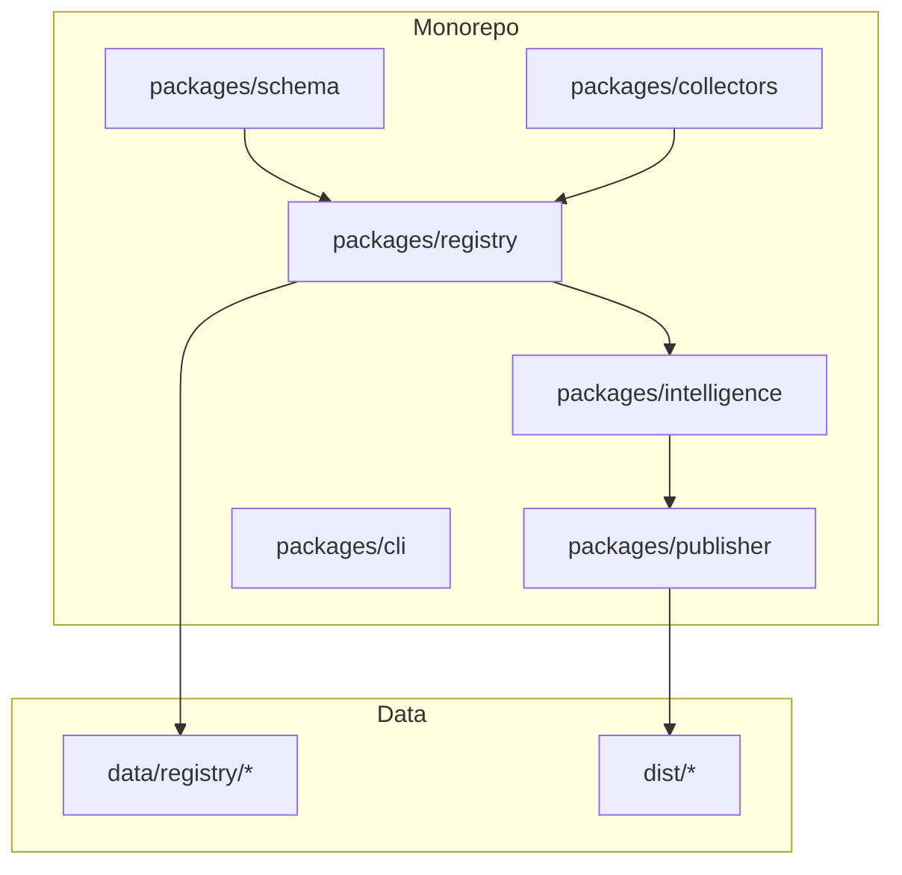
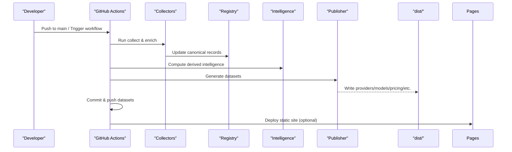
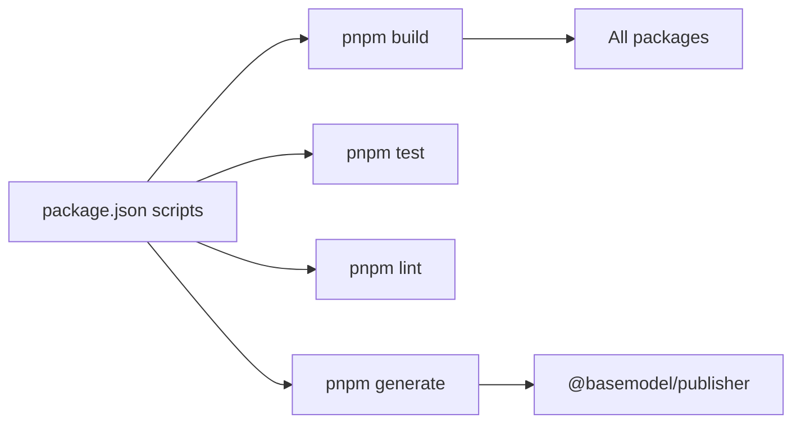

# Deployment Strategies

<cite>
**Referenced Files in This Document**
- [README.md](file://README.md)
- [package.json](file://package.json)
- [pnpm-workspace.yaml](file://pnpm-workspace.yaml)
- [03_Architecture.md](file://docs/03_Architecture.md)
- [04_Pipeline.md](file://docs/04_Pipeline.md)
- [ci.yml](file://.github/workflows/ci.yml)
- [collect.yml](file://.github/workflows/collect.yml)
- [deploy-pages.yml](file://.github/workflows/deploy-pages.yml)
- [publish.yml](file://.github/workflows/publish.yml)
</cite>

## Table of Contents
1. [Introduction](#introduction)
2. [Project Structure](#project-structure)
3. [Core Components](#core-components)
4. [Architecture Overview](#architecture-overview)
5. [Detailed Component Analysis](#detailed-component-analysis)
6. [Dependency Analysis](#dependency-analysis)
7. [Performance Considerations](#performance-considerations)
8. [Troubleshooting Guide](#troubleshooting-guide)
9. [Conclusion](#conclusion)
10. [Appendices](#appendices)

## Introduction
This document provides comprehensive deployment strategies for BaseModel, focusing on containerization (Docker), orchestration (Kubernetes and Helm), cloud platform deployments (AWS, GCP, Azure, Vercel), infrastructure as code (Terraform/CloudFormation), scaling and load balancing, CI/CD pipelines, environment-specific configurations, and production integrations such as databases, caching, and external services. BaseModel is a data layer that discovers, validates, normalizes, stores, analyzes, and publishes structured knowledge about AI models; it is not an inference runtime or model host. The repository produces static datasets under dist/ and maintains canonical registry data under data/registry/.

## Project Structure
BaseModel is a pnpm monorepo with packages for schema, registry, collectors, intelligence, publisher, and cli. The pipeline builds these packages, runs collectors to update the registry, generates static datasets, and publishes them via GitHub Pages or other mirrors.

**Diagram sources**
- [03_Architecture.md:37-44](file://docs/03_Architecture.md#L37-L44)
- [04_Pipeline.md:42-78](file://docs/04_Pipeline.md#L42-L78)

**Section sources**
- [README.md:11-30](file://README.md#L11-L30)
- [03_Architecture.md:37-44](file://docs/03_Architecture.md#L37-L44)
- [04_Pipeline.md:42-78](file://docs/04_Pipeline.md#L42-L78)

## Core Components
- Schema: Canonical Zod schemas and TypeScript types used across the system.
- Registry: Storage, validation, and merge utilities for canonical records.
- Collectors: Provider and gateway collectors to discover and fetch model metadata.
- Intelligence: Derived rankings, search, and recommendations from registry data.
- Publisher: Generates public datasets into dist/.
- CLI: Command-line interface for querying intelligence.

These components are orchestrated by CI/CD workflows to build, collect, enrich, generate, and publish datasets.

**Section sources**
- [03_Architecture.md:37-44](file://docs/03_Architecture.md#L37-L44)
- [04_Pipeline.md:16-84](file://docs/04_Pipeline.md#L16-L84)

## Architecture Overview
BaseModel’s architecture emphasizes separation between discovery, registry, intelligence, and publishing layers. The pipeline automates collection, enrichment, generation, and publication.

**Diagram sources**
- [collect.yml:13-76](file://.github/workflows/collect.yml#L13-L76)
- [publish.yml:12-41](file://.github/workflows/publish.yml#L12-L41)
- [deploy-pages.yml:19-59](file://.github/workflows/deploy-pages.yml#L19-L59)
- [04_Pipeline.md:16-84](file://docs/04_Pipeline.md#L16-L84)

## Detailed Component Analysis

### Containerization with Docker
Recommended approach: multi-stage builds to produce a minimal runtime image for dataset consumers and a builder image for generating datasets.

- Builder stage: Node.js 20+, pnpm, install dependencies, build all packages, run publisher to generate dist/.
- Runtime stage: Minimal Node image serving static files from dist/ using a lightweight HTTP server or CDN-backed distribution.

Key considerations:
- Pin Node version to match engines in package.json.
- Cache pnpm store to speed up builds.
- Use non-root user in final image.
- Expose only necessary ports if running a local server.

Example structure (conceptual):
- Dockerfile.builder: installs Node, pnpm, copies workspace, runs build and generate.
- Dockerfile.runtime: copies dist/ and serves static content.

[No sources needed since this section provides general guidance]

### Kubernetes Manifests
Deployments should include:
- Namespace and resource quotas.
- ConfigMaps for environment variables (API keys, base URLs).
- Secrets for sensitive values (provider API keys, tokens).
- Deployment with replicas, resource requests/limits, health checks.
- Service for internal access.
- Ingress for external access with TLS.
- HorizontalPodAutoscaler for auto-scaling based on CPU/memory or custom metrics.
- PersistentVolumeClaim if stateful workloads are introduced (not required for current static dataset generation).

Best practices:
- Use readiness/liveness probes for liveness and readiness.
- Set resource limits to avoid noisy neighbor issues.
- Use rolling updates and rollback policies.
- Enable PodDisruptionBudgets for high availability.

[No sources needed since this section provides general guidance]

### Helm Charts
Helm chart should parameterize:
- Image repository and tag.
- Replicas count.
- Resource requests/limits.
- Environment variables via values.yaml.
- Ingress domain and TLS configuration.
- Autoscaling thresholds.

Chart structure:
- Chart.yaml
- values.yaml
- templates/deployment.yaml
- templates/service.yaml
- templates/ingress.yaml
- templates/hpa.yaml
- templates/configmap.yaml
- templates/secret.yaml

[No sources needed since this section provides general guidance]

### Cloud Platform Deployments

#### AWS
Options:
- ECS/Fargate: Stateless tasks serving static assets or running generator jobs.
- EKS: Full Kubernetes control plane with managed node groups.
- S3 + CloudFront: Host generated static datasets behind a CDN.
- CodePipeline + CodeBuild: CI/CD pipeline to build, generate, and deploy artifacts.

Configuration highlights:
- IAM roles with least privilege for S3, ECR, ECS/EKS.
- Secrets Manager for API keys.
- Auto Scaling Groups or ECS service scaling policies.
- Route 53 for DNS and ACM for TLS.

[No sources needed since this section provides general guidance]

#### Google Cloud Platform (GCP)
Options:
- Cloud Run: Serverless containers for static hosting or batch jobs.
- GKE: Managed Kubernetes cluster.
- Cloud Storage + Cloud CDN: Static hosting for dist/.
- Cloud Build: CI/CD pipeline.

Configuration highlights:
- Service Accounts with minimal permissions.
- Secret Manager for secrets.
- Autoscaling policies for Cloud Run or HPA for GKE.
- Cloud Armor for WAF and rate limiting.

[No sources needed since this section provides general guidance]

#### Microsoft Azure
Options:
- Azure Container Apps: Serverless containers.
- AKS: Managed Kubernetes.
- Azure Blob Storage + CDN: Static hosting.
- GitHub Actions or Azure Pipelines: CI/CD.

Configuration highlights:
- Managed Identities for secure access.
- Key Vault for secrets.
- Autoscale rules based on CPU or custom metrics.
- Front Door for global routing and TLS termination.

[No sources needed since this section provides general guidance]

#### Vercel
Vercel is ideal for deploying static sites and APIs. For BaseModel:
- Connect repository to Vercel.
- Configure build command to run pnpm build and pnpm generate.
- Output directory set to dist/.
- Environment variables configured in Vercel dashboard.
- Custom domains and SSL enabled automatically.

Notes:
- Vercel does not run long-lived background jobs; use serverless functions or external schedulers for periodic collection.
- Use Vercel Edge Functions for lightweight transformations if needed.

[No sources needed since this section provides general guidance]

### Infrastructure as Code Templates

#### Terraform
Modules to consider:
- Container registry (ECR/GCR/ACR).
- Container orchestration (EKS/GKE/AKS).
- Storage buckets (S3/GCS/Azure Blob).
- CDN (CloudFront/CloudFront/CloudFront).
- Secrets management (Secrets Manager/Secret Manager/Key Vault).
- Networking (VPC/VNet, subnets, load balancers).
- Monitoring and logging (CloudWatch/Stackdriver/Log Analytics).

State management:
- Remote backend (S3/GCS/Blob) with locking.
- Workspace per environment (dev/staging/prod).

[No sources needed since this section provides general guidance]

#### CloudFormation
Templates to define:
- ECS clusters and task definitions.
- EKS clusters and node groups.
- S3 buckets and CloudFront distributions.
- IAM roles and policies.
- Secrets Manager resources.
- Auto Scaling policies.

Use nested stacks for modularization and parameters for environment-specific values.

[No sources needed since this section provides general guidance]

### Scaling Strategies

#### Horizontal Scaling
- Increase replicas for stateless services.
- Use autoscaling policies based on CPU, memory, or custom metrics.
- Ensure session affinity is not required unless stateful.

#### Vertical Scaling
- Increase CPU/memory limits for pods/tasks.
- Monitor resource utilization and adjust requests/limits.

#### Load Balancing
- Use application load balancers or ingress controllers.
- Configure health checks and traffic routing rules.
- Enable sticky sessions only when necessary.

#### Auto-Scaling Policies
- Define min/max replicas.
- Set target utilization thresholds.
- Include cooldown periods to prevent flapping.

[No sources needed since this section provides general guidance]

### CI/CD Pipelines
BaseModel already includes GitHub Actions workflows:
- ci.yml: Lint, build, typecheck, test.
- collect.yml: Nightly data collection, enrichment, benchmark collection, dataset generation, commit and push.
- publish.yml: Regenerate datasets on push to main and commit changes.
- deploy-pages.yml: Deploy static site to GitHub Pages.

Recommendations:
- Add environment protection rules for staging and production.
- Use secrets for provider API keys and tokens.
- Implement artifact retention and caching.
- Add security scanning (SAST/DAST) and dependency checks.

**Section sources**
- [ci.yml:1-41](file://.github/workflows/ci.yml#L1-L41)
- [collect.yml:1-110](file://.github/workflows/collect.yml#L1-L110)
- [publish.yml:1-63](file://.github/workflows/publish.yml#L1-L63)
- [deploy-pages.yml:1-61](file://.github/workflows/deploy-pages.yml#L1-L61)

### Environment-Specific Configurations
- Development: Local pnpm setup, minimal secrets, optional mock providers.
- Staging: Full pipeline execution with limited scope, integration tests, synthetic data.
- Production: Strict secrets management, monitoring, alerting, backups, and rollback procedures.

Environment variables commonly used:
- Provider API keys (OpenAI, Anthropic, Google AI, OpenRouter, Groq, etc.).
- Benchmark tokens (BENCHMARKS_FETCH_TOKEN).
- Gateway base URLs and authentication tokens.
- Cloud provider credentials and region settings.

**Section sources**
- [collect.yml:44-62](file://.github/workflows/collect.yml#L44-L62)
- [04_Pipeline.md:127-161](file://docs/04_Pipeline.md#L127-L161)

### Database Setup
BaseModel currently stores canonical records as JSON files under data/registry/. For production:
- Version control the registry with Git.
- Use object storage (S3/GCS/Azure Blob) for durable, scalable storage.
- Implement backup and restore procedures.
- Consider adding a database layer if dynamic writes are required beyond CI/CD.

[No sources needed since this section provides general guidance]

### Caching Layer Configuration
- CDN caching for static datasets served from dist/.
- In-memory cache for frequently accessed intelligence queries.
- TTL policies to balance freshness and performance.
- Cache invalidation strategies on dataset regeneration.

[No sources needed since this section provides general guidance]

### External Service Integrations
- Provider APIs: OpenAI, Anthropic, Google AI, OpenRouter, Groq, etc.
- Benchmark sources: LMArena, Open LLM Leaderboard, Mirror.
- Enrichment sources: OpenRouter pricing, Hugging Face Inference Providers.

Integration best practices:
- Rate limiting and retry logic.
- Circuit breakers for resilience.
- Observability with logs and metrics.
- Secure secret management.

**Section sources**
- [collect.yml:44-72](file://.github/workflows/collect.yml#L44-L72)
- [04_Pipeline.md:94-126](file://docs/04_Pipeline.md#L94-L126)
- [04_Pipeline.md:127-161](file://docs/04_Pipeline.md#L127-L161)

## Dependency Analysis
The monorepo dependencies are managed via pnpm workspaces. Scripts in package.json orchestrate build, test, lint, typecheck, and generation. Workflows depend on Node.js 20+ and pnpm 9+.

**Diagram sources**
- [package.json:17-25](file://package.json#L17-L25)
- [pnpm-workspace.yaml:1-3](file://pnpm-workspace.yaml#L1-L3)

**Section sources**
- [package.json:1-31](file://package.json#L1-L31)
- [pnpm-workspace.yaml:1-3](file://pnpm-workspace.yaml#L1-L3)

## Performance Considerations
- Optimize Docker builds with multi-stage and layer caching.
- Use CDN for static asset delivery.
- Implement efficient caching for intelligence queries.
- Scale horizontally during peak collection/generation times.
- Monitor resource usage and tune autoscaling policies.

[No sources needed since this section provides general guidance]

## Troubleshooting Guide
Common issues:
- Authentication failures with provider APIs: verify secrets and scopes.
- Rate limiting errors: implement retries and backoff.
- Dataset generation failures: check logs and validate inputs.
- CI/CD race conditions: ensure proper locking and rebase strategies.

Debugging steps:
- Inspect workflow logs for error traces.
- Validate registry files for schema compliance.
- Test collectors locally with minimal datasets.
- Use feature flags to isolate problematic stages.

**Section sources**
- [collect.yml:77-110](file://.github/workflows/collect.yml#L77-L110)
- [04_Pipeline.md:86-92](file://docs/04_Pipeline.md#L86-L92)

## Conclusion
BaseModel provides a robust foundation for AI model intelligence through its layered architecture and automated pipeline. By adopting containerization, orchestration, and cloud-native deployment strategies, teams can scale reliably and maintain high availability. Infrastructure as code ensures reproducibility and governance, while CI/CD pipelines automate data collection, enrichment, and publication. Following the recommended practices will enable production-ready deployments across major cloud platforms.

## Appendices

### Quick Start Commands
- Install dependencies: pnpm install
- Build packages: pnpm build
- Generate datasets: pnpm generate
- Run collectors: pnpm --filter @basemodel/collectors run collect

**Section sources**
- [README.md:44-51](file://README.md#L44-L51)
- [package.json:17-25](file://package.json#L17-L25)