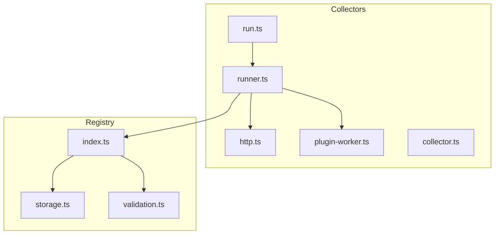
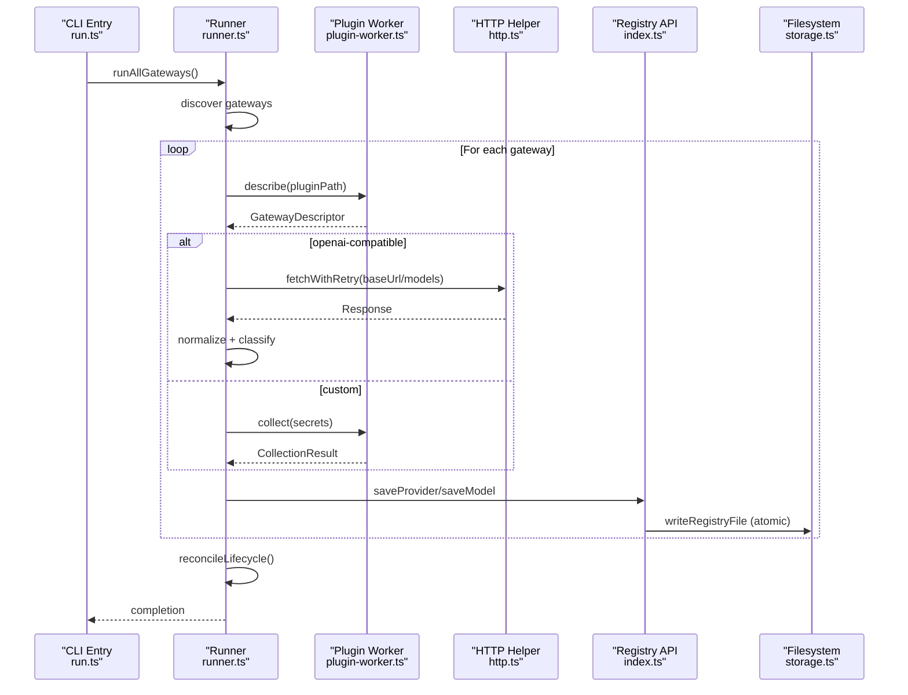
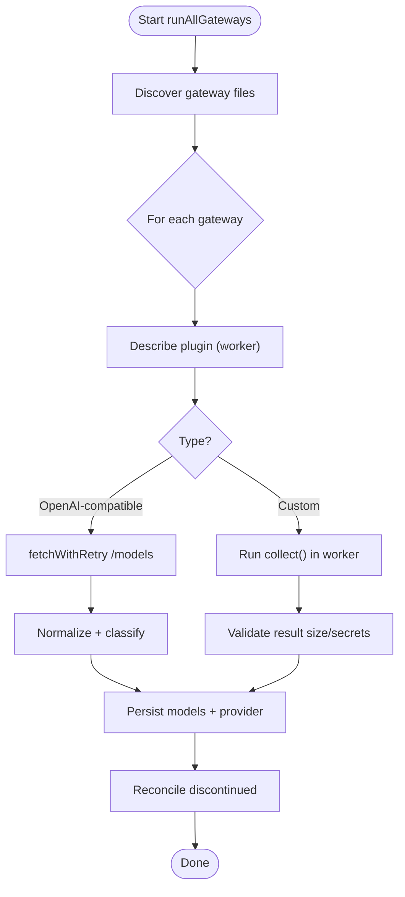
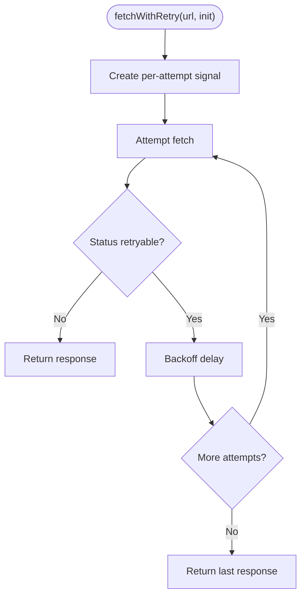
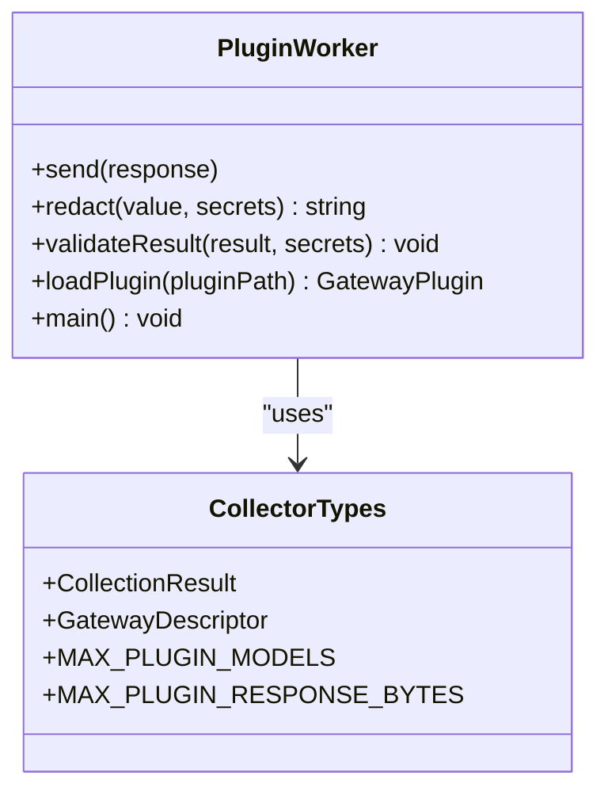
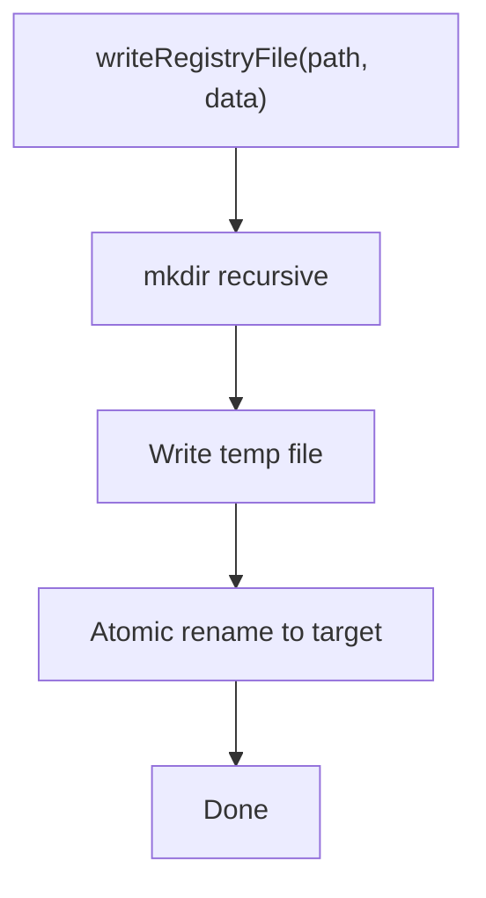
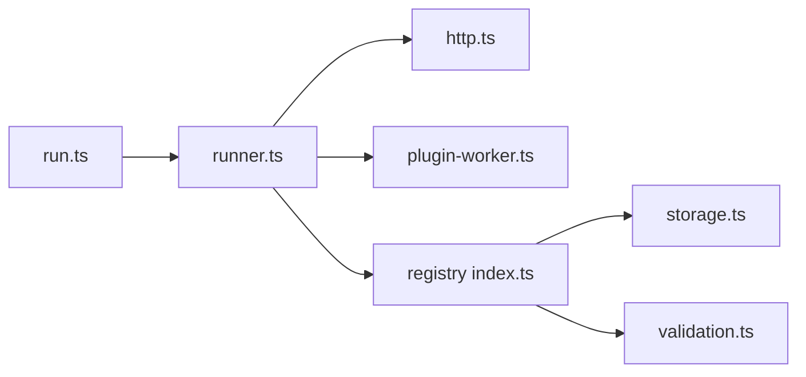

# Monitoring & Logging

<cite>
**Referenced Files in This Document**
- [README.md](file://README.md)
- [run.ts](file://packages/collectors/src/run.ts)
- [runner.ts](file://packages/collectors/src/core/runner.ts)
- [http.ts](file://packages/collectors/src/core/http.ts)
- [plugin-worker.ts](file://packages/collectors/src/core/plugin-worker.ts)
- [collector.ts](file://packages/collectors/src/core/collector.ts)
- [index.ts](file://packages/registry/src/index.ts)
- [storage.ts](file://packages/registry/src/storage.ts)
- [validation.ts](file://packages/registry/src/validation.ts)
- [package.json](file://packages/collectors/package.json)
</cite>

## Table of Contents
1. [Introduction](#introduction)
2. [Project Structure](#project-structure)
3. [Core Components](#core-components)
4. [Architecture Overview](#architecture-overview)
5. [Detailed Component Analysis](#detailed-component-analysis)
6. [Dependency Analysis](#dependency-analysis)
7. [Performance Considerations](#performance-considerations)
8. [Troubleshooting Guide](#troubleshooting-guide)
9. [Conclusion](#conclusion)
10. [Appendices](#appendices)

## Introduction
This document defines the monitoring and logging strategy for BaseModel’s data collection pipeline, focusing on how to instrument Prometheus metrics, Grafana dashboards, alerting rules, structured logging with ELK (or similar), APM setup, error tracking, debugging workflows, KPIs, log rotation/retention, compliance considerations, and operational runbooks. It is grounded in the existing collector and registry code that orchestrates gateway plugins, HTTP retries, worker isolation, and atomic file persistence.

## Project Structure
BaseModel organizes functionality into packages: collectors orchestrate discovery and normalization; registry persists validated records; schema provides canonical types. The collectors package exposes a CLI entrypoint that runs all gateway plugins, executes them in isolated workers, and persists results via the registry.

**Diagram sources**
- [run.ts:1-17](file://packages/collectors/src/run.ts#L1-L17)
- [runner.ts:1-475](file://packages/collectors/src/core/runner.ts#L1-L475)
- [http.ts:1-37](file://packages/collectors/src/core/http.ts#L1-L37)
- [plugin-worker.ts:1-113](file://packages/collectors/src/core/plugin-worker.ts#L1-L113)
- [collector.ts:1-89](file://packages/collectors/src/core/collector.ts#L1-L89)
- [index.ts:1-169](file://packages/registry/src/index.ts#L1-L169)
- [storage.ts:1-153](file://packages/registry/src/storage.ts#L1-L153)
- [validation.ts:1-42](file://packages/registry/src/validation.ts#L1-L42)

**Section sources**
- [README.md:1-61](file://README.md#L1-L61)

## Core Components
- Collector interfaces and limits define what providers return and guardrails for plugin outputs.
- Runner orchestrates plugin discovery, execution, persistence, and lifecycle reconciliation.
- HTTP helper centralizes retry/backoff behavior for upstream APIs.
- Plugin worker isolates custom plugin execution and validates responses.
- Registry provides typed read/write operations and validation utilities.

Key responsibilities for observability:
- Instrument network calls and plugin execution durations.
- Emit structured logs at consistent points (start/end/errors).
- Persist timestamps and updated_at fields to support freshness checks.
- Track success/failure per provider and model counts.

**Section sources**
- [collector.ts:1-89](file://packages/collectors/src/core/collector.ts#L1-L89)
- [runner.ts:1-475](file://packages/collectors/src/core/runner.ts#L1-L475)
- [http.ts:1-37](file://packages/collectors/src/core/http.ts#L1-L37)
- [plugin-worker.ts:1-113](file://packages/collectors/src/core/plugin-worker.ts#L1-L113)
- [index.ts:1-169](file://packages/registry/src/index.ts#L1-L169)
- [storage.ts:1-153](file://packages/registry/src/storage.ts#L1-L153)
- [validation.ts:1-42](file://packages/registry/src/validation.ts#L1-L42)

## Architecture Overview
The collectors pipeline discovers gateway plugins, describes them safely, executes them either via simple OpenAI-compatible endpoints or custom workers, normalizes and merges models, persists atomically, and reconciles discontinued models when catalogs change.

**Diagram sources**
- [run.ts:1-17](file://packages/collectors/src/run.ts#L1-L17)
- [runner.ts:1-475](file://packages/collectors/src/core/runner.ts#L1-L475)
- [http.ts:1-37](file://packages/collectors/src/core/http.ts#L1-L37)
- [plugin-worker.ts:1-113](file://packages/collectors/src/core/plugin-worker.ts#L1-L113)
- [index.ts:1-169](file://packages/registry/src/index.ts#L1-L169)
- [storage.ts:1-153](file://packages/registry/src/storage.ts#L1-L153)

## Detailed Component Analysis

### Collectors Runner
Responsibilities:
- Discover and execute gateway plugins.
- Enforce timeouts and environment scoping for secrets.
- Normalize and merge model data, persist updates, and reconcile discontinued models.

Observability hooks:
- Log start/end per gateway.
- Log new/updated/failed counts after persistence.
- Warn on collisions and validation failures.
- Capture HTTP errors with actionable hints.

Metrics to add:
- Per-gateway duration histogram.
- Upstream HTTP latency and status distribution.
- Model count deltas (new vs updated).
- Error rate by status code and gateway.

**Diagram sources**
- [runner.ts:1-475](file://packages/collectors/src/core/runner.ts#L1-L475)
- [http.ts:1-37](file://packages/collectors/src/core/http.ts#L1-L37)
- [plugin-worker.ts:1-113](file://packages/collectors/src/core/plugin-worker.ts#L1-L113)

**Section sources**
- [runner.ts:1-475](file://packages/collectors/src/core/runner.ts#L1-L475)

### HTTP Retry Helper
Responsibilities:
- Centralize retry/backoff for transient statuses.
- Provide per-attempt timeout signals to avoid poisoned retries.

Observability hooks:
- Emit metrics for attempts, backoff delays, and final status.
- Log non-retryable errors with contextual hints.

**Diagram sources**
- [http.ts:1-37](file://packages/collectors/src/core/http.ts#L1-L37)

**Section sources**
- [http.ts:1-37](file://packages/collectors/src/core/http.ts#L1-L37)

### Plugin Worker
Responsibilities:
- Isolate plugin execution.
- Redact secrets from error messages.
- Enforce output size and secret leakage protections.

Observability hooks:
- Emit worker lifecycle events (describe/collect).
- Record validation failures and redacted error messages.

**Diagram sources**
- [plugin-worker.ts:1-113](file://packages/collectors/src/core/plugin-worker.ts#L1-L113)
- [collector.ts:1-89](file://packages/collectors/src/core/collector.ts#L1-L89)

**Section sources**
- [plugin-worker.ts:1-113](file://packages/collectors/src/core/plugin-worker.ts#L1-L113)
- [collector.ts:1-89](file://packages/collectors/src/core/collector.ts#L1-L89)

### Registry Persistence
Responsibilities:
- Atomic writes using temp files and rename.
- Stamp updated_at timestamps for freshness.
- Rollup benchmarks by source to keep partial-failure safety.

Observability hooks:
- Emit I/O metrics (read/write latency, sizes).
- Track file existence and directory clearing operations.

**Diagram sources**
- [storage.ts:1-153](file://packages/registry/src/storage.ts#L1-L153)

**Section sources**
- [index.ts:1-169](file://packages/registry/src/index.ts#L1-L169)
- [storage.ts:1-153](file://packages/registry/src/storage.ts#L1-L153)
- [validation.ts:1-42](file://packages/registry/src/validation.ts#L1-L42)

## Dependency Analysis
High-level dependencies between modules:
- CLI entrypoint invokes runner.
- Runner depends on HTTP helper and plugin worker.
- Runner uses registry API for reads/writes.
- Registry depends on storage and validation.

**Diagram sources**
- [run.ts:1-17](file://packages/collectors/src/run.ts#L1-L17)
- [runner.ts:1-475](file://packages/collectors/src/core/runner.ts#L1-L475)
- [http.ts:1-37](file://packages/collectors/src/core/http.ts#L1-L37)
- [plugin-worker.ts:1-113](file://packages/collectors/src/core/plugin-worker.ts#L1-L113)
- [index.ts:1-169](file://packages/registry/src/index.ts#L1-L169)
- [storage.ts:1-153](file://packages/registry/src/storage.ts#L1-L153)
- [validation.ts:1-42](file://packages/registry/src/validation.ts#L1-L42)

**Section sources**
- [package.json:1-40](file://packages/collectors/package.json#L1-L40)

## Performance Considerations
Recommended instrumentation points:
- Network layer: measure request duration, retries, and status codes.
- Plugin execution: measure describe/collect latency and memory usage.
- Persistence: measure file I/O latency and throughput.
- Aggregation: compute per-provider success rates and model counts.

Suggested Prometheus metrics:
- Counter: collectors_http_requests_total (by status, gateway)
- Histogram: collectors_http_request_duration_seconds (by gateway)
- Counter: collectors_plugin_executions_total (by type: openai-compatible/custom)
- Histogram: collectors_plugin_execution_duration_seconds (by gateway)
- Counter: collectors_models_saved_total (by provider)
- Gauge: collectors_models_discontinued_total (by provider)
- Counter: collectors_registry_io_errors_total

Grafana dashboard panels:
- Pipeline overview: total runs, success rate, error rate over time.
- Provider performance: latency percentiles and error rates per gateway.
- Data freshness: updated_at staleness across providers.
- Resource usage: CPU/memory per process (if exported).

Alerting rules (examples):
- collectors_http_request_duration_seconds{gateway="..."} > p95 threshold for 5m.
- collectors_plugin_execution_duration_seconds{type="custom"} > p99 threshold for 5m.
- collectors_models_saved_total{provider="..."} == 0 for two consecutive runs.
- collectors_registry_io_errors_total > 0 within 1h window.

[No sources needed since this section provides general guidance]

## Troubleshooting Guide
Common issues and diagnostics:
- Authentication failures: check 401/403 responses and ensure API keys are present and valid.
- Rate limiting: observe 429 patterns; verify backoff and throttling configuration.
- Timeout errors: inspect plugin worker timeouts and upstream latency spikes.
- Validation errors: review schema mismatches and malformed responses.
- Stale data: compare updated_at timestamps to detect missing refreshes.

Log aggregation with ELK:
- Ship stdout/stderr from runners and workers to Filebeat/Fluent Bit.
- Parse JSON logs if emitted; otherwise enrich with metadata (process_id, gateway, timestamp).
- Index by service, environment, and run_id for correlation.

APM setup:
- Add spans around HTTP requests, plugin execution, and registry I/O.
- Tag spans with gateway/provider IDs and operation names.
- Correlate traces with logs via trace_id.

Operational runbooks:
- Investigate failed gateway: check logs for HTTP status hints, validate secrets, re-run single gateway.
- Recover from partial failure: confirm rollup semantics preserved previous data; rerun failed source.
- Handle deprecation: review reconciliation logs; verify upstream catalog changes.

**Section sources**
- [runner.ts:1-475](file://packages/collectors/src/core/runner.ts#L1-L475)
- [http.ts:1-37](file://packages/collectors/src/core/http.ts#L1-L37)
- [plugin-worker.ts:1-113](file://packages/collectors/src/core/plugin-worker.ts#L1-L113)
- [storage.ts:1-153](file://packages/registry/src/storage.ts#L1-L153)

## Conclusion
By instrumenting the collectors and registry layers with structured logs, Prometheus metrics, and APM spans, you can build robust dashboards and alerts that monitor model processing times, provider API latency, data collection success rates, and system resource utilization. Combine these with ELK-based log aggregation, clear retention policies, and well-defined runbooks to ensure reliable operations and rapid incident resolution.

[No sources needed since this section summarizes without analyzing specific files]

## Appendices

### Key Performance Indicators (KPIs)
- Model processing time per gateway (p50/p95/p99).
- Provider API latency and error rate.
- Data collection success rate per run and per provider.
- System resource utilization (CPU, memory, disk I/O).
- Freshness: time since last successful update per provider.

### Log Rotation and Retention
- Rotate logs by size and age; retain hot logs for short periods and cold logs longer for audit.
- Compress rotated logs and archive to object storage.
- Ensure sensitive data is not logged; rely on redaction in workers.

### Compliance and Audit Trails
- Preserve updated_at timestamps and provenance information.
- Maintain immutable archives of benchmark rollups and pricing snapshots.
- Restrict access to secrets and ensure they are never persisted or logged.

[No sources needed since this section provides general guidance]