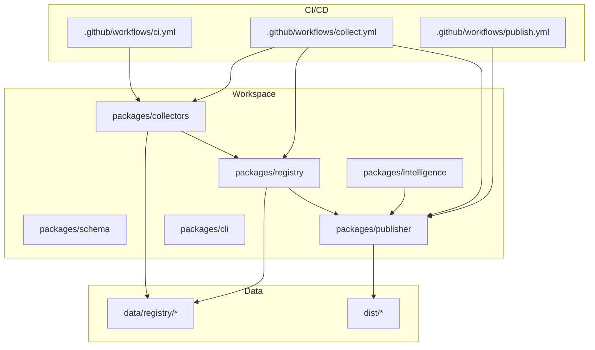
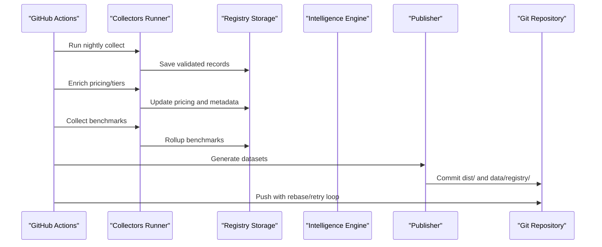
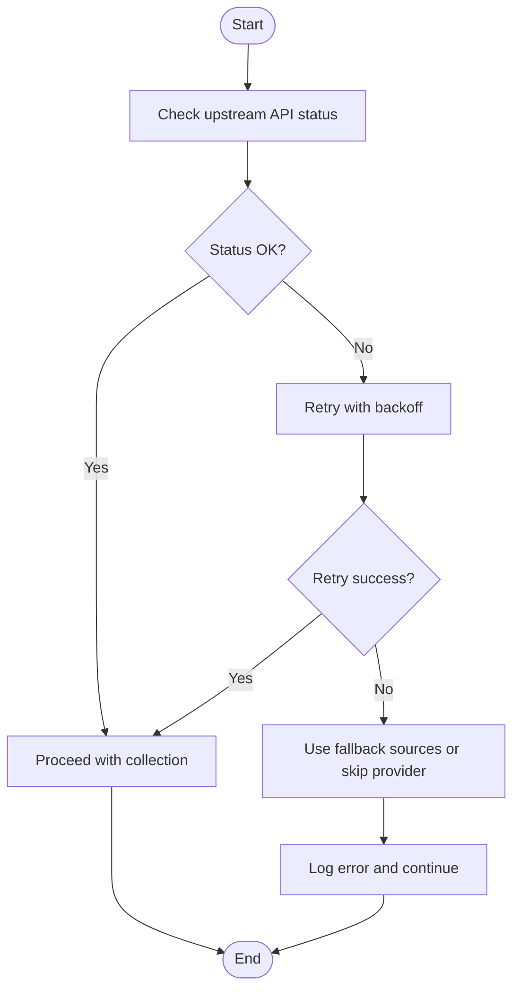
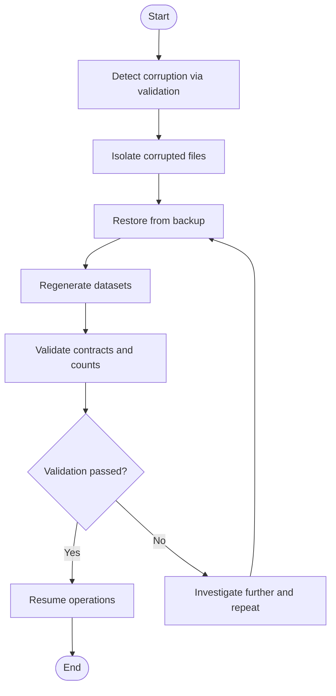
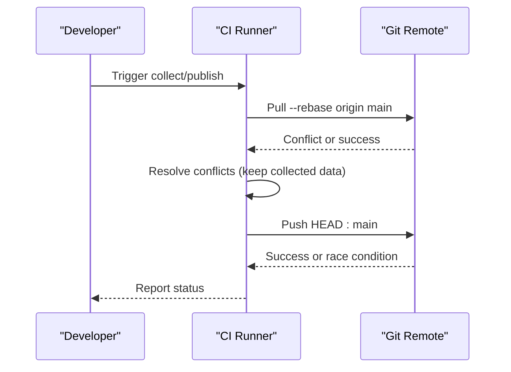
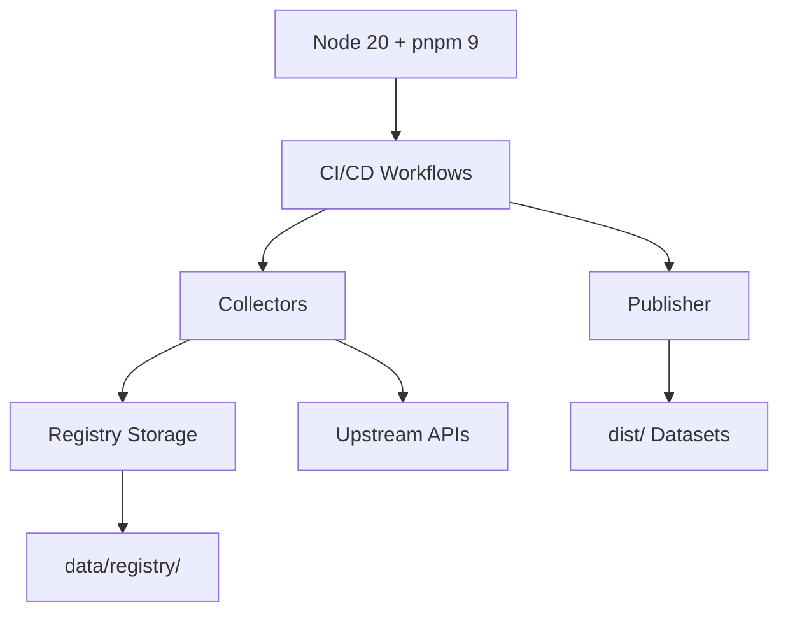

# Operational Procedures

<cite>
**Referenced Files in This Document**
- [README.md](file://README.md)
- [package.json](file://package.json)
- [03_Architecture.md](file://docs/03_Architecture.md)
- [04_Pipeline.md](file://docs/04_Pipeline.md)
- [05_Data_Model.md](file://docs/05_Data_Model.md)
- [ci.yml](file://.github/workflows/ci.yml)
- [collect.yml](file://.github/workflows/collect.yml)
- [publish.yml](file://.github/workflows/publish.yml)
- [runner.ts](file://packages/collectors/src/core/runner.ts)
- [http.ts](file://packages/collectors/src/core/http.ts)
- [storage.ts](file://packages/registry/src/storage.ts)
- [index.ts](file://packages/registry/src/index.ts)
- [run.ts](file://packages/collectors/src/run.ts)
- [plugin-worker.ts](file://packages/collectors/src/core/plugin-worker.ts)
- [cost.ts](file://packages/intelligence/src/features/cost.ts)
</cite>

## Table of Contents
1. [Introduction](#introduction)
2. [Project Structure](#project-structure)
3. [Core Components](#core-components)
4. [Architecture Overview](#architecture-overview)
5. [Detailed Component Analysis](#detailed-component-analysis)
6. [Dependency Analysis](#dependency-analysis)
7. [Performance Considerations](#performance-considerations)
8. [Troubleshooting Guide](#troubleshooting-guide)
9. [Conclusion](#conclusion)
10. [Appendices](#appendices)

## Introduction
This document provides operational procedures for day-to-day operations of the BaseModel platform, focusing on backup and recovery, disaster recovery planning, maintenance windows, update and rollback strategies, incident response, runbooks for common scenarios, capacity planning, monitoring, proactive maintenance, and troubleshooting. It is intended for operators, SREs, and maintainers who manage the data pipeline that discovers, validates, normalizes, stores, analyzes, and publishes structured knowledge about AI models.

BaseModel is a data layer consumed by other systems; it does not perform inference or host models. The canonical registry lives under data/registry/, and generated datasets are published to dist/.

**Section sources**
- [README.md:1-61](file://README.md#L1-L61)
- [03_Architecture.md:1-77](file://docs/03_Architecture.md#L1-L77)

## Project Structure
BaseModel is organized as a pnpm workspace with clear separation of responsibilities:
- packages/schema: Canonical schemas and types
- packages/registry: Registry storage, validation, and merge utilities
- packages/collectors: Provider and gateway collectors
- packages/intelligence: Derived rankings, search, and recommendations
- packages/publisher: Dataset generation for dist/
- packages/cli: Command-line interface for querying intelligence

Operational artifacts include GitHub Actions workflows for CI, nightly collection, dataset publishing, and deployment.

**Diagram sources**
- [README.md:10-30](file://README.md#L10-L30)
- [03_Architecture.md:37-44](file://docs/03_Architecture.md#L37-L44)
- [ci.yml:1-41](file://.github/workflows/ci.yml#L1-L41)
- [collect.yml:1-110](file://.github/workflows/collect.yml#L1-L110)
- [publish.yml:1-63](file://.github/workflows/publish.yml#L1-L63)

**Section sources**
- [README.md:10-30](file://README.md#L10-L30)
- [package.json:17-26](file://package.json#L17-L26)

## Core Components
- Discovery and Collection (collectors): Auto-discovers and executes gateway plugins to collect provider model catalogs, capabilities, pricing, and benchmarks. Includes retry logic and secret scoping.
- Registry (registry): Validates and persists canonical records under data/registry/ with schema enforcement and rollup writes for large datasets like benchmarks.
- Intelligence (intelligence): Derives cost efficiency, tiers, and alternatives from registry data without modifying canonical records.
- Publisher (publisher): Generates static JSON datasets into dist/ with metadata and counts.

Key operational behaviors:
- Stamping updated_at on entities to track freshness.
- Reconciling lifecycle status (e.g., marking models discontinued when no longer listed).
- Partial-failure safety for benchmark rollups.
- Retryable HTTP statuses and backoff for transient upstream failures.

**Section sources**
- [index.ts:34-41](file://packages/registry/src/index.ts#L34-L41)
- [runner.ts:337-363](file://packages/collectors/src/core/runner.ts#L337-L363)
- [runner.ts:410-426](file://packages/collectors/src/core/runner.ts#L410-L426)
- [storage.ts:138-163](file://packages/registry/src/storage.ts#L138-L163)
- [http.ts:1-37](file://packages/collectors/src/core/http.ts#L1-L37)

## Architecture Overview
The system follows a layered architecture:
- Discovery Layer: Collectors discover and fetch data from providers/gateways.
- Registry Layer: Validates, normalizes, and persists canonical records.
- Intelligence Layer: Computes derived insights without altering canonical data.
- Publishing Layer: Generates public datasets to dist/.

Automation via GitHub Actions orchestrates CI checks, nightly collection, enrichment, benchmark collection, dataset generation, and publication.

**Diagram sources**
- [collect.yml:42-110](file://.github/workflows/collect.yml#L42-L110)
- [publish.yml:40-63](file://.github/workflows/publish.yml#L40-L63)
- [storage.ts:138-163](file://packages/registry/src/storage.ts#L138-L163)
- [index.ts:119-122](file://packages/registry/src/index.ts#L119-L122)

**Section sources**
- [03_Architecture.md:5-44](file://docs/03_Architecture.md#L5-L44)
- [04_Pipeline.md:1-85](file://docs/04_Pipeline.md#L1-L85)

## Detailed Component Analysis

### Backup and Recovery Procedures
- Registry Data Backup
  - Target: data/registry/ directory containing providers, models, capabilities, licenses, APIs, benchmarks, pricing, and meta files.
  - Frequency: Daily snapshots aligned with nightly collection; additional pre-update snapshots recommended.
  - Method: Git-based versioning ensures full history; export to external object storage if required.
  - Validation: Verify integrity by regenerating datasets and comparing counts/metadata.

- Configuration Files Backup
  - Target: .github/workflows/*.yml, package.json scripts, environment secrets definitions.
  - Frequency: On change; snapshot before major updates.
  - Method: Version control plus secure secret management via repository secrets.

- System State Backup
  - Target: dist/ generated datasets and any local caches.
  - Frequency: After successful publish runs.
  - Method: Archive dist/ alongside registry backups.

Recovery Steps:
- Restore data/registry/ from latest known-good snapshot.
- Regenerate dist/ using publisher.
- Validate outputs by running tests and dataset contract checks.

**Section sources**
- [04_Pipeline.md:40-85](file://docs/04_Pipeline.md#L40-L85)
- [storage.ts:138-163](file://packages/registry/src/storage.ts#L138-L163)
- [publish.yml:40-63](file://.github/workflows/publish.yml#L40-L63)

### Disaster Recovery Planning (RTO/RPO)
- RTO (Recovery Time Objective): Aim to restore service within one hour after failure detection.
- RPO (Recovery Point Objective): Up to daily data loss acceptable; prefer near-real-time snapshots for critical environments.
- Recovery Testing:
  - Monthly DR drills: Restore from backup, regenerate datasets, validate contracts, and confirm CI passes.
  - Chaos testing: Simulate upstream API outages and verify fallback behavior and partial-failure safety.

**Section sources**
- [04_Pipeline.md:86-110](file://docs/04_Pipeline.md#L86-L110)
- [collect.yml:77-110](file://.github/workflows/collect.yml#L77-L110)

### Maintenance Windows and Update Procedures
- Maintenance Window: Schedule weekly low-traffic window (e.g., Sunday 02:00–04:00 UTC) for upgrades and schema changes.
- Update Procedure:
  - Pre-update: Snapshot data/registry/ and dist/.
  - Apply changes: Update schemas, collectors, registry logic, and publisher.
  - Validate: Run lint, typecheck, tests, and generate datasets.
  - Post-update: Compare counts and metadata; revert if anomalies detected.

Rollback Strategy:
- Revert commits and restore backups if validation fails.
- Use git tags for known-good states; pin workflow versions where applicable.

**Section sources**
- [package.json:17-26](file://package.json#L17-L26)
- [ci.yml:10-41](file://.github/workflows/ci.yml#L10-L41)
- [collect.yml:77-110](file://.github/workflows/collect.yml#L77-L110)

### Incident Response Procedures
- Detection: Monitor CI/CD logs, error rates, and dataset freshness timestamps.
- Triage: Classify severity (P1-P3), identify scope (single provider vs. global), and check upstream status pages.
- Containment: Disable affected gateways temporarily; rotate compromised keys; isolate failing jobs.
- Resolution: Fix configuration or code; rerun collection/enrichment; regenerate datasets.
- Communication: Notify stakeholders via predefined channels; post-mortem within 48 hours.

Escalation Paths:
- P1: Immediate page to on-call engineer and lead maintainer.
- P2: Slack alert to ops channel; triage within 1 hour.
- P3: Ticket creation; resolve during next maintenance window.

Communication Protocols:
- Use incident channel with status updates every 30 minutes for P1/P2.
- Publish resolution notes and action items post-incident.

**Section sources**
- [04_Pipeline.md:86-110](file://docs/04_Pipeline.md#L86-L110)
- [collect.yml:42-76](file://.github/workflows/collect.yml#L42-L76)

### Operational Runbooks

#### Provider API Outages
Symptoms:
- Elevated 429/5xx errors; missing models in collected results.
Actions:
- Check RETRYABLE_STATUSES and backoff behavior.
- Rotate or refresh API keys if unauthorized.
- Temporarily disable problematic gateways; rely on fallback sources.
- Verify partial-failure safety for benchmarks and pricing.

**Diagram sources**
- [http.ts:1-37](file://packages/collectors/src/core/http.ts#L1-L37)
- [runner.ts:410-426](file://packages/collectors/src/core/runner.ts#L410-L426)

**Section sources**
- [http.ts:1-37](file://packages/collectors/src/core/http.ts#L1-L37)
- [runner.ts:410-426](file://packages/collectors/src/core/runner.ts#L410-L426)

#### Data Corruption Recovery
Symptoms:
- Schema validation failures; inconsistent counts; missing fields.
Actions:
- Identify corrupted files in data/registry/.
- Restore from last known-good snapshot.
- Regenerate dist/ and validate dataset contracts.

**Diagram sources**
- [storage.ts:138-163](file://packages/registry/src/storage.ts#L138-L163)
- [index.ts:119-122](file://packages/registry/src/index.ts#L119-L122)

**Section sources**
- [storage.ts:138-163](file://packages/registry/src/storage.ts#L138-L163)
- [index.ts:119-122](file://packages/registry/src/index.ts#L119-L122)

#### System Failures
Symptoms:
- CI/CD job failures; inability to commit/push; Node/pnpm environment issues.
Actions:
- Inspect runner logs; ensure Node 20 and pnpm 9+.
- Re-run failed jobs; handle rebase conflicts by keeping collected data.
- Verify permissions and secrets.

**Diagram sources**
- [collect.yml:77-110](file://.github/workflows/collect.yml#L77-L110)
- [publish.yml:53-63](file://.github/workflows/publish.yml#L53-L63)

**Section sources**
- [collect.yml:77-110](file://.github/workflows/collect.yml#L77-L110)
- [publish.yml:53-63](file://.github/workflows/publish.yml#L53-L63)

#### Performance Degradation
Symptoms:
- Slow collection runs; high memory usage; upstream rate limits.
Actions:
- Tune retry/backoff parameters; reduce concurrent requests.
- Enable optional tokens for higher rate limits (e.g., Hugging Face).
- Monitor benchmark rollup performance; avoid excessive small files.

**Section sources**
- [04_Pipeline.md:108-126](file://docs/04_Pipeline.md#L108-L126)
- [storage.ts:138-163](file://packages/registry/src/storage.ts#L138-L163)

### Capacity Planning and Resource Monitoring
- Compute: Ensure runners have sufficient CPU/memory for parallel collection and dataset generation.
- Storage: Monitor growth of data/registry/ and dist/; archive historical snapshots.
- Network: Track upstream API latency and error rates; configure timeouts and retries.
- Metrics: Track updated_at staleness, dataset counts, and enrichment success rates.

Proactive Maintenance Tasks:
- Weekly review of deprecated/discontinued models.
- Monthly DR drill and backup verification.
- Quarterly schema evolution review and backward compatibility checks.

**Section sources**
- [04_Pipeline.md:168-217](file://docs/04_Pipeline.md#L168-L217)
- [index.ts:34-41](file://packages/registry/src/index.ts#L34-L41)

### Troubleshooting Guide
Common Issues:
- Unauthorized API access: Rotate keys; verify secret scoping.
- Rate limiting: Add optional tokens; adjust backoff; use fallback sources.
- Plugin secret leaks: Ensure result validation rejects secrets; audit plugin outputs.
- Benchmark rollup inconsistencies: Verify per-source rollup merges; keep non-refreshed sources.

Resolution Steps:
- Inspect runner logs and plugin worker output.
- Validate schema compliance; fix malformed records.
- Re-run collection/enrichment; regenerate datasets.

**Section sources**
- [plugin-worker.ts:99-112](file://packages/collectors/src/core/plugin-worker.ts#L99-L112)
- [runner.ts:337-363](file://packages/collectors/src/core/runner.ts#L337-L363)
- [storage.ts:138-163](file://packages/registry/src/storage.ts#L138-L163)

## Dependency Analysis
Operational dependencies include:
- Node.js 20+ and pnpm 9+ runtime requirements.
- GitHub Actions for CI/CD orchestration.
- External APIs for discovery and enrichment with retry/fallback mechanisms.
- Registry storage for canonical data persistence.

**Diagram sources**
- [package.json:12-16](file://package.json#L12-L16)
- [ci.yml:10-41](file://.github/workflows/ci.yml#L10-L41)
- [collect.yml:42-76](file://.github/workflows/collect.yml#L42-L76)

**Section sources**
- [package.json:12-16](file://package.json#L12-L16)
- [ci.yml:10-41](file://.github/workflows/ci.yml#L10-L41)

## Performance Considerations
- Use retryable statuses and exponential backoff to mitigate transient failures.
- Prefer per-source rollup writes for benchmarks to reduce file overhead.
- Stamp updated_at to detect stale entries and optimize consumer caching.
- Limit concurrent requests to upstream APIs to avoid rate limits.

[No sources needed since this section provides general guidance]

## Troubleshooting Guide
- Authentication failures: Verify secrets; ensure only approved keys are injected into plugins.
- Non-retryable HTTP errors: Handle 401/403 explicitly; log actionable hints.
- Partial failures: Ensure non-refreshed sources are preserved; validate rollup merges.
- Dataset contract violations: Run tests to enforce provider/capability references and metadata presence.

**Section sources**
- [runner.ts:337-363](file://packages/collectors/src/core/runner.ts#L337-L363)
- [http.ts:1-37](file://packages/collectors/src/core/http.ts#L1-L37)
- [storage.ts:138-163](file://packages/registry/src/storage.ts#L138-L163)

## Conclusion
BaseModel’s operational procedures emphasize robustness through validation, normalization, and partial-failure safety. Automated CI/CD pipelines ensure consistent data collection, enrichment, and publication. Operators should focus on backup discipline, DR readiness, proactive maintenance, and rapid incident response to maintain data freshness and reliability.

[No sources needed since this section summarizes without analyzing specific files]

## Appendices

### Appendix A: Key Commands and Scripts
- Build, test, lint, typecheck, generate datasets.
- Collector commands for collection, verification, and enrichment.

**Section sources**
- [package.json:17-26](file://package.json#L17-L26)
- [README.md:44-56](file://README.md#L44-L56)

### Appendix B: Data Model Entities
- Providers, Models, Capabilities, Benchmarks, Pricing, APIs, Licenses.
- Identifier conventions and dataset metadata fields.

**Section sources**
- [05_Data_Model.md:23-169](file://docs/05_Data_Model.md#L23-L169)

### Appendix C: Cost Efficiency and Tier Definitions
- Blended cost calculation and tier classification.
- Free tier propagation for resold models.

**Section sources**
- [cost.ts:31-86](file://packages/intelligence/src/features/cost.ts#L31-L86)
- [04_Pipeline.md:190-217](file://docs/04_Pipeline.md#L190-L217)