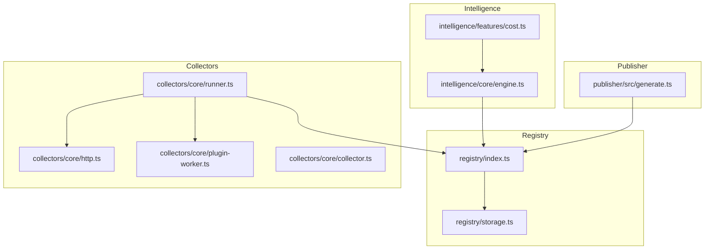
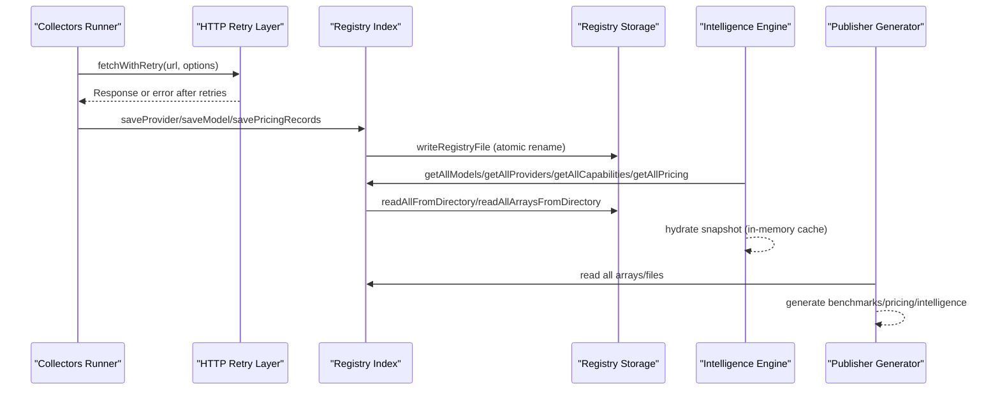
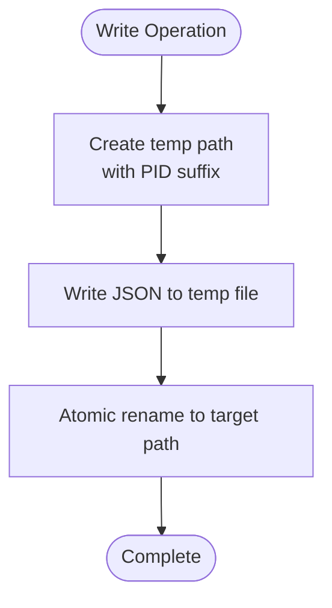
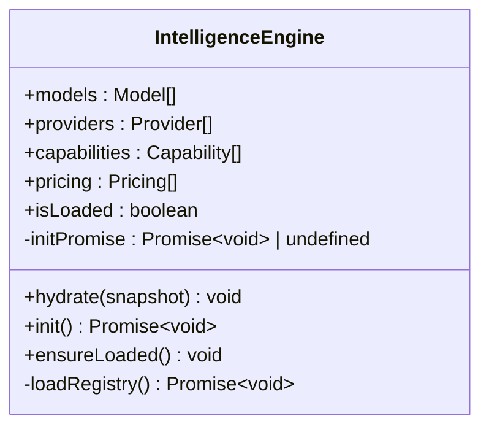
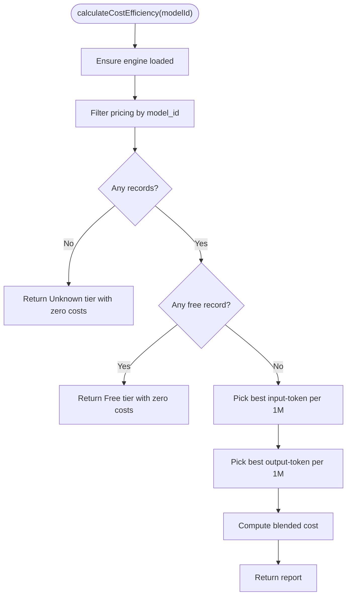
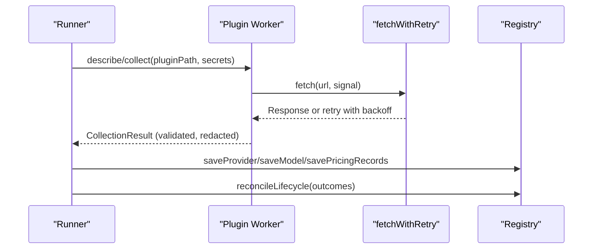
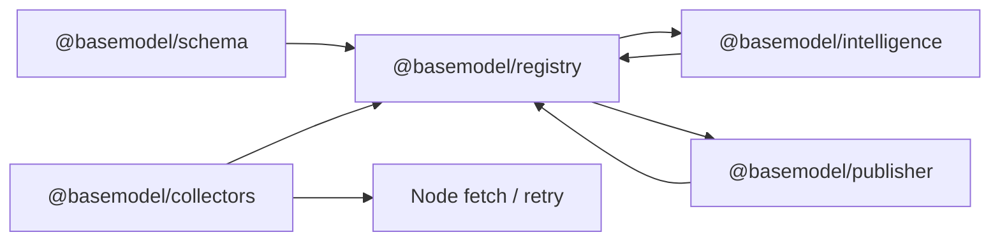

# Performance Tuning

<cite>
**Referenced Files in This Document**
- [README.md](file://README.md)
- [package.json](file://package.json)
- [packages/registry/src/index.ts](file://packages/registry/src/index.ts)
- [packages/registry/src/storage.ts](file://packages/registry/src/storage.ts)
- [packages/intelligence/src/core/engine.ts](file://packages/intelligence/src/core/engine.ts)
- [packages/intelligence/src/features/cost.ts](file://packages/intelligence/src/features/cost.ts)
- [packages/publisher/src/generate.ts](file://packages/publisher/src/generate.ts)
- [packages/collectors/src/core/http.ts](file://packages/collectors/src/core/http.ts)
- [packages/collectors/src/core/plugin-worker.ts](file://packages/collectors/src/core/plugin-worker.ts)
- [packages/collectors/src/core/collector.ts](file://packages/collectors/src/core/collector.ts)
- [packages/collectors/src/core/runner.ts](file://packages/collectors/src/core/runner.ts)
</cite>

## Table of Contents
1. [Introduction](#introduction)
2. [Project Structure](#project-structure)
3. [Core Components](#core-components)
4. [Architecture Overview](#architecture-overview)
5. [Detailed Component Analysis](#detailed-component-analysis)
6. [Dependency Analysis](#dependency-analysis)
7. [Performance Considerations](#performance-considerations)
8. [Troubleshooting Guide](#troubleshooting-guide)
9. [Conclusion](#conclusion)
10. [Appendices](#appendices)

## Introduction
This document provides performance tuning guidance for optimizing BaseModel operations across memory usage, CPU utilization, and I/O throughput. It focuses on the registry storage layer, intelligence engine caching, collector network behavior, and publisher output generation. Recommendations include database-like query optimization patterns (via file-based indexing), connection pooling strategies for external APIs, caching approaches for model metadata and pricing data, load testing methodologies, benchmarking tools, capacity planning, profiling techniques, resource allocation, garbage collection tuning, network optimizations, and third-party API rate limiting strategies.

## Project Structure
BaseModel is a multi-package repository with clear separation of concerns:
- Registry: canonical storage, validation, and merge utilities over JSON files
- Intelligence: in-memory engine that caches validated snapshots for fast queries
- Collectors: provider-specific discovery and enrichment with resilient HTTP retries and worker isolation
- Publisher: dataset generation for distribution artifacts

**Diagram sources**
- [packages/registry/src/index.ts:1-169](file://packages/registry/src/index.ts#L1-L169)
- [packages/registry/src/storage.ts:1-164](file://packages/registry/src/storage.ts#L1-L164)
- [packages/intelligence/src/core/engine.ts:1-92](file://packages/intelligence/src/core/engine.ts#L1-L92)
- [packages/intelligence/src/features/cost.ts:31-86](file://packages/intelligence/src/features/cost.ts#L31-L86)
- [packages/collectors/src/core/http.ts:1-37](file://packages/collectors/src/core/http.ts#L1-L37)
- [packages/collectors/src/core/plugin-worker.ts:1-56](file://packages/collectors/src/core/plugin-worker.ts#L1-L56)
- [packages/collectors/src/core/collector.ts:1-89](file://packages/collectors/src/core/collector.ts#L1-L89)
- [packages/collectors/src/core/runner.ts:333-441](file://packages/collectors/src/core/runner.ts#L333-L441)
- [packages/publisher/src/generate.ts:218-243](file://packages/publisher/src/generate.ts#L218-L243)

**Section sources**
- [README.md:10-30](file://README.md#L10-L30)
- [package.json:17-25](file://package.json#L17-L25)

## Core Components
- Registry index functions provide read/write access to providers, models, capabilities, benchmarks, pricing, APIs, and licenses. They validate records using Zod schemas and stamp timestamps for freshness tracking.
- Storage module implements atomic writes, directory scanning, rollup writes for large datasets (benchmarks), and safe temporary file handling.
- Intelligence engine holds an in-memory snapshot of models, providers, capabilities, and pricing to avoid repeated I/O and schema parsing.
- Cost feature computes cost efficiency using prioritized pricing records.
- Collectors implement resilient HTTP fetching with retry/backoff and isolated plugin execution with strict size limits.
- Publisher generates final datasets including benchmarks, pricing, and intelligence outputs.

**Section sources**
- [packages/registry/src/index.ts:1-169](file://packages/registry/src/index.ts#L1-L169)
- [packages/registry/src/storage.ts:1-164](file://packages/registry/src/storage.ts#L1-L164)
- [packages/intelligence/src/core/engine.ts:1-92](file://packages/intelligence/src/core/engine.ts#L1-L92)
- [packages/intelligence/src/features/cost.ts:31-86](file://packages/intelligence/src/features/cost.ts#L31-L86)
- [packages/collectors/src/core/http.ts:1-37](file://packages/collectors/src/core/http.ts#L1-L37)
- [packages/collectors/src/core/plugin-worker.ts:1-56](file://packages/collectors/src/plugin-worker.ts#L1-L56)
- [packages/collectors/src/core/collector.ts:1-89](file://packages/collectors/src/core/collector.ts#L1-L89)
- [packages/publisher/src/generate.ts:218-243](file://packages/publisher/src/generate.ts#L218-L243)

## Architecture Overview
The system follows a pipeline: collectors discover and enrich data, registry persists validated records, intelligence loads a snapshot into memory for fast queries, and publisher emits datasets.

**Diagram sources**
- [packages/collectors/src/core/http.ts:1-37](file://packages/collectors/src/core/http.ts#L1-L37)
- [packages/registry/src/index.ts:45-168](file://packages/registry/src/index.ts#L45-L168)
- [packages/registry/src/storage.ts:48-111](file://packages/registry/src/storage.ts#L48-L111)
- [packages/intelligence/src/core/engine.ts:58-82](file://packages/intelligence/src/core/engine.ts#L58-L82)
- [packages/publisher/src/generate.ts:218-243](file://packages/publisher/src/generate.ts#L218-L243)

## Detailed Component Analysis

### Registry I/O and Atomic Writes
- Atomic writes use temp files plus rename to ensure consistency during concurrent writers.
- Directory scanning collects JSON files recursively; array rollups reduce file count for large datasets like benchmarks.
- Benchmarks are grouped by source to keep writes atomic and preserve provenance while avoiding thousands of tiny files.

**Diagram sources**
- [packages/registry/src/storage.ts:44-65](file://packages/registry/src/storage.ts#L44-L65)

**Section sources**
- [packages/registry/src/storage.ts:48-111](file://packages/registry/src/storage.ts#L48-L111)
- [packages/registry/src/storage.ts:126-163](file://packages/registry/src/storage.ts#L126-L163)

### Intelligence Engine In-Memory Cache
- The engine validates and slices snapshots to minimize shared references and ensure immutability within the process.
- Lazy initialization ensures a single load operation even under concurrent calls; failures reset init promise to allow retries.
- Browser environments must hydrate manually since Node fs is used for loading.

**Diagram sources**
- [packages/intelligence/src/core/engine.ts:1-92](file://packages/intelligence/src/core/engine.ts#L1-L92)

**Section sources**
- [packages/intelligence/src/core/engine.ts:11-30](file://packages/intelligence/src/core/engine.ts#L11-L30)
- [packages/intelligence/src/core/engine.ts:58-82](file://packages/intelligence/src/core/engine.ts#L58-L82)

### Cost Efficiency Calculation
- Picks per-1M token records with highest-priority provenance; supports free-tier detection and blended cost computation.
- Early returns when no pricing records exist or when fully free to avoid unnecessary processing.

**Diagram sources**
- [packages/intelligence/src/features/cost.ts:31-86](file://packages/intelligence/src/features/cost.ts#L31-L86)

**Section sources**
- [packages/intelligence/src/features/cost.ts:31-86](file://packages/intelligence/src/features/cost.ts#L31-L86)

### Collector Network Resilience and Worker Isolation
- HTTP retry layer uses exponential backoff and fresh timeout signals per attempt for transient statuses (429, 5xx).
- Plugin workers enforce strict limits on response size and number of models, redacting secrets from serialized results.
- Runner reconciles lifecycle by marking models discontinued when not present in successful gateway catalogs.

**Diagram sources**
- [packages/collectors/src/core/http.ts:1-37](file://packages/collectors/src/core/http.ts#L1-L37)
- [packages/collectors/src/core/plugin-worker.ts:1-56](file://packages/collectors/src/core/plugin-worker.ts#L1-L56)
- [packages/collectors/src/core/runner.ts:333-441](file://packages/collectors/src/core/runner.ts#L333-L441)

**Section sources**
- [packages/collectors/src/core/http.ts:1-37](file://packages/collectors/src/core/http.ts#L1-L37)
- [packages/collectors/src/core/plugin-worker.ts:1-56](file://packages/collectors/src/core/plugin-worker.ts#L1-L56)
- [packages/collectors/src/core/collector.ts:1-89](file://packages/collectors/src/core/collector.ts#L1-L89)
- [packages/collectors/src/core/runner.ts:333-441](file://packages/collectors/src/core/runner.ts#L333-L441)

### Publisher Output Generation
- Generates benchmarks, pricing, and intelligence datasets with counts and metadata.
- Uses efficient JSON serialization and newline-terminated files for downstream consumers.

**Section sources**
- [packages/publisher/src/generate.ts:218-243](file://packages/publisher/src/generate.ts#L218-L243)

## Dependency Analysis
- Registry depends on storage for filesystem operations and validation via schema definitions.
- Intelligence depends on registry to load data once and then serves queries from memory.
- Collectors depend on registry for persistence and on HTTP helpers for resilient networking.
- Publisher depends on registry to read consolidated arrays/files for output generation.

**Diagram sources**
- [packages/registry/src/index.ts:1-32](file://packages/registry/src/index.ts#L1-L32)
- [packages/intelligence/src/core/engine.ts:1-10](file://packages/intelligence/src/core/engine.ts#L1-L10)
- [packages/collectors/src/core/http.ts:1-10](file://packages/collectors/src/core/http.ts#L1-L10)
- [packages/publisher/src/generate.ts:218-243](file://packages/publisher/src/generate.ts#L218-L243)

**Section sources**
- [packages/registry/src/index.ts:1-32](file://packages/registry/src/index.ts#L1-L32)
- [packages/intelligence/src/core/engine.ts:1-10](file://packages/intelligence/src/core/engine.ts#L1-L10)
- [packages/collectors/src/core/http.ts:1-10](file://packages/collectors/src/core/http.ts#L1-L10)
- [packages/publisher/src/generate.ts:218-243](file://packages/publisher/src/generate.ts#L218-L243)

## Performance Considerations

### Memory Optimization Strategies
- Use the IntelligenceEngine’s hydrate method to load a validated snapshot once and reuse it across requests to avoid repeated I/O and parsing.
- Slice arrays during hydration to create independent copies and prevent accidental mutations.
- Limit plugin responses via MAX_PLUGIN_MODELS and MAX_PLUGIN_RESPONSE_BYTES to cap memory spikes during collection.

Recommendations:
- Initialize the engine at process startup and share the instance across handlers.
- Avoid re-hydrating unless data changes; rely on updated_at stamps to detect staleness.
- Stream large outputs where possible; batch writes to reduce GC pressure.

**Section sources**
- [packages/intelligence/src/core/engine.ts:44-52](file://packages/intelligence/src/core/engine.ts#L44-L52)
- [packages/collectors/src/core/collector.ts:9-10](file://packages/collectors/src/core/collector.ts#L9-L10)

### CPU Utilization Tuning
- Batch reads via readAllFromDirectory and readAllArraysFromDirectory to minimize syscall overhead.
- Prefer filtering in-memory after a single load rather than multiple targeted reads.
- Use deterministic selection for pricing records to avoid redundant computations.

Recommendations:
- Precompute derived metrics (e.g., cost efficiency) and cache them alongside the snapshot.
- Defer heavy computations until first access (lazy evaluation) and memoize results.

**Section sources**
- [packages/registry/src/storage.ts:93-111](file://packages/registry/src/storage.ts#L93-L111)
- [packages/intelligence/src/features/cost.ts:31-86](file://packages/intelligence/src/features/cost.ts#L31-L86)

### I/O Performance Improvements
- Atomic writes via temp files and rename reduce lock contention and partial writes.
- Benchmark rollups consolidate many records into fewer files, improving write speed and reducing filesystem overhead.
- Clear directories before rewriting to ensure consistent state without incremental merges.

Recommendations:
- Place BASEMODEL_REGISTRY_PATH on a fast local disk or SSD-backed volume.
- Coalesce frequent small writes into batched updates where feasible.

**Section sources**
- [packages/registry/src/storage.ts:59-65](file://packages/registry/src/storage.ts#L59-L65)
- [packages/registry/src/storage.ts:126-163](file://packages/registry/src/storage.ts#L126-L163)

### Database Query Optimization and Indexing Strategies
While the registry is file-based, treat directories and filenames as indexes:
- Use provider-scoped pricing arrays (one file per provider) to avoid full scans.
- Maintain updated_at fields to enable quick staleness checks without scanning content.
- For benchmarks, rely on per-source rollups to limit scan scope to relevant sources.

Recommendations:
- Partition frequently accessed data by provider or capability to reduce read sets.
- Keep naming conventions stable to leverage predictable file paths.

**Section sources**
- [packages/registry/src/index.ts:124-147](file://packages/registry/src/index.ts#L124-L147)
- [packages/registry/src/storage.ts:126-163](file://packages/registry/src/storage.ts#L126-L163)

### Connection Pooling Configurations
- The collectors use Node’s native fetch with retry/backoff; there is no explicit connection pool configured.
- To simulate pooling behavior, reuse a single fetch context and set appropriate timeouts.
- For high-throughput scenarios, consider multiplexing requests and capping concurrency per provider.

Recommendations:
- Implement request queuing with bounded concurrency per upstream API.
- Use separate pools per provider to isolate rate limits and outages.

**Section sources**
- [packages/collectors/src/core/http.ts:1-37](file://packages/collectors/src/core/http.ts#L1-L37)

### Caching Strategies for Model Metadata, Pricing Data, and Frequently Accessed Information
- Use IntelligenceEngine to hold validated snapshots in memory.
- Cache derived metrics (cost efficiency, alternatives) keyed by model_id.
- Invalidate caches based on updated_at comparisons or explicit refresh triggers.

Recommendations:
- Add TTL-based invalidation for pricing data if upstreams change frequently.
- Provide a refresh endpoint to rebuild snapshots atomically.

**Section sources**
- [packages/intelligence/src/core/engine.ts:58-82](file://packages/intelligence/src/core/engine.ts#L58-L82)
- [packages/intelligence/src/features/cost.ts:31-86](file://packages/intelligence/src/features/cost.ts#L31-L86)

### Load Testing Methodologies, Performance Benchmarking Tools, and Capacity Planning Guidelines
- Use synthetic workloads that mimic collector runs (network fetches, registry writes) and intelligence queries (in-memory filters).
- Measure latency percentiles, throughput, and memory growth under sustained load.
- Plan capacity based on peak collector concurrency and expected registry sizes.

Recommendations:
- Simulate rate-limited upstreams to validate retry/backoff behavior.
- Track GC pauses and heap usage during large benchmark rollups.

[No sources needed since this section provides general guidance]

### Profiling Techniques for Identifying Bottlenecks
- Profile collector runs to identify slow gateways and expensive enrich steps.
- Profile registry reads/writes to detect hotspots in directory scanning and JSON parsing.
- Profile intelligence queries to find inefficient filters or missing indexes.

Recommendations:
- Use Node.js profiler and heap snapshots to locate memory leaks.
- Instrument timing around key functions (getAllPricing, writeBenchmarksRollup, calculateCostEfficiency).

**Section sources**
- [packages/registry/src/index.ts:124-147](file://packages/registry/src/index.ts#L124-L147)
- [packages/registry/src/storage.ts:126-163](file://packages/registry/src/storage.ts#L126-L163)
- [packages/intelligence/src/features/cost.ts:31-86](file://packages/intelligence/src/features/cost.ts#L31-L86)

### Resource Allocation Recommendations Based on Expected Workload Patterns
- For high-frequency intelligence queries, allocate sufficient RAM to hold full snapshots and derived caches.
- For collector-heavy workloads, provision CPU cores to parallelize gateway plugins safely.
- Ensure low-latency storage for registry writes to avoid bottlenecks during rollups.

[No sources needed since this section provides general guidance]

### Garbage Collection Tuning
- Reduce object churn by reusing buffers and minimizing intermediate allocations during JSON serialization.
- Monitor GC frequency and pause times; tune heap size to accommodate snapshot sizes.
- Avoid holding large strings in memory longer than necessary; stream where possible.

[No sources needed since this section provides general guidance]

### Network Optimization
- Leverage retry/backoff for transient errors; ensure timeouts are set per attempt.
- Redact secrets in logs and responses to prevent accidental exposure.
- Cap plugin response sizes to protect against malicious or misbehaving providers.

**Section sources**
- [packages/collectors/src/core/http.ts:1-37](file://packages/collectors/src/core/http.ts#L1-L37)
- [packages/collectors/src/core/plugin-worker.ts:32-46](file://packages/collectors/src/core/plugin-worker.ts#L32-L46)

### Third-Party API Rate Limiting Strategies
- Respect upstream rate limits by implementing per-provider concurrency caps and backoff.
- Use status code detection (429) to trigger exponential backoff and jitter.
- Reconcile lifecycle only on successful collections to avoid deprecating models due to transient failures.

**Section sources**
- [packages/collectors/src/core/http.ts:8-10](file://packages/collectors/src/core/http.ts#L8-L10)
- [packages/collectors/src/core/runner.ts:410-426](file://packages/collectors/src/core/runner.ts#L410-L426)

## Troubleshooting Guide
Common issues and resolutions:
- Invalid intelligence snapshot: ensure all required fields are present and types match schemas.
- Missing registry path: verify BASEMODEL_REGISTRY_PATH exists and is writable.
- Plugin response too large: adjust MAX_PLUGIN_RESPONSE_BYTES or optimize provider endpoints.
- Stale data: compare updated_at timestamps and refresh snapshots accordingly.

**Section sources**
- [packages/intelligence/src/core/engine.ts:11-30](file://packages/intelligence/src/core/engine.ts#L11-L30)
- [packages/registry/src/storage.ts:16-39](file://packages/registry/src/storage.ts#L16-L39)
- [packages/collectors/src/core/collector.ts:9-10](file://packages/collectors/src/core/collector.ts#L9-L10)

## Conclusion
Optimizing BaseModel involves leveraging in-memory caching, atomic filesystem operations, resilient networking, and careful resource management. By applying the strategies outlined here—memory-efficient snapshots, CPU-conscious batching, I/O-aware rollups, and robust rate limiting—you can achieve high throughput and low latency across collectors, registry operations, intelligence queries, and publisher outputs.

[No sources needed since this section summarizes without analyzing specific files]

## Appendices

### Appendix A: Key Configuration Variables
- BASEMODEL_REGISTRY_PATH: Override registry root directory for I/O performance and isolation.

**Section sources**
- [packages/registry/src/storage.ts:16-39](file://packages/registry/src/storage.ts#L16-L39)

### Appendix B: Performance Checklist
- Initialize IntelligenceEngine once and reuse across requests.
- Use readAll arrays for bulk reads; avoid per-record lookups.
- Enable atomic writes and benchmark rollups to reduce filesystem overhead.
- Configure retry/backoff and timeouts for all external fetches.
- Enforce plugin response limits and secret redaction.

[No sources needed since this section provides general guidance]