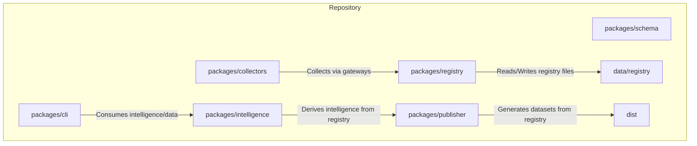
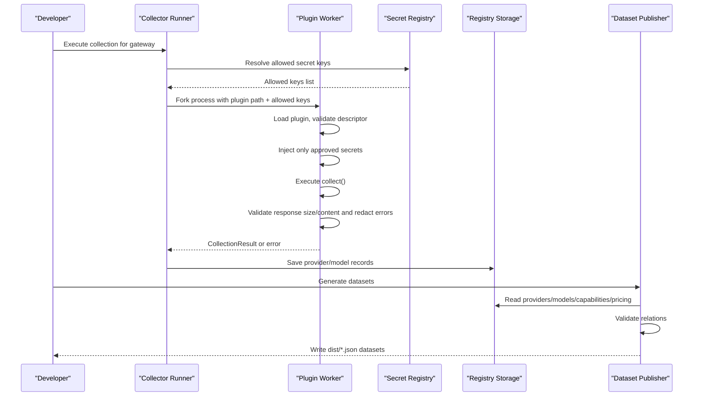
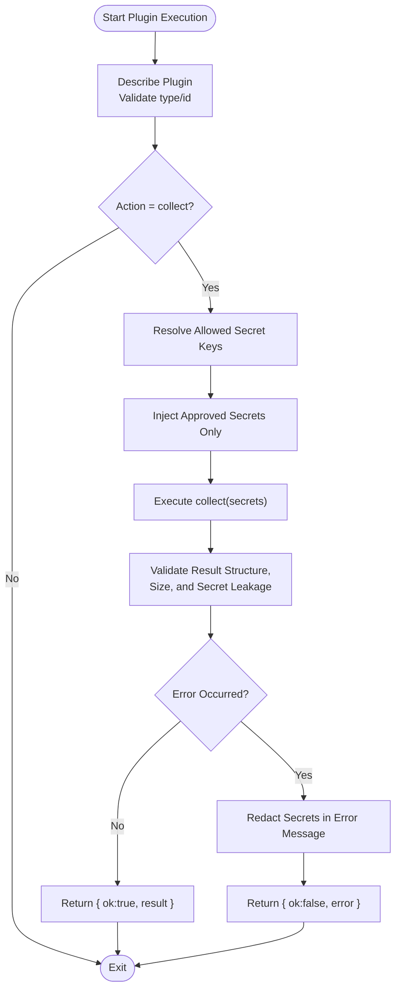
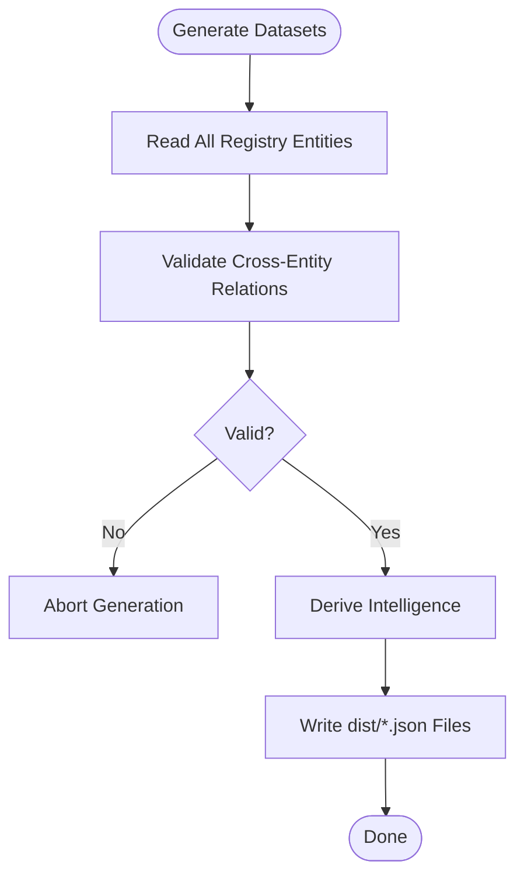
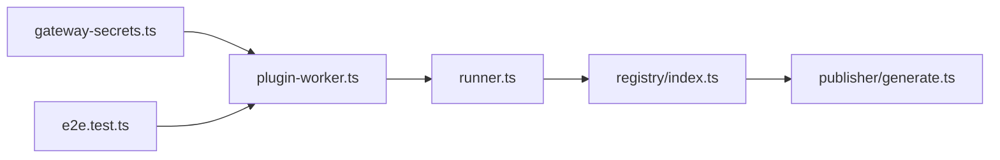

# Security & Compliance

<cite>
**Referenced Files in This Document**
- [README.md](file://README.md)
- [package.json](file://package.json)
- [07_Developer_Access.md](file://docs/07_Developer_Access.md)
- [08_Gateway_Plugin_Security.md](file://docs/08_Gateway_Plugin_Security.md)
- [gateway-secrets.ts](file://packages/collectors/src/core/gateway-secrets.ts)
- [plugin-worker.ts](file://packages/collectors/src/core/plugin-worker.ts)
- [runner.ts](file://packages/collectors/src/core/runner.ts)
- [verify.ts](file://packages/collectors/src/core/verify.ts)
- [generate.ts](file://packages/publisher/src/generate.ts)
- [registry index.ts](file://packages/registry/src/index.ts)
- [e2e.test.ts](file://packages/collectors/src/__tests__/e2e.test.ts)
</cite>

## Table of Contents
1. [Introduction](#introduction)
2. [Project Structure](#project-structure)
3. [Core Components](#core-components)
4. [Architecture Overview](#architecture-overview)
5. [Detailed Component Analysis](#detailed-component-analysis)
6. [Dependency Analysis](#dependency-analysis)
7. [Performance Considerations](#performance-considerations)
8. [Troubleshooting Guide](#troubleshooting-guide)
9. [Conclusion](#conclusion)
10. [Appendices](#appendices)

## Introduction
This document provides comprehensive security and compliance guidance for deploying BaseModel, focusing on authentication and authorization mechanisms, API security best practices, secure configuration management, data encryption, secret management, compliance frameworks, vulnerability scanning, dependency management, access control policies, network security, data privacy, PII handling, retention policies, and operational checklists. It synthesizes the repository’s built-in security controls (especially around gateway plugins and secrets) with recommended production hardening practices.

## Project Structure
BaseModel is a multi-package monorepo that includes schema definitions, registry utilities, collectors (including gateway plugins), intelligence computations, publisher tooling, and CLI. The dataset generator writes static JSON artifacts consumed by downstream systems.

**Diagram sources**
- [README.md:10-30](file://README.md#L10-L30)
- [generate.ts:108-176](file://packages/publisher/src/generate.ts#L108-L176)
- [registry index.ts:124-168](file://packages/registry/src/index.ts#L124-L168)

**Section sources**
- [README.md:10-30](file://README.md#L10-L30)
- [package.json:17-26](file://package.json#L17-L26)

## Core Components
- Gateway Plugin Security: Plugins are treated as untrusted code executed in isolated workers with strictly scoped secrets. Only approved keys are injected; CI credentials are excluded. Results are validated against size and content constraints to prevent secret leakage.
- Secret Registry: A central registry enumerates allowed secret keys per gateway. Adding or changing secrets requires core review.
- Collector Runner: Orchestrates plugin execution, provider registration, and result validation.
- Dataset Publisher: Validates relations and generates immutable datasets for consumption.

Key implementation references:
- Secrets registry and scoping: [gateway-secrets.ts:1-27](file://packages/collectors/src/core/gateway-secrets.ts#L1-L27)
- Worker isolation and redaction: [plugin-worker.ts:1-113](file://packages/collectors/src/core/plugin-worker.ts#L1-L113)
- Provider registration and freshness stamping: [runner.ts:333-363](file://packages/collectors/src/core/runner.ts#L333-L363)
- Dataset generation and relation validation: [generate.ts:73-106](file://packages/publisher/src/generate.ts#L73-L106)

**Section sources**
- [08_Gateway_Plugin_Security.md:1-36](file://docs/08_Gateway_Plugin_Security.md#L1-L36)
- [gateway-secrets.ts:1-27](file://packages/collectors/src/core/gateway-secrets.ts#L1-L27)
- [plugin-worker.ts:1-113](file://packages/collectors/src/core/plugin-worker.ts#L1-L113)
- [runner.ts:333-363](file://packages/collectors/src/core/runner.ts#L333-L363)
- [generate.ts:73-106](file://packages/publisher/src/generate.ts#L73-L106)

## Architecture Overview
The collector pipeline executes gateway plugins in isolated child processes, injects only approved secrets, validates outputs, and persists normalized records into the registry. The publisher then reads the registry, validates cross-entity relations, and emits static datasets.

**Diagram sources**
- [plugin-worker.ts:1-113](file://packages/collectors/src/core/plugin-worker.ts#L1-L113)
- [gateway-secrets.ts:1-27](file://packages/collectors/src/core/gateway-secrets.ts#L1-L27)
- [runner.ts:333-363](file://packages/collectors/src/core/runner.ts#L333-L363)
- [generate.ts:108-176](file://packages/publisher/src/generate.ts#L108-L176)

## Detailed Component Analysis

### Gateway Plugin Execution and Secret Scoping
- Isolation: Plugins run in separate worker processes started via fork-like semantics.
- Secret Injection: Only keys enumerated in the central registry are passed to the plugin. CI tokens (e.g., GITHUB_TOKEN) are not forwarded.
- Validation: Responses are checked for structure, size limits, and accidental secret leakage. Errors are redacted before being sent back to the parent process.
- Verification: A verification utility can be used to test plugins locally, including schema checks on sample results.

**Diagram sources**
- [plugin-worker.ts:26-46](file://packages/collectors/src/core/plugin-worker.ts#L26-L46)
- [plugin-worker.ts:99-112](file://packages/collectors/src/core/plugin-worker.ts#L99-L112)
- [gateway-secrets.ts:1-27](file://packages/collectors/src/core/gateway-secrets.ts#L1-L27)

**Section sources**
- [08_Gateway_Plugin_Security.md:1-36](file://docs/08_Gateway_Plugin_Security.md#L1-L36)
- [plugin-worker.ts:1-113](file://packages/collectors/src/core/plugin-worker.ts#L1-L113)
- [gateway-secrets.ts:1-27](file://packages/collectors/src/core/gateway-secrets.ts#L1-L27)
- [verify.ts:24-69](file://packages/collectors/src/core/verify.ts#L24-L69)

### Data Integrity and Relation Validation
Before any dataset is written, the publisher validates cross-entity relations among providers, models, capabilities, and pricing. This prevents partially written or inconsistent outputs.

**Diagram sources**
- [generate.ts:73-106](file://packages/publisher/src/generate.ts#L73-L106)
- [generate.ts:108-176](file://packages/publisher/src/generate.ts#L108-L176)

**Section sources**
- [generate.ts:73-106](file://packages/publisher/src/generate.ts#L73-L106)

### Access Control Policies and Network Security
- Plugin boundary: Plugins must reside under a specific directory and only accept .ts/.js files.
- Process isolation: Workers reduce exposure but are not OS sandboxes; long-term recommendations include containerized execution with read-only source checkout and egress allowlisting.
- Network calls: Gateways may make outbound requests; ensure egress filtering and TLS enforcement at the platform level.

**Section sources**
- [08_Gateway_Plugin_Security.md:1-36](file://docs/08_Gateway_Plugin_Security.md#L1-L36)

### Authentication and Authorization Mechanisms
- Secrets-based authentication: Each gateway uses API keys defined centrally. No ad-hoc secrets are permitted.
- Least privilege: Only explicitly registered keys are injected into the plugin environment.
- CI credential protection: CI tokens are never forwarded to plugins.

**Section sources**
- [gateway-secrets.ts:1-27](file://packages/collectors/src/core/gateway-secrets.ts#L1-L27)
- [plugin-worker.ts:99-112](file://packages/collectors/src/core/plugin-worker.ts#L99-L112)
- [08_Gateway_Plugin_Security.md:1-36](file://docs/08_Gateway_Plugin_Security.md#L1-L36)

### API Security Best Practices
- Enforce TLS for all external calls.
- Use short-lived credentials where possible.
- Rate-limit and throttle upstream API calls.
- Log without secrets; redact sensitive values in logs and errors.
- Validate and sanitize inputs/outputs; enforce size limits.

[No sources needed since this section provides general guidance]

### Secure Configuration Management and Secret Management
- Centralized secret registry: Additions require core review and cannot be escalated by plugins.
- Environment-scoped injection: Only approved keys are injected into the plugin runtime.
- Recommended integrations: HashiCorp Vault, cloud-native secret managers (e.g., AWS Secrets Manager, Azure Key Vault, GCP Secret Manager). Integrate at the orchestration layer to populate environment variables securely.

**Section sources**
- [gateway-secrets.ts:1-27](file://packages/collectors/src/core/gateway-secrets.ts#L1-L27)
- [08_Gateway_Plugin_Security.md:1-36](file://docs/08_Gateway_Plugin_Security.md#L1-L36)

### Data Encryption at Rest and In Transit
- At rest: Encrypt storage volumes and object stores holding registry and dataset artifacts.
- In transit: Enforce TLS for all network communications; verify certificates; prefer modern cipher suites.
- Key management: Use KMS/HSM-backed key rotation and least-privilege access.

[No sources needed since this section provides general guidance]

### Compliance Frameworks (SOC 2, GDPR, HIPAA, Industry-Specific)
- SOC 2: Implement access controls, change management, logging, and monitoring; maintain evidence of secret management and plugin reviews.
- GDPR: Minimize personal data; implement data minimization, purpose limitation, retention schedules, and deletion workflows; support data subject rights.
- HIPAA: If handling PHI, enforce strict access controls, audit trails, encryption, and BAAs with vendors.
- Industry-specific: Align with applicable standards (e.g., PCI-DSS for payment data) and vendor requirements.

[No sources needed since this section provides general guidance]

### Vulnerability Scanning, Dependency Management, and Auditing
- Dependency updates: Pin versions, use lockfiles, and regularly update dependencies.
- Scanning: Run SAST/DAST and container scans in CI; block builds on critical vulnerabilities.
- Auditing: Maintain SBOMs; track license compliance; review third-party plugins thoroughly.

[No sources needed since this section provides general guidance]

### Data Privacy, PII Handling, and Retention
- Identify and classify PII; apply tokenization or pseudonymization where feasible.
- Define retention periods and automated purging.
- Ensure downstream consumers honor privacy constraints.

[No sources needed since this section provides general guidance]

## Dependency Analysis
The collector depends on the secret registry and orchestrates plugin execution; the publisher depends on the registry and produces datasets. Tests validate behavior and error paths.

**Diagram sources**
- [gateway-secrets.ts:1-27](file://packages/collectors/src/core/gateway-secrets.ts#L1-L27)
- [plugin-worker.ts:1-113](file://packages/collectors/src/core/plugin-worker.ts#L1-L113)
- [runner.ts:333-363](file://packages/collectors/src/core/runner.ts#L333-L363)
- [registry index.ts:124-168](file://packages/registry/src/index.ts#L124-L168)
- [generate.ts:108-176](file://packages/publisher/src/generate.ts#L108-L176)
- [e2e.test.ts:60-91](file://packages/collectors/src/__tests__/e2e.test.ts#L60-L91)

**Section sources**
- [e2e.test.ts:60-91](file://packages/collectors/src/__tests__/e2e.test.ts#L60-L91)

## Performance Considerations
- Limit plugin output sizes and model counts to avoid memory pressure.
- Batch registry reads/writes where appropriate.
- Cache derived intelligence to reduce recomputation.
- Use asynchronous I/O and avoid blocking operations in workers.

[No sources needed since this section provides general guidance]

## Troubleshooting Guide
Common issues and mitigations:
- Unauthorized API responses: Verify correct and active API keys; ensure proper environment variable names.
- Empty results with no errors: Check plugin source and registered secrets; confirm upstream availability.
- Secret leakage detection: Review plugin code to avoid echoing secrets in errors or payloads.
- CI credential exposure: Ensure CI tokens are not added to the secret registry; they will not be injected.

Operational tips:
- Use the verification utility to validate plugins locally before merging.
- Inspect redacted error messages to identify issues without exposing secrets.

**Section sources**
- [verify.ts:24-69](file://packages/collectors/src/core/verify.ts#L24-L69)
- [e2e.test.ts:60-91](file://packages/collectors/src/__tests__/e2e.test.ts#L60-L91)
- [plugin-worker.ts:26-46](file://packages/collectors/src/core/plugin-worker.ts#L26-L46)

## Conclusion
BaseModel implements strong defaults for plugin security and secret scoping, complemented by dataset integrity checks. Production deployments should augment these controls with encryption, robust access controls, network segmentation, and continuous compliance monitoring. Adopting centralized secret management, rigorous auditing, and automated scanning ensures alignment with industry standards and regulatory requirements.

## Appendices

### Deployment Security Checklist
- [ ] Enforce TLS everywhere; disable weak ciphers.
- [ ] Store secrets in a centralized manager; rotate regularly.
- [ ] Restrict plugin directories and file types; review all plugins.
- [ ] Apply least-privilege IAM roles and RBAC.
- [ ] Enable audit logging and centralized log aggregation.
- [ ] Configure firewall rules and egress allowlists.
- [ ] Run vulnerability scans in CI/CD; block on critical findings.
- [ ] Maintain SBOM and license compliance reports.
- [ ] Define data retention and deletion policies; automate enforcement.
- [ ] Test disaster recovery and backup restoration procedures.

[No sources needed since this section provides general guidance]