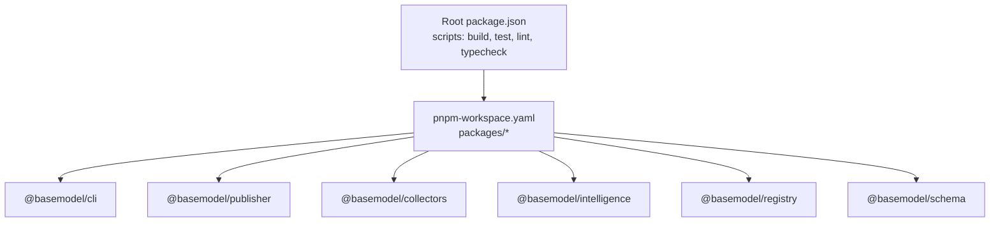
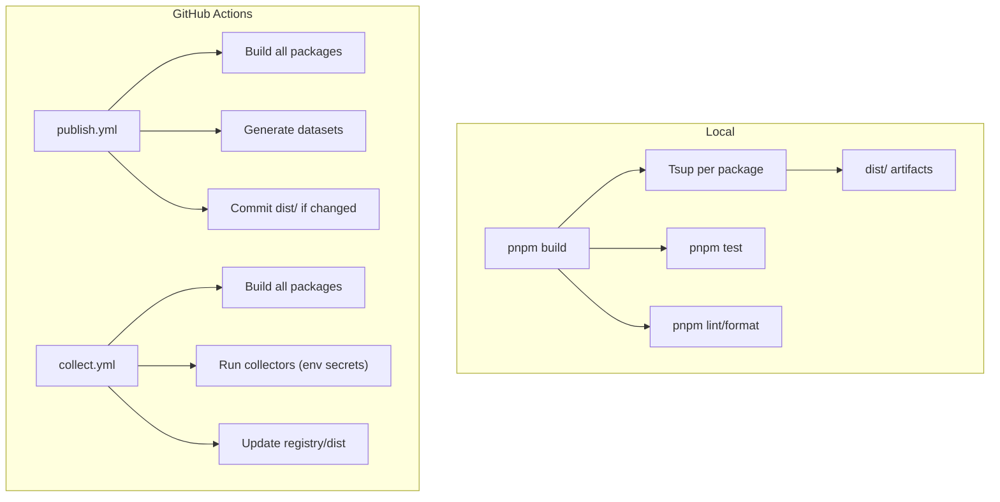
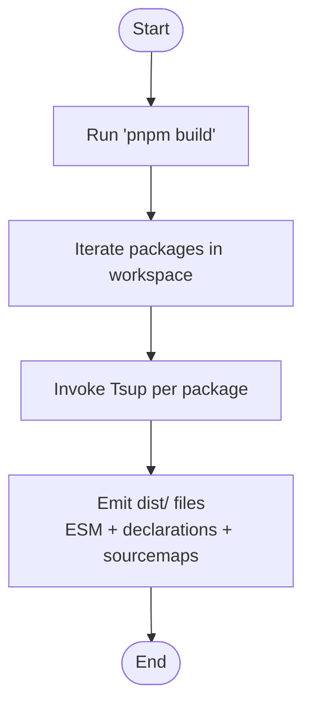
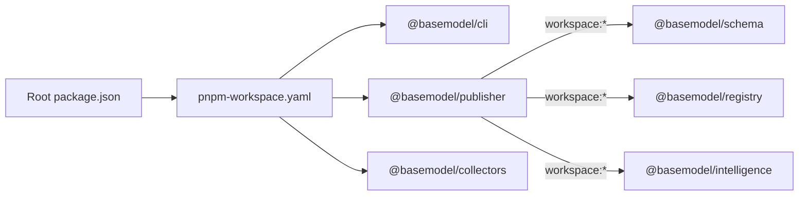
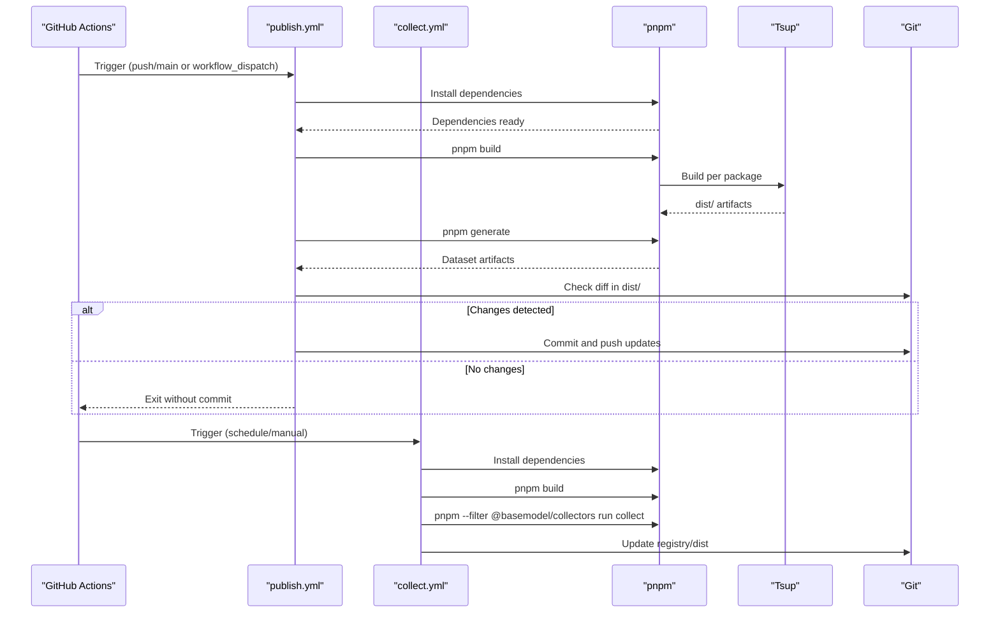
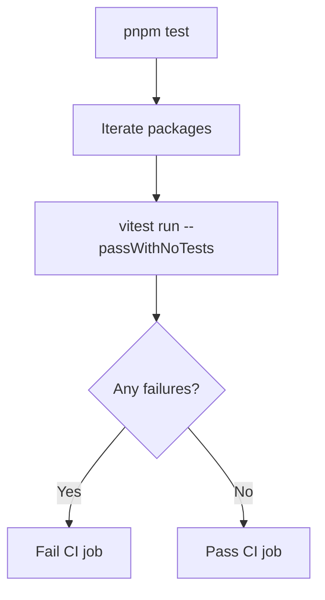
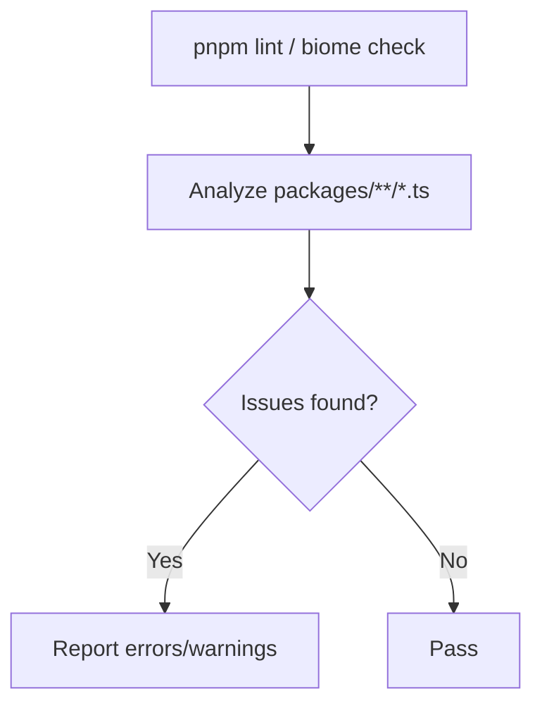
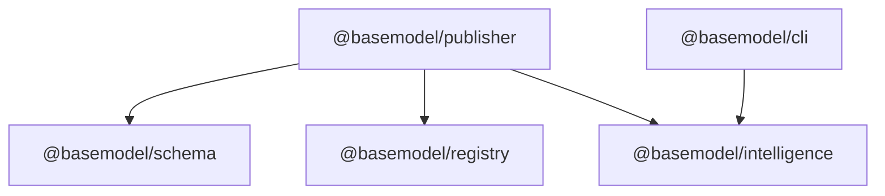

# Build & CI/CD Pipeline

<cite>
**Referenced Files in This Document**
- [package.json](file://package.json)
- [pnpm-workspace.yaml](file://pnpm-workspace.yaml)
- [tsconfig.json](file://tsconfig.json)
- [biome.json](file://biome.json)
- [packages/cli/package.json](file://packages/cli/package.json)
- [packages/publisher/package.json](file://packages/publisher/package.json)
- [packages/collectors/tsconfig.json](file://packages/collectors/tsconfig.json)
- [packages/intelligence/tsconfig.json](file://packages/intelligence/tsconfig.json)
- [packages/registry/tsconfig.json](file://packages/registry/tsconfig.json)
- [packages/publisher/tsconfig.json](file://packages/publisher/tsconfig.json)
- [.github/workflows/publish.yml](file://.github/workflows/publish.yml)
- [.github/workflows/collect.yml](file://.github/workflows/collect.yml)
</cite>

## Table of Contents
1. Introduction
2. Project Structure
3. Core Components
4. Architecture Overview
5. Detailed Component Analysis
6. Dependency Analysis
7. Performance Considerations
8. Troubleshooting Guide
9. Conclusion
10. Appendices

## Introduction
This document explains the build system and continuous integration/deployment pipeline for the monorepo. It covers:
- TypeScript build process using Tsup
- Monorepo build strategy with pnpm workspaces
- Package publishing workflows and artifact generation
- GitHub Actions automation for dataset generation, nightly data collection, and distribution
- Automated testing pipelines, code quality checks, and security considerations
- Local build configuration, performance optimization, and troubleshooting
- Release automation, version management, and distribution channels

## Project Structure
The repository is a pnpm workspace containing multiple packages under packages/. Each package defines its own build, test, and typecheck scripts. The root orchestrates workspace-wide commands.

**Diagram sources**
- [package.json:17-25](file://package.json#L17-L25)
- [pnpm-workspace.yaml:1-3](file://pnpm-workspace.yaml#L1-L3)

**Section sources**
- [package.json:1-31](file://package.json#L1-L31)
- [pnpm-workspace.yaml:1-3](file://pnpm-workspace.yaml#L1-L3)

## Core Components
- Root orchestration:
  - Workspace-wide scripts for build, test, lint, format, typecheck, generate, and clean.
  - Engine constraints ensure Node.js and pnpm versions.
- TypeScript configuration:
  - Shared tsconfig sets target, module, strictness, declaration and sourcemap generation, and output directories.
- Code quality:
  - Biome config enforces linting and formatting rules across TypeScript files.
- Packages:
  - CLI builds an executable entrypoint.
  - Publisher builds ESM artifacts and exposes types.
  - Collectors, Intelligence, Registry, and Schema each extend the shared tsconfig and define their own build/test/typecheck scripts.

**Section sources**
- [package.json:12-25](file://package.json#L12-L25)
- [tsconfig.json:1-27](file://tsconfig.json#L1-L27)
- [biome.json:1-50](file://biome.json#L1-L50)
- [packages/cli/package.json:25-32](file://packages/cli/package.json#L25-L32)
- [packages/publisher/package.json:15-22](file://packages/publisher/package.json#L15-L22)
- [packages/collectors/tsconfig.json:1-8](file://packages/collectors/tsconfig.json#L1-L8)
- [packages/intelligence/tsconfig.json:1-8](file://packages/intelligence/tsconfig.json#L1-L8)
- [packages/registry/tsconfig.json:1-10](file://packages/registry/tsconfig.json#L1-L10)
- [packages/publisher/tsconfig.json:1-9](file://packages/publisher/tsconfig.json#L1-L9)

## Architecture Overview
The build and CI/CD architecture spans local development and GitHub Actions:
- Local development uses pnpm to run workspace scripts that invoke Tsup per package.
- CI automates building all packages, generating datasets, running collectors, and committing updated artifacts back to the repository.

**Diagram sources**
- [package.json:17-25](file://package.json#L17-L25)
- [packages/cli/package.json:25-32](file://packages/cli/package.json#L25-L32)
- [packages/publisher/package.json:15-22](file://packages/publisher/package.json#L15-L22)
- [.github/workflows/publish.yml:1-62](file://.github/workflows/publish.yml#L1-L62)
- [.github/workflows/collect.yml:1-48](file://.github/workflows/collect.yml#L1-L48)

## Detailed Component Analysis

### TypeScript Build Process with Tsup
- Each package uses Tsup to compile TypeScript into ESM artifacts with declarations and sourcemaps where applicable.
- The root build script runs build across all packages via pnpm workspaces.

**Diagram sources**
- [package.json:17-25](file://package.json#L17-L25)
- [packages/cli/package.json:25-32](file://packages/cli/package.json#L25-L32)
- [packages/publisher/package.json:15-22](file://packages/publisher/package.json#L15-L22)
- [tsconfig.json:1-27](file://tsconfig.json#L1-L27)

**Section sources**
- [package.json:17-25](file://package.json#L17-L25)
- [packages/cli/package.json:25-32](file://packages/cli/package.json#L25-L32)
- [packages/publisher/package.json:15-22](file://packages/publisher/package.json#L15-L22)
- [tsconfig.json:1-27](file://tsconfig.json#L1-L27)

### Monorepo Build Strategy and Dependency Resolution
- pnpm workspaces link internal dependencies by workspace protocol, ensuring consistent resolution and fast installs.
- Root scripts delegate to packages; each package declares its own dependencies and scripts.

**Diagram sources**
- [package.json:17-25](file://package.json#L17-L25)
- [pnpm-workspace.yaml:1-3](file://pnpm-workspace.yaml#L1-L3)
- [packages/publisher/package.json:23-27](file://packages/publisher/package.json#L23-L27)

**Section sources**
- [package.json:17-25](file://package.json#L17-L25)
- [pnpm-workspace.yaml:1-3](file://pnpm-workspace.yaml#L1-L3)
- [packages/publisher/package.json:23-27](file://packages/publisher/package.json#L23-L27)

### Artifact Generation and Publishing Workflows
- publish.yml:
  - Triggers on push to main or manual dispatch.
  - Installs dependencies, builds all packages, generates datasets, checks for changes in dist/, and commits/pushes updates.
- collect.yml:
  - Scheduled nightly and manually triggerable.
  - Builds all packages, runs collectors with environment secrets, and updates registry/dist.

**Diagram sources**
- [.github/workflows/publish.yml:1-62](file://.github/workflows/publish.yml#L1-L62)
- [.github/workflows/collect.yml:1-48](file://.github/workflows/collect.yml#L1-L48)
- [package.json:17-25](file://package.json#L17-L25)
- [packages/publisher/package.json:15-22](file://packages/publisher/package.json#L15-L22)

**Section sources**
- [.github/workflows/publish.yml:1-62](file://.github/workflows/publish.yml#L1-L62)
- [.github/workflows/collect.yml:1-48](file://.github/workflows/collect.yml#L1-L48)
- [package.json:17-25](file://package.json#L17-L25)
- [packages/publisher/package.json:15-22](file://packages/publisher/package.json#L15-L22)

### Automated Testing Pipelines
- Each package includes test scripts using Vitest.
- Root test command runs tests across all packages via pnpm workspaces.

**Diagram sources**
- [package.json:17-25](file://package.json#L17-L25)
- [packages/cli/package.json:28-31](file://packages/cli/package.json#L28-L31)
- [packages/publisher/package.json:18-21](file://packages/publisher/package.json#L18-L21)

**Section sources**
- [package.json:17-25](file://package.json#L17-L25)
- [packages/cli/package.json:28-31](file://packages/cli/package.json#L28-L31)
- [packages/publisher/package.json:18-21](file://packages/publisher/package.json#L18-L21)

### Code Quality Checks and Security Scanning
- Linting and formatting are enforced via Biome across TypeScript files.
- Security scanning is not explicitly configured in the provided files; consider adding dependency vulnerability checks and secret scanning in CI.

**Diagram sources**
- [package.json:20-21](file://package.json#L20-L21)
- [biome.json:1-50](file://biome.json#L1-L50)

**Section sources**
- [package.json:20-21](file://package.json#L20-L21)
- [biome.json:1-50](file://biome.json#L1-L50)

### Deployment Automation and Distribution Channels
- Dataset distribution:
  - publish.yml regenerates datasets and commits them to dist/ when changes are detected.
- Registry updates:
  - collect.yml runs collectors and updates registry data.
- NPM publishing:
  - Not present in the current configuration; consider adding a release workflow that publishes packages to npm after successful CI checks.

**Section sources**
- [.github/workflows/publish.yml:1-62](file://.github/workflows/publish.yml#L1-L62)
- [.github/workflows/collect.yml:1-48](file://.github/workflows/collect.yml#L1-L48)

## Dependency Analysis
Internal dependencies are resolved via workspace links, ensuring deterministic builds and minimal duplication.

**Diagram sources**
- [packages/publisher/package.json:23-27](file://packages/publisher/package.json#L23-L27)
- [packages/cli/package.json:33-35](file://packages/cli/package.json#L33-L35)

**Section sources**
- [packages/publisher/package.json:23-27](file://packages/publisher/package.json#L23-L27)
- [packages/cli/package.json:33-35](file://packages/cli/package.json#L33-L35)

## Performance Considerations
- Use pnpm’s workspace linking to avoid redundant installs and speed up builds.
- Keep TypeScript compilation strict but avoid unnecessary transitive checks (skipLibCheck enabled).
- Leverage Tsup’s incremental capabilities and clean outputs to reduce rebuild times.
- Cache node_modules in CI (already configured in workflows).
- Parallelize tasks where possible (pnpm -r runs scripts concurrently by default in many cases).

[No sources needed since this section provides general guidance]

## Troubleshooting Guide
Common issues and resolutions:
- Build fails due to missing dependencies:
  - Ensure pnpm is installed and run pnpm install at the repository root.
- Type errors during build:
  - Run pnpm typecheck per package to isolate issues.
- Lint/format failures:
  - Run pnpm lint:fix to auto-fix where possible.
- CI dataset regeneration not committing:
  - Verify dist/ changes exist; the workflow only commits when diffs are detected.
- Secrets not available in collectors:
  - Add required API keys as GitHub Secrets and reference them in collect.yml environment variables.

**Section sources**
- [package.json:17-25](file://package.json#L17-L25)
- [.github/workflows/collect.yml:44-48](file://.github/workflows/collect.yml#L44-L48)
- [.github/workflows/publish.yml:43-62](file://.github/workflows/publish.yml#L43-L62)

## Conclusion
The repository employs a robust monorepo build system powered by pnpm and Tsup, with clear separation of concerns across packages. GitHub Actions automate dataset generation, nightly data collection, and artifact updates. While npm publishing is not yet configured, the foundation is in place to add release automation. Adopting additional security scans and optimizing build caching will further improve reliability and performance.

[No sources needed since this section summarizes without analyzing specific files]

## Appendices

### Local Build Configuration
- Prerequisites:
  - Node.js >= 20.0.0
  - pnpm >= 9.0.0
- Commands:
  - Install dependencies: pnpm install
  - Build all packages: pnpm build
  - Run tests: pnpm test
  - Lint/format: pnpm lint / pnpm format
  - Typecheck: pnpm typecheck
  - Generate datasets: pnpm generate
  - Clean outputs: pnpm clean

**Section sources**
- [package.json:12-25](file://package.json#L12-L25)

### Version Management and Release Automation
- Current state:
  - Versions are defined per package in package.json.
  - No automated release workflow is present.
- Recommendations:
  - Introduce a release workflow that tags versions, creates GitHub releases, and publishes packages to npm.
  - Use conventional commits and tools like semantic-release or changesets to manage versions consistently.

**Section sources**
- [packages/cli/package.json:1-10](file://packages/cli/package.json#L1-L10)
- [packages/publisher/package.json:1-10](file://packages/publisher/package.json#L1-L10)